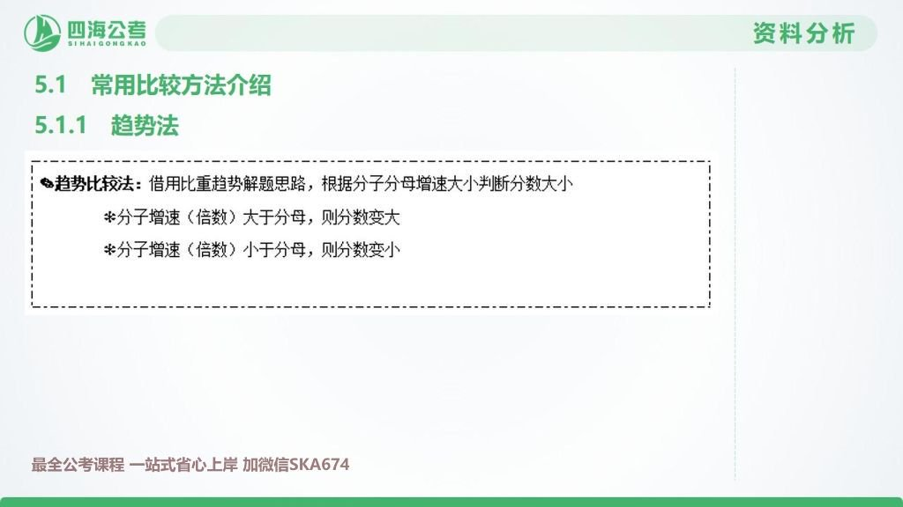
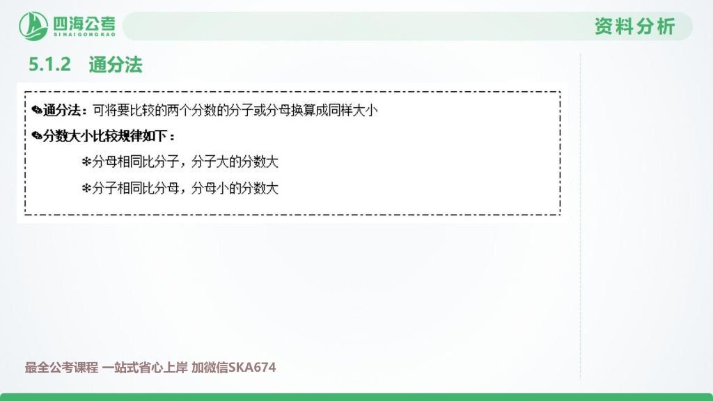

以下为AI生成的图文笔记的内容

#### 一、资料分析第七讲 21:27

##### 1. 比较类知识点 25:15

###### 1）比较类优势 25:18

- 核心功能：主要用于分数的大小比较和排序，不适用于具体数值的直接比较
- 应用场景：当题目需要比较的是比值关系而非绝对值时使用，如增长率、比重等比较

###### 2）分数比较类型 26:02

- 增长率比较：比较不同时期的增长速度

- 比重比较：比较各组成部分占总体的比例

- 基期量比较

  ：比较

  b1+r\frac{b}{1+r}1+rb

  形式的基期数值

- 平均数比较：如人均消费等均值比较

- 增量比较

  ：当给定现期量b和增长率r时，比较

  Δ=b×r1+r\Delta = b \times \frac{r}{1+r}Δ=b×1+rr

  的大小

- 替代比较：通过间接方式比较大小，如取近似值比较

###### 3）常用比较方法

- 趋势法

  - 

  - 基本原理：借鉴比重趋势判断方法，通过比较分子分母增速判断分数变化趋势

  - 判断规则

    ：

    - 当分子增速（倍数）大于分母时，分数变大
    - 当分子增速（倍数）小于分母时，分数变小

  - 应用示例

    ：

    - 比较

      3468\frac{3}{468}4683

      和

      4489\frac{4}{489}4894

      ：分子增长33%，分母增长约4.5%，分子增速快，故后者大

    - 比较

      1621\frac{1}{621}6211

      和

      2986\frac{2}{986}9862

      ：分子增长100%，分母增长约58%，分子增速快，故后者大

  - 适用条件：当分子分母增长率差异明显时特别有效

  - 局限性：当增长率计算复杂时需配合其他方法使用

##### 2. 比较方法介绍 29:05

###### 1）趋势法 29:11

- 例题1：比较分数大小

  - 

  - 分子分母变化规律

    ：当分子增长比例大于分母时，分数值变大；反之则变小。例如

    241341\frac{241}{341}341241

    和

    582679\frac{582}{679}679582

    比较，分子从241到582增长超过100%，分母从341到679增长不到100%，故后者更大。

  - 快速判断技巧

    ：可通过估算增长率判断，若分子增长率

    r1r_1r1

    \>分母增长率

    r2r_2r2

    ，则分数值增大。

- 例题2：判断分数变化趋势 

  30:36

  - 典型变化分析

    ：

    - 4675\frac{46}{75}7546

      →

      117243\frac{117}{243}243117

      ：分母243是75的3倍多（增长200%+），分子117不到46的3倍（增长约154%），分母增长更快→分数值变小

    - 56125\frac{56}{125}12556

      →

      139264\frac{139}{264}264139

      ：分子增长56（<125的一半60+），分母增长139（>131的一半），分子增长慢→分数值变小

  - 百分比估算

    ：当变化量小于10%时，可用10%基准快速判断，如

    7379\frac{73}{79}7973

    →

    80108\frac{80}{108}10880

    ，分子增长约9.6%（<10%），分母增长36.7%（>20%），分子增长慢→分数值变小

- 例题3：分数变化趋势的实际应用 

  31:27

  - 核心原则：比较分子分母的相对变化速度，分子增速快则分数值增大，分母增速快则分数值减小

  - 注意事项

    ：当变化量很小时（如

    501327\frac{50}{1327}132750

    →

    521340\frac{52}{1340}134052

    ，分子增长4%，分母增长约10%），仍需严格比较增长率差异

###### 2）通分法 33:31

- 通分法的基本概念 

  33:38

  - 

  - 基本原理

    ：通过将分子或分母化为相同值进行比较

    - 分母相同时，分子大的分数更大
    - 分子相同时，分母小的分数更大

  - 基础示例

    ：

    13\frac{1}{3}31

    \>

    14\frac{1}{4}41

    （分子相同）；

    23\frac{2}{3}32

    \>

    13\frac{1}{3}31

    （分母相同）

- 例题1: 分数大小比较 

  34:08

  - 

  - 常规解法

    ：

    - 28164\frac{28}{164}16428

      vs

      39329\frac{39}{329}32939

      ：前者可看作

      56328\frac{56}{328}32856

      ，分母相近时分子大的更大

    - 471\frac{4}{71}714

      vs

      8159\frac{8}{159}1598

      ：将前者分子×2得

      8142\frac{8}{142}1428

      ，分母小的更大

  - 灵活应用

    ：

    143171\frac{143}{171}171143

    vs

    80171\frac{80}{171}17180

    可通过调整分子比较，如前者扩大20%得

    171.6205.2\frac{171.6}{205.2}205.2171.6

    ≈

    8095.8\frac{80}{95.8}95.880

    ，显然后者分母更小

###### 3）王者荣耀法 36:32

- 王者荣耀法介绍

  - 核心思想：将分数拆分为基准部分和剩余部分，类似盐水混合问题
  - 适用场景：快速判断分数与常见比例（如25%、50%、75%）的大小关系

- 王者荣耀法原理：盐水思想 

  36:49

  - 典型示例

    ：

    31076208\frac{3107}{6208}62083107

    可拆分为

    31046208\frac{3104}{6208}62083104

    （50%）+

    38\frac{3}{8}83

    （37.5%），整体略高于50%

  - 变化影响：当基准部分占比极大时，剩余部分对整体影响微弱

- 王者荣耀法的应用场景 

  38:04

  - 使用条件：基准部分必须易于计算（如50%、25%、75%等）
  - 典型应用：综合分析题中快速验证比例关系

- 练习1：判断北方同学占比 

  38:53

  - 

  - 解题过程

    ：5412人中2701北方→

    2700+15400+12\frac{2700+1}{5400+12}5400+122700+1

    ，基准50%与剩余

    112\frac{1}{12}121

    （8.3%）混合，整体略低于50%

  - 结论："超过50%"的说法错误

- 练习2：判断数量占比 

  39:42

  - 

  - 解题过程

    ：6342本中2126数量→

    2100+266300+42\frac{2100+26}{6300+42}6300+422100+26

    ，基准

    13\frac{1}{3}31

    与剩余

    2642\frac{26}{42}4226

    （≈62%）混合，整体略高于

    13\frac{1}{3}31

  - 结论："超过1/3"的说法正确

- 练习3：判断男同学占比 

  40:23

  - 

  - 解题过程

    ：962人中631男→

    640−9960+2\frac{640-9}{960+2}960+2640−9

    ，基准

    23\frac{2}{3}32

    与剩余

    −9+2\frac{-9}{+2}+2−9

    混合，整体略低于

    23\frac{2}{3}32

  - 结论："超过2/3"的说法错误

- 例题1：2016年H市货物出口总额占比 

  41:25

  - 

  - 解题思路

    ：3313.80/4485.97≈

    3300+134400+85\frac{3300+13}{4400+85}4400+853300+13

    ，基准75%与剩余

    1385\frac{13}{85}8513

    （≈15%）混合

  - 结果判断：剩余部分拉低整体，略低于75%，选A（74%）

- 例题2："十三五"期间人口城镇化率超过60%的年份数量 

  43:04

  - 

  - 关键分析

    ：将总人口视为140（单位：百万），60%对应84（百万）

    - 2016年：81.924<84（不满足）
    - 2017-2020年：城镇人口均>84（满足）
    - 2021年：虽91.425>84，但不属于"十三五"期间

  - 易错点：时间段误判（2016-2020年）和2021年数据干扰

  - 正确答案：B（3个年份）

###### 4）双线法 46:17

- 双线法：增速大小比较

  - 核心原理 

    46:23

    - 比较本质：将数值比较转化为直观的图形比较，通过两条线（分子变化线和分母变化线）的走势关系判断增速大小

    - 核心公式

      ：增速

      r=xar=\frac{x}{a}r=ax

      ，其中x为增量（

      b−ab-ab−a

      ），a为基期量

    - 操作步骤

      ：

      - 计算各年份增量x（建议保留三位数）
      - 观察基期量a的变化趋势（通常持续上升）
      - 绘制分子变化线和分母变化线，通过两线距离变化判断增速关系

  - 典型应用场景 

    47:02

    - 适用条件：当基期量a呈现单调变化趋势时效果最佳（如持续上升）

    - 比较技巧

      ：

      - 分子下降+分母上升 → 增速必然减小（两线距离缩短）
      - 分子不变+分母上升 → 增速减小
      - 分子增幅小于分母增幅 → 增速减小

- 例题解析

  - 例题3：体育场地面积增速比较

    - 

    - 解题步骤

      ：

      - 计算增量x：2019年32（29.1-25.9），2020年18，2021年32，2022年29
      - 观察基期量持续上升
      - 排除法：
        - 2019 vs 2020：分子降（32→18）+分母升 → 2020年排除
        - 2021 vs 2022：分子降（32→29）+分母升 → 2022年排除
        - 2019 vs 2021：分子相同（32）+分母升 → 2021年排除

    - 答案：A（2019年）

    - 速算技巧：当出现"分子下降+分母上升"组合时可直接排除后者

  - 例题4：卫星产业收入增速比较

    - 

    - 关键数据

      ：

      - 增量x：2014年16，2015年8，2017年9，2018年8
      - 基期量持续上升

    - 比较过程

      ：

      - 2014年增量最大（16）且后续年份均小于其一半
      - 其他年份均满足"分子小于2014年+分母上升"的组合

    - 答案：A（2014年）

    - 注意事项：当某年增量显著大于其他年份时，可直接作为候选答案

  - 例题5：移动电话基站增速比较 

    57:00

    - 图形分析法

      ：

      - 肉眼观察柱状图增量变化：2015年增量柱明显高于其他年份
      - 基期量持续上升
      - 排除2016-2018年（增量递减）

    - 精确计算验证

      ：

      - 2015年：

        115351≈32.8%\frac{115}{351}≈32.8\%351115≈32.8%

      - 2019年：

        174667≈26.1%\frac{174}{667}≈26.1\%667174≈26.1%

    - 答案：A（2015年）

    - 方法选择：优先图形直观比较，存疑时选择关键年份计算验证

- 方法总结

  - 适用题型特征：多年度增速比较题，基期量呈单调变化

  - 操作口诀

    ：

    - 先算增量x值
    - 再看基期a趋势
    - 双线变化定大小
    - 特殊组合快排除

  - 易错提醒

    ：

    - 必须确认基期量的单调性
    - 当增量接近时需要精确计算
    - 柱状图比较时注意纵坐标比例

- 斜率与增长率的关系 

  01:05:23

  - 

  - 核心区别：斜率表示的是量的变化（增量），而非增长率。例如当三点坐标分别为(0,5)、(1,10)、(2,15)时，斜率相同（增量为5），但增长率从100%（5→10）下降到50%（10→15）

  - 数学表达

    ：设斜率为k，则

    k=ΔyΔxk=\frac{\Delta y}{\Delta x}k=ΔxΔy

    表示增量；而增长率

    r=Δyy0×100%r=\frac{\Delta y}{y_0}\times100\%r=y0Δy×100%

  - 常见误区：图形中直线斜率相同不代表增长率相同，这是考生常混淆的概念

  - 记忆口诀："斜率看增量，增长看比率"（字幕原文强调"斜率代表的是增量，不是r"）

- 例题6：2019-2021年我国人口男女性别比排序 

  01:07:18

  - 

  - 解题方法

    ：采用分子分母比较法

    - 原则1：分子最大且分母最小时，分数值最大
    - 原则2：分子最小且分母最大时，分数值最小

  - 具体分析

    ：

    - 2020年：男性人口72357万（三者最大）vs女性68855万（三者最小）→性别比最大
    - 2019年：男性72039万（最小）vs女性68969万（最大）→性别比最小
    - 2021年：各项居中→性别比居中

  - 答案验证：降序排列应为2020年>2021年>2019年，对应选项D

  - 易错提示：78%正确率表明需注意避免单纯比较分子或分母的单一维度

- 例题7：2017-2021年重庆市城镇与农村人均可支配收入之比最小的年份 

  01:09:30

  - 

  - 解题方法：趋势分析法

    - 核心原理

      ：比较分数

      城镇收入农村收入\frac{城镇收入}{农村收入}农村收入城镇收入

      的年度变化时，通过分析分子（城镇）和分母（农村）的增长速度来判断分数变化趋势

    - 判断规则

      ：

      - 分子增长快于分母 → 分数值变大
      - 分子增长慢于分母 → 分数值变小

    - 速算技巧：忽略后两位数，比较前三位数的增长百分比

  - 具体计算过程

    - 2018→2019年比较

      ：

      - 分子增长：348→379（增长31），增长率<10%（因348的10%为34.8>31）
      - 分母增长：137→151（增长14），增长率>10%（137的10%为13.7<14）
      - 结论：分数值变小

    - 2019→2020年比较

      ：

      - 分子增长：379→400（增长21），增长率<7%（21÷3.79≈5.5个"包子"）
      - 分母增长：151→163（增长12），增长率≈8%（12÷1.5=8个"包子"）
      - 结论：分数值继续变小

    - 2020→2021年比较

      ：

      - 分子增长：400→435（增长35），增长率<10%
      - 分母增长：163→181（增长18），增长率>10%
      - 结论：分数值持续变小

  - 解题要点

    - 选项排除法：当确认2019年比值小于2018年后，可直接排除含2018年的选项
    - 敏感性训练：需快速判断数值是否超过10%的临界点（如137的10%是13.7）
    - 方法优势：相比精确计算，趋势法能更快锁定答案，特别适合选项为连续年份的比较题

  - 易错提醒

    - 分数构建：必须严格保持城镇收入为分子，农村收入为分母
    - 数据选择：只需比较选项涉及的年份，无需计算全部年份（如本题不需计算2017年）
    - 单位统一：注意统计图中单位是"元"，但比较时只需关注相对变化率

  - 答案确认

    - 最终结论：通过连续三年比较，比值呈现持续下降趋势，因此2021年为最小值
    - 正确答案：D选项（题目中未完整显示，根据分析应为2021年）

- 例题8：2021年第一季度食品抽检合格率排序 

  01:17:07

  - 

  - 合格率计算方法

    - 核心公式：合格率 = 合格量/抽检量，计算时保留前三位有效数字即可

    - 拆分技巧

      ：当合格率接近100%时，可用

      1−不合格量抽检量1-\frac{不合格量}{抽检量}1−抽检量不合格量

      计算，如肉制品

      1−18104−1777918104=1−325181041-\frac{18104-17779}{18104}=1-\frac{325}{18104}1−1810418104−17779=1−18104325

    - 近似处理

      ：对于

      1777918104\frac{17779}{18104}1810417779

      可视为

      1−41811-\frac{4}{181}1−1814

      （将325近似为400，18104近似为18100）

  - 具体产品计算过程

    - 肉制品

      ：

      - 原始数据：抽检18104批次，合格17779批次
      - 计算：17779/18104≈1-4/181≈98%-
      - 关键点：每个"包子"（单位量）价值1.81，4个包子价值7.24，实际不合格325对应约3.6个包子

    - 乳制品

      ：

      - 原始数据：抽检8704批次，合格8690批次
      - 计算：8690/8704≈1-1/870≈99.8%+
      - 关键点：每个包子价值8.7，减去的0.1个包子对应0.87，实际减14对应约0.16个包子

    - 蛋制品

      ：

      - 原始数据：抽检1185批次，合格1182批次
      - 计算：1182/1185≈1-3/1185≈99.7%+
      - 关键点：减去的3对应不到0.3%（因为0.1%是1.185）

  - 排序结果与注意事项

    - 正确排序：乳制品(99.8%) > 蛋制品(99.7%) > 肉制品(98%-)

    - 易错警示

      ：

      - 注意题目要求的排序方向（从高到低/从低到高）
      - 避免直接比较不合格率导致顺序颠倒
      - 特别注意数量级：如3/1185是0.3%不是3%

- 替代比较方法

  - 年均增长率替代法

    - 原理：当年限相同时，直接比较末期/基期可替代年均增长率比较

    - 公式依据

      ：年均增长率公式

      末期/基期=(1+r)n末期/基期=(1+r)^n末期/基期=(1+r)n

      ，当n相同时比较左边即可

    - 适用场景：如比较不同行业10年间工资年均增速，直接比较2019/2009的比值

  - 例题9：城镇私营单位工资增速比较

    - 

    - 解题步骤

      ：

      - 定位四个选项在表格中的位置（私营单位列）
      - 直接计算2019年值/2009年值：
        - 科学研究：67642/26187≈2.58
        - 信息传输：85301/28166≈3.03
        - 金融业：76107/30452≈2.50
        - 建筑业：54167/19867≈2.73

    - 结果判定：信息传输比值唯一>3，故选B

    - 技巧验证：28×3=84<85.3，确认比值确实超过3倍

  - 倍数替代增速比较法

    - 原理：当现期/基期倍数悬殊时，直接用B/A代替(B/A-1)比较增速
    - 适用条件：基期与现期数值差距较大（通常相差3倍以上）
    - 优势：避免做无意义的减法步骤，简化计算过程

  - 例题10：锂电池出货量增速比较

    - 

    - 数据提取

      ：

      - A选项(2021储能)：47.7/16.2
      - B选项(2021动力)：226/80
      - C选项(2022储能)：130/47.7
      - D选项(2022动力)：480/226

    - 比较方法

      ：

      - 计算各选项现期/基期比值
      - 通过拆分法判断：
        - A选项：47.7×3=143.1，16.2×3=48.6→实际≈2.94
        - B选项：226×3=678>480→实际<3
        - C选项：47.7×3=143.1>130→实际<3
        - D选项：226×2=452<480→实际≈2.12

    - 结论：A选项比值最大，对应增速最快

  - 方法选择原则

    - 常规情况

      ：当增长率较小时（<100%），使用

      r=(B−A)/Ar=(B-A)/Ar=(B−A)/A

    - 悬殊情况

      ：当增长率较大时（>100%），直接比较

      B/AB/AB/A

    - 判断标准：若做减法后仍难以直观比较，则采用倍数替代法

#### 二、资料分析 01:36:56

##### 1. 例题11#对外贸易比重比较

###### 1）题目分析

- 
- 核心问题：判断出口额占进出口总额比重最大的年份
- 数据特征：题目给出2011-2015年出口额和进口额数据，2016年给出进出口总值和分项值

###### 2）替代比较方法 01:39:46

- 原理推导

  ：当比较

  aa+b\frac{a}{a+b}a+ba

  与

  cc+d\frac{c}{c+d}c+dc

  时，可通过比较

  ab\frac{a}{b}ba

  与

  cd\frac{c}{d}dc

  来保持大小关系一致

- 应用场景：适用于比较占比大小但避免复杂计算的场合

- 数学证明

  ：

  - 原式

    a1a1+b1>a2a2+b2\frac{a_1}{a_1+b_1} > \frac{a_2}{a_2+b_2}a1+b1a1>a2+b2a2

  - 取倒数得

    1+b1a1<1+b2a21+\frac{b_1}{a_1} < 1+\frac{b_2}{a_2}1+a1b1<1+a2b2

  - 化简得

    a1b1>a2b2\frac{a_1}{b_1} > \frac{a_2}{b_2}b1a1>b2a2

###### 3）具体计算过程 01:43:31

- 

- 替代计算

  ：

  - 2013年：67.57/190.96 ≈ 35.4%
  - 2014年：57.78/206 ≈ 28.0%
  - 2015年：46.54/142.84 ≈ 32.6%
  - 2016年：420568/1423678 ≈ 29.5%

- 关键判断：2013年比值唯一超过1/3（33.3%），其余年份均低于基准线

- 答案验证

  ：通过常规计算

  出口出口+进口\frac{出口}{出口+进口}出口+进口出口

  验证大小关系不变

- 易错提醒：注意分子分母对应关系，避免比反方向

##### 2. 例题12#环保举报受理率 01:56:25

###### 1）题目分析

- 题干要求：判断下半年受理率超过75%的月份数量
- 数据特点：需处理受理量与未受理量的比值关系

###### 2）替代比较应用 01:59:10

- 转化逻辑：受理率>75%等价于受理量>3×未受理量

- 计算技巧

  ：

  - 直接比较受理量/3与未受理量
  - 或比较受理量与未受理量×3

- 优势说明

  ：避免计算

  受理受理+未受理\frac{受理}{受理+未受理}受理+未受理受理

  的复杂除法

###### 3）倍数关系判断 01:59:56

- 判定标准：当白色柱（受理量）÷3 > 黑色柱（未受理量）时满足条件

- 实例验证

  ：

  - 7月：30932÷3≈10311 > 9361 → 符合
  - 8月：其他月份同理计算

- 结果统计：共5个月份满足3倍关系

- 原理强调：75%占比对应部分与剩余部分需满足3:1的比例关系

##### 3. 替代比较总结 02:01:06

###### 1）四种替代方法 02:01:13

- 

- 末期比基期替代

  ：用

  ba\frac{b}{a}ab

  代替年均增长率的比较，其中b为末期值，a为基期值

- 部分比部分替代

  ：用

  ab\frac{a}{b}ba

  代替

  aa+b\frac{a}{a+b}a+ba

  （部分比整体），两者大小关系一致

- 增量比本期替代

  ：用

  xb\frac{x}{b}bx

  代替

  xa\frac{x}{a}ax

  比较增速大小（b=a+x），可避免计算基期值

- 数学原理

  ：当

  x1b1>x2b2\frac{x_1}{b_1} > \frac{x_2}{b_2}b1x1>b2x2

  时，通过倒数变换可证明

  x1a1>x2a2\frac{x_1}{a_1} > \frac{x_2}{a_2}a1x1>a2x2

  成立

###### 2）方法应用总结 02:10:26

- 
- 适用条件：仅适用于比较大小关系，不适用于精确计算；当给定本期值b和增量x时最有效
- 注意事项：默认处理增长率为正的情况，若出现负增长需回归常规计算方法
- 效率优势：可减少4个分母的减法运算，特别适合多选项比较题

###### 3）典型例题解析

- 

- 解题步骤

  ：

  - 失业保险：2.42/292≈0.8%
  - 工伤保险：18.55/557≈3.3%
  - 城镇职工保险：70.52/1167≈6%
  - 城乡居民保险：189.1/2077≈9%

- 技巧应用：直接使用x/b比较，避免计算a=b-x

- 答案：D（城乡居民基本养老保险）

- 

- 特殊考法：注意题目要求"第二高"而非最大值

- 速算对比

  ：

  - 油料：366/11496≈3.2%
  - 糖料：13/144≈9%
  - 烤烟：871/33536≈2.6%
  - 蔬菜：4893/62955≈7.8%

- 答案：D（蔬菜与食用菌）

##### 4. 例题15#软件业务收入增速 02:12:20

###### 1）题目分析

- 
- 题型特征：判断同比增速是否超过特定百分比（本题为15%）的年份数量
- 数据特点：给出2013-2020年连续年份的业务收入数据，需计算相邻年份增量

###### 2）增量拆解方法 02:16:19

- 核心原理：将15%增速判断拆解为基期值的10%+5%比较

- 操作步骤

  ：

  - 计算各年增量

    An−An−1A_{n}-A_{n-1}An−An−1

  - 取基期值的10%（去尾法估算）

  - 判断剩余增量是否超过基期值的5%（即10%的一半）

- 实例演示

  ：

  - 2018年案例：增量68=55（基期551的10%）+13，因13<55/2，故增速<15%
  - 2020年案例：增量101=62+39，因39>62/2，故增速>15%

- 方法扩展：判断其他百分比（如11%）时，同理拆分为10%+1%进行比较

- 记忆要点

  ：增量=基期×增长率（

  An−An−1=An−1×rA_{n}-A_{n-1}=A_{n-1}×rAn−An−1=An−1×r

  ），通过拆分避免完整计算

##### 5. 例题16#住宅用地增速折线 02:17:36

###### 1）题目分析

- 
- 题型特征：选择正确反映增速变化趋势的折线图
- 数据特点：给出住宅用地各年绝对数值，需计算同比增速

###### 2）折线图特征判断 02:18:57

- 快速排除法

  ：

  - 观察终点特征：2022年数值下降（10.1→7.9），排除终点上升的选项
  - 对比中间趋势：2019-2020年上升，2020-2022年持续下降

- 精确计算法

  （复杂情况使用）：

  - 2019年增速：

    −4109≈−4%\frac{-4}{109}≈-4\%109−4≈−4%

  - 2020年增速：

    10105≈10%\frac{10}{105}≈10\%10510≈10%

  - 2021年增速：

    −14115≈−12%\frac{-14}{115}≈-12\%115−14≈−12%

  - 2022年增速：

    −22101≈−22%\frac{-22}{101}≈-22\%101−22≈−22%

- 图形验证要点

  ：

  - 下降幅度应逐次增大（4%→12%→22%）
  - 相邻线段斜率变化要符合实际增速差

- 解题技巧：优先使用特征点排除法，复杂情况再辅以关键年份计算验证

##### 6. 增量大小比较 02:21:04

###### 1）比较原则

- 

- 公式基础

  : 增量计算公式为

  X=B×r1+rX = B \times \frac{r}{1+r}X=B×1+rr

  ，可变形为

  B×(1−11+r)B \times (1 - \frac{1}{1+r})B×(1−1+r1)

- 口诀1（大大则大）

  :

  - 当B和r都更大时，增量X必然更大

  - 适用于负数情况：比较绝对值，如

    B1=627,r1=−4.2%B_1=627,r_1=-4.2\%B1=627,r1=−4.2%

    vs

    B2=621,r2=−3.9%B_2=621,r_2=-3.9\%B2=621,r2=−3.9%

    ，前者下降更多

- 口诀2（一大一小看倍数）

  :

  - 当B较大但r较小时，比较倍数关系

  - 判断标准：若B是对方的x倍，而r是对方的

    1/y1/y1/y

    倍，则当

    x>yx>yx>y

    时增量更大

  - 例：

    B1=632,r1=7.8%B_1=632,r_1=7.8\%B1=632,r1=7.8%

    vs

    B2=306,r2=14%B_2=306,r_2=14\%B2=306,r2=14%

    ，前者B是2.06倍，后者r是1.79倍，故第一组增量更大

- 特殊情况处理

  :

  - 负增长率直接比较绝对值
  - 下降量比较："更大"指下降更多（负得更多）

###### 2）例题17#出口金额增长值 02:27:20

- 

- 题目解析

  - 解题步骤

    :

    - 排除法：木地板金额下降25.9%直接排最后

    - 胶合板(

      B=55.56,r=9%B=55.56,r=9\%B=55.56,r=9%

      ) vs 纤维板(

      B=38.35,r=6.2%B=38.35,r=6.2\%B=38.35,r=6.2%

      )

    - 应用"大大则大"原则，胶合板B和r均更大

  - 答案: B（胶合板>纤维板>木地板）

  - 技巧提示: 出现负增长选项优先排最后

###### 3）例题18#保险赔付增量 02:28:59

- 

- 题目解析

  - 选项分析

    :

    - 先排除寿险（下降12.3%）

    - 健康险(

      B=82.2,r=30.8%B=82.2,r=30.8\%B=82.2,r=30.8%

      ) vs 意外险(

      B=19.81,r=30.5%B=19.81,r=30.5\%B=19.81,r=30.5%

      )，前者完胜

    - 财产险(

      B=271.62,r=16.2%B=271.62,r=16.2\%B=271.62,r=16.2%

      ) vs 健康险：B是3.3倍，r是0.53倍，3.3>0.53故财产险更大

  - 答案: A（财产险）

  - 易错点: 注意健康险与意外险的B值差距达4倍，无需精确计算

###### 4）例题19#进口额增量排序 02:30:46

- 

- 题目解析

  - 排序逻辑

    :

    - 海南（负增长）必然最小

    - 深圳(

      B=2064.7,r=58.9%B=2064.7,r=58.9\%B=2064.7,r=58.9%

      )绝对最大

    - 剩余三者比较：

      - 汕头(

        B=23.8,r=11%B=23.8,r=11\%B=23.8,r=11%

        )最小（与珠海、厦门比B差10+倍）

      - 珠海(

        B=186.3,r=21.5%B=186.3,r=21.5\%B=186.3,r=21.5%

        ) vs 厦门(

        B=424,r=5.8%B=424,r=5.8\%B=424,r=5.8%

        ):

        - B倍数：424/186.3≈2.28倍
        - r倍数：21.5/5.8≈3.71倍
        - 3.71>2.28故珠海>厦门

  - 答案: C（汕头<珠海<厦门<深圳，海南另计）

  - 速判技巧: 深圳数据显著异常大可直接锁定包含它的选项

###### 5）例题20#纺织品进口增量 02:34:26

- 

- 题目解析

  - 排序要点

    :

    - 正增长组：东盟(

      B=491.2,r=24.9%B=491.2,r=24.9\%B=491.2,r=24.9%

      ) > 美国(

      B=563.5,r=4%B=563.5,r=4\%B=563.5,r=4%

      )

      - 虽然美国B略大，但东盟r是6.2倍

    - 负增长组：日本(

      B=200.3,r=−7.2%B=200.3,r=-7.2\%B=200.3,r=−7.2%

      ) > 欧盟(

      B=469.9,r=−11.1%B=469.9,r=-11.1\%B=469.9,r=−11.1%

      )

      - 欧盟下降更多（绝对值更大）

  - 答案: D（东盟>美国>日本>欧盟）

  - 核心考点: 负增量排序时，下降更多（负得更多）的排后面

##### 7. 差值变化分析 02:36:57

###### 1）例题21#贸易顺差变化

- 

- 追及问题核心思想：通过比较两个量的增量大小来判断它们之间差值的变化趋势。类似两人跑步，领先者跑得更快时差距会拉大，落后者跑得更快时差距会缩小。

- 贸易顺差判断方法

  ：

  - 贸易顺差=出口额-进口额
  - 若出口增量>进口增量，则顺差扩大（差距拉大）
  - 若出口增量<进口增量，则顺差缩小（差距缩小）

- 实例分析

  ：

  - 2021年8月数据：出口1.9万亿元（环比+4.9%），进口1.53万亿元（环比+5.1%）
  - 出口基期≈1.9/1.049≈1.81，进口基期≈1.53/1.051≈1.46
  - 出口增量≈1.9-1.81=0.09，进口增量≈1.53-1.46=0.07
  - 出口增量更大→顺差扩大（与A选项"减小"矛盾）

- 记忆口诀："高者更高差距大，矮者猛追差距小"，类似姚明（高）和潘长江（矮）的身高变化比喻

###### 2）例题22#贸易顺差判断 02:43:40

- 

- 增量比较技巧

  ：

  - 先比较基期量倍数关系：出口43045亿元 vs 进口30700亿元，约1.4倍
  - 再比较增长率倍数：进口增速26.8% vs 出口增速12.1%，约2.2倍
  - 综合判断：进口增量更大（基数虽小但增速优势明显）

- 结论推导

  ：

  - 进口增量>出口增量→贸易顺差应缩小
  - 题干称"顺差增加"与事实相反→选项D错误（题目要求选不能推出的选项）

- 易错提醒

  ：

  - 注意区分比较对象（本题易错看全国数据而非一带一路数据）
  - 增长率比较时需结合基数，不能只看百分比大小

##### 8. 查找比较计算 02:46:37

###### 1）解题原则

- 分步操作原则

  ：

  - 先完整提取题目要求（找什么+算什么）
  - 立即标记关键数据（避免"马冬梅效应"反复查看题干）
  - 按步骤执行计算

- 操作要点

  ：

  - 用笔圈出题目中的两个核心要素：查找对象和计算要求
  - 完成查找后立即进行相关计算，不要返回重读题干
  - 类似"先买菜再做饭"的顺序不可颠倒

###### 2）例题23#新设企业占比 02:48:06

- 

- 解题步骤

  ：

  - 定位目标：找出新设企业数前三的行业（文化艺术服务18586户、文化创意和设计服务4850户、工艺美术品的生产1651户）
  - 计算总和：18586+4850+1651≈25000户
  - 计算占比：25000/30323≈82.9%（选项D）

- 速算技巧

  ：

  - 首位估算：18+4=22，再加1.6≈24，与30相比明显>75%
  - 排除法：24/30=80%，实际分子更大→直接锁定D选项

- 注意事项

  ：

  - 严格按题目时间要求（2015年新设企业）
  - 区分"年末总数"与"新设数"两列数据
  - 表格阅读时注意单位统一（均为"户"）

##### 9. 知识体系总结 02:50:24

###### 1）比较方法分类

- 

- 替代比较法

  :

  - 末期/基期代替年均增长率

  - B/AB/AB/A

    代替

    X/AX/AX/A

  - A/∃EAA/\exists EAA/∃EA

    代替

    A/整体A/整体A/整体

    或

    A/整体A/整体A/整体

    代替

    A/非AA/非AA/非A

  - X/BX/BX/B

    代替

    X/AX/AX/A

- 比值大小比较

  :

  - 增数大小比较：使用双线法
  - 基期大小比较：可采用趋势法、通分法、拆分法
  - 比重大小比较：同基期比较方法
  - 平均数大小比较：同基期比较方法

- 增量大小比较

  :

  - 口诀1：大大则大，b越大r越大则x越大
  - 口诀2：一大一小看倍数。例如：b是对方的2.1倍，r是对方的1.5倍，则2.1>1.5，增量更大

###### 2）资料分析体系 02:52:25

- 学习三阶段

  :

  - 看山是山：所有题目感觉相似，难以区分题型
  - 看山不是山：能区分不同题型（如比值增长率、比重差、盐水类等）
  - 看山又是山：理解各类题型本质相同，都是考去年/现期/相对变化/绝对变化

- 核心考点分类

  :

  - ABRX类

    :

    - 去年：基期、隔年基期

    - 今年/未来：假设增速、假设增量求后期

    - 相对变化：一般增长率、间隔增长率

    - 绝对变化

      ：增量

      x=b−ax=b-ax=b−a

      、增量倍数、整体增量

  - 比重类

    :

    - 去年：基期比重
    - 现期：现期比重（部分/整体）、比重差、隔级比重
    - 相对变化：乘积增长率、比值增长率（实际统计中一般不单独求）
    - 绝对变化：比重差（百分点变化）、比重趋势（变大变小判断）

  - 平均数类

    :

    - 去年：基期平均数（公式同基期比重）
    - 现期：一般平均数
    - 相对变化：比值增长率（平均数增长率）
    - 绝对变化：比值差

  - 倍数类

    :

    - 去年：基期倍数
    - 现期：一般倍数
    - 趋势：倍数趋势判断（变大变小）

  - 乘积类

    :

    - 现期：一般乘法

    - 相对变化：乘积增长率

    - 绝对变化

      ：

      ab−ab′ab-ab'ab−ab′

      （乘法差）

- 特殊考点

  :

  - 盐水问题：属于混合思维，不同于常规计算类题目。研究整体与两部分混合的关系。

- 本质规律

  :

  - 所有题型本质上都是考查：去年/现期/相对变化/绝对变化四种形式
  - 不同题型公式可通用（如比重差公式适用于所有比值差）
  - 比重、平均数、倍数都是比值的特殊形式，考法相通

###### 3）例题：文化及相关产业占比计算

- 

- 题目解析

  - 审题要点：计算新设企业数前三行业占比

  - 解题步骤

    ：

    - 从表格中找出新设企业数最多的三个行业
    - 计算三个行业新设企业数总和
    - 用总和除以全市新设企业总数（30323户）

  - 易错点：注意区分"年末企业总数"和"新设企业数"两列数据

  - 答案：根据选项应为76.1%（需具体计算验证）

#### 三、知识小结

| 知识点            | 核心内容                                           | 考试重点/易混淆点                                  | 难度系数 |
| ----------------- | -------------------------------------------------- | -------------------------------------------------- | -------- |
| 比较类方法        | 趋势法、通分法、双线法、替代比较                   | 趋势法适用于分子分母增长率对比，双线法用于增速比较 | ⭐⭐⭐      |
| 比值大小比较      | 增速、比重、基期等比值比较                         | 注意正负号对比较结果的影响，替代比较的适用场景     | ⭐⭐       |
| 增量大小比较      | 大大则大原则、一大一小看倍数                       | 增量比较需考虑符号（正增/负减），极端情况罕见      | ⭐⭐⭐⭐     |
| 替代比较          | 末期比基期、b比a代替x比a、部分比部分代替部分比整体 | 适用于年均增长率、分数比较等场景，简化计算         | ⭐⭐⭐      |
| 盐水法/王者荣耀法 | 用于判断浓度或胜率对整体影响                       | 适用于综合分析题中的比例判断                       | ⭐⭐       |
| 思维体系三阶段    | 看山是山→看山不是山→看山又是山                     | 资料分析题型本质相通，需先分类再融会贯通           | ⭐⭐⭐⭐     |
| 乘积与比值增长率  | 乘积增长率与比值增长率的联系与区别                 | 比重差公式可推广到其他比值差计算                   | ⭐⭐⭐      |
| 查找比较题技巧    | 分段审题避免“马冬梅效应”                           | 先锁定比较对象再计算，减少反复审题时间             | ⭐⭐       |

|      |      |      |      |
| ---- | ---- | ---- | ---- |
|      |      |      |      |
|      |      |      |      |
|      |      |      |      |
|      |      |      |      |
|      |      |      |      |
|      |      |      |      |
|      |      |      |      |
|      |      |      |      |