以下为AI生成的图文笔记的内容

#### 一、现期量 00:05

##### 1. 题型识别 00:09

- 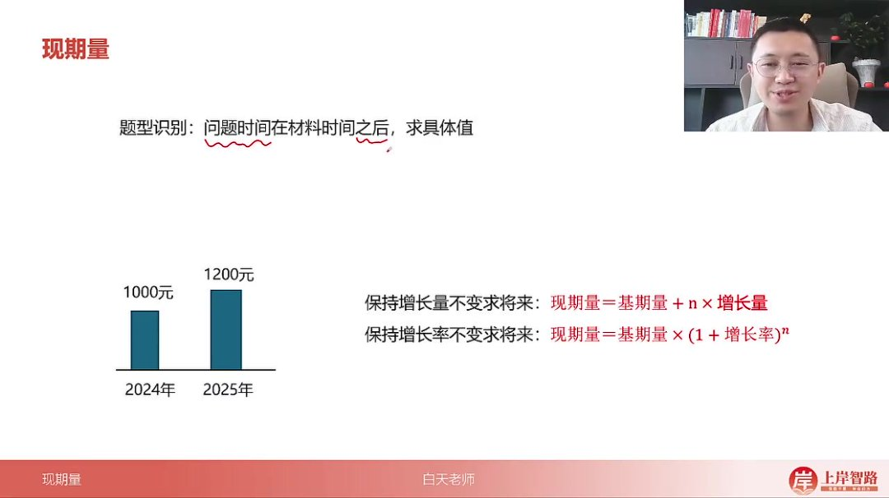
- 核心特征：问题时间在材料时间之后，求具体值
- 通俗理解：找将来的一个值（如2024年数据求2025年值）
- 示例说明：材料给2017年数据，题目问2018年值即为现期量计算

###### 1）例题：保持增长量不变求将来 00:21

- 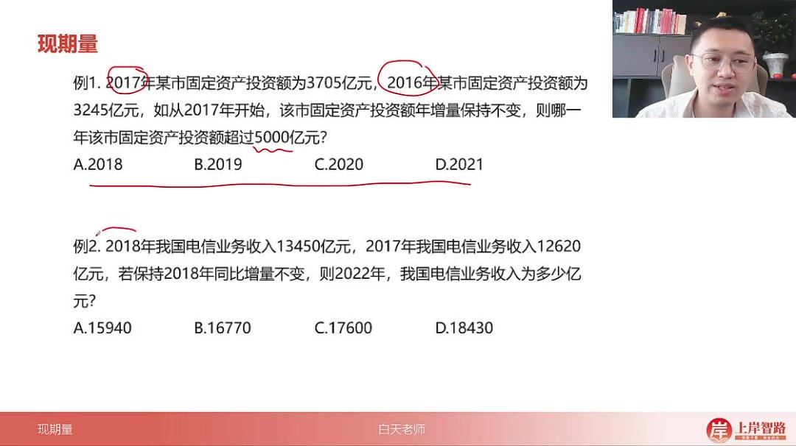
- 解题关键：选项年份均在材料时间之后（2017年后），属于求将来值

##### 2. 基本公式 01:00

###### 1）保持增量不变求将来值 01:09

- 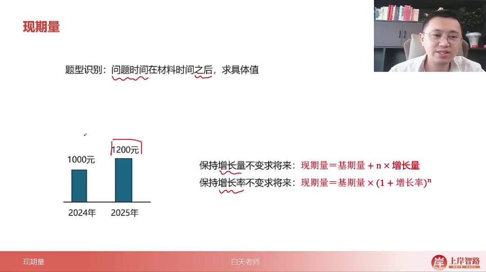

- 公式

  ：现期量=基期量

  +n×+n\times+n×

  增长量

- n的含义：n年后（如2024到2027年则n=3）

- 推导过程

  ：

  - 基期1000元，年增200元

  - 1年后：1000+200=1200

  - 3年后：

    1000+3×200=16001000+3\times200=16001000+3×200=1600

- 建议：以最近年份为基期可减少计算量

###### 2）保持增率不变求将来值 03:20

- 公式

  ：现期量=基期量

  ×(1+增长率)n\times(1+增长率)^n×(1+增长率)n

- 推导过程

  ：

  - 基期1000元，增长率20%

  - 1年后：

    1000×1.2=12001000\times1.2=12001000×1.2=1200

  - 2年后：

    1000×1.22=14401000\times1.2^2=14401000×1.22=1440

- n次方原理：每年在前一年基础上继续增长

##### 3. 常考题型 05:02

###### 1）保持增长量不变 05:07

- 求将来的一个值 

  05:09

  - 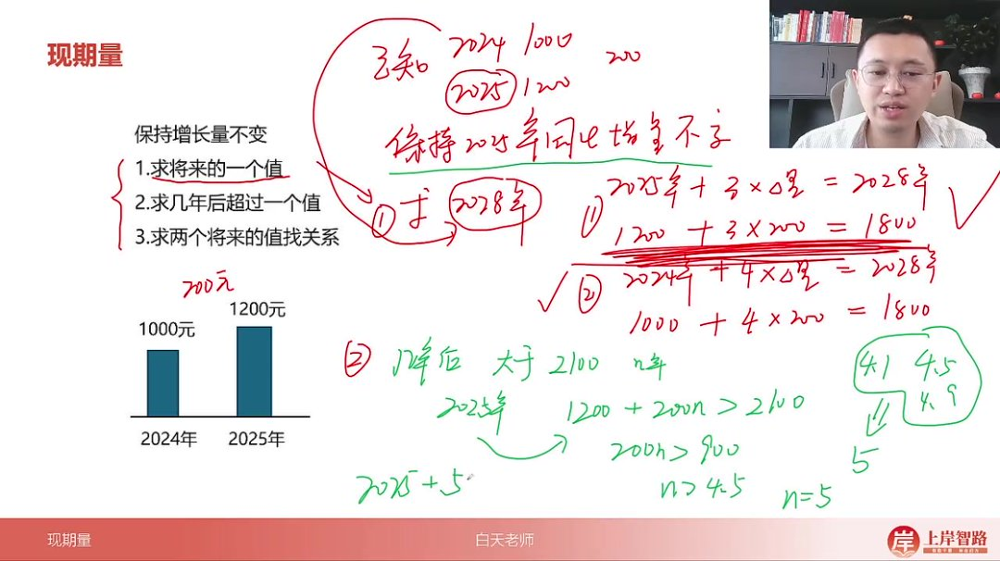

  - 解题步骤

    ：

    - 确定基期值和增长量

    - 计算间隔年数n

    - 套用公式

      基期+n×增量基期+n\times增量基期+n×增量

  - 示例

    ：2025年1200元，年增200元→2028年值：

    1200+3×200=18001200+3\times200=18001200+3×200=1800

- 求几年后超过某值 

  07:52

  - 解题要点

    ：

    - 建立不等式

      基期+n×增量>目标值基期+n\times增量>目标值基期+n×增量>目标值

    - n取大于解的最小整数（如n>2.3则取3）

  - 示例

    ：

    1200+200n>21001200+200n>21001200+200n>2100

    解得n>4.5→第5年超过

- 两个将来值关系 

  09:38

  - 常见形式

    ：

    - 比较大小（A>B）
    - 倍数关系（A=10B）
    - 和差关系（A+B=XX）

  - 注意：增长量可能为负值（需保留负号计算）

###### 2）应用案例 10:30

- 固定资产投资额例题

  - 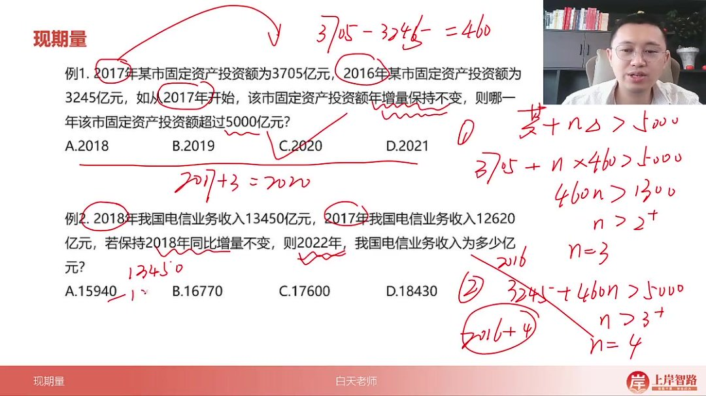

  - 解析

    ：

    - 增量=3705-3245=460亿

    - 3705+460n>50003705+460n>50003705+460n>5000

      →n>2.8→n=3

    - 2017+3=2020年（选C）

  - 易错点：若以2016年为基期需n=4，结果相同但计算更复杂

- 电信业务收入例题 

  12:15

  - 解析

    ：

    - 增量=13450-12620=830亿

    - 2022-2018=4年

    - 13450+4×830=16770亿13450+4\times830=16770亿13450+4×830=16770亿

      （选B）

- 社会消费品零售总额例题 

  13:18

  - 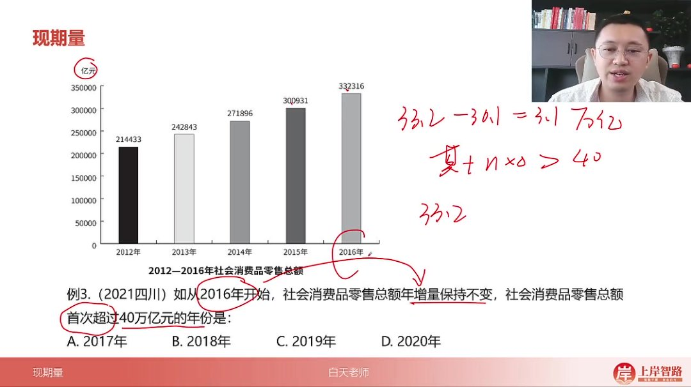

  - 关键转换：40万亿=400000亿（单位统一）

  - 解析

    ：

    - 增量=33.2-30.1=3.1万亿

    - 33.2+3.1n>4033.2+3.1n>4033.2+3.1n>40

      →n>2.2→n=3

    - 2016+3=2019年（选C）

- 超算服务市场规模例题 

  14:37

  - 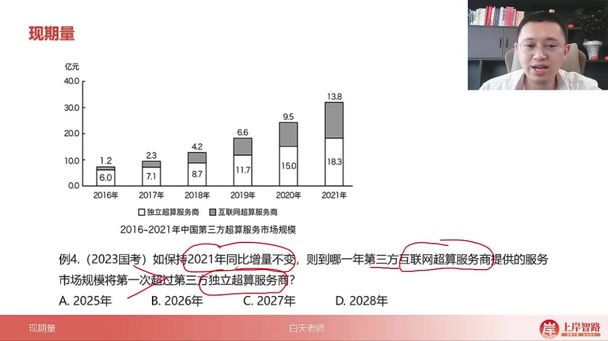

  - 解析

    ：

    - 互联网：

      13.8+4.3n>18.3+3.3n13.8+4.3n>18.3+3.3n13.8+4.3n>18.3+3.3n

    - 解得n>4.5→n=5

    - 2021+5=2026年（选B）

- 快递业务量倍数例题 

  16:11

  - 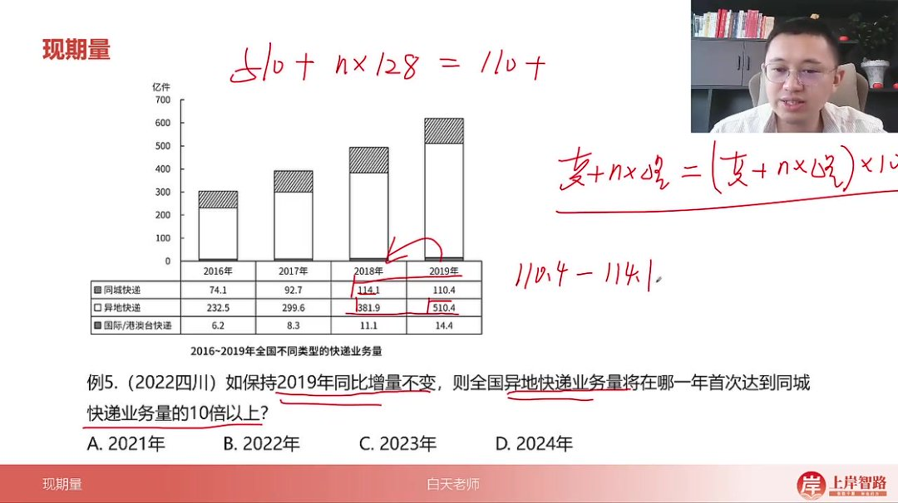

  - 解析

    ：

    - 异地增量=510-382=128
    - 同城增量=110.4-114.1=-3.7
    - 510+128n=(110−3.7n)×10510+128n=(110-3.7n)\times10510+128n=(110−3.7n)×10
    - 解得n≈3.8→n=4
    - 2019+4=2023年（选C）

  - 易错点：同城业务增长量为负值，需用减法

##### 4. 保持增长率不变 19:06

###### 1）已知增长率 19:22

- 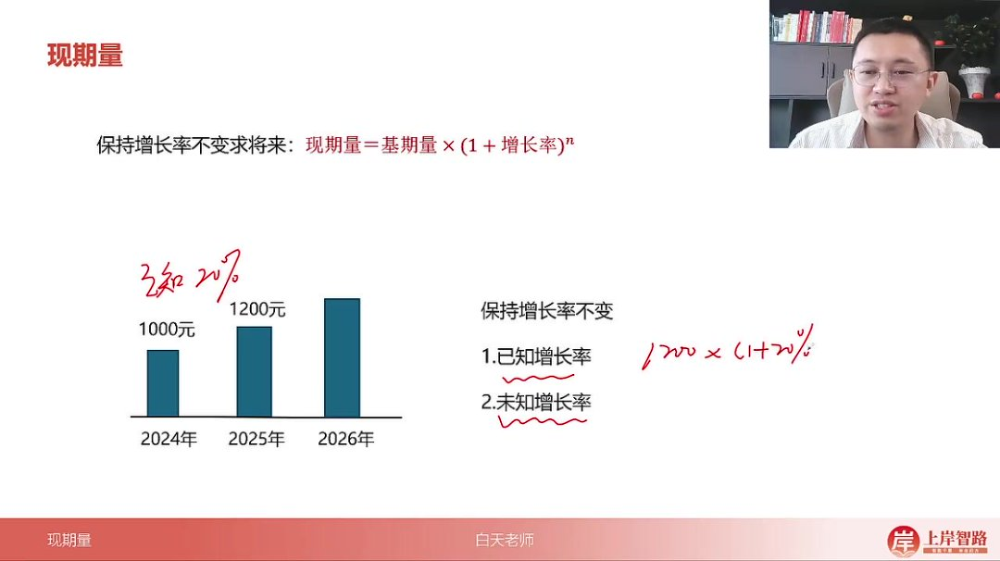

- 计算公式

  ：现期量=基期量×

  (1+增长率)n(1+增长率)^n(1+增长率)n

  ，其中n为增长年数

- 应用场景：当题目明确给出增长率时直接套用公式

- 示例说明：若2024年工资1200元，2025年增长20%，则2026年工资=1200×(1+20%)^2=1728元

###### 2）未知增长率 20:06

- 基础计算方法 

  20:09

  - 计算步骤

    ：

    - 先计算增长率=（现期量-基期量）/基期量
    - 再套用已知增长率公式

  - 适用情况：增长率容易计算时使用

  - 示例：已知2024年1000元，2025年1200元，则增长率=(1200-1000)/1000=20%，2026年=1200×(1+20%)=1440元

- 复利思维概念 

  21:20

  - 核心思想：将增长类比银行复利计算，利息会产生新的利息

  - 分步解析

    ：

    - 本金（基期量）产生利息（增长量）
    - 利息在下期也充当本金产生新利息

  - 比例关系：本金与利息保持固定比例关系

- 复利思维应用 

  24:20

  - 计算步骤

    ：

    - 计算首次增长量
    - 按比例计算增长量产生的增量
    - 累加得到最终结果

  - 示例演算：1000万存银行第一年变1200万（利息200万），第二年1200万中200万按相同利率产生40万利息，最终1240万

- 精简版口诀 

  25:03

  - 核心口诀：保持增长率不变，增长量会略微变大

  - 计算技巧

    ：

    - 计算前一期增长量
    - 新增长量=原增长量+增量（按比例估算）
    - 结果=前一期量+新增长量

###### 3）应用案例 26:22

- 例题：铁路旅客周转量

  - 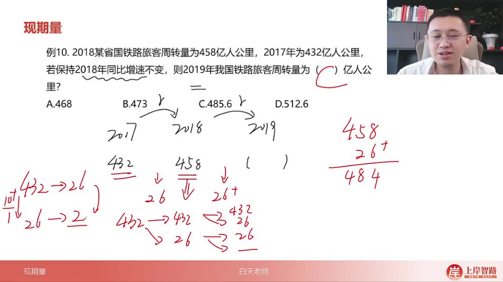
  - 题目解析
    - 2017年432亿，2018年458亿，增长量26亿
    - 保持增速则2019年增长量>26亿
    - 结果=458+(26+)=484+ → 选C
    - 易错点：注意增长量是"略微"变大，不是成倍增长

- 例题：进出口总额 

  30:43

  - 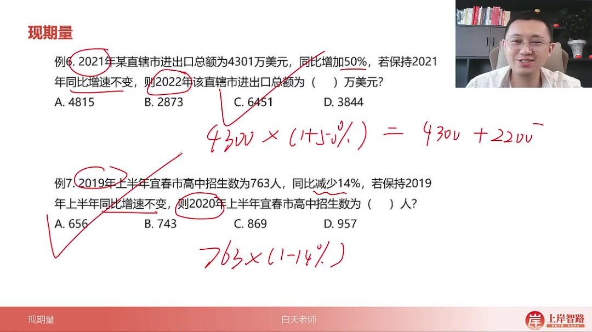
  - 题目解析
    - 已知4300万，增长率50%
    - 直接计算：4300×1.5=6450万
    - 速算技巧：4300+2150（一半）=6450 → 选C

- 例题：高中招生数 

  31:12

  - 题目解析
    - 763人，减少14%
    - 估算：763的10%=76.3，14%≈107
    - 763-107=656 → 选A
    - 注意：负增长时结果应小于基期量

- 例题：知识产权出口额 

  32:38

  - 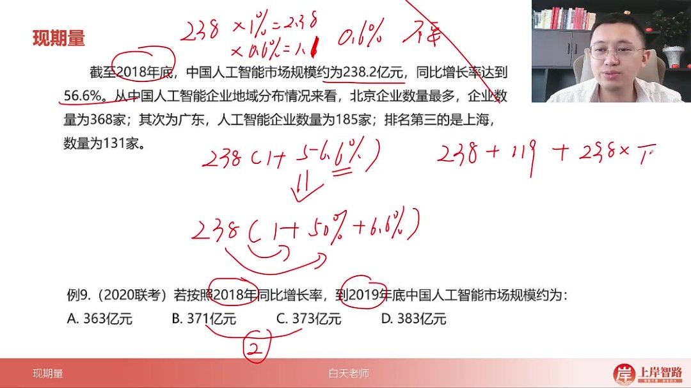
  - 题目解析
    - 322万，增长率315%
    - 计算：322×(1+315%)=322×4.15
    - 选项分析：322×4=1288，应大于此数 → 选C

- 例题：人工智能市场规模 

  33:35

  - 题目解析
    - 238亿，增长56.6%
    - 精算步骤：
      - 238×50%=119
      - 238×6.6%≈15.7（238÷15≈15.87）
      - 总和：238+119+15.7=372.7 → 选C

- 例题：商标拥有量指数 

  36:16

  - 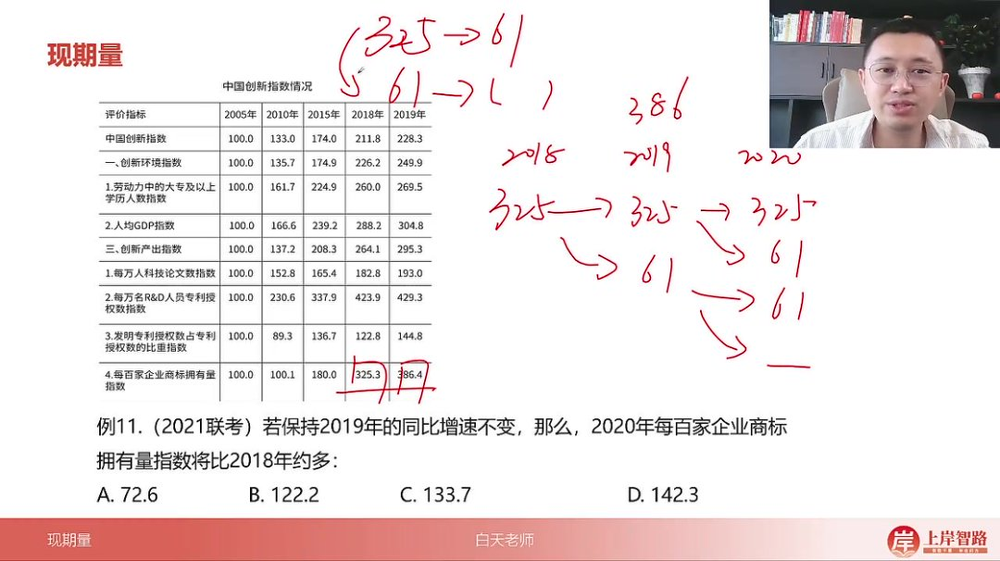
  - 题目解析
    - 2018年325→2019年386，增长61
    - 保持增速则2020年增长量=61+(61/325×61)≈61+11=72
    - 两年总增长=61+72=133 → 选C

- 例题：医保基金收入 

  38:58

  - 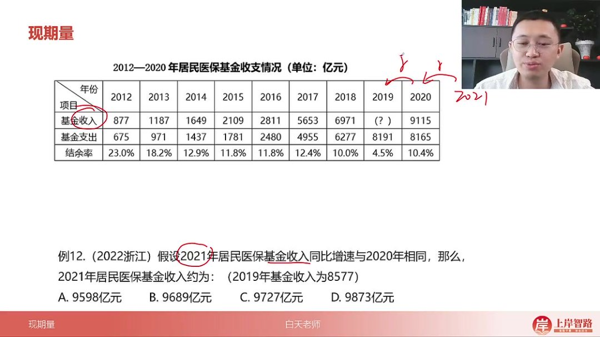
  - 题目解析
    - 2019年8577→2020年9115，增长538
    - 保持增速则2021年增长量=538+(538/8577×538)≈538+34=572
    - 结果=9115+572=9687 → 选B

#### 二、知识小结

| 知识点           | 核心内容                                     | 考试重点/易混淆点                            | 难度系数 |
| ---------------- | -------------------------------------------- | -------------------------------------------- | -------- |
| 现期量题型识别   | 问题时间在材料时间之后求具体值，即找将来的值 | 时间逻辑判断（如选项年份是否在材料时间之后） | ⭐⭐       |
| 保持增量不变公式 | 基期量 + n×增长量（n=间隔年数）              | n的取值逻辑（如n=目标年-基期年）             | ⭐⭐⭐      |
| 保持增率不变公式 | 基期量 × (1+增长率)^n                        | 复利思维应用（增长量随年限递增）             | ⭐⭐⭐⭐     |
| 复利思维简化版   | 保持增率不变时，增长量逐年略微变大           | 快速估算技巧（如例10直接取26→26+）           | ⭐⭐⭐      |
| 增长量正负判断   | 减少量需带负号计算（如例5同城业务-3.7）      | 负增长场景易错                               | ⭐⭐⭐⭐     |
| 比较类题型模型   | 将来值A > 将来值B 或 A=10×B（如例4、例5）    | 关系式列立逻辑                               | ⭐⭐⭐⭐     |
| 单位换算陷阱     | 亿→万亿需左移四位小数点（如例3）             | 量级一致性检查                               | ⭐⭐       |
| 选项差距利用     | 选项差距大时可粗糙估算（如例7、例8）         | 精算与估算场景区分                           | ⭐⭐       |