以下为AI生成的图文笔记的内容

#### 一、现期比重 00:08

##### 1. 现期比重 00:26

###### 1）题型识别 00:48

- 时间特征：问题时间与材料时间完全一致

- 关键词提示：出现"在...中"、"...占...的比重"等占比相关表述

- 示例说明

  ：

  - 材料给2022年，问2022年占比→现期比重
  - 材料给2024年，问2024年占比→现期比重

###### 2）基础公式 01:08

- 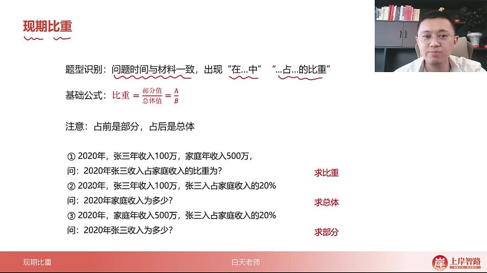

- 核心公式

  ：比重

  =部分量总体量= \frac{部分量}{总体量}=总体量部分量

  （记作

  AB\frac{A}{B}BA

  ）

- 变量关系

  ：

  - 部分量（A）：占前内容
  - 总体量（B）：占后内容

- 判断技巧

  ：

  - 方法一："占"前为部分，"占"后为总体
  - 方法二：数值小的为部分，数值大的为总体（部分量永远小于总量）

###### 3）注意 01:30

- 单位处理：当选项无十倍关系时可不看单位；当选项存在数量级差异时必须看单位
- 包含关系：分母必须包含分子，如茶叶市场占比的分母应为"食品、饮料及烟酒市场"而非单独"食品+烟酒"
- 计算要点：直除为主，注意首位和次位商的判断

###### 4）应用案例 03:09

- 例题:现期比重计算

  - 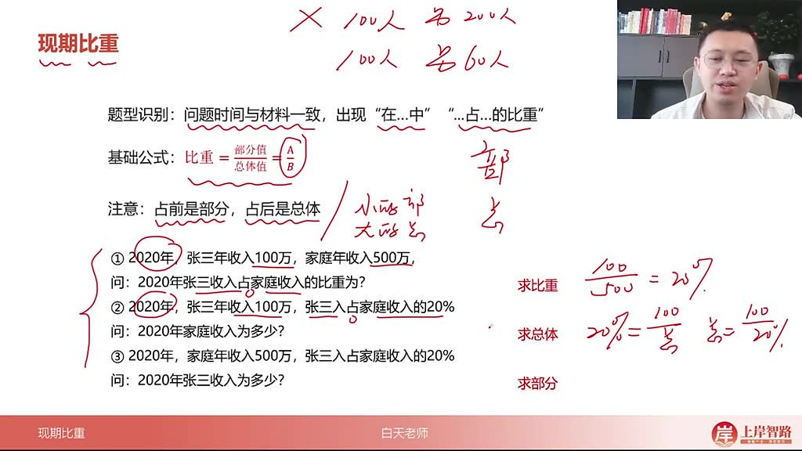

  - 三种考法

    ：

    - 求比重：

      100500=20%\frac{100}{500}=20\%500100=20%

      （已知部分和总体）

    - 求总体：

      10020%=500\frac{100}{20\%}=50020%100=500

      （已知部分和占比）

    - 求部分：500×20%=100（已知总体和占比）

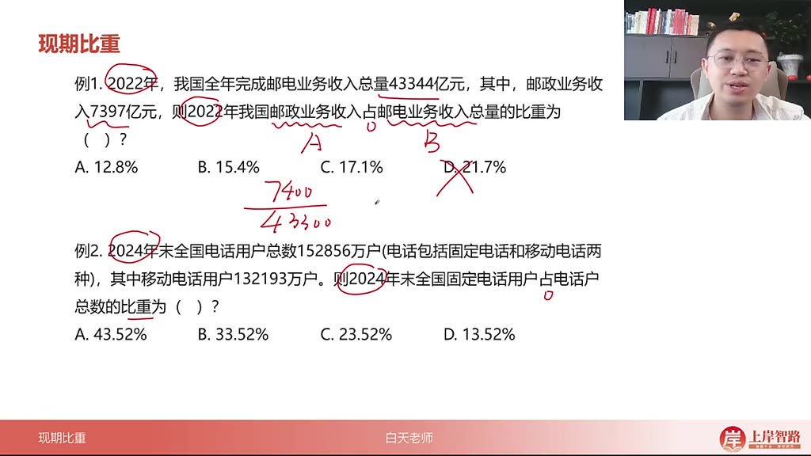

- 例题:邮电业务收入比重 

  04:55

  - 题目解析

    - 部分量：邮政业务收入7397亿元

    - 总体量：邮电业务收入总量43344亿元

    - 计算：

      739743344\frac{7397}{43344}433447397

      ≈17.1%（首位商1，次位商7）

    - 答案：C选项

- 例题:固定电话用户比重 

  05:33

  - 题目解析

    - 关键点：需先计算固定电话用户数=总数-移动用户数

    - 计算：

      152856−132193152856\frac{152856-132193}{152856}152856152856−132193

      ≈13.52%

    - 易错点：直接使用给定移动用户数作分子

    - 答案：D选项

- 例题:G省法律援助案件数占比 

  06:36

  - 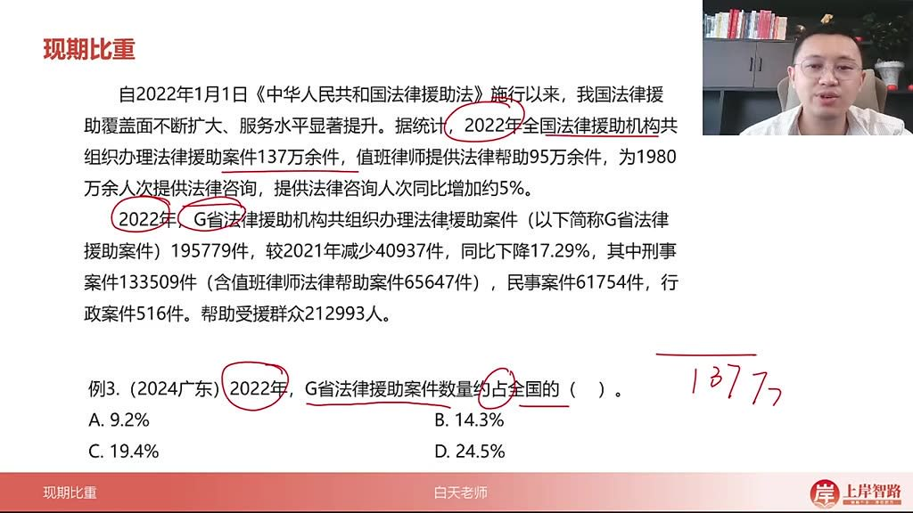

  - 题目解析

    - 部分量：G省案件数195779件

    - 总体量：全国案件数137万件

    - 速算：

      19.6137\frac{19.6}{137}13719.6

      ≈14.3%（首位商1）

    - 单位处理：选项无十倍关系可忽略单位差异

    - 答案：B选项

- 例题:茶叶市场成交总额比重 

  07:47

  - 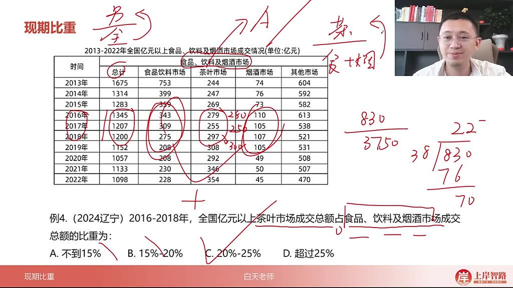

  - 题目解析

    - 分子：2016-2018年茶叶市场总和≈830亿元

    - 分母：同期食品饮料烟酒市场总和≈3750亿元

    - 计算：

      8303750\frac{830}{3750}3750830

      ≈22.1%

    - 易错点：错误使用食品+烟酒作为分母

    - 答案：C选项

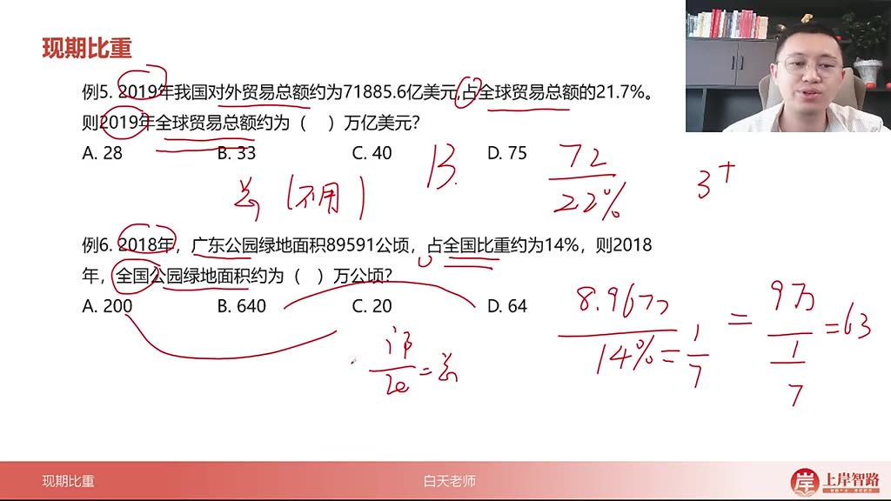

- 例题:全球贸易总额计算 

  10:38

  - 题目解析

    - 已知：部分量=7.18856万亿美元，占比=21.7%

    - 计算：

      7.222%\frac{7.2}{22\%}22%7.2

      ≈32.7万亿美元

    - 速算：首位商3直接锁定B选项

    - 答案：B选项

- 例题:公园绿地面积计算 

  11:10

  - 题目解析

    - 单位转换：89591公顷→8.9591万公顷

    - 计算：

      8.9614%\frac{8.96}{14\%}14%8.96

      ≈64万公顷

    - 关键点：必须注意选项的十倍关系

    - 答案：D选项

- 例题:全国技工院校在校生人数 

  12:13

  - 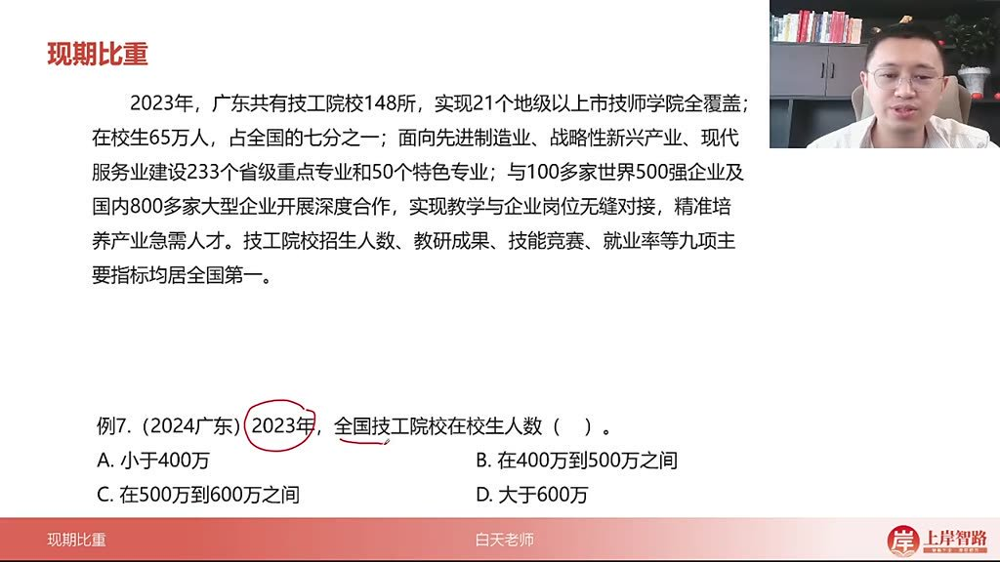
  - 题目解析
    - 已知：广东在校生65万人，占全国1/7
    - 计算：65×7=455万人
    - 区间判断：400-500万之间
    - 答案：B选项

- 例题:不承担运输任务架次数 

  12:51

  - 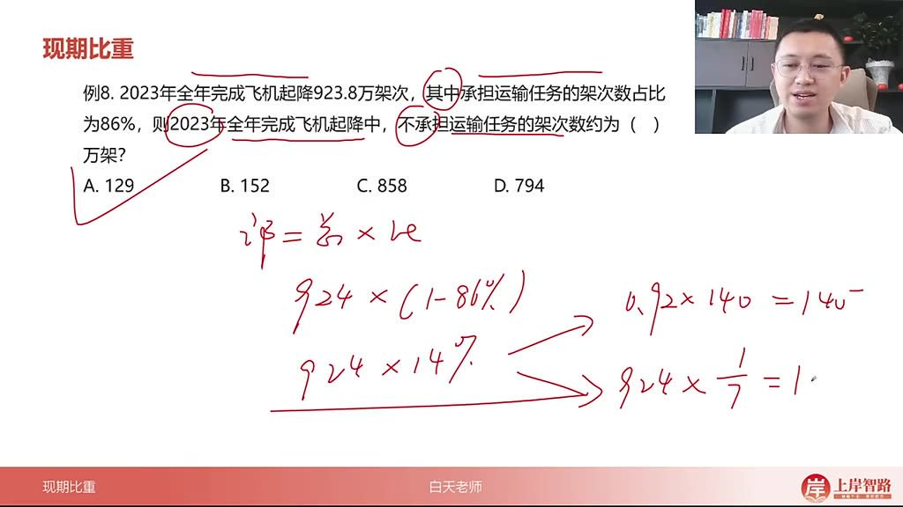
  - 题目解析
    - 已知：总架次923.8万，承担占比86%
    - 计算：923.8×(1-86%)=923.8×14%≈129.3万
    - 速算技巧：按0.9×140≈126估算
    - 答案：A选项

- 例题:文物机构从业人员中高级职称人数 

  14:08

  - 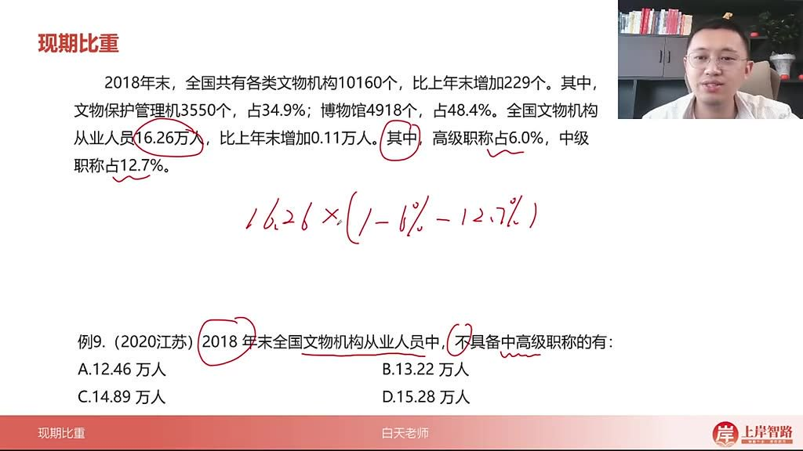
  - 题目解析
    - 计算：16.26×(1-6%-12.7%)=16.26×81.3%
    - 速算方法：
      - 估算：16×80%=12.8，实际值应略大
      - 精确：16.26×0.813≈13.22
    - 答案：B选项

##### 2. 现期比重的补充技巧 16:58

###### 1）前后连贯性 17:07

- 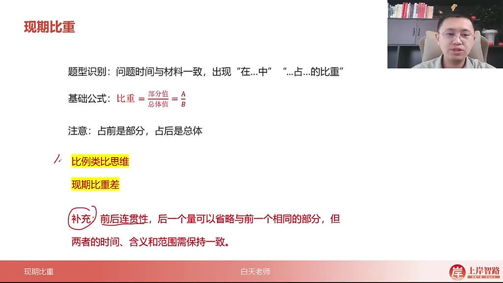

- 题型识别：当问题时间与材料一致，出现"在...中"或"...占...比重"句式时，属于现期比重问题

- 省略规则：后一个量可省略与前一个相同的部分，但需保持时间、含义和范围一致

- 实例说明

  ：

  - 例1："华北地区风力发电年末累计装机容量占全国"中省略了相同的"风力发电年末累计装机容量"
  - 例2："苏南地区女性农业生产经营人员占全省...比重与苏北地区相差"中省略了"女性农业生产经营人员占全省"的重复部分
  - 例3："亚太地区光伏新增装机容量占全球比重比其累计装机容量占全球比重"中两次省略"装机容量占全球"

###### 2）比例类比思维 20:00

- 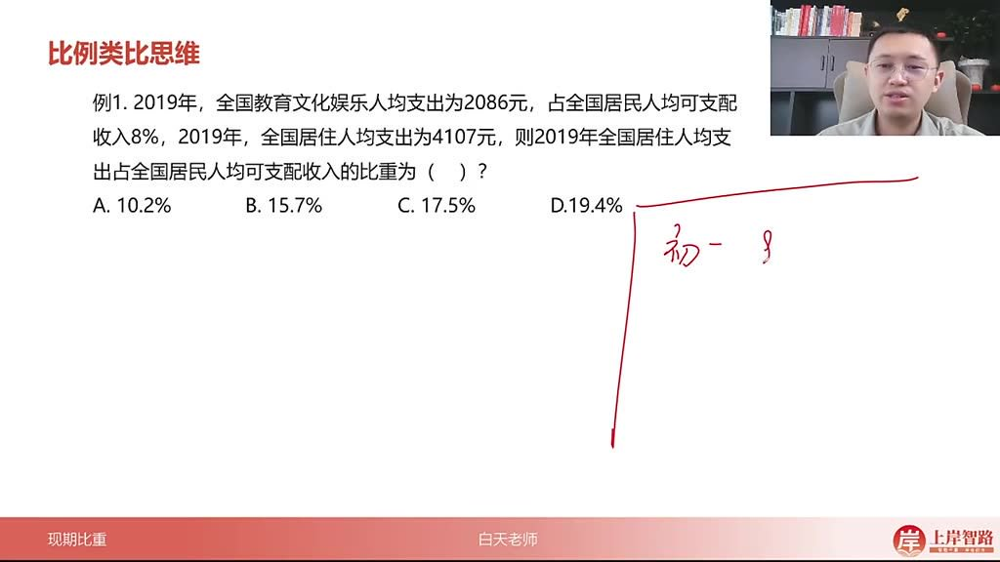

- 核心原理

  ：当总量相同时，部分量的比例关系等于比重的比例关系，即

  AB=a%b%\frac{A}{B} = \frac{a\%}{b\%}BA=b%a%

- 应用条件：必须确保比较的两个比重对应的总量完全相同

- 解题技巧

  ：

  - 先确定已知部分量与占比的关系
  - 根据部分量之间的倍数关系推导占比关系
  - 适用于选项差距较大的题目

- 经典例题

  ：

  - 初中人数示例：800人占全校30%，则1200人对应45%（1.5倍关系）
  - 2019年居住支出例题：已知教育文化支出2086元占8%，则4107元（约2倍）对应约15.7%
  - 2020年电子商务例题：22000占28%，则9000对应约11.1%（通过11000占14%推算）
  - 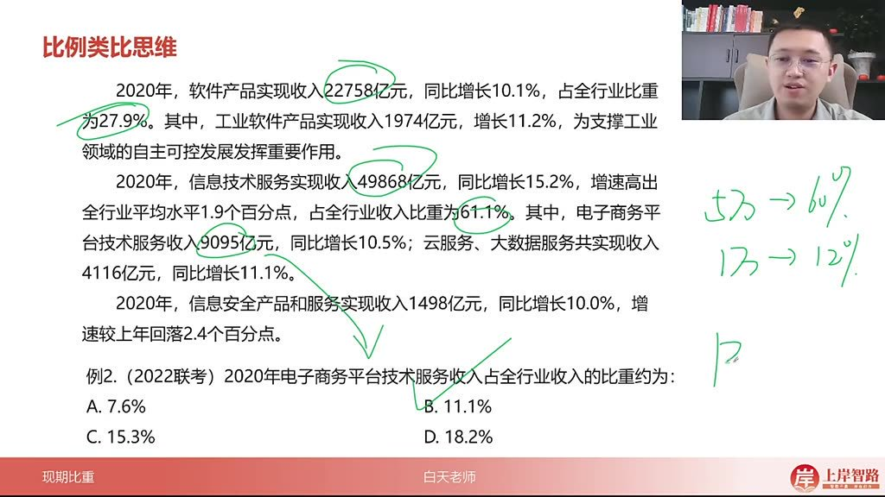

- 2022联考例题解析

  ：

  - 利用软件产品22758亿元占27.9%建立基准
  - 信息技术服务49868亿元占61.1%作为验证
  - 电子商务平台9095亿元通过比例关系得出约11.1%
  - 排除法：比14%小但大于7%，选B选项

###### 3）现期比重差 25:03

- 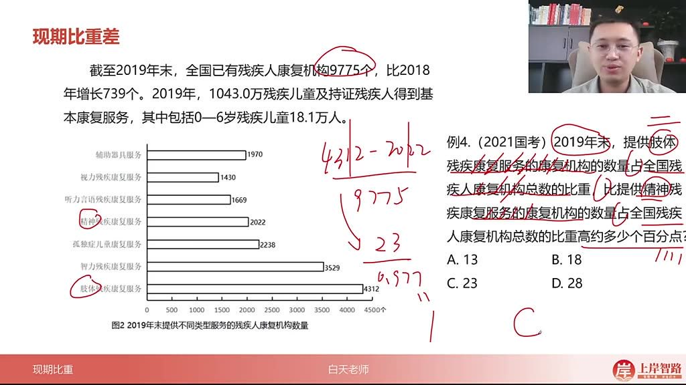

- 核心公式

  ：

  AS−BS=A−BS\frac{A}{S} - \frac{B}{S} = \frac{A-B}{S}SA−SB=SA−B

  （总量相同）或

  AS1−BS2\frac{A}{S_1} - \frac{B}{S_2}S1A−S2B

  （总量不同）

- 与两期比重差区别

  ：

  - 现期比重差：同一时间两个不同部分的占比差
  - 两期比重差：同一部分不同时间的占比差

- 解题要点

  ：

  - 注意题干是否省略相同描述部分
  - 优先判断总量是否相同
  - 选项单位为"百分点"时可直接计算占比差

- 总量相同的例题

  - 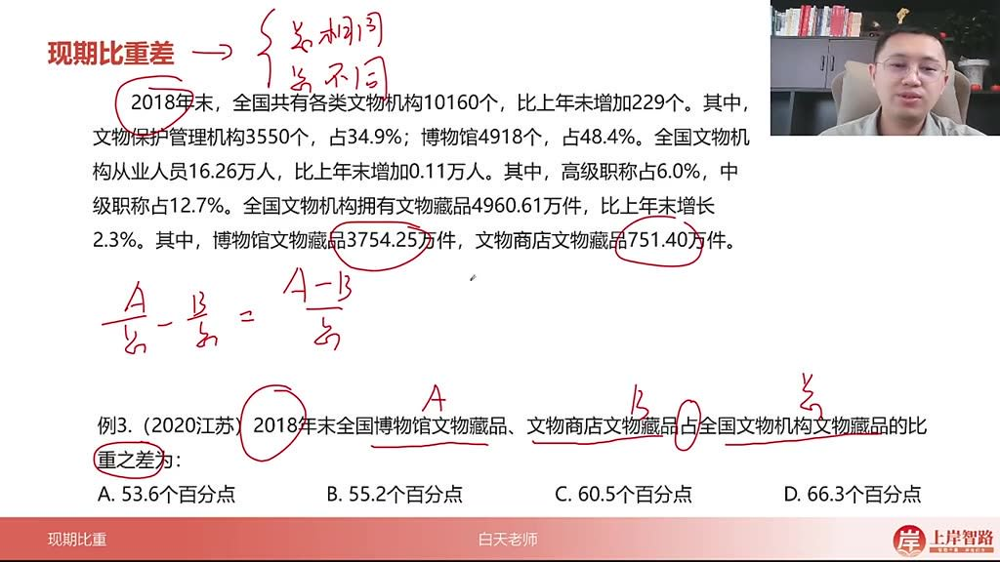

  - 2020江苏例题解析

    ：

    - 博物馆藏品3754.25万件，文物商店藏品751.40万件
    - 总量4960.61万件
    - 计算：(3754.25-751.40)/4960.61≈60.5%
    - 答案选C

- 总量不同的例题

  - 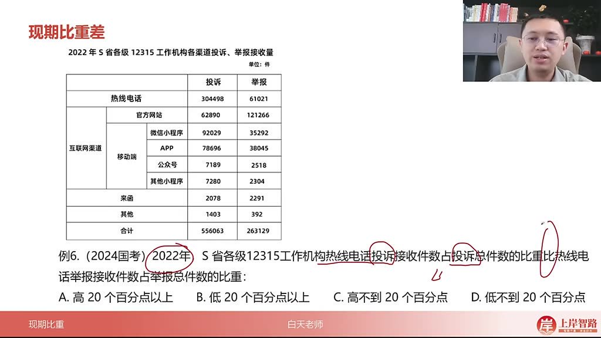

  - 2024国考例题解析

    ：

    - 热线电话投诉占比：304498/556063≈55%
    - 热线电话举报占比：61021/263129≈23%
    - 比重差：55%-23%=32%，选A（高20个百分点以上）

  - 计算技巧

    ：

    - 分子分母同取前三位估算
    - 利用选项差距简化计算
    - 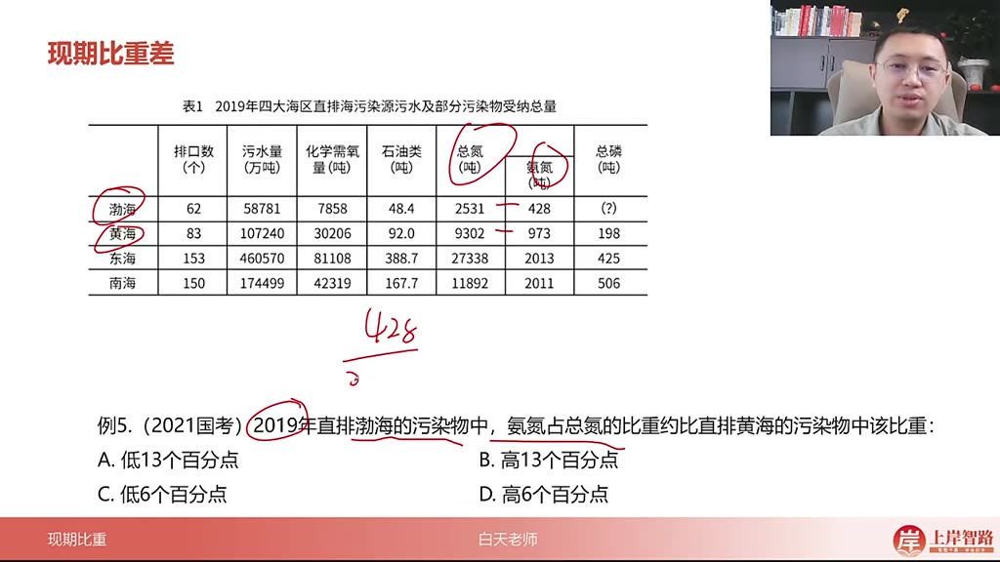

  - 2021国考例题解析

    ：

    - 渤海氨氮占比：428/2531≈16.9%
    - 黄海氨氮占比：973/9302≈10.5%
    - 比重差：6.4个百分点，选D（高6个百分点）

  - 速算方法

    ：

    - 利用百划分估算（2531≈2500对应16%）
    - 选项排除法（正差排除AC，差值大小排除B）

#### 二、结束 31:27

##### 1. 性期比重对应思维

- 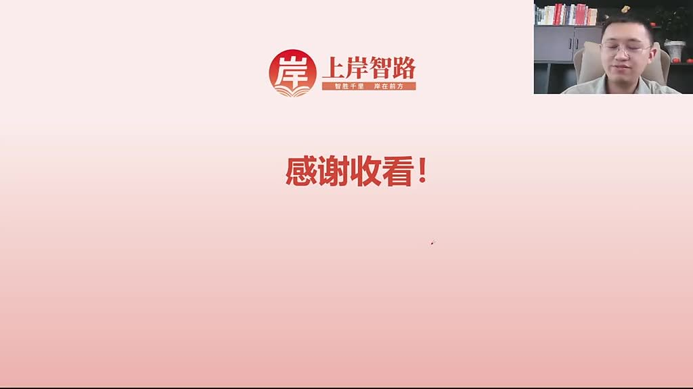
- 省略思维: 通过省略部分语句保持内容的连贯性，使表达更加简洁高效。
- 比例类比思维: 运用比例关系进行类比推理，帮助理解和分析问题。
- 星体比重差: 关注不同要素之间的比重差异，强调重点要素的重要性。

#### 三、知识小结

| 知识点       | 核心内容                                                     | 考试重点/易混淆点                            | 难度系数 |
| ------------ | ------------------------------------------------------------ | -------------------------------------------- | -------- |
| 现期比重定义 | 问题时间与材料时间一致时，占比相关考点                       | “占”前为部分量，“占”后为总体量               | ★★☆☆☆    |
| 现期比重公式 | 部分量 ÷ 总体量（A÷B）                                       | 区分部分与总体：“占”前小、“占”后大           | ★★☆☆☆    |
| 求部分量公式 | 总体量 × 比重                                                | 需明确题目所求（比重/部分量/总体量）         | ★★★☆☆    |
| 求总体量公式 | 部分量 ÷ 比重                                                | 单位处理：选项无十倍关系时可忽略单位         | ★★★☆☆    |
| 比例类比思维 | 总相同时，部分量比例=占比比例（如：800人占30%→400人占15%）   | 适用于选项差距大的速算                       | ★★★★☆    |
| 现期比重差   | 同一时间下两占比差值（如：A占全国比重 - B占全国比重）        | 总相同：部分差÷总；总不同：分别计算          | ★★★☆☆    |
| 易错点       | 1. 单位忽略（选项有十倍关系需看单位）2. 包含关系混淆（如分母需包含分子） | 例：茶叶市场占比分母应为“食品饮料及烟酒”总和 | ★★★★☆    |
| 速算技巧     | 1. 直除首位法2. 百划分（如25%≈1/4）3. 数量级估算（如0.9×140≈126） | 选项差距大时优先估算                         | ★★☆☆☆    |