以下为AI生成的图文笔记的内容

#### 一、平均数相关 00:05

##### 1. 现期平均数 02:10

###### 1）现期平均数的题型识别 02:13

- 识别特征：问题时间与材料时间一致，题干中出现"均"、"平均"、"每"、"单位"等关键词
- 核心概念：反映某一时期总体特征的均值计算，区别于基期平均数

###### 2）基础公式 02:23

- 基本公式

  ：平均数

  =AB= \frac { A } { B }=BA

  ，其中A为总量，B为份数

- 公式变形

  ：

  - 总值

    =平均数×份数= 平均数 \times 份数=平均数×份数

  - 份数

    =总值平均数= \frac { 总值 } { 平均数 }=平均数总值

###### 3）注意 02:32

- 后除前法则

  ：主体词在后为分子（总值），在前为分母（份数）

  - 例："平均每所高中在校生人数"中，"在校生人数"在后为分子，"高中"在前为分母

- 单位验证法

  ：通过单位运算验证分子分母位置

  - 例："元/平方米"单位对应"销售额÷面积"

###### 4）应用案例 02:55

- 例题:现期平均数计算

  - 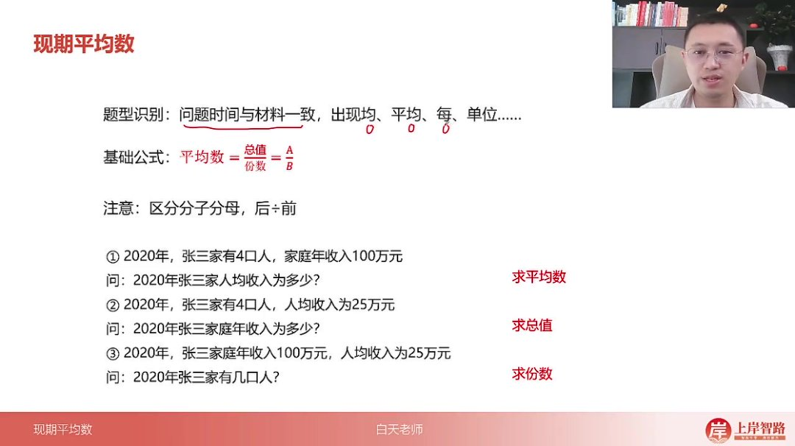

  - 题目解析

    - 2020年张三家人均收入计算：

      1004=25\frac{100}{4}=254100=25

      万元

    - 2020年张三家庭总收入计算：4×25=100万元

    - 2020年张三家人口计算：

      10025=4\frac{100}{25}=425100=4

      人

    - 核心：掌握公式三量互求关系

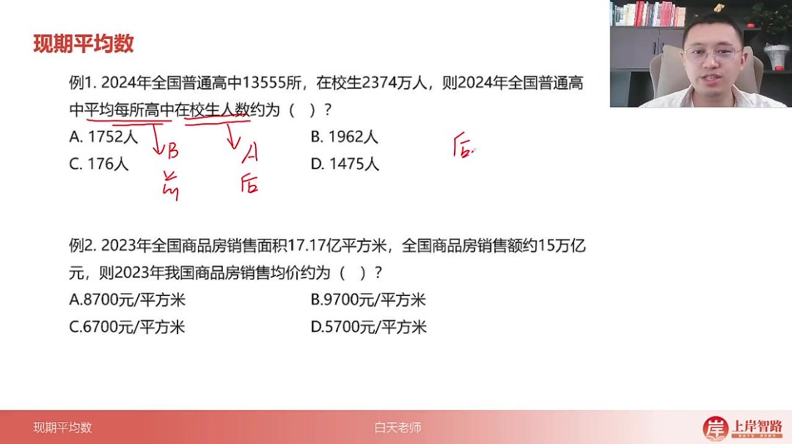

- 例题:平均每所高中在校生人数 

  06:55

  - 题目解析

    - 分子：在校生2374万人（注意单位统一）

    - 分母：高中13555所≈1.4万所

    - 计算：

      23741.4\frac{2374}{1.4}1.42374

      ≈1700人/所

    - 易错点：选项A、C存在10倍关系，需注意数量级

- 例题:商品房销售均价

  - 题目解析

    - 分子：销售额15万亿元

    - 分母：面积17.17亿平方米

    - 速算技巧：

      1517\frac{15}{17}1715

      ≈0.88，首位商8选A

    - 单位验证："元/平方米"验证分子分母位置正确

- 例题:平均每件法律援助案件帮助受援群众数 

  08:06

  - 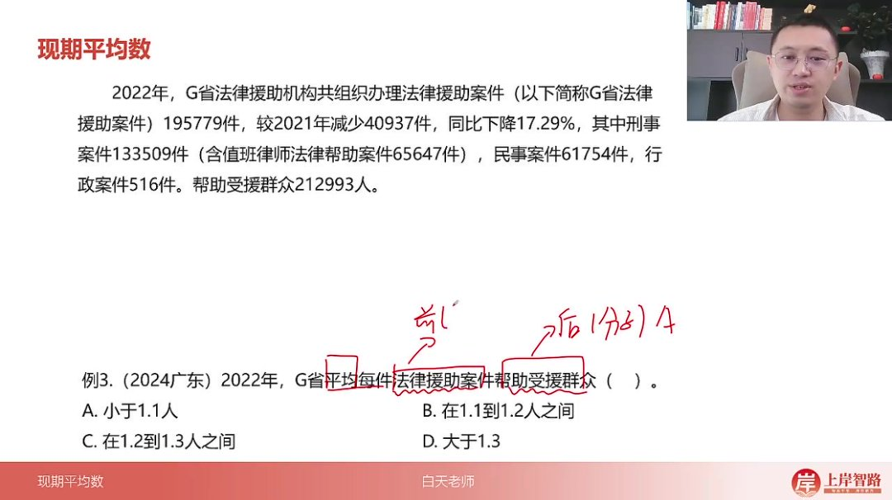

  - 题目解析

    - 分子：受援群众212993人≈21.3万人

    - 分母：案件195779件≈19.6万件

    - 修正计算：

      21.720\frac{21.7}{20}2021.7

      ≈1.085人/件

    - 结果判断：1.085∈(1.1,1.2)选B

- 例题:平均每个平台交易金额 

  10:18

  - 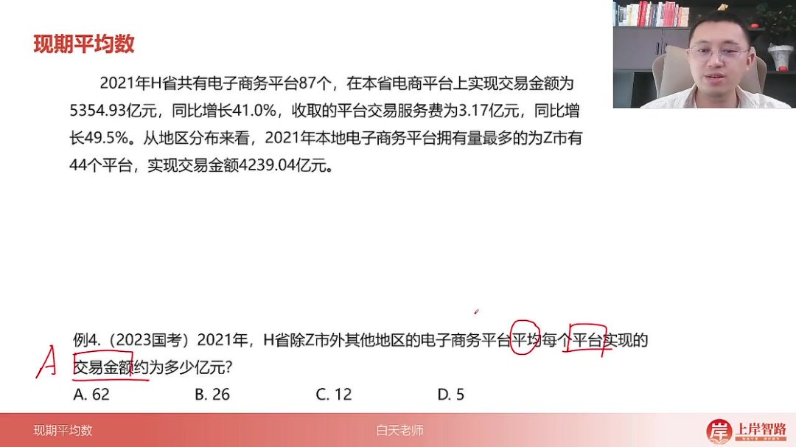

  - 题目解析

    - 总交易金额：5354.93-4239.04≈1115亿元

    - 平台数量：87-44=43个

    - 速算：

      111543\frac{1115}{43}431115

      ≈26亿元/平台

    - 区域排除：注意"除Z市外"的限定条件

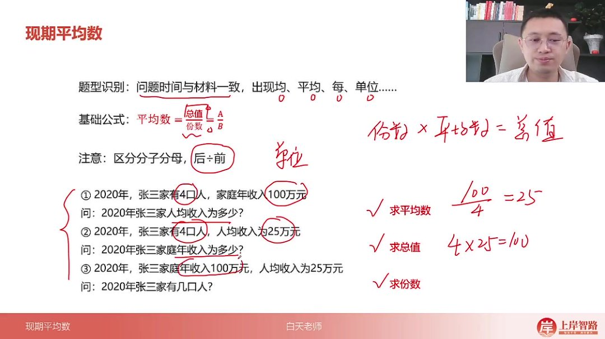

- 例题:平均每座无害化处理场处理能力 

  11:19

  - 题目解析

    - 单位陷阱：材料给"万吨/日"，问题问"万吨/年"

    - 年处理能力：96.35×366≈35000万吨/年

    - 处理场数量：1287座

    - 速算：

      350001287\frac{35000}{1287}128735000

      ≈27万吨/年

    - 关键：注意时间单位转换

- 例题:国有企业从业总人数 

  13:36

  - 题目解析

    - 总量=平均数×份数：18.2万×249人/个

    - 速算技巧：249≈

      14\frac{1}{4}41

      ，18.2÷4≈4.55百万=455万

    - 单位转换：注意"万人"与"人"的换算

- 例题:城镇人口总居住面积 

  14:40

  - 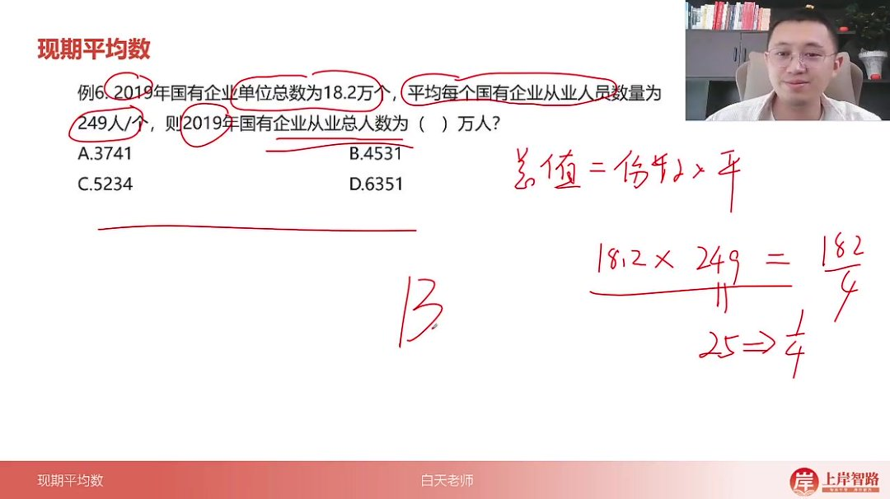
  - 题目解析
    - 总量=人均×人数：32.2㎡×1542.1万人
    - 估算：30×1500=4.5亿㎡，实际略大选B
    - 数据定位：准确找到"城镇"相关数据

- 例题:某市居民总人口计算 

  15:29

  - 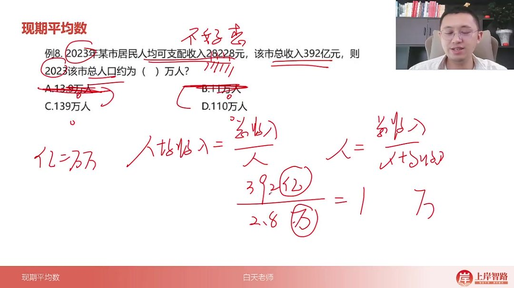

  - 题目解析

    - 份数=总值÷平均数：

      392亿28228元/人\frac{392亿}{28228元/人}28228元/人392亿

    - 单位统一：392亿=392万万，28228元≈2.8万

    - 计算：

      3922.8\frac{392}{2.8}2.8392

      =140万人

    - 精确计算：次位商3得139万人选C

- 例题:全国移动互联网接入户数 

  16:54

  - 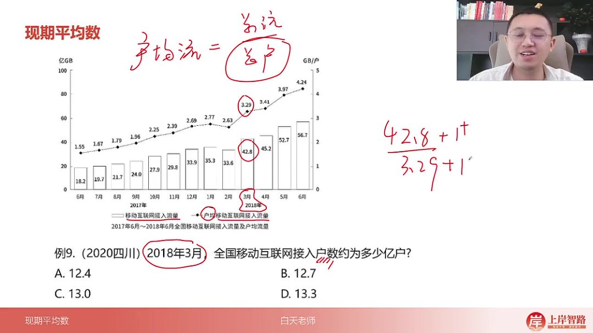

  - 题目解析

    - 份数=总量÷平均数：

      42.8亿GB3.29GB/户\frac{42.8亿GB}{3.29GB/户}3.29GB/户42.8亿GB

    - 修正计算：42.8+1=43.8，3.29+0.01≈3.3

    - 结果：

      43.83.3\frac{43.8}{3.3}3.343.8

      ≈13.3亿户

    - 时间对应：注意锁定2018年3月数据

##### 2. 基期平均数 18:07

###### 1）基期平均数的公式 18:26

- 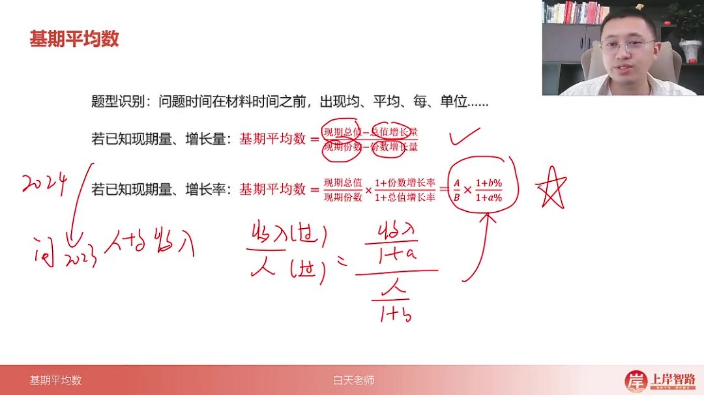

- 题型识别：问题时间在材料时间之前，出现"均"、"平均"、"每"、"单位"等关键词

- 公式推导

  ：

  - 已知现期量和增长量

    ：基期平均数=

    现期总值−总值增长量现期份数−份数增长量\frac{现期总值-总值增长量}{现期份数-份数增长量}现期份数−份数增长量现期总值−总值增长量

  - 已知现期量和增长率

    ：基期平均数=

    AB×1+b%1+a%\frac{A}{B} \times \frac{1+b\%}{1+a\%}BA×1+a%1+b%

    ，其中A为现期分子，a为分子增长率；B为现期分母，b为分母增长率

- 记忆要点：公式结构与基期比重完全一致，只需区分分子分母对应关系

###### 2）应用案例 19:43

- 例题:基期平均数计算

  - 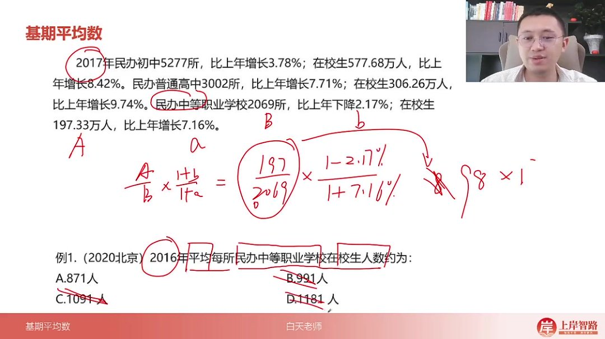

  - 题目解析

    - 审题关键：2016年（基期）平均每所民办中等职业学校在校生人数

    - 解题步骤

      ：

      - 确定分子为在校生197.33万人（a），增长率7.16%（小a）

      - 确定分母为学校2069所（b），增长率-2.17%（小b）

      - 套用公式：

        1972069×1−2.17%1+7.16%\frac{197}{2069} \times \frac{1-2.17\%}{1+7.16\%}2069197×1+7.16%1−2.17%

    - 速算技巧

      ：

      - 先计算197÷2069≈0.095（首位商9）
      - 右边分数明显小于1
      - 综合判断结果应小于950，排除BCD选项

    - 答案：A.871人

##### 3. 两期平均数 21:15

###### 1）基础公式 21:33

- 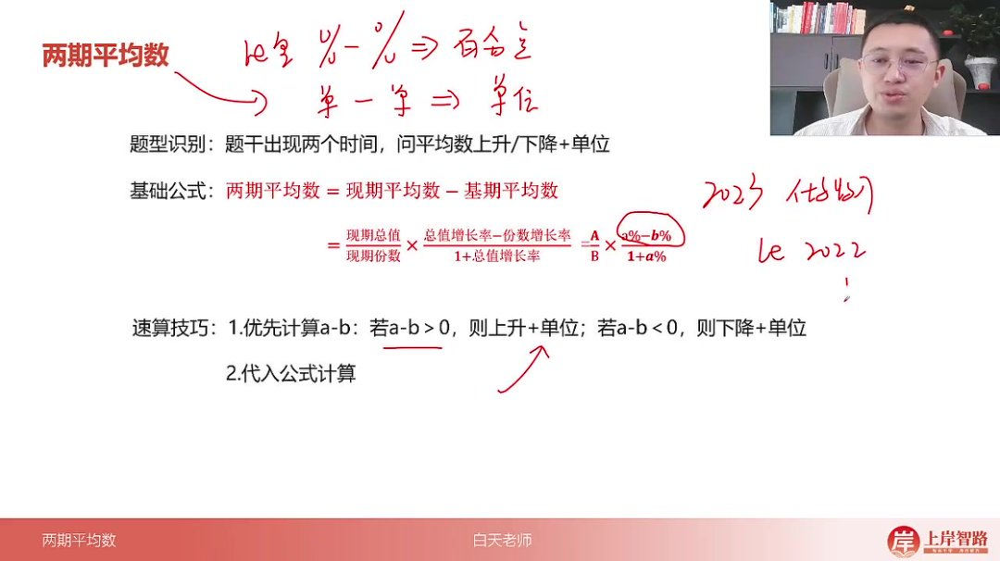

- 题型识别：题干出现两个时间，问平均数上升/下降+单位

- 核心公式

  ：两期平均数差=现期平均数-基期平均数=

  AB×a%−b%1+a%\frac{A}{B} \times \frac{a\% - b\%}{1+a\%}BA×1+a%a%−b%

- 比较原理

  ：与两期比重比较逻辑相同，比较分子(a)、分母(b)增长率

  - a>b则平均数上升
  - a<b则平均数下降
  - a=b则平均数不变

###### 2）速算技巧 22:04

- 判断方向

  ：优先计算a-b

  - a-b>0则上升
  - a-b<0则下降

- 单位注意：平均数差值有实际单位（如元/人），不同于比重的百分点

- 计算顺序：先判断正负排除选项，再代入公式精确计算

###### 3）应用案例 23:54

- 例题:两期平均数比较问题

  - 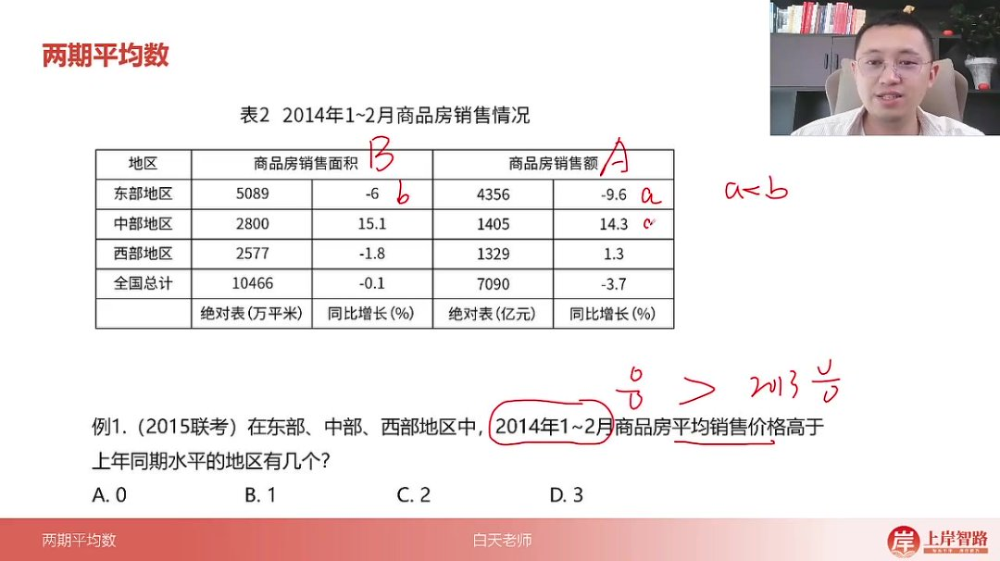

  - 题目解析

    - 解题思路：比较2014年1-2月与2013年同期商品房平均售价

    - 数据对应

      ：

      - 东部：a=-9.6% < b=-6% → 下降
      - 中部：a=14.3% < b=15.1% → 下降
      - 西部：a=1.3% > b=-1.8% → 上升

    - 易错点：全国数据为干扰项，题干限定东中西三个地区

    - 答案：B.1

- 例题:两期平均数计算 

  24:50

  - 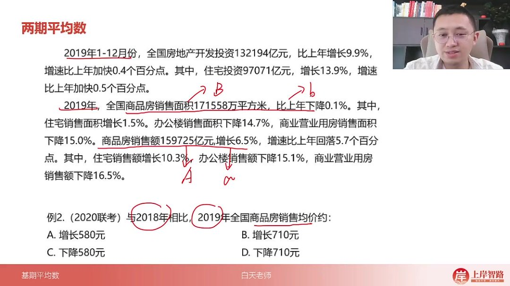

  - 题目解析

    - 关键数据

      ：

      - 分子（销售额）：a=6.5%
      - 分母（销售面积）：b=-0.1%
      - a-b=6.6%>0 → 排除下降选项

    - 计算过程

      ：

      - 计算

        159725171558≈0.931\frac{159725}{171558}≈0.931171558159725≈0.931

        万元/平方米

      - 乘以

        6.6%1+6.5%\frac{6.6\%}{1+6.5\%}1+6.5%6.6%

        ≈0.062

      - 结果约为0.931×0.062≈0.0577万元=577元

    - 速算技巧

      ：

      - 选项无数量级差异，可直接估算
      - 660×比1小的数→结果应小于660

    - 答案：A.增长580元

#### 二、知识小结

| 知识点         | 核心内容                                                     | 考试重点/易混淆点                                            | 难度系数 |
| -------------- | ------------------------------------------------------------ | ------------------------------------------------------------ | -------- |
| 平均数基本概念 | 平均数、比重、倍数的公式均为 a÷b 模型，但含义不同            | 区分不同考点的具体含义（如平均数=总值÷份数）                 | ⭐⭐       |
| 现期平均数     | 题型识别：问题时间与材料时间一致，含“均/平均每”等字眼公式：总值÷份数分子分母区分：后除前（后=分子，前=分母）或看单位运算 | 易混淆分子分母顺序（如“人均收入”需用收入÷人数）单位陷阱（如万吨/天→万吨/年需×365） | ⭐⭐⭐      |
| 基期平均数     | 公式：同基期比重（a÷b × (1+b)/(1+a)）速算：先算现期平均数，再结合增长率判断大小 | 与基期比重公式混淆需注意分子（a）、分母（b）的增长率（小a、小b）对应关系 | ⭐⭐⭐⭐     |
| 两期平均数比较 | 题型识别：两个时间+平均数升降问题比较规则：a>b则上升，a<b则下降计算：现期平均-基期平均=有单位差值（如“上升多少元”） | 易与两期比重混淆（平均数差值有单位，比重差为百分点）无法秒杀：需代入公式计算（a÷b × (a-b)/(1+a)） | ⭐⭐⭐⭐     |
| 实战例题解析   | 例1：现期平均数单位换算（万人÷万所→人/所）例5：单位陷阱（每天→每年需×366）例10：两期平均数差计算（a-b=6.6%，结合现期比值估算结果） | 选项十倍关系需警惕数量级（如例1选A而非C）修正思维：例3分子分母同+5简化计算 | ⭐⭐⭐⭐     |