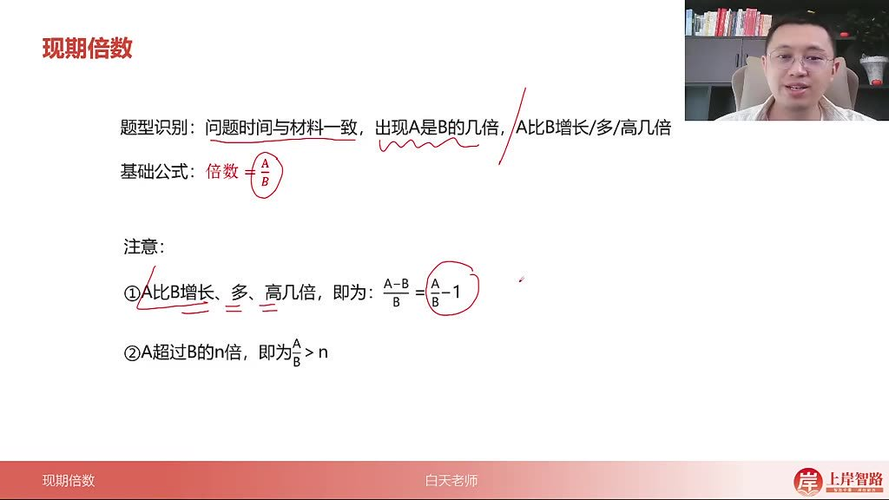
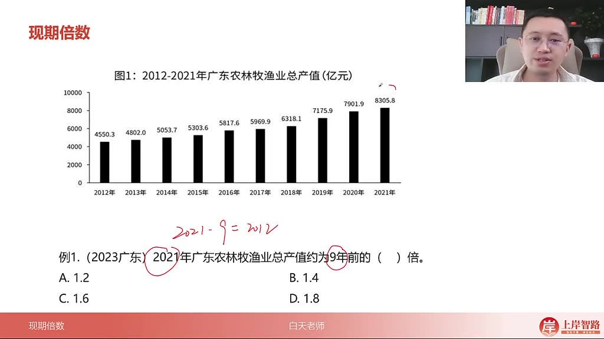
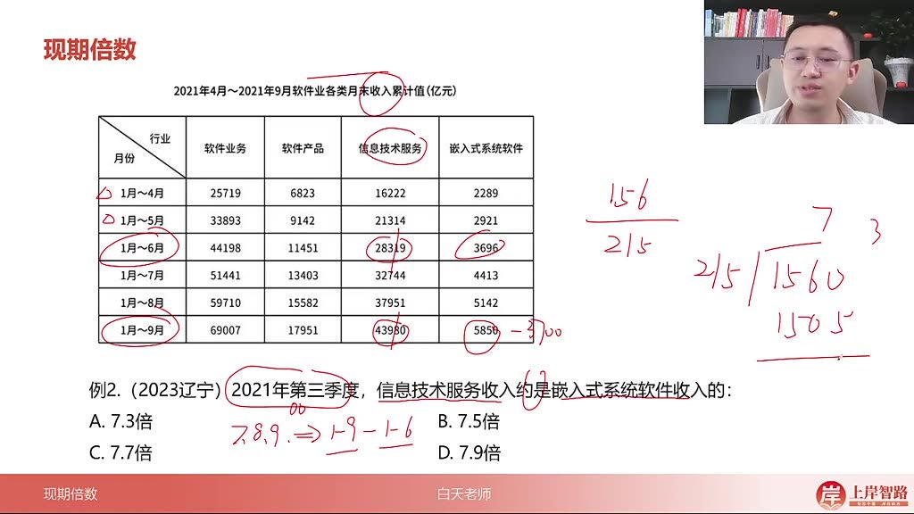
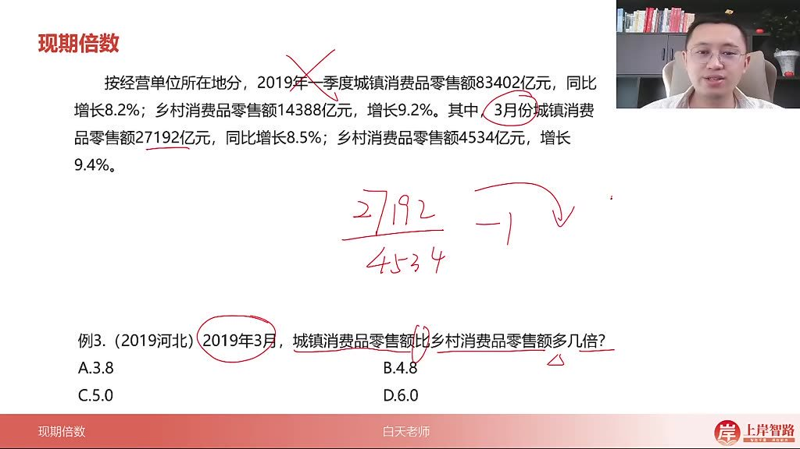
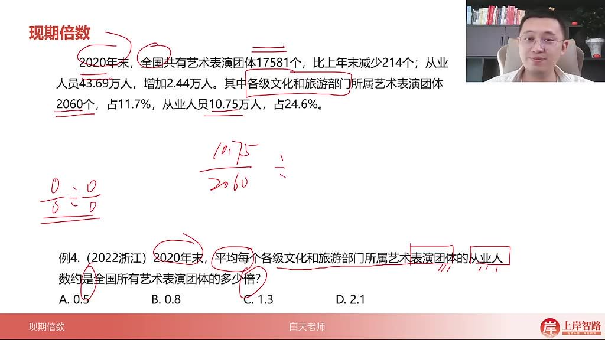
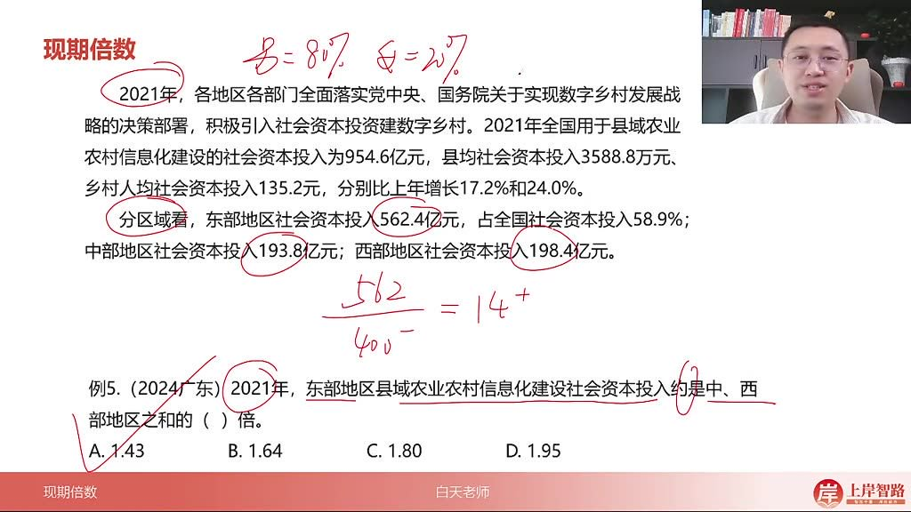
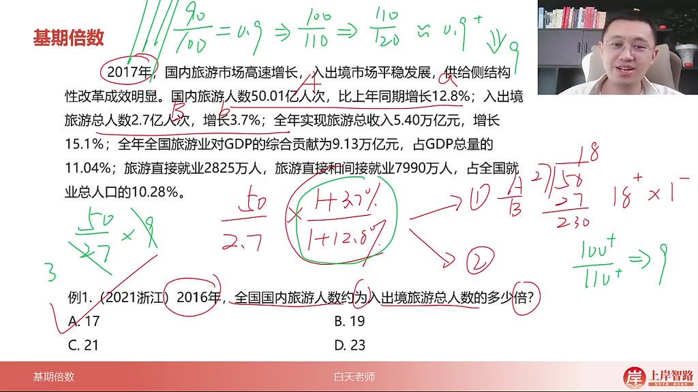

以下为AI生成的图文笔记的内容

#### 一、倍数相关 00:05

##### 1. 现期倍数 00:20

###### 1）现期倍数的题型识别 00:26

- 
- 时间特征：问题时间与材料时间一致（现在的事）
- 关键词：出现"A是B的几倍"或"A比B增长/多/高几倍"

###### 2）基础公式 00:35

- 

- 基本公式：倍数=A÷B（如男生人数÷女生人数）

- 增长倍数公式

  ：

  - A比B增长/多/高几倍=

    A−BB\frac{A-B}{B}BA−B

    =

    (AB−1)(\frac{A}{B}-1)(BA−1)

  - 例：若A是B的6倍，则"多几倍"=6-1=5倍

- 超过判定

  ：A超过B的n倍即

  AB>n\frac{A}{B}>nBA>n

  （等价于

  A>B×nA>B×nA>B×n

  ）

###### 3）应用案例 01:17

- 例题:倍数计算

  - 
  - 题目解析
    - 时间转换：2021年 vs 9年前=2012年
    - 计算：83÷46≈1.8（选项次位差>首位，留两位计算）
    - 速算技巧：46×1=46余37→商8（46×0.8≈36.8）
    - 答案：D.1.8

- 例题:信息技术服务收入倍数 

  01:52

  - 
  - 题目解析
    - 时间陷阱：第三季度=7-9月=1-9月累计-1-6月累计
    - 分子计算：43980-28319≈15600（取前三位）
    - 分母计算：5859-3700≈2150
    - 精确计算：156÷215≈0.725→7.25倍（最接近A）
    - 修正法：分母减7%→分子减11%（156-11=145÷200≈0.725）

- 例题:城镇消费品零售额与乡村消费品零售额倍数 

  04:16

  - 
  - 题目解析
    - 关键区别："多几倍"=是几倍-1
    - 数据定位：3月份城镇27192亿 vs 乡村4534亿
    - 计算：27192÷4534≈6→6-1=5倍
    - 答案：C.5.0

- 例题:平均数与倍数题 

  04:56

  - 
  - 题目解析
    - 模型识别：平均数÷平均数
    - 部门平均数：10.75万人÷2060个团体
    - 全国平均数：43.69万人÷17581个团体
    - 速算：11/21 ÷ 44/18 = 11/21 × 18/44 ≈ 3/14≈0.21
    - 答案：B.0.8（注意单位统一）

- 例题:东部地区社会资本投入与中西部社会资本投入比 

  07:05

  - 
  - 题目解析
    - 总量相同原理：占比倍数=实际量倍数
    - 东部占比：58.9% vs 中西部41.1%
    - 速算：58.9÷41.1≈1.43
    - 验证：562.4÷(193.8+198.4)≈1.43
    - 答案：A.1.43

##### 2. 基期倍数 08:38

###### 1）基期倍数的题型识别 08:42

- 时间特征：问题时间在材料之前（过去的事）

- 基础公式

  ：基期倍数=

  AB×1+b%1+a%\frac{A}{B}×\frac{1+b\%}{1+a\%}BA×1+a%1+b%

  - 其中A为现期分子，a为分子增长率
  - B为现期分母，b为分母增长率

###### 2）应用案例 09:02

- 例题:全国国内旅游人数与入境旅游人数比

  - 

  - 题目解析

    - 方法一：

      - 现期倍数：50÷2.7≈18.5
      - 增长率修正：(1+3.7%)/(1+12.8%)<1→结果<18.5
      - 答案：A.17

    - 方法二（百花分技巧）：

      - 将(1.037/1.128)视为0.9
      - 计算：50÷2.7×0.9≈16.7

    - 记忆点：

      100110\frac{100}{110}110100

      ≈0.9，

      110120\frac{110}{120}120110

      ≈0.9

#### 二、知识小结

| 知识点     | 核心内容                                                     | 考试重点/易混淆点                                            | 难度系数 |
| ---------- | ------------------------------------------------------------ | ------------------------------------------------------------ | -------- |
| 现期倍数   | 问题时间与材料一致时，计算A是B的几倍（公式：A÷B）；若问“增长/多/高几倍”，需用（A÷B-1） | “超过N倍”=A>B×N；注意与增长率概念的联动（增长倍数=现期倍数-1） | ⭐⭐       |
| 基期倍数   | 计算过去时间的倍数，公式：A/(1+a) ÷ B/(1+b) = (A/B)×(1+b)/(1+a) | 速算技巧：先算A/B，再判断(1+b)/(1+a)与1的大小关系；百花分法（如≈0.9的分数直接按9处理） | ⭐⭐⭐      |
| 平均数倍数 | 平均数与倍数结合（如“平均每个X是平均每个Y的几倍”），公式：（A1/B1）÷（A2/B2） | 注意单位一致性；总相同可直接用占比倍数代替实际量倍数（如男生占比80%÷女生占比20%=4倍） | ⭐⭐       |
| 时间陷阱   | 第三季度数据需用“1-9月累计减1-6月累计”计算（非直接取累计值） | 累计值与单季度数据的区分；选项差距小时需精确做差             | ⭐⭐⭐      |
| 速算技巧   | 选项差距大时留两位直除；修正法（同比例调整分子分母）；首位商法结合次位判断 | “次位差＞首位”时可留两位估算；注意横纵对比的百分比修正       | ⭐⭐       |