以下为AI生成的图文笔记的内容

#### 一、混合增长率 00:03

##### 1. 题型识别 00:08

- 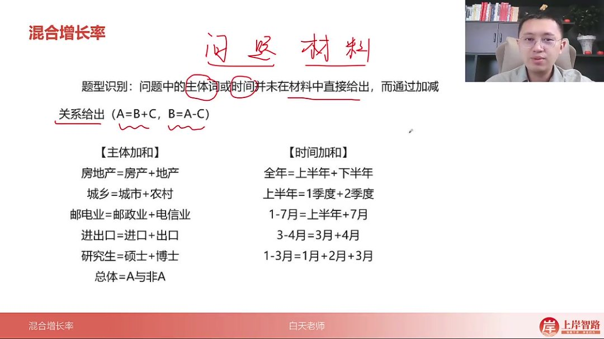

- 核心特征

  ：问题中的主体词或时间未在材料中直接给出，而是通过加减关系呈现（

  A=B+CA=B+CA=B+C

  或

  B=A−CB=A-CB=A−C

  ）

- 主体加和案例

  ：

  - 房地产=房产+地产
  - 城乡=城市+农村
  - 邮电业=邮政业+电信业
  - 进出口=进口+出口
  - 研究生=硕士+博士
  - 总体=A与非A

- 时间加和案例

  ：

  - 全年=上半年+下半年
  - 上半年=1季度+2季度
  - 1-7月=上半年+7月
  - 3-4月=3月+4月
  - 1-3月=1月+2月+3月

##### 2. 混合增长率解析 02:09

- 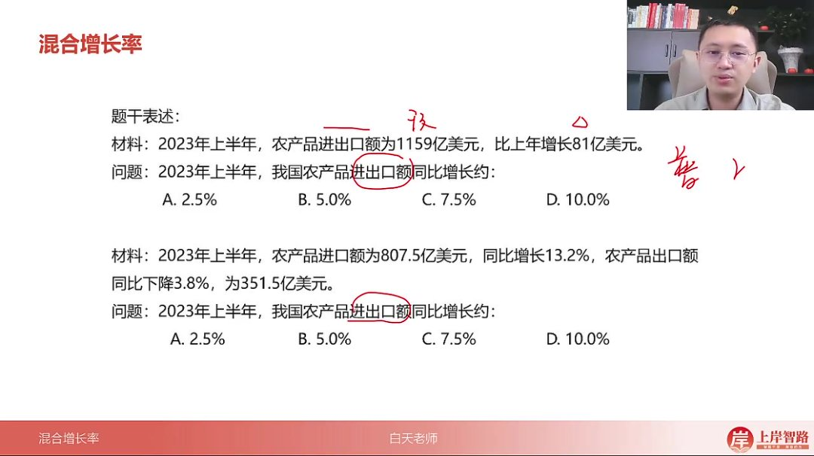

- 本质区别

  ：

  - 普通增长率：材料直接给出总量及其增长量（如直接给出进出口额1159亿美元和增长量81亿美元）
  - 混合增长率：材料给出分量增长率（如进口增长13.2%，出口下降3.8%），通过分量相加得到总量

- 判断逻辑：当问题求增长率的主体需要通过材料中的加减关系推导时，即为混合增长率题型

##### 3. 速算技巧 03:23

- 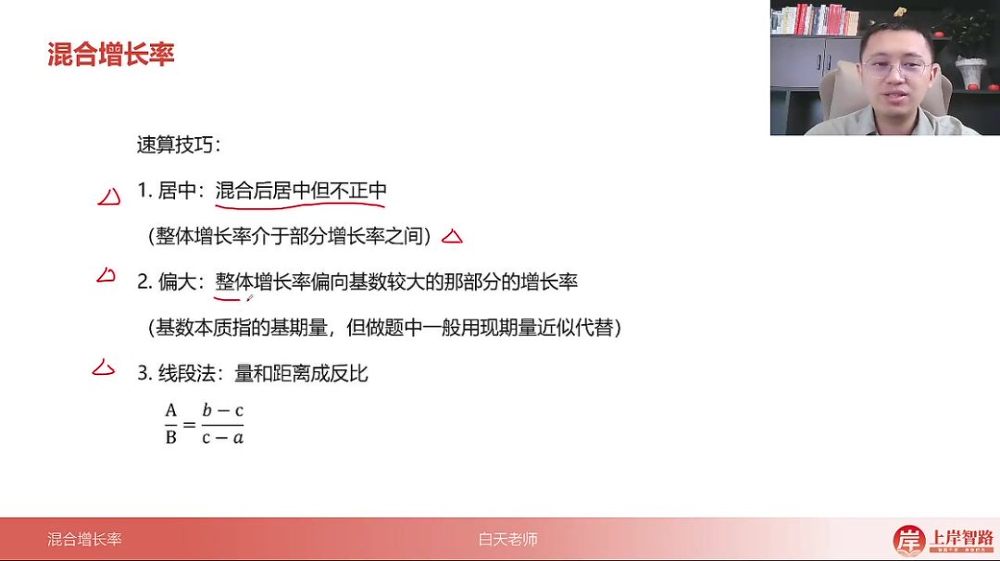

###### 1）居中 03:28

- 基本原理

  ：混合后的整体增长率始终介于各部分增长率之间

  - 例：10%浓度与50%浓度盐水混合后，新浓度必在10%-50%之间
  - 例：A公司增长10%，B公司增长50%，整体增长率必在10%-50%之间

- 应用场景：用于快速排除超出区间的选项

###### 2）偏大 05:41

- 核心规则

  ：整体增长率偏向基数较大部分的增长率

  - 例：1kg10%盐水与100kg50%盐水混合，浓度更接近50%
  - 例：上半年GDP800亿（增长8%），下半年1200亿（增长12%），全年增速更接近12%

- 近似处理：实际操作中可用现期量代替基期量估算

- 解题示范

  ：

  - 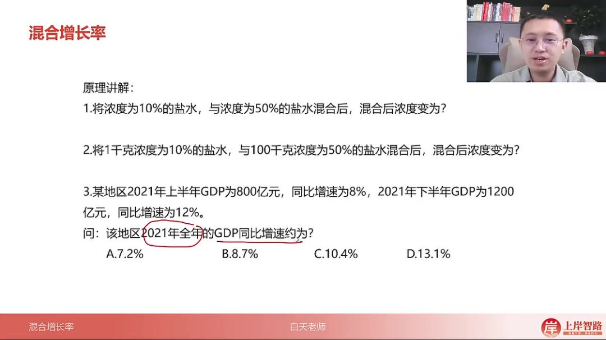
  - 选项分析：全年增速应在8%-12%之间（排除A/D），且因下半年基数更大，应更接近12%，故选C(10.4%)

###### 3）线段法 08:08

- 公式表达

  ：

  AB=b−cc−a\frac{A}{B} = \frac{b-c}{c-a}BA=c−ab−c

  - 其中

    a,ba,ba,b

    为部分增长率，c为整体增长率

  - A,BA,BA,B

    为对应部分的基期量（常用现期量近似）

- 本质关系：量与距离成反比

- 应用说明：当居中和偏大无法确定唯一答案时，需用线段法精确计算

- 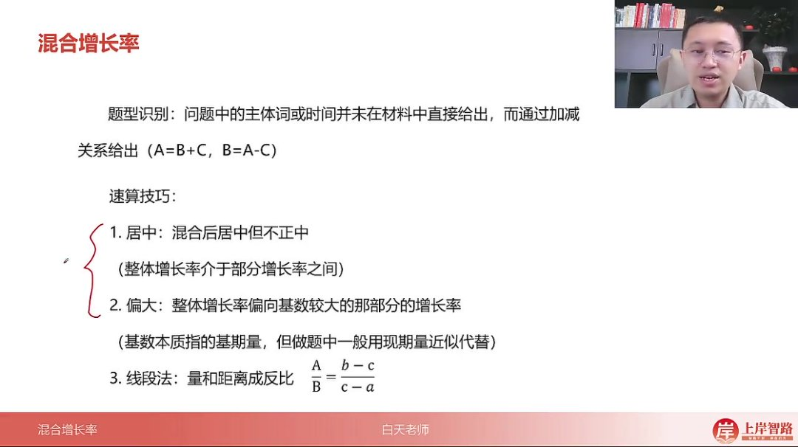

- 解题策略

  ：

  - 先用居中原则排除明显错误选项
  - 再用偏大原则缩小范围
  - 最后用线段法精确计算（必要时）

##### 4. 做题步骤 08:42

###### 1）已知两个部分增速，求总增速 08:54

- 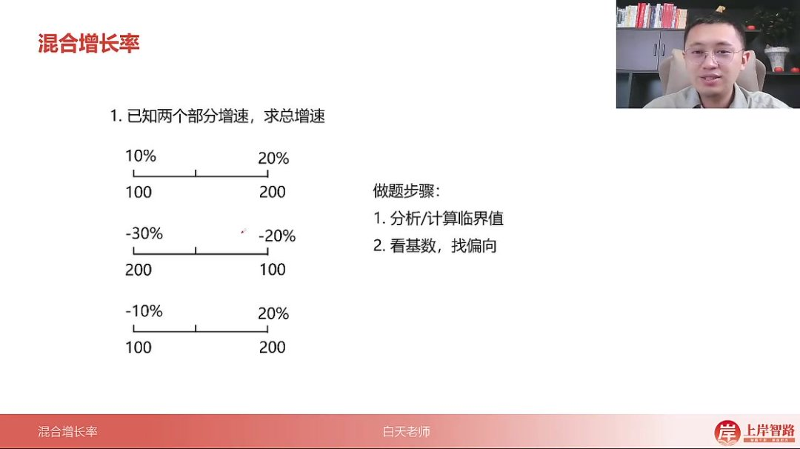

- 居中原则：总增速始终介于两个部分增速之间。例如部分增速为10%和20%，总增速必在10%-20%之间。

- 基数影响：总增速会偏向基数较大的一侧。如部分A基数200大于部分B基数100，总增速更靠近部分A的增速。

- 临界值计算：中间值为(10%+20%)/2=15%，当基数不等时，总增速在15%-20%之间。

- 正负处理：原理相同，如部分增速为-30%和-20%，总增速在-30%至-20%之间，靠近基数大的部分。

- 例题：商品房销售额增速范围 

  12:47

  - 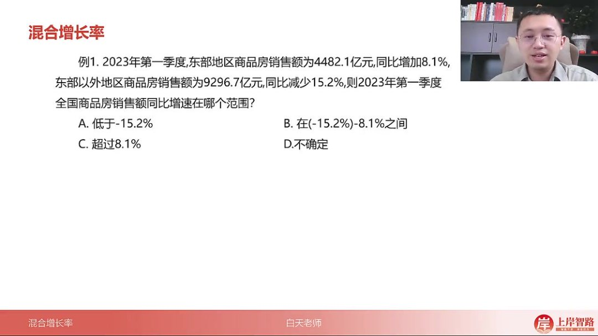
  - 题目解析
    - 审题：东部增速8.1%（基数4482.1亿），其他地区增速-15.2%（基数9296.7亿）
    - 解题：总增速居中在-15.2%至8.1%之间，且基数更大的其他地区使总增速偏向-15.2%
    - 答案：B（-15.2%至8.1%之间）

- 例题：跨境电商增速计算 

  13:24

  - 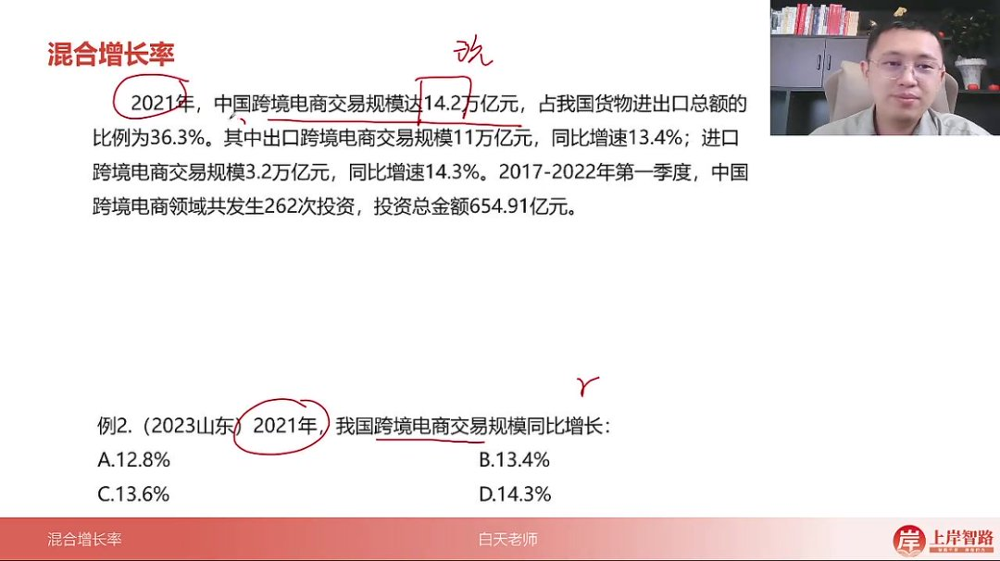
  - 题目解析
    - 审题：出口增速13.4%（11万亿），进口增速14.3%（3.2万亿）
    - 解题：总增速必在13.4%-14.3%之间，选项C的13.6%符合居中原则
    - 答案：C

- 例题：公共预算收入增速 

  14:30

  - 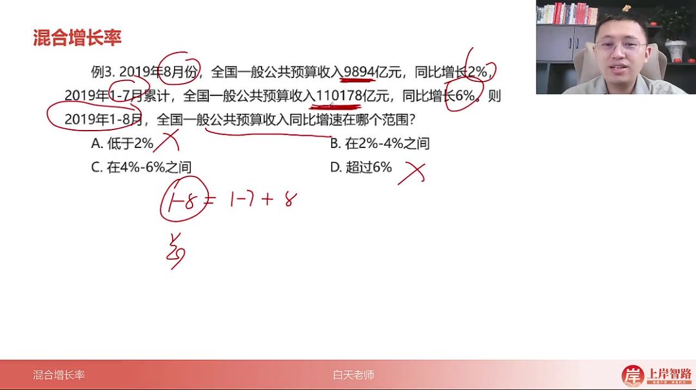
  - 题目解析
    - 审题：8月增速2%（基数9894亿），1-7月增速6%（基数110178亿）
    - 解题：1-8月增速在2%-6%之间，因1-7月基数极大，总增速靠近6%
    - 答案：C（4%-6%之间）

- 例题：邮电业务增速范围 

  15:18

  - 
  - 题目解析
    - 审题：电信增速75.8%（基数3575.86亿），邮政增速32%（基数2489.85亿）
    - 解题：总增速在32%-75.8%之间，电信基数更大使总增速靠近75.8%
    - 答案：C（50%-75%之间）

###### 2）已知一个部分和总增速，求另一个部分增速 16:23

- 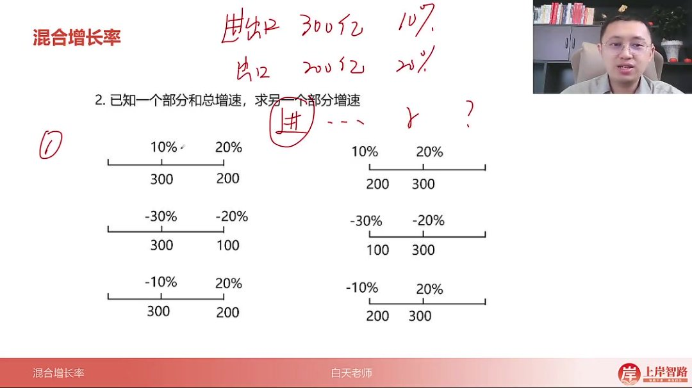

- 杠杆原理：基数与增速距离成反比，基数大的部分距离总增速更近。

- 方向判断：当已知部分增速小于总增速时，另一部分增速必大于总增速，反之亦然。

- 距离量化：若两部分基数相等，增速距离相同；基数不等时，大基数侧距离缩短。

- 符号处理：负增速同样适用，比较时需带符号比较大小（如-30%<-20%）。

- 例题：异地快递增速范围 

  22:58

  - 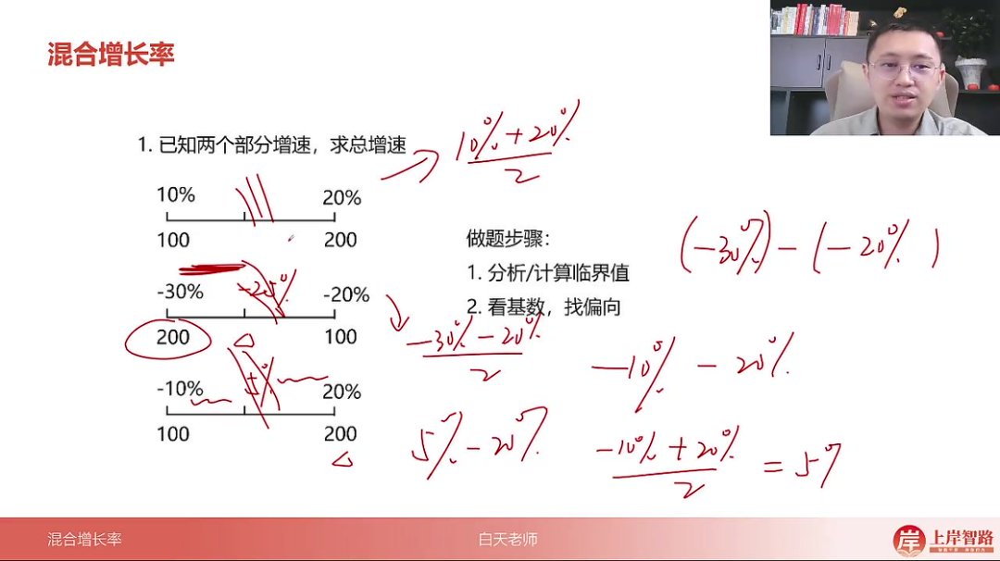
  - 题目解析
    - 审题：同城增速36%（基数4488万件），总增速48%
    - 解题：异地增速必>48%（因36%<48%），直接选D
    - 答案：D（超过48%）

- 例题：手机出货量降幅计算 

  23:40

  - 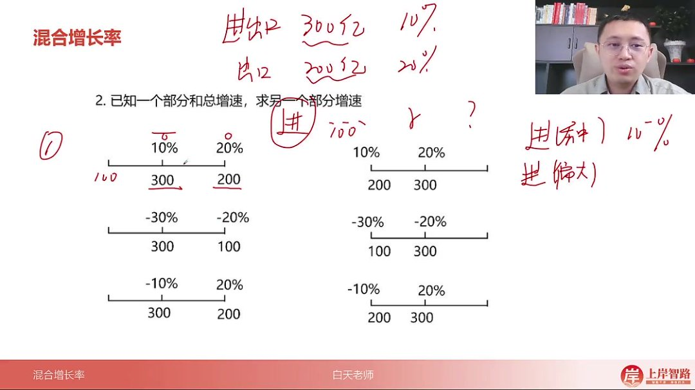
  - 题目解析
    - 审题：3月增速-29%（基数2699.5万部），1-3月增速-27.8%（基数7586.4万部）
    - 计算：1-2月基数=7586.4-2699.5≈4887万部 > 3月基数
    - 结论：1-2月增速应比-27.8%略高（距离更近），选最接近的C
    - 答案：C（-27.1%）

- 例题：包裹寄递量增速判断 

  27:31

  - 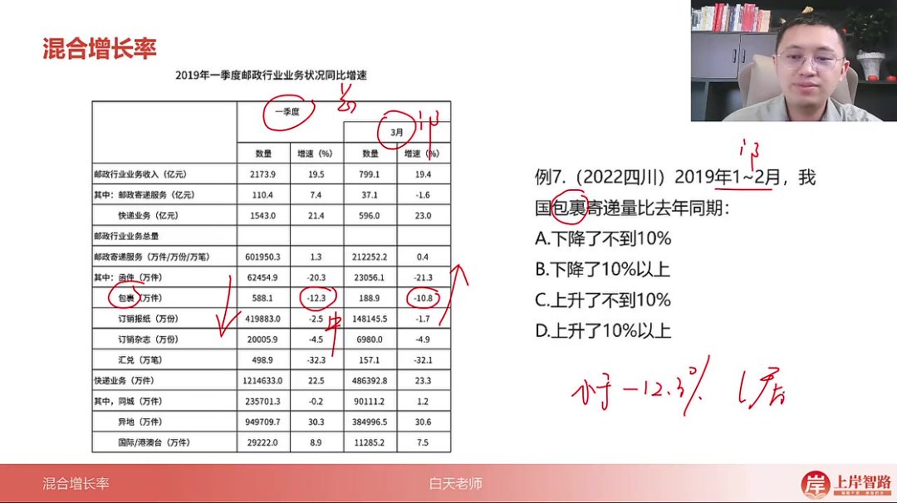
  - 题目解析
    - 审题：3月增速-10.8%，1-3月增速-12.3%
    - 解题：1-2月增速必<-12.3%（因-10.8%>-12.3%），即下降超12.3%
    - 答案：B（下降10%以上）

- 例题：限额以下餐饮收入增速 

  28:42

  - 
  - 题目解析
    - 审题：限额以上增速61.8%（基数1459亿），总额增速68.9%（基数7085亿）
    - 计算：限额以下基数=7085-1459=5626亿 > 限额以上基数
    - 结论：限额以下增速应比68.9%略高（距离更近），选B
    - 答案：B（71%）

##### 5. 线段法讲解 30:46

###### 1）核心原理

- 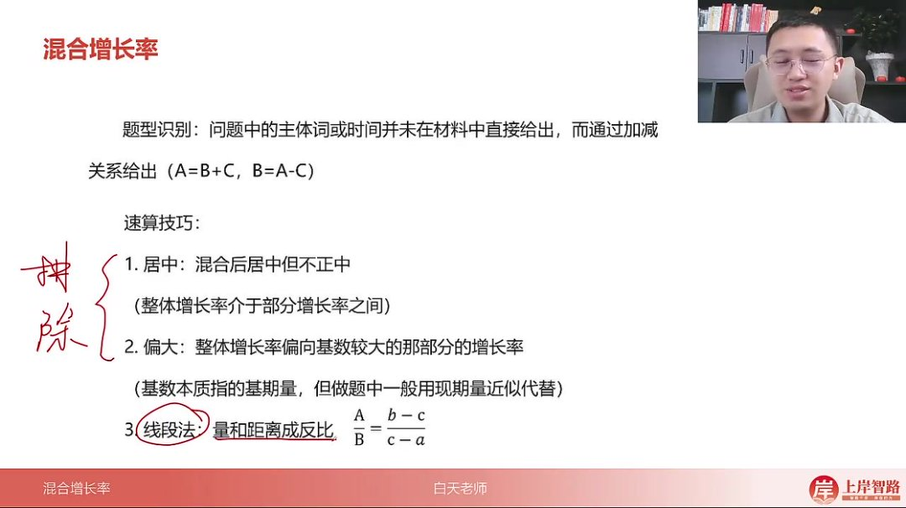

- 题型识别

  ：适用于混合增长率问题，当问题中的主体词或时间未在材料中直接给出，而通过加减关系（如

  A=B+CA=B+CA=B+C

  或

  B=A−CB=A-CB=A−C

  ）给出时使用

- 速算技巧

  ：

  - 居中原则：混合后增长率介于部分增长率之间（但不一定正中）

  - 偏大原则：整体增长率偏向基数较大部分的增长率（基数一般用现期量近似代替）

  - 线段法公式

    ：

    AB=b−cc−a\frac{A}{B} = \frac{b-c}{c-a}BA=c−ab−c

    ，其中A、B为量，a、b为对应增长率，c为混合增长率

###### 2）操作步骤

- 口诀记忆

  ："量和距离成反比"

  - 量：指各部分的现期量（如进口额、出口额）
  - 距离：指各部分增长率与混合增长率的差值

- 作图方法

  ：

  - 画一条线段，将混合增长率c写在中间
  - 较大增长率写在右侧，对应量写在下方
  - 较小增长率写在左侧，对应量写在下方

- 计算流程

  ：

  - 先通过居中原则排除明显错误选项
  - 再用偏大原则缩小范围
  - 最后用线段法精确计算

###### 3）例题：农产品进出口增长率

- 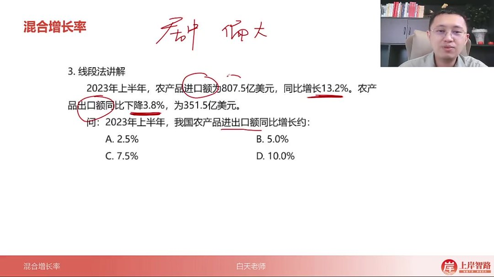

- 题目解析

  - 数据提取

    ：

    - 进口额807.5亿美元（量A），增速13.2%（a）
    - 出口额351.5亿美元（量B），增速-3.8%（b）

  - 解题步骤

    ：

    - 居中排除：混合增速应介于-3.8%到13.2%之间，排除A、B

    - 偏大判断：进口量更大，应更靠近13.2%，排除D

    - 线段法验证：

      - 量比：

        350800=13.2−cc−(−3.8)\frac{350}{800} = \frac{13.2-c}{c-(-3.8)}800350=c−(−3.8)13.2−c

      - 解得

        c≈7.5c≈7.5%c≈7.5

  - 答案：C.7.5%

###### 4）例题：邮电业务总量增速

- 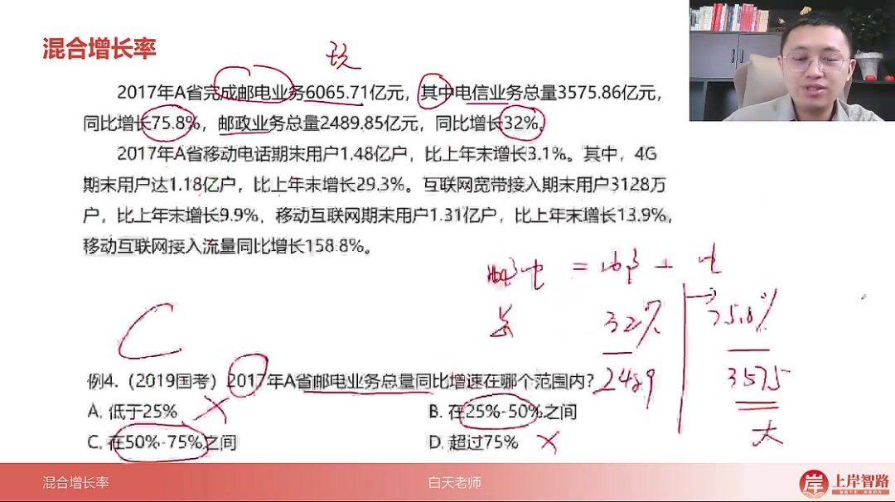

- 题目解析

  - 数据提取

    ：

    - 电信业务3575.86亿元（量A），增速75.8%（a）
    - 邮政业务2489.85亿元（量B），增速32%（b）

  - 解题步骤

    ：

    - 居中判断：混合增速应在32%-75.8%之间，排除A、D

    - 偏大判断：电信业务量更大，应更靠近75.8%

    - 线段法计算：

      - 量比：

        25003600≈75.8−cc−32\frac{2500}{3600} ≈ \frac{75.8-c}{c-32}36002500≈c−3275.8−c

      - 解得

        c≈55c≈55%c≈55

  - 答案：C.在50%-75%之间

###### 5）例题：互联网业务收入增速

- 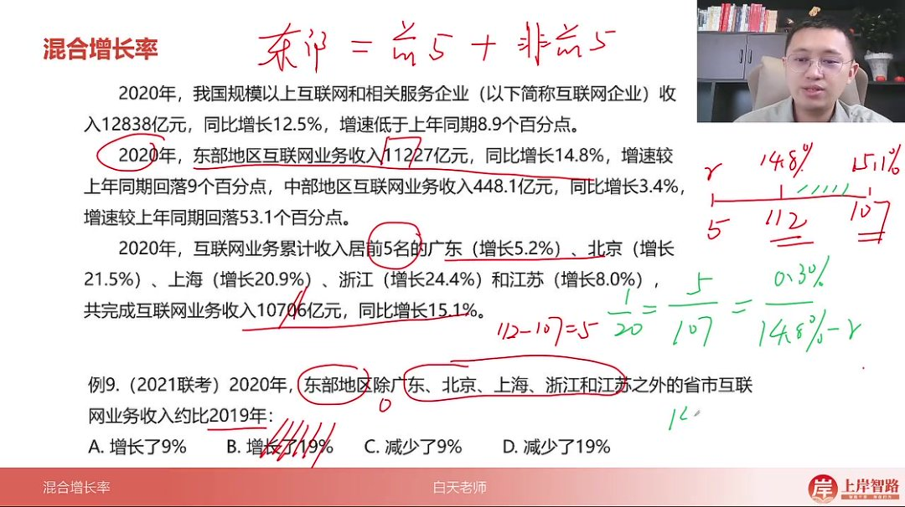

- 题目解析

  - 数据关系：东部地区=前五省份+其他地区

  - 数据提取

    ：

    - 东部总量11227亿元，增速14.8%（c）
    - 前五省10706亿元，增速15.1%（a）
    - 其他地区521亿元（11227-10706），求增速r

  - 解题步骤

    ：

    - 量比：

      5107≈15.1−14.814.8−r\frac{5}{107} ≈ \frac{15.1-14.8}{14.8-r}1075≈14.8−r15.1−14.8

    - 解得

      r≈8.8r≈8.8%r≈8.8

  - 答案：A.增长了9%

###### 6）例题：社会消费品零售增速

- 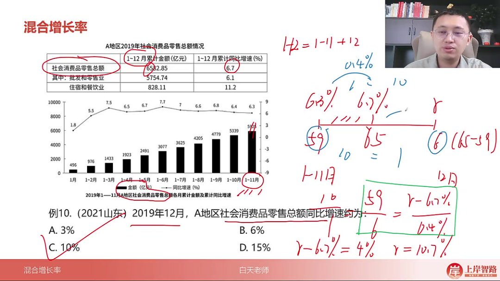

- 题目解析

  - 数据关系：1-12月=1-11月+12月

  - 数据提取

    ：

    - 全年6582.85亿元，增速6.7%（c）
    - 1-11月约5900亿元（估算），增速6.3%（a）
    - 12月约682亿元，求增速r

  - 解题步骤

    ：

    - 量比：

      596≈r−6.76.7−6.3\frac{59}{6} ≈ \frac{r-6.7}{6.7-6.3}659≈6.7−6.3r−6.7

    - 解得

      r≈10.7r≈10.7%r≈10.7

  - 答案：C.10%

###### 7）快速计算技巧

- 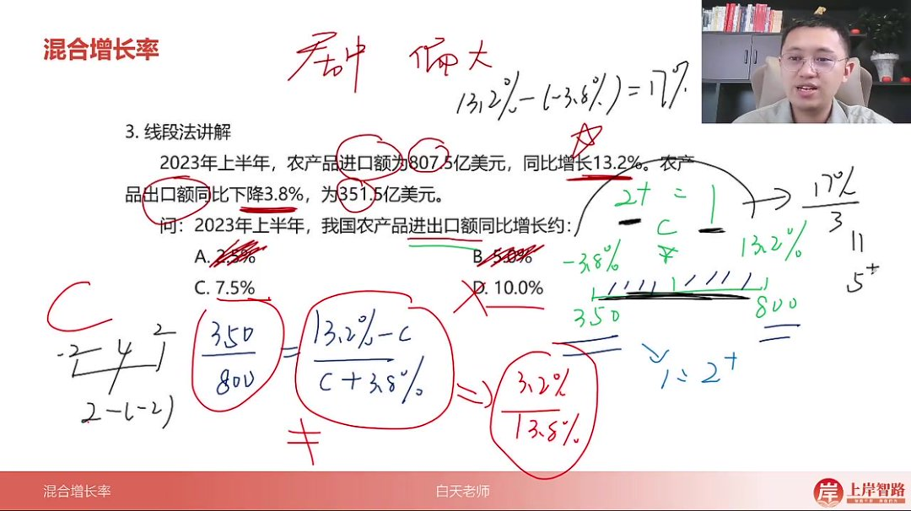

- 距离分配法

  ：

  - 计算总距离：较大增速-较小增速（如13.2%-(-3.8%)=17%）

  - 按量比分配距离：

    - 量比1:2时，距离按2:1分配

    - 17%分成3份，较小量对应

      173×2≈11.3\frac{17}{3}×2≈11.3%317×2≈11.3

  - 从较大增速减去分配距离：13.2%-5.7%≈7.5%

- 适用场景：选项差距较大时快速估算

##### 6. 题型识别总结

- 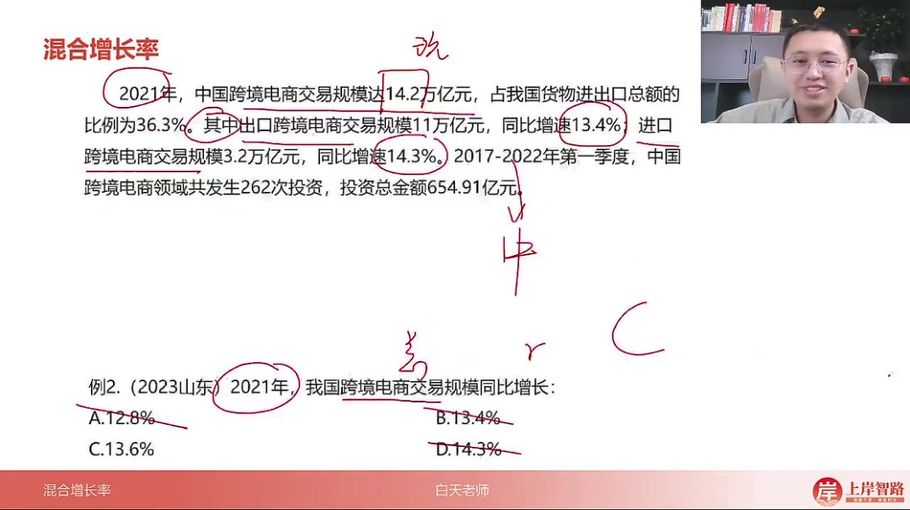

- 核心特征

  ：问题中的主体词或时间未在材料中直接给出，而是通过加减关系呈现（

  A=B+CA=B+CA=B+C

  或

  B=A−CB=A-CB=A−C

  形式）

- 速算技巧

  ：

  - 居中原则：混合后整体增长率介于部分增长率之间

  - 偏大原则：整体增长率偏向基数较大部分的增长率（基数本质为基期量，实践中常用现期量近似代替）

  - 线段法

    ：量距离成反比，公式为

    AB=b−cc−a\frac{A}{B} = \frac{b-c}{c-a}BA=c−ab−c

##### 7. 差值混合增长率

###### 1）理论基础 42:38

- 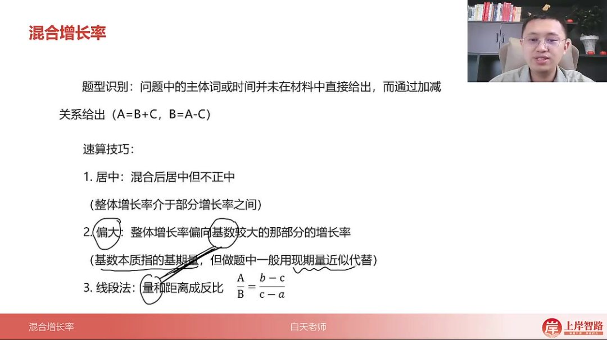

- 模型转换

  ：任何

  A=B+CA=B+CA=B+C

  或

  B=A−CB=A-CB=A−C

  形式的差值关系均可转换为混合增长问题

- 量本质说明

  ：

  - 基数本质：理论应为基期量，实际计算可用现期量替代
  - 应用限制：当现期量与基期量差异显著时需采用精确计算（需参考十字交叉法专题课程）

###### 2）例题：收支盈余增长率计算

- 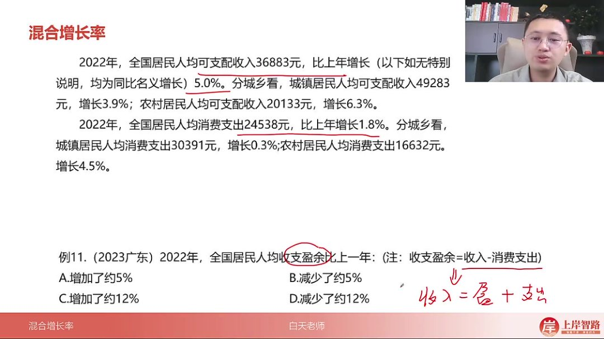

- 题目解析

  - 模型建立

    ：收支盈余=收入-支出 → 收入=盈余+支出（

    A=B+CA=B+CA=B+C

    模型）

  - 参数确定

    ：

    - 总收入增长率5%（整体）
    - 总支出增长率1.8%（部分）

  - 解题步骤

    ：

    - 居中原则：盈余增长率应>5%（因1.8%<5%）
    - 选项筛选：仅C选项(12%)符合>5%条件

  - 易错点：注意增长率符号方向，避免误选负增长选项

###### 3）例题：贸易逆差增长率计算

- 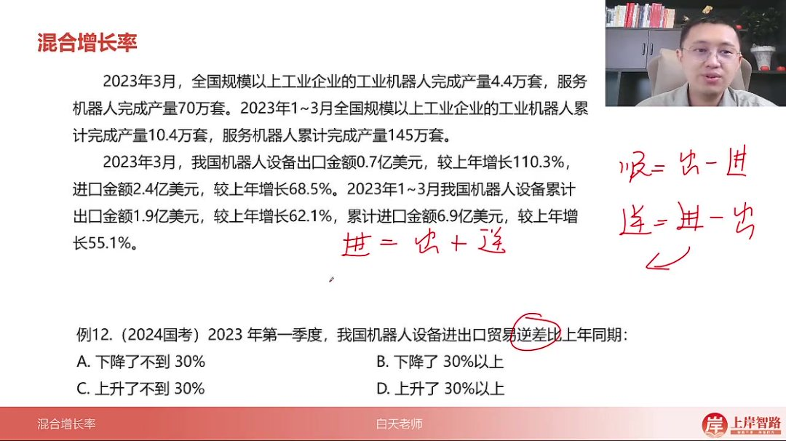

- 题目解析

  - 模型转换

    ：逆差=进口-出口 → 进口=出口+逆差（

    A=B+CA=B+CA=B+C

    模型）

  - 参数提取

    ：

    - 进口基数6.9亿，增速55.1%（整体）
    - 出口基数1.9亿，增速62.1%（部分）

  - 解题过程

    ：

    - 基数比较：逆差基数=6.9-1.9=5亿 > 出口基数1.9亿
    - 线段法应用：
      - 距离计算：62.1%-55.1%=7%
      - 量距反比：5亿对应距离应<7%
    - 结果判定：逆差增速=55.1%-（<7%）→ 上升幅度>30%

  - 技巧提示：当选项差距明显时，可通过基数比较快速锁定范围

#### 二、知识小结

| 知识点             | 核心内容                                                     | 考试重点/易混淆点                             | 难度系数 |
| ------------------ | ------------------------------------------------------------ | --------------------------------------------- | -------- |
| 混合增长率题型识别 | 通过问题和材料中的加减关系（如a=b+c）判定，主体词或时间需通过材料间接给出 | 需结合材料中的隐含加减关系，非直接判定        | ⭐⭐⭐      |
| 混合增长率核心理论 | 居中偏大线段法：1. 居中：整体增长率介于部分增长率之间2. 偏大：整体增长率偏向基数较大的部分增长率3. 线段法：量与距离成反比 | 正负增长率混合时需注意符号比较（如-30%<-20%） | ⭐⭐⭐⭐     |
| 主体加和关系       | 常见加和主体：- 邮电=邮政+电信- 城乡=城市+农村- 进出口=进口+出口- 研究生=硕士+博士 | 需记忆高频加和关系，材料未直接给出时需联想    | ⭐⭐       |
| 溶液类比解释       | 用盐水浓度混合类比增长率混合：- 10%+50%混合浓度→介于10%~50%- 基数大则混合结果更靠近大基数 | 基数权重影响结果偏向                          | ⭐⭐       |
| 线段法实操         | 公式：量1/量2 = (增速2-整体增速)/(整体增速-增速1)例：350/800=(13.2%-r)/(r+3.8%) | 解方程时优先代入选项验证                      | ⭐⭐⭐⭐     |
| 差值混合模型       | a=b-c变形为b=a+c（如收入=盈余+支出）例：收入增速5%，支出增速1.8%→盈余增速>5% | 减法关系需转化为加法模型                      | ⭐⭐⭐      |
| 真题应用案例       | 1. 城乡增长率→城镇+乡村数据混合2. 进出口增长率→进口+出口数据混合3. 季度GDP→上下半年数据混合 | 选项排除顺序：居中→偏大→线段法                | ⭐⭐⭐⭐     |