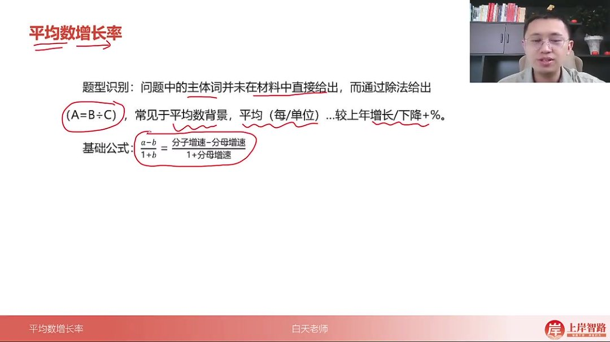
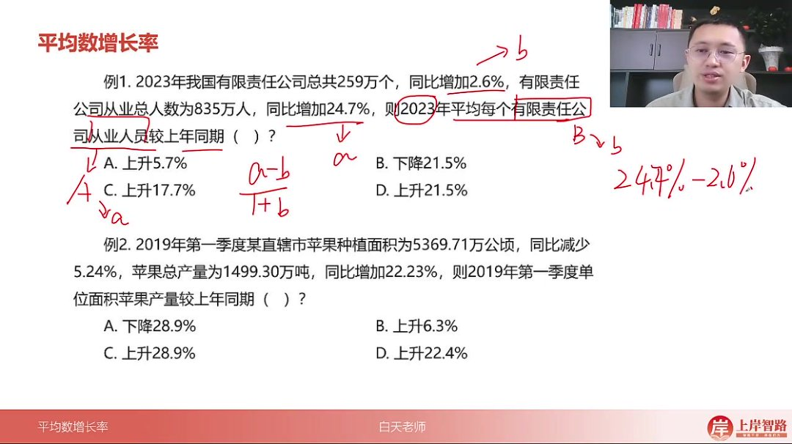
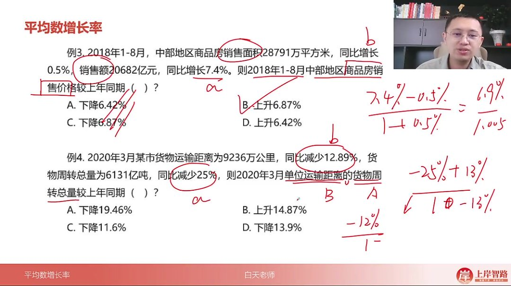
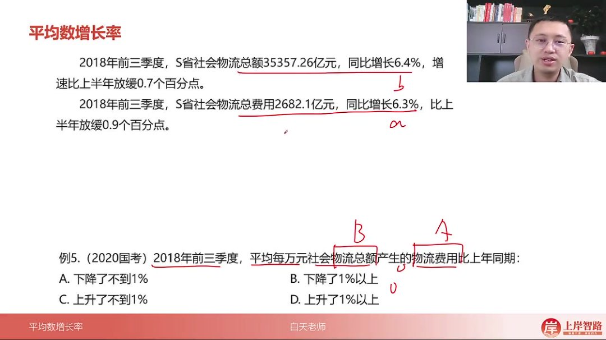
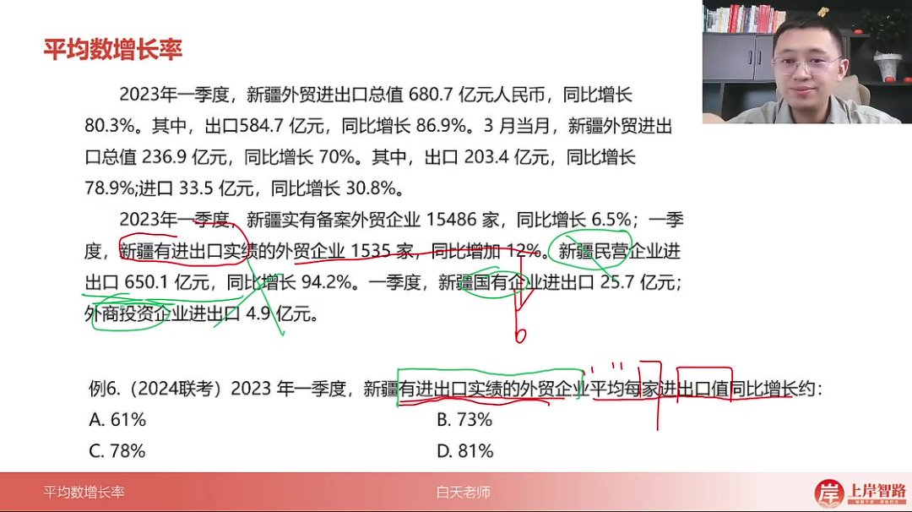
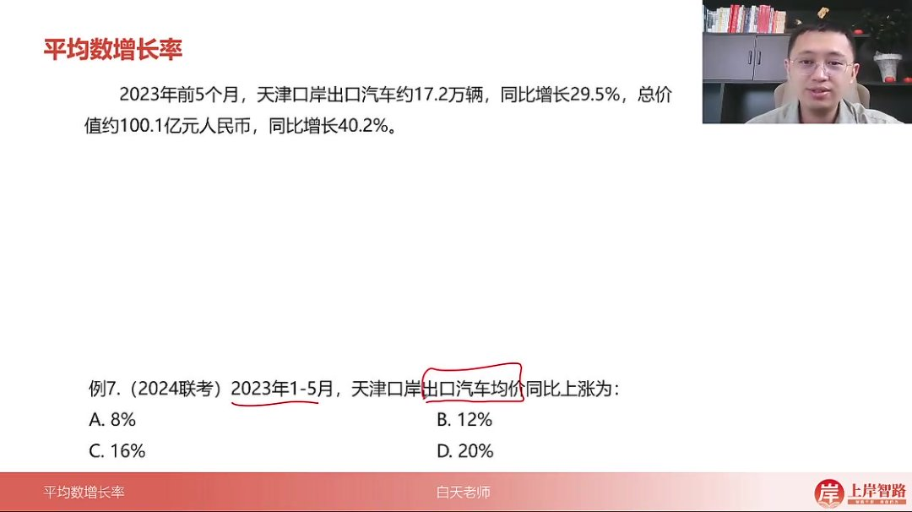
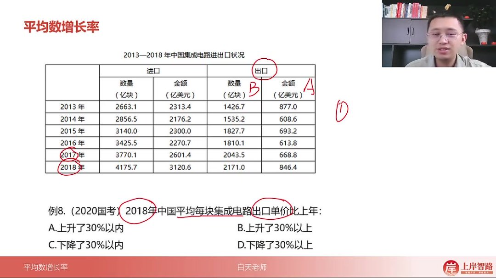
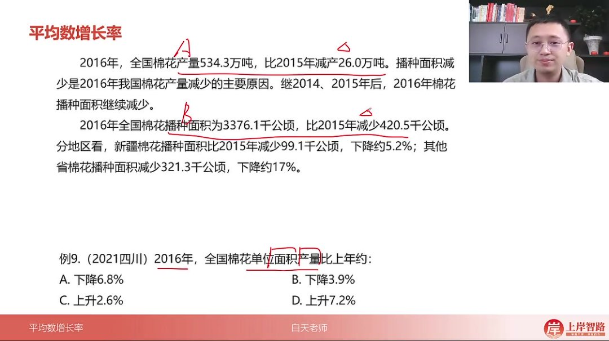

以下为AI生成的图文笔记的内容

#### 一、平均数增长率 00:05

##### 1. 平均数增长率 00:10

###### 1）平均数增长率的概念 01:06

- 

- 题型识别

  ：当问题中的主体词未在材料中直接给出，而是通过除法形式

  (A=B÷C)(A=B \div C)(A=B÷C)

  呈现时，常见于平均数背景（如"平均每/单位...较上年增长/下降+%"）

- 基础公式

  ：

  a−b1+b\frac{a-b}{1+b}1+ba−b

  ，其中a为分子增长率，b为分母增长率

- 本质理解：区别于普通增长率（直接给出现期基期值），需要通过除法运算构建平均数后再计算增长率

###### 2）公式推导与注意事项 02:59

- 推导过程

  ：

  - 设分子B增速为a%，分母C增速为b%

  - 通过

    AB−AB×1+b1+aAB×1+b1+a\frac{\frac{A}{B}-\frac{A}{B}\times\frac{1+b}{1+a}}{\frac{A}{B}\times\frac{1+b}{1+a}}BA×1+a1+bBA−BA×1+a1+b

    逐步化简得到最终公式

- 注意事项

  ：

  - 符号规范：必须标注百分号，同比增加为正/减少为负（如下降10%应记为-10%）
  - 分子分母：严格遵循"后÷前"原则（如"人均收入"=收入÷人口）
  - 数据获取：若未直接给出a和b，需先计算分子分母各自的增长率

###### 3）应用案例 04:12

- 基础计算题型

  - 解题要点

    ：

    - 识别"平均每个...从业人员"为平均数结构（从业人员÷企业数量）

    - 分子增速a=24.7%，分母增速b=2.6%

    - 套用公式得

      24.7%−2.6%1+2.6%\frac{24.7\%-2.6\%}{1+2.6\%}1+2.6%24.7%−2.6%

      ≈22.1%，对应选项D

  - 速算技巧

    ：当

    1+b1+b1+b

    接近1时，结果近似等于

    a−ba-ba−b

- 负增长率处理 

  07:49

  - 

  - 特殊情形

    ：

    - 分子增速a=22.23%，分母增速b=-5.24%

    - 计算

      22.23%−(−5.24%)1−5.24%\frac{22.23\%-(-5.24\%)}{1-5.24\%}1−5.24%22.23%−(−5.24%)

      ≈27.47%/0.9478≈29%，选C

  - 易错警示：减负数变加法，最终值会大于分子增速

- 经济指标应用 

  08:40

  - 典型场景

    ：

    - 商品房销售价格=销售额÷销售面积

    - a=7.4%，b=0.5%，得

      6.9%1.005\frac{6.9\%}{1.005}1.0056.9%

      ≈6.87%

  - 商业常识：类似指标还包括人均GDP、单位成本等

- 复合概念解析 

  09:17

  - 

  - 概念拆解

    ：

    - "单位运输距离货物周转量"=周转量÷运输距离

    - a=-25%，b=-12.89%，得

      −12.11%0.8711\frac{-12.11\%}{0.8711}0.8711−12.11%

      ≈-13.9%

  - 符号判断：分子为负时需先确定升降方向再计算幅度

- 微观经济分析 

  11:00

  - 

  - 精细计算

    ：

    - 物流费用率=物流费用÷物流总额

    - a=6.3%，b=6.4%，得

      −0.1%1.064\frac{-0.1\%}{1.064}1.064−0.1%

      ≈-0.094%

  - 结论表述：下降幅度小于1%时应选最精确选项

- 数据定位技巧 

  12:09

  - 

  - 数据关联

    ：

    - 进出口总值增速a=80.3%对应有实绩企业

    - 企业数量增速b=12%，得

      68.3%1.12\frac{68.3\%}{1.12}1.1268.3%

      ≈61%

  - 逻辑验证

    ：结果应小于

    a−ba-ba−b

    的差值68.3%

- 贸易指标分析 

  14:22

  - 

  - 快速估算

    ：

    - 汽车均价=总价值÷出口量

    - a=40.2%，b=29.5%，得

      10.7%1.295\frac{10.7\%}{1.295}1.29510.7%

      ≈8.26%

  - 选项匹配：选择最接近的A选项（8%）

- 无增速数据处理 

  15:10

  - 

  - 替代方案

    ：

    - 先计算分子增速a=

      846.4−668.8668.8\frac{846.4-668.8}{668.8}668.8846.4−668.8

      ≈26.56%

    - 分母增速b=

      2171−2043.52043.5\frac{2171-2043.5}{2043.5}2043.52171−2043.5

      ≈6.24%

    - 最终

      20.32%1.0624\frac{20.32\%}{1.0624}1.062420.32%

      ≈19.13%

  - 范围判断：明确30%以内的上升区间

- 农业产量分析 

  18:34

  - 

  - 负增长处理

    ：

    - 产量增速a=

      −26560.3\frac{-26}{560.3}560.3−26

      ≈-4.64%

    - 面积增速b=

      −420.53796.6\frac{-420.5}{3796.6}3796.6−420.5

      ≈-11.08%

    - 得

      6.44%0.8892\frac{6.44\%}{0.8892}0.88926.44%

      ≈7.24%

  - 趋势验证：双重负号最终得正增长

#### 二、知识小结

| 知识点           | 核心内容                                                     | 考试重点/易混淆点                                            | 难度系数 |
| ---------------- | ------------------------------------------------------------ | ------------------------------------------------------------ | -------- |
| 平均数增长率定义 | 求平均数的增长率，需通过除法模型（如总收入/总人口）间接计算  | 区分普通增长率与平均数增长率的关键在于题干主体词是否直接给出数据 | ⭐⭐       |
| 题型识别         | 题干主体词（如人均收入）在材料中未直接给出，需通过分子（总收入）、分母（总人口）计算 | 后除前原则：明确分子（后）与分母（前）的对应关系（如人均收入=收入/人口） | ⭐⭐       |
| 核心公式         | a-b÷(1+b)- a：分子增长率（如收入增速）- b：分母增长率（如人口增速） | 易错点：1. 忽略百分号与正负号（如下降5%需写为-5%）2. 混淆分子分母位置 | ⭐⭐⭐      |
| 推导逻辑         | 通过字母推导简化计算（如大A、小a代表分子现期量与增速）       | 实际考试中无需重复推导，直接套用结论公式                     | ⭐⭐⭐⭐     |
| 解题步骤         | 1. 识别平均数模型2. 确定a、b对应数据3. 代入公式计算          | 高频陷阱：材料未直接给出a、b，需先计算增速（如通过现期/基期量推算） | ⭐⭐⭐      |
| 真题示例         | 例1：有限责任公司从业人员增长率（24.7%-2.6%）/(1+2.6%)≈22.1%例2：棉花单位面积产量（-5%-(-11%)）/(1-11%)≈6.7% | 选项分析技巧：- 正负号判断升降- 分母>1时结果小于分子，反之亦然 | ⭐⭐⭐      |
| 注意事项         | 1. 强制标注百分号与正负号2. 严格区分分子分母（后除前）3. 无直接增速时先计算a、b | 对比维度：- 时间成本：直接套公式＜原始计算法- 准确率：公式法＞自行推导 | ⭐⭐       |