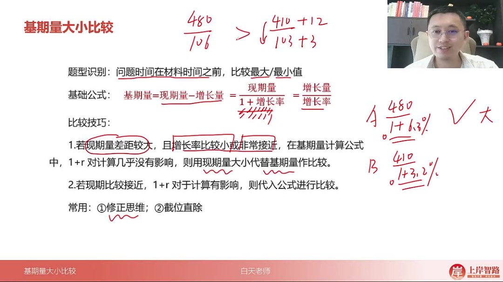
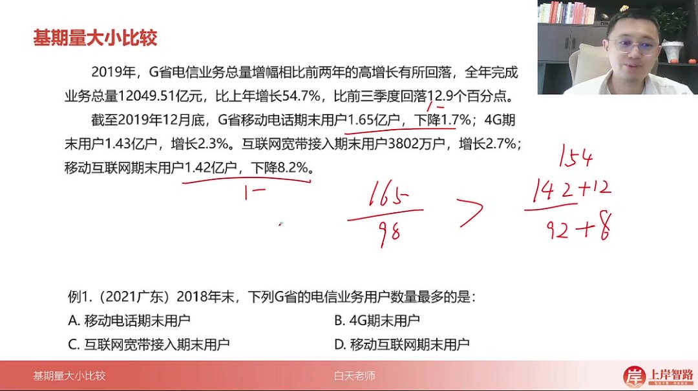
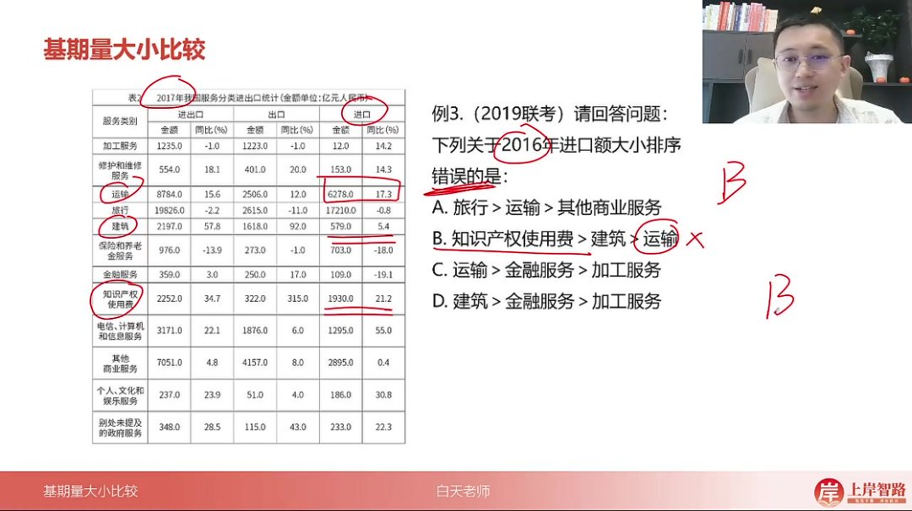

以下为AI生成的图文笔记的内容

#### 一、基期量大小比较 00:05

- 

##### 1. 题型识别 00:21

- 时间特征：问题时间在材料时间之前，比较过去量的大小
- 核心判断：当题目要求比较"过去某个时期"的最大/最小值时，即为基期量比较题型
- 考评特点：近年考查频率较低，属于难度较小的考点

##### 2. 现期量增长量基础公式 00:32

- 

- 三大公式

  ：

  - 基期量 = 现期量 - 增长量

  - 基期量 =

    现期量1+增长率\frac{现期量}{1+增长率}1+增长率现期量

  - 基期量 =

    增长量增长率\frac{增长量}{增长率}增长率增长量

- 最常用公式：第二个公式（现期量除以1+增长率）使用频率最高

##### 3. 比较技巧 00:43

- 现期量差距大时

  ：

  - 适用条件：现期量差距较大，且增长率较小或非常接近（如3%和6%）
  - 简化方法：直接用现期量大小代替基期量比较
  - 原理：此时分母（1+r）对计算结果影响极小

- 现期量接近时

  ：

  - 必须计算

    ：需代入完整公式

    现期量1+增长率\frac{现期量}{1+增长率}1+增长率现期量

    进行比较

  - 实用技巧

    ：

    - 修正思维：将分母或分子修正为相同值后比较
    - 截位直除：快速计算近似值比较

- 示例分析

  ：

  - A选项：

    4801+6.3%\frac{480}{1+6.3\%}1+6.3%480

    ≈

    4801.063\frac{480}{1.063}1.063480

  - B选项：

    4101+3.2%\frac{410}{1+3.2\%}1+3.2%410

    ≈

    4101.032\frac{410}{1.032}1.032410

  - 判断：当1.063≈1.032时，可直接比较480>410得出A>B

##### 4. 应用案例 02:40

###### 1）例题：G省电信业务用户基期量比较

- 

- 解题步骤

  ：

  - 单位筛选：排除单位不一致的选项（互联网宽带接入用户单位为"万"，其他为"亿"）

  - 现期量比较

    ：

    - 移动电话1.65亿 > 4G用户1.43亿
    - 增长率：移动电话-1.7% vs 4G用户+2.3%

  - 基期量判断

    ：

    - 移动电话基期量 > 现期量1.65亿（因增长率为负）
    - 4G用户基期量 < 现期量1.43亿（因增长率为正）

  - 精确计算

    （备选）：

    - 移动电话：

      1.650.983\frac{1.65}{0.983}0.9831.65

      ≈ 1.68亿

    - 移动互联网：

      1.420.918\frac{1.42}{0.918}0.9181.42

      ≈ 1.55亿

- 答案：A.移动电话期末用户

###### 2）例题：各区域农民工月均收入基期量比较 04:30

- 

- 解题技巧

  ：

  - 增长率接近原则：各区域增长率均在5.2%-6.8%之间，差异不大

  - 现期量主导

    ：

    - 东部4222元显著高于其他地区（中部3794，西部3723，东北3469）
    - 东北地区现期量最小且增长率最低

  - 常识辅助：东部经济发达地区收入通常最高

- 答案：D.东部地区>中部地区>西部地区>东北地区

###### 3）例题：进口额大小排序 05:42

- 

- 解题要点

  ：

  - 基期量计算：2016年进口额=2017年进口额/(1+增长率)

  - 明显错误项

    ：

    - B选项"知识产权使用费>建筑>运输"中：
      - 运输现期量6278亿元远大于建筑579亿元
      - 即使考虑增长率差异也无法逆转大小关系

  - 验证方法

    ：

    - 知识产权使用费：

      19301.212\frac{1930}{1.212}1.2121930

      ≈1592亿元

    - 建筑：

      5791.054\frac{579}{1.054}1.054579

      ≈549亿元

    - 运输：

      62781.173\frac{6278}{1.173}1.1736278

      ≈5354亿元

- 答案：B选项排序错误

#### 二、知识小结

| 知识点                     | 核心内容                                                     | 考试重点/易混淆点                                    | 难度系数 |
| -------------------------- | ------------------------------------------------------------ | ---------------------------------------------------- | -------- |
| 基期量比较                 | 比较过去量的大小，公式：基期量 = 现期量 - 增量 或 现期量 / (1 + 增长率) | 现期量差距大时可直接代替基期量（增长率接近且较小时） | ★★☆☆☆    |
| 现期量代替基期量的条件     | 增长率较小（如6.3% vs 3.2%），分母影响可忽略                 | 例：480（现期）> 410（现期）→ 直接判定基期量A > B    | ★★☆☆☆    |
| 修正思维比较法             | 通过调整分母或分子为相同值进行比较（如加3到分母，分子同步修正） | 适用于增长率差异较大的情况                           | ★★★☆☆    |
| 真题解析（移动电话基期量） | 1.65亿（现期）> 1.43亿（现期），结合负增长率直接判定基期量A最大 | 单位陷阱：注意“万”与“亿”的单位差异                   | ★★☆☆☆    |
| 区域经济基期量比较         | 东部现期量（4200）远大于其他区域，增长率相近 → 基期量最大    | 常识辅助：东部经济发达，东北基数较低                 | ★☆☆☆☆    |
| 进口贸易基期量错误选项     | 运输现期量显著大于知识产权和建筑，选项B描述矛盾              | 数据优先级：现期量悬殊时优先排除明显错误项           | ★★☆☆☆    |