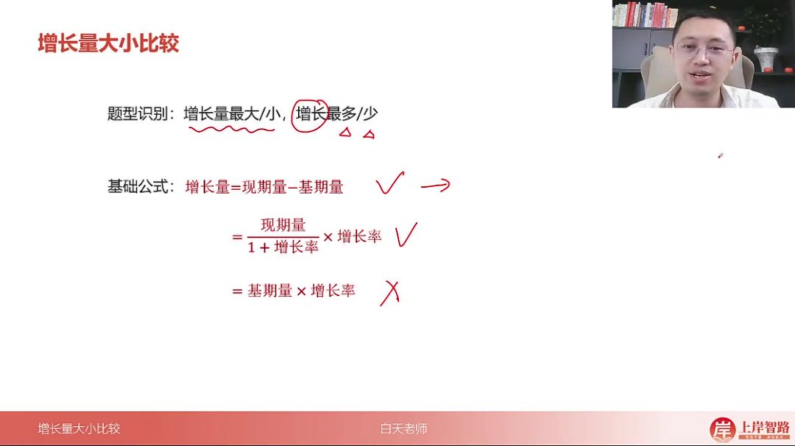
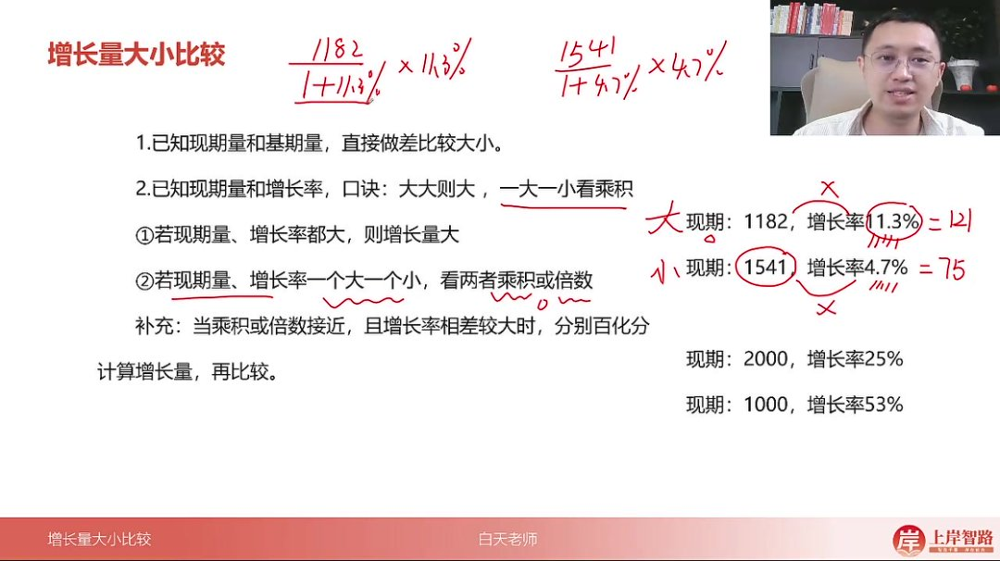
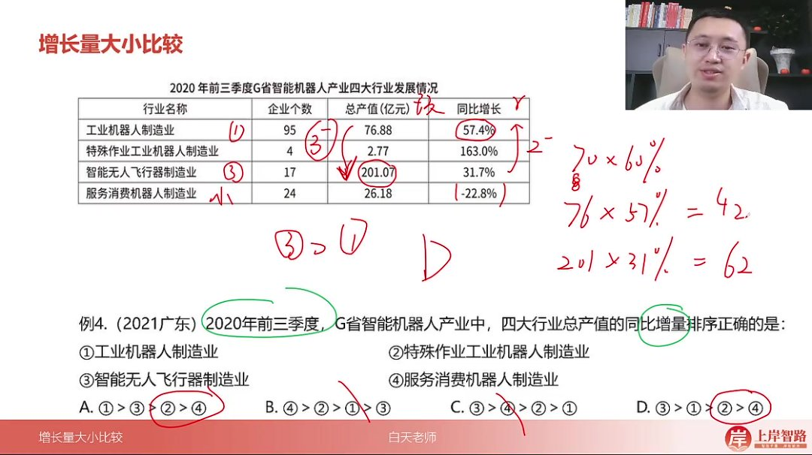
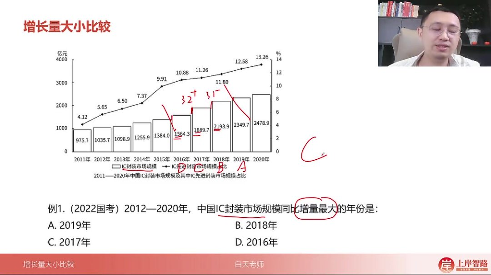
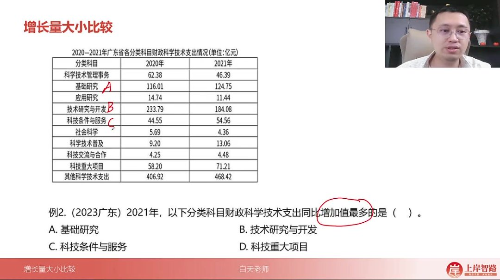
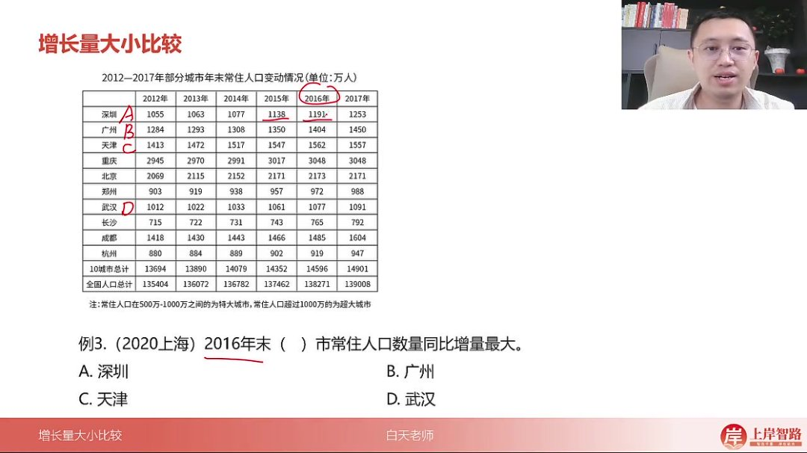
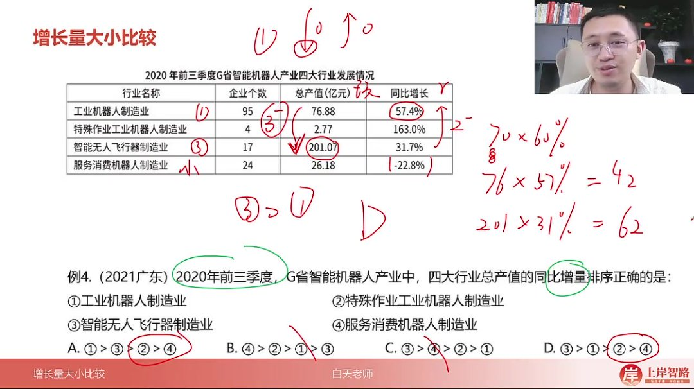
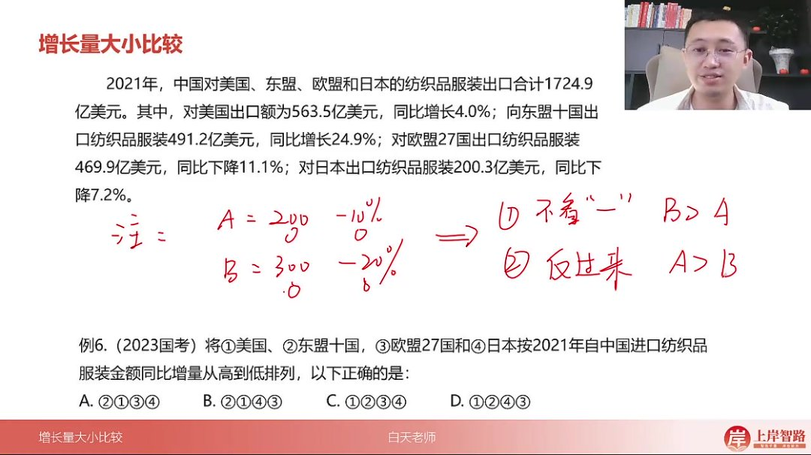
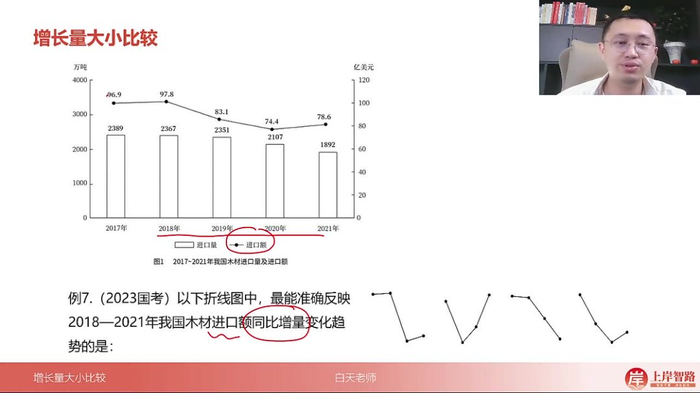
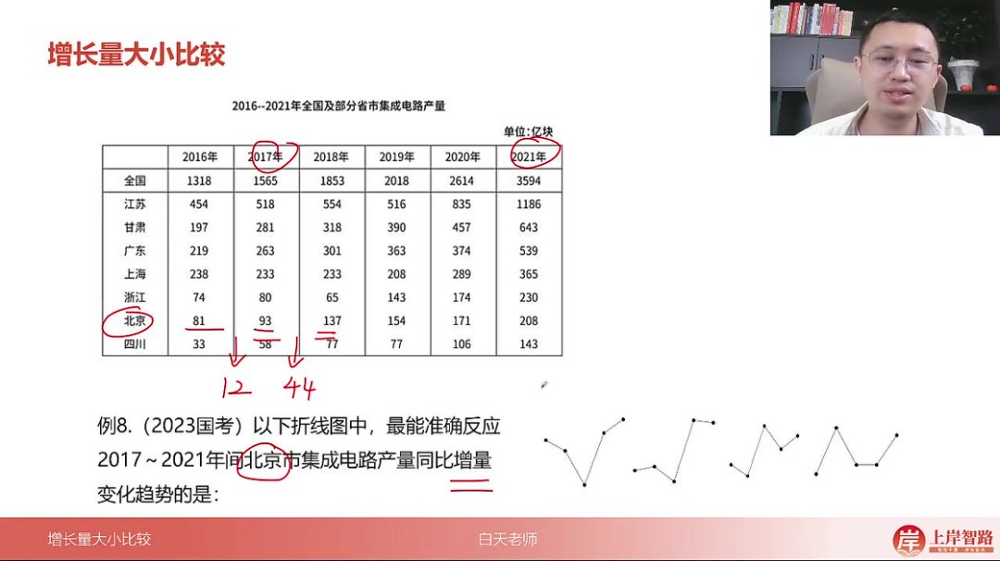

以下为AI生成的图文笔记的内容

#### 一、增长量大小比较 00:05

##### 1. 题型识别 00:09

- 识别特征：题目中出现"增长量最大/小"、"增长最多/少"等表述时，即为增长量大小比较题型
- 术语规范：若题目仅说"增长"二字，规范表述应为"增长最多"或"增长最少"

##### 2. 基础公式 00:25

- 

- 基本形式：增长量=现期量-基期量

- 变形公式

  ：增长量=

  现期量1+增长率×增长率\frac{现期量}{1+增长率}×增长率1+增长率现期量×增长率

  =基期量×增长率

###### 1）已知现期量和基期量 01:03

- 比较方法：直接做差比较大小
- 适用场景：当题目给出明确的现期量和基期量时使用
- 注意事项：此方法计算简单，无需特殊技巧

###### 2）已知现期量和增长率 05:10

- 

- 口诀记忆

  ：

  - 大大则大：现期量大且增长率大，则增长量一定大
  - 一大一小看乘积：当现期量与增长率一大一小时，比较两者乘积或倍数关系

- 比较方法

  ：

  - 若现期量、增长率都大，直接判定增长量大
  - 若一大一小时：
    - 方法一：比较现期量×增长率的乘积
    - 方法二：比较现期量倍数与增长率倍数的关系

- 特殊情况：当乘积或倍数接近，且增长率相差较大时，需分别百化分计算增长量再比较

- 推导原理

  ：在公式

  现期量1+增长率×增长率\frac{现期量}{1+增长率}×增长率1+增长率现期量×增长率

  中，当增长率差异不大时，分母(1+增长率)对比较结果影响较小，可简化为比较现期量×增长率

##### 3. 应用案例 07:19

###### 1）例题:增长量排序

- 

- 解题步骤

  ：

  - 排除负增长选项（服务消费机器人制造业）
  - 在剩余选项中比较工业机器人制造业和智能无人飞行器制造业
  - 应用"一大一小看乘积"：
    - 方法一：76.88×57.4%≈42，201.07×31.7%≈62
    - 方法二：现期量倍数≈2.6倍，增长率倍数≈1.8倍
  - 判定智能无人飞行器制造业增长量更大

- 答案：D选项（③＞①＞②＞④）

###### 2）例题:IC封装市场规模同比增量最大年份 12:21

- 

- 解题技巧：直接观察柱状图高度差

- 分析过程

  ：

  - 排除2016年（A）和2019年（D）
  - 比较2017年和2018年：
    - 2017年增量：1889.7-1565.5≈324.2
    - 2018年增量：2018-1889.7≈128.3

- 答案：C选项（2017年）

###### 3）例题:财政科学技术支出增加值 13:16

- 

- 解题要点

  ：

  - 直接计算各选项增长量：
    - 基础研究：124.75-116.01=8.74
    - 技术研究与开发：负增长排除
    - 科技条件与服务：54.56-44.55=10.01
    - 科技重大项目：71.21-58.20=13.01

- 答案：D选项（科技重大项目）

###### 4）例题:常住人口同比增长量比较 13:59

- 

- 计算过程

  ：

  - 深圳：1191-1138=53
  - 广州：1404-1350=54
  - 天津：1562-1547=15
  - 武汉：1077-1061=16

- 答案：B选项（广州）

###### 5）例题:战略性新兴产业增加值同比增量比较 14:48

- 

- 解题技巧：应用乘积比较法

- 关键分析

  ：

  - 高端装备制造：1065.82×10.7%≈114
  - 绿色低碳：990.73×11.7%≈116
  - 两者乘积接近，增量最接近

- 答案：C选项（绿色低碳产业）

###### 6）例题:进口纺织品服装金额同比增量排列 15:40

- 

- 负增长处理技巧

  ：

  - 先忽略负号比较绝对值
  - 比较完成后将大小关系反转

- 排列过程

  ：

  - 东盟＞美国（正增长）
  - 欧盟＞日本（负增长绝对值比较）
  - 反转得：日本＞欧盟

- 答案：B选项（②①④③）

###### 7）例题:木材进口额同比增量变化趋势 18:20

- 

- 两种解法

  ：

  - 直接计算法

    ：

    - 2018年：≈+1
    - 2019年：≈-14
    - 2020年：≈-9
    - 2021年：≈+4

  - 正负排除法

    ：

    - 确认第二、三点应低于第一、四点

- 答案：B选项

###### 8）例题:北京市集成电路产量同比增量趋势 20:17

- 

- 增量计算

  ：

  - 2017年：93-81=12
  - 2018年：137-93=44
  - 2019年：154-137=17
  - 2020年：171-154=17
  - 2021年：208-171=37

- 趋势特征：2018年出现明显峰值

- 答案：D选项

#### 二、知识小结

| 知识点                        | 核心内容                                                     | 考试重点/易混淆点                                      | 难度系数 |
| ----------------------------- | ------------------------------------------------------------ | ------------------------------------------------------ | -------- |
| 增长量大小比较题型识别        | 题目会问增长量最大/最小、由高到低排序等，若仅提“增长”则对应“最多/最少” | 区分“增长量”与“增长率”表述差异                         | ⭐⭐       |
| 增长量计算公式                | 1. 现期量－基期量（直接做差比较）2. 现期量÷(1+增长率)×增长率（百划分计算） | 公式2需掌握百划分技巧，避免混淆分子分母位置            | ⭐⭐⭐      |
| 比较技巧：大大则大            | 现期量大且增长率大 → 增长量一定大（如160斤增长10% vs 110斤增长5%） | 仅适用于现期量与增长率同向领先的情况                   | ⭐⭐       |
| 比较技巧：一大一小看乘积/倍数 | 现期量与增长率反向时：- 乘积法：直接比较现期量×增长率- 倍数法：比较现期量倍数与增长率倍数，指向大者增量大 | 易错点：增长率相差过大时需用百划分验证（如25% vs 53%） | ⭐⭐⭐⭐     |
| 负增长量比较                  | 先忽略负号按“大大则大”比较，结果反向排序（如-20%减少量＞-10% → 实际增量-10%＞-20%） | 需明确“减少量”与“增量”的逆向关系                       | ⭐⭐⭐      |
| 图表题增量分析                | 柱状图高度差=增长量；折线图可通过正负增长排除选项（正增长＞负增长） | 注意图表年份与选项顺序可能不一致                       | ⭐⭐       |
| 补充：百划分计算              | 增长率25%=1/4 → 增长量=现期量÷5；53%≈1.9/1 → 增长量=现期量÷2.9 | 高频考点：特殊分数转换（如1/6≈16.7%）                  | ⭐⭐⭐⭐     |