以下为AI生成的图文笔记的内容

#### 一、加法速算 00:04

##### 1. 高位叠加 00:12

###### 1）核心概念

- 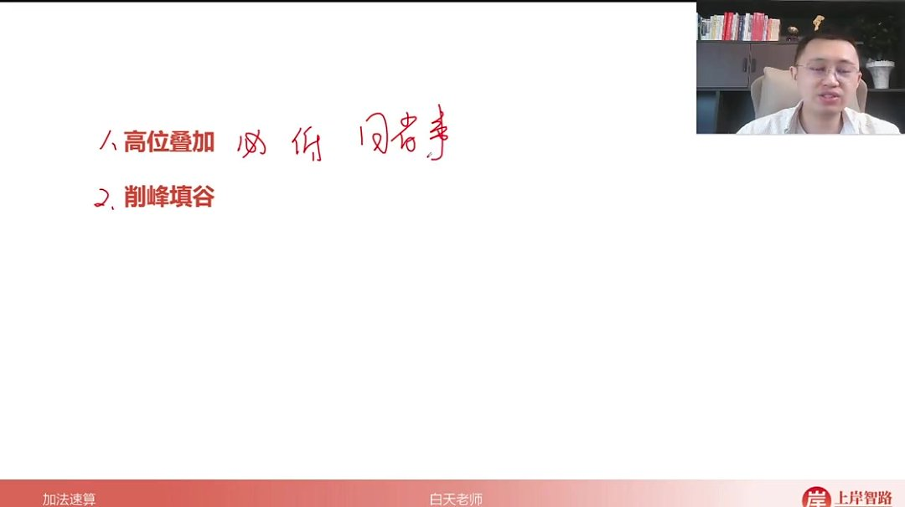
- 必考性：属于公务员考试必考题型，难度较低，国考/省考/事业编考试中题量为1-3题
- 计算逻辑：从最高位开始求和，层层错位相加，适用于快速估算多个数字相加的大致范围
- 重要性原则：数字越靠左越重要（如千位比个位重要1000倍），计算时优先处理高位数字

###### 2）求解过程 03:52

- 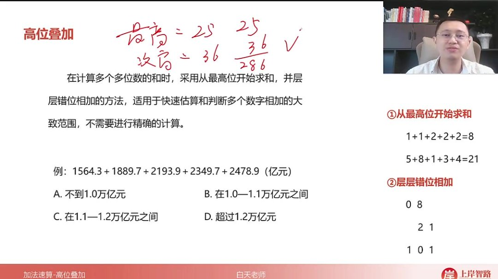

- 步骤演示

  ：

  - 计算最高位和：1+1+2+2+2=8（代表8000）
  - 计算次高位和：5+8+1+3+4=21（代表2100）
  - 错位相加：8000+2100=10100→1.01万亿元

- 补零规则：当次高位和为个位数时需补零，如最高位和42+次高位和6应写作420+60=480

- 应用场景：适用于选择题的快速估算，允许存在合理误差

###### 3）典型例题 07:23

- 基础计算题

  - 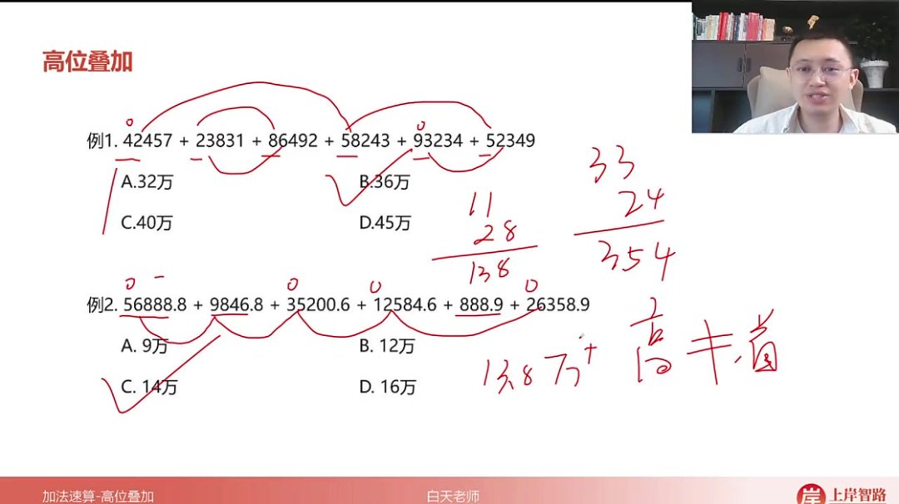

  - 解题要点

    ：

    - 例1：通过最高位10+12+12+19+29=33，次高位2+8+10+19+5=24，得33+2.4=35.4（选B）
    - 例2：注意数位对齐，万位5+3+1+2=11，千位6+9+5+2+6=28，得11+2.8=13.8万（选C）

- 实际应用题

  - 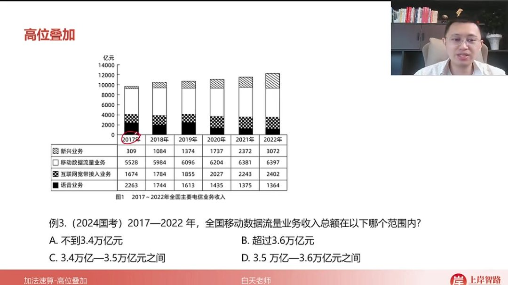

  - 解题步骤

    ：

    - 最高位：5+5+6×4=34（万亿）
    - 次高位：5+2+3+2+3+5=20→3.4+0.22=3.62万亿（选B）

  - 注意事项：图表题需准确提取对应年份数据（2017-2022年）

- 跨年度统计题

  - 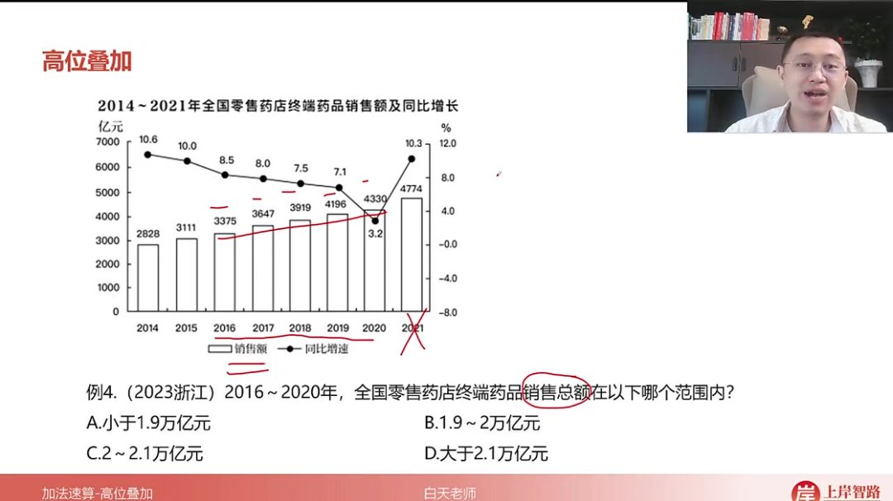

  - 关键技巧

    ：

    - 时间范围确认（2016-2020年，排除2021年）
    - 最高位：3×3+9+8=17，次高位：9+2+9+1+3=24→1.7+0.24=1.94万亿（选B）

  - 易错点：注意题干中的年份范围限制，避免多算或漏算年份

##### 2. 削峰填谷 10:16

###### 1）概念与计算方法 10:25

- 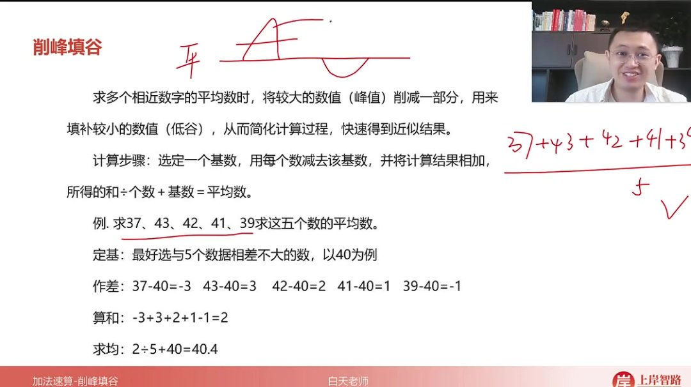

- 核心思想：通过削减较大数值（峰值）填补较小数值（低谷）来简化平均数计算

- 计算步骤

  ：

  - 定基：选择与数据相近的基数（如40）

  - 作差：每个数减去基数（如37-40=-3）

  - 算和：差值求和（-3+3+2+1-1=2）

  - 求均

    ：和÷个数+基数（

    2÷5+40=40.42 \div 5 + 40 = 40.42÷5+40=40.4

    ）

- 适用场景：多个相近数字的平均数计算，如37、43、42、41、39

###### 2）划线法应用 12:41

- 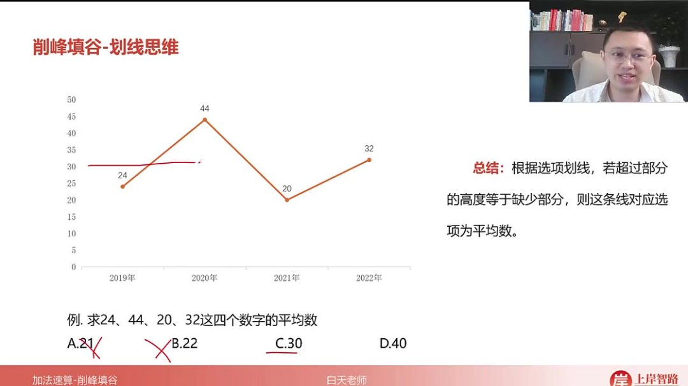

- 操作要点

  ：

  - 根据选项在柱状图/折线图上画水平线
  - 累计比较超出部分（山峰）与不足部分（低谷）的高度
  - 当两者近似相等时，该线对应值即为平均数

- 验证方法

  ：

  - 线偏高：超出部分明显少于不足部分
  - 线偏低：超出部分明显多于不足部分

- 实例验证：以24、44、20、32为例，30为正确平均数线

###### 3）例题：常规计算应用 16:07

- 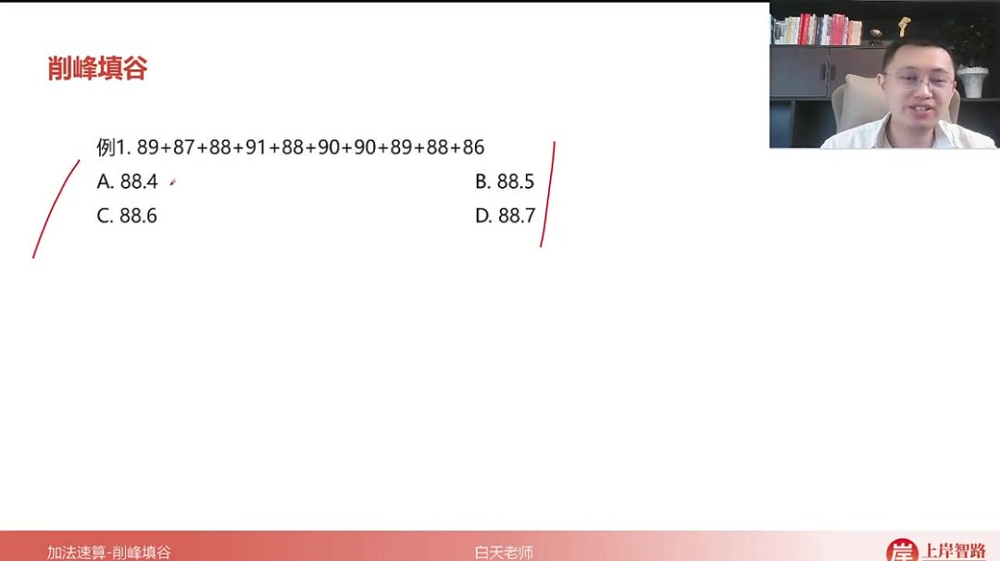

- 题目解析

  - 审题：计算89+87+88+91+88+90+90+89+88+86的平均数

  - 解题

    ：

    - 假设88为基数（接近选项）
    - 作差：+1,-1,0,+3,0,+2,+2,+1,0,-2
    - 抵消后剩余+6（10个数）
    - 平均数=88+6÷10=88.6

  - 答案：C. 88.6

  - 优势：比全加计算更快，减少运算量

###### 4）例题：创新指数计算 16:48

- 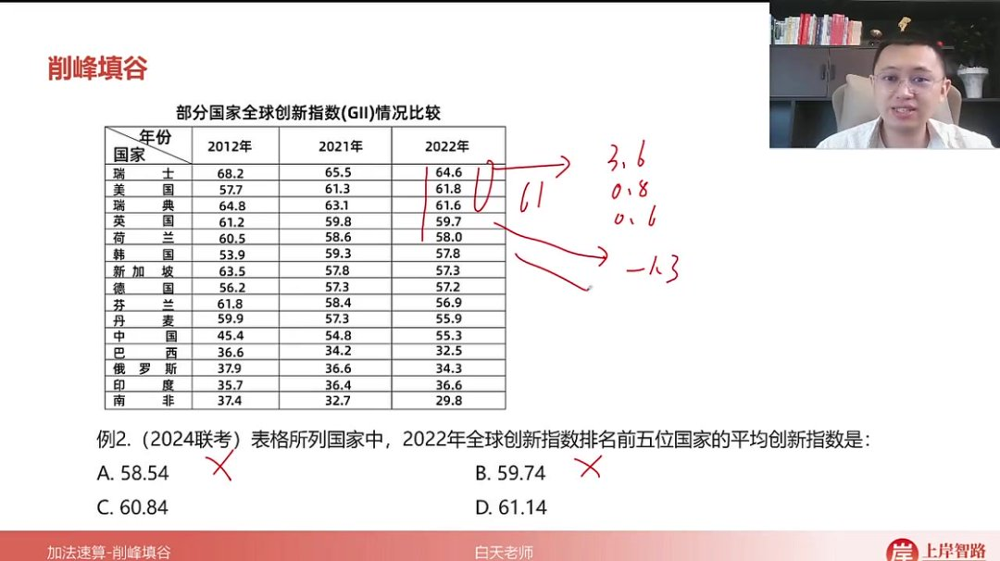

- 题目解析

  - 审题：求2022年前五国家（瑞士64.6、美国61.8等）平均创新指数

  - 解题

    ：

    - 排除明显偏小的A(58.54)、B(59.74)
    - 假设61为基数：
      - 超出：+3.6(瑞士),+0.8(美国),+0.6(瑞典)
      - 不足：-1.3(英国),-3(荷兰)
    - 净超出0.7 → 平均数>61

  - 答案：D. 61.14

  - 技巧：先排除极端选项再精确计算

###### 5）例题：宽带用户平均数 19:11

- 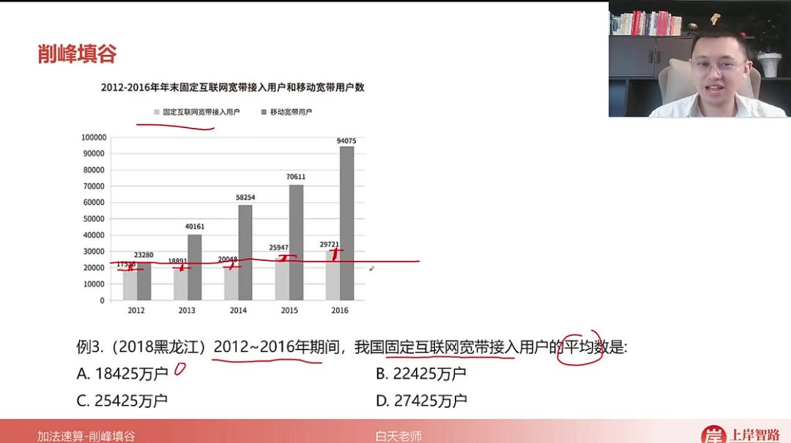

- 题目解析

  - 审题：2012-2016年固定宽带用户平均数

  - 划线法应用

    ：

    - A(18425)：明显偏低（多数柱超出）
    - B(22425)：
      - 超出：2014(20000),2015(25000),2016(29000)
      - 不足：2012(17500),2013(18900)
      - 基本平衡

  - 答案：B. 22425

  - 注意：柱状图题优先用划线法

###### 6）例题：羊肉产量判断 20:06

- 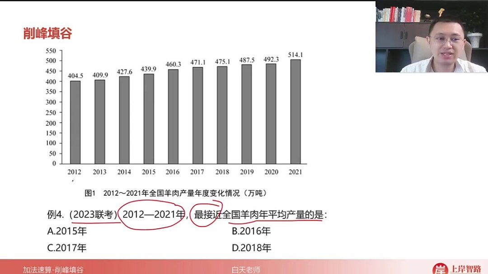

- 题目解析

  - 审题：2012-2021年产量，找最接近平均数的年份

  - 划线法应用

    ：

    - 2015线：多数超出→偏低
    - 2016线：超出≈不足→最接近
    - 2017线：多数不足→偏高

  - 答案：B. 2016年

  - 验证：肉眼观察超出/不足部分体积是否平衡

#### 二、减法速算 22:17

##### 1. 插值法 24:16

- 
- 适用场景：当减数靠近整百数时使用，解决连续借位的计算难题
- 核心公式：被减数-减数=（被减数-中间值）+（中间值-减数）
- 操作步骤：

1. 1. 1. 在减数与被减数之间插入易算的整百数（如300）
      2. 分别计算两段差值后相加
      3. 熟练后可简化为"多减再加"思维：632-277 = (632-300)+(300-277) = 332+23 = 355

- 注意事项

  ：

  - 减数与整百数的差距不宜过大（如235与300差65则不宜使用）
  - 典型适用案例：减数在270-299范围内（如289→差11，294→差6）

###### 1）例题:插值法计算 28:55

- 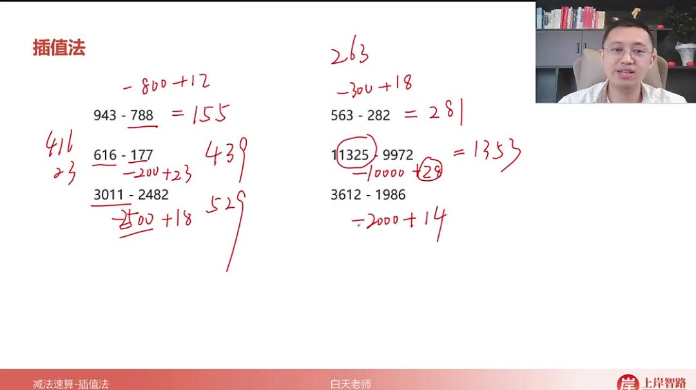

- 计算过程

  ：

  - 12943-788 = (12943-800)+(800-788) = 12143+12 = 12155
  - 4393-422 = (4393-400)-(422-400) = 3993-22 = 3971
  - 18563-282 = 18563-300+18 = 18263+18 = 18281

- 易错提醒

  ：

  - 中间值选择要合理（如788选择800而非700）
  - 多减部分需准确计算（如800-788=12要快速心算）

##### 2. 前两位法 30:21

- 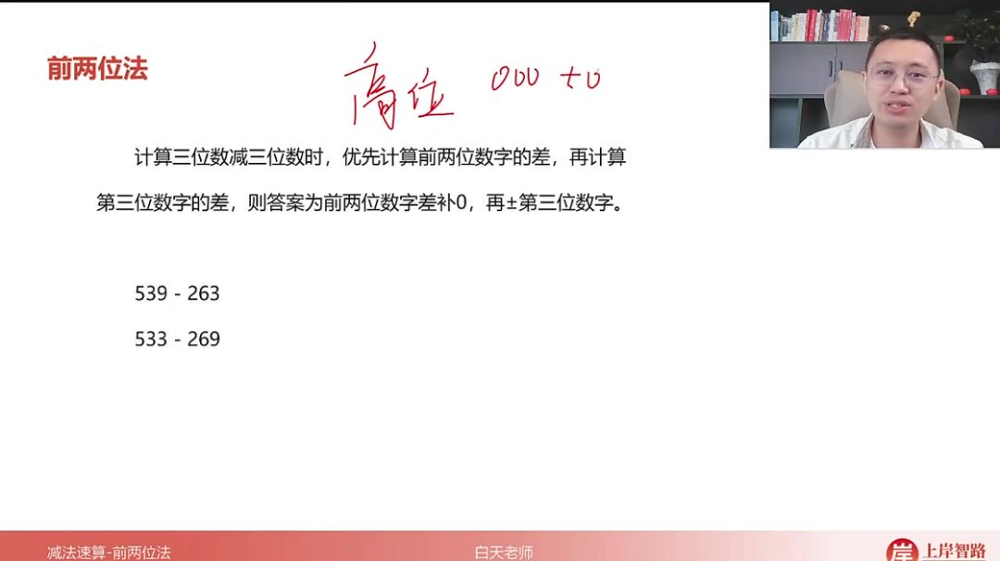
- 计算原理：三位数减法分解为"前两位差×100±个位数差"
- 具体步骤：

1. 1. 1. 先计算前两位数的差值（如539→53-26=27）
      2. 将差值乘以100得到基准值（27×100=270）
      3. 计算个位数差值（9-3=6）
      4. 最终结果：270+6=276

- 优势分析

  ：

  - 避免连续借位（如533-269转化为530-260=270，再3-9=-6得264）
  - 适用于所有三位数减法，无论是否借位

###### 1）例题:前两位法计算 32:19

- 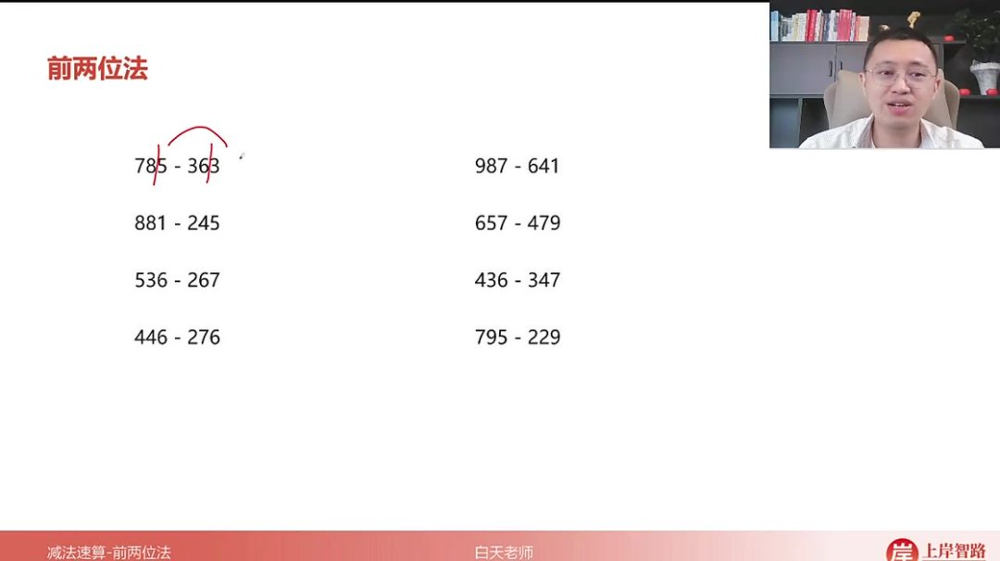

- 典型计算

  ：

  - 785-363 = (78-36)×100 + (5-3) = 4200+2 = 422
  - 987-641 = (98-64)×100 + (7-1) = 3400+6 = 346
  - 881-245 = (88-24)×100 + (1-5) = 6400-4 = 636

- 特殊处理

  ：

  - 当个位差为负时直接相减（如657-479=180-2=178）
  - 四位数减法同样适用（如7853-3635≈7800-3600=4200）

- 训练要点

  ：

  - 需加强两位数减法心算速度
  - 建议每天练习20组保持计算敏感度

#### 三、知识小结

| 知识点           | 核心内容                                                     | 考试重点/易混淆点                             | 难度系数 |
| ---------------- | ------------------------------------------------------------ | --------------------------------------------- | -------- |
| 加法速算         | 高位叠加：从最高位开始求和，层层错位相加，适用于估算或判断多个数字的大致范围 | 错位相加时需注意补零（如次高位为个位数时）    | ⭐⭐       |
|                  | 削峰填谷：用于平均数计算，通过假设平均数并调整差值快速求解   | 划线法（柱状图中画线平衡高低差异）是秒杀技巧  | ⭐⭐⭐      |
| 减法速算         | 差值法：减数靠近整百时，先减整百再补回多减部分（如减289→减300+11） | 仅适用于减数接近整百的情况                    | ⭐⭐       |
|                  | 前两位法：三位数减法优先算前两位差，再调整末位（如785-369→先算78-36=42，再补末位差6→426） | 需快速计算两位数减法作为基础                  | ⭐⭐       |
| 高位叠加示例     | 计算多个数字和时，先加千位（如8000），再加百位（如2100），错位相加得10100 | 注意末位对齐和补零规则                        | ⭐⭐       |
| 削峰填谷示例     | 假设平均数为40，通过差值调整（如43多3，37少3，最终均值为40.4） | 划线法结合选项快速排除错误答案                | ⭐⭐⭐      |
| 减法差值法示例   | 632-277→减300得332，再补回多减的23→355                       | 需判断减数是否接近整百                        | ⭐⭐       |
| 减法前两位法示例 | 789-423→先算78-42=36（补零为360），再算9-3=6→366             | 末位为负数时需注意借位（如783-429→350-6=344） | ⭐⭐       |