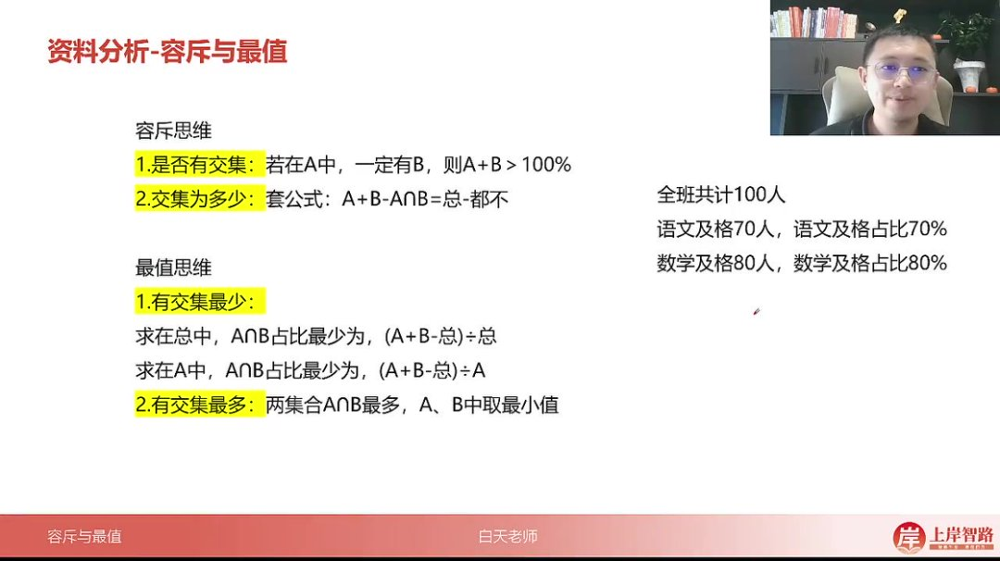
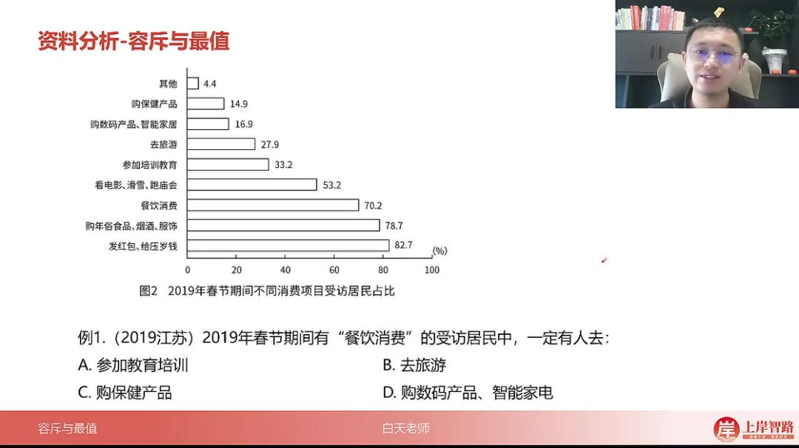
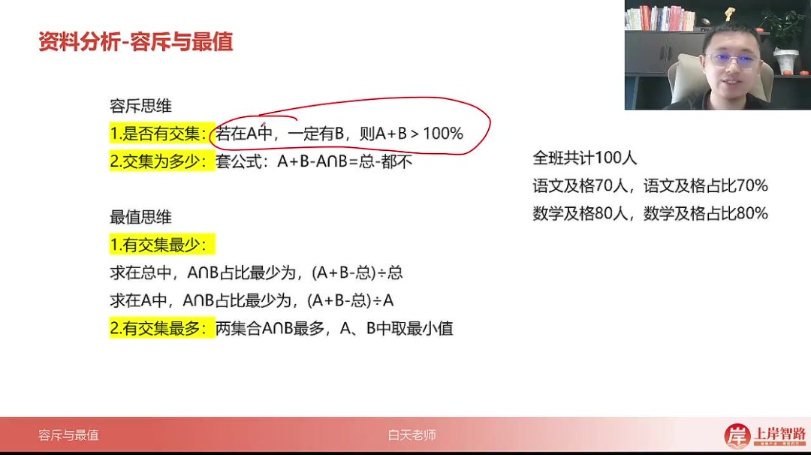
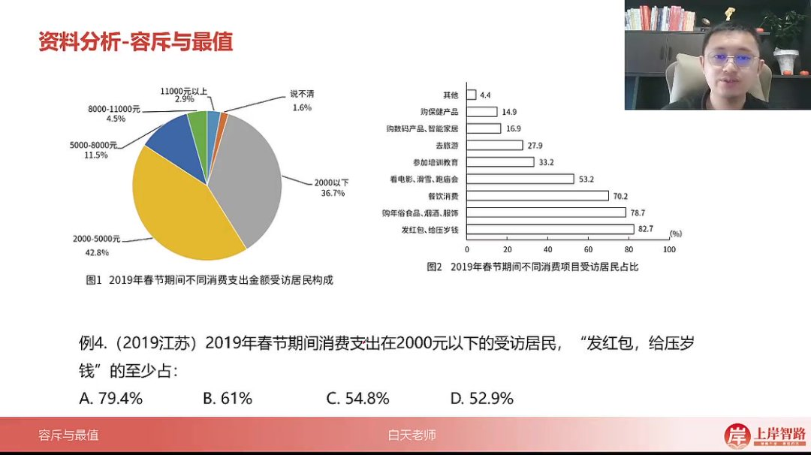
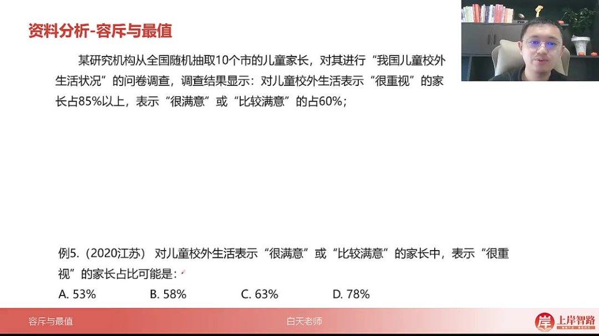

以下为AI生成的图文笔记的内容

#### 一、资料分析 00:02

##### 1. 容斥与最值 00:22

###### 1）容斥思维

- 是否有交集 

  00:32

  - 

  - 交集判定条件

    ：若在集合A中一定有B，则需满足

    A+B>100%A + B > 100\%A+B>100%

    。例如全班100人中，语文及格70人，数学及格80人，若两者无交集则总人数至少需要150人，因此必然存在交集。

  - 占比判定法

    ：当两个集合的占比之和超过100%时，说明必然存在交集。用公式表示为

    A%+B%>100%A\% + B\% > 100\%A%+B%>100%

    。

- 交集为多少 

  01:20

  - 基本公式

    ：

    A+B−A∩B=总−都不A + B - A \cap B = 总 - 都不A+B−A∩B=总−都不

    。例如语文及格70人，数学及格80人，两科都不及格0人，则交集

    A∩B=70+80−100=50A \cap B = 70 + 80 - 100 = 50A∩B=70+80−100=50

    人。

  - 图示理解：用两个相交的圆圈表示语文和数学及格人群，中间重叠部分被计算两次，需要减去一次重复计算的部分。

  - 应用场景：该公式不仅适用于数量关系题，在资料分析中同样可能出现。

###### 2）最值思维 03:10

- 有交集最少 

  03:14

  - 反向构造法：求交集最小值时，可转化为求"不都满足"的最大值。例如求语文数学都及格的最少人数，可先求语文或数学不及格的最多人数（30+20=50），再用总数减去这个值得到50人。

  - 快速公式

    ：交集最小值=

    A+B−总A + B - 总A+B−总

    。如语文70人，数学60人，则最少都及格人数=70 + 60 - 100 = 30人。

  - 易错提醒

    ：注意题目问的是在总人数中的占比还是在A集合中的占比。如在A中占比最少应为

    (A+B−总)/A(A+B-总)/A(A+B−总)/A

    。

- 有交集最多 

  06:47

  - 取小原则：两集合交集的最大值取两个集合中的较小值。如语文及格40人，数学及格80人，则最多都及格人数为40人。
  - 逻辑解释：交集不可能超过任一集合的规模，因此取两者中较小的那个作为上限。

##### 2. 应用案例 07:31

###### 1）例题:餐饮消费去向判断

- 
- 题目解析
  - 审题关键：在70.2%有餐饮消费的受访者中，确定必然有人参加的其它活动。
  - 解题思路：找出与餐饮消费占比之和超过100%的选项（33.2%的培训教育）。
  - 快速解法：直接选择四个选项中占比最大的活动。
  - 答案：A(参加教育培训)

###### 2）例题:容斥机构数量计算 08:54

- 
- 题目解析
  - 条件分析：在1430家视力康复机构中，同时提供听力服务的比不提供的多20%。
  - 变量设定：设不提供听力的为x，则都提供的为1.2x，建立方程x + 1.2x = 1430。
  - 计算过程：解得x=650，都提供=780。用总数9775减去只视力(650)和听力总数(1669)得7466。
  - 验证方法：也可用容斥公式1669+1430-780=9775-都不计算。
  - 答案：B(7300-7600家之间)

###### 3）例题:发红包占比计算 12:45

- 
- 题目解析
  - 关键步骤：先计算2000元以下(36.7%)和发红包(82.7%)的交集最小值=36.7%+82.7%-100%=19.4%。
  - 易错点：需要将19.4%除以36.7%得到在2000元以下人群中的占比约52.9%。
  - 计算技巧：估算时可用50%×36.7%=18.35%，剩余1.05%约占3%，合计约53%。
  - 答案：D(52.9%)

###### 4）例题:很重视家长占比范围 15:05

- 
- 题目解析
  - 数据提取：很重视占85%，很满意或比较满意占60%。
  - 最小值计算：两者都满足最少=85%+60%-100%=45%，在满意人群中占比=45%/60%=75%。
  - 最大值确定：取两者较小值85%和60%中的60%，占比=60%/60%=100%。
  - 范围判断：选项应在75%-100%之间，只有D(78%)符合。
  - 答案：D(78%)

#### 二、知识小结

| 知识点               | 核心内容                                                     | 考试重点/易混淆点                                            | 难度系数 |
| -------------------- | ------------------------------------------------------------ | ------------------------------------------------------------ | -------- |
| 容斥原理基础         | 通过语文（70人）、数学（80人）及格案例，推导交集存在性（70+80>100）及交集计算公式：A∪B = A + B - A∩B = 总 - 都不 | 交集存在性判断（占比和>100%）与公式应用                      | ⭐⭐       |
| 最值思维（反向构造） | 交集最小值计算：A∩B ≥ A + B - 总（例：70+80-100=50人）；最大值取min(A,B)（例：70人） | 易错点：最小值结果需区分“占总比”还是“占A比”（如50/100 vs 50/70） | ⭐⭐⭐      |
| 容斥图形化理解       | 用韦恩图解释重复计算（中间交集举两次手需去重）               | 图形与公式对应关系                                           | ⭐        |
| 真题应用（资料分析） | 1. 交集存在性：餐饮消费（70.2%）+教育培训（32.3%）>100%2. 交集最值：2000元以下居民（36.7%）发红包（82.7%）至少占比(36.7+82.7-100)/36.7≈52.8% | 题干表述差异（“占总”或“占子集”）导致计算差异                 | ⭐⭐⭐⭐     |
| 复杂案例（国考真题） | 康复机构数据：视力（1430家）与听力（1669家）交集x+1.2x=1430→x=650，求“都不提供”家数：9775-650-1669≈7456 | 多步骤逻辑链与数据提取                                       | ⭐⭐⭐⭐     |