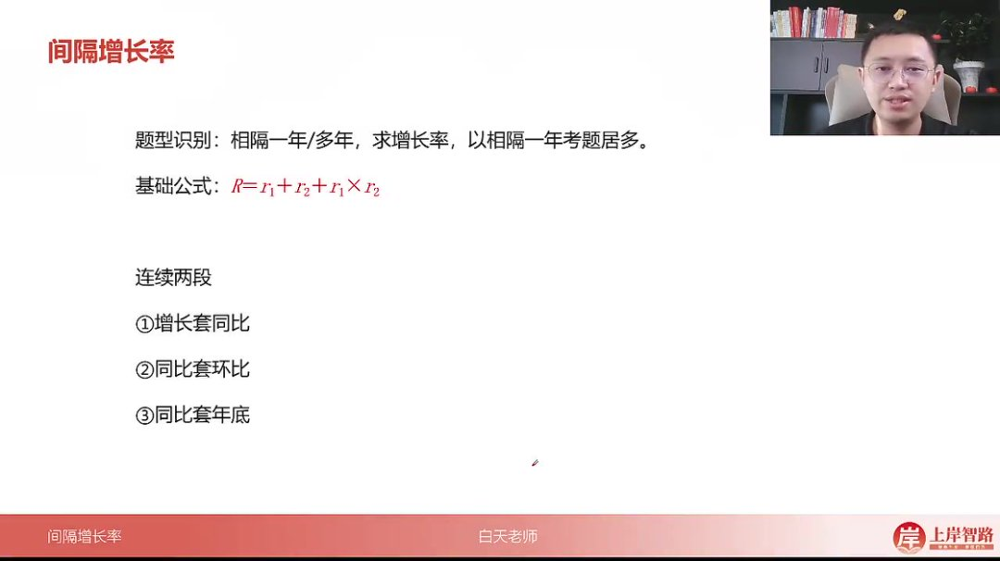
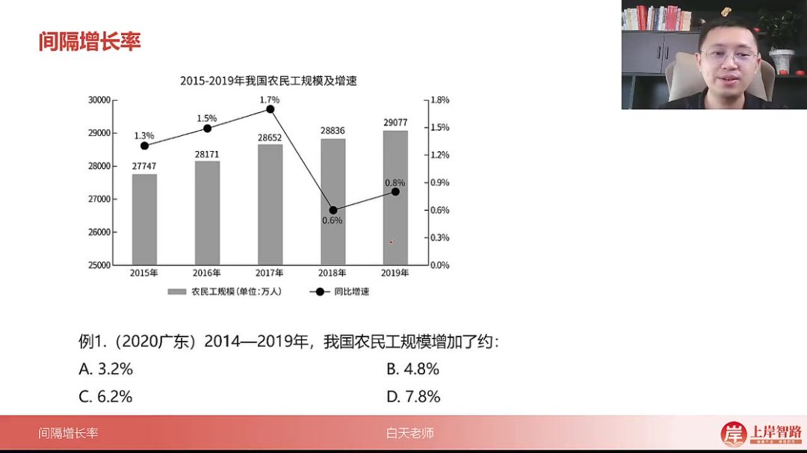
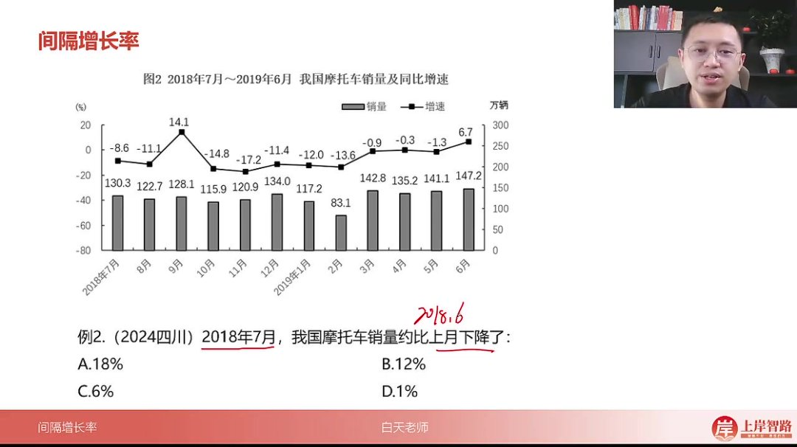
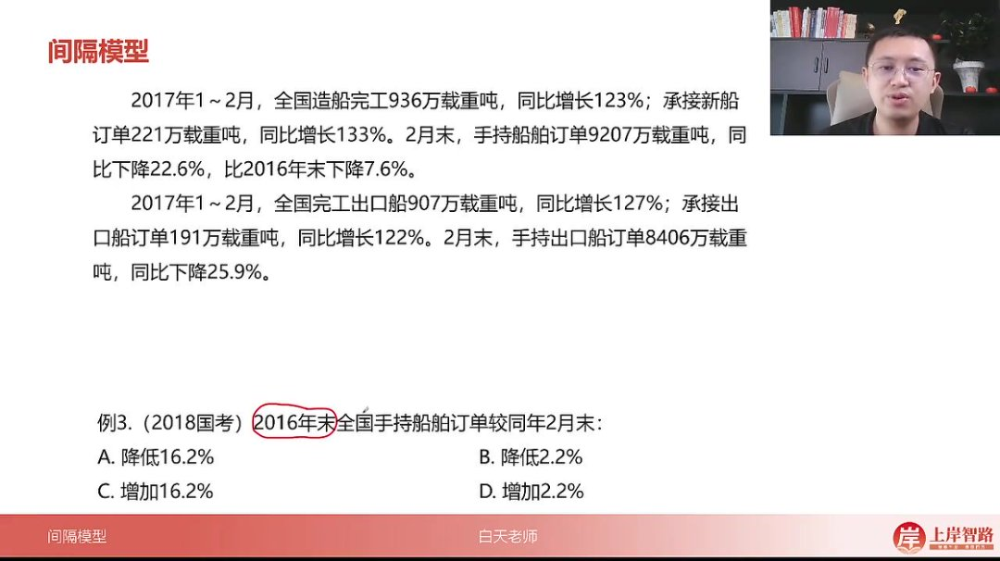

以下为AI生成的图文笔记的内容

#### 一、间隔增长率 00:08

##### 1. 间隔增长率

- 

- 题型识别：相隔一年/多年求增长率，以相隔一年考题居多

- 基础公式

  ：

  R=r1+r2+r1×r2R = r_1 + r_2 + r_1 \times r_2R=r1+r2+r1×r2

  （连续两段增长率关系）

- 逆运用公式

  ：已知

  r1r_1r1

  和R时，

  r2=R−r11+r1r_2 = \frac{R - r_1}{1 + r_1}r2=1+r1R−r1

- 连续特性：不要求间隔年份相同，只要两段时间连续即可应用公式

- 三种变形背景

  ：

  - 增长套同比（例：2020→2019→2018）
  - 同比套环比（例：2019年6月→2018年6月→2018年7月）
  - 同比套年底（例：2017年2月→2016年2月→2016年末）

###### 1）例题:求农民工规模增长率 01:52

- 

- 题目解析

  - 常规解法：计算2019年值29077万与2014年基期值（通过2015年值27747万和1.3%增速推算）

  - 间隔增长率解法

    ：

    - r1r_1r1

      =1.3%（2019年同比增速）

    - r2r_2r2

      ≈5%（2015→2019年复合增速）

    - R=1.3%+5%+1.3%×5%≈6.3%R = 1.3\% + 5\% + 1.3\% \times 5\% ≈ 6.3\%R=1.3%+5%+1.3%×5%≈6.3%

  - 答案：C（6.2%）

###### 2）例题:求摩托车销量环比增长率 04:00

- 

- 题目解析

  - 背景特征：同比套环比（2019年6月→2018年6月→2018年7月）

  - 间隔公式应用

    ：

    - 已知R=6.7%（2019年6月同比增速）

    - 计算

      r2r_2r2

      ≈13%（2019年6月→2018年7月增速）

    - 求

      r1=6.7%−13%1+13%≈−5.6%r_1 = \frac{6.7\% - 13\%}{1 + 13\%} ≈ -5.6\%r1=1+13%6.7%−13%≈−5.6%

  - 常规解法：通过2019年6月值反推2018年6月值，再计算环比

  - 答案：C（-6%）

###### 3）例题:求船舶订单增长率 07:51

- 

- 题目解析

  - 背景特征：同比套年底（2017年2月→2016年2月→2016年末）

  - 公式应用

    ：

    - 已知R=-22.6%（整体增速）

    - r1r_1r1

      =-7.6%（2017年2月→2016年末增速）

    - 求

      r2=−22.6%−(−7.6%)1−7.6%≈−16.2%r_2 = \frac{-22.6\% - (-7.6\%)}{1 - 7.6\%} ≈ -16.2\%r2=1−7.6%−22.6%−(−7.6%)≈−16.2%

  - 选项分析：负值排除CD，计算结果大于15%排除B

  - 答案：A（-18%）

#### 二、知识小结

| 知识点                   | 核心内容                                                     | 考试重点/易混淆点                      | 难度系数 |
| ------------------------ | ------------------------------------------------------------ | -------------------------------------- | -------- |
| 间隔增长率基础公式       | 隔一年求增长率：大R = r1 + r2 + r1×r2（r1为当前年增速，r2为前一年增速） | 需区分隔一年与隔多年的适用性           | ⭐⭐       |
| 间隔增长率逆运用         | 已知大R和r1求r2：r2 = (大R - r1) / (1 + r1)                  | 公式变形时注意分母调整                 | ⭐⭐⭐      |
| 连续两段增长率的扩展应用 | 无论间隔年份是否相同，只要增长时段连续即可套用公式（如2020→2019→2010） | 背景识别是关键（同比/环比/年底混合）   | ⭐⭐⭐⭐     |
| 真题案例1：同比套增长    | 通过2015年数据反推2014年基数，或直接套间隔增长率公式（r1=1.3%，r2≈5%） | 两种解法对比：基期计算法 vs 间隔公式法 | ⭐⭐       |
| 真题案例2：同比套环比    | 利用2019年6月同比增速求2018年6月数据，再计算2018年7月环比增速 | 注意月份连续性和负增长处理             | ⭐⭐⭐      |
| 真题案例3：同比套年底    | 已知2017年2月同比增速（-22.6%）和2017年2月较2016年底增速（-7.6%），求2016年底较2月增速 | 逆运用公式快速排除选项                 | ⭐⭐⭐⭐     |
| 核心技巧总结             | 连续时段增长问题均可转化为间隔增长率模型，重点在于识别时间链和公式灵活运用 | 易混淆同比与环比的时间参照点           | ⭐⭐⭐      |