以下为AI生成的图文笔记的内容

#### 一、修正思维 00:00

##### 1. 分数性质 00:26

- 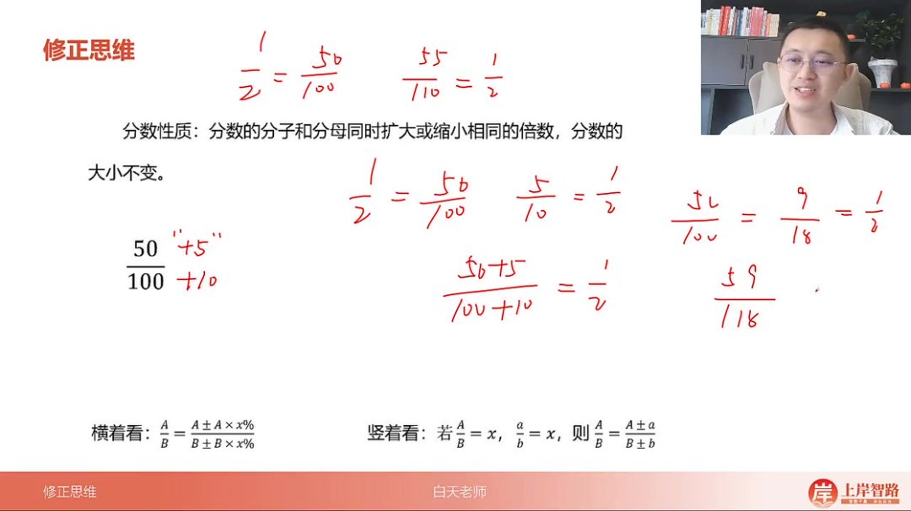

- 核心性质

  ：分数的分子和分母同时扩大或缩小相同的倍数，分数的大小不变。如

  12=50100=55110\frac{1}{2}=\frac{50}{100}=\frac{55}{110}21=10050=11055

- 修正逻辑：通过保持比例关系实现分数值不变，分为竖着看和横着看两种方法

###### 1）竖着看修正法 00:57

- 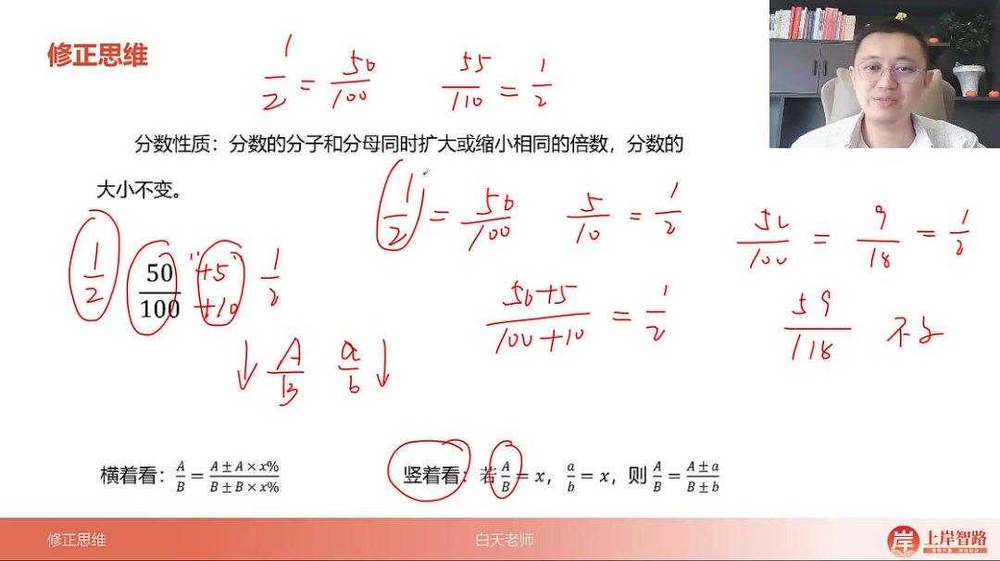

- 原理

  ：若

  AB=x\frac{A}{B}=xBA=x

  且

  ab=x\frac{a}{b}=xba=x

  ，则

  AB=A±aB±b\frac{A}{B}=\frac{A±a}{B±b}BA=B±bA±a

- 操作步骤

  ：

  - 确定原分数比例关系（如

    50100=1:2\frac{50}{100}=1:210050=1:2

    ）

  - 保持变化部分与原比例相同（分母加10则分子加5）

- 实例

  ：

  - 50100\frac{50}{100}10050

    →

    50+5100+10\frac{50+5}{100+10}100+1050+5

    仍为

    12\frac{1}{2}21

  - 4194\frac{41}{94}9441

    加6时，因94:47=2:1，分子应加3不到（41:94≈1:2）

###### 2）横着看修正法 06:09

- 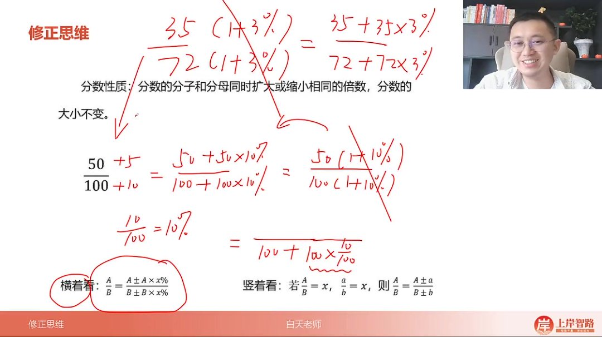

- 原理

  ：

  AB=A±A×x%B±B×x%\frac{A}{B}=\frac{A±A×x\%}{B±B×x\%}BA=B±B×x%A±A×x%

- 操作步骤

  ：

  - 计算分母变化百分比（如加10→

    10100=10%\frac{10}{100}=10\%10010=10%

    ）

  - 分子同步变化相同百分比（50×10%=5）

- 实例

  ：

  - 71106\frac{71}{106}10671

    减6时，

    6106≈6%\frac{6}{106}≈6\%1066≈6%

    ，分子减71×6%≈4.2→减4

  - 3572\frac{35}{72}7235

    乘1.03时，分子分母同乘保持分数值不变

###### 3）注意事项 04:54

- 比例方向

  ：必须保持原比例方向（如

  9441\frac{94}{41}4194

  是2:1而非1:2）

- 误差控制：同舍同进法（分子分母同向舍入）可减小计算误差

- 修正目标：可修正为整百数（100）或特殊百分数（如333对应×3）

###### 4）应用案例 10:36

- 例题：分数修正计算

  - 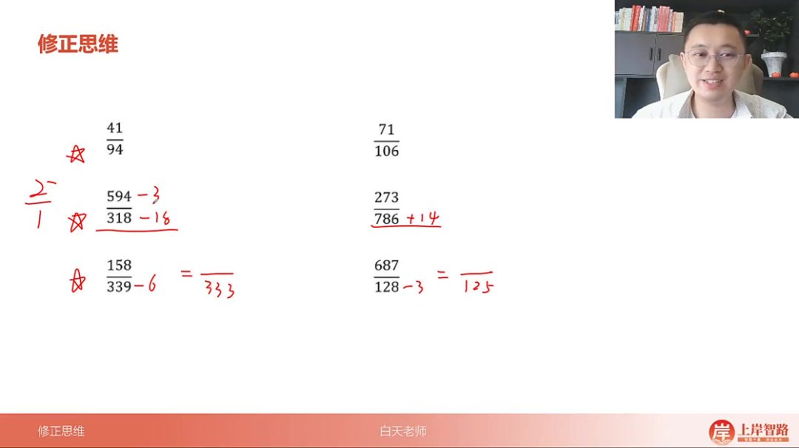

  - 解题要点

    ：

    - 594318\frac{594}{318}318594

      减18时，

      18318≈6%\frac{18}{318}≈6\%31818≈6%

      ，分子减594×6%≈35.6→减34

    - 273786\frac{273}{786}786273

      加14时，

      14786≈2%\frac{14}{786}≈2\%78614≈2%

      ，分子加273×2%≈5.5→加5

- 例题：四舍五入计算 

  14:08

  - 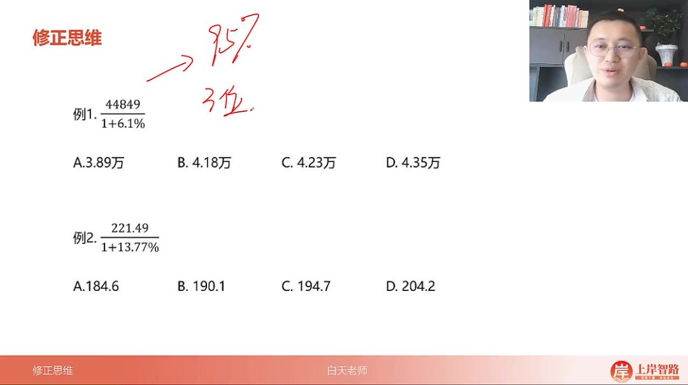

  - 例1解析

    ：

    - 448491.061\frac{44849}{1.061}1.06144849

      保留三位→

      448106\frac{448}{106}106448

    - 分母减6，分子按4倍减24→424对应选项C

  - 例2解析

    ：

    - 221.491.1377\frac{221.49}{1.1377}1.1377221.49

      →

      221114\frac{221}{114}114221

    - 分母减14，分子按2倍减28→193最接近选项C

- 例题：百分比修正 

  17:38

  - 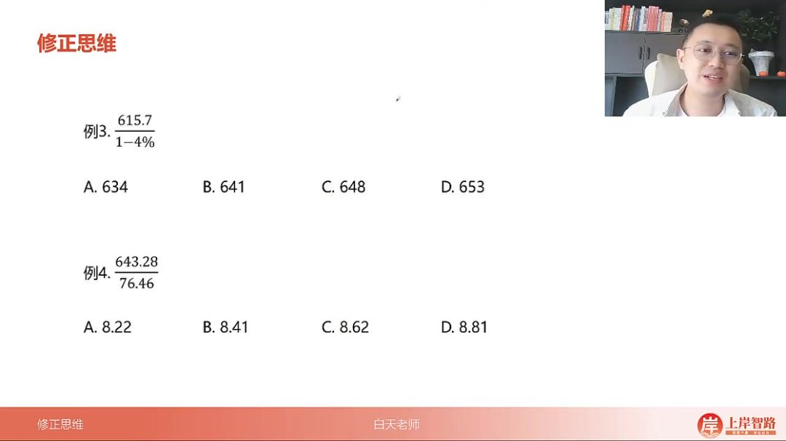

  - 例3解析

    ：

    - 615.70.96\frac{615.7}{0.96}0.96615.7

      →

      61696\frac{616}{96}96616

    - 分母加4，分子按6倍加25→641选B

  - 例4解析

    ：

    - 643.28764.6\frac{643.28}{764.6}764.6643.28

      →

      643764\frac{643}{764}764643

    - 分母加36，分子按1:1加30→673/800≈0.841选B

##### 2. 修正思维中的特殊题型 19:53

###### 1）分式修正计算原理

- 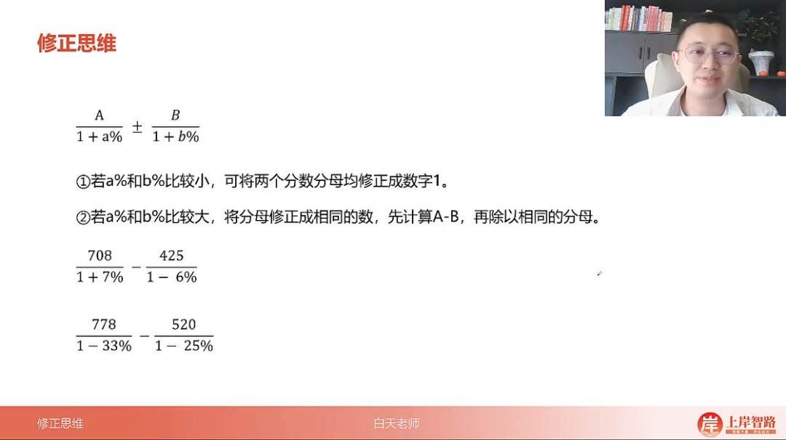

- 小百分数修正

  ：当

  a%a\%a%

  和

  b%b\%b%

  较小时（如

  7081+7%−4251−6%\frac{708}{1+7\%}-\frac{425}{1-6\%}1+7%708−1−6%425

  ），可将分母修正为1或100，分子按比例调整。例如分母减7加6变为100，分子708减48（6倍多）、425加25（4倍多），最终得210。

- 大百分数修正

  ：当

  a%a\%a%

  和

  b%b\%b%

  较大时（如

  7781−33%−5201−25%\frac{778}{1-33\%}-\frac{520}{1-25\%}1−33%778−1−25%520

  ），将分母修正为相同数。例如都修正为75，左边加90（11倍多），右边不变，得

  34875\frac{348}{75}75348

  ≈182选C。

- 倍数关系判断：修正时需注意分子分母倍数关系，如700÷10加1对应加70，不是7；339÷154约2倍多，按比例修正。

###### 2）例题：分式修正计算

- 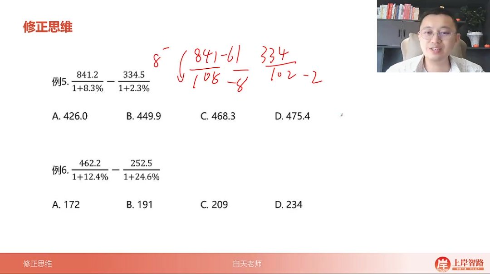

- 题目解析

  - 例5

    ：

    841.21+8.3%−334.51+2.3%\frac{841.2}{1+8.3\%}-\frac{334.5}{1+2.3\%}1+8.3%841.2−1+2.3%334.5

    ，分母修正为100，左边减61（8倍不到），右边减6（3倍），得452选B。

  - 例6

    ：

    462.21+12.4%−252.51+24.6%\frac{462.2}{1+12.4\%}-\frac{252.5}{1+24.6\%}1+12.4%462.2−1+24.6%252.5

    ，分母修正为100，左边减50（4倍多），右边减50（2倍），得209选C。

###### 3）例题：大数分式修正

- 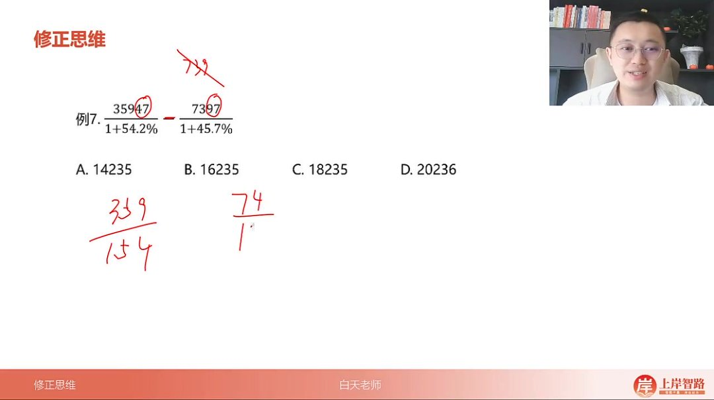

- 题目解析

  - 例7

    ：

    359471+54.2%−73691+45.7%\frac{35947}{1+54.2\%}-\frac{7369}{1+45.7\%}1+54.2%35947−1+45.7%7369

    ，分母修正为150，左边减9（2倍多），右边加4（半倍），得

    2741.5\frac{274}{1.5}1.5274

    ≈182选C。

##### 3. 乘法修正 26:47

###### 1）乘法修正原理

- 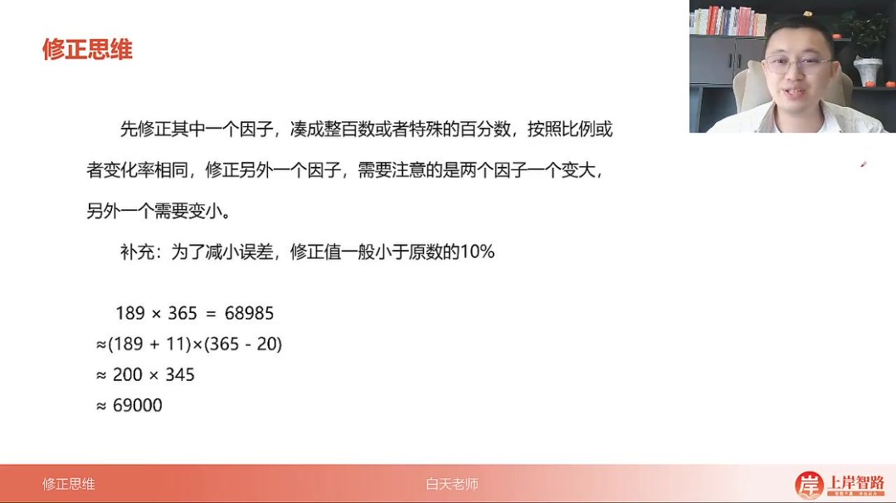
- 变号原则：与除法修正不同，乘法需一边变大另一边变小（如100×200≈99×202）。
- 比例修正：按原数比例调整，如189×365中189:365≈1:2，加11则减20（不到22），得200×345≈69000。
- 误差控制：修正值应小于原数10%（如570最多加减57），避免过大误差。

###### 2）例题：乘法修正计算

- 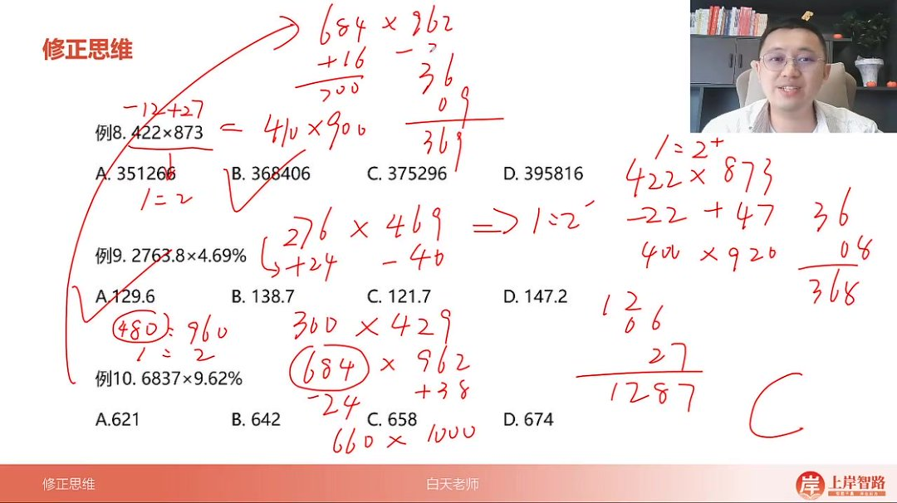
- 题目解析
  - 例8：422×873，方法1：加27减12得410×900=369000；方法2：减22加47得400×920=368000，选B。
  - 例9：276×469，加24减40得300×429=128700，选A。
  - 例10：684×962，方法1：加38减24得660×1000≈660；方法2：加16减22得700×940=658，选C（642最接近）。

#### 二、知识小结

| 知识点       | 核心内容                                                     | 考试重点/易混淆点                             | 难度系数 |
| ------------ | ------------------------------------------------------------ | --------------------------------------------- | -------- |
| 修正思维     | 分子分母同比例变化保持分数值不变，适用于乘除计算中的快速估算 | 比例关系易反（如1:2误操作为2:1）              | ⭐⭐⭐      |
| 竖着看逻辑   | 根据原分数比例（如1:2）同步调整分子分母变化量（分母+10→分子+5） | 需严格匹配原比例（如94÷41≈2:1，减1需对应减2） | ⭐⭐       |
| 横着看逻辑   | 分子分母同变化百分比（如分母+10%→分子+10%）                  | 百分数转换需快速心算（如6÷94≈6%+）            | ⭐⭐⭐⭐     |
| 修正应用场景 | 修成整百（100）、特殊百分数（如333、125）或同分母简化计算    | 修成整百时误差控制（同舍同进减小误差）        | ⭐⭐       |
| 乘法修正     | 因子一增一减保持乘积近似（如100×200≈99×202）                 | 修正量需<10%原数（避免过度修正）              | ⭐⭐⭐      |
| 特殊题型处理 | 分式相减时同修分母（如708/107−425/94→修成同分母100）         | 注意倍数关系（708÷107≈6.6倍→分子减48）        | ⭐⭐⭐⭐     |
| 误差控制技巧 | 同舍同进法（分子分母同方向舍入抵消误差）                     | 例：221÷114优于222÷114（误差更小）            | ⭐⭐       |
| 实战速算示例 | 41÷94+6→分母+6%→分子+2.5（≈43.5）                            | 快速估算比例（如71÷106≈67%）                  | ⭐⭐⭐      |