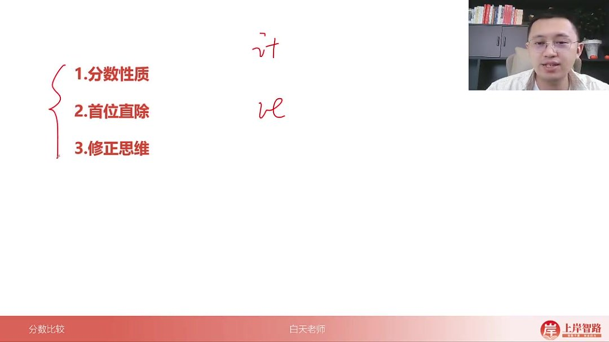
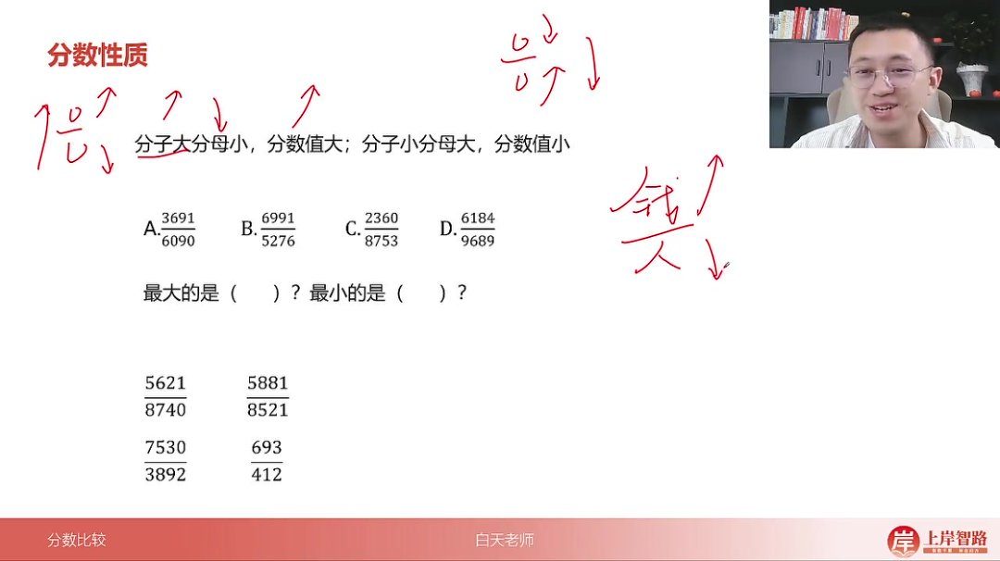
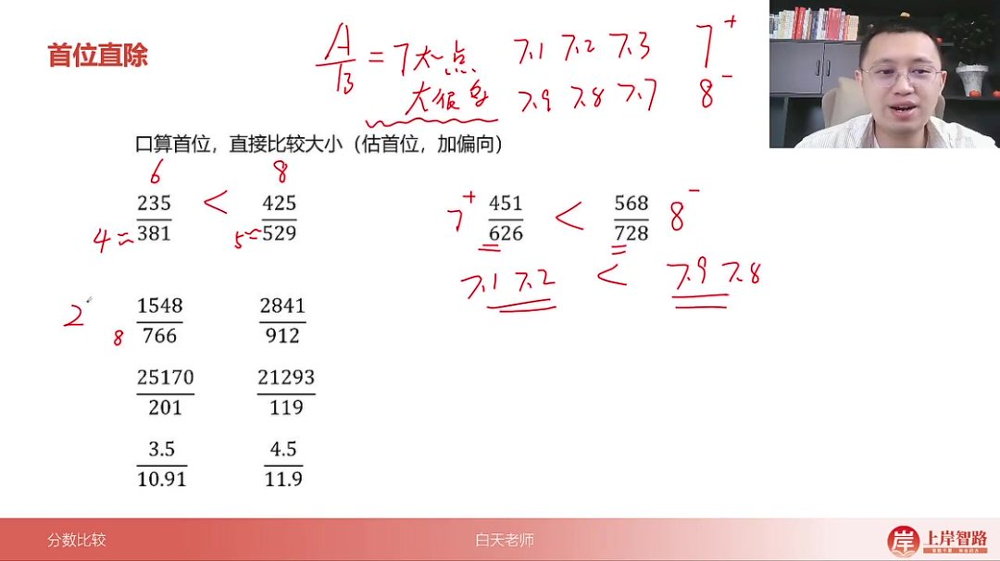
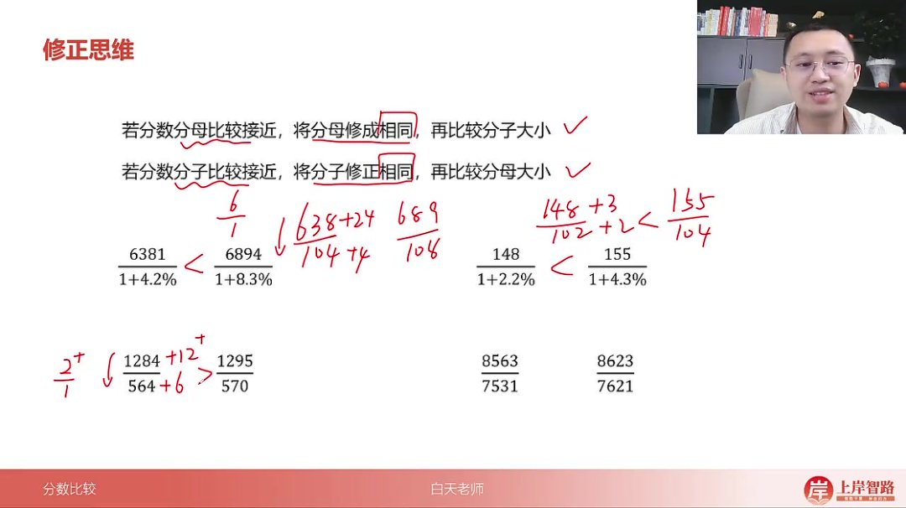

以下为AI生成的图文笔记的内容

#### 一、分数比较 00:01

- 
- 核心技巧：资料分析中分数比较主要包含三类解题方法：分数性质法、首位直除法、修正思维法
- 应用场景：适用于比较两个或多个分数大小的题目，是资料分析高频考点

##### 1. 分数性质 00:28

- 基本原理：分子越大分母越小，分数值越大；分子越小分母越大，分数值越小
- 形象记忆：分子看作钱，分母看作人，钱多人少则人均值（分数值）越大
- 应用要点：比较时先观察分子分母的明显大小关系，可快速排除部分选项

###### 1）例题:分数性质排序问题 00:55

- 

- 题目解析

  - 选项分析：

    - B选项

      69915276\frac{6991}{5276}52766991

      ：分子最大(6991)且分母最小(5276)，根据性质直接判定为最大值

    - C选项

      23608753\frac{2360}{8753}87532360

      ：分子最小(2360)且分母较大(8753)，初步判定为最小值

    - 验证比较：C与D比较时，分母接近(8753vs9689)，分子明显小(2360vs6184)，确认C最小

  - 解题技巧：先找极端值（最大分子+最小分母，最小分子+最大分母），再验证中间选项

  - 易错提醒：不能仅比较单个分子或分母，必须同时考虑分子分母的变化关系

##### 2. 首位直除 02:59

- 操作步骤

  ：

  - 估算分子分母首位商数
  - 判断商数偏向（靠近下一位则标记"+"或"-"）

- 标记规则

  ：

  - 7^+表示商7且接近7.1-7.3
  - 8^-表示商7且接近7.7-7.9

- 优势：快速估算分数大小关系，适合选项差距明显的题目

###### 1）例题:孤守卫加偏向计算 03:56

- 题目解析

  - 235381\frac{235}{381}381235

    vs

    425529\frac{425}{529}529425

    ：

    - 前者估算：235÷380≈0.62（六减）
    - 后者估算：425÷530≈0.80（八减）
    - 结果判定：0.62 < 0.80

  - 关键技巧：四舍五入简化计算，保留1位有效数字即可比较

###### 2）例题:孤守卫加偏向计算 05:02

- 题目解析

  - 2841912\frac{2841}{912}9122841

    vs

    251702011\frac{25170}{2011}201125170

    ：

    - 前者首位：2.8÷0.9≈3.1
    - 后者首位：2.5÷0.2≈12.5
    - 结果判定：3.1 < 12.5

  - 易错点：注意单位统一，大数比较时可适当截位

##### 3. 修正思维 05:53

- 核心原则

  ：

  - 分母接近时，统一分母比较分子
  - 分子接近时，统一分子比较分母

- 修正公式

  ：

  - 分母修正：

    ab→a+kb+n\frac{a}{b} \rightarrow \frac{a+k}{b+n}ba→b+na+k

    （其中n为分母差值，

    k=a/b×nk=a/b×nk=a/b×n

    ）

  - 分子修正：

    ab→mb+n\frac{a}{b} \rightarrow \frac{m}{b+n}ba→b+nm

    （其中m为统一分子，n为调整值）

###### 1）例题:修正思维分母相同比较分子例 06:16

- 题目解析

  - 148102\frac{148}{102}102148

    vs

    155104\frac{155}{104}104155

    ：

    - 将分母统一为104：左边需加2（102→104）
    - 计算分子增量：148/102≈1.45，1.45×2≈3
    - 修正结果：148+3=151 < 155

  - 关键步骤：先计算分母变化比例，再同比例调整分子

###### 2）例题:修正思维分子相同比较分母例 08:09

- 

- 题目解析

  - 3481.13\frac{348}{1.13}1.13348

    vs

    3601.18\frac{360}{1.18}1.18360

    ：

    - 将分子统一为360：左边需加12（348→360）
    - 计算分母增量：12/348≈0.034，1.13×0.034≈0.04
    - 修正结果：1.13+0.04=1.17 < 1.18
    - 结论：分子相同，分母小的值大，故左边>右边

  - 记忆口诀："同分比子大则大，同子比分大则小"

#### 二、知识小结

| 知识点               | 核心内容                                                     | 考试重点/易混淆点                                        | 难度系数 |
| -------------------- | ------------------------------------------------------------ | -------------------------------------------------------- | -------- |
| 分数比较的实战思维   | 分数比较是资料分析的两类考点之一（另一类为计算），常用三个技巧：分数性质、首位直除、修正思维 | 区分分数性质与修正思维的适用场景                         | ⭐⭐       |
| 分数性质             | 分子越大、分母越小，分数值越大；反之则越小。类比：分子为“钱”，分母为“人” | 快速排除选项中的最大值/最小值（如六九九幺/五二七六组合） | ⭐        |
| 首位直除（估算首位） | 通过试商判断首位数字，结合偏向标记（如“7+”或“8-”）           | 比较时优先四舍五入截位（如23÷4≈6，42÷5≈8）               | ⭐⭐       |
| 修正思维             | 分母接近时修成相同，比较分子；分子接近时修成相同，比较分母   | 动态调整修正量（如加4/加2后对比分子倍数关系）            | ⭐⭐⭐      |
| 综合比较技巧         | 优先使用分数性质排除选项，再结合首位直除或修正思维精准对比   | 复杂场景需多技巧嵌套（如先截位再修正）                   | ⭐⭐⭐      |