以下为AI生成的图文笔记的内容

#### 一、判断推理 00:00

##### 1. 判断推理考什么 00:04

###### 1）定义 00:09

- 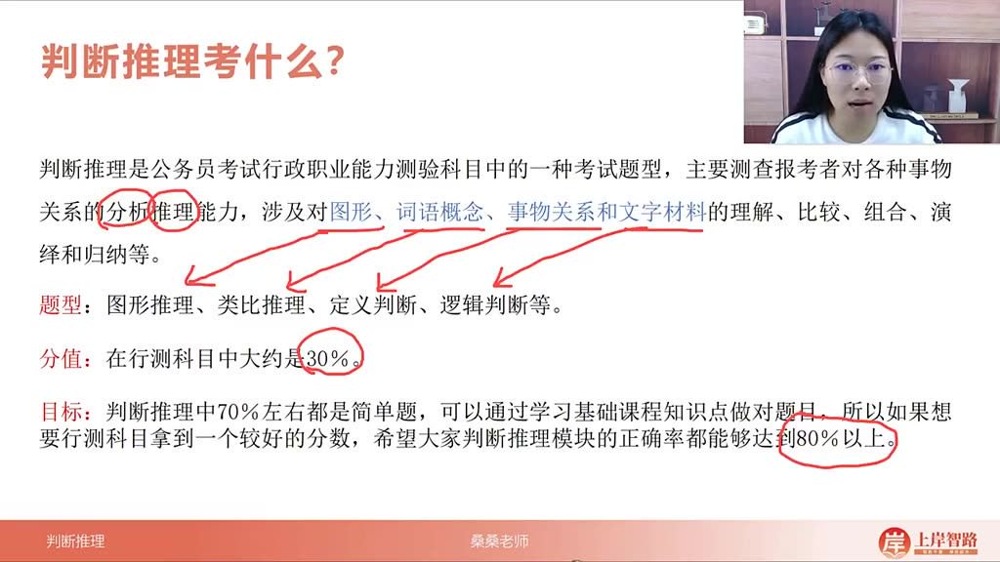

- 考试定位: 公务员考试行政职业能力测验中的核心题型，主要测查对各种事物关系的分析推理能力。

- 考察维度: 包含对图形、词语概念、事物关系和文字材料的理解、比较、组合、演绎和归纳等能力。

- 四大题型

  :

  - 图形推理: 通过图形特征分析规律
  - 类比推理: 分析词语间逻辑关系
  - 定义判断: 判断选项与给定概念的符合性
  - 逻辑判断: 基于文字材料进行逻辑推论

- 分值占比: 在行测科目中约占30%，是重点拿分模块。

- 备考策略

  :

  - 70%为基础题，系统学习可保证基本正确率
  - 目标正确率应设定在80%以上
  - 高分需在基础学习后进行强化训练

###### 2）国考 02:45

- 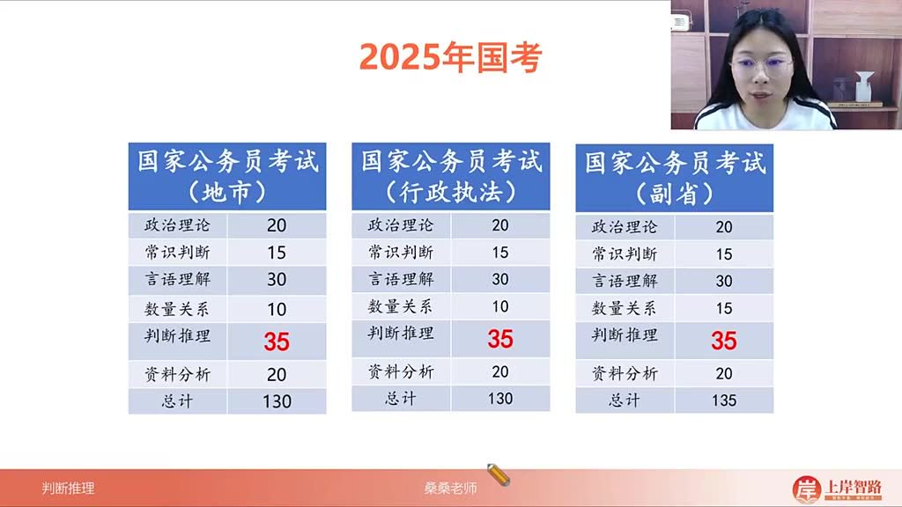

- 题量特点

  :

  - 固定考查35题（地市/行政执法/副省卷型一致）
  - 在130-135题总量中保持稳定占比

- 试卷差异

  :

  - 副省级总量135题（数量关系多5题）
  - 其他模块题量分布完全相同

###### 3）省联考 03:06

- 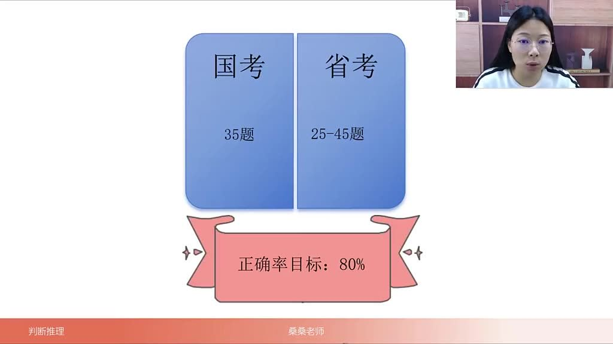

- 常规省份

  :

  - 河北/甘肃/安徽等多数省份考查30-35题
  - 在120-130题总量中占比约25-30%

- 特殊案例

  :

  - 海南仅考查25题（总量110题）
  - 广西/贵州等省份题量110题但判断推理仍占30+

###### 4）特殊省份 03:46

- 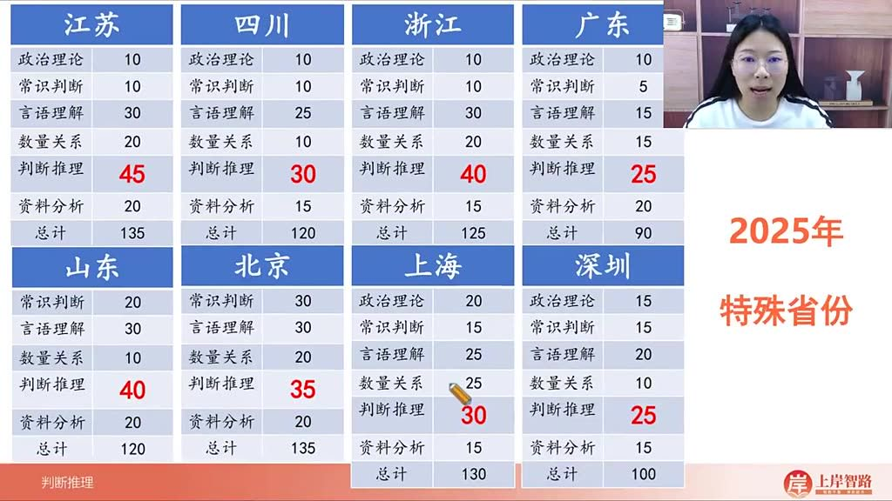

- 重点省份

  :

  - 江苏最重视（45题/135题总量）
  - 浙江/山东各40题
  - 广东相对较少（25题/90题总量）

- 命题特点

  :

  - 单独命题省份差异显著
  - 江苏题量达行测总量33%
  - 山东在120题总量中占40题

##### 2. 题型示例 04:21

- 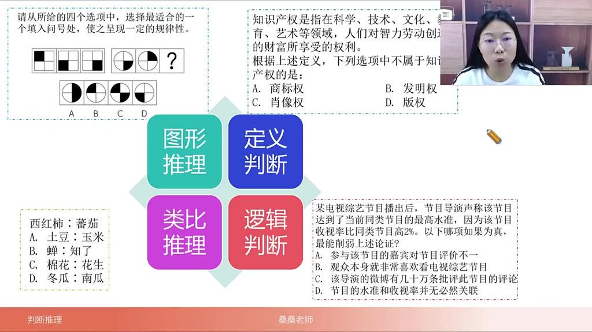

- 图形推理

  :

  - 典型题干: "请从所给的四个选项中，选择最适合的一个填入问号处，使之呈现一定的规律性。"
  - 解题要点: 观察图形元素的数量、位置、样式等变化规律

- 定义判断

  :

  - 典型结构: 给出概念定义（如知识产权），要求选择"不属于"的选项
  - 错误选项特征: 混淆相关概念（如肖像权不属于知识产权）

- 类比推理

  :

  - 考查形式: 给出词语对（如西红柿：番茄），选择逻辑关系一致的选项
  - 关系类型: 包含同义关系（蝉：知了）、种属关系等

- 逻辑判断

  :

  - 常见题型: 削弱论证类题目
  - 解题关键: 找出论证漏洞（如"水准与收视率无必然关联"）
  - 干扰项特征: 与论点无关的批评意见（导演微博差评）

##### 3. 图形推理 05:44

- 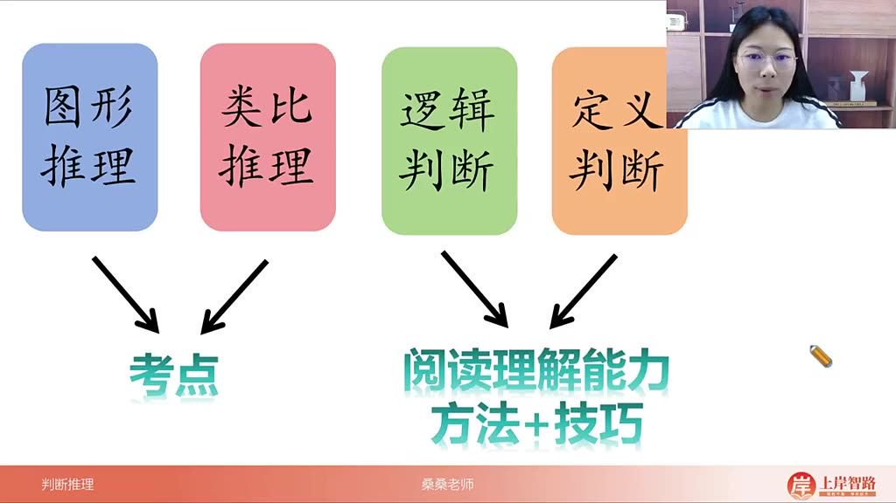

- 特点: 属于智商测试题型，规律变化丰富多样

- 学习方法

  :

  - 考点穷举: 需全面掌握所有考点，特别是2024-2025年最新考点
  - 体感培养: 通过大量练习建立解题直觉

- 核心考点

  :

  - 位置类：平移、旋转、翻转
  - 样式类：点线面关系、笔画数
  - 数量类：元素数量变化
  - 重构类：立体拼合、平面拼合

##### 4. 类比推理 07:14

- 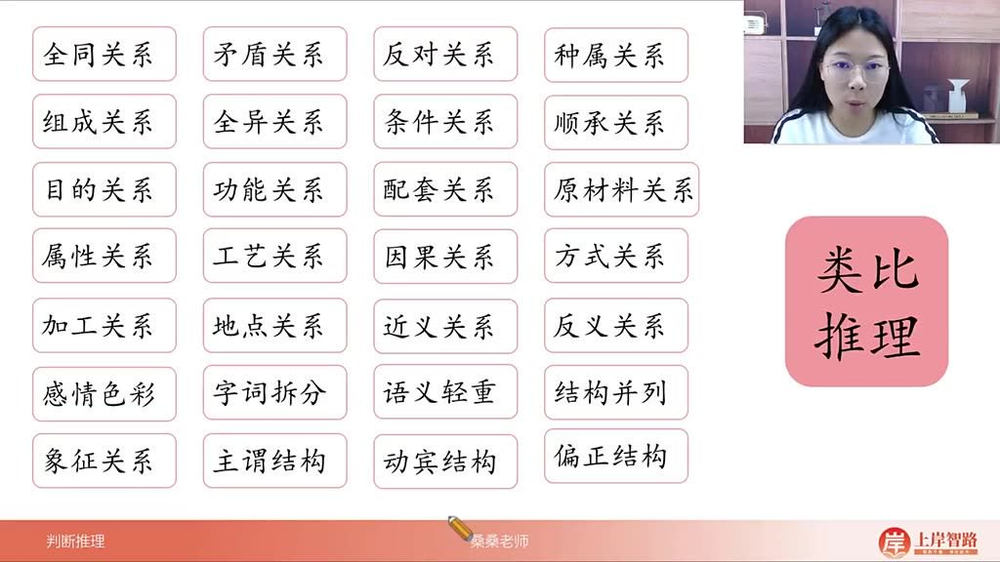

- 关系类型

  :

  - 逻辑关系：全同、矛盾、反对、种属、组成、全异
  - 条件关系：充分/必要条件
  - 语义关系：近义、反义、感情色彩
  - 语法关系：主谓、动宾、偏正结构
  - 其他关系：功能、配套、原材料、工艺、因果等

- 学习要点

  :

  - 需系统掌握20+种关系类型
  - 重点掌握最新考试中出现的地点对应、象征关系等新型考点

##### 5. 逻辑推理 07:43

- 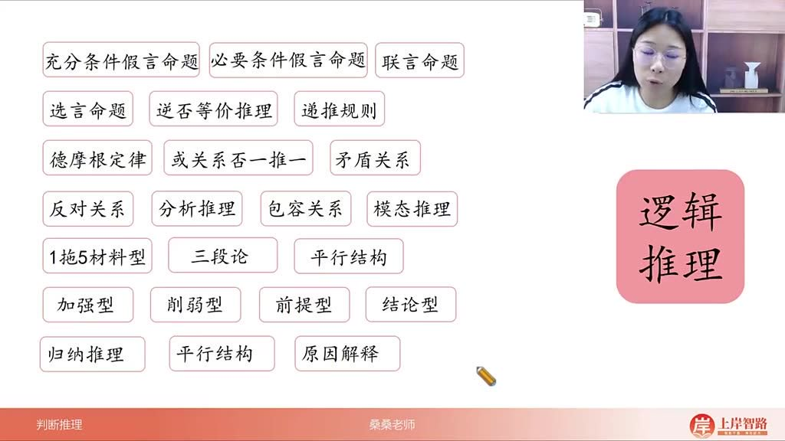

- 命题类型

  :

  - 假言命题：充分/必要条件
  - 联言命题、选言命题

- 推理方法

  :

  - 逆否等价、递推规则
  - 德摩根定律、否一推一

- 论证题型

  :

  - 加强型、削弱型
  - 前提型、结论型
  - 原因解释、平行结构

- 解题关键

  :

  - 掌握矛盾关系与反对关系的区分
  - 熟练运用模态推理和1拖5材料型题目的解法

##### 6. 考点分析 08:36

- 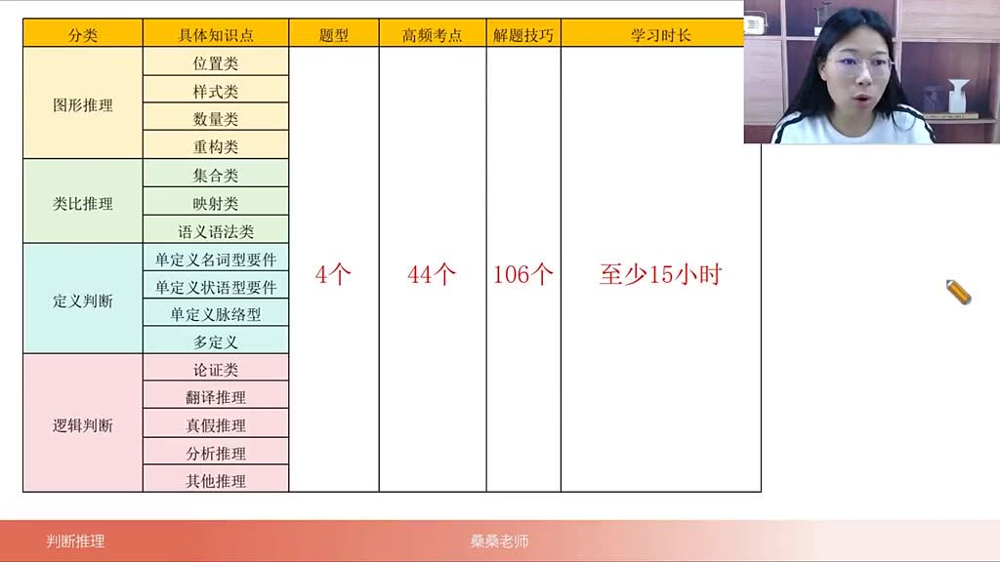

- 知识体量

  :

  - 44个高频考点
  - 106个解题技巧

- 模块分布

  :

  - 图形推理：位置类(4个考点)、样式类、数量类、重构类
  - 类比推理：集合类、映射类、语义语法类
  - 定义判断：单定义(名词型/状语型/脉络型)、多定义
  - 逻辑判断：论证类、翻译推理、分析推理等

- 学习建议

  :

  - 基础学习至少需要15小时
  - 需配套大量练习巩固知识点

##### 7. 学习路径 09:23

- 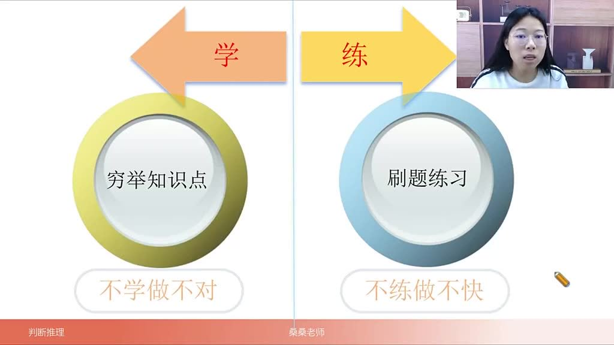

- 两阶段学习法

  :

  - 学阶段

    :

    - 目标：穷尽所有知识点
    - 必要性：不学则无法做对题目

  - 练阶段

    :

    - 目标：提升解题速度
    - 必要性：不练则无法快速解题
    - 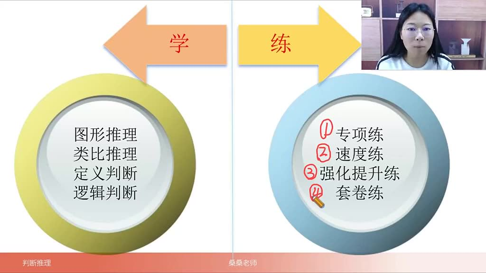

- 四步训练法

  :

  - 专项练习：分知识点、模块、难度训练
  - 速度训练：在保证正确率前提下提速
  - 强化提升：重点攻克难题
  - 套卷训练：模拟真实考试环境

- 时间分配

  :

  - 练习时间应为学习时间的2倍以上
  - 最终需达到40-50秒/题的解题速度

##### 8. 应用案例 12:05

###### 1）例题:图形推理题作答方法

- 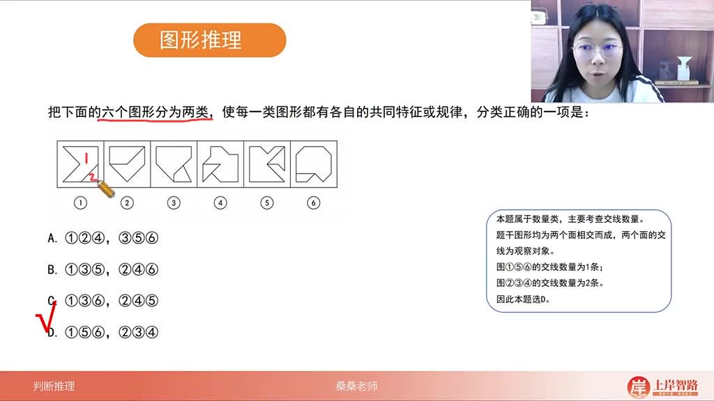

- 解题思路

  ：

  - 当题干图形均为两个面相交而成时，优先考虑两个面的交集特征
  - 观察交线数量是重要突破口，本题中图①⑤⑥交线为1条，图②③④交线为2条

- 方法技巧

  ：

  - 图形推理难点在于考点识别和思考路径建立
  - 基础训练需掌握"见什么图想什么考点"的解题思维

- 答案：D（①⑤⑥一组，②③④一组）

###### 2）例题:定义判断题答题技巧 14:12

- 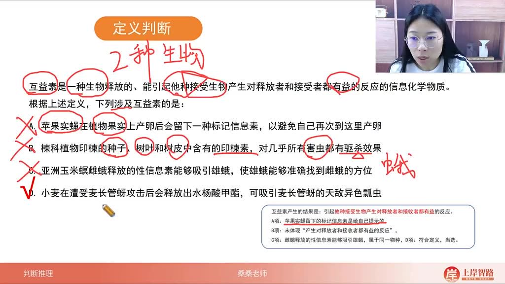

- 关键词提取

  ：

  - 两种不同生物
  - 对释放者和接受者都有益
  - 信息化学物质

- 解题步骤

  ：

  - 快速定位定义核心要素（如"两种生物"）
  - 用关键词排除明显错误选项（如C项只有一种生物）
  - 验证剩余选项是否符合全部定义要件

- 选项分析

  ：

  - A项：仅对释放者有益
  - B项："驱杀"不符合互利
  - C项：同种生物排除
  - D项：小麦与瓢虫互利，完全符合

- 答案：D

###### 3）例题:类比推理题答题方法 19:24

- 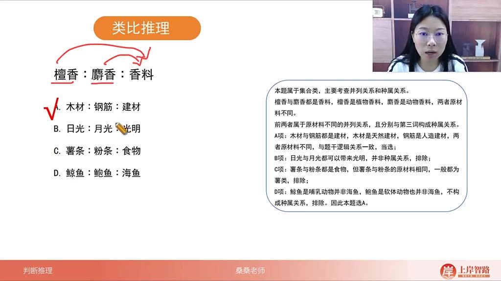

- 一级关系

  ：

  - 檀香、麝香→都是香料（种属关系）
  - 类似：木材、钢筋→都是建材

- 二级辨析

  ：

  - 原料差异：檀香（植物）vs麝香（动物）
  - 对应：木材（天然）vs钢筋（人造）

- 排除技巧

  ：

  - B项"光明"非种属关系
  - D项鲸鱼非鱼类
  - C项原料相同（均为薯类）

- 答案：A

###### 4）例题:逻辑判断题加强方式 21:29

- 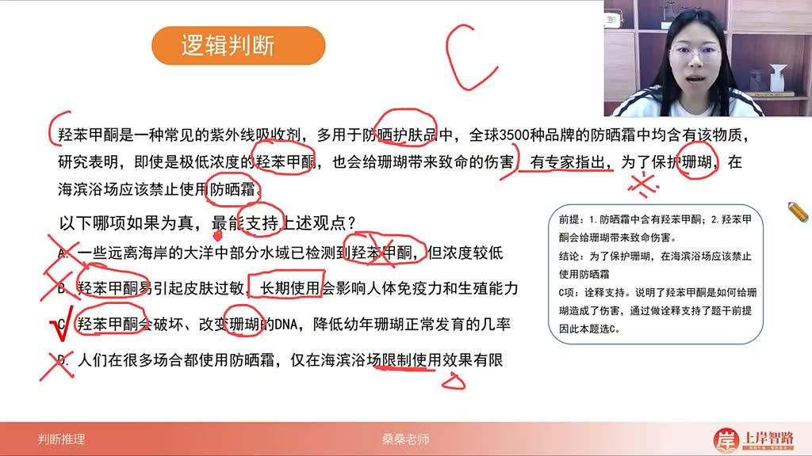

- 论证结构

  ：

  - 前提1：防晒霜含羟苯甲酮
  - 前提2：该物质伤害珊瑚
  - 结论：应禁止海滨浴场防晒霜

- 加强类型

  ：

  - 最佳支持：解释作用机制（C项说明破坏DNA）
  - 其他选项不足：
    - A项：仅证明存在但无伤害说明
    - B项：人体伤害与珊瑚无关
    - D项：讨论限制效果而非必要性

- 答案：C

#### 二、知识小结

| 知识点           | 核心内容                                                     | 考试重点/易混淆点                                            | 难度系数 |
| ---------------- | ------------------------------------------------------------ | ------------------------------------------------------------ | -------- |
| 判断推理模块概述 | 公务员考试行测重要组成部分，占比约30%，包含图形/类比/定义/逻辑四大题型 | 题型差异大（图形智商测试型/类比关系型/定义阅读型/逻辑论证型） | ★★★☆☆    |
| 图形推理         | 考察图形规律识别（平移/旋转/翻转/点线面等）                  | 双面相交题：优先考虑面与面交线数量（如示例中的1交线vs2交线分组） | ★★★★☆    |
| 类比推理         | 分析词语间逻辑关系（全同/矛盾/种属等）                       | 二级辨析：香料题需区分植物/动物原料（檀香木vs麝香鹿）        | ★★★☆☆    |
| 定义判断         | 通过关键词定位解题（如"互益素"需满足：1.跨物种 2.双向受益）  | 快速排除法：C选项"雌雄蛾"属同物种直接排除                    | ★★★★☆    |
| 逻辑判断         | 加强削弱类题目需定位论点论据（防晒霜→强苯甲酮→珊瑚死亡）     | 加强优选：C选项揭示作用机制＞B选项无关人体危害               | ★★★★☆    |
| 学习路径         | 1.15小时基础课（44考点+106技巧）→2.专项/速度/强化/套题训练   | 关键比例：练习时间≥学习时间2倍                               | ★★★★★    |
| 题量分布         | 国考固定35题/省考25-45题（江苏45/浙江山东40/多数省30-35）    | 特殊省份：海南仅25题（总题量110）                            | ★★☆☆☆    |
| 目标设定         | 基础题占比70%→正确率80%+可保障行测竞争力                     | 高分关键：图形类比穷尽考点+定义逻辑速读技巧                  | ★★★★★    |

|      |      |      |      |
| ---- | ---- | ---- | ---- |
|      |      |      |      |
|      |      |      |      |
|      |      |      |      |
|      |      |      |      |
|      |      |      |      |
|      |      |      |      |
|      |      |      |      |
|      |      |      |      |