以下为AI生成的图文笔记的内容

#### 一、六面体 00:55

##### 1. 六面体题型

- 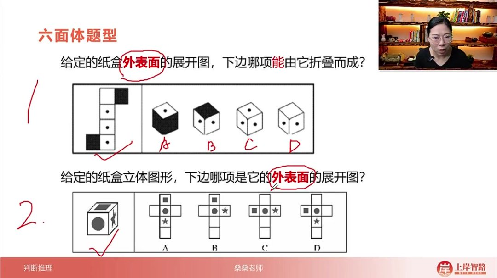

- 题型分类

  ：

  - 展开图转立体图：给定纸盒外表面展开图，判断选项哪个能/不能由它折叠成立体图形
  - 立体图转展开图：给定立体图形，判断哪个选项是其外表面展开图

- 核心考察：平面展开图与立体图的空间对应关系

- 注意事项

  ：

  - 外表面原则：展开图仅表现外表面特征，不能从内部观察
  - 提问方式：需特别注意题目问"能"还是"不能"折叠，避免因审题失误选错

##### 2. 六面体解题方法

- 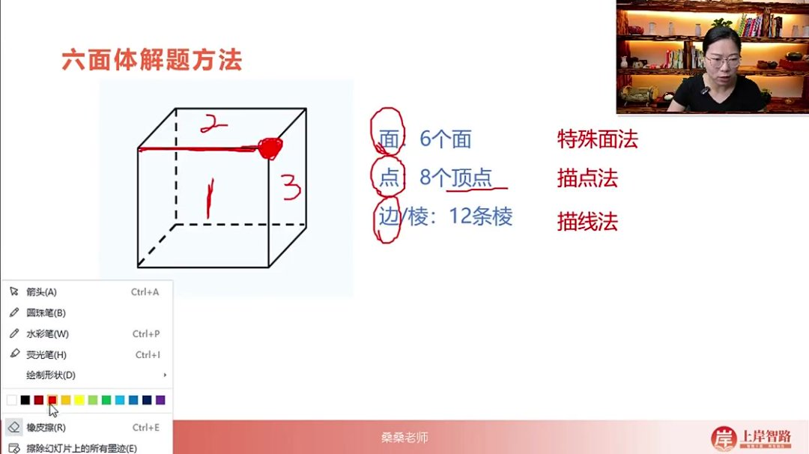

- 结构要素

  ：

  - 面：6个面 → 对应特殊面法
  - 顶点：8个顶点 → 对应描点法
  - 棱：12条棱 → 对应描线法

- 顶点特性：每个顶点连接3个相邻面（重要隐藏性质）

###### 1）方法优先级

- 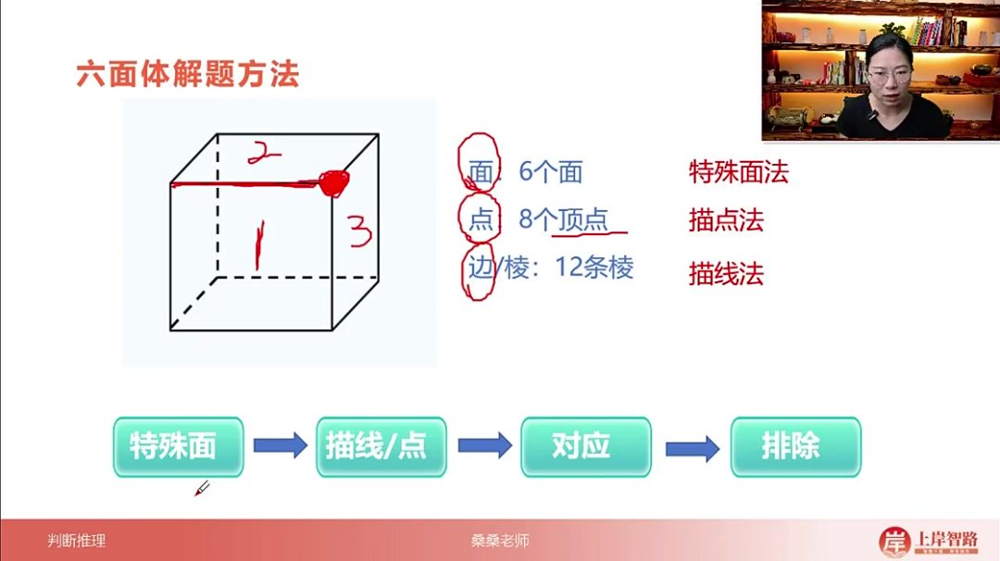

- 使用顺序

  ：

  - 优先使用特殊面法（视觉识别度高）
  - 次选描线法/描点法（通过边棱对应关系验证）

- 核心策略：通过对应关系排除错误选项

###### 2）特殊面法

- 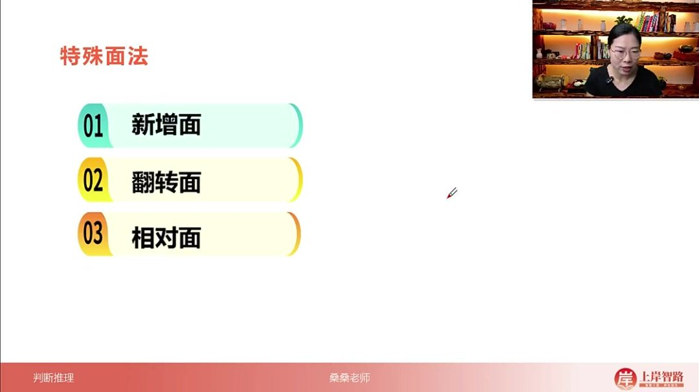

- 三大技巧

  ：

  - 新增面识别
  - 翻转面分析

相对面判断

- - （具体方法讲解未完整记录）

##### 3. 六面体解题方法 03:24

###### 1）特殊面法 06:27

- 新增面 

  06:38

  - 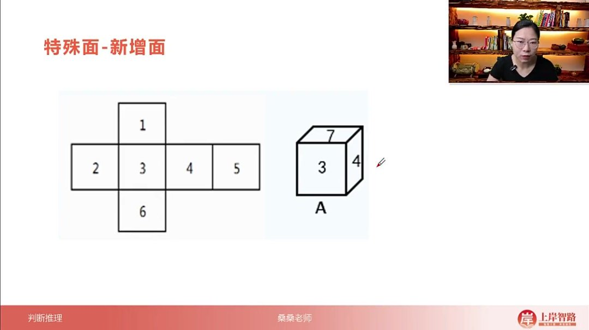

  - 定义：当立体图中出现展开图没有的面时称为新增面

  - 识别方法

    ：

    - 展开图有6个面（如1-6号）
    - 立体图出现7号等新编号面

  - 解题技巧

    ：

    - 新增面选项一定错误
    - 出题人常用相似面（如7像1）制造视觉混淆

  - 示例：展开图1-6面中，若立体图出现7面即为新增面

- 翻转面 

  07:49

  - 翻转面的定义与特性 

    07:52

    - 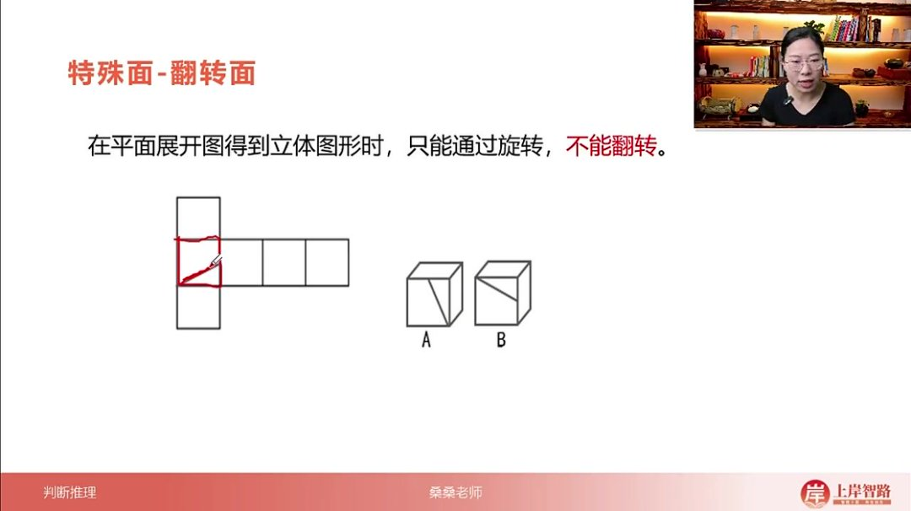

    - 核心规则：平面展开图→立体图时只能旋转不能翻转

    - 判断标准

      ：

      - 旋转：保持图案方向（如直角三角形斜边方向不变）
      - 翻转：图案镜像对称（如斜边左右反向）

    - 解题应用

      ：

      - 出现翻转面的选项必定错误
      - 考试出现频率较低但需警惕

  - 例题1:上边给定的是纸盒外表面的展开图，下边哪一项能由它折叠而成？ 

    09:18

    - 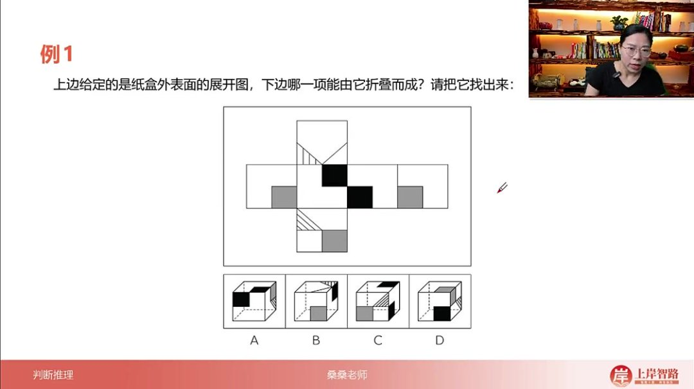

    - 题目解析：

      - 展开图特征

        ：

        - 面1/4相同（灰色正方形）
        - 面2/3相同
        - 面5/6为特殊面（含三角形）

      - 选项分析

        ：

        - A选项：
          - 出现灰色正方形与三角形相邻的新增面
          - 展开图中灰色正方形与三角形分离
          - →排除
        - B选项：
          - 面5经旋转后阴影方向与展开图左右相反
          - 属于翻转面
          - 或通过公共边（阴影三角形位置）判断错误
          - →排除
        - C选项：
          - 面6的三角形位置与展开图镜像对称
          - 属于翻转面
          - →排除
        - D选项：
          - 通过排除法确认唯一可能正确项
          - 各面关系符合旋转规则

      - 答案：D

      - 解题技巧

        ：

        - 优先检查特殊面（5/6）
        - 六面体题多用排除法
        - 注意面与面之间的相对位置关系

- 相对面 

  15:54

  - 相对面的定义与重要性 

    16:10

    - 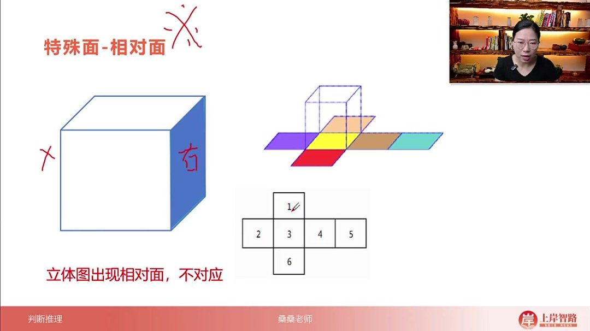
    - 定义：在六面体中，相对面指相互正对的两个面，如右侧面与左侧面互为相对面。
    - 特性：每个六面体共有三组相对面（上下、前后、左右），在立体图形中只能看到一个相对面，若同时出现两个则图形错误。

  - 六面体的三组相对面 

    16:34

    - 构成

      ：标准六面体包含：

      - 上下面组
      - 前后面组
      - 左右面组

    - 遮挡原理：观察立体图形时，可见面会遮挡其相对面，如看到右面时左面必然被遮挡。

  - 立体图形中相对面的特性 

    16:57

    - 唯一性规则：在正确折叠的立体图形中，一组相对面有且只能出现一个。
    - 错误判断：若选项中出现同一组相对面的两个面（如同时显示左右面），可直接排除该选项。

  - 展开图中相对面的判断方法 

    17:15

    - 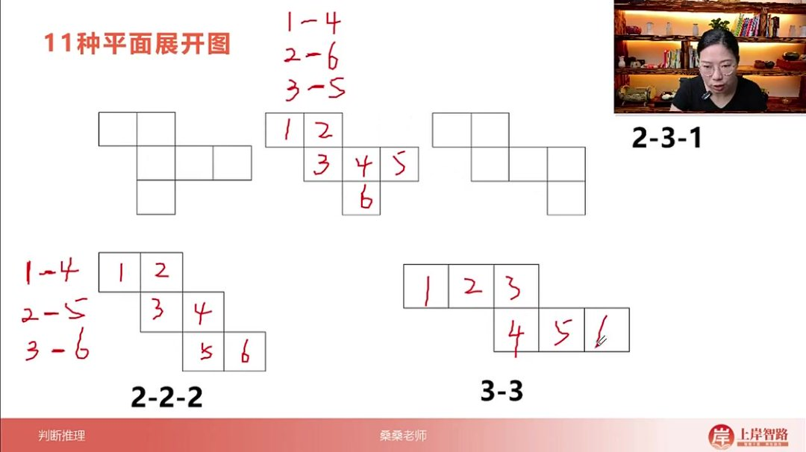

    - 隔行/列法则

      ：

      - 隔一整行：如1号面与6号面间隔2/3/4/5行
      - 隔一整列：如2号面与4号面间隔3号列

    - 应用示例

      ：

      - 一四一型展开图中，1与6、2与4、3与5互为相对面
      - 二三一型展开图中，1与4、2与6、3与5互为相对面

  - 例题1:通过相对面去解题 

    19:20

    - 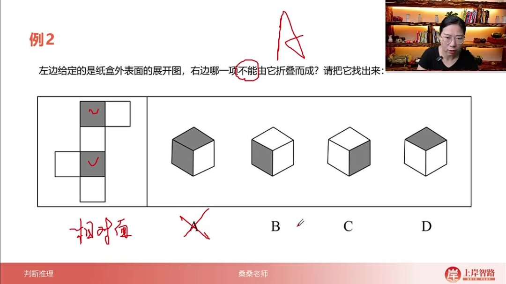
    - 题目解析：
      - 展开图中两个灰色面隔行相对
      - A选项同时出现两个灰色相对面，违反唯一性规则
      - 答案：A（其他选项均符合相对面出现规则）

  - 相对面的寻找方法总结 

    19:50

    - 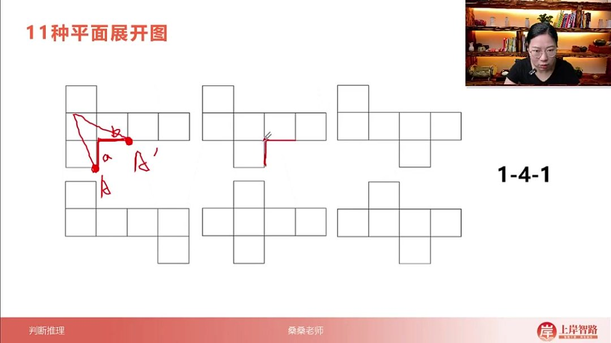

    - 展开图类型

      ：

      - 一四一型（6种变体）
      - 二三一型
      - 二二二型
      - 三三型

    - 快速判断技巧

      ：

      - 先确定展开图类型
      - 应用隔行/列法则定位相对面
      - 复杂图形采用"马走日"法验证公共点（连续两次日字形移动）

##### 4. 总结六面体 54:40

- 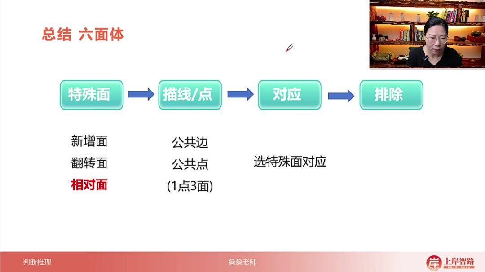

###### 1）解题方法分类

- 三大方法：六面体问题主要采用特殊面法、描线法和描点法三种解题方法
- 方法选择原则：描线法和描点法可根据个人熟悉程度灵活选用，但必须结合特殊面进行对应

###### 2）特殊面法详解

- 三大类型

  ：

  - 新增面：识别图形中新增的独特面
  - 翻转面：观察面在展开图中的翻转关系
  - 相对面：考试中使用频率最高的方法，通过确定相对面关系解题

- 应用要点：必须选择具有特殊性的面进行对应，否则在展开图中难以准确定位

###### 3）公共边与公共点法

- 描线法：通过分析公共边的对应关系解题
- 描点法：通过分析公共点的对应关系解题
- 注意事项：使用这两种方法时必须结合特殊面进行对应验证

###### 4）解题策略

- 排除法优先：六面体问题应优先考虑使用排除法解题
- 综合运用：实际解题时需要灵活组合使用特殊面法、描线法和描点法
- 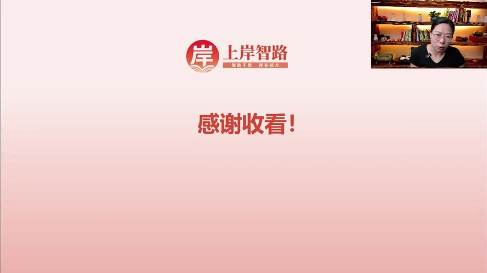

#### 二、知识小结

| 知识点         | 核心内容                                                     | 考试重点/易混淆点                                   | 难度系数 |
| -------------- | ------------------------------------------------------------ | --------------------------------------------------- | -------- |
| 六面体基本概念 | 六面体的面（6个）、顶点（8个）、棱（12条）及相互关系         | 顶点连接面数（3个）与公共边特性                     | ⭐⭐       |
| 特殊面解题法   | 新增面（选项出现题干未有的面）、翻转面（立体图禁止翻转）、相对面（隔一行/列，立体图中仅出现一个） | 相对面识别技巧（一四一/二三一/二二二/三三型展开图） | ⭐⭐⭐⭐     |
| 描线法         | 通过相邻面的公共边对应展开图与立体图                         | 直角边必为公共边，需验证方向一致性                  | ⭐⭐⭐      |
| 描点法         | 三面交汇的公共点对应（马走日法连续两次定位）                 | 展开图中点的多位置映射（如a=a'=a''）                | ⭐⭐⭐⭐     |
| 真题应用       | 例题1-5的排除逻辑（新增面/翻转面/相对面排除错误选项）        | 例题4的描线法验证（五角星面方向错误）               | ⭐⭐⭐⭐     |
| 高频考点       | 六面体展开图11种类型、相对面必考、描点法通用性最强           | 三三型展开图难度最高，需重点练习                    | ⭐⭐⭐⭐⭐    |