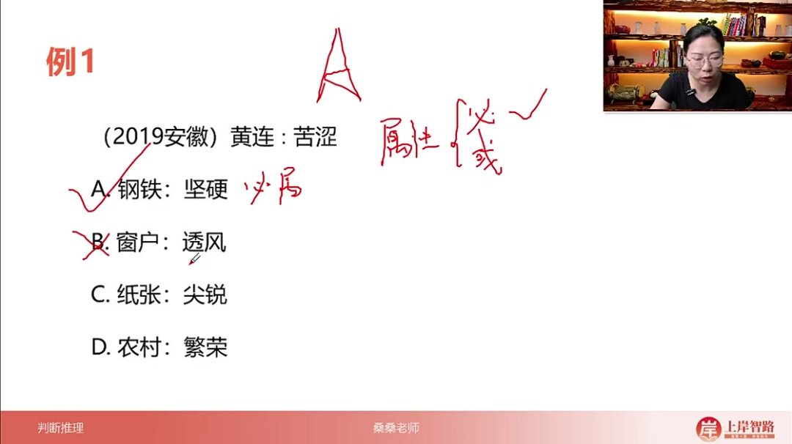
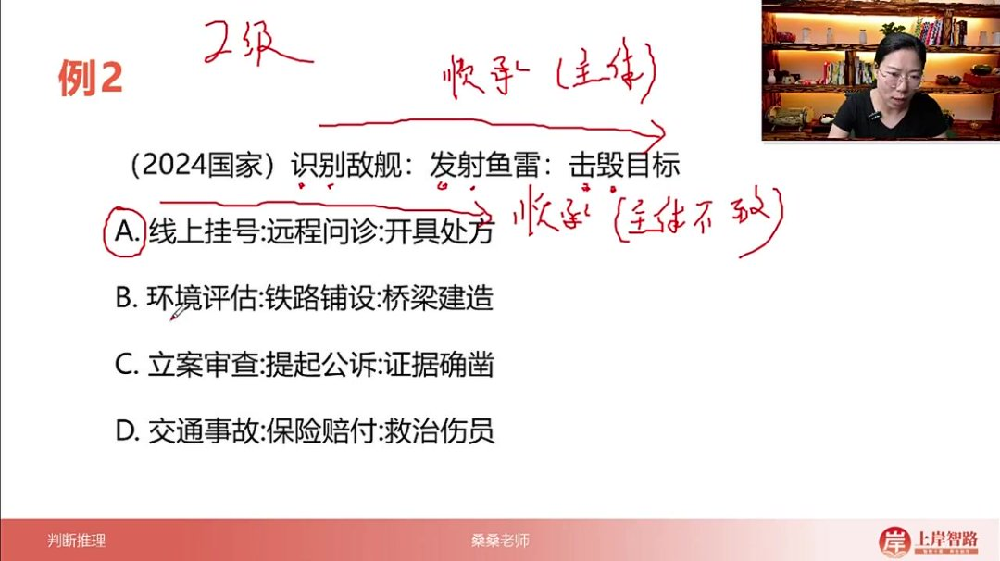
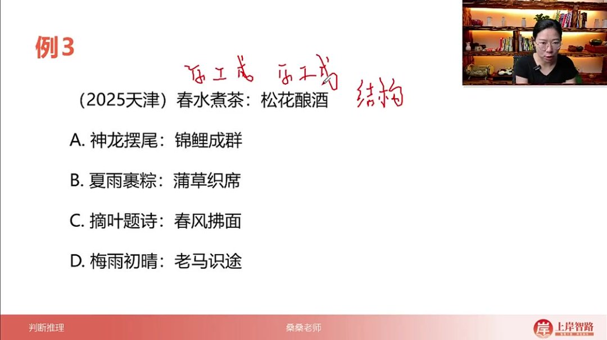
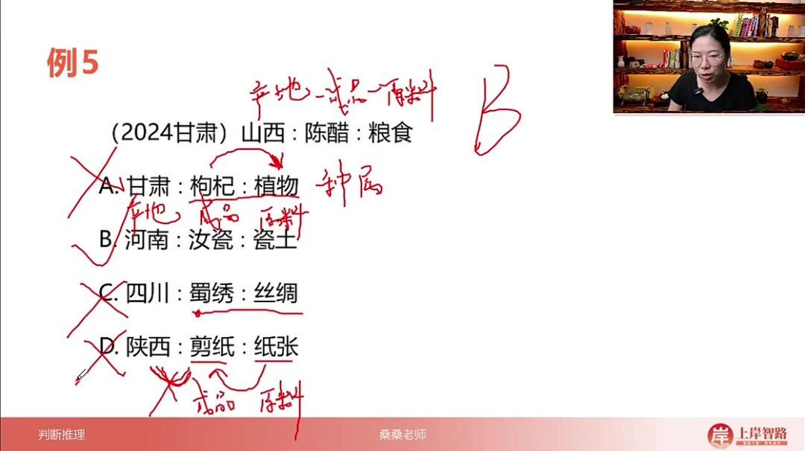
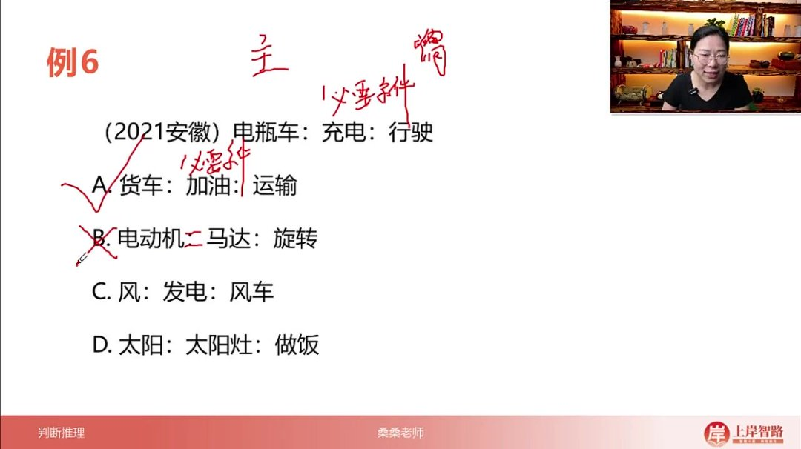
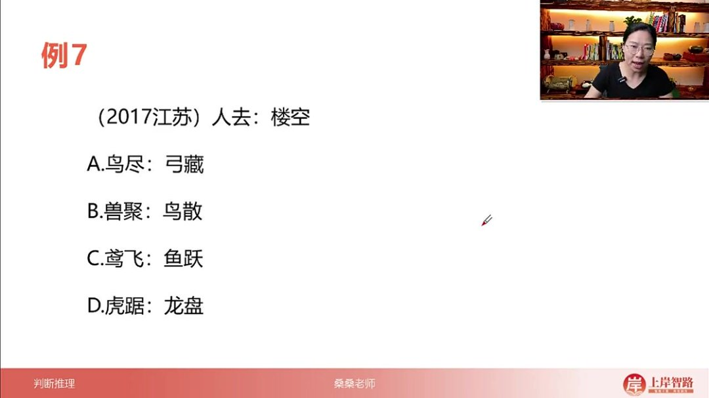
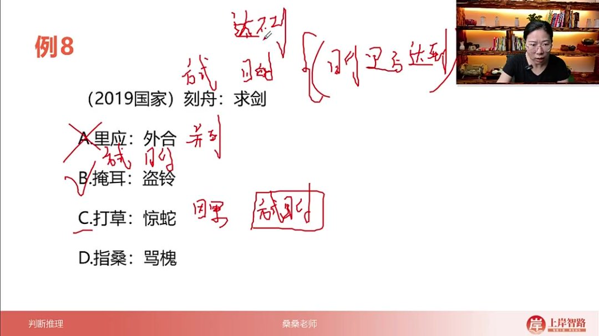
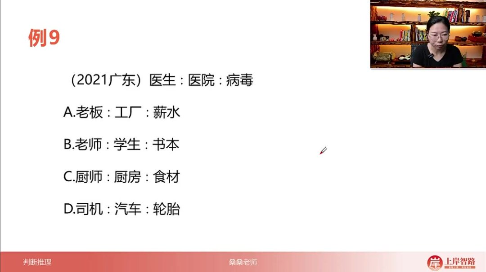
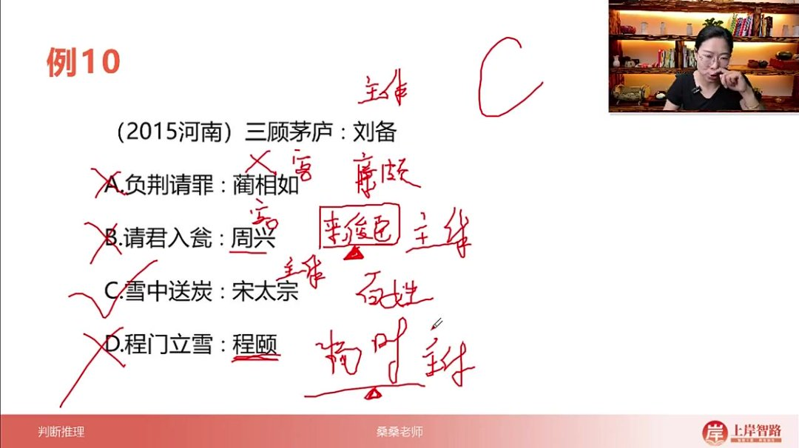

以下为AI生成的图文笔记的内容

#### 一、类比推理 00:00

##### 1. 映射类 00:16

###### 1）十大常考映射关系 01:18

- 属性关系 

  01:25

  - 本质特征：概念与其固有特征的对应关系

  - 必然属性：所有实例都具备的特征（糖→甜、钻石→坚硬、黄连→苦）

  - 或然属性

    ：

    - 群体属性：刻板印象特征（狐狸→狡猾、农民→朴实）
    - 普通可能性：非必然特征（花→红，实际可能有其他颜色）

  - 考察重点：考试中主要区分必然与或然属性

- 顺承关系 

  03:51

  - 核心特征：时间先后顺序的动作链

  - 判断原则：必须采用大众常规思维（购票→乘车）

  - 二级辨析

    ：

    - 主体一致性：动作发出者是否相同（生病→打针，主体不同）
    - 动词数量：题干与选项的动词数量需对应

  - 典型错误：用特殊案例否定普遍规律

- 功能作用 

  06:39

  - 基本形式：物品与其用途的对应（手机→通讯）

  - 二级辨析

    ：

    - 主次功能：汽油主要供能，次要可去渍

  - 识别技巧：通过"用来..."句式验证

- 原材料与成品 

  07:55

  - 变化类型

    ：

    - 物理变化：木材→桌子（无新物质）
    - 化学变化：高粱→啤酒（发酵产生新物质）

  - 材料性质

    ：

    - 自然物：小麦（天然）
    - 人工物：面粉（加工后）

  - 必要性

    ：

    - 必然材料：蛋黄→蛋黄月饼
    - 或然材料：银子→发簪

- 工艺对应 

  12:43

  - 典型示例：手镯→磨制
  - 解题要点：直接运用生活常识判断

- 条件对应 

  13:21

  - 考查重点：必要条件关系（沸点→沸腾）
  - 验证方法：用"无A无B"句式测试（无氧不燃烧）
  - 真题案例：18周岁→选举权

- 因果对应 

  15:09

  - 特征：或然性因果关系（炎热→中暑）
  - 区分要点：与必然条件关系的区别

- 方式与目的 

  15:44

  - 成语案例

    ：

    - 目的未达：刻舟求剑、掩耳盗铃
    - 目的可达：常规生活场景

  - 辨析关键：判断目的是否实现

- 地点对应 

  17:09

  - 常见类型

    ：

    - 职业场所：教师→教室
    - 生物栖息：企鹅→南极

  - 扩展形式：鱼→水（生存环境）

- 常识对应 

  17:42

  - 典型特征：文化常识积累（三顾茅庐→刘备）
  - 备考建议：需平时积累，无法临时推导

###### 2）应用案例 18:26

- 例题:属性对应关系

  - 

  - 核心考点：题干与选项间必然/或然属性的对应关系辨析

  - 解题步骤

    ：

    - 第一步关系判定：确认题干为"事物-属性"对应关系（黄连→苦涩）

    - 二级辨析关键：判断属性属于必然属性（黄连必定苦涩）还是或然属性（可能但不必然）

    - 选项验证方法

      ：

      - A选项钢铁→坚硬：必然属性（所有钢铁必然坚硬）
      - B选项窗户→透风：或然属性（正常窗户应不透风）
      - C选项纸张→尖锐：或然属性（如卫生纸柔软）
      - D选项农村→繁荣：或然属性（存在萧条农村）

  - 易错警示：注意区分功能属性（如窗户透光）与缺陷属性（如窗户透风）

- 例题:顺承关系 

  20:16

  - 

  - 关系特征

    ：

    - 动词连续性：题干"识别→发射→击毁"为动作链
    - 时间序列：严格遵循"先→中→后"的时间顺序

  - 解题策略

    ：

    - 一级优先原则：先通过顺承关系排除非连续动作选项（B/D选项动作顺序混乱）
    - 二级补充验证：当一级无法决断时考察主体一致性（题干全程"我方"为单一主体）

  - 选项分析

    ：

    - A选项"挂号→问诊→开方"：符合时间序列（虽主体不一致）
    - B选项"评估→铺设→建造"：铁路与桥梁无必然时序
    - C选项"立案→公诉→取证"：实际应为"取证→立案→公诉"
    - D选项"事故→赔付→救治"：救治与赔付无固定先后

  - 应试技巧：90%顺承关系题目通过一级辨析即可解题

- 例题:原材料工艺与成品对应关系 

  25:01

  - 

  - 结构解析

    ：

    - 三元组构成："春水（原料）→煮（工艺）→茶（成品）"
    - 对称验证：前后词组需保持相同结构关系

  - 选项鉴别

    ：

    - B选项"夏雨→裹→粽"+"蒲草→织→席"：完全匹配题干结构
    - 错误类型：
      - A选项"神龙摆尾"：主谓结构非原料加工
      - C选项"摘叶题诗"：动作承接关系
      - D选项"梅雨初晴"：自然现象描述

  - 命题趋势：近年常考词语内部结构关系（非词语间关系）

- 例题:功能对应关系 

  29:07

  - 

  - 关系本质：主体与其固有功能的直接对应

  - 干扰项识别

    ：

    - A选项"学校：教书"：实为场所-活动关系
    - C选项"飞机：安检"：属于流程前置条件
    - D选项"施肥：增收"：方式-目的关系

  - 正选特征

    ：

    - B选项"冰箱：保鲜"：保鲜是冰箱的设计核心功能

  - 快速判断法：用"XX用来YY"句式验证（如"手机用来通讯"成立，"学校用来教书"不成立）

- 例题:产地、成品和原料对应关系 

  30:42

  - 

  - 产地对应关系: 山西是陈醋的原产地，形成"产地-产品"对应关系

  - 原料成品关系: 陈醋由粮食酿造而成，构成"原料-成品"对应关系

  - 选项分析技巧

    :

    - A选项"甘肃：枸杞：植物"中后两词为种属关系，不符合题干逻辑
    - B选项"河南：汝瓷：瓷土"完全匹配题干关系：河南是产地，汝瓷是成品，瓷土是原料
    - C选项"四川：蜀绣：丝绸"中丝绸并非蜀绣的原材料，而是承载物
    - D选项"陕西：剪纸：纸张"虽然后两词关系正确，但陕西并非剪纸的明确发源地

  - 常识考点: 此题考察对各地特产及其生产原料的常识掌握程度

- 例题:必要条件对应关系 

  34:26

  - 

  - 必要条件关系: 充电是电瓶车行驶的必要条件，构成"必要条件-行为"关系

  - 主谓对应: 电瓶车与行驶构成主谓关系

  - 选项分析

    :

    - A选项"货车：加油：运输"完全匹配：加油是运输的必要条件，货车运输是主谓关系
    - B选项"电动机：马达：旋转"中前两词为全同关系，不符合必要条件逻辑
    - C选项"风：发电：风车"顺序颠倒，应为"风车：风：发电"
    - D选项"太阳：太阳灶：做饭"同样顺序错误，应为"太阳灶：太阳：做饭"

  - 解题技巧: 通过造句法验证必要条件关系，注意词语顺序的重要性

- 例题:因果对应关系 

  37:19

  - 

  - 因果关系定义: 前词是后词发生的原因，后词是前词导致的结果

  - 题干分析: "人去"导致"楼空"，构成明确因果关系

  - 选项辨析

    :

    - A选项"鸟尽：弓藏"：因为鸟没有了，所以藏起弓箭，是唯一正确因果关系
    - B选项"兽聚：鸟散"：实为并列关系，描述动物聚集与分散的状态
    - C选项"鸢飞：鱼跃"：并列描写鹰飞鱼跃的景象
    - D选项"虎踞：龙盘"：并列形容地势险要的样貌

  - 结构特征: 错误选项多为结构相同的并列短语，可通过句式特征排除

- 例题:方式目的对应关系 

  39:53

  - 

  - 方式目的关系: 前词表示采取的方式，后词表示想要达到的目的

  - 题干解析: "刻舟"是为了"求剑"而采取的方式

  - 二级辨析

    :

    - 题干中目的无法实现（刻舟求不到剑）
    - B选项"掩耳盗铃"同样目的无法实现
    - C选项"打草惊蛇"（古代解释）目的可以实现

  - 选项分析

    :

    - A选项"里应：外合"：并列关系，同时发生的配合动作
    - B选项正确匹配方式目的关系且目的不可实现
    - D选项"指桑：骂槐"：并列的比喻表达方式

  - 高频考点提醒: "刻舟求剑"类成语在考试中出现频率极高，需重点掌握

- 例题：地点对应关系 

  43:26

  - 例题：职业-地点-物品关系题

    - 

    - 题目解析

      - 解题方法

        ：可通过造句法快速解题，保持题干与选项的句式结构一致

        - 标准句式："[职业]在[地点]，[地点]有[物品]"
        - 题干造句："医生在医院，医院有病毒"

      - 选项分析

        ：

        - A选项：工厂有薪水（×）薪水应存在银行卡
        - B选项：学生有书本（×）"学生"非地点
        - C选项：厨房有食材（√）完全匹配题干结构
        - D选项：轮胎是汽车组成部分（×）属于组成关系

      - 答案：C

      - 注意事项

        ：

        - 造句时尽量不加字或少加字
        - 必须加字时要保持所有选项添加相同字词
        - 替代解法：分析"职业-工作地点-地点存在物"三重对应关系

- 例题：常识对应关系 

  45:54

  - 例题：成语典故对应题

    - 

    - 题目解析

      - 核心考点：成语典故中的主体人物识别

      - 题干分析

        ：

        - "三顾茅庐"主体：刘备（客体：诸葛亮）

      - 选项分析

        ：

        - A选项：负荆请罪主体应为廉颇（×）
        - B选项：请君入瓮主体是来俊臣（×）
        - C选项：雪中送炭主体是宋太宗（√）
        - D选项：程门立雪主体是杨时（×）

      - 答案：C

      - 典故补充

        ：

        - 请君入瓮：武则天时期来俊臣设计周兴
        - 雪中送炭：宋太宗冬季为百姓送炭
        - 程门立雪：杨时雪中等候程颐醒来的尊师故事

      - 备考建议

        ：

        - 需积累常见成语典故的主体人物
        - 注意区分行为主体与行为对象
        - 历史典故类题目依赖日常知识储备

###### 3）十大映射关系总结 50:45

- 

- 属性对应关系

  - 必然/或然区分：需要明确属性是必然存在还是可能存在的关系
  - 二级辨析要点：当出现二级辨析时，需特别注意属性关系的确定性程度

- 顺承关系

  - 主体一致性：分析过程中要关注动作或状态变化的主体是否保持一致
  - 时序特征：具有明显的时间先后顺序特征

- 功能作用对应

  - 核心考查点：主要考察事物的主要功能和核心作用
  - 应用技巧：优先考虑最直接、最本质的功能联系

- 原材料与成品

  - 变化类型

    ：

    - 物理变化：形态改变但分子结构不变
    - 化学变化：分子结构发生改变

  - 材料性质

    ：

    - 必要原材料与或然原材料的区分
    - 自然物与人工物的性质差异

- 工艺对应关系

  - 核心特征：关注特定工艺与产出的对应关系
  - 应用场景：常见于制造业、手工艺等领域的关系判断

- 条件对应关系

  - 必要条件：强调"无之必不然"的逻辑关系
  - 充分条件：注意区分必要与充分条件的差异

- 因果对应

  - 逻辑验证：需要确认因果关系是否成立
  - 时序要求：原因必须发生在结果之前

- 方式与目的对应

  - 有效性检验：需判断采用的方式是否能真正达到目的
  - 直接性评估：考察方式与目的之间的直接关联程度

- 地点对应关系

  - 空间关联：事物与其典型存在或发生地点的关系
  - 地域特征：注意特有地理标志产品的对应

- 常识对应关系

  - 生活化特征：基于日常生活经验的普遍认知
  - 文化背景：可能涉及特定文化背景下的常识

- 解题技巧

  - 造句原则

    ：

    - 能不加字就不加字
    - 必须加字时尽量少加字

  - 常识运用：充分利用生活常识进行逻辑验证

  - 灵活应对：遇到非常见映射关系时保持开放思维

#### 二、知识小结

| 知识点       | 核心内容                                                     | 考试重点/易混淆点                                         | 难度系数 |
| ------------ | ------------------------------------------------------------ | --------------------------------------------------------- | -------- |
| 属性对应关系 | 词语与其必然/或然属性的关联（如“黄连:苦涩”为必然属性，“狐狸:狡猾”为或然属性） | 区分必然属性（所有实例均满足）与或然属性（部分/刻板印象） | ⭐⭐       |
| 顺承关系     | 动作按时间先后顺序排列（如“购票→乘车”），需注意主体一致性（如“生病→打针”主体不同） | 动词序列的大众思维逻辑；二级辨析关注动作主体数量与位置    | ⭐⭐       |
| 功能作用对应 | 物品与其功能（如“手机:通讯”），区分主要功能（汽油供能）与次要功能（汽油去渍） | 功能优先级辨析；避免非核心功能干扰（如“窗户:透风”非必然） | ⭐        |
| 原材料与成品 | 物理变化（木材→桌子）与化学变化（高粱→啤酒）；原材料性质（自然物/人工物）与必要性（蛋黄→月饼为必然） | 变化类型判断；原材料来源（自然/人工）与必要性辨析         | ⭐⭐⭐      |
| 工艺对应关系 | 通过特定工艺加工成品（如“手镯:磨制”）                        | 直接生活化理解，通常无复杂辨析                            | ⭐        |
| 必要条件对应 | 前词为后词的必要条件（如“沸点:沸腾”），可用“无A无B”句式验证  | 区分充分条件与必要条件；真题高频考点（如“氧气:燃烧”）     | ⭐⭐       |
| 因果对应关系 | 前因后果（如“努力→成功”），多为生活化或然关联                | 与必要条件区分（因果多为或然，必要为必然）                | ⭐        |
| 方式目的对应 | 动作与目的（如“刻舟→求剑”），辨析目的是否达成（如“掩耳盗铃”未达成） | 成语典故中目的失败案例积累（如“缘木求鱼”）                | ⭐⭐       |
| 地点对应关系 | 职业/事物与典型地点（如“医生:医院”“企鹅:南极”）              | 常识积累；注意非职业类（如“鱼:水”）                       | ⭐        |
| 常识对应关系 | 成语/典故与主体（如“三顾茅庐:刘备”）、常识性原料（如“山西:陈醋”） | 高频典故重点记忆（如“程门立雪:杨时”）                     | ⭐⭐⭐      |