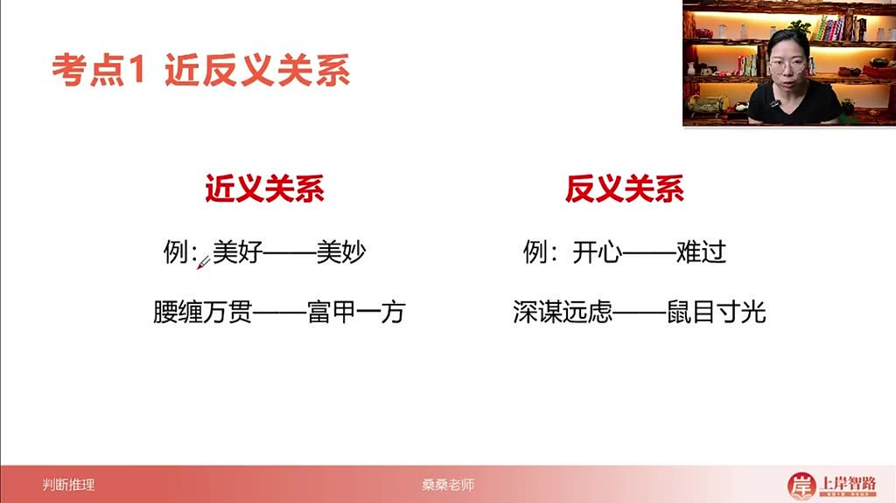
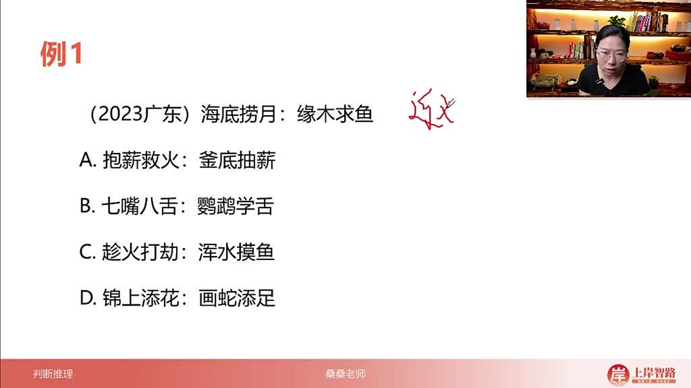
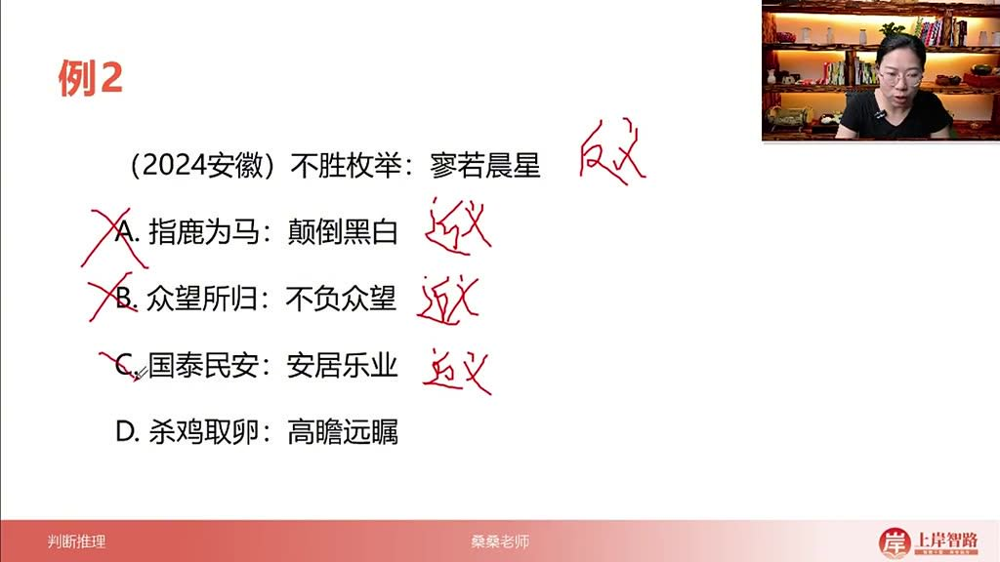
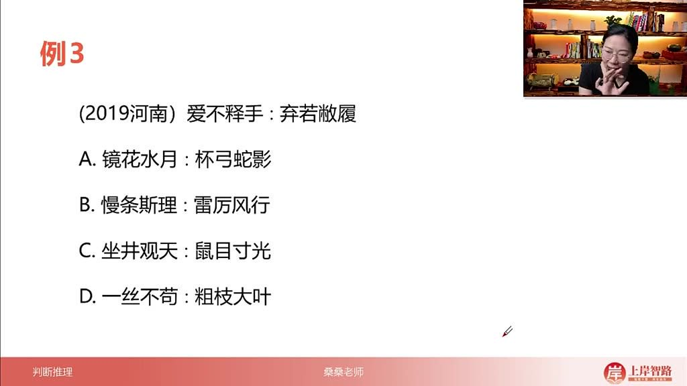
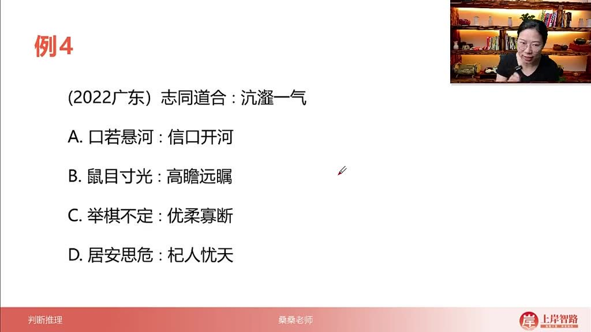
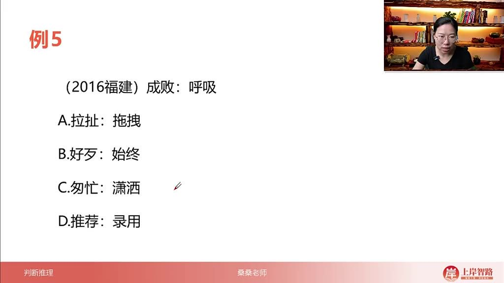
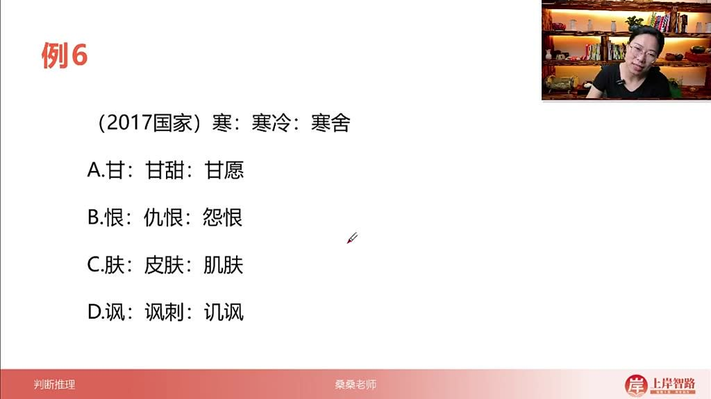
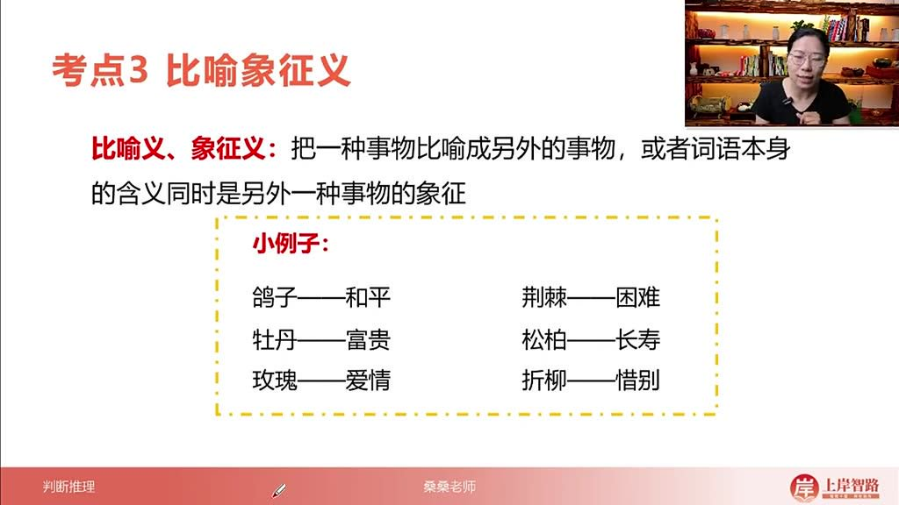
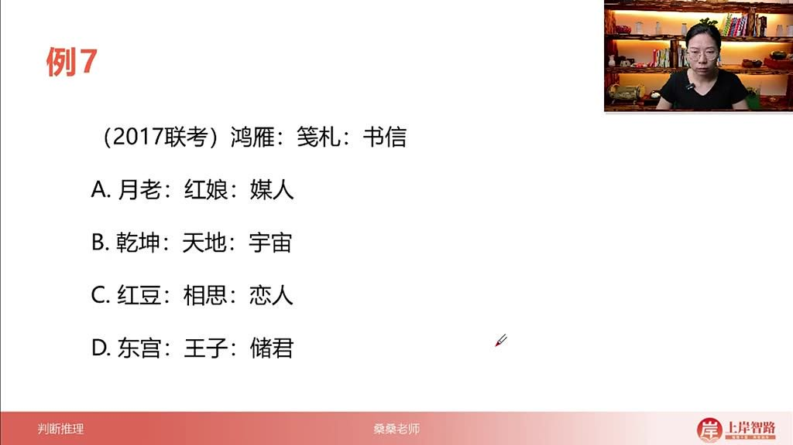

以下为AI生成的图文笔记的内容

#### 一、语义类 00:01

##### 1. 考点近反义关系 00:09

###### 1）近义关系 00:20

- 定义: 两个词语含义相近或相同

- 核心要点: 以词语成语积累为核心

- 典型例子

  :

  - 美好——美妙（都表示"好"）
  - 腰缠万贯——富甲一方（都表示"非常富有"）

- 解题技巧: 选项中需找一组近义关系的内容匹配

###### 2）反义关系 00:45

- 

- 定义: 两个词语含义相反或相对

- 典型例子

  :

  - 开心——难过（情绪对立）
  - 深谋远虑——鼠目寸光（前者考虑长远，后者目光短浅）

- 关键点: 需准确理解成语/词语的本义才能判断

###### 3）应用案例 01:14

- 例题:海底捞月与缘木求鱼关系

  - 

  - 题目解析

    :

    - 题干分析

      :

      - 海底捞月：水中捞月不可能实现→白费力气
      - 缘木求鱼：树上找鱼方向错误→白费力气
      - 两者为近义关系

    - 选项分析

      :

      - A项：抱薪救火（方法错误使问题扩大）vs釜底抽薪（根本解决）→反义
      - B项：七嘴八舌（人多口杂）vs鹦鹉学舌（模仿说话）→无关
      - C项：趁火打劫与浑水摸鱼都指趁乱谋利→近义
      - D项：锦上添花（使更好）vs画蛇添足（多余使坏）→无关

    - 答案: C

    - 易错点: 需准确掌握成语本义，否则无法判断

- 例题:不胜枚举与寥若晨星关系 

  05:13

  - 

  - 题目解析

    :

    - 题干分析

      :

      - 不胜枚举：多到无法列举→形容数量多
      - 寥若晨星：稀少如晨星→形容数量少
      - 两者为反义关系

    - 选项分析

      :

      - A项：指鹿为马与颠倒黑白都指混淆是非→近义
      - B项：众望所归与不负众望都指符合期望→近义
      - C项：国泰民安与安居乐业都指社会安定→近义
      - D项：杀鸡取卵（目光短浅）vs高瞻远瞩（目光长远）→反义

    - 答案: D

    - 技巧提示: 反义关系题目需注意程度对比

##### 2. 考点感情色彩及字词拆分 08:17

###### 1）感情色彩 08:42

- 分类

  :

  - 褒义词：表达赞扬肯定（如雪中送炭）
  - 贬义词：表达批评否定（如火上浇油）
  - 中性词：客观陈述无倾向

- 典型对比

  :

  - 如虎添翼（褒）vs为虎添翼（贬）：一字之差改变感情色彩

- 应用场景: 当近反义关系无法确定唯一答案时使用

###### 2）字词拆分 10:34

- 

- 拆分原则

  :

  - 将复合词拆解为单字分析关系
  - 如"成败"拆为"成"与"败"（反义）
  - "呼吸"拆为"呼"与"吸"（反义）

- 特殊考法

  :

  - 同字不同意：如"寒"在"寒冷"中表"冷"，在"寒舍"中表"穷"

###### 3）词语表达程度 11:55

- 特点: 仅适用于近义关系辨析

- 典型例子

  :

  - 讨厌→厌恶（程度加深）
  - 喜欢→热爱（程度加深）

- 考试频率: 出现较少，主要关注前两种辨析方式

###### 4）应用案例 12:46

- 例题:爱不释手与弃若敝履关系

  - 

  - 题目解析

    :

    - 题干分析

      :

      - 爱不释手（非常喜爱）vs弃若敝履（随意丢弃）
      - 基本关系：反义
      - 感情色彩：前褒后贬

    - 选项筛选

      :

      - 先排除非反义选项（A、C）
      - 剩余B、D均为反义
      - 二级辨析：D项"一丝不苟"（褒）vs"粗枝大叶"（贬）感情色彩匹配

    - 答案: D

    - 解题步骤: 先一级后二级辨析

- 例题:志同道合与沆瀣一气关系 

  16:53

  - 

  - 题目解析

    :

    - 题干分析

      :

      - 都描述"兴趣相投"
      - 志同道合（褒）：做好事
      - 沆瀣一气（贬）：做坏事

    - 选项分析

      :

      - A项：口若悬河（中性）vs信口开河（贬）→不完全匹配
      - D项：居安思危（褒）vs杞人忧天（贬）→模式相同

    - 答案: D

    - 关键点: 相同语义框架下的感情色彩对比

- 例题:成败与呼吸关系 

  21:02

  - 

  - 题目解析

    :

    - 题干特点: 整体无关联，拆分后单字反义

    - 选项分析

      :

      - B项："好歹"（好vs歹）、"始终"（始vs终）均为单字反义
      - 其他选项单字均为近义

    - 答案: B

    - 题型特征: 字词拆分题的典型代表

- 例题:寒舍的寒字含义 

  22:12

  - 

  - 题目解析

    :

    - 题干考点

      : 同字不同意

      - "寒"在"寒冷"中表温度低
      - 在"寒舍"中表经济条件差

    - 选项分析

      :

      - A项："甘"在"甘甜"中表甜味，在"甘愿"中表自愿
      - 其他选项均为同字同意

    - 答案: A

    - 记忆技巧: 多义词需要结合具体语境理解

##### 3. 考点比喻象征意义 25:07

###### 1）定义与示例 25:26

- 

- 核心概念：将一种事物比喻成另一种事物，或词语本身含义同时作为他物的象征

- 常见示例

  ：

  - 鸽子→和平
  - 荆棘→困难
  - 牡丹→富贵
  - 松柏→长寿
  - 玫瑰→爱情
  - 折柳→惜别

- 考查特点：题目难度通常基于生活常识，多涉及传统文化意象

###### 2）应用案例 26:04

- 例题解析

  - 

  - 题目分析

    ：

    - 题干关系：鸿雁、笺札均象征书信（双重比喻象征）

  - 选项辨析

    ：

    - A选项：月老、红娘→媒人（完全匹配题干逻辑）
    - B选项：乾坤→天地→宇宙（最后一级为包含关系非象征）
    - C选项：红豆→相思→恋人（末项非直接象征关系）
    - D选项：东宫→储君，但王子≠储君（概念范围错误）

  - 易错警示

    ：

    - 注意象征关系的严格对应（如王子与太子的区别）
    - 排除包含/衍生关系的干扰项

  - 正确答案：A

##### 4. 语义类总结 29:00

- 知识体系

  ：

  - 近义/反义关系（核心考点）
  - 二级辨析：感情色彩、字词拆分（高频考查点）

- 比喻象征特点：本质为常识性考查，需积累传统文化意象

#### 二、知识小结

| 知识点       | 核心内容                                                    | 考试重点/易混淆点                                            | 难度系数 |
| ------------ | ----------------------------------------------------------- | ------------------------------------------------------------ | -------- |
| 近反义关系   | 近义关系（如“美好”与“美妙”）、反义关系（如“开心”与“难过”）  | 区分近义与反义的逻辑（如“海底捞月”与“缘木求鱼”均为白费力气） | ⭐⭐       |
| 感情色彩     | 褒义词（如“雪中送炭”）、贬义词（如“火上浇油”）、中性词      | 同结构词语的感情色彩差异（如“如虎添翼”褒义 vs “为虎添翼”贬义） | ⭐⭐⭐      |
| 字词拆分     | 单字反义关系（如“成”与“败”、“呼”与“吸”）                    | 同字不同意（如“寒”在“寒冷”与“寒舍”中分别指“冷”和“穷”）       | ⭐⭐       |
| 比喻象征意义 | 具体事物象征抽象概念（如“鸽子”象征和平、“荆棘”象征困难）    | 易混淆象征（如“王子”≠“储君”，“东宫”专指太子）                | ⭐        |
| 二级辨析技巧 | 感情色彩、字词拆分、程度递进（如“讨厌”与“厌恶”为程度差异）  | 优先用感情色彩和字词拆分排除选项（如例题3通过褒贬义锁定答案） | ⭐⭐⭐      |
| 真题解析     | 例题1（近义关系）、例题2（反义关系）、例题3（感情色彩辨析） | 高频错误选项分析（如“指鹿为马”与“颠倒黑白”近义非反义）       | ⭐⭐       |