以下为AI生成的图文笔记的内容

#### 一、状语型要件 00:00

##### 1. 状语型要件概述 00:23

- 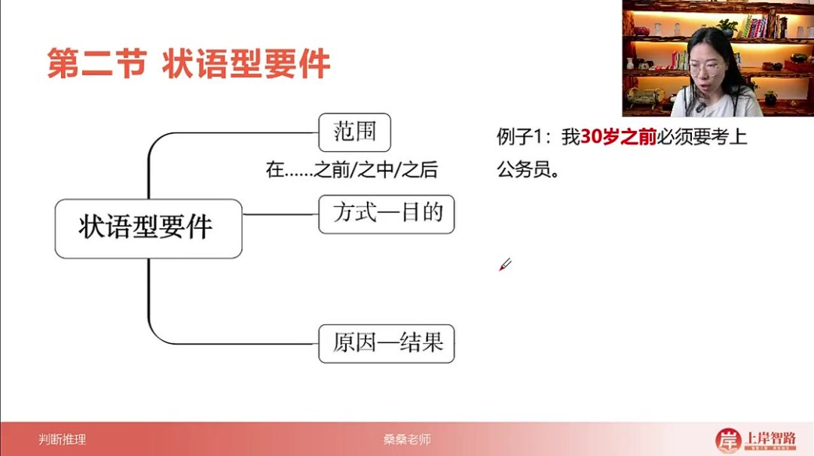
- 三大类型：范围型、方式-目的型、原因-结果型
- 核心特征：通过状语对主句内容进行限定或补充说明
- 关键词敏感度：需对各类状语的关键提示词保持高度敏感

###### 1）范围型要件

- 常见句式：在...之前/之中/之后
- 典型例子："我30岁之前必须要考上公务员"中"30岁之前"为时间范围限定
- 考察维度：包括时间范围（如考试截止前）、地点范围（如华东地区）、空间范围（如教室内）

###### 2）方式-目的型要件

- 高频特征：出现频率最高的状语型要件

- 标志结构："为了...而..."句式

- 复合方式：可能出现多个方式并列（如"通过A、B和C方法"）

- 实例解析

  ："考工之路就是为了上岸而每天努力学习的道路"中：

  - 目的要件："上岸"
  - 方式要件："每天努力学习"

###### 3）原因-结果型要件

- 关联词："因为...所以..."、"由于...导致..."

- 逻辑关系：前因后果的必然联系

- 示例分析

  ："学霸就是因为每天不断努力学习而导致学习成绩很好的人"中：

  - 原因要件："每天不断努力学习"
  - 结果要件："学习成绩很好"

##### 2. 范围要件专项训练 02:16

###### 1）例题：教研组肤色比较

- 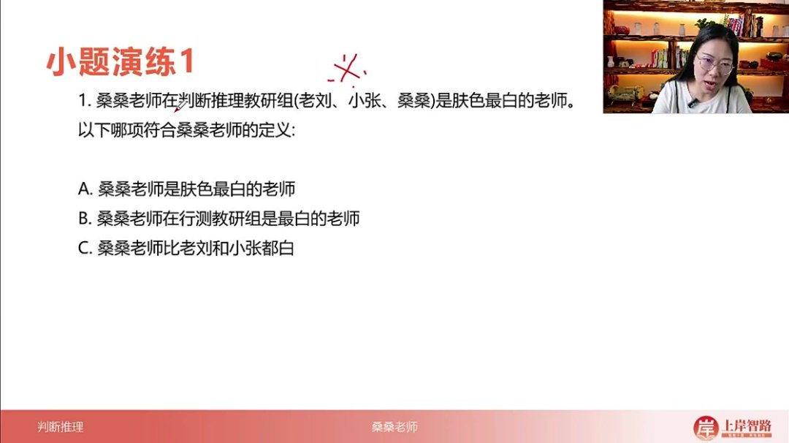
- 题目解析
  - 定义核心："在判断推理教研组（老刘、小张、桑桑）是肤色最白的老师"
  - 关键范围：限定在特定教研组内
  - 选项分析：
    - A项错误：扩大为无限制范围
    - B项错误：扩大到"行测教研组"（包含判断推理）
    - C项正确：严格限定在题干给定三人范围
  - 解题要点：范围扩大选项绝对不选

###### 2）例题：失败者定义判断

- 
- 题目解析
  - 定义结构："由于（原因）...而（结果）..."
  - 要件分解：
    - 原因要件：没有付出足够努力
    - 结果要件：输给另一方
  - 选项验证：
    - A项：原因不符（拉肚子≠不努力）
    - B项：完全匹配（没学判断推理→没考上）
    - C项：结果不符（被批评≠输给他人）
  - 易错警示：任一要件不满足即排除

###### 3）例题：减肥法定义判断

- 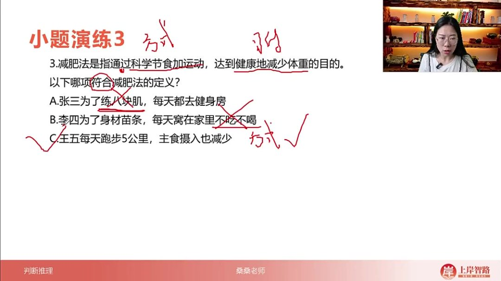

- 题目解析

  - 定义要素：

    - 方式要件：科学节食+运动
    - 目的要件：健康减重

  - 择优原则：

    - C项：仅方式正确（无目的描述）
    - 假设D项：方式目的均正确则优先选

  - 解题技巧

    ：

    - 全读选项比较
    - 选择要件匹配最多的选项

##### 3. 范围要件深度解析 09:30

- 四大类型

  ：

  - 时间范围（如季度考核期内）
  - 地点范围（如长三角地区）
  - 空间范围（如会议室里）
  - 重复出现的范围（需特别关注）

###### 1）典型例题分析 09:54

- 例题：前置审批
  - 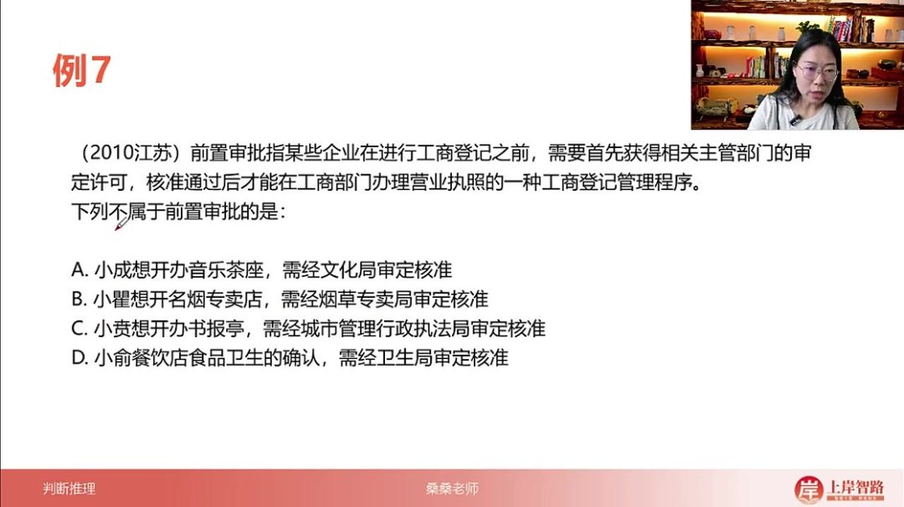
  - 题目解析
    - 核心范围："工商登记之前"
    - 选项鉴别：
      - ABC项："想开办"符合事前审批
      - D项："餐饮店卫生确认"属于事后监管
    - 特殊技巧：相似选项（ABC）往往都不是答案
- 例题：赤潮现象
  - 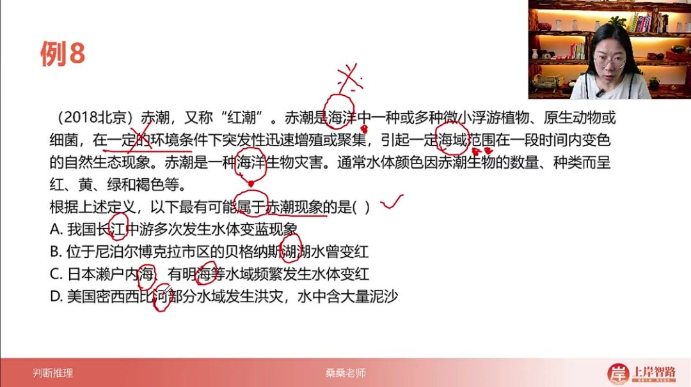
  - 题目解析
    - 三重范围提示："海洋中"、"海域范围"、"海洋生物"
    - 水域类型区分：
      - 江/河：线性流动水域
      - 湖：封闭几何水域
      - 海：近陆洋面
    - 答案锁定：C项明确提及"海"水域
- 例题：即兴能力
  - 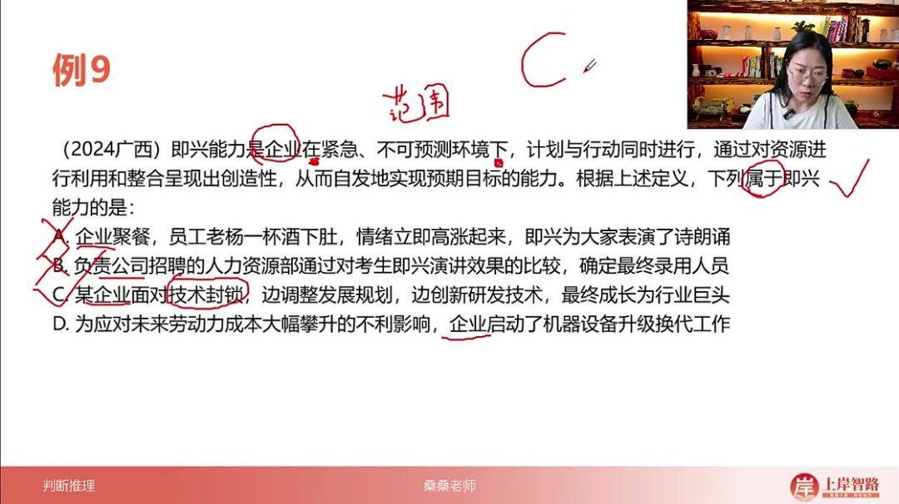
  - 题目解析
    - 关键范围："紧急、不可预测环境"
    - 选项验证：
      - A项：聚餐娱乐不符合
      - B项：招聘流程可预测
      - C项：技术封锁符合紧急不可预测
      - D项：未来规划可预测
    - 易错点：注意"未来"与"紧急"的矛盾性

##### 4. 方式目的 21:08

- 

- 高频考点：在考试中出现频次极高，约70%-80%的题目会考察该知识点

- 识别特征：通过"通过...达到..."、"为了...采取..."、"根据...利用..."等固定句式表达

- 核心结构

  ：包含方式（手段）和目的（结果）两个要件，常见表达形式包括：

  - 通过......；达到......的目的
  - 使得......
  - 为了......；采取......的方式
  - 旨在......
  - 根据......
  - 以......为目的
  - 利用......

###### 1）例题：除法报价策略判断 21:57

- 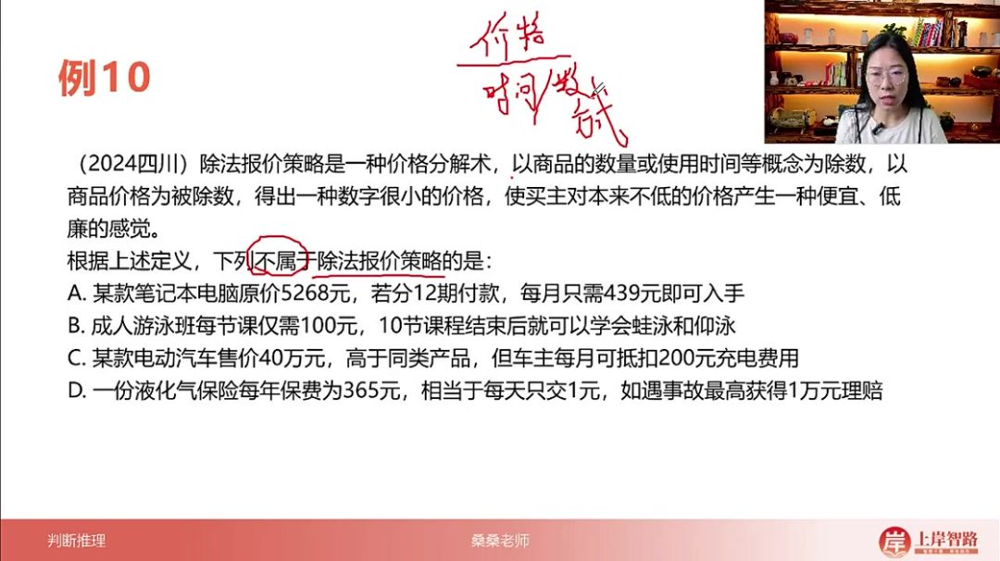

- 题目解析

  - 定义分析

    ：

    - 方式：将商品价格（被除数）除以数量/使用时间（除数）
    - 目的：使高价商品产生便宜错觉

  - 选项分析

    ：

    - A选项：5268元÷12期=439元/月（符合）
    - B选项：总价1000元÷10节=100元/节（符合）
    - C选项：40万仅抵扣200元（未使用除法计算）
    - D选项：365元÷365天=1元/天（符合）

  - 易错点：容易被"仅需""相当于"等诱导词迷惑，忽略实际总价

  - 答案：C

###### 2）例题：无意识代偿判断 27:12

- 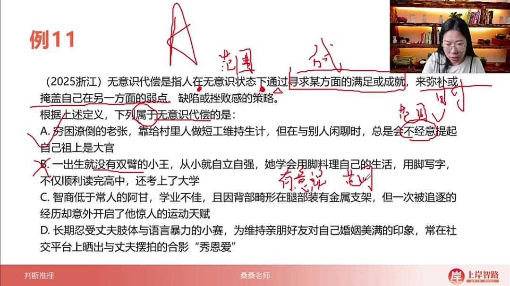

- 题目解析

  - 要件分析

    ：

    - 范围：无意识状态
    - 方式：寻求某方面满足
    - 目的：弥补其他缺陷

  - 选项分析

    ：

    - A选项：老张"不经意"提祖上荣耀（完全匹配）
    - B选项：有意识地用脚代偿（范围不符）
    - C选项："意外"发现天赋（属偶然非无意识）
    - D选项：刻意维持表面美满（方式目的均不符）

  - 解题技巧：注意程度副词（总是/经常）与状态描述（不经意/意外）

  - 答案：A

###### 3）例题：信息腐败判断 32:24

- 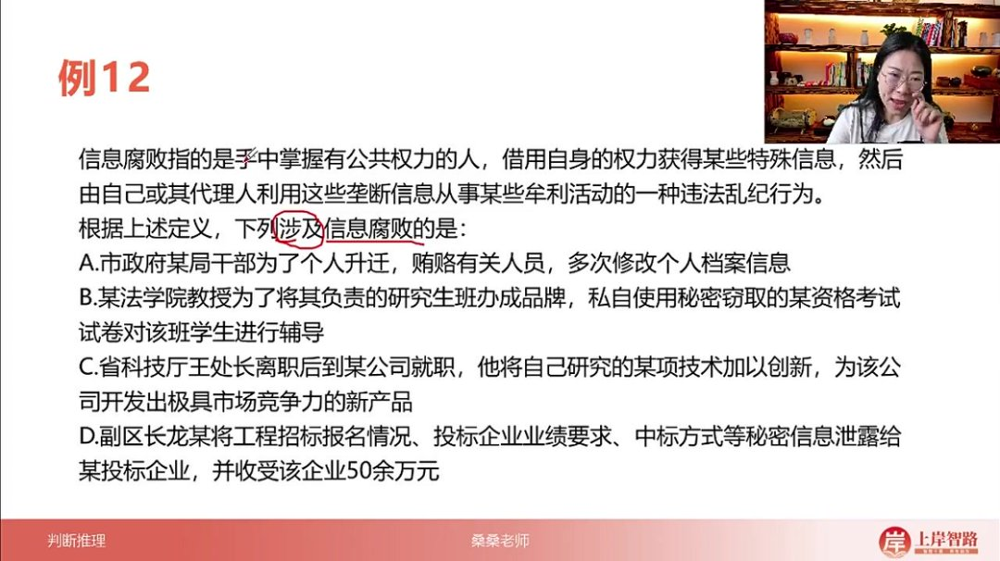

- 题目解析

  - 要件分析

    ：

    - 主体：公职人员
    - 方式：利用职权获取垄断信息
    - 目的：从事牟利活动
    - 属性：违法乱纪行为

  - 选项分析

    ：

    - A选项：贿赂修改档案（方式不符）
    - B选项：窃取试卷（非权力获得）
    - C选项：离职后创新（非违法）
    - D选项：泄露招标信息收贿（完全匹配）

  - 关键区分：注意"利用职权获取"与"窃取/贿赂获取"的本质区别

  - 答案：D

- 综合解题方法

  ：

  - 先标注题干所有要件（范围/方式/目的等）
  - 采用排除法，任一要件不符即排除
  - 状语型要件通常较长，需重点分析动作关系
  - 注意属概念（如"违法乱纪行为"）的限定作用

##### 5. 原因结果 37:53

- 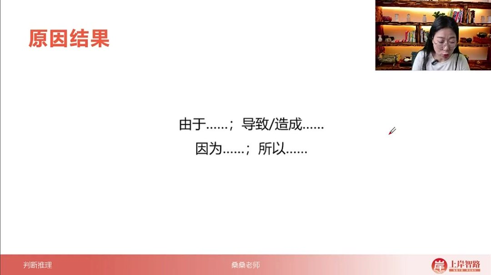
- 表达形式：常用"由于......；导致/造成......"或"因为......；所以......"的句式表示因果关系
- 解题特点：涉及原因结果的题目相对简单，通过常识也能解答，是考试中必须拿分的题型

###### 1）例题：人为环境异常定义 38:07

- 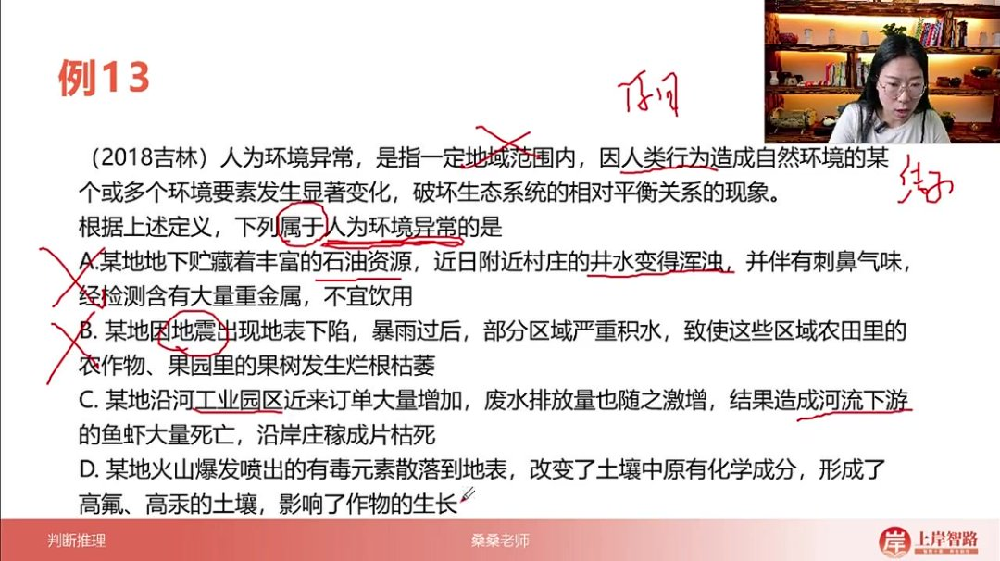

- 题目解析

  - 定义要点

    ：

    - 原因：人类行为
    - 结果：自然环境要素显著变化，破坏生态平衡

  - 选项分析

    ：

    - A选项：石油资源导致井水污染（自然原因，排除）
    - B选项：地震导致农作物枯萎（自然原因，排除）
    - C选项：工业园区废水排放导致生态破坏（人为原因，正确）
    - D选项：火山爆发导致土壤污染（自然原因，排除）

  - 解题技巧：通过"人为环境异常"这个被定义概念本身就能判断原因（人为）和结果（环境异常）

  - 答案：C

###### 2）例题：认识性好奇心定义 41:13

- 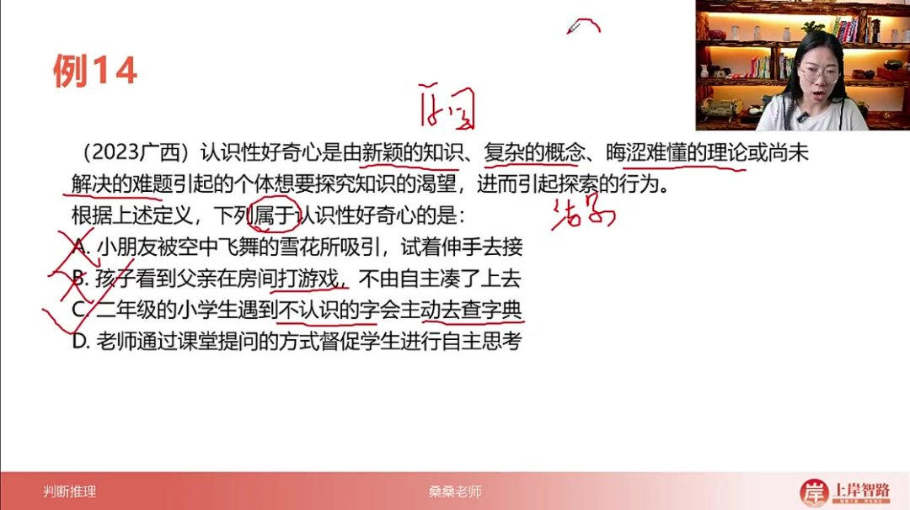

- 题目解析

  - 定义要点

    ：

    - 原因：新颖知识/复杂概念/晦涩理论/未解难题
    - 结果：产生探究渴望并引发探索行为

  - 选项分析

    ：

    - A选项：被雪花吸引（非知识性原因，排除）
    - B选项：看父亲打游戏（非知识性原因，排除）
    - C选项：查不认识的字（新颖知识引发探索行为，正确）
    - D选项：老师提问（非学生自发探索，排除）

  - 解题技巧：抓住"认识性"这个关键词，排除非知识性诱因的选项

  - 答案：C

###### 3）例题：角误差定义 43:35

- 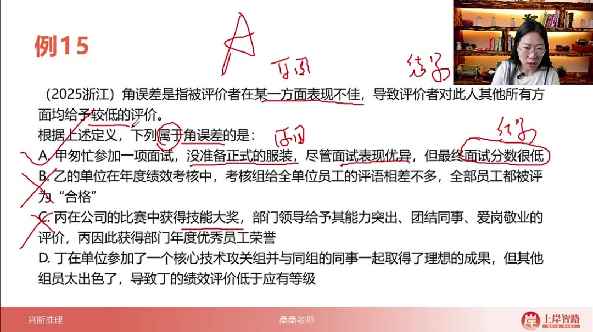

- 题目解析

  - 定义要点

    ：

    - 原因：某一方面表现不佳
    - 结果：其他方面均被低估

  - 选项分析

    ：

    - A选项：未穿正装导致面试分数低（单方面影响整体评价，正确）
    - B选项：全员评为合格（无具体原因结果关系，排除）
    - C选项：获奖获得好评（正向评价，排除）
    - D选项：因同事出色被低估（非自身原因，排除）

  - 实际应用：公务员面试需注意着装，避免因小失大

  - 答案：A

- 总结

  ：

  - 解题关键：明确区分原因和结果两个要件
  - 技巧：通过被定义概念本身往往就能判断因果关系
  - 注意事项：排除自然原因、非知识性原因、非自身原因等干扰项

#### 二、状语型要件分类总结 47:02

- 

##### 1. 范围要件

- 典型结构: 包含"在...之中/之上/之下/之前/之后"等方位词构成的短语
- 示例说明: 如"在考试过程中"、"在课堂结束后"等都属于典型的范围状语要件

##### 2. 方式目的要件

- 考查频率: 在各类考试中出现频次最高
- 识别特征: 通常表达行为实施的方式或目的，如"通过努力学习"、"为了取得好成绩"等结构

##### 3. 原因结果要件

- 难度特点: 考题相对简单，容易识别
- 典型结构: 包含因果关系词如"因为...所以..."、"由于...因此..."等连接词

##### 4. 解题要点

- 标记技巧: 做题时应清晰勾画出题干中的各类要件型内容
- 选项匹配: 注意将识别出的要件与选项进行对应匹配，确保选出符合逻辑的正确答案

#### 三、知识小结

| 知识点       | 核心内容                                                     | 考试重点/易混淆点                                            | 难度系数 |
| ------------ | ------------------------------------------------------------ | ------------------------------------------------------------ | -------- |
| 状语型要件   | 状语在考试中主要考察三类：范围、方式目的、原因结果           | 范围要件（时间/地点/空间）的迷惑性较强，需重点关注重复出现的范围词汇 | ⭐⭐       |
| 范围要件     | 通过“在...之前/之中/之后”等句式限定，如例题7（前置审批）强调“工商登记前”的时间范围 | 选项对比时需警惕范围扩大（如例题7的4D选项“已开业”不符合前置条件） | ⭐⭐       |
| 方式目的要件 | 高频考点，形式多样：通过/为了/利用...方式达到...目的（如例题11“无意识代偿”需同时满足无意识状态、方式、目的三要件） | 例题12除法报价策略：价格÷数量/时间→制造低价错觉，需匹配“公式化方式”与“牟利目的” | ⭐⭐⭐      |
| 原因结果要件 | 结构简单：因A导致B（如例题13“人为环境异常”=人类行为→环境破坏；例题15“角误差”=某方面差评→全面低分） | 例题14认识性好奇心：新颖知识→探索行为，需区分单纯现象吸引（如雪花）与知识探究（查生字） | ⭐        |
| 解题技巧     | 1. 多要件题目需全匹配（如例题11的A选项同时满足无意识、弥补缺陷）2. 择优选择：当选项部分正确时选最贴合项（如例题10减肥法优选“方式+目的”全对的4D） | 易错点：忽略属概念（如例题12信息腐败需满足“违法乱纪”属性，排除C选项合法离职） | ⭐⭐       |