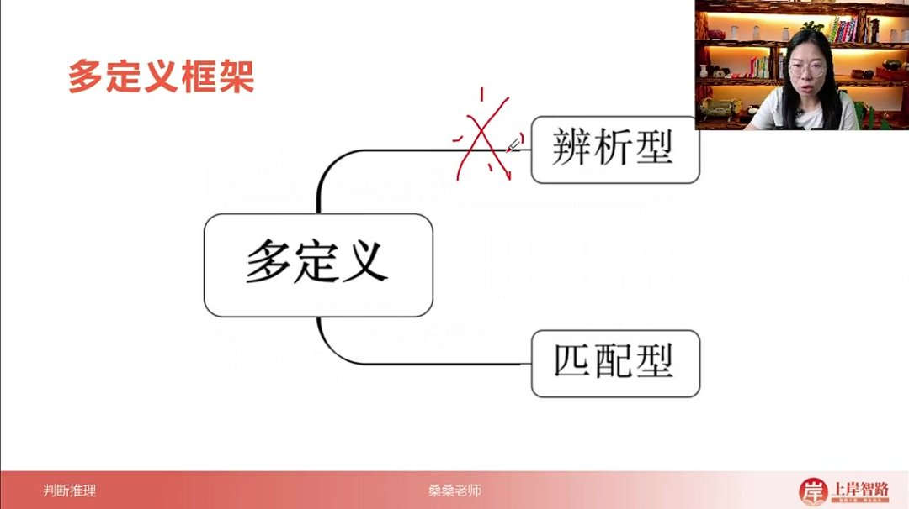
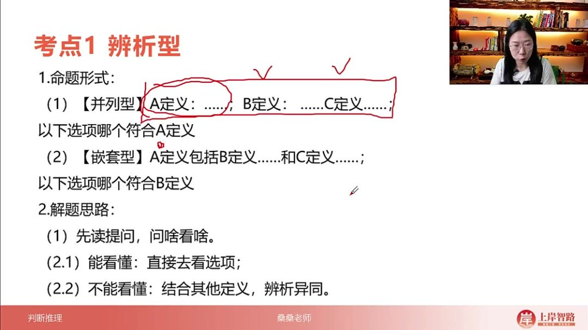
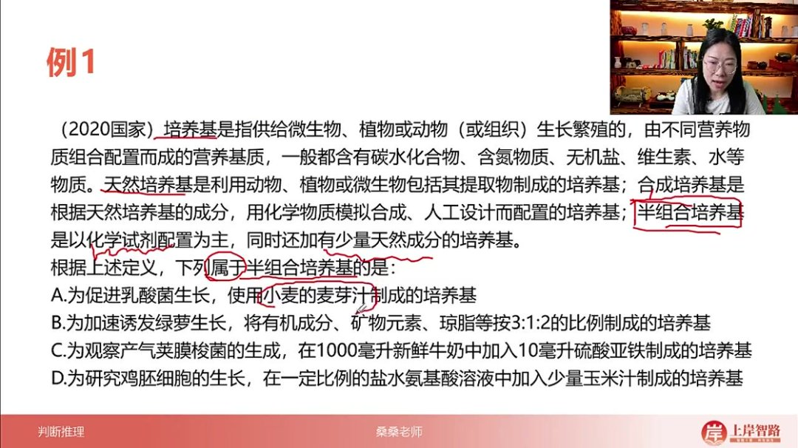
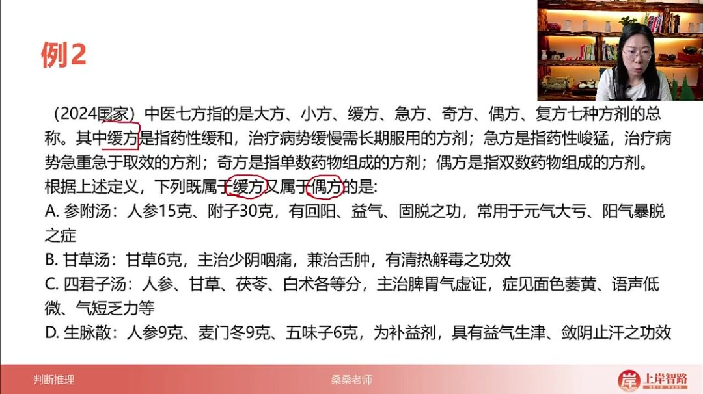
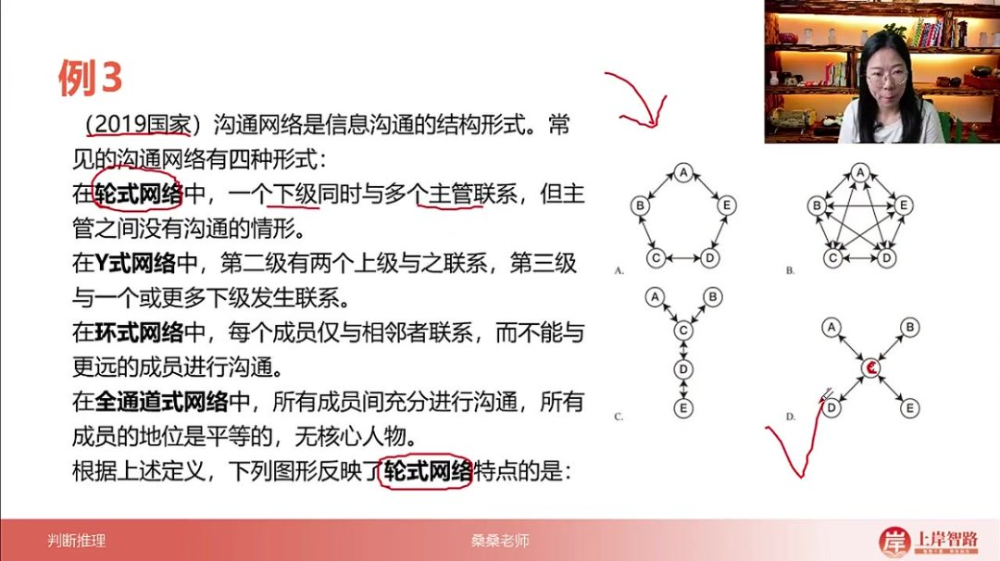
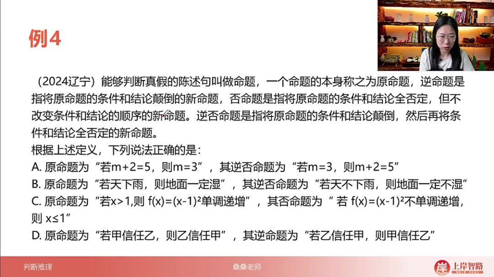
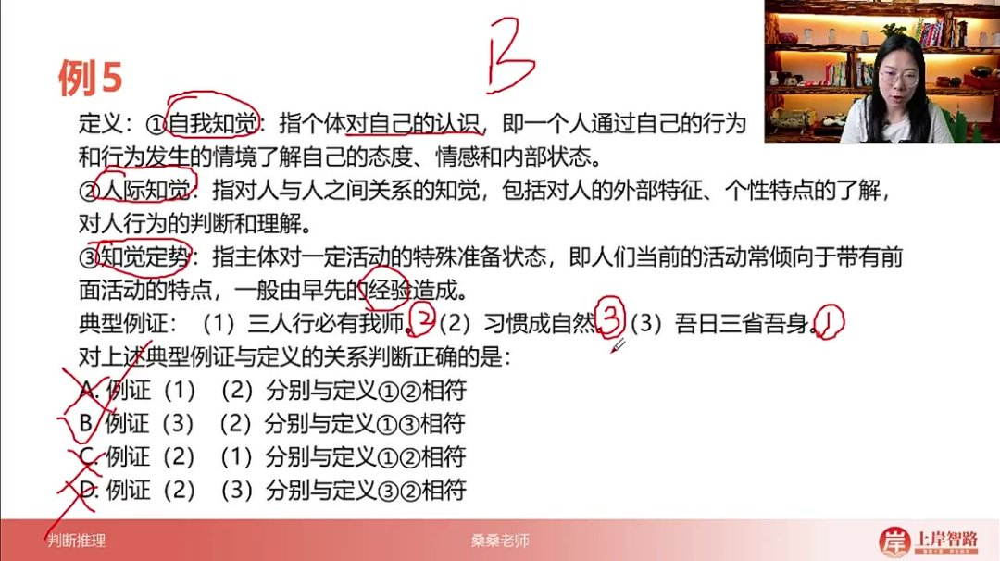

以下为AI生成的图文笔记的内容

#### 一、多定义 00:14

##### 1. 考点一辨析型 00:30

###### 1）命题形式 00:36

- 
- 两大类型：根据题干样式分为辨析型和匹配型，其中辨析型为考试重点
- 并列型：A定义：...；B定义：...；C定义...；提问"以下选项哪个符合A定义"
- 嵌套型：A定义包括B定义...和C定义...；提问"以下选项哪个符合B定义"

###### 2）解题思路 01:04

- 

- 核心原则：问啥看啥，精准定位

- 步骤一：先读提问，明确考查定义

- 步骤二

  ：

  - 直接解法：能看懂考查定义时直接看选项
  - 辅助解法：看不懂时结合其他定义辨析异同

- 优势分析：相比单定义，多定义实际阅读量更少（300字分3定义vs单定义200字），且可通过其他定义辅助理解

###### 3）应用案例 03:18

- 例题:半组合培养基判断

  - 

  - 题目解析

    - 关键定义：半组合培养基=化学试剂为主+少量天然成分

    - 选项分析

      ：

      - A：纯天然成分（小麦麦芽汁）→排除
      - B：无化学试剂（有机成分+矿物元素）→排除
      - C：天然为主（鲜牛奶）+少量化学（硫酸亚铁）→顺序反→排除
      - D：化学为主（盐水氨基酸）+天然辅料（玉米汁）→符合

    - 答案：D

    - 技巧：仅需阅读考查定义（22字），无需通读全题（约150字）

- 例题:缓方偶方定义判断 

  06:14

  - 

  - 题目解析

    - 双重要求：需同时满足缓方（药性缓和/病势缓慢）和偶方（双数药物）

    - 选项分析

      ：

      - A：2药（偶方）但"元气大亏、阳气暴脱"不符缓方→排除
      - B：1药（非偶方）→直接排除
      - C：4药（偶方）+主治"脾胃气虚"（缓慢病症）→符合
      - D：3药（非偶方）→排除

    - 答案：C

    - 易错点：需注意病势描述词（如"暴脱"vs"萎黄"）的强度差异

- 例题:轮式网络定义判断 

  09:24

  - 

  - 题目解析

    - 定义特征：一个下级连多个主管，主管间无连接

    - 图形匹配：D选项（中心点连接外围四点且外围无连接）

    - 扩展验证

      ：

      - Y式→C（二级两上级，三级多下级）
      - 环式→A（相邻连接）
      - 全通道→B（全员互联）

    - 答案：D

    - 趋势说明：图片型定义近年难度降低，可大胆作答

- 例题:命题定义判断 

  12:17

  - 

  - 题目解析

    - 四类命题

      ：

      - 原命题：初始陈述
      - 逆命题：条件结论互换
      - 否命题：条件结论全否定（顺序不变）
      - 逆否命题：互换+全否定

    - 选项分析

      ：

      - A：逆否命题缺少否定→错误
      - B：实际是否命题→错误
      - C：实为逆否命题→错误
      - D：正确执行"若甲→乙"→"若乙→甲"的互换

    - 答案：D

    - 背景提示：该知识点与高中数学、逻辑学内容有交叉

##### 2. 考点二匹配型 15:35

###### 1）例题:定义与例证匹配 16:50

- 

- 题目解析

  - 定义梳理

    ：

    - 自我知觉：个体自我认知（例证3"吾日三省吾身"）
    - 人际知觉：人际关系认知（例证1"三人行必有我师"）
    - 知觉定势：经验形成的准备状态（例证2"习惯成自然"）

  - 选项验证

    ：

    - B项：例证3→定义①，例证2→定义③→唯一正确

  - 答案：B

  - 题型特点：阅读量大（需读3定义+3例证），需注意问题问法（正确/不正确）

#### 二、知识小结

| 知识点                 | 核心内容                                                     | 考试重点/易混淆点                                            | 难度系数 |
| ---------------------- | ------------------------------------------------------------ | ------------------------------------------------------------ | -------- |
| 多定义辨析型           | 分为并列型和嵌套型（总分型），解题方法：问啥看啥，优先阅读提问关键词，再结合其他定义辅助理解 | 区分并列型（多个独立定义）和嵌套型（总-分结构）              | ⭐⭐       |
| 半组合培养基（例题一） | 以化学试剂为主，少量天然成分为辅的培养基                     | 天然培养基（纯天然成分） vs. 合成培养基（纯化学试剂） vs. 半组合培养基（混合型） | ⭐⭐       |
| 缓方与偶方（例题二）   | - 缓方：药性缓和，治疗缓慢病势- 偶方：双数药物组成           | 偶方仅关注药物数量，缓方关注药性与病势                       | ⭐⭐⭐      |
| 轮式网络（例题三）     | 一个下级与多个主管联系，主管间无沟通                         | 对比：Y式（分层沟通）、环式（相邻沟通）、全通式（全员互联）  | ⭐⭐       |
| 命题类型（例题四）     | - 原命题：陈述句本身- 逆命题：条件结论颠倒- 否命题：条件结论全否定- 逆否命题：既颠倒又否定 | 逆否命题与原命题逻辑等价，需同时满足位置互换+双重否定        | ⭐⭐⭐⭐     |
| 多定义匹配型           | 题干提供多个定义+多个例证，需逐一匹配（阅读量大）            | 注意问题陷阱（如“不正确”或“数目匹配”）                       | ⭐⭐⭐⭐     |
| 解题技巧总结           | - 优先阅读提问关键词- 单定义看不懂时可借助其他定义辅助- 图片型定义近年趋简单，可大胆解题 | 多定义实际阅读量可能少于单定义                               | ⭐⭐       |

|      |      |      |      |
| ---- | ---- | ---- | ---- |
|      |      |      |      |
|      |      |      |      |
|      |      |      |      |
|      |      |      |      |
|      |      |      |      |
|      |      |      |      |
|      |      |      |      |