以下为AI生成的图文笔记的内容

#### 一、判断推理 00:04

##### 1. 题型识别

- 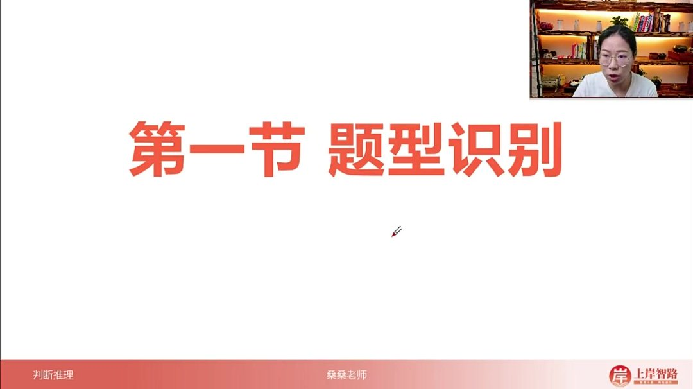
- 核心特征：论证题目在考试中具有明确的提问形式，主要通过"加强"或"削弱"两类问法进行识别
- 生活化理解：类似辩论赛的正反方，加强相当于"夸夸团"，削弱相当于"怼怼团"

###### 1）加强

- 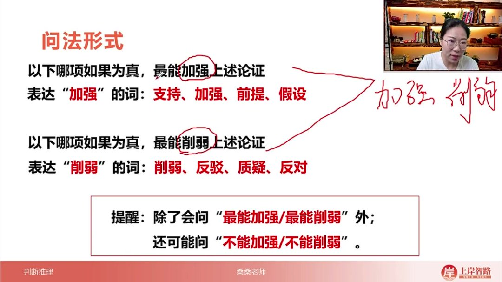
- 典型问法："以下哪项如果为真，最能加强上述论证"
- 同义表述：支持、前提、假设、必要条件等词语都属加强题型
- 特殊变体：可能出现"不能加强"的问法，此时需选择三个能加强选项中唯一不能的选项
- 解题技巧：养成全读选项习惯，除非出现明显最佳选项，否则需比较择优

###### 2）削弱

- 典型问法："以下哪项如果为真，最能削弱上述论证"
- 同义表述：反驳、质疑、反对等词语都属削弱题型
- 特殊变体：可能出现"不能削弱"的问法，需反向选择
- 注意事项：需特别注意提问中的否定词，避免因审题不清失分

###### 3）例题：论证作用分析

- 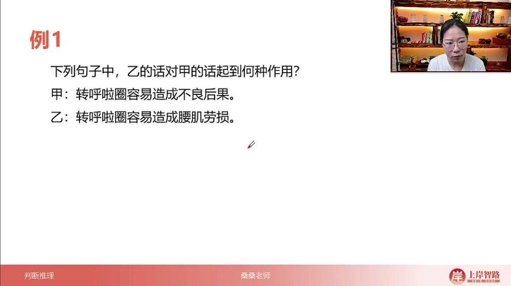
- 题目解析
  - 加强示例：甲说"转呼啦圈容易造成不良后果"，乙补充"容易造成腰肌劳损"→通过具体实例具象化论点，属于典型加强
  - 削弱示例：甲说"常吃巧克力可以降低中风风险"，乙反驳"两者没有关系"→直接切断论点中的因果关系，属于典型削弱
  - 生活类比：加强如同为观点提供证据支持，削弱如同反驳对方论点的合理性

##### 2. 论证三要素

- 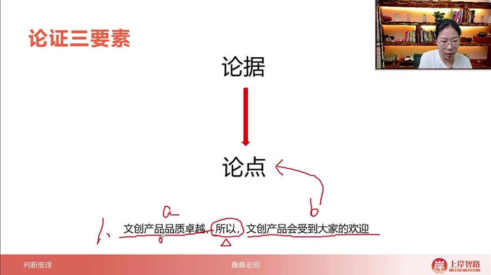

- 论点：结论性表述，常用"所以""因此""由此可见"等词引导，如"文创产品会受到大家的欢迎"

- 论据：支持论点的依据，包括数据、事例、对比实验等，如"文创产品品质卓越"

- 论证：连接论据与论点的逻辑过程，属于隐含要素

- 阅读策略

  ：

  - 论点必须重点分析，是解题核心
  - 论据视情况略读：当与论点话题一致时可忽略，不一致时需简要关注
  - 论证方法需要自主判断，决定加强/削弱的具体方式

##### 3. 题干分析 05:24

###### 1）论证三要素 05:28

- 例题:削弱题目分析 

  08:40

  - 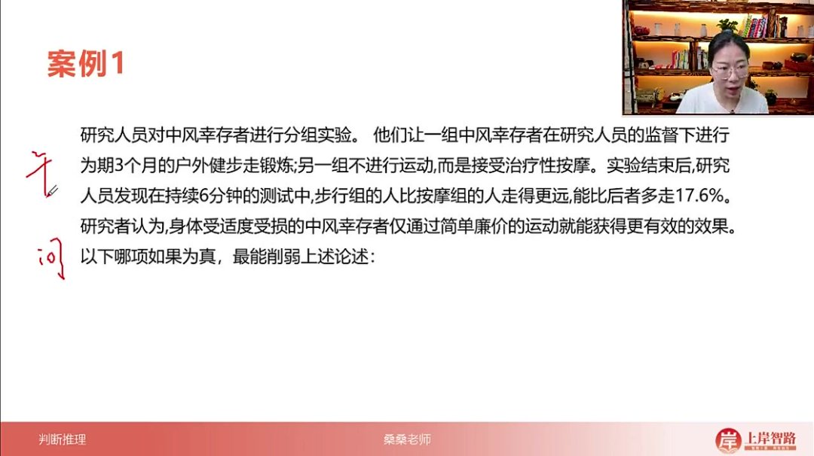
  - 审题方法：先看提问再看题干，通过提问判断题型（如削弱题）
  - 论点识别：关注结论性词汇（如"研究者认为"），最后一句为论点"身体适度受损的中风幸存者仅通过简单廉价的运动就能获得更有效的效果"
  - 论据特征：前三句均为实验过程描述（分组方式、干预措施、测试结果），共同支撑论点
  - 关键词提取：重点关注主体（中风幸存者）和核心关系（运动与效果）

- 例题:加强题目分析 

  12:25

  - 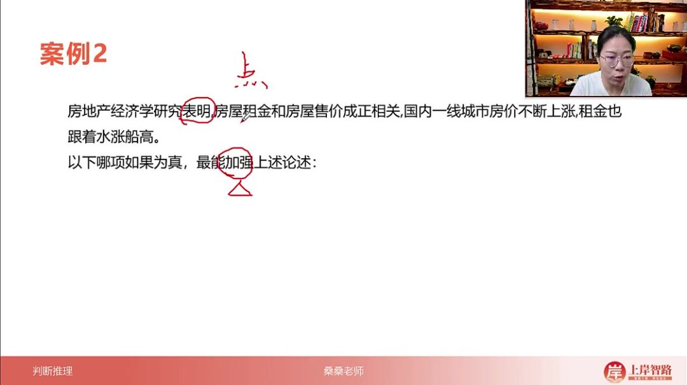
  - 题型判断：通过"最能加强"明确为加强题
  - 论点解析：首句"研究表明"引出核心论点"房屋租金和售价成正相关"
  - 论据处理：后续内容可作为补充论据（实例说明）或并入论点，两种处理方式均可
  - 核心要素：必须抓住"租金-售价"的关联性，此为解题关键

- 例题:不支持题目分析 

  14:33

  - 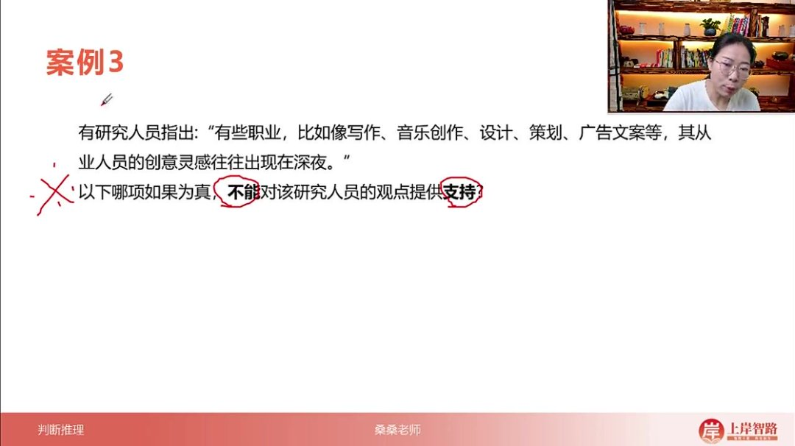
  - 提问陷阱：特别注意"不能...提供支持"的否定式提问
  - 论点定位：通过"研究人员指出"直接锁定观点"某些职业从业者的创意灵感常出现在深夜"
  - 关键词筛选：忽略举例部分（如写作、音乐创作等），聚焦"从业人员-创意灵感-深夜"的三角关系
  - 审题警示：题干与提问出现矛盾表述（如题干说支持但提问要求不支持）时需高度警惕

- 例题:论点论据区分 

  17:25

  - 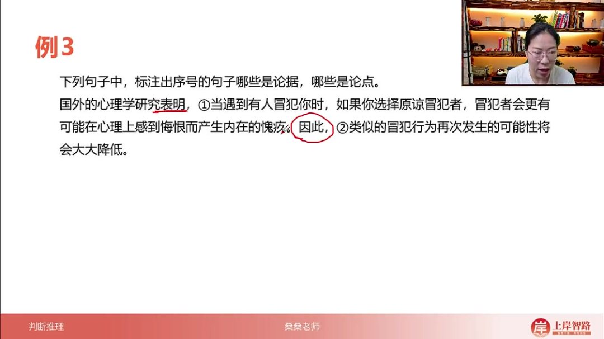
  - 结构分析：采用"研究表明...因此..."的典型论证结构
  - 论据特征：①号句描述具体情境（原谅冒犯者导致其产生愧疚）
  - 论点标志：②号句含"因此"结论词，阐述行为结果（冒犯行为复发率降低）
  - 因果关系：论据为因（心理机制），论点为果（行为表现），二者需完整理解

- 例题:论点论据区分 

  19:34

  - 论点与论据的识别方法
    - 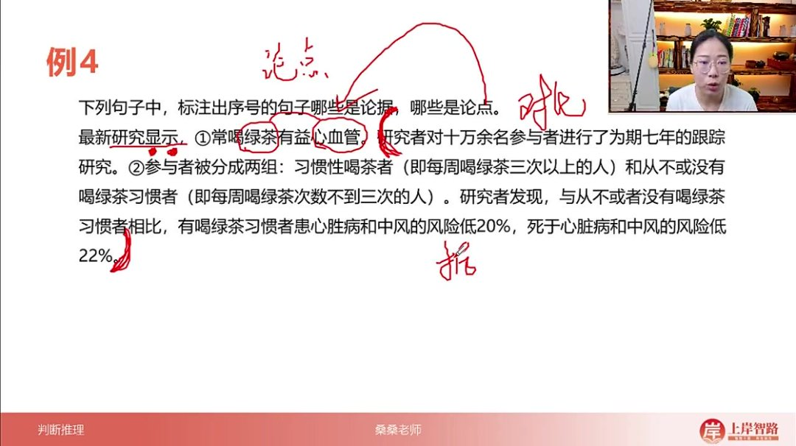
    - 论点特征：通常表现为观点性陈述，如"常喝绿茶有益心血管"，这类句子直接表达某种判断或结论。
    - 论据特征：多为事实性陈述或研究数据，如"研究者对十万余名参与者进行七年跟踪研究"，这类内容用于支撑论点。
    - 实验类论据：对比实验（如将参与者分为喝茶组与不喝茶组）及其结果（风险降低20%-22%）都属于典型论据，目的是证明论点成立。
    - 判断技巧：当出现"研究显示"等提示词时，其后内容多为论点；而具体研究过程、数据则属于论据范畴。

- 例题:写出题目论点 

  22:23

  - 论点提炼方法
    - 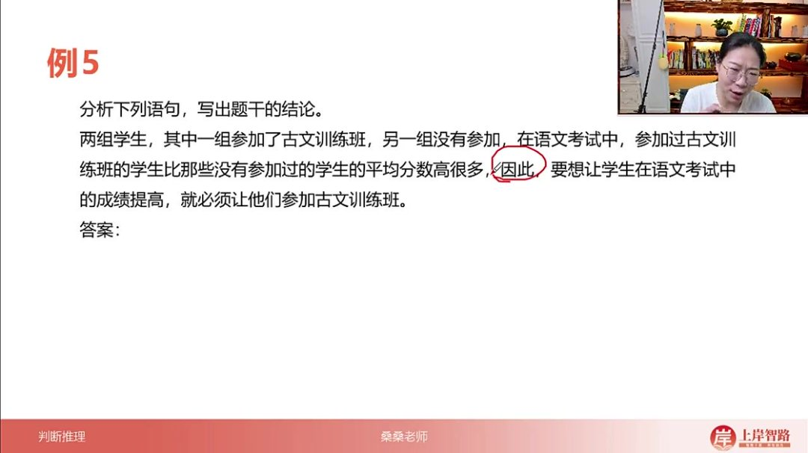
    - 结论词定位：注意"因此"等结论性词汇，其后内容往往就是论点核心。
    - 关键词提取：需要抓住题干中的核心概念（如"古文训练班"和"语文成绩"），建立因果关系。
    - 因果关系构建：将实验组（参加训练班）与对照组（未参加）的分数差异转化为"参加训练班→成绩提高"的明确论点。
    - 论据识别：实验设计部分（分组情况、分数对比）属于论据内容，不应包含在最终提炼的论点中。

- 例题：写出题目论点 

  24:09

  - 例题六：肌肉锻炼与免疫力关系分析

    - 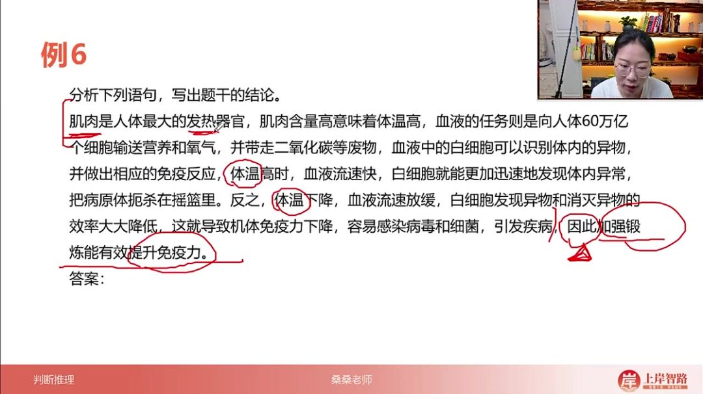

    - 题目解析

      - 论点提取：加强锻炼能有效提升免疫力

      - 论证结构

        ：

        - 核心逻辑链：肌肉含量→体温→血液流速→白细胞效率→免疫力
        - 正向论证：肌肉含量高→体温高→血液流速快→白细胞效率高→免疫力强
        - 反向论证：体温下降→血液流速放缓→白细胞效率降低→免疫力下降

      - 论据分析

        ：

        - 生理机制：肌肉是人体最大发热器官，血液输送营养并含免疫细胞
        - 数据支撑：人体有60万亿个细胞需要血液供给
        - 对比论证：通过体温高/低两种状态的免疫效果对比强化论点

      - 答案：加强锻炼能有效提升免疫力

      - 解题技巧

        ：

        - 论点定位：关注结论性表述（"因此"等提示词）
        - 论据筛选：专业描述最终都服务于核心论点
        - 概念关联：需理清"锻炼-肌肉-体温-免疫力"的递进关系

  - 论点与论据关系总结

    - 核心要点

      ：

      - 论点特征：简洁明确（通常为两个核心概念的因果关系）
      - 论据作用：通过专业细节和正反对比支撑论点可信度

    - 应用方法

      ：

      - 一致性处理：当论据与论点话题完全一致时，可重点关注论点
      - 差异性处理：当存在概念转换时（如例题中的肌肉→体温→免疫力），需完整分析逻辑链条

    - 易错警示

      ：

      - 避免被专业术语干扰而忽略论证主线
      - 注意区分事实陈述（如"白细胞识别异物"）与观点结论

#### 二、知识小结

| 知识点       | 核心内容                                                     | 考试重点/易混淆点                            | 难度系数 |
| ------------ | ------------------------------------------------------------ | -------------------------------------------- | -------- |
| 论证题型识别 | 通过提问判断题型（加强/削弱），常见提问形式包括“最能加强”“最能削弱”“不能支持”等 | “不能加强/削弱”类陷阱题（需反向选择）        | ⭐⭐       |
| 论证三要素   | 论点（结论）、论据（支持依据）、论证（逻辑过程）             | 论点优先级＞论据，论据话题不一致时需额外关注 | ⭐⭐       |
| 论点定位技巧 | 标志词：因此/所以/由此可见/研究表明/认为；核心关注主体+关键词关联（如“运动→效果”） | 长题干中实验数据类内容多为论据               | ⭐⭐⭐      |
| 加强类题目   | 支持方式：举例具象化（如“腰肌劳损”证明“不良后果”）、建立因果关系 | 相似表述：支持/前提/假设/必要条件            | ⭐⭐       |
| 削弱类题目   | 反驳方式：切断关联（如“巧克力与中风无关”）、否定论据         | 相似表述：质疑/反对/反驳核心逻辑             | ⭐⭐⭐      |
| 对比实验分析 | 分组结果（如“健步走组vs按摩组”）作为论据支持论点             | 混淆论据与论点（实验过程≠结论）              | ⭐⭐⭐⭐     |
| 易错点提醒   | 1. 必须先看提问避免“不能”类陷阱2. 选项需全读比较择优（除非绝对正确项） | “最”字题需对比强度                           | ⭐⭐⭐⭐     |