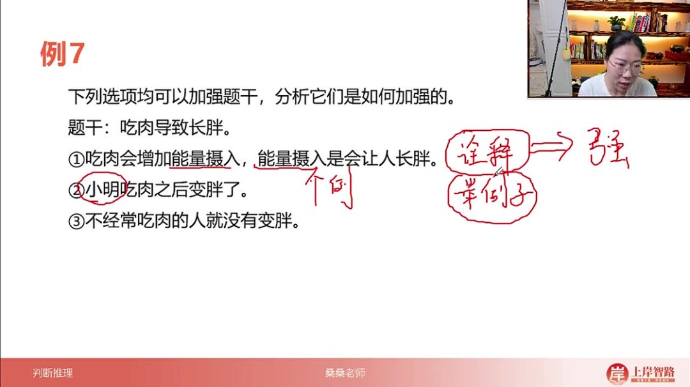
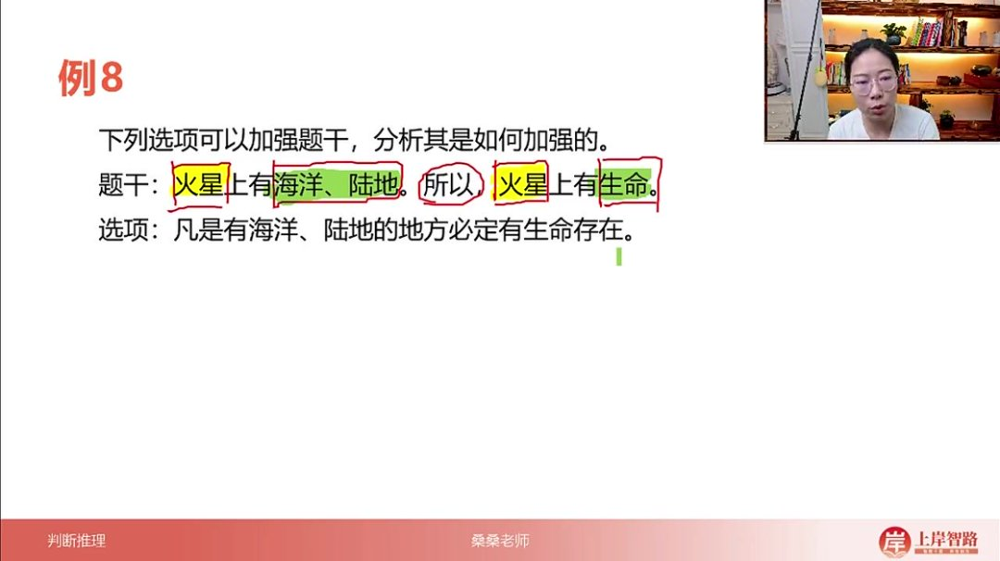
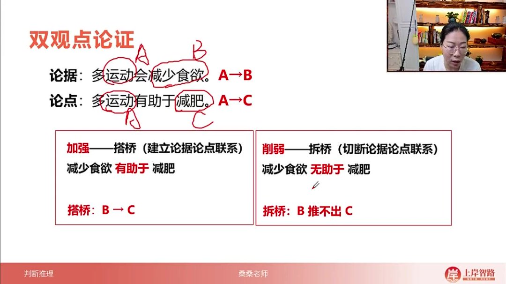
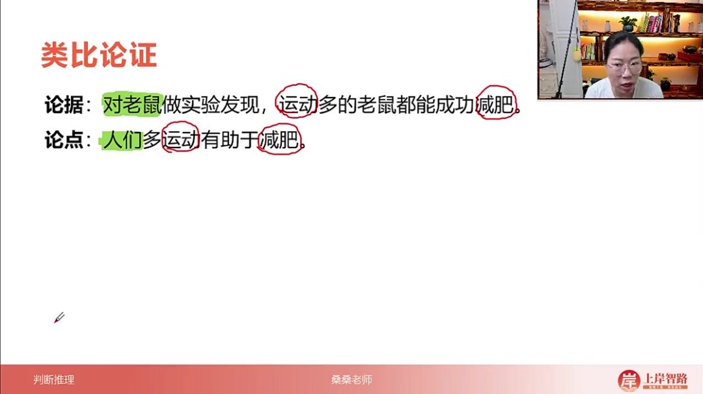
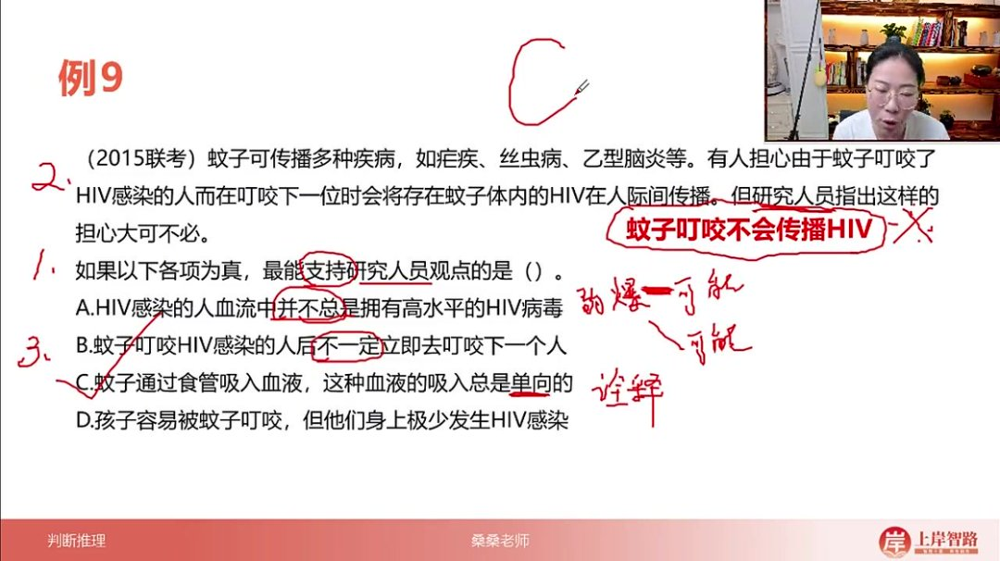
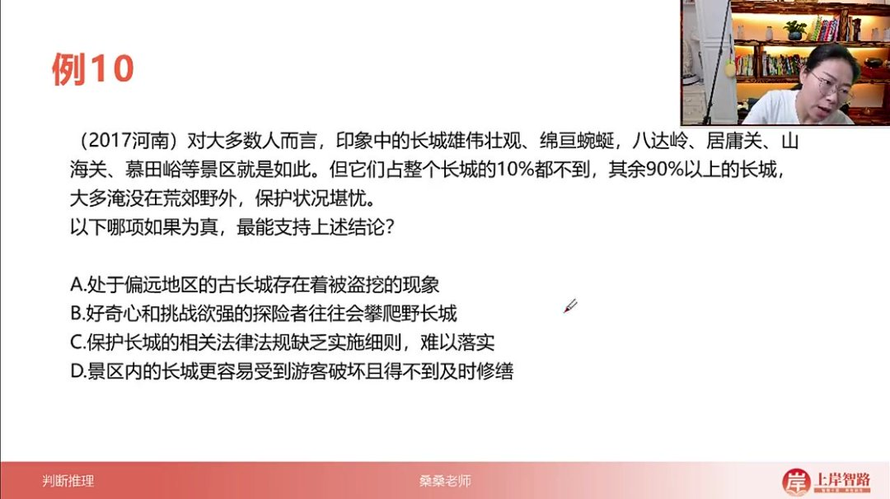
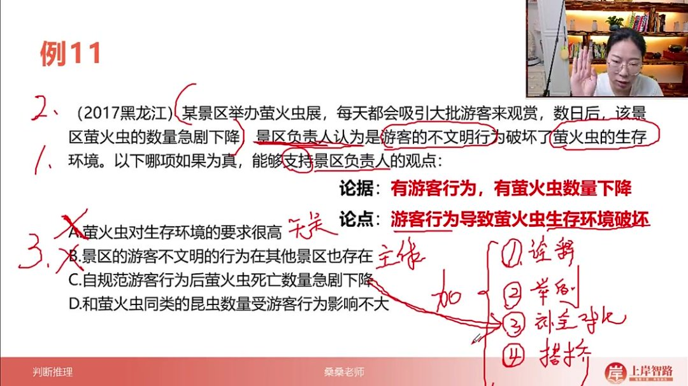
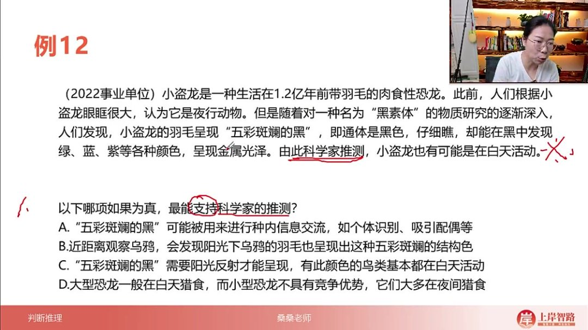

以下为AI生成的图文笔记的内容

#### 一、选项辨析 00:00

##### 1. 例题:加强方式应用 00:22

- 

- 诠释加强：通过解释原理建立因果关系，如"吃肉增加能量摄入→能量摄入导致长胖"。加强力度最强，见到可直接选择。

- 举例加强

  ：

  - 正例：如"小明吃肉后变胖"，通过个别案例支持结论
  - 反例：如"不常吃肉的人没变胖"，通过反面案例强化因果关系
  - 力度较弱，需与其他选项比较

- 力度对比：诠释 > 举例（无论正例反例）。"有些人"比单个人名力度稍强但仍属举例范畴。

##### 2. 例题:搭桥加强方式 06:07

- 
- 适用场景：论据与论点话题不一致时（如论据说A→B，论点说A→C）
- 操作方式：建立B→C的联系，如"有海洋陆地→必定有生命"
- 力度特点：论证力度最强，相当于补充论证过程
- 识别特征：出现"凡是...必定..."等绝对化表述

##### 3. 双观点论证 09:08

- 

- 结构特征：论据A→B，论点A→C，存在两个不同观点

- 加强方法

  ：

  - 搭桥：建立B→C联系（如"减少食欲→有助于减肥"）
  - 方向性：必须从论据指向论点

- 削弱方法

  ：

  - 拆桥：切断B→C联系（如"减少食欲≠有助于减肥"）

- 操作步骤

  ：

  - 去除相同概念（如A）
  - 对不同概念（B和C）建立或切断联系

##### 4. 举例论证 11:51

- 典型结构：论据为具体案例（群体A），论点为普遍结论（全体人群）

- 加强方式

  ：

  - 例子代表性：证明案例能代表总体（如"群体A代谢水平正常"）
  - 本质：对论证主体进行搭桥

- 削弱方式

  ：

  - 无代表性：案例具有特殊性（如"群体A都是运动员"）
  - 本质：对论证主体进行拆桥

- 与双观点区别：操作对象是论证主体而非核心概念

##### 5. 类比论证 14:46

- 

- 核心特征：论据与论点主体属于不同类别（如老鼠实验推导人类结论）

- 加强方式：建立可类比关系（证明老鼠与人类减肥机制相同）

- 削弱方式：切断可类比关系（证明老鼠与人类减肥机制不同）

- 典型案例

  ：

  - 论据：运动多的老鼠都能成功减肥
  - 论点：人们多运动有助于减肥
  - 加强：研究表明老鼠和人类在运动后的脂肪代谢途径高度相似
  - 削弱：老鼠的褐色脂肪组织含量远高于人类，导致代谢效率差异显著

##### 6. 总结：建立/切断论据论点联系 16:29

- 双关点论证

  ：

  - 操作方式：直接针对核心话题不一致处进行搭桥/拆桥
  - 强度特征：属于最强效的加强削弱方式

- 举例论证

  ：

  - 代表性判断

    ：

    - 加强：证明样本群体具有普遍性（如群体A为普通人）
    - 削弱：指出样本特殊性（如群体A为退役运动员）

  - 典型案例

    ：

    - 论据：群体A运动多者都减肥成功
    - 论点：多运动有助于减肥

- 类比论证

  ：

  - 跨物种验证

    ：

    - 加强：建立不同物种间的可类比性
    - 削弱：强调物种间的不可类比性

- 本质共性：所有方式都在操作论据与论点间的逻辑联系强度

- 方法体系

  ：

  - 诠释法
  - 例证法
  - 对比法
  - 搭桥/拆桥法

##### 7. 应用案例 18:23

###### 1）例题：加强论证题目练习

- 例9：蚊子传播HIV的论证分析

  - 

  - 解题步骤

    ：

    - 第一步：明确提问要求，识别为论证加强题，需要支持研究人员的观点
    - 第二步：定位题干论点，研究人员观点为"蚊子叮咬不会传播HIV"
    - 第三步：分析选项支持力度，寻找最能支持论点的选项

  - 选项分析技巧

    ：

    - 弱爆选项特征：使用"不总是"、"不一定"等可能性描述（如A、B选项）
    - 最强支持项：做诠释的选项（如C选项），通过解释原理直接支持论点
    - 举例支持项：通过具体案例支持（如D选项），力度次于诠释项

  - 核心知识点

    ：

    - 诠释项优先：解释说明为什么观点正确的选项支持力度最强
    - 可能性选项：包含"可能"、"不一定"等表述的选项通常力度较弱
    - 观点提取：转折词"但是"后往往是核心论点所在位置

###### 2）例题：加强论证题目练习 25:16

- 例10：长城保护状况论证分析

  - 

  - 解题步骤

    ：

    - 第一步：识别提问为论证加强题，需要支持"90%以上长城保护状况堪忧"的结论
    - 第二步：明确论点主体是非景区长城（90%以上部分）
    - 第三步：排除无关选项，选择直接支持论点的最佳选项

  - 选项分析技巧

    ：

    - 主体一致性：必须与论点主体（非景区长城）保持一致（排除D选项）

    - 无关选项识别

      ：

      - 法律法规与保护状况无必然联系（C选项）
      - 探险者行为影响不明确（B选项）

    - 有效支持项：直接说明非景区长城存在问题（A选项）

  - 核心知识点

    ：

    - 偷换主体陷阱：选项讨论对象与题干论点主体不一致是典型错误
    - 相关性判断：选项内容必须与论点建立明确逻辑联系
    - 举例支持：通过具体实例（偏远地区被盗挖）可以有效支持普遍性结论

###### 3）例题：加强论证题目练习 31:53

- 例11：萤火虫展游客行为论证

  - 

  - 题目解析

    - 论证结构

      ：

      - 论据：有游客行为，萤火虫数量下降
      - 论点：游客不文明行为破坏萤火虫生存环境

    - 加强方式

      ：

      - 诠释解释：说明游客行为如何具体破坏环境（如污染空气/光线）
      - 举例说明：列举游客拍打萤火虫等具体行为案例
      - 补全对比：补充"无游客行为时数量稳定"的反例
      - 搭桥联系：建立"环境破坏"与"数量下降"的因果关系

    - 选项分析

      ：

      - A项（生存要求高）：无关选项，未建立游客行为与结果的关联
      - B项（其他景区存在）：主体不一致，属于偷换概念
      - C项（规范后死亡下降）：补全对比的典型加强项
      - D项（同类昆虫影响小）：类比削弱项，暗示萤火虫也应受影响小

    - 答案：C

    - 技巧总结

      ：

      - 主体一致性是排除干扰项的关键
      - 补全对比类选项常含时间先后对比（如"规范前后"）

- 例12：小盗龙活动时间论证 

  42:45

  - 

  - 题目解析

    - 论证结构

      ：

      - 论据：羽毛呈"五彩斑斓的黑"（需阳光反射）
      - 论点：可能在白天活动

    - 核心方法

      ：

      - 搭桥加强：需建立羽毛特性与活动时间的直接联系

    - 选项分析

      ：

      - A项（信息交流功能）：无关羽毛颜色与活动时间的关系
      - B项（乌鸦羽毛类比）：主体不一致的无关选项
      - C项（需阳光反射）：完美搭桥，建立颜色呈现与白天的必然联系
      - D项（恐龙猎食习惯）：或然性表述（"大多"）且可能反向削弱

    - 答案：C

    - 论证要点

      ：

      - 当论据与论点概念不一致时，优先寻找搭桥项
      - 绝对化表述（如"需要""基本都"）在加强题中往往是强支持

- 加强论证方法论总结

  - 四种加强方式

    ：

    - 诠释解释：力度最强，直接说明因果关系（例：解释游客行为如何污染环境）
    - 搭桥联系：力度最强，连接论据与论点的不同概念（例：羽毛颜色↔白天活动）
    - 补全对比：通过正反案例对比加强（例：规范游客行为前后的数量变化）
    - 举例说明：力度较弱，用具体事例支持（例：游客拍打萤火虫的个案）

  - 解题技巧

    ：

    - 预判答案方向能提高解题效率
    - 主体一致性是首要排除标准
    - 搭桥项常见特征：包含论据和论点的关键要素

  - 易错警示

    ：

    - 警惕偷换主体（如其他景区/其他物种）
    - 或然性表述（"可能""大多"）通常非最优选
    - 类比选项多用于削弱而非加强

#### 二、知识小结

| 知识点           | 核心内容                                                     | 考试重点/易混淆点                     | 难度系数 |
| ---------------- | ------------------------------------------------------------ | ------------------------------------- | -------- |
| 加强方式分类     | 四种论证加强方式：做诠释、举例子、补全对比、搭桥             | 区分不同加强方式的力度差异            | ⭐⭐⭐      |
| 做诠释           | 通过原理解释说明观点（例：吃肉因增加能量摄入导致长胖）       | 直接选择，力度最强                    | ⭐⭐       |
| 举例子           | 通过个例支持观点（例：小明吃肉变胖）                         | 力度较弱，需对比其他选项              | ⭐⭐⭐⭐     |
| 补全对比         | 补充反例形成对比（例：不常吃肉的人未变胖）                   | 需明确正反例逻辑关系                  | ⭐⭐⭐      |
| 搭桥             | 建立论据与论点间的逻辑联系（例：有海洋陆地→有生命）          | 双观点论证的核心技巧                  | ⭐⭐⭐⭐     |
| 无关选项识别     | 主体不一致（如景区内vs景区外）、话题无关（如法律法规与保护状况） | 偷换主体为典型错误                    | ⭐⭐       |
| 真题解析（例9）  | 支持“蚊子不传播HIV”观点                                      | C选项（食管单向吸血）为做诠释         | ⭐⭐⭐      |
| 真题解析（例10） | 论证“非景区长城保护堪忧”                                     | A选项（偏远长城被盗挖）为举例         | ⭐⭐⭐      |
| 真题解析（例11） | 支持“游客行为破坏萤火虫环境”                                 | C选项（规范行为后死亡下降）为补全对比 | ⭐⭐⭐⭐     |
| 真题解析（例12） | 论证“小盗龙白天活动”                                         | C选项（羽毛需阳光反射）为搭桥         | ⭐⭐⭐      |