以下为AI生成的图文笔记的内容

#### 一、削弱方式 00:05

##### 1. 例题:削弱方式分析

- 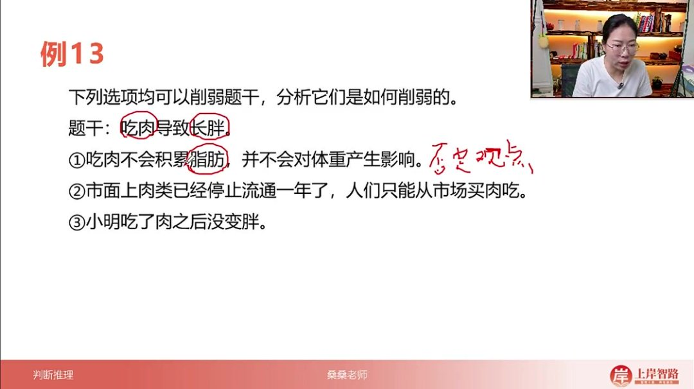

- 题干分析：以"吃肉导致长胖"为例，分析三种不同的削弱方式

- 削弱方式分类

  ：

  - 否定观点
  - 否定前提
  - 举反例

###### 1）否定观点 03:22

- 定义：直接否定题干中两个要素之间的关联性

- 特点

  ：

  - 力度最强，通常可直接选择
  - 类似于加强观点中的"做诠释"，但方向相反

- 示例1

  ："吃肉不会积累脂肪，并不会对体重产生影响"

  - 引入"脂肪"概念解释否定关联
  - 完全切断"吃肉"与"长胖"的因果关系

- 示例2

  ："运动对减肥的影响几乎可以忽略不计，控制饮食才重要"

  - 直接否定"运动"与"减肥"的关联性
  - 通过对比强调其他因素更重要

###### 2）否定前提

- 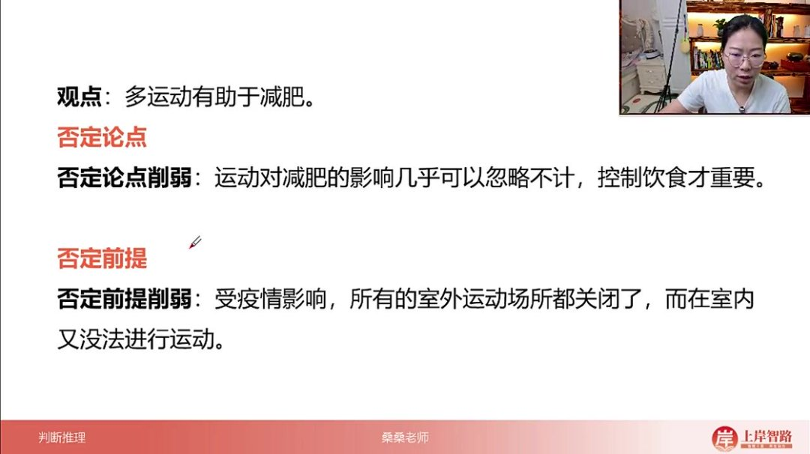

- 定义：否定题干结论成立的必要条件

- 特点

  ：

  - 力度较强，仅次于否定观点
  - 需要补充逻辑步骤才能完全否定结论

- 示例1

  ："市面上肉类已停止流通一年，人们只能从市场买肉吃"

  - 实际含义是人们吃不到肉
  - 使"吃肉导致长胖"的前提不成立

- 示例2

  ："受疫情影响，所有室外运动场所关闭，室内无法运动"

  - 使"多运动"成为不可能
  - 从而否定"运动有助于减肥"的结论

###### 3）举反例

- 定义：通过个别案例反驳普遍结论

- 特点

  ：

  - 力度最弱
  - 仅能说明结论不具普遍性

- 示例

  ："小明吃了肉之后没变胖"

  - 单一案例无法否定整体规律
  - 类似加强中的举例，但方向相反

###### 4）削弱方式比较

- 力度排序：否定观点 > 否定前提 > 举反例

- 选择策略

  ：

  - 同时出现否定观点和否定前提时优先选否定观点
  - 否定观点与题干关键词关联更直接
  - 否定前提需要额外推理步骤

##### 2. 应用案例 04:46

###### 1）例题：削弱方式分析

- 拆桥式削弱
  - 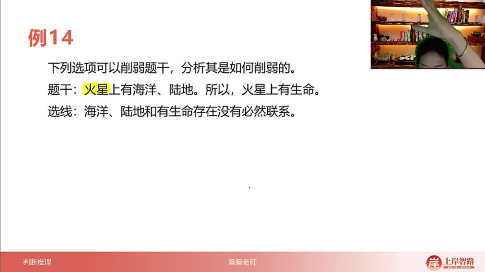
  - 核心原理：当论据和论点涉及不同话题时，通过切断两者间的逻辑联系实现削弱
  - 操作方式：指出论据中的要素（如"海洋陆地"）与论点结论（如"生命存在"）无必然联系
  - 典型案例：题干"火星有海洋陆地→有生命"被"海洋陆地和生命无必然联系"削弱
  - 关联技巧：与搭桥式加强形成对立操作，是论证类题目中的基础削弱方法
- 削弱的三类基础方式
  - 话题联系型
    - 特征：论据与论点话题不一致（如运动与食欲）
    - 方法：直接拆断话题间的假设性联系
    - 示例："多运动减少食欲"可被"运动与食欲调节机制无关"削弱
  - 样本代表型
    - 加强条件：样本具有代表性（如群体A是普通人）
    - 削弱条件：样本无代表性（如群体A是特殊人群）
    - 典型错误：将特殊样本结论推广到一般情况
  - 类比适用型
    - 加强条件：类比对象具有可比性（如人与老鼠代谢相似）
    - 削弱条件：类比对象不可比（如人与老鼠生理结构差异大）
    - 应用场景：跨物种、跨群体论证时需特别注意

###### 2）例题：削弱方式进阶分析 08:19

- 实验对比型削弱

  - 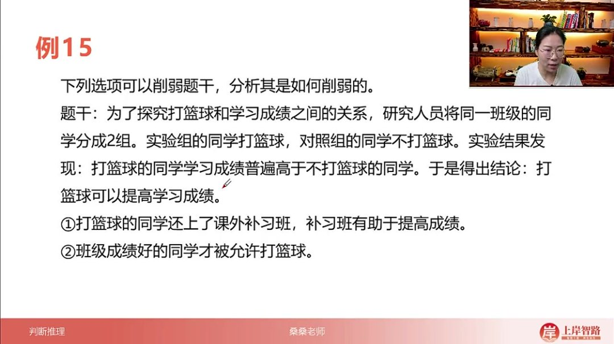

  - 题目解析

    - 实验设计：篮球组vs非篮球组的学习成绩对比

    - 论证缺陷：未控制其他变量（如补习班）和初始条件（如入学成绩）

    - 削弱方式1（另有他因）

      ：

      - 引入补习班变量，说明成绩提升可能源于补习而非篮球
      - 力度评估：中等强度削弱

    - 削弱方式2（因果倒置）

      ：

      - 揭示"成绩好→被允许打球"的反向因果关系
      - 力度评估：绝对性削弱（见选必选）

    - 答案特征：因果倒置＞另有他因＞样本偏差

- 另有他因削弱

  - 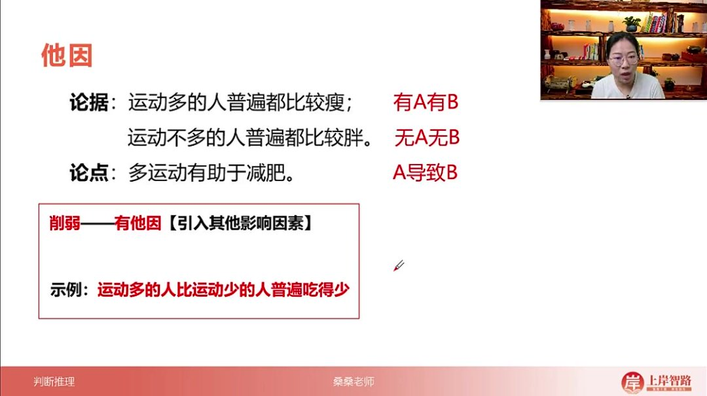

  - 适用场景：完整对比实验（有A有B组 vs 无A无B组）

  - 操作要点

    ：

    - 找出未被控制的第三变量（如饮食量）
    - 证明该变量足以解释结果差异

  - 加强对应：排除他因（如"运动是影响体重唯一因素"）

  - 记忆口诀："有因可替，力度次强"

- 因果倒置削弱

  - 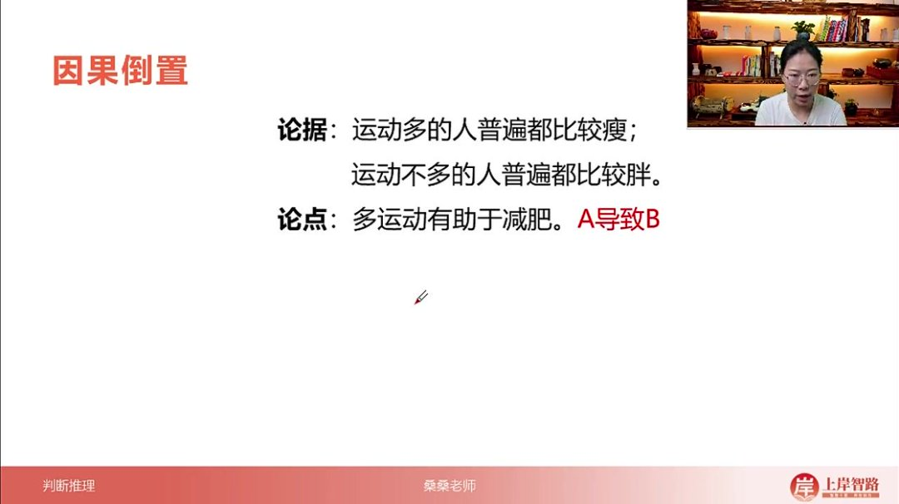

  - 识别特征：将论点中的因果完全颠倒

  - 典型句式："不是A导致B，而是B导致A"

  - 示例变形

    ：

    - 原论点：运动→瘦 → 削弱：瘦→更爱运动
    - 原论点：读书→高收入 → 削弱：高收入→更多读书时间

  - 力度评估：所有削弱方式中最强级别

  - 解题提示：当出现"才/只有...才能..."句式需高度警惕

###### 3）例题:电饭煲毒素质疑

- 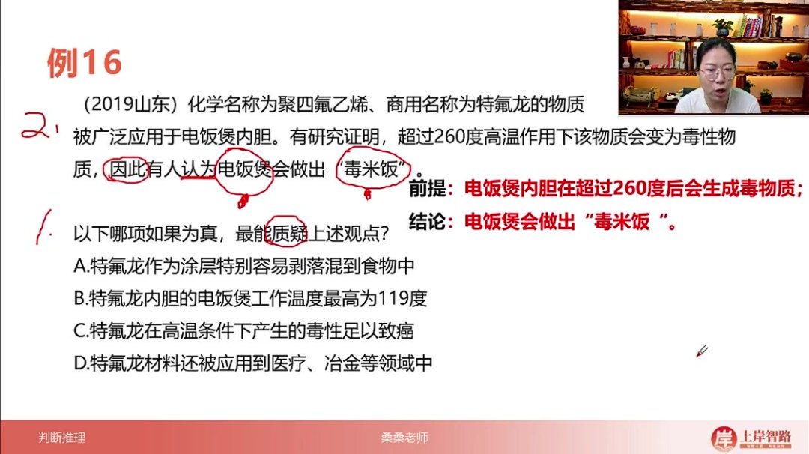

- 题目解析

  - 论证结构分析

    ：

    - 前提：电饭煲内胆在超过260℃后会生成有毒物质
    - 结论：电饭煲会做出"毒米饭"
    - 论证类型：因果论证（高温→有毒物质→毒米饭）

  - 削弱方法应用

    ：

    - 否定前提：证明前提条件不成立（如工作温度达不到260℃）
    - 拆桥论证：切断高温与毒性的必然联系
    - 否定结论：直接证明不会产生毒米饭

  - 选项分析

    ：

    - A项：涂层剥落与毒性无必然联系（表意不明）
    - B项：工作温度最高119℃（直接否定前提，最强削弱）
    - C项：毒性致癌与题干结论无关（无关选项）
    - D项：其他应用领域与毒性无关（无关选项）

  - 答案：B

  - 解题技巧

    ：

    - 关注论证核心变量（温度260℃）
    - 优先考虑直接否定前提的选项
    - 排除表意不明和无关选项

###### 4）例题:体质酸化为百病之源观点反驳

- 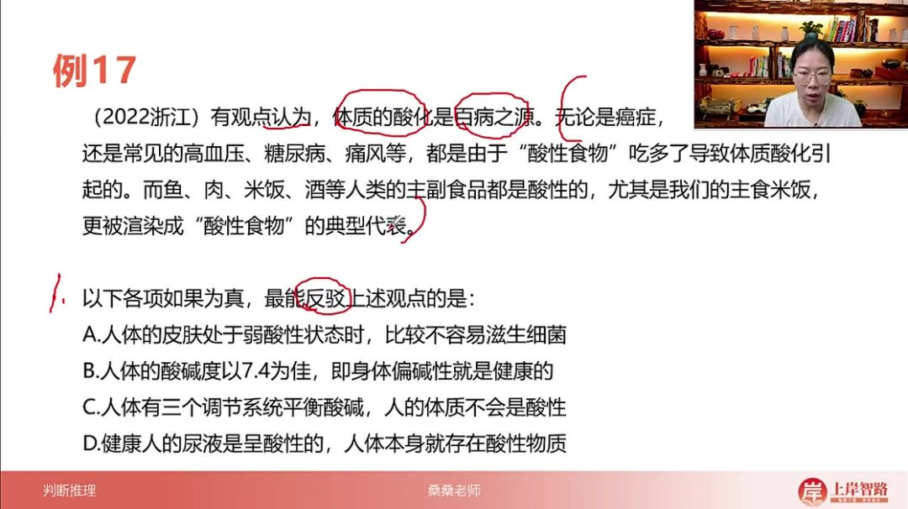

- 题目解析

  - 论证结构分析

    ：

    - 论点：体质酸化是百病之源
    - 论据：酸性食物导致酸化，常见食物多为酸性
    - 论证类型：一般性因果论证

  - 削弱方法应用

    ：

    - 否定前提：证明体质不会酸化（最强削弱）
    - 因果倒置：疾病导致酸化而非相反
    - 另有他因：疾病由其他因素引起

  - 选项分析

    ：

    - A项：皮肤酸性抑菌与整体健康无关（无关选项）
    - B项：碱性健康≠酸性致病（逻辑不充分）
    - C项：人体调节系统使体质不会酸化（直接否定前提）
    - D项：尿液酸性≠体质酸性（概念偷换）

  - 答案：C

  - 解题技巧

    ：

    - 区分局部酸性（尿液）与整体体质酸性
    - 关注人体自我调节机制的解释
    - 排除以偏概全的选项

  - 易错点

    ：

    - 混淆"酸性物质存在"与"体质酸化"概念
    - 过度解读选项中的专业术语（如pH值7.4）

###### 5）例题:年龄与告知意愿论点削弱 27:27

- 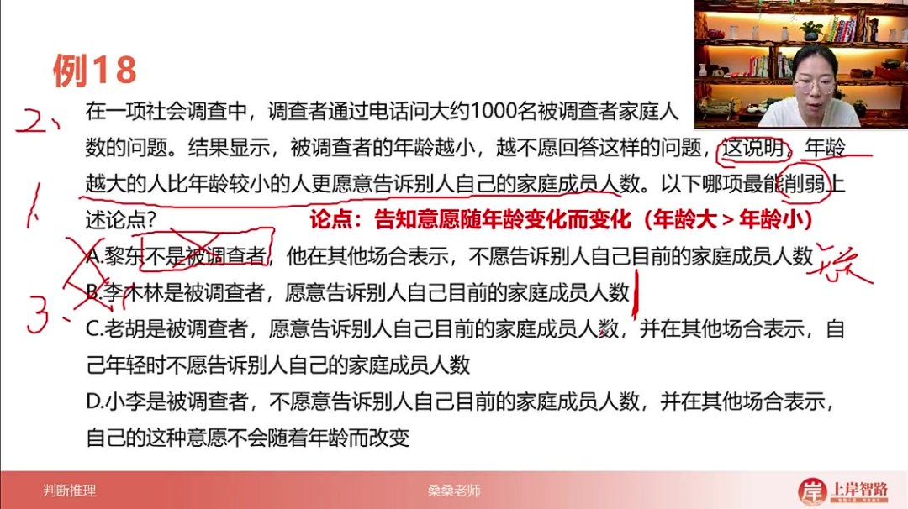

- 论点分析

  - 核心论点: 告知意愿随年龄变化而变化（年龄大>年龄小）
  - 论据基础: 1000名被调查者的电话调查显示，年龄越小越不愿回答家庭成员人数问题
  - 论证特点: 通过调查数据得出年龄与告知意愿的因果关系

- 削弱方法

  - 否定观点: 直接反驳年龄与告知意愿的关联性
  - 举反例: 展示不符合论点规律的个体案例
  - 因果倒置: 证明是告知意愿影响年龄认知
  - 另有他因: 指出影响告知意愿的其他关键因素

- 选项分析

  - A选项问题

    :

    - 未涉及年龄变量（无关项）
    - 非被调查者样本（样本无效）

  - B选项缺陷

    :

    - 仅说明当前意愿
    - 缺乏年龄对比维度

  - C选项性质

    :

    - 实际支持论点（年龄增长→意愿增强）
    - 属于加强型案例

  - D选项价值

    :

    - 明确否定年龄与意愿的关联性
    - 包含时间维度验证（"不会随年龄改变"）

- 解题技巧

  - 审题关键: 区分"加强"与"削弱"要求
  - 选项筛选: 优先寻找包含年龄比较的选项
  - 易错警示: 注意案例是否来自有效样本群体
  - 力度判断: 直接否定论点的选项削弱力度最强

###### 6）例题:所有人适当食用蛋白粉质疑 33:22

- 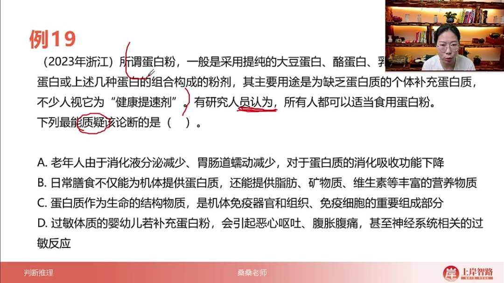

- 论点解析

  - 核心论断: 所有人都可以适当食用蛋白粉

  - 论据支持

    :

    - 蛋白粉的构成（大豆/酪/乳蛋白组合）
    - 补充蛋白质的主要用途
    - "健康提速剂"的民间认知

- 质疑角度

  - 适用人群限制: 找出特定群体不适宜的情况
  - 替代方案证明: 展示更优的营养获取途径
  - 负面效应举证: 揭示潜在健康风险
  - 必要性反驳: 论证非必需性补充

- 选项评估

  - A选项局限

    :

    - 仅说明吸收效率下降
    - 未否定补充价值

  - B选项问题

    :

    - 未排除蛋白粉的辅助作用
    - 属于平行论证

  - C选项性质

    :

    - 强调蛋白质重要性
    - 实际支持补充必要性

  - D选项效力

    :

    - 明确特定人群（婴幼儿）的不良反应
    - 直接否定"所有人适用"的绝对性

- 解题要点

  - 绝对论断特征: "所有人"类表述易被反例推翻

  - 削弱力度层级

    :

    - 部分否定（较弱）
    - 完全否定（最强）

  - 选项对比原则

    :

    - 优先选择针对性最强的反例
    - 排除无关或支持性选项

  - 易错提醒: 注意区分"功能描述"与"论证效力"

###### 7）例题:抵抗力研究结论削弱 38:49

- 题目分析

  - 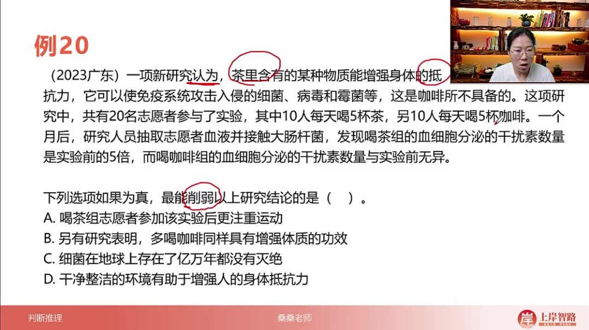
  - 论点结构：茶含特定物质能增强抵抗力，使免疫系统攻击病原体，这是咖啡不具备的
  - 论据设计：20人实验（10人喝茶/10人喝咖啡），一个月后检测干扰素分泌量变化
  - 数据对比：喝茶组干扰素分泌量达实验前5倍，咖啡组无变化

- 论证缺陷

  - 逻辑断层：论据仅证明茶影响干扰素分泌，但论点直接跳跃到"增强抵抗力"，缺乏干扰素与抵抗力关联的证据
  - 实验局限：样本量仅20人，未控制其他变量（如运动、饮食等）

- 削弱方法分析

  - 次优策略：另有他因削弱（存在其他影响抵抗力的因素）

- 选项解析

  - A选项（正确）

    ：

    - 机制：建立喝茶与运动的关联，暗示可能是运动而非喝茶导致抵抗力增强
    - 削弱力度：中等，属于典型另有他因

  - B选项

    ：

    - 问题：使用"同样"暗示茶有效，同时咖啡也有效，产生矛盾效果
    - 概念混淆：未明确"增强体质"与"增强抵抗力"的等同性

  - C选项

    ：

    - 无关性：细菌存续时间与免疫机制无直接关联
    - 概念误解：免疫攻击≠消灭细菌，人体需要共生菌群

  - D选项

    ：

    - 无效原因：未建立环境整洁度与实验组的关联，属于完全无关项

###### 8）例题:体重减轻健康状况受损削弱 48:25

- 题目特征

  - 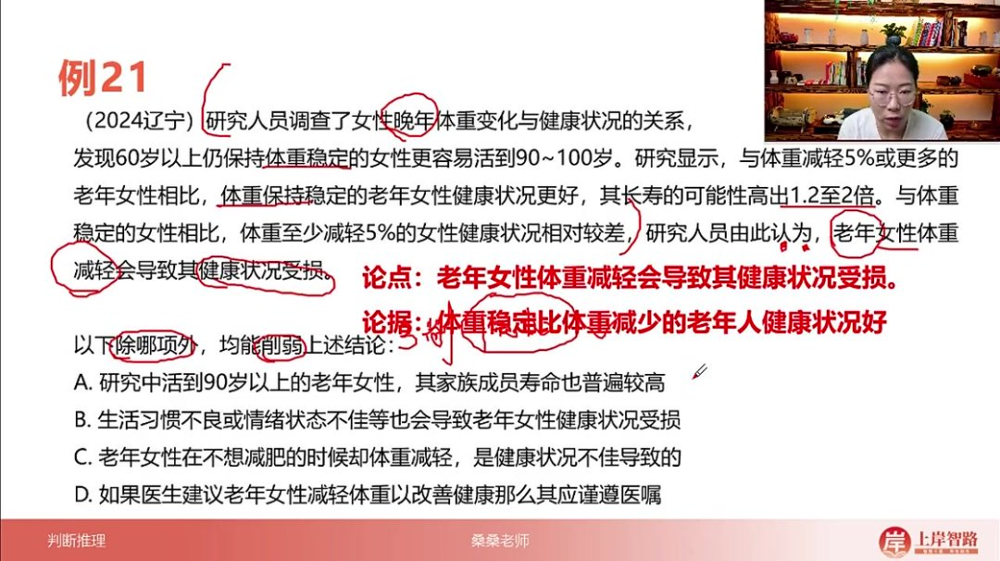

  - 特殊问法："除哪项外"题型，需识别3个削弱项和1个非削弱项

  - 核心论点：老年女性体重减轻→健康状况受损

  - 论据支撑

    ：对比研究显示体重稳定者比减轻者：

    - 活到90-100岁概率高1.2-2倍
    - 整体健康状况更优

- 论证逻辑

  - 因果方向：默认体重变化为因，健康状态为果
  - 研究设计：纵向观察性研究，非实验性干预

- 选项解析

  - A选项（削弱项）

    ：

    - 类型：另有他因
    - 逻辑：提出遗传因素（家族寿命）可能才是真正原因

  - B选项（正确/非削弱项）

    ：

    - 无关性：未建立生活习惯与体重变化组的关联
    - 表述缺陷：仅说明其他健康影响因素，与论点无冲突

  - C选项（强削弱项）

    ：

    - 类型：因果倒置
    - 逻辑：健康不佳→体重减轻，直接逆转原论点因果关系

  - D选项（削弱项）

    ：

    - 类型：举反例
    - 逻辑：医生建议减重改善健康，证明体重减轻可能有益

- 削弱力度比较

  - 强度排序：因果倒置(C) > 另有他因(A) > 举例削弱(D)
  - 解题技巧：因果倒置项出现时可优先选择，因其直接否定论证基础

#### 二、加强与削弱总结 57:20

##### 1. 加强方式：做诠释、举正例、做对比、切断论据论点联系 57:23

- 力度等级

  ：

  - 最强：做诠释（解释说明）、建立联系（搭桥）
  - 较弱：举正例（举例证明）、做对比（比较分析）

- 特殊说明：做诠释和建立联系在考试中不会同时出现

- 对比关系：做对比的力度优于举正例，因为对比需要两组数据或前后变化，论证更严谨

##### 2. 建立联系（搭桥）的三种类型 57:50

- 双观点论证

  ：

  - 特点：论据和论点涉及不同话题
  - 加强方式：为不同话题建立联系
  - 强度：最强的加强方式

- 举例论证

  ：

  - 特点：论据是具体案例，论点是普遍结论
  - 加强方式：证明例子具有代表性

- 类比论证

  ：

  - 特点：论据和论点主体不一致（如论据用老鼠实验，论点关于人类）
  - 加强方式：证明两者具有可比性

##### 3. 削弱方式分类 59:17

- 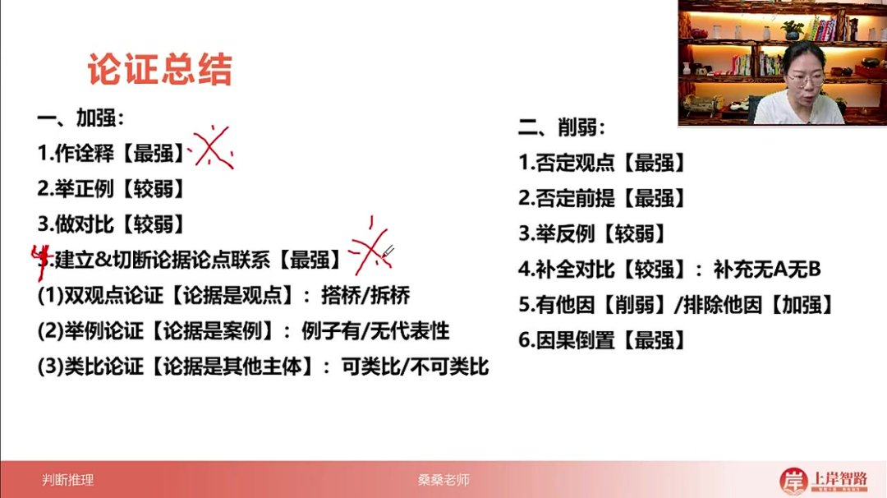

- 最强削弱

  ：

  - 否定观点（直接反驳结论）
  - 否定前提（推翻论证基础）
  - 因果倒置（颠倒因果关系）
  - 拆桥（切断论据与论点的联系）

- 较弱削弱

  ：

  - 举反例（用反例质疑）
  - 补全对比（补充无A无B的情况）
  - 有它因（提出其他可能原因）

- 有它因的特殊情况

  ：

  - 当明确否定原因而提出它因时（如"不是吃肉而是吃米导致长胖"），力度等同于否定观点
  - 一般情况下的有它因是可能性削弱，力度最弱
  - 考试中频次较高，需结合其他选项判断

#### 三、常考无关项总结 01:01:43

##### 1. 例题分析框架 01:01:45

- 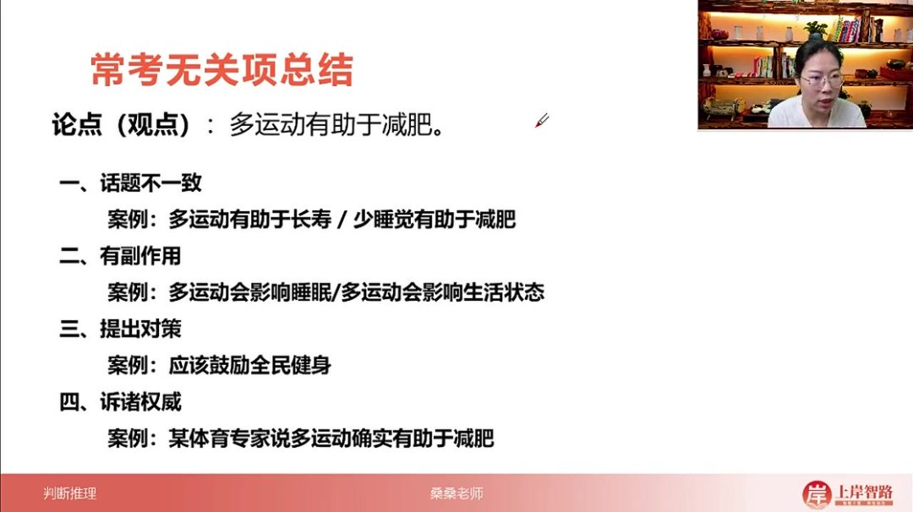
- 核心论点："多运动有助于减肥"
- 分析要点：判断选项内容是否真正影响论点关系

##### 2. 话题不一致 01:02:07

- 典型表现

  ：

  - 引入无关概念（如"多运动有助于长寿"）
  - 主体替换（如将"桑桑老师"换成"小明同学"）

- 判断标准

  ：

  - 新概念与核心主题无常识性关联
  - 避免脑补不存在的联系

- 示例

  ：

  - "少睡觉有助于减肥"（与运动无关）
  - "多运动会影响睡眠"（不直接影响减肥效果）

##### 3. 有副作用 01:03:52

- 特点

  ：

  - 讨论A与B关系时，提出A对C的影响
  - 副作用与核心论点无必然联系

- 典型示例

  ：

  - 论点："吃减肥药能瘦"
  - 无关项："吃减肥药会犯困"

- 关键点：副作用不影响原有效果的成立与否

##### 4. 提出对策 01:05:04

- 识别特征

  ：

  - 题干讨论A与B的关系
  - 选项给出"应该..."的行动建议

- 典型示例

  ：

  - 论点：运动与减肥的关系
  - 无关项："应该鼓励全民健身"

- 本质问题：对策与因果关系论证无关

##### 5. 诉诸权威 01:05:43

- 表现形式

  ：

  - "某专家说..."
  - "某期刊研究表明..."

- 判断原则

  ：

  - 权威说法不等于事实
  - 不同权威可能观点相左

- 处理方式：除非明确要求，否则视为无关项

#### 四、知识小结

| 知识点       | 核心内容                                                     | 考试重点/易混淆点                                      | 难度系数 |
| ------------ | ------------------------------------------------------------ | ------------------------------------------------------ | -------- |
| 削弱方式分类 | 直接否定观点、否定前提、举反例、拆桥、因果倒置、另有他因     | 区分否定观点（直接反驳结论）与否定前提（否定论证基础） | ⭐⭐⭐      |
| 否定观点     | 直接否定题干核心结论（如“吃肉不会积累脂肪”否定“吃肉导致长胖”） | 需与论点关键词完全对应，力度最强                       | ⭐⭐       |
| 否定前提     | 否定结论成立的基础条件（如“市面无肉可买”否定“吃肉导致长胖”） | 需补充逻辑链条，力度接近否定论点                       | ⭐⭐⭐      |
| 举反例       | 通过个别案例反驳普遍结论（如“小明吃肉未胖”）                 | 力度较弱，仅代表局部情况                               | ⭐        |
| 拆桥         | 切断论据与论点的逻辑联系（如“海洋陆地与生命无必然关联”）     | 需明确话题不一致性，力度强                             | ⭐⭐⭐      |
| 因果倒置     | 颠倒论点中的因果关系（如“因瘦才运动”反驳“运动导致瘦”）       | 绝杀选项，需论点含明确因果关系                         | ⭐⭐⭐⭐     |
| 另有他因     | 引入其他影响因素（如“补课导致成绩提高”削弱“打篮球提高成绩”） | 力度中等，需与题干主体关联                             | ⭐⭐       |
| 无关项识别   | 话题不一致、偷换主体、有副作用、提出对策、诉诸权威           | 注意“权威说法”未必有效                                 | ⭐⭐       |
| 削弱力度排序 | 因果倒置 ≈ 否定观点 > 拆桥 > 否定前提 > 另有他因 > 举反例    | 考试中优先选绝对否定项                                 | ⭐⭐⭐⭐     |
| 例题分析     | 电饭煲毒米饭（选“工作温度未达260℃”）、体质酸化（选“人体不会酸化”） | 正确选项特征：直接对应论点关键词                       | ⭐⭐⭐      |