以下为AI生成的图文笔记的内容

#### 一、翻译推理 00:54

##### 1. 考查形式 01:04

- 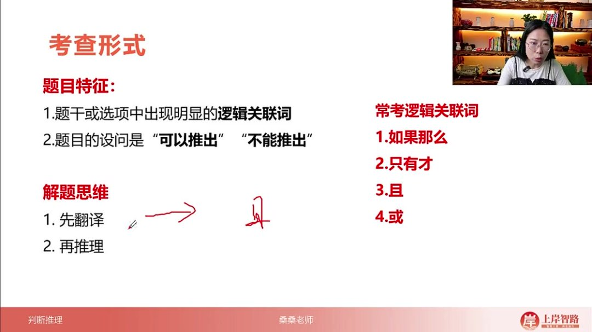

- 逻辑关联词识别：题干或选项中出现"如果那么""只有才""且""或"等逻辑关联词或其等价关系时，优先考虑翻译推理题型

- 设问特征：题目设问通常为"可以推出"或"不能推出"，需特别注意设问方向（易错点：看错设问导致反向作答）

- 解题步骤

  ：

  - 翻译：将逻辑关联词转化为逻辑符号（如"如果那么"转化为"→"）
  - 推理：运用逻辑规则进行推导

##### 2. 考点1如果那么前推后 02:50

###### 1）基本规则 03:10

- 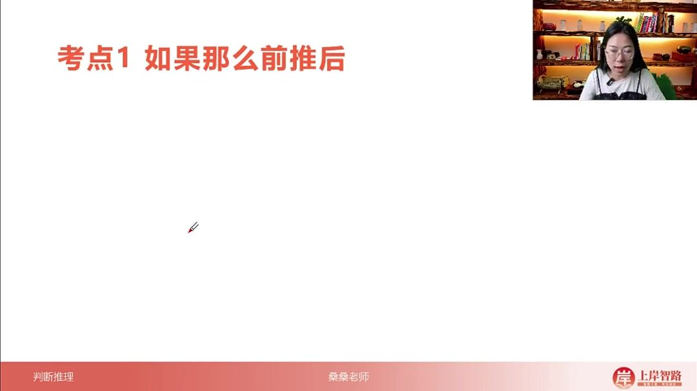

- 核心口诀："如果那么前推后"必须背诵

- 翻译方法：省略逻辑关联词，保留前后内容用箭头连接（例："如果明天下雨，那么出行计划就延期"→下雨→延期）

- 命题类型

  ：属于充分条件假言命题（考试不考概念，只需掌握翻译方法）

  - 充分条件：前件（"如果"部分）足以推出后件（"那么"部分）
  - 假言命题：基于假设的陈述

###### 2）等价关联词

- 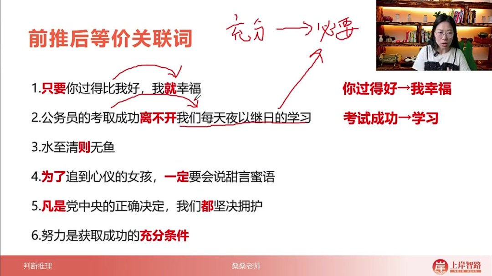

- 常见等价形式

  ：

  - 只要...就...（例："只要你过得比我好，我就幸福"→你过得好→我幸福）
  - ...离不开...（例："考取成功离不开学习"→成功→学习）
  - 若...则...（例："水至清则无鱼"→水至清→无鱼，可用"¬"表示否定）
  - 为了...一定要...（例："为了追到女孩，一定要说甜言蜜语"→追到女孩→说甜言蜜语）
  - 凡是...都...（例："凡是党中央决定，我们都拥护"→决定→拥护）
  - ...是...的充分条件（例："努力是成功的充分条件"→努力→成功）

- 记忆技巧

  ：

  - 充分条件→箭头前
  - 必要条件→箭头后
  - "离不开""一定要""凡是都"等表示"必须"的内容放在箭头后

###### 3）例题：前推后等价关联词巩固 10:43

- 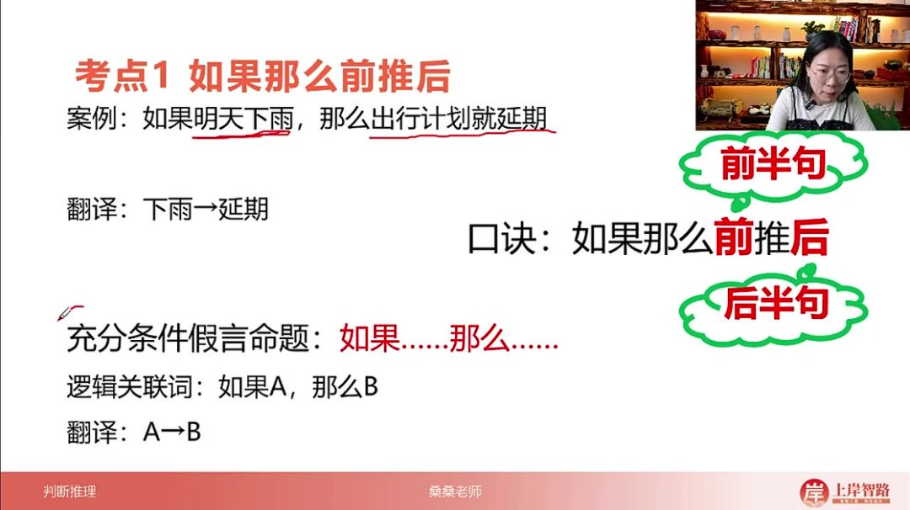

- 题干分析："所有红苹果都是甜的"→红→甜（"所有都"=前推后）

- 选项解析

  ：

  - A项："为了成为甜苹果一定要成为红苹果"→甜→红（反）
  - B项："如果苹果甜，那么它是红苹果"→甜→红（反）
  - C项："只要红苹果都甜"→红→甜（正确）
  - D项："红苹果的充分条件是甜"→甜→红（反）

- 答案：C选项

- 技巧总结：通过此题巩固"所有都""凡是都""只要就""充分条件"等多种前推后等价表达形式

##### 3. 考点2：只有才后推前 14:48

###### 1）核心规则 15:05

- 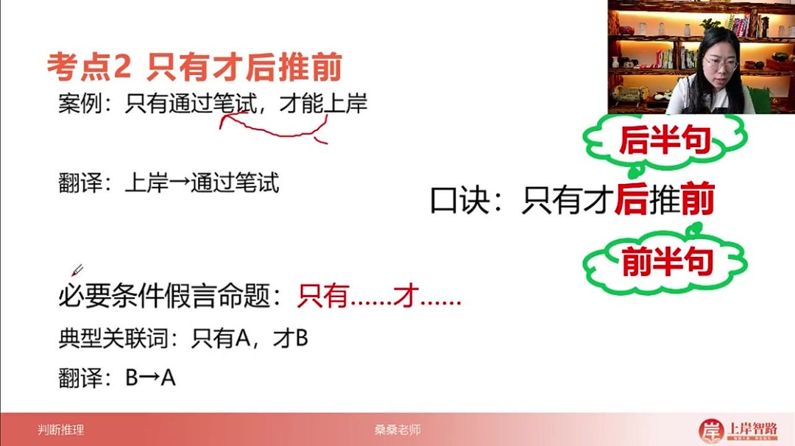

- 基本结构

  ：典型关联词"只有A，才B"翻译为

  B→AB \rightarrow AB→A

  ，后半句推前半句

- 逻辑本质：表达"必须满足A才能实现B"，A是B的必要条件

- 记忆口诀："只有才后推前"（后半句作为箭头前件，前半句作为箭头后件）

- 案例解析："只有通过笔试，才能上岸"翻译为"上岸→通过笔试"

###### 2）等价关联词

- 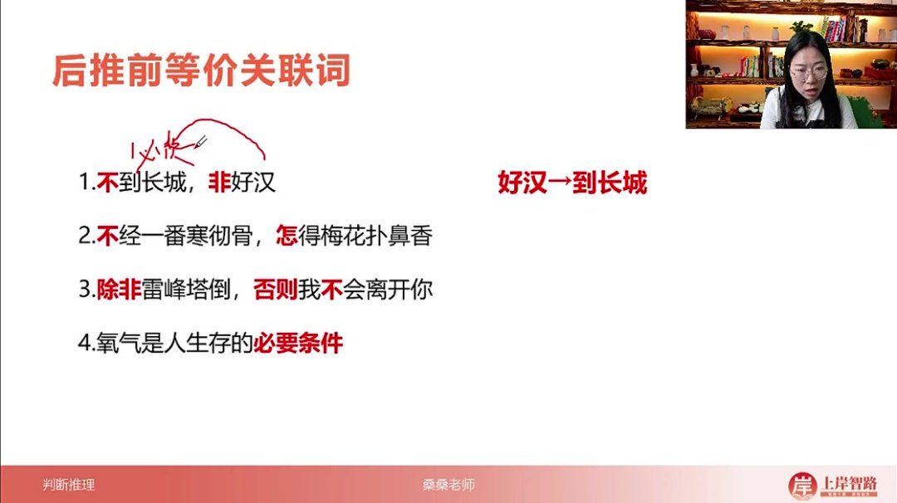

- 步步结构："不到长城非好汉"→"好汉→到长城"（去掉"不"字后推前）

- 反问句式："不经一番寒彻骨，怎得梅花扑鼻香"→"梅花香→经历寒彻骨"

- 除非否则

  ：

  - 标准形式："除非A，否则不B"→"B→A"
  - 变体处理："除非A，否则B"需补双重否定→"非B→A"

- 必要条件陈述："氧气是人生存的必要条件"→"生存→氧气"

###### 3）例题：歌词逻辑推论

- 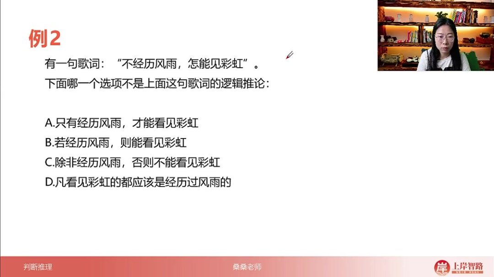
- 题目解析
  - 题干翻译："不经历风雨，怎能见彩虹"→"见彩虹→经历风雨"（步步结构）
  - 选项分析：
    - A项："只有经历风雨，才能看见彩虹"→"彩虹→风雨"（正确）
    - B项："若经历风雨，则能看见彩虹"→"风雨→彩虹"（方向错误）
    - C项："除非经历风雨，否则不能看见彩虹"→"彩虹→风雨"（正确）
    - D项："凡看见彩虹的都应该是经历过风雨的"→"彩虹→风雨"（正确）
  - 答案：B选项（注意题干要求选"不是"的选项）
  - 易错点：题干要求选择"非逻辑推论"，容易误选符合的选项

##### 4. 考点3：且关系 25:26

###### 1）基本概念

- 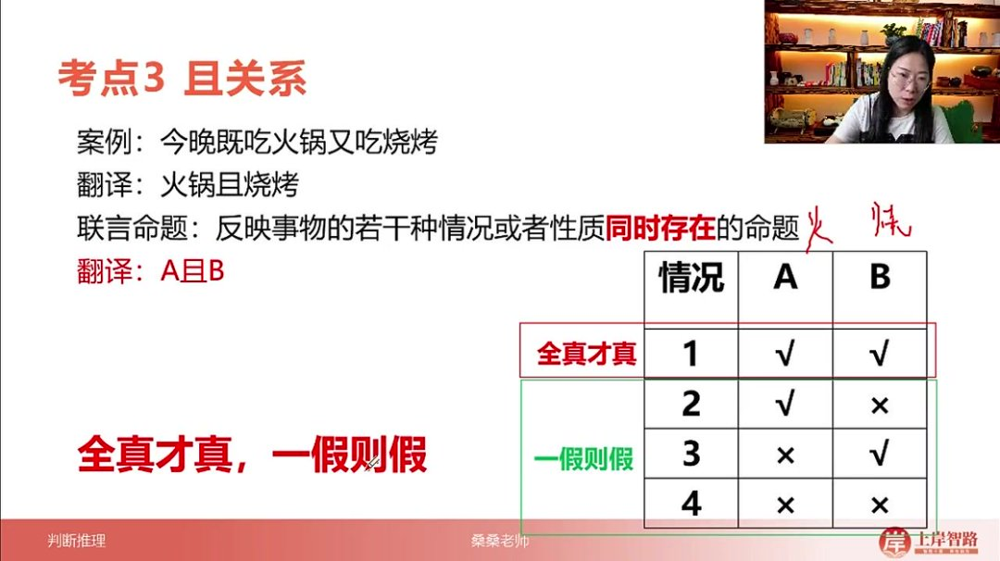

- 定义

  ：联言命题，反映若干情况同时存在的命题，形式为

  A∧BA \land BA∧B

- 真值规则

  ：

  - 全真才真：仅当A、B均为真时命题为真
  - 一假则假：任一子命题为假则整体为假

- 案例："既吃火锅又吃烧烤"→"火锅∧烧烤"

- 记忆口诀："全真才真，一假则假"（必须全部条件同时满足）

###### 2）等价关联词

- 

- 并列结构

  ：

  - "不仅...还..."："蔡蔡不仅帅，还黑"→"帅∧黑"
  - "既...又..."："晨晨既丑又萌"→"丑∧萌"

- 必要条件："努力和坚持缺一不可"→"努力∧坚持"

- 转折强调："虽然...但是..."："小白虽然帅但是穷"→"帅∧穷"（逻辑中"但"表并列）

###### 3）例题：健康标准判断

- 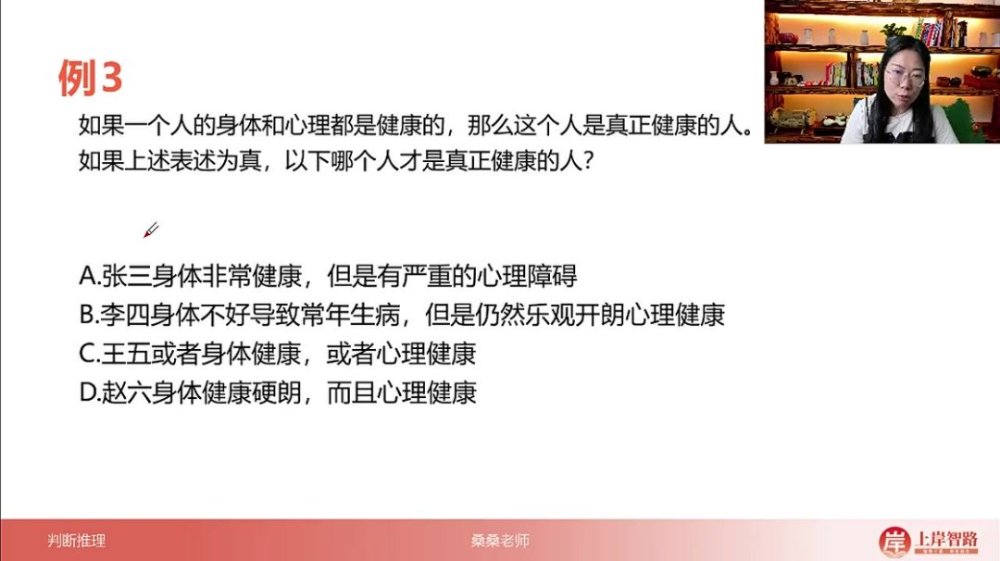
- 题目解析
  - 题干分析："身体和心理都健康→真正健康"（且关系作为前件）
  - 选项验证：
    - A项：身体健∧心理不健→假（一假则假）
    - B项：身体不健∧心理健→假（一假则假）
    - C项：身体∨心理健→不符合且关系
    - D项：身体健∧心理健→真（全真才真）
  - 答案：D选项
  - 关键考点：识别题干中的且关系，应用"全真才真"规则进行判断

##### 5. 考点4或关系 32:42

###### 1）基本概念与特征

- 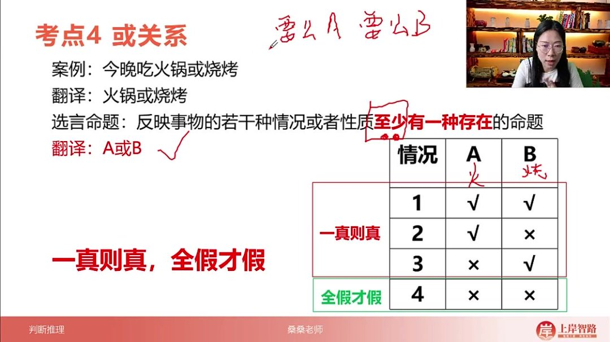

- 定义

  ：选言命题是反映事物的若干种情况或性质至少有一种存在的命题，逻辑表达式为

  A∨BA \lor BA∨B

  （A或B）

- 生活案例："今晚吃火锅或烧烤"中，"或"表示至少选择一种（可同时选择两种）

- 与日常用语区别：逻辑中的"或"不同于生活中的二选一，允许同时满足（相容性）

- 真假判断口诀

  ：一真则真（至少一个为真），全假才假（必须全部为假）

  - 四种情况分析：
    - A真B真 → 真
    - A真B假 → 真
    - A假B真 → 真
    - A假B假 → 假

###### 2）特殊形式：要么关系

- 不相容选言命题：表达形式"要么A要么B"，表示严格二选一

- 与或关系区别

  ：

  - 或关系：允许

    A∧BA \land BA∧B

    同时成立（情况1成立）

  - 要么关系：仅允许情况2、3成立（排斥同时成立）

- 记忆要点：考试中除非明确出现"要么"词汇，否则默认按相容性"或"处理

###### 3）等价关联词与应用

- 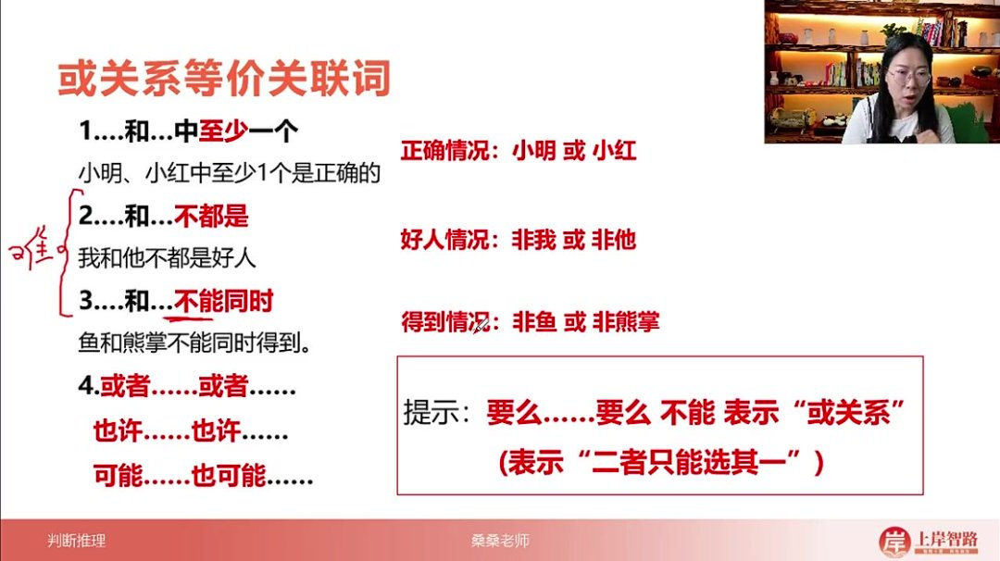

- 常见等价形式

  ：

  - "至少一个"：如"小明或小红中至少1个正确" →

    小明∨小红小明 \lor 小红小明∨小红

  - "不都是"：如"我和他不都是好人" →

    ¬我∨¬他\neg 我 \lor \neg 他¬我∨¬他

    - 逻辑分析：排除"都好人"情况（情况1），保留情况2-4

  - "不能同时"：如"鱼和熊掌不能兼得" →

    ¬鱼∨¬熊掌\neg 鱼 \lor \neg 熊掌¬鱼∨¬熊掌

  - "或者...或者..."：直接对应

    A∨BA \lor BA∨B

- 否定转换技巧：遇到"不都是/不能同时"时，转换为各自否定后用或连接

- 易错提示："要么...要么..."不能表示或关系（属于不相容选言）

###### 4）例题：或关系判断 40:28

- 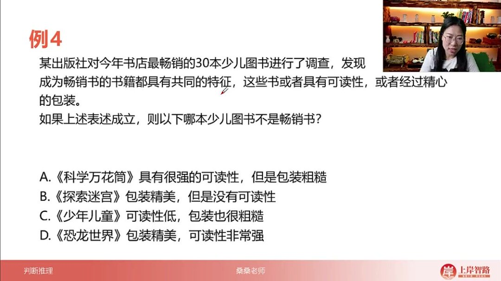

- 题目解析

  - 题干分析

    ：畅销书特征为"可读性

    ∨\lor∨

    精心包装"

  - 解题关键：应用"一真则真，全假才假"原则

  - 选项验证

    ：

    - A：可读性真 → 符合
    - B：包装真 → 符合
    - C：两者皆假 → 不符合（即非畅销书）
    - D：两者皆真 → 符合

  - 答案：C

  - 易错点：注意题干问"不是"，避免误选符合条件项

##### 6. 四个翻译规则汇总 43:39

- 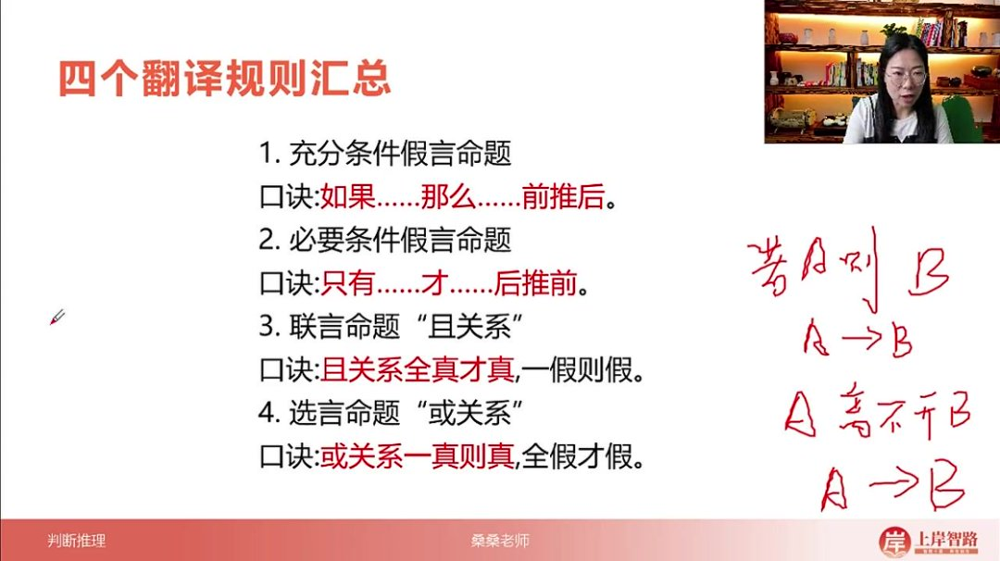

- 规则体系

  ：

  - 充分条件假言命题："如果...那么..." → 前推后（

    A→BA \rightarrow BA→B

    ）

  - 必要条件假言命题："只有...才..." → 后推前（

    B→AB \rightarrow AB→A

    ）

  - 联言命题（且关系）：全真才真，一假则假（

    A∧BA \land BA∧B

    ）

  - 选言命题（或关系）：一真则真，全假才假（

    A∨BA \lor BA∨B

    ）

- 应用示例

  ：

  - "若A则B" →

    A→BA \rightarrow BA→B

    （若=如果，则=那么）

  - "A离不开B" →

    A→BA \rightarrow BA→B

    （必要条件）

  - "除非A否则B" →

    ¬B→A\neg B \rightarrow A¬B→A

    （等价"只有A才非B"）

- 记忆技巧：通过典型关联词快速识别命题类型，注意"除非否则"的特殊处理

#### 二、知识小结

| 知识点             | 核心内容                                                     | 考试重点/易混淆点                              | 难度系数 |
| ------------------ | ------------------------------------------------------------ | ---------------------------------------------- | -------- |
| 翻译推理规则       | 如果那么前推后（充分条件假言命题）：若A则B → A→B；等价关联词：只要就、离不开、弱则、为了一定、凡是都、充分条件 | 区分“如果那么”与“只有才”的推理方向             | ⭐⭐       |
| 翻译推理规则       | 只有才后推前（必要条件假言命题）：只有A才B → B→A；等价关联词：步步、除非否则不、必要条件 | “除非A否则B”需补双重否定译为¬B→A               | ⭐⭐⭐      |
| 且关系（联言命题） | A且B：全真才真，一假则假；等价关联词：既又、不仅还、虽然但   | “但”在逻辑中表且关系（非言语的转折重点）       | ⭐⭐       |
| 或关系（选言命题） | A或B：一真则真（含两真），全假才假；等价关联词：至少、不都是、不能兼得、或者 | 与“要么要么”区别：后者仅二选一（不相容）       | ⭐⭐⭐      |
| 真假推理技巧       | 通过真值表判断复合命题真假（如：且关系需全真，或关系需至少一真） | 实际题目中需结合翻译规则综合推理               | ⭐⭐⭐⭐     |
| 例题解析           | 例题1（前推后等价关联词）、例题2（后推前与非推论）、例题3（且关系全真）、例题4（或关系全假） | 易错点：选非题审题、关联词省略补充（如“弱则”） | ⭐⭐⭐      |