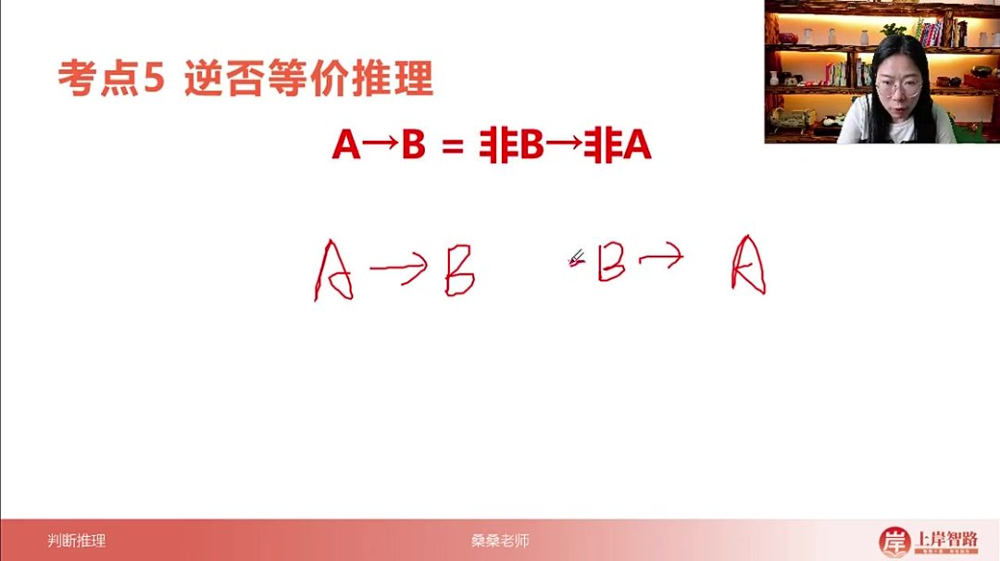
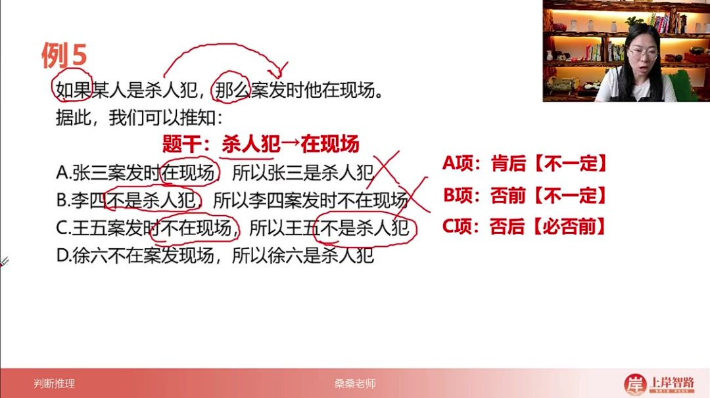
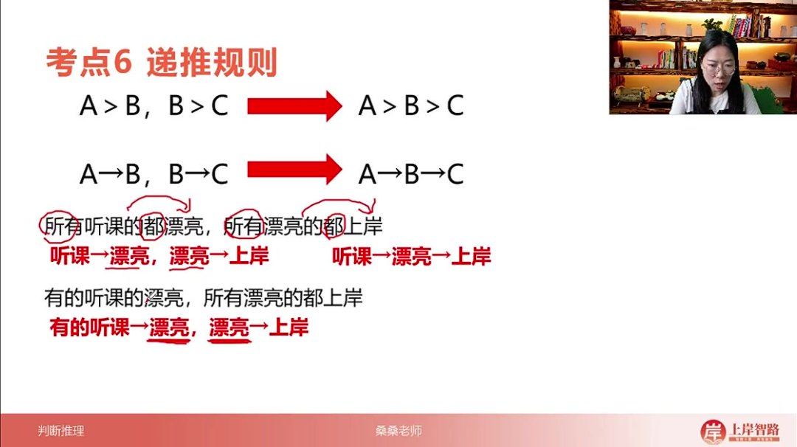
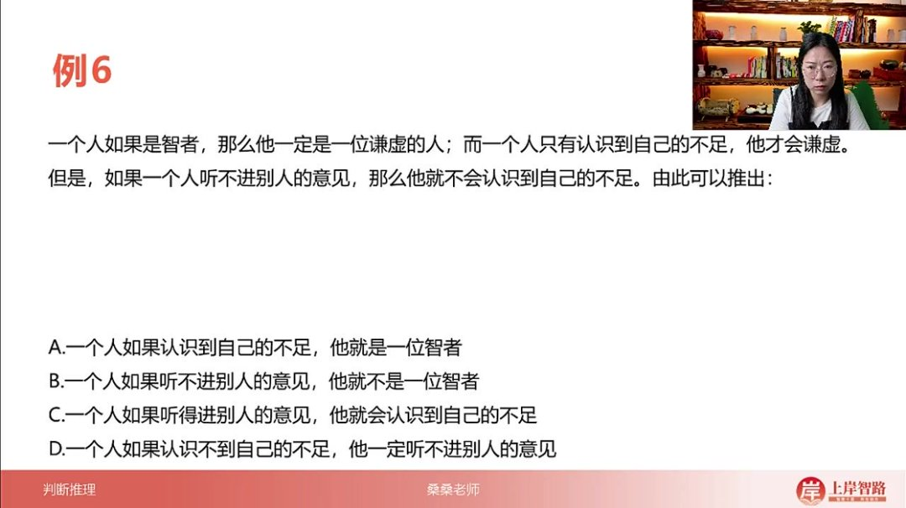
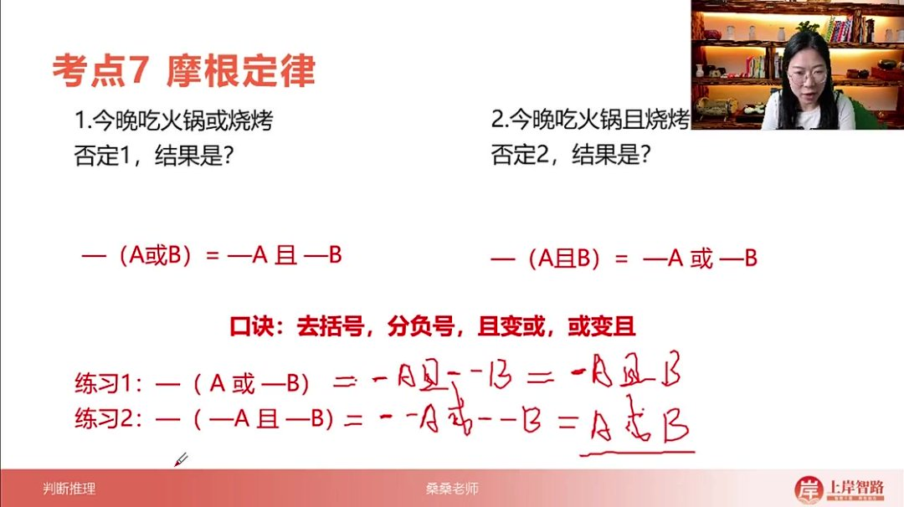
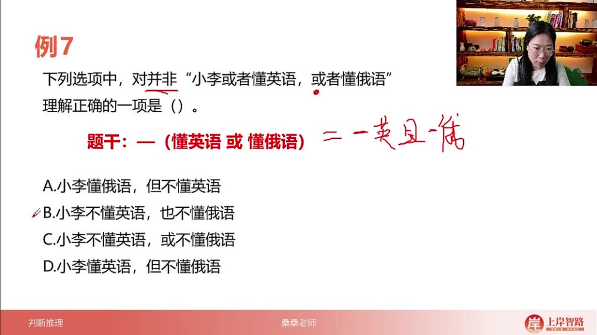
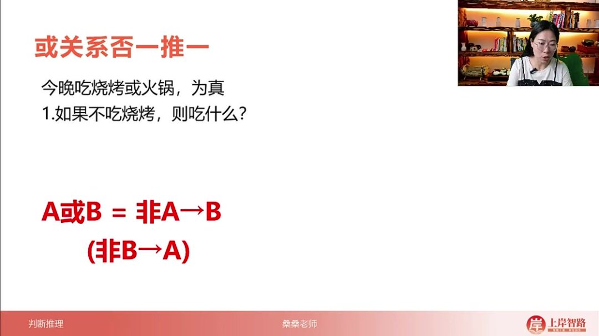
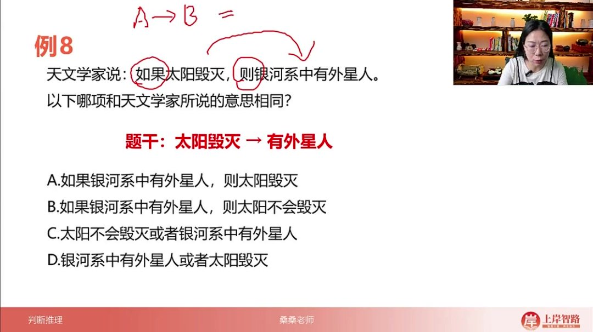

以下为AI生成的图文笔记的内容

#### 一、逆否等价推理 00:08

- 

- 核心公式

  ：

  A→B=¬B→¬AA \rightarrow B = \neg B \rightarrow \neg AA→B=¬B→¬A

  ，即原命题与其逆否命题逻辑等价

- 操作步骤

  ：

  - 逆：交换前后件顺序（

    A→BA \rightarrow BA→B

    变为

    B→AB \rightarrow AB→A

    ）

  - 否：对前后件分别取非（变为

    ¬B→¬A\neg B \rightarrow \neg A¬B→¬A

    ）

- 记忆口诀：肯前必肯后，否后必否前，否前肯后不一定

##### 1. 例题:只有才是推理判断 01:14

- 实例分析

  ：

  - 原命题："只有某人是中国人，才是河北人" → 翻译为：河北人→中国人
  - 四种情况验证：
    - 张三是河北人（肯前）→必是中国人（肯后）
    - 李四不是中国人（否后）→必不是河北人（否前）
    - 王五不是河北人（否前）→可能是也可能不是中国人（不一定）
    - 赵六是中国人（肯后）→可能是也可能不是河北人（不一定）

##### 2. 例题:杀人犯现场推理 05:54

- 

- 题目解析

  ：

  - 题干翻译：杀人犯→在现场
  - 选项分析：
    - A项：肯后（在现场→杀人犯）→违反"肯后不一定"规则
    - B项：否前（非杀人犯→不在现场）→违反"否前不一定"规则
    - C项：否后（不在现场→非杀人犯）→符合"否后必否前"规则（正确答案）
    - D项：否后但结论错误（不在现场→是杀人犯）→违反逆否规则

#### 二、递推规则 09:17

- 

- 基本形式

  ：若

  A→BA \rightarrow BA→B

  且

  B→CB \rightarrow CB→C

  ，则可串联为

  A→B→CA \rightarrow B \rightarrow CA→B→C

- 应用条件

  ：

  - 中间项必须完全相同（如"漂亮"与"漂亮"）
  - 中间项不能是"有的"等不确定量词

- 特殊情形

  ：

  - "有的A是B，有的B是C" → 不能递推（主体可能不同）
  - "有的A是B，所有B是C" → 可递推为"有的A→B→C"

##### 1. 例题:递推规则应用 09:47

- 

- 题目解析

  ：

  - 题干翻译：
    - 智者→谦虚
    - 谦虚→认识不足
    - 不听意见→不认识不足（逆否为：认识不足→听意见）
  - 完整递推链：智者→谦虚→认识不足→听意见
  - 选项分析：
    - A项：肯后（认识不足→智者）→违反规则
    - B项：否后（不听意见→非智者）→符合规则（正确答案）
    - C项：否前/肯后（听意见→认识不足）→不一定
    - D项：肯后/否前（不认识不足→不听意见）→不一定

#### 三、摩根定律 18:58

- 

- 核心公式

  ：

  - −(A∨B)=−A∧−B-(A \lor B) = -A \land -B−(A∨B)=−A∧−B
  - −(A∧B)=−A∨−B-(A \land B) = -A \lor -B−(A∧B)=−A∨−B

- 生活化理解

  ：

  - 否定"吃火锅或烧烤"等价于"不吃火锅且不吃烧烤"
  - 否定"吃火锅且烧烤"等价于"不吃火锅或不吃烧烤"

- 记忆口诀

  ：

  - 去括号，分负号，且变或，或变且
  - 操作步骤：整体否定→去掉括号→分配负号→互换逻辑关系符号

- 双重否定规则

  ：

  - 非非A等价于A（如练习2中

    −(−A∧−B)=A∨B-(-A \land -B) = A \lor B−(−A∧−B)=A∨B

    ）

##### 1. 例题:德摩根定律应用 21:49

- 

- 题目解析

  - 题干分析："并非'小李或者懂英语，或者懂俄语'"等价于

    −(英语∨俄语)-(\text{英语} \lor \text{俄语})−(英语∨俄语)

  - 应用摩根定律：

    −英语∧−俄语-英语 \land -俄语−英语∧−俄语

    → "不懂英语且不懂俄语"

  - 选项验证：

    - A项：部分肯定（懂俄语），不符合
    - B项：完全匹配推导结果
    - C项：误用或关系（应为且关系）
    - D项：部分肯定（懂英语），不符合

  - 答案：B

  - 易错点：容易混淆"或"与"且"的转换关系

#### 四、或关系否一推一 25:50

- 基本规则

  ：

  - A∨B=−A→BA \lor B = -A \rightarrow BA∨B=−A→B

    或

    −B→A-B \rightarrow A−B→A

  - 逆等价：

    A→B=−A∨BA \rightarrow B = -A \lor BA→B=−A∨B

- 生活实例

  ：

  - "吃烧烤或火锅"为真时：

    - 不吃烧烤(

      −A-A−A

      ) → 必吃火锅(B)

    - 不吃火锅(

      −B-B−B

      ) → 必吃烧烤(A)

- 公式推导

  ：

  - 对

    −A∨B-A \lor B−A∨B

    进行否一推一：

    - 否定

      −A-A−A

      得A

    - 推出B→ 即

      A→BA \rightarrow BA→B

##### 1. 例题:烧烤或火锅推理 26:04

- 
- 题目解析
  - 前提条件："烧烤或火锅"为真命题
  - 否定"烧烤"时，根据否一推一规则：
    - −烧烤→火锅-烧烤 \rightarrow 火锅−烧烤→火锅
  - 结论：必须选择火锅

##### 2. 例题:或关系否一推一应用 30:09

- 

- 题目解析

  - 题干翻译："太阳毁灭→有外星人"等价于

    −太阳毁灭∨有外星人-太阳毁灭 \lor 有外星人−太阳毁灭∨有外星人

  - 选项分析：

    - A项：错误逆命题（肯后推肯前）

    - B项：错误逆否命题

    - C项：正确等价形式（

      −太阳毁灭∨有外星人-太阳毁灭 \lor 有外星人−太阳毁灭∨有外星人

      ）

    - D项：错误顺序（缺少否定）

  - 验证方法：

    - 直接公式转换验证
    - 对C选项进行否一推一可得原命题

  - 答案：C

  - 考点提醒：注意箭头方向与否定词的位置关系

#### 五、知识小结

| 知识点         | 核心内容                                                     | 考试重点/易混淆点                                    | 难度系数 |
| -------------- | ------------------------------------------------------------ | ---------------------------------------------------- | -------- |
| 逆否等价推理   | 公式：A→B ≡ ¬B→¬A；口诀：肯前必肯后，否后必否前，否前肯后不一定 | 生活化案例：河北人→中国人（否后：非中国人→非河北人） | ⭐⭐       |
| 递推规则       | 相同概念串联：A→B→C；“有的”在中间不可递推（如：有的A→B + 有的B→C ≠ A→C） | 真题应用：智者→谦虚→认识不足→听意见（逆否链）        | ⭐⭐⭐      |
| 德摩根定律     | 公式：¬(A∨B) ≡ ¬A∧¬B；¬(A∧B) ≡ ¬A∨¬B；口诀：去括号分负号，且变或/或变且 | 案例：否定“吃火锅或烧烤”≡ 不吃火锅且不吃烧烤         | ⭐⭐       |
| 或关系否一推一 | 公式：A∨B ≡ ¬A→B；A→B ≡ ¬A∨B（双向等价）                     | 真题：太阳毁灭→有外星人 ≡ 非太阳毁灭∨有外星人        | ⭐⭐⭐⭐     |