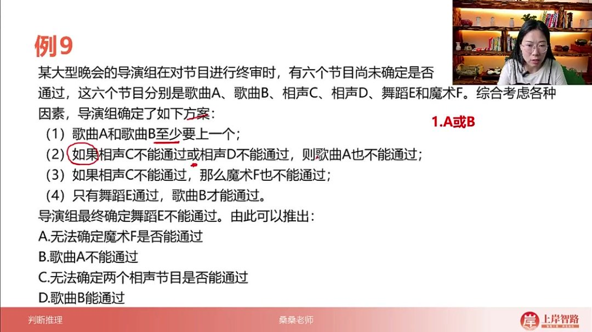
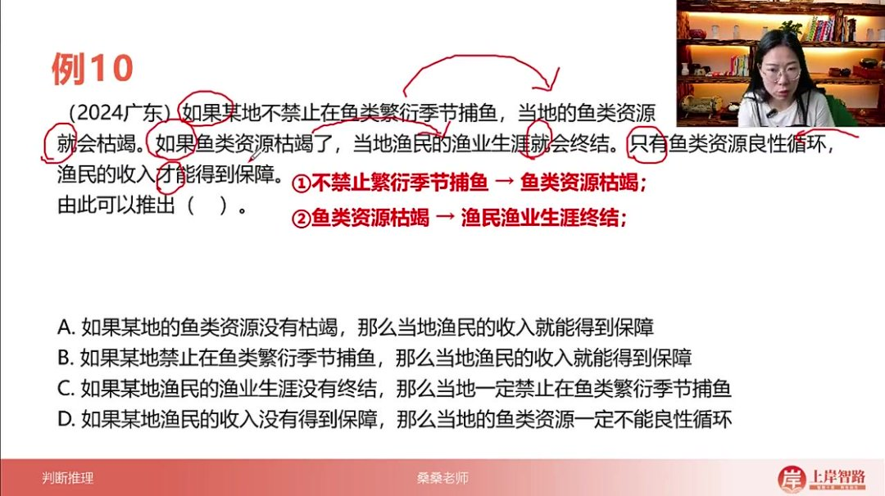
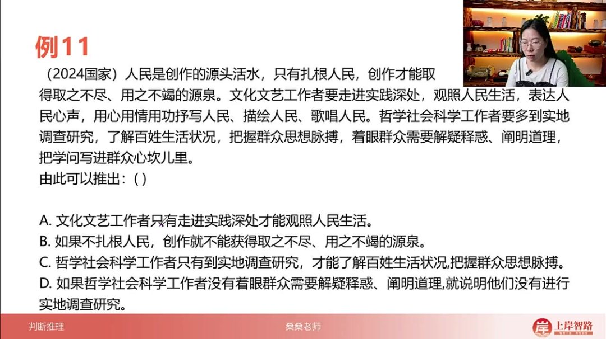

以下为AI生成的图文笔记的内容

#### 一、推理规则汇总 00:00

##### 1. 逆否等价推理

- 口诀记忆：肯前必肯后，否后必否前，否前肯后不一定

- 逻辑关系

  ：对于命题

  A→BA \rightarrow BA→B

  ，其逆否命题为

  ¬B→¬A\neg B \rightarrow \neg A¬B→¬A

  ，两者逻辑等价

- 应用限制：前件被否定或后件被肯定时，结论具有不确定性

##### 2. 递推规则 00:10

- 核心原理

  ：元素相同可进行箭头串联，即

  A→BA \rightarrow BA→B

  且

  B→CB \rightarrow CB→C

  可合并为

  A→B→CA \rightarrow B \rightarrow CA→B→C

- 特殊注意：存在特定情况不能直接串联，需注意命题结构的有效性

- 典型应用：适用于连续推导的复合命题，简化推理链条

##### 3. 摩根定律 00:24

- 变换规则

  ：

  - ¬(A∨B)≡¬A∧¬B\neg(A \lor B) \equiv \neg A \land \neg B¬(A∨B)≡¬A∧¬B
  - ¬(A∧B)≡¬A∨¬B\neg(A \land B) \equiv \neg A \lor \neg B¬(A∧B)≡¬A∨¬B

- 操作要点：去括号时分配负号，且/或关系相互转换

- 记忆技巧：整体否定时，"且"变"或"，"或"变"且"

##### 4. 或关系否一推一 00:50

- 等价转换

  ：

  A∨B≡¬A→BA \lor B \equiv \neg A \rightarrow BA∨B≡¬A→B

- 应用场景：将或关系转化为蕴含关系进行推理

- 操作口诀："或变箭头，否一推一"

##### 5. 总结 01:02

- 高频考点：逆否等价推理和递推规则为必考内容，需重点掌握
- 进阶应用：摩根定律和或关系否一推一规则常见于较难题目
- 知识体系：本课程共讲解8个考点，包含4个翻译规则和4个推理规则

#### 二、判断推理 01:40

##### 1. 例题：翻译推理

###### 1）四个推理规则汇总

- 逆否等价推理

  ：肯前必肯后，否后必否前，否前肯后不一定。即若

  A→BA \rightarrow BA→B

  成立，则

  ¬B→¬A\neg B \rightarrow \neg A¬B→¬A

  必成立，但

  ¬A\neg A¬A

  或B无法确定结论。

- 递推规则

  ：元素相同，箭头串联。当多个条件具有相同中间项时，可串联推理，如

  A→BA \rightarrow BA→B

  和

  B→CB \rightarrow CB→C

  可推出

  A→CA \rightarrow CA→C

  。

- 摩根定律

  ：去括号，分负号；或变且，且变或。即

  ¬(A∨B)≡¬A∧¬B\neg(A \lor B) \equiv \neg A \land \neg B¬(A∨B)≡¬A∧¬B

  ，

  ¬(A∧B)≡¬A∨¬B\neg(A \land B) \equiv \neg A \lor \neg B¬(A∧B)≡¬A∨¬B

  。

- 或关系否一推一

  ：或者变箭头，否一推一。即

  A∨BA \lor BA∨B

  等价于

  ¬A→B\neg A \rightarrow B¬A→B

  或

  ¬B→A\neg B \rightarrow A¬B→A

  。

###### 2）例题：晚会节目终审

- 

- 题目解析

  - 条件翻译

    ：

    - A∨BA \lor BA∨B

      （歌曲A或B至少上一个）

    - ¬C∨¬D→¬A\neg C \lor \neg D \rightarrow \neg A¬C∨¬D→¬A

      （C或D不通过则A不通过）

    - ¬C→¬F\neg C \rightarrow \neg F¬C→¬F

      （C不通过则F不通过）

    - B→EB \rightarrow EB→E

      （只有E通过，B才能通过）

  - 切入点

    ：题干给出

    ¬E\neg E¬E

    ，通过条件4逆否得

    ¬B\neg B¬B

    。

  - 推理过程

    ：

    - 由

      ¬B\neg B¬B

      和条件1，用或关系否一推一得A。

    - 由A否定条件2后件，逆否得

      ¬(¬C∨¬D)\neg(\neg C \lor \neg D)¬(¬C∨¬D)

      ，摩根定律化简为

      C∧DC \land DC∧D

      。

    - 由C无法通过条件3推出F的状态（否前不一定）。

  - 结论

    ：确定

    A,C,DA,C,DA,C,D

    通过，

    B,EB,EB,E

    不通过，F状态未知。

  - 答案：A选项（无法确定魔术F是否能通过）

  - 易错点：需综合运用逆否、摩根定律和或关系否一推一，注意否前肯后的不确定性。

##### 2. 例题：翻译推理 10:06

###### 1）例题：渔业资源管理

- 

- 题目解析

  - 条件翻译

    ：

    - ¬禁止捕鱼→资源枯竭\neg \text{禁止捕鱼} \rightarrow \text{资源枯竭}¬禁止捕鱼→资源枯竭

    - 资源枯竭→生涯终结\text{资源枯竭} \rightarrow \text{生涯终结}资源枯竭→生涯终结

    - 收入保障→资源良性循环\text{收入保障} \rightarrow \text{资源良性循环}收入保障→资源良性循环

      （即

      ¬资源枯竭\neg \text{资源枯竭}¬资源枯竭

      ）

  - 递推关系

    ：

    - 条件1+2：

      ¬禁止捕鱼→生涯终结\neg \text{禁止捕鱼} \rightarrow \text{生涯终结}¬禁止捕鱼→生涯终结

    - 条件3逆否：

      资源枯竭→¬收入保障\text{资源枯竭} \rightarrow \neg \text{收入保障}资源枯竭→¬收入保障

  - 选项分析

    ：

    - A选项：

      ¬资源枯竭→收入保障\neg \text{资源枯竭} \rightarrow \text{收入保障}¬资源枯竭→收入保障

      （肯后不一定，错误）

    - B选项：

      禁止捕鱼→收入保障\text{禁止捕鱼} \rightarrow \text{收入保障}禁止捕鱼→收入保障

      （否前不一定，错误）

    - C选项：

      ¬生涯终结→禁止捕鱼\neg \text{生涯终结} \rightarrow \text{禁止捕鱼}¬生涯终结→禁止捕鱼

      （通过逆否递推正确）

    - D选项：

      ¬收入保障→¬资源良性循环\neg \text{收入保障} \rightarrow \neg \text{资源良性循环}¬收入保障→¬资源良性循环

      （否前不一定，错误）

  - 答案：C选项

  - 技巧：优先验证涉及逆否和递推的选项，注意"否前不一定"的陷阱。

##### 3. 例题：翻译推理 18:04

###### 1）例题：文艺创作与人民

- 

- 题目解析

  - 核心条件

    ：

    创作有源泉→扎根人民\text{创作有源泉} \rightarrow \text{扎根人民}创作有源泉→扎根人民

    （"只有...才..."后推前）

  - 选项验证

    ：

    - B选项：

      ¬扎根人民→¬创作有源泉\neg \text{扎根人民} \rightarrow \neg \text{创作有源泉}¬扎根人民→¬创作有源泉

      （原条件的逆否，正确）

    - A/C/D选项：均将并列关系错误理解为推出关系。

  - 答案：B选项

  - 考点：识别唯一逻辑关联词（"只有才"），排除非条件关系的干扰选项。

  - 提醒：长题干可能仅包含少量有效逻辑条件，需精准提取。

#### 三、知识小结

| 知识点               | 核心内容                                                     | 考试重点/易混淆点              | 难度系数 |
| -------------------- | ------------------------------------------------------------ | ------------------------------ | -------- |
| 逆否等价推理         | 口诀：肯前必肯后，否后必否前，否前肯后不一定                 | 易混淆点：否前和肯后的不确定性 | ⭐⭐       |
| 递推规则             | 元素相同箭头串联（A→B，B→C ⇒ A→B→C）                         | 特例：部分元素不能放中间       | ⭐⭐       |
| 摩根定律             | 去括号分负号，且变或，或变且（¬(A∨B)  ⇔ ¬A∧¬B；¬(A∧B)  ⇔ ¬A∨¬B） | 易错点：整体否定的逻辑转换     | ⭐⭐⭐      |
| 或关系否一推一       | A∨B  ⇔ ¬A→B                                                  | 考试重点：或关系转换为箭头推理 | ⭐⭐⭐      |
| 翻译规则（如果那么） | 前推后（如果P，那么Q ⇒ P→Q）                                 | 核心考点：条件句的标准化翻译   | ⭐⭐       |
| 翻译规则（只有才）   | 后推前（只有P，才Q ⇒ Q→P）                                   | 易混淆点：与“如果那么”方向相反 | ⭐⭐⭐      |
| 且关系               | 全真才真（A∧B为真  ⇔ A真且B真）                              | 考试重点：逻辑与的真值判定     | ⭐        |
| 或关系               | 一真则真（A∨B为真  ⇔ A真或B真）                              | 易错点：与“要么要么”的区别     | ⭐⭐       |
| 真题解析（例题九）   | 综合运用逆否、递推、摩根定律、否一推一                       | 难点：多规则嵌套推理           | ⭐⭐⭐⭐     |
| 真题解析（例题十）   | 递推与逆否结合（禁止捕鱼→资源枯竭→生涯终结）                 | 关键技巧：逆否链式推导         | ⭐⭐⭐      |
| 真题解析（国考题）   | 仅需识别“只有才”后推前规则                                   | 简单题：单一规则应用           | ⭐        |