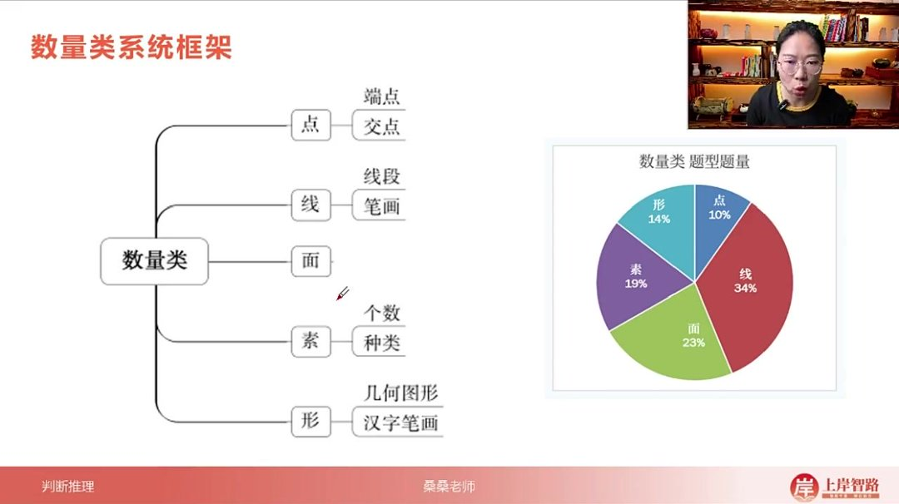
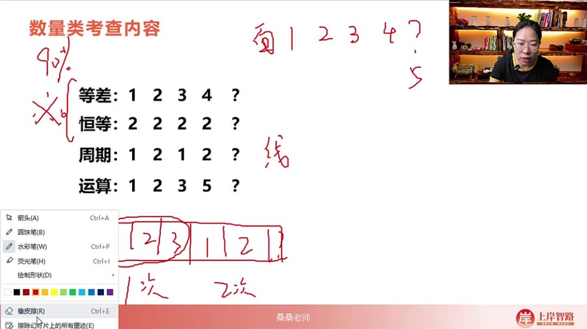
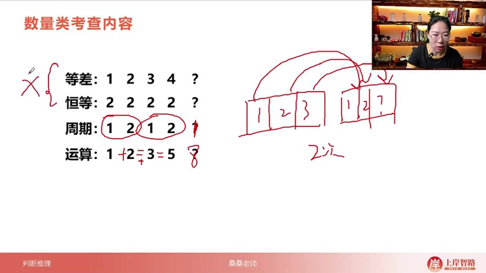
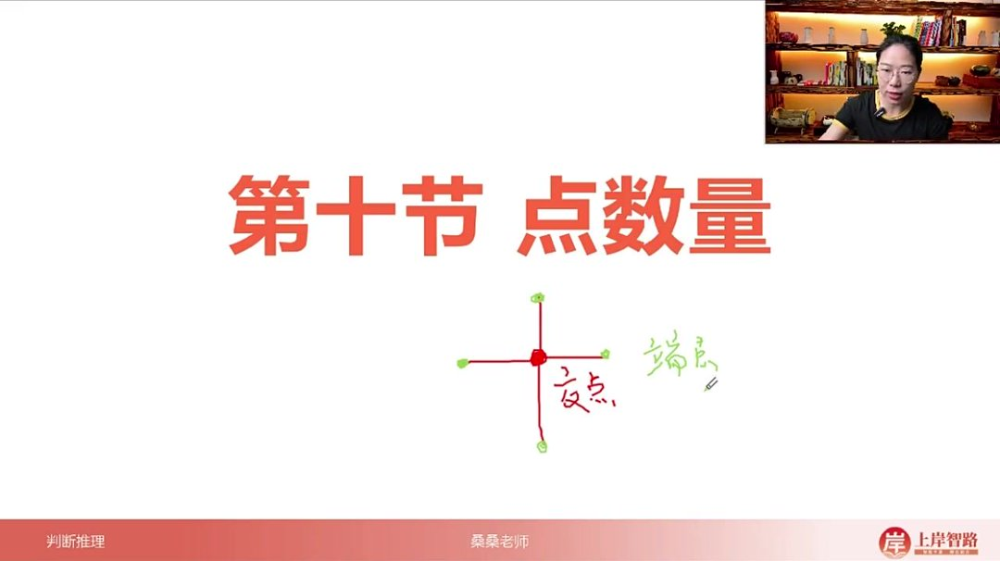
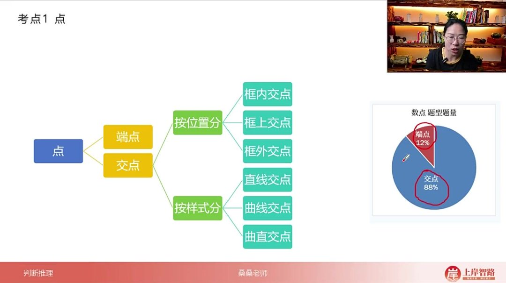
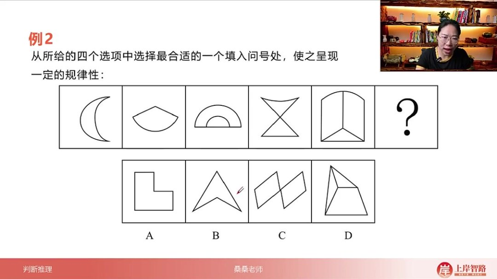
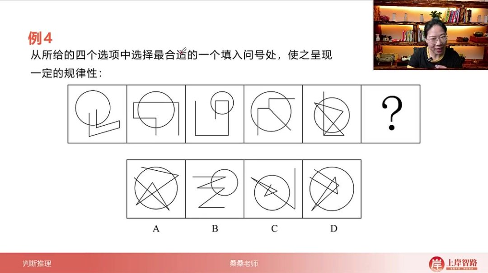
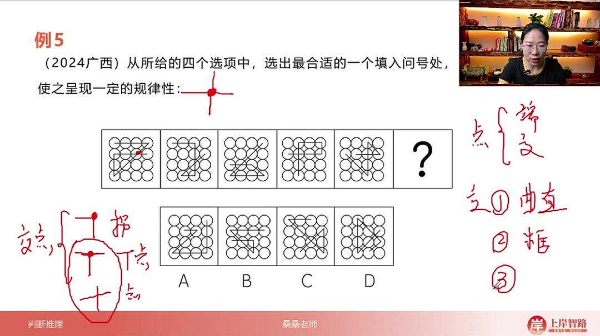

以下为AI生成的图文笔记的内容

#### 一、数量类 00:10

##### 1. 数量类系统框架 00:15

- 

- 核心考点: 包含点、线、面、素、几何图形和汉字笔画六大类

- 考察频率

  :

  - 面数量占比23%（实际考评最高）
  - 线数量占比34%（含常规线条和笔画两个子考点）
  - 素数量占比19%
  - 几何图形占比14%
  - 点数量占比10%（考评最低）

##### 2. 数量类考查内容 02:01

###### 1）等差数列与恒等数列 02:06

- 
- 等差数列: 如面数量依次为1、2、3、4，则问号处应选5
- 恒等数列: 如每个图形都有2个面，问号处同样选2个面
- 考察占比: 这两类占考题90%以上，需优先关注单调递增或恒等规律

###### 2）例题1：周期数列的规律判断 02:53

- 判断标准

  :

  - 一条式题目需至少形成两轮完整周期（如1212）
  - 两条式题目可通过位置对应验证（如一和1相同，二和2相同）

- 典型错误: 仅出现一次疑似周期（如12312）不能确认为周期规律

###### 3）例题2：运算数列的规律判断 04:23

- 
- 特征识别: 如数列1、2、3、5符合1+2=3，2+3=5的运算规律
- 解题方法: 按前项相加规律，3+5=8，问号处应选数量为8的图形

###### 4）对称数列 04:45

- 九宫格应用: 沿对角线数字对称（如斜线方向2-2-3-3-8-8）
- 一条式应用: 如数列1-2-8-2，以8为中心呈对称分布

###### 5）乱序数列 05:55

- 特征识别: 将有序数列（如1-2-3-4-5）打乱呈现（如5-3-1-2）
- 解题关键: 找出缺失数字补全（上例缺4）

###### 6）数量类计数方式 07:17

- 点数量
  - 
  - 焦点: 占点数量考题88%（如十字交叉点）
  - 端点: 占12%（如线段末端点），易被忽略但需注意
  - 典型示例: 字母"A"含3个端点和1个焦点

##### 3. 点数量 07:26

###### 1）考点1端点和焦点 08:27

- 

- 考察特点：在数量类题型中，点的考察频率最低（仅12%端点+88%交点），应作为最后考虑的解题方向

- 解题策略：当其他数量规律（线、面等）无法确定时，再考虑数点

- 端点和焦点的分类 

  08:53

  - 端点定义：图形中仅引出一条线的点，如字母"A"顶部和底部的两个点

  - 焦点定义：线条相交或转折形成的点，如字母"A"中间交叉处的三个点（每个转折处都计为焦点）

  - 典型示例

    ：以字母"A"为例：

    - 焦点数：3个（中间交叉点和两个转折点）
    - 端点数：2个（顶部和底部端点）

- 焦点细化分类：位置分类 

  09:51

  - 框的定义：任何封闭图形（圆形、三角形、多边形等）均可视为"框"

  - 位置分类

    ：

    - 框内交点：完全位于封闭图形内部的交点
    - 框上交点：位于封闭图形边界上的交点
    - 框外交点：位于封闭图形外部的交点

  - 考察重点：框内和框上交点的考察频率较高

  - 应用场景：当基础点数无规律时，可考虑按位置细分

- 焦点细化分类：样式分类 

  11:20

  - 样式分类

    ：

    - 直线交点：两条直线相交形成的点（如十字交叉）
    - 曲线交点：两条曲线相交形成的点
    - 曲直交点：直线与曲线相交形成的点（如相切点）

  - 解题层次

    ：

    - 优先区分端点与焦点
    - 焦点无规律时考虑位置分类
    - 仍无规律时最后考虑样式分类

  - 记忆要点：所有转折点都计入焦点总数，端点必须满足"单线引出"条件

###### 2）应用案例 12:01

- 例题:数端点题目练习

  - 解题技巧：从简单图形入手，优先选择端点数量最少的图形开始分析
  - 计数方法：只计算12宫格外部的"小枝丫"端点数量，内部相同结构不计
  - 规律发现：第一列端点数呈1、3、5的等差数列（公差为2），第二列7、9、11，依此类推
  - 验证过程：需完整计算所有选项的端点数，不能因找到13就停止验证其他选项
  - 考试策略：数量类题型耗时但必须仔细，避免因选项含多重规律而误判

- 例题:数焦点题目练习 

  18:07

  - 
  - 优先验证：对称性无法确定唯一答案时转焦点数量分析
  - 简单图原则：从月亮图形入手发现其有2个焦点
  - 规律识别：焦点数呈2、3、4、5、6、7的单调递增等差数列
  - 选项验证：必须完整计算各选项焦点数（C选项7个符合）
  - 考点提示：普通焦点数量是点数量考点中出现频率最高的类型

- 例题:数取值焦点题目练习 

  21:20

  - 突破口：发现相切关系时应立即标出切点
  - 规律特征：取值焦点数呈2、3、4、5的等差数列（公差为1）
  - 区分要点：需明确区分曲线-直线交点（取值）、曲线-曲线交点、直线-直线交点
  - 解题效率：标记切点可大幅提升解题速度（B选项6个取值焦点正确）
  - 易错提醒：不能将曲曲交点和直直交点误计入取值焦点

- 例题:数框内焦点题目练习 

  24:07

  - 
  - 观察技巧：不同图形中找相同元素（均有圆形框）
  - 分析策略：优先考察框内、框上等简单区域
  - 规律发现：框内焦点数呈0、1、2、3、4的等差数列
  - 验证方法：需精确区分框内/框上/框外交点（C选项5个框内焦点正确）
  - 特殊考法：焦点数量可结合框体位置进行细分考察

- 例题:数十字架焦点题目练习 

  28:22

  - 难点突破：识别特殊焦点类型（十字架焦点）
  - 分类方法：焦点可分为拐点、T字点、十字架点三类
  - 移动规律：十字架焦点按A→B→C→D顺时针移动（周期为4）
  - 选项验证：需确认十字架焦点的存在性和位置（C选项在B位正确）
  - 趋势提醒：焦点考察方式日益多样化，需掌握特殊类型识别技巧

##### 4. 点的数量总结 32:14

- 

###### 1）点的分类

- 端点与焦点: 点可分为端点和焦点两类，其中端点考查较少，焦点是重点考查对象。

###### 2）焦点的三种考法

- 曲直性考查

  :

  - 通过曲线和直线的交点数量进行考查
  - 具体分为：曲线交点、直线交点、曲直交点

- 框内框外考查

  :

  - 当图形中出现圆形、正方形、三角形、五边形、六边形等封闭图形时
  - 需要分别观察框内、框外以及框上的焦点数量

- 细化分类考查

  :

  - 根据焦点具体形态进行细分考查
  - 包括：拐弯的点、T字交点、十字架焦点等不同类型
  - 可能结合平移等其他考点进行综合考查

###### 3）焦点考查特点

- 考查重点: 焦点考查多于端点考查
- 考查方式: 可能单独考查某一类焦点，也可能结合其他考点综合考查
- 典型组合: 如十字架焦点与平移运动结合考查

#### 二、知识小结

| 知识点         | 核心内容                                             | 考试重点/易混淆点                                    | 难度系数 |
| -------------- | ---------------------------------------------------- | ---------------------------------------------------- | -------- |
| 数量类考察内容 | 包含点、线、面、数、形的数量规律                     | 面数量考评最高（23%），需区分线条与笔画考点          | ⭐⭐⭐      |
| 点数量分类     | 分为端点（12%）和焦点（88%）                         | 焦点可细化：框内/框上/框外、曲直交点                 | ⭐⭐       |
| 线数量细分     | 常规线条（直线/曲线）与笔画数考点                    | 笔画数为新兴考点（2015年后高频）                     | ⭐⭐⭐⭐     |
| 常见数量规律   | 等差数列（90%）、恒等数列（常数列）                  | 周期数列需至少两轮验证，运算数列（如斐波那契）较少考 | ⭐⭐⭐      |
| 特殊数列       | 对称数列（九宫格斜线对称）、乱序/遍历数列            | 对称数列需整体观察，乱序数列需补缺                   | ⭐⭐       |
| 焦点细化考法   | 1. 曲直分类 2. 框内/框上/框外 3. 拐点/T字/十字架焦点 | 十字架焦点结合平移（如2024广西考题）                 | ⭐⭐⭐⭐     |
| 解题技巧       | 从简单图入手，优先验证等差/恒等规律                  | 复杂图形可尝试分要素（如框内焦点）或描切点突破       | ⭐⭐⭐      |