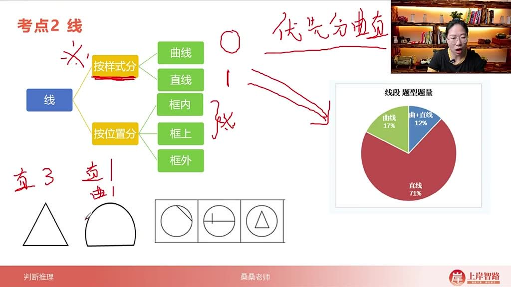
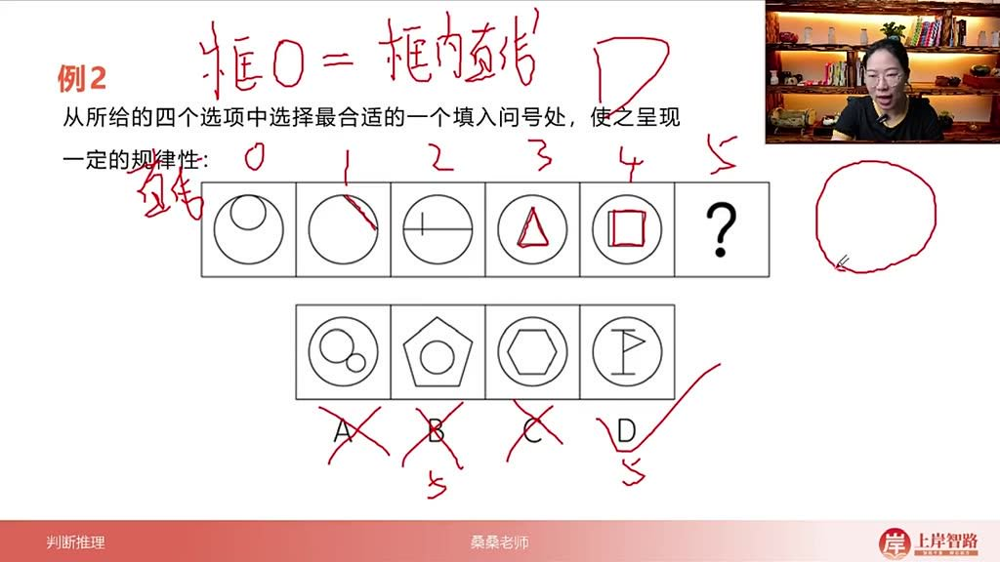
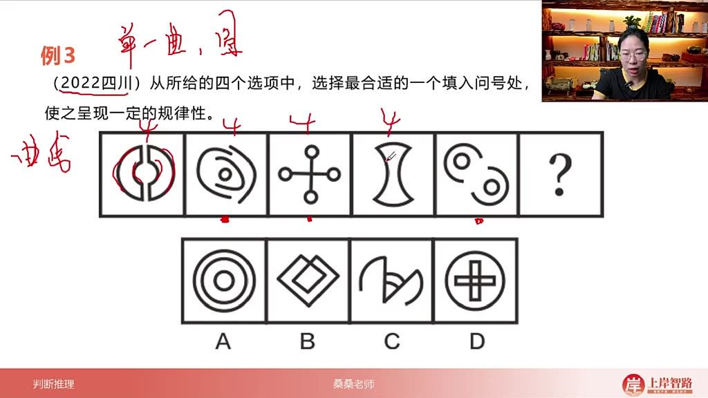
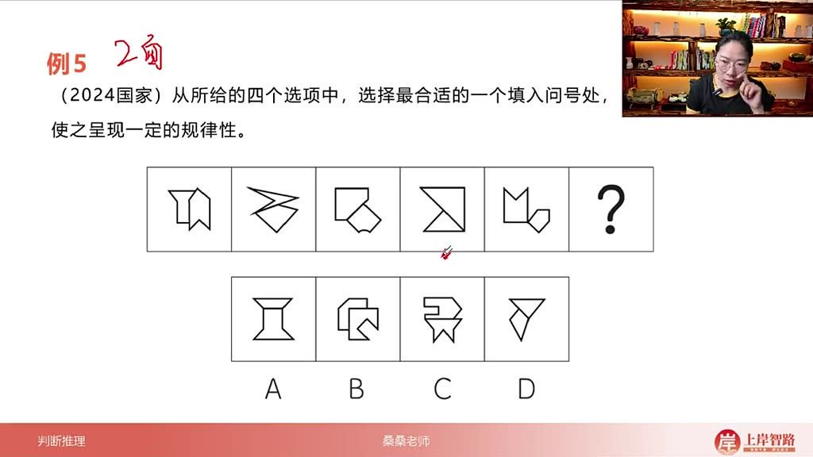

以下为AI生成的图文笔记的内容

#### 一、线数量 00:01

##### 1. 线的考察方向 01:46

- 分类维度：线可从样式和位置两个方向进行分类考察
- 考察重点：按样式分类（曲线/直线）在考试中出现频率最高，占比达88%
- 位置分类：可分为框内、框上、框外三种情况，其中框内和框上考察频率相对较高

##### 2. 按样式分类 02:27

- 

- 考察比例

  ：

  - 直线占比71%
  - 曲线占比17%
  - 曲直混合占比12%

- 计数原则

  ：

  - 优先分曲直：必须分别统计曲线和直线数量
  - 求和验证：当单独曲线/直线无规律时，再考虑总数或做差

- 标志性图形

  ：

  - 直线特征：多边形（三角形、四边形等）或单一直线
  - 曲线特征：圆形或单一曲线

##### 3. 应用案例 04:32

###### 1）例题:数直线

- 题目解析

  - 解题思路：观察到多边形特征，优先数直线

  - 计数过程

    ：

    - 第一图：外部六边形+内部2三角形=12条
    - 第二图：外部四边形+内部四边形=8条
    - 第三图：外部三角形+内部三角形=6条

  - 规律发现：内外线条数量相等

  - 答案：4D（内外均为6条直线）

###### 2）例题:数直线 08:43

- 题目解析

  - 解题思路：出现圆形框+内部直线，考察框内直线数

  - 计数过程

    ：

    - 题干图形框内直线数：0,1,2,3,4

  - 答案：4D（框内5条直线）

###### 3）例题:数曲线 10:27

- 

- 题目解析

  - 解题思路：出现多个圆形和单一曲线，优先数曲线

  - 计数过程

    ：

    - 所有题干图形曲线数均为4

  - 答案：C（4条曲线）

###### 4）例题:数直线 12:09

- 题目解析

  - 解题思路：多边形特征明显，数直线总数

  - 计数过程

    ：

    - 第一图：8直线+1曲线=9总数
    - 第二图：9直线+0曲线=9总数
    - 第三图：9直线+0曲线=9总数

  - 规律发现：曲线+直线总数恒为9

  - 答案：A（9条总线条数）

###### 5）例题:数两面线条数量 15:55

- 题目解析

  - 解题思路：两相交面均需单独数线

  - 计数过程

    ：

    - 题干每个图形的两个面线条数相同
    - 如第一图：两个面各6条线

  - 答案：B（两个面各7条线）

- 易错点

  ：

  - 注意区分面与交线
  - 不要将黑点误认为线条

#### 二、线数量的考察

- 

##### 1. 考察维度

- 分区域考察：可分为框内、框上、框外三种区域分别计算线条数量
- 方位划分：可能按上下、左右等空间方位进行划分考察
- 双面考察：2024年国考已出现同时考察两个面的创新题型
- 黑白对比：曾出现黑色图形边数与白色图形线条数保持一致的考察方式

##### 2. 特殊考察形式

- 颜色区分：当图形存在涂黑部分时，需分别计算黑色图形的边数和白色图形的线条数
- 数量对应：可能出现黑色图形边数与白色图形线条数相等的特殊规律
- 突破传统：近年考题已突破仅考察空白图形的传统模式，需注意题型创新

##### 3. 解题要点

- 全面观察：需同时关注图形的整体和局部特征
- 分类统计：遇到复杂图形应分区、分色、分面进行线条计数
- 规律验证：发现潜在规律后要通过多个图形进行验证
- 题型敏感：对新型考察方式保持警觉，避免思维定式

#### 三、知识小结

| 知识点               | 核心内容                                             | 考试重点/易混淆点                                            | 难度系数 |
| -------------------- | ---------------------------------------------------- | ------------------------------------------------------------ | -------- |
| 线数量的分类         | 线分为普通线条（直线、曲线）和笔画（汉字最少笔画数） | 普通线条计数规则：无明显弯折的线算作一条（如十字架算两条线） | ⭐⭐       |
| 线数量的考察方向     | 按样式分类（直线/曲线）或位置分类（框内/框上/框外）  | 优先分曲直计数：71%考直线，17%考曲线，12%考混合              | ⭐⭐⭐      |
| 直线数量的标志性图形 | 多边形（三角形、四边形等）或单一直线                 | 计数技巧：多边形边数即直线数（如三角形=3条）                 | ⭐⭐       |
| 曲线数量的标志性图形 | 圆形或单一曲线                                       | 计数技巧：每个圆算1条曲线（如月亮=2条曲线）                  | ⭐⭐       |
| 线数量的综合考法     | 结合框内/框外、分面计数（如两相交面的线条数相同）    | 例题四：内外线条数相等（六边形+两三角形=6+6）                | ⭐⭐⭐⭐     |
| 真题难点突破         | 二四年国考真题：两相交面的各自线条数相同             | 关键点：需分别计算两个面的线条数（如选项B两七边形=7+7）      | ⭐⭐⭐⭐⭐    |
| 特殊考法扩展         | 黑块图形的边数可能与白块线条数一致                   | 注意：黑点不计为线，仅轮廓边线参与计数                       | ⭐⭐⭐      |

|      |      |      |      |
| ---- | ---- | ---- | ---- |
|      |      |      |      |
|      |      |      |      |
|      |      |      |      |
|      |      |      |      |
|      |      |      |      |
|      |      |      |      |
|      |      |      |      |