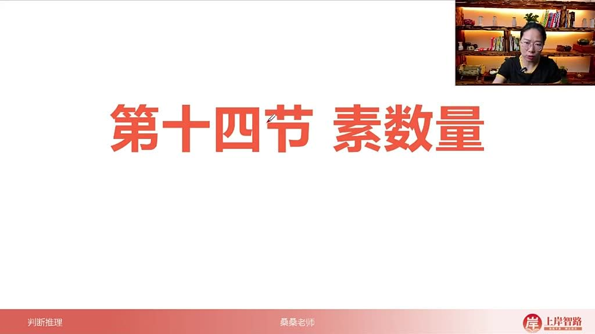
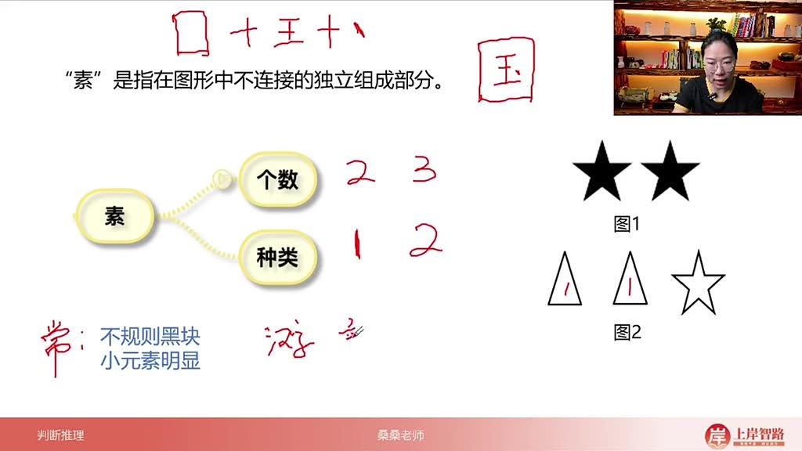
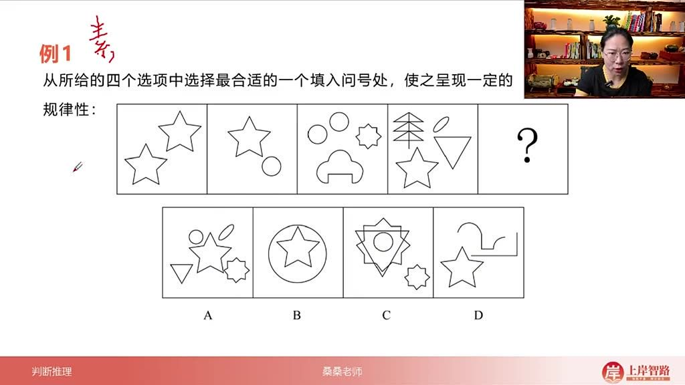
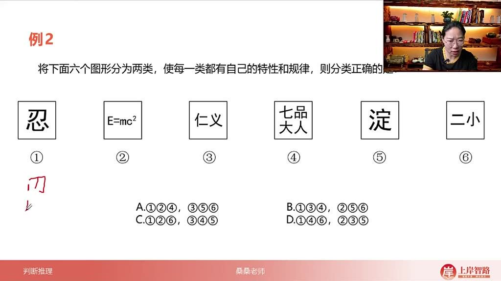
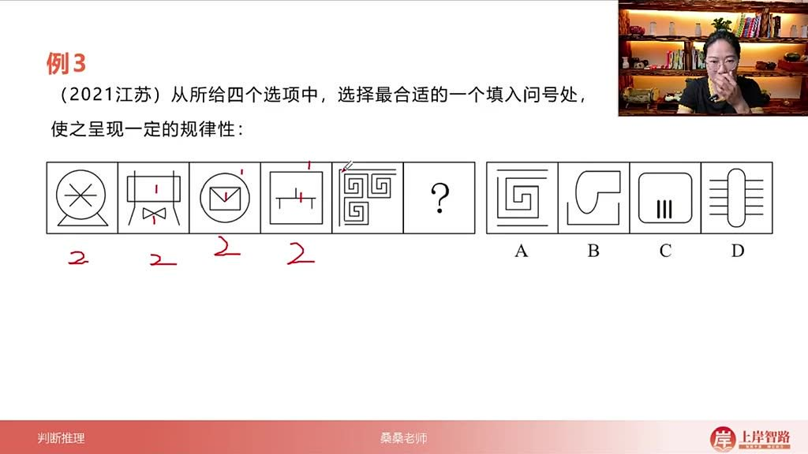
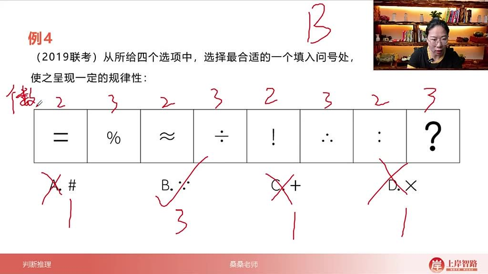
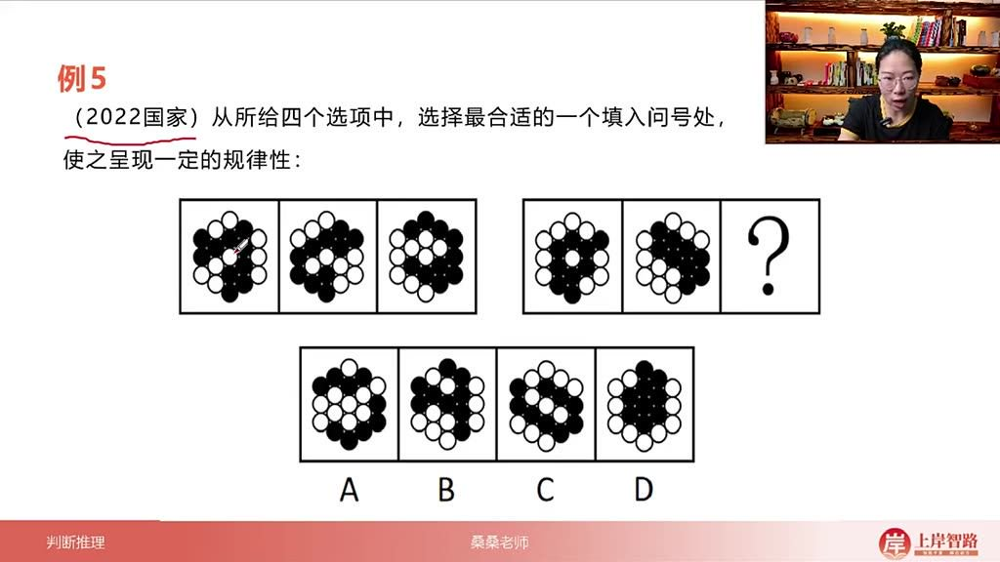

以下为AI生成的图文笔记的内容

#### 一、素数量 00:04

##### 1. 素的定义

- 
- 本质：素是指图形中不连接的独立组成部分，可以理解为小元素或小图形。
- 示例说明：以汉字"国"为例，由外框、"王"字和内部点三个独立部分组成，因此该字包含三个素。

##### 2. 素的考察 00:49

- 

- 常规考察

  ：

  - 个数：统计图形中独立部分的数量。如图1有两个五角星（2个素），图2有两个三角形和一个五角星（3个素）。
  - 种类：区分不同形状的独立部分。如图1只有一种素（都是五角星），图2有两种素（三角形和五角星）。

- 特殊考察

  ：

  - 汉字/字母：分析其笔画或组成部分数，如"忍"字可分解为六个独立部分。
  - 黑白图形：考察黑块或白块的连通部分数。

- 识别特征

  ：

  - 当出现不规则黑块或明显小元素（如多个五角星、圆形等）时，可考虑素数量。
  - 近年考题趋向于考察汉字、字母、标点符号及黑白图形的部分数。

##### 3. 应用案例 02:04

###### 1）例题:数的种类规律

- 
- 题目解析：
  - 观察题干图形包含多种小元素（五角星、圆形等）。
  - 个数规律不明显（2,2,4,4），但种类呈现递增规律（1,2,3,4）。
  - 需选择包含5种素的选项，正确答案为A。
  - 易错点：容易混淆个数与种类的区别，需注意相同形状的元素属于同一种类。

###### 2）例题:汉字素数量 03:03

- 
- 题目解析：
  - 分析每个汉字/符号的独立部分数："忍"=6，"e=MC^2"=6，"仁义"=5，"七品大人"=6，"淀二小"=5。
  - 发现规律：①④⑥=6部分，②③⑤=5部分，正确答案为A。
  - 解题技巧：对于汉字类题目，需仔细观察笔画间的连接关系，不连通即为独立部分。

###### 3）例题:连通计数 05:25

- 
- 题目解析：
  - 每幅图均由两部分组成（内外、上下等分离结构）。
  - 排除法：A=3部分，B=2部分，C=4部分，D=1部分。
  - 正确答案为B。
  - 重要原则：无论部分大小，只要不连通就单独计数，连通则视为整体。

###### 4）例题:标点符号素数量 06:56

- 
- 题目解析：
  - 分析符号部分数：等号=2，百分号=3，约等号=2，除号=3，感叹号=2，问号=3。
  - 规律为2-3交替，问号处应为3部分。
  - 正确答案为B（∵符号由三个点组成）。
  - 注意：相同形状的部分仍按实际数量计算，不合并种类。

###### 5）例题:黑白球素数量 08:17

- 
- 题目解析：
  - 第一组：黑球均为1部分；白球部分数递减（3→2→1）。
  - 第二组：延续相同规律，需选白球1部分的选项。
  - 排除法：B=3部分，C=2部分，D=1部分。
  - 正确答案为D。
  - 特殊考点：在黑白图形中，可能单独考察黑或白部分的数量规律。

##### 4. 素数量的总结 10:29

- 核心要点

  ：

  - 常规考察小图形的个数和种类。
  - 进阶考察汉字/字母/符号的部分数及黑白图形的连通性。

- 解题策略

  ：

  - 出现明显小元素或不规则黑块时优先考虑素数量。
  - 对连通部分严格判断，注意微小分离部分。

- 近年趋势

  ：

  - 题目形式更加灵活，常结合汉字、符号等特殊元素。
  - 可能与其他考点（如位置、样式）结合考查。

#### 二、知识小结

| 知识点                   | 核心内容                                                     | 考试重点/易混淆点                                    | 难度系数 |
| ------------------------ | ------------------------------------------------------------ | ---------------------------------------------------- | -------- |
| 素的概念                 | 素是图形中不连接的独立组成部分，如汉字“国”由外框、王、点三个素构成 | 区分素的个数与种类（如两个五角星是2个素但1种素）     | ⭐⭐       |
| 素的常规考法             | 1. 数小图形个数/种类（五角星、圆形等）2. 汉字/字母/标点符号的部分数（如“忍”字分6部分） | 汉字部分数需注意笔画是否连通（如“点”单独计为1部分）  | ⭐⭐⭐      |
| 黑白块素数量             | 考察黑块或白块的连通部分数（如黑球1部分+白球3部分）          | 易与黑白运算、平移考点混淆，需优先验证部分数         | ⭐⭐⭐⭐     |
| 真题解析（例题1）        | 通过图形种类数量解题（题干图形种类数递增：1→2→3→4，选5种的A选项） | 快速排除干扰项（B/C/D种类数不符）                    | ⭐        |
| 真题解析（例题2）        | 汉字/字母部分数分组（如“忍=6部分，e=mc²=6部分”为一组）       | 需拆分复合字符（如“等号”计为2部分，“平方”计为1部分） | ⭐⭐⭐      |
| 真题解析（例题4）        | 标点符号部分数规律（等号2部分→百分号3部分→约等号2部分→除号3部分） | 注意符号对称性（相同符号部分数固定，如“%”恒为3部分） | ⭐⭐       |
| 黑白球部分数（2022国考） | 黑球恒为1部分，白球部分数递减（3→2→1）                       | 排除法优先（A黑球2部分直接排除）                     | ⭐⭐⭐⭐     |

|      |      |      |      |
| ---- | ---- | ---- | ---- |
|      |      |      |      |
|      |      |      |      |
|      |      |      |      |
|      |      |      |      |
|      |      |      |      |
|      |      |      |      |
|      |      |      |      |

|      |      |      |      |
| ---- | ---- | ---- | ---- |
|      |      |      |      |
|      |      |      |      |
|      |      |      |      |
|      |      |      |      |
|      |      |      |      |
|      |      |      |      |
|      |      |      |      |