#### 一、基期量 00:05

##### 1. 题型识别 00:16

-   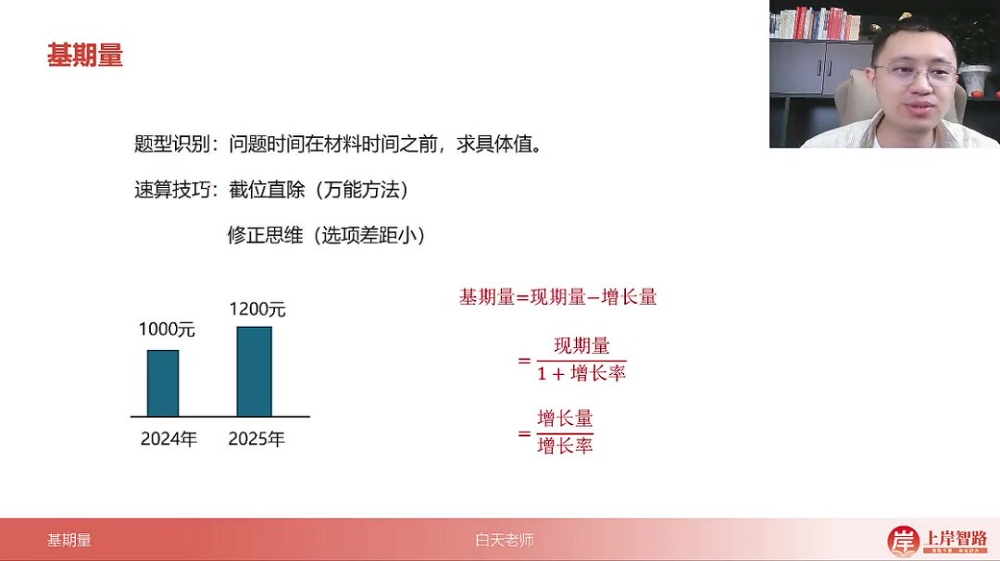

-   时间特征：问题时间在材料时间之前，求具体值

-   核心逻辑：通过现期数据反推过去值（如 2025 年数据求 2024 年值）

-   典型示例

    ：

    -   2024 年赚 1000 元，2025 年赚 1200 元 → 基期量 1000 元
    -   增长量 200 元对应增长率 20%

###### 1）例题:基期量计算 00:54

-   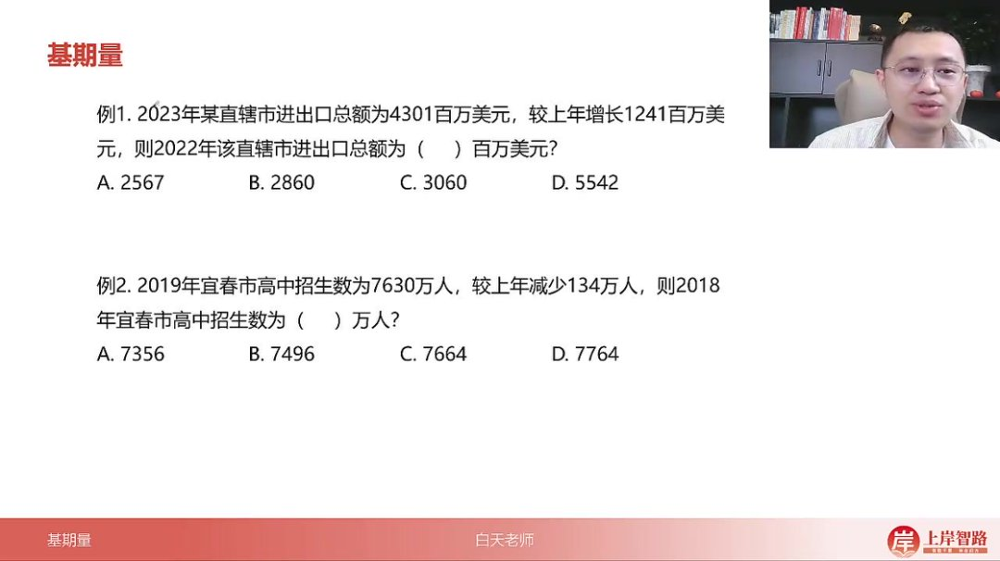
-   题目解析
    -   材料给 2023 年数据，问 2022 年值 → 典型基期量计算
    -   选项首位差异明显（2/2/3/5），适合截位直除
    -   答案：C（3060）

###### 2）例题:基期量计算 01:08

-   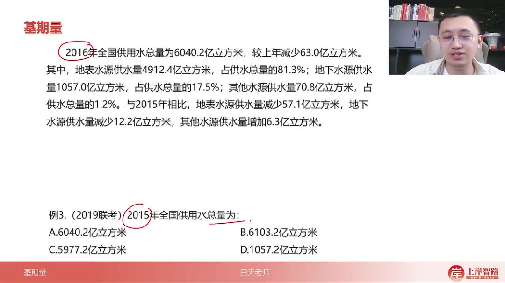
-   题目解析
    -   2016 年数据求 2015 年值 → 基期计算
    -   关键数据：6040.2 亿立方米（现期），减少 63.0 亿立方米（增长量）
    -   可直接用基期=现期-增长量公式
    -   答案：B（6103.2）

##### 2. 公式 01:24

-   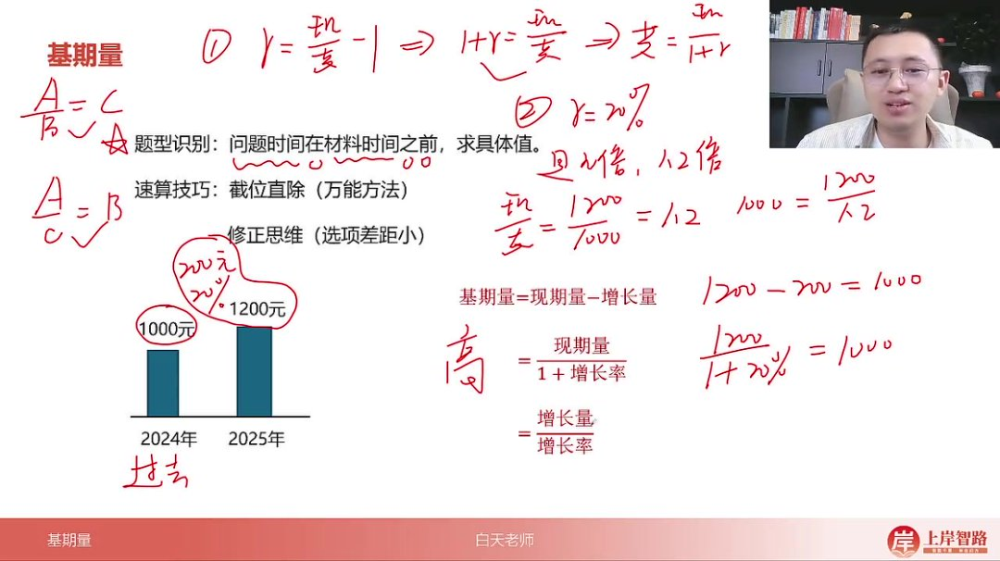

-   三大公式

    ：

    -   定义式：基期量=现期量-增长量（如 1200 元-200 元=1000 元）

    -   核心公式

        ：

        基期量=现期量 1+增长率基期量=\frac{现期量}{1+增长率}基期量=1+增长率现期量

        （考评最高，如

        12001+20%=1000\frac{1200}{1+20\%}=10001+20%1200=1000

        ）

        -   推导逻辑：由增长率定义式

            r=现期基期 −1r=\frac{现期}{基期}-1r=基期现期 −1

            变形得到

    -   补充公式

        ：

        基期量=增长量增长率基期量=\frac{增长量}{增长率}基期量=增长率增长量

        （考评最低，如

        20020%=1000\frac{200}{20\%}=100020%200=1000

        ）

-   记忆要点

    ：

    -   公式 2 需重点掌握，考试出现频率最高
    -   公式 3 易被忽略，但历年真题曾考查过

##### 3. 速算技巧 04:21

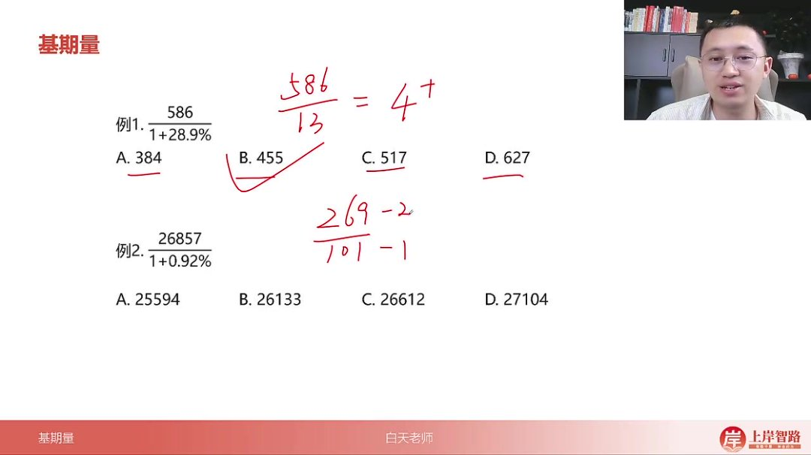

###### 1）例题:基期量计算 04:49

-   题目解析

    -   5861+28.9%\frac{586}{1+28.9\%}1+28.9%586

        转化为

        5861.3\frac{586}{1.3}1.3586

    -   选项首位差异大（3/4/5/6），留两位直除

    -   估算：586÷13≈45，对应 B 选项

    -   答案：B（455）

###### 2）例题:基期量计算 05:15

-   题目解析

    -   268571+0.92%\frac{26857}{1+0.92\%}1+0.92%26857

        采用修正思维

    -   将分母 1.0092 修正为 1.01，分子同步调整

    -   计算：269÷1.01≈266，对应 C 选项

    -   答案：C（26612）

###### 3）基期和差 05:41

-   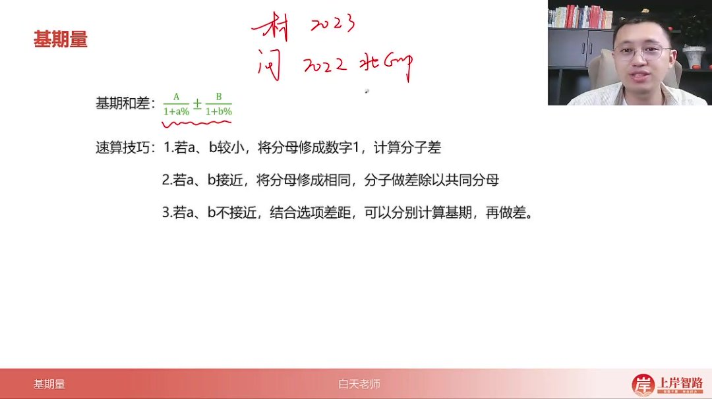

-   计算模型

    ：

    A1+a%±B1+b%\frac{A}{1+a\%} \pm \frac{B}{1+b\%}1+a%A±1+b%B

-   速算方法

    ：

    -   增长率较小（<10%）：分母修正为 1，直接计算分子差
    -   增长率接近：统一分母后计算分子差
    -   增长率差异大：分别计算基期再做差

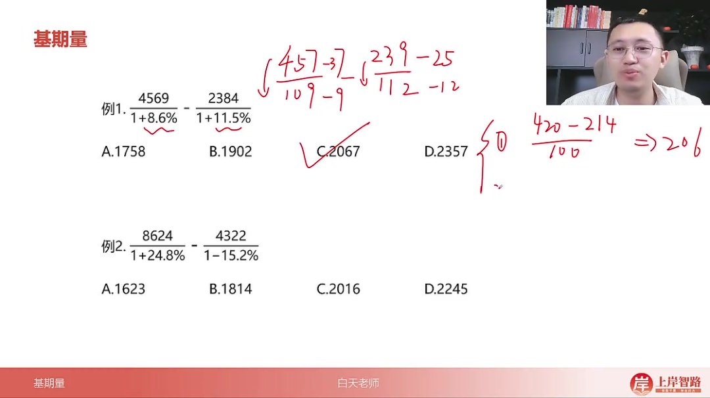

-   例题:基期量计算

    08:18

    -   题目解析
        -   方法一：将分母统一修正为 100，计算 420-214≈206
        -   方法二：将左边分母修正为 112，计算(469-239)/112≈2.06
        -   答案：C（2067）

-   例题:基期量计算

    10:18

    -   题目解析
        -   增长率差异大（+24.8% vs -15.2%），建议分别计算
        -   左边：8624÷1.248≈6880（利用 125=1/8 换算）
        -   右边：4322÷0.848≈5100
        -   差值 ≈1800，最接近 B 选项
        -   答案：B（1814）

##### 4. 应用案例 11:55

###### 1）例题：基期量计算

-   审题要点：题目给出 2023 年某直辖市进出口总额为 4301 百万美元，较上年增长 1241 百万美元，要求计算 2022 年该市进出口总额。

-   解题思路

    ：

    -   明确现期量（2023 年值）为 4301 百万美元
    -   增长量为 1241 百万美元（正增长）
    -   基期量=现期量-增长量=4301-1241=3060

-   速算技巧：先看前两位数做差，43-12=31，对应选项 C 的 3060 最接近 3100

-   答案：C

###### 2）例题：基期量计算 12:21

-   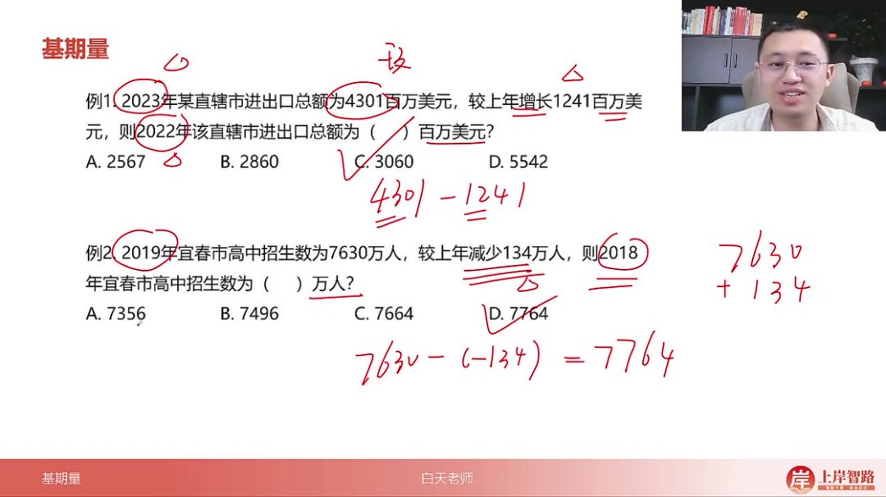

-   审题要点：2019 年宜春市高中招生数 7630 万人，较上年减少 134 万人，求 2018 年招生数。

-   解题关键

    ：

    -   注意增长量为负值（-134）
    -   基期量=现期量-增长量=7630-(-134)=7764

-   易错警示

    ：

    -   避免误算为 7630-134=7496（错误选项 B）
    -   负负得正，减负数相当于加正数

-   答案：D

###### 3）例题：基期量计算 12:56

-   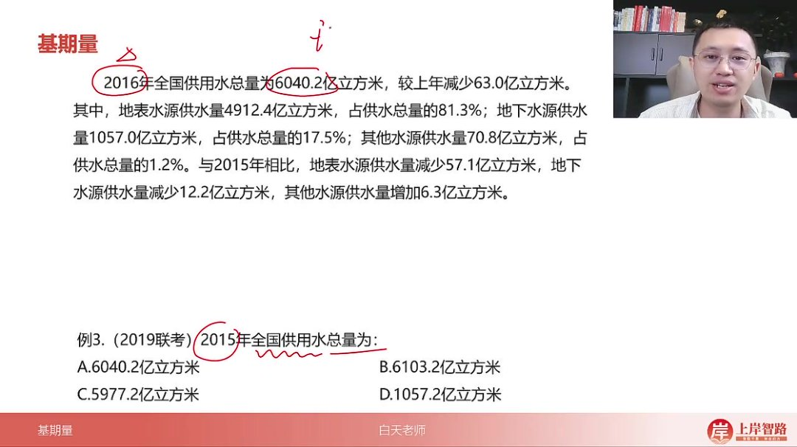

-   审题要点：2016 年全国供用水总量 6040.2 亿立方米，较上年减少 63.0 亿立方米，求 2015 年总量。

-   解题过程

    ：

    -   现期量 6040.2 亿立方米
    -   增长量-63.0 亿立方米
    -   基期量=6040.2-(-63.0)=6103.2

-   速算验证：6040+63≈6100，对应选项 B

-   答案：B

###### 4）例题：基期量计算（增长率形式）13:19

-   公式应用：基期量=现期量/(1+增长率)

-   例题解析

    ：

    -   2022 年 1 月末贷款余额 196.65 万亿元，同比增长 11.5%
    -   计算：197/(1+11.5%)≈197/1.115

-   修正技巧

    ：

    -   将 1.115 近似为 1.12
    -   分子分母同减 10%：197-19.7≈177

-   答案：B

###### 5）例题：负增长率计算 14:34

-   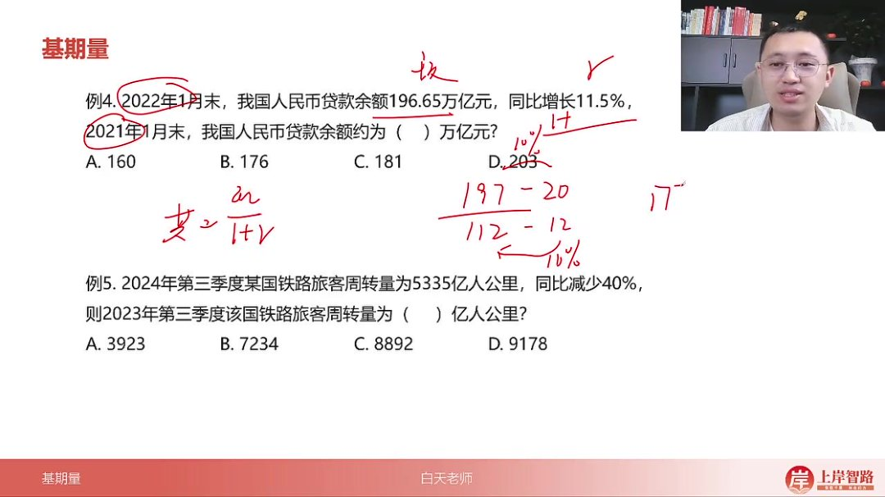

-   题目特征：2024 年第三季度旅客周转量 5335 亿人公里，同比减少 40%

-   计算要点

    ：

    -   基期量=5335/(1-40%)=5335/0.6
    -   速算：53÷6≈8.8，对应选项 C（8892）

-   首位估算法：直接判断商的首位为 8，排除其他选项

-   答案：C

###### 6）例题：两年平均增长率 16:33

-   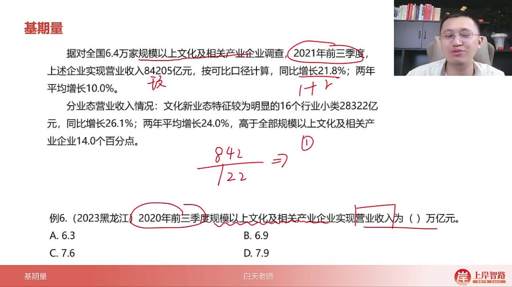

-   题目背景：2021 年前三季度营业收入 84205 亿元，同比增长 21.8%，两年平均增长 10.0%

-   解题方法

    ：

    -   方法 1：首位估算法，842÷122≈6.9（选项 B）
    -   方法 2：122≈125=1/8，842×8≈6736，接近 6900

-   修正技巧：分子分母同减 22，按 7 倍关系调整

-   答案：B

###### 7）例题：月份数据筛选 17:41

-   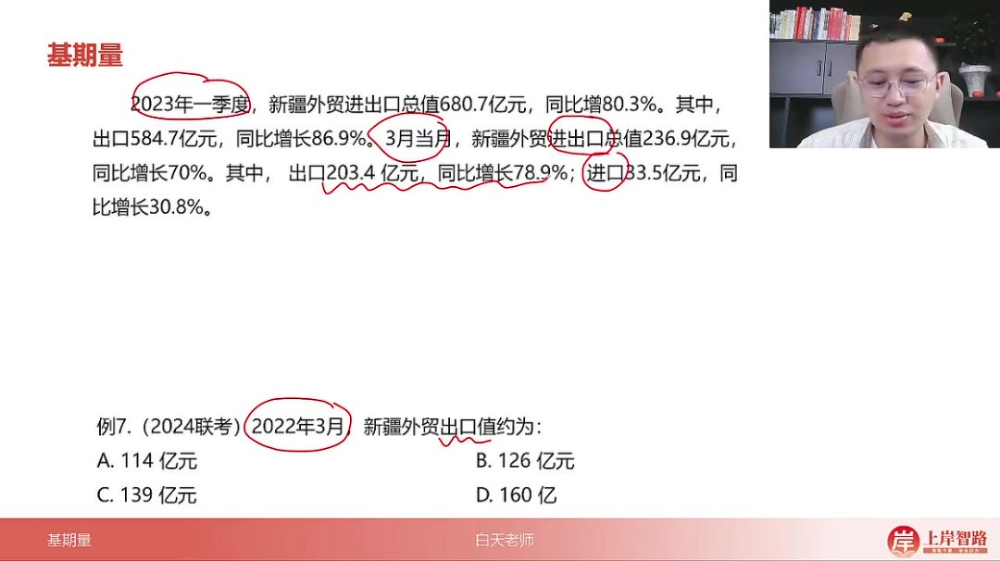

-   审题关键：注意区分季度数据与单月数据

-   计算过程

    ：

    -   3 月出口值 203.4 亿元，同比增长 78.9%
    -   基期量=203.4/(1+78.9%)≈204/1.79

-   简化技巧：将三位数改为两位数计算（205/18≈11.4）

-   答案：A

###### 8）例题：百分数修正法 18:14

-   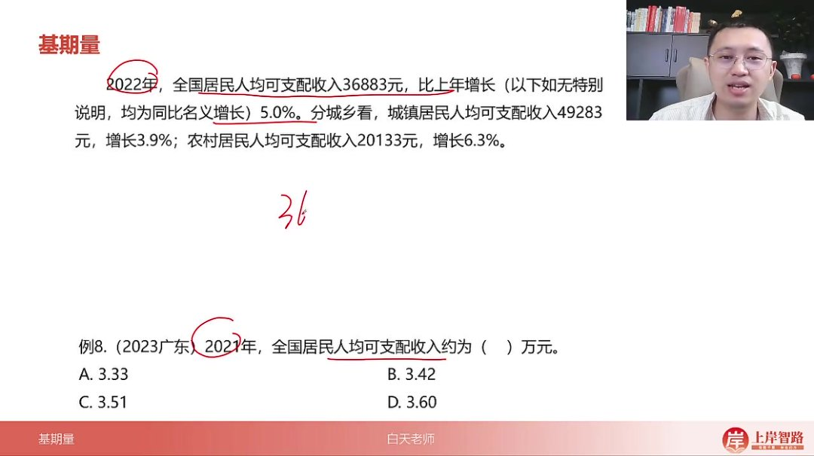

-   题目数据：2022 年全国居民人均收入 36883 元，增长 5.0%

-   修正计算

    ：

    -   基期量=368/(1+5%)=368/1.05
    -   分母减 5，分子减约 18（5 的 3.6 倍）
    -   结果 ≈368-18=350

-   答案：C

###### 9）例题：供水总量计算 18:46

-   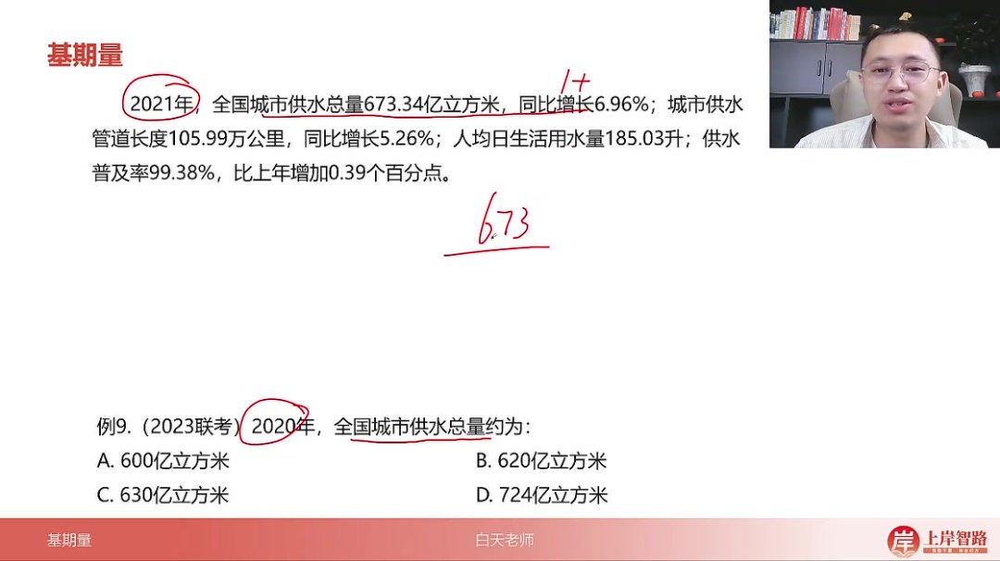

-   计算过程

    ：

    -   2021 年供水总量 673.34 亿立方米，增长 6.96%
    -   基期量=673/(1+6.96%)≈673/1.07

-   修正技巧

    ：

    -   分母减 7，分子减 42（7 的 6 倍）
    -   结果 ≈673-42=631

-   答案：C

###### 10）例题：时间范围陷阱 20:33

-   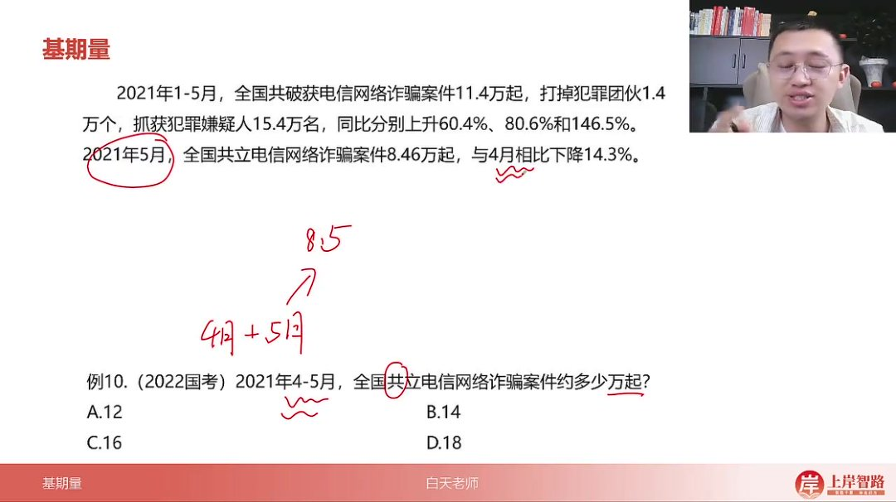

-   审题重点：明确要求计算的是 4-5 月案件总和

-   解题步骤

    ：

    -   5 月案件数 8.46 万起（现期）
    -   4 月案件数=8.5/(1-14.3%)≈8.5/0.857≈9.92
    -   总和 ≈8.5+9.92=18.42

-   选项分析法：8.5 除以小于 1 的数必大于 8.5，两数和必大于 17

-   答案：D

###### 11）例题：单产基期计算 23:08

-   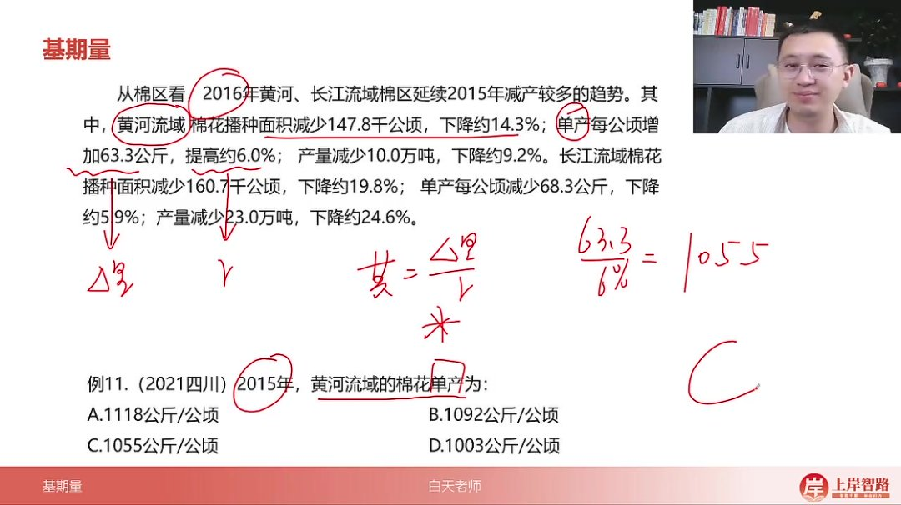

-   公式应用：基期量=增长量/增长率

-   题目数据

    ：

    -   单产增长量 63.3 公斤/公顷
    -   增长率 6%
    -   计算：63.3/6%=1055

-   直除技巧：首位商 1，次位商 0，第三位商 5

-   答案：C

###### 12）例题：贸易顺差计算 24:20

-   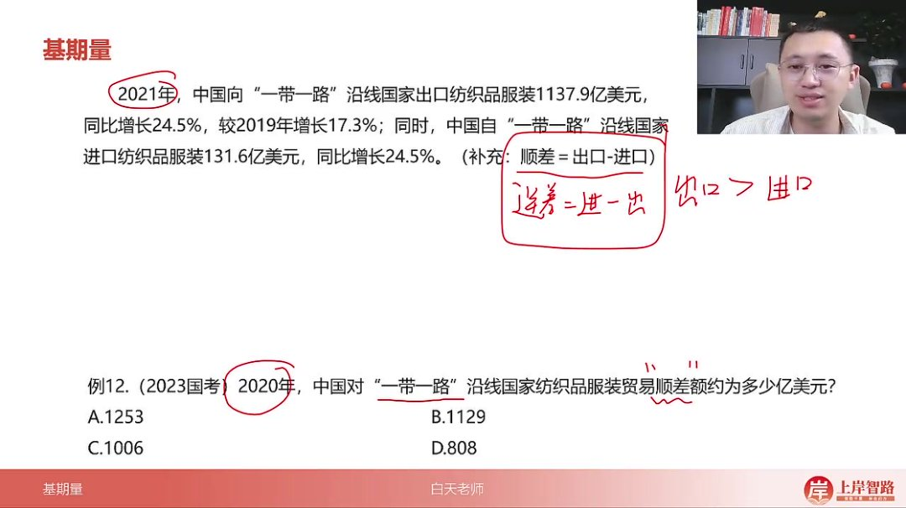

-   概念解析

    ：

    -   顺差=出口-进口（出口>进口）
    -   逆差=进口-出口（进口>出口）

-   计算技巧

    ：

    -   基期顺差=(1138/1.245)-(132/1.245)
    -   分母相同，直接计算分子差：1138-132=1006
    -   1006/1.245≈1006×0.8≈805

-   答案：D

###### 13）例题：产量销量比较 26:48

-   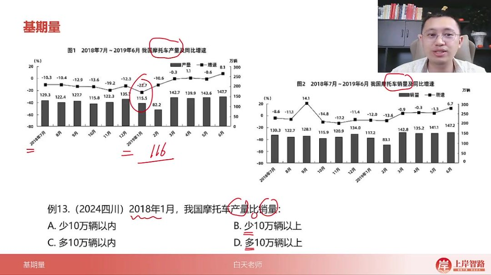

-   数据筛选：注意区分产量（图 1）与销量（图 2）

-   计算过程

    ：

    -   产量基期=116/(1-23%)=116/0.77
    -   销量基期=117/(1-12%)=117/0.88

-   统一分母法：将两个分母都调整为 88 进行修正计算

-   结果判断：差值为正且大于 10

-   答案：D

###### 14）例题：收入赔付差额

-   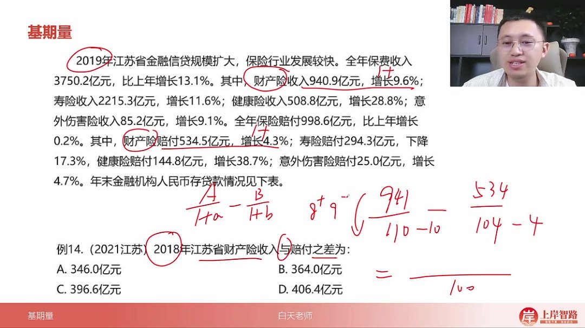

-   计算模型：基期差=收入基期-赔付基期

-   具体计算

    ：

    -   收入基期=941/1.096≈941-85=856
    -   赔付基期=534/1.043≈534-21=513
    -   差值 ≈856-513=343

-   近似原则：选项差距允许适当估算

-   答案：A

#### 二、知识小结

| 知识点         | 核心内容                                                                                               | 考试重点/易混淆点                                                 | 难度系数 |
| -------------- | ------------------------------------------------------------------------------------------------------ | ----------------------------------------------------------------- | -------- |
| 基期量题型识别 | 问题时间在材料时间之前，求过去的值即为基期量。示例：材料给 2023 年，问 2022 年值 → 求基期              | 易错点：忽略时间对比，误判为现期量计算                            | ⭐⭐     |
| 基期量计算公式 | 1. 定义式：基期=现期-增长量 2. 核心公式：基期=现期 ÷(1+增长率)3. 低频公式：基期=增长量 ÷ 增长率        | 高频考点：公式 2 应用最广，需熟练掌握推导（现期 ÷ 基期=1+增长率） | ⭐⭐⭐   |
| 速算技巧       | 1. 截位直除：选项差距大留两位，差距小留三位 2. 修正思维：增长率较小时，将分母修正为 1 或相同值简化计算 | 关键技巧：选项首位不同时优先估首位；修正时注意分子分母同步调整    | ⭐⭐⭐⭐ |
| 基期和差问题   | 求两个基期量的和/差，需分别计算后运算。速算方法：若增长率接近，可统一分母后分子相减                    | 易混淆点：修正后漏除共同分母（如例 1 选项误选 D）                 | ⭐⭐⭐   |
| 顺差/逆差概念  | 顺差=出口-进口（赚钱）；逆差=进口-出口（亏钱）基期顺差计算：分别求基期出口和进口再做差                 | 关联考点：进出口增长率差异对结果的影响                            | ⭐⭐     |
| 实战例题解析   | 例 1（基期差）：修正分母至相同后分子相减（206 选 C）例 11（增长量 ÷ 增长率）：63.3÷6%≈1055（选 C）     | 典型错误：例 7 误用进口数据代替出口；例 10 忽略四月为基期量       | ⭐⭐⭐⭐ |
