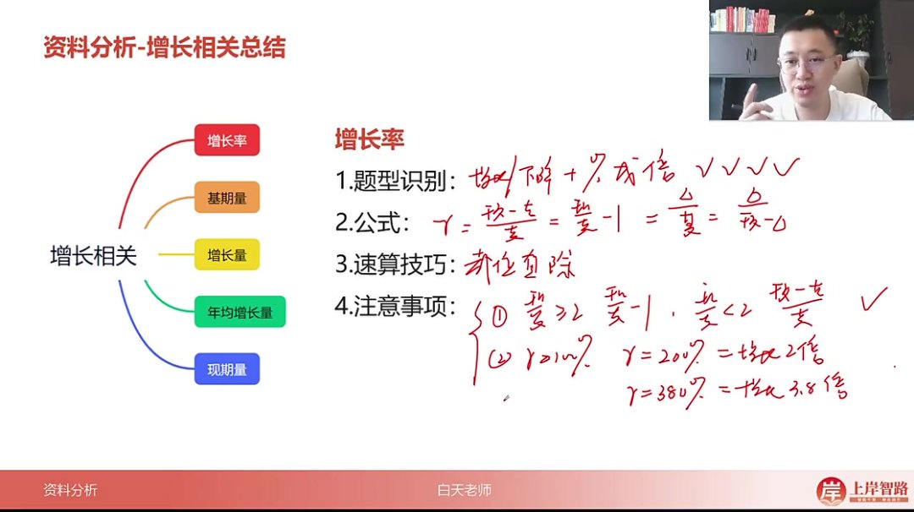
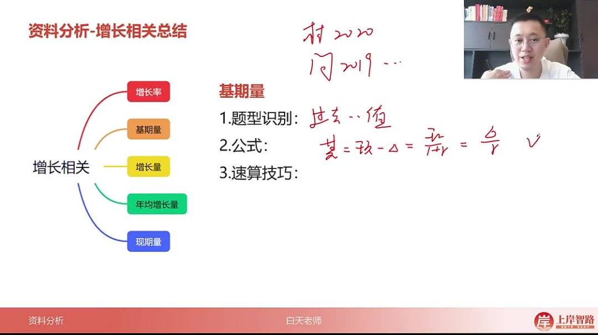
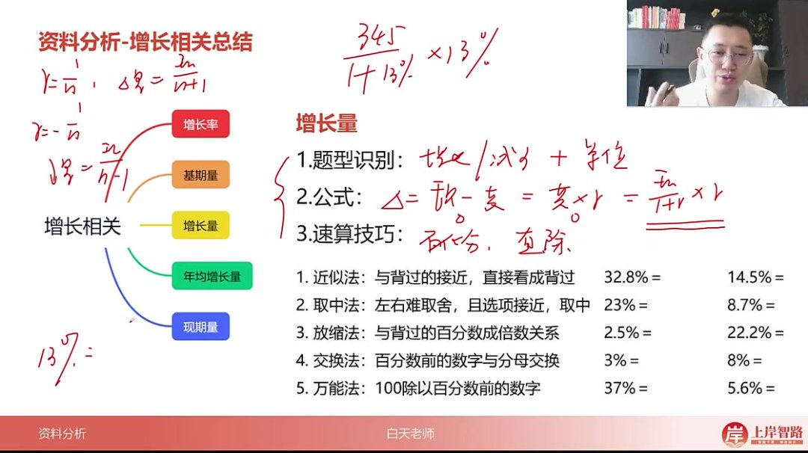
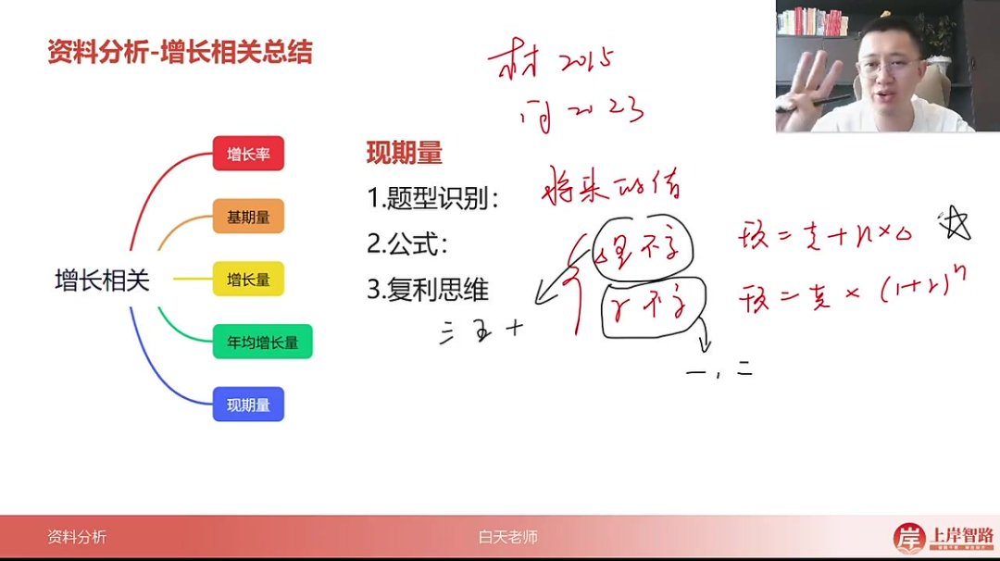

以下为 AI 生成的图文笔记的内容

#### 一、增长相关总结 00:02

##### 1. 增长率 02:42

-   

-   题型识别：出现"增长/下降+百分数/几成/几倍"或"增速/增幅/降幅/变化幅度"等表述

-   核心公式

    ：

    -   γ=现期 − 基期基期\gamma = \frac{现期-基期}{基期}γ=基期现期 − 基期

        （可变形为

        现期基期 −1\frac{现期}{基期}-1 基期现期 −1

        ）

    -   γ=增长量基期量\gamma = \frac{增长量}{基期量}γ=基期量增长量

    -   γ=增长量现期量 − 增长量\gamma = \frac{增长量}{现期量-增长量}γ=现期量 − 增长量增长量

-   计算技巧

    ：

    -   现期基期差距>2 倍时：直接

        现期基期 −1\frac{现期}{基期}-1 基期现期 −1

    -   现期基期差距较小时：先减后除更简便

-   特殊表达

    ：

    -   增长率 200%=增长 2 倍
    -   增长率 380%=增长 3.8 倍

-   倍数关系

    ：

    -   A 是 B 的几倍：A÷B

    -   A 比 B 多几倍：

        A÷B−1A÷B-1A÷B−1

-   符号规则：同比下降需带负号计算

-   记忆案例：工资从 1000 元 →1200 元，增长量 200 元对应增长率 20%（200/1000 或 1200/1000-1）

##### 2. 基期量 06:01

-   

-   题型特征：求过去的值（如材料给 2020 年，问题问 2019 年）

-   三大公式

    ：

    -   基期=现期-增长量
    -   基期=现期 1+r 基期=\frac{现期}{1+r}基期=1+r 现期
    -   基期=增长量 r 基期=\frac{增长量}{r}基期=r 增长量

-   速算方法

    ：

    -   选项差距大：首位直除
    -   选项差距小：分母修正（修成 1 或整百）

-   特殊考法

    ：

    -   基期差计算：优先使用修正思维
    -   江苏考生注意：需提前一年计算（如 2016-2020 年用 2015 年数据）

##### 3. 增长量 07:36

-   

-   题型标志：增长/减少+具体单位（如元、吨等）

-   计算公式

    ：

    -   增长量=现期-基期
    -   增长量=基期 ×r 增长量=基期 ×r 增长量=基期 ×r
    -   增长量=现期 1+r×r 增长量=\frac{现期}{1+r}×r 增长量=1+r 现期 ×r

-   速算技巧

    ：

    -   百化分

        ：

        -   口诀：正加一（

            r=1nr=\frac{1}{n}r=n1

            →

            增长量=现期 n+1 增长量=\frac{现期}{n+1}增长量=n+1 现期

            ）

        -   示例：13%→7.7 分之一 →345÷8.7

    -   直除法

        ：

        -   示例：

            3451.13×0.13≈345÷113×13≈39\frac{345}{1.13}×0.13≈345÷113×13≈391.13345×0.13≈345÷113×13≈39

-   辅助方法

    ：

    -   近似法（接近熟记百分数）
    -   取中法（选项接近时）
    -   交换法（如 13%→1/7.7）

##### 4. 年均增长量 10:40

-   问题特征：时间段+平均/年均增长+单位

-   基础公式

    ：

    末期 − 初期间隔年份\frac{末期-初期}{间隔年份}间隔年份末期 − 初期

-   特殊情形

    ：

    -   江苏卷：需提前一年（2016-2020 年用 2015 年数据）
    -   五年计划：全国适用提前一年（如十三五期间用 2015 年数据）

-   计算要点：简单减法除法，无特殊技巧

##### 5. 现期量 12:55

-   

-   题型识别：求将来的值（如材料给 2015 年，问 2023 年）

-   预测模型

    ：

    -   增量不变

        ：

        现期=基期+n× 增长量现期=基期+n× 增长量现期=基期+n× 增长量

        -   适用长期预测（5 年/10 年后）
        -   可求单个值或比较两个未来值

    -   增率不变

        ：

        现期=基期 ×(1+r)n 现期=基期 ×(1+r)^n 现期=基期 ×(1+r)n

        -   多用于 1-2 年短期预测
        -   复利效应：保持增率不变时增量会逐渐变大

-   解题策略

    ：

    -   长期预测优先考虑增量不变模型
    -   注意题目是否要求比较未来值或进行复合运算

#### 二、知识小结

| 知识点     | 核心内容                                                                                             | 考试重点/易混淆点                                           | 难度系数 |
| ---------- | ---------------------------------------------------------------------------------------------------- | ----------------------------------------------------------- | -------- |
| 增长率计算 | 公式：(现期量-基期量)/基期量 或 增长量/基期量；速算技巧：截位直除                                    | 正负号处理（下降需带负号）、增长几倍 vs 是几倍（差 1 关系） | ⭐⭐     |
| 基期量计算 | 公式：现期量-增长量、现期量/(1+增长率)、增长量/增长率；速算：直除/修正法                             | 基期差计算（修正思维优先）、选项差距大时首位估算法          | ⭐⭐⭐   |
| 增长量计算 | 公式：现期量-基期量、基期量 × 增长率、现期量/(1+增长率)× 增长率；速算：百划分（正加一/负减一）或直除 | 13%≈1/7.7（交换法）、增长率非整数时直除优先                 | ⭐⭐⭐⭐ |
| 年均增长量 | 公式：(末期-初期)/间隔年份；江苏卷/五年计划需提前一年（如十三五用 2015 年数据）                      | 江苏特殊性、五年计划时间范围（2016 年初 →2020 年末）        | ⭐⭐     |
| 现期量预测 | 保持增量不变：基期+n× 增长量；保持增率不变：基期 ×(1+r)^n（n>2 年极少考）                            | 复利思维（增量略微变大）、一年后/两年后高频考点             | ⭐⭐⭐   |
| 整体关系   | 增长量、增长率、现期量、基期量四者公式互通（例：工资从 1000→1200 推导所有公式）                      | 数字代入法（遗忘公式时用具体数值反推）                      | ⭐⭐     |
