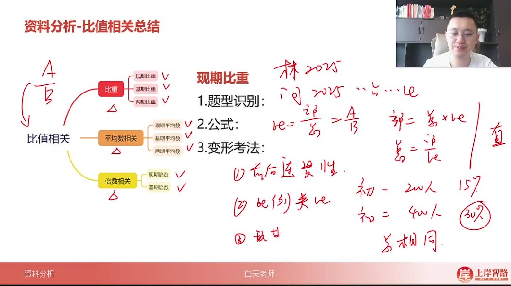
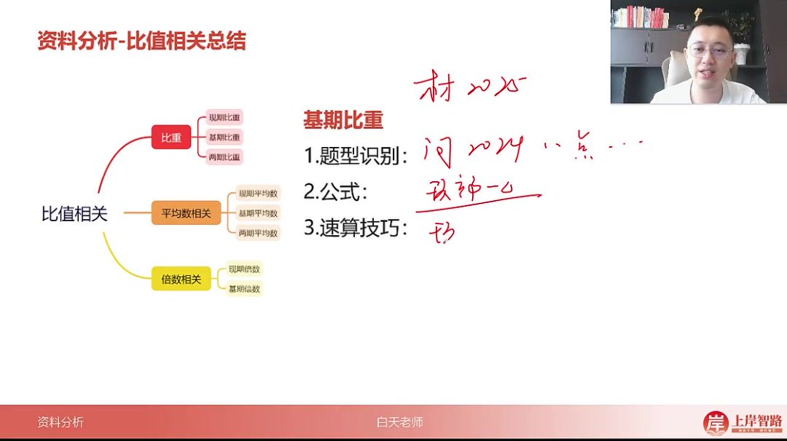
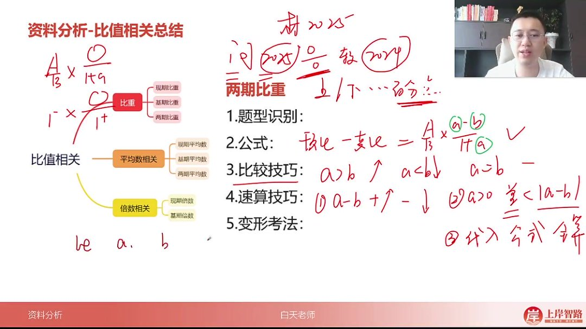

以下为 AI 生成的图文笔记的内容

#### 一、资料分析 00:02

##### 1. 比重 00:08

###### 1）现期比重 00:37

-   

-   时间特征：材料时间与问题时间一致（如材料 2025 年，问题问 2025 年占比）

-   核心公式

    ：

    比重=部分量 A 总量 B 比重=\frac{部分量 A}{总量 B}比重=总量 B 部分量 A

    ，衍生公式：部分量=总量 × 比重，

    总量=部分量比重总量=\frac{部分量}{比重}总量=比重部分量

-   连贯性原则：题干中相同指标会省略（如"GDP 占全国比重"默认全国指全国 GDP）

-   比例思维：总量相同时，部分量倍数关系=比重倍数关系（例：初一 200 人占全校 15%，初二 400 人则占 30%）

-   比重差计算：现期两个比重相减，注意选项单位为"百分点"

###### 2）基期比重 04:10

-   

-   时间特征：问题时间早于材料时间（如材料 2025 年，问 2024 年占比）

-   增量公式

    ：

    A−ΔAB−ΔB\frac{A-\Delta A}{B-\Delta B}B−ΔBA−ΔA

    （已知增长量时使用）

-   增速公式

    ：

    AB×1+b1+a\frac{A}{B}×\frac{1+b}{1+a}BA×1+a1+b

    （a 为部分量增长率，b 为总量增长率）

-   速算技巧

    ：

    -   选项差距大时：截位直除（保留两位计算）

    -   先算现期比重

        AB\frac{A}{B}BA

        ，再判断

        1+b1+a\frac{1+b}{1+a}1+a1+b

        与 1 的关系

    -   当

        a≤10%a≤10\%a≤10%

        时：

        1+b1+a≈1+(b−a)\frac{1+b}{1+a}≈1+(b-a)1+a1+b≈1+(b−a)

###### 3）两期比重 07:04

-   

-   题型识别：两个时期+比重变化+百分点选项

-   核心公式

    ：

    AB×a−b1+a\frac{A}{B}×\frac{a-b}{1+a}BA×1+aa−b

-   比较原则

    ：

    -   a>ba>ba>b

        ：比重上升

    -   a<ba<ba<b

        ：比重下降

    -   a=ba=ba=b

        ：比重不变

-   速算步骤

    ：

    -   计算

        a−ba-ba−b

        确定升降

    -   当

        a>0a>0a>0

        时，结果绝对值

        <∣a−b∣<|a-b|<∣a−b∣

    -   多选项符合时需精算

-   逆运用

    ：通过比重变化反推 a 与 b 关系（如比重上升 →

    a>ba>ba>b

    ）

##### 2. 平均数和倍数 11:24

###### 1）现期平均数 11:34

-   公式

    ：

    总量 A 个数 B\frac{总量 A}{个数 B}个数 B 总量 A

    （与现期比重公式形式相同）

-   单位特征：平均数本身带单位（如"元/人"）

###### 2）基期平均数 12:00

-   公式

    ：

    AB×1+b1+a\frac{A}{B}×\frac{1+b}{1+a}BA×1+a1+b

    （与基期比重公式完全相同）

###### 3）两期平均数 12:13

-   关键区别：计算结果带单位（如"上升 200 元"）

-   公式

    ：现期平均-基期平均=

    AB×a−b1+a\frac{A}{B}×\frac{a-b}{1+a}BA×1+aa−b

###### 4）现期倍数 13:05

-   基础公式

    ：

    -   A 是 B 的几倍：

        AB\frac{A}{B}BA

    -   A 比 B 多几倍：

        AB−1\frac{A}{B}-1BA−1

-   复合考点：常与增长量、比重等结合考查

#### 二、知识小结

| 知识点       | 核心内容                                                                                                 | 考试重点/易混淆点                                                                                          | 难度系数 |
| ------------ | -------------------------------------------------------------------------------------------------------- | ---------------------------------------------------------------------------------------------------------- | -------- |
| 现期比重     | 时间一致，部分量（a）除以总量（b）；变形：求部分量（总量 × 比重）、求总量（部分量 ÷ 比重）               | 前后连贯性（省略相同背景）、比例类比思维（总相同，部分量与比重同比例变化）、现期比重差（选项可能含百分点） | ⭐⭐     |
| 基期比重     | 过去占比，公式分情况：1. 已知增长量：（现期部分-增量）÷（现期总量-增量）2. 已知增长率：a÷b × (1+b)/(1+a) | 速算技巧：- 选项差距大时截位直除- 先算现期比重（a÷b），再分析(1+b)/(1+a)与 1 的关系                        | ⭐⭐⭐   |
| 两期比重差   | 现期比重-基期比重，公式：a÷b × (a-b)/(1+a)比较技巧：a>b 则比重上升，a<b 则下降                           | 逆运用：通过比重变化反推 a 与 b 关系无增长率时：需先计算 a/b 或套原始公式（现期-基期）                     | ⭐⭐⭐⭐ |
| 平均数与倍数 | 现期平均数：a÷b 基期平均数：同基期比重公式两期平均数差：有单位（如元、公斤）                             | 倍数注意点：- A 是 B 的几倍：a÷b- A 比 B 多几倍：a÷b-1 易结合考点：增长量倍数、比重倍数等                  | ⭐⭐⭐   |
| 通用公式逻辑 | 比重、平均数、倍数公式模型均为除式，背景差异是关键                                                       | 核心对比维度：- 时间（现期/基期/两期）- 分子分母关系（部分/总量、数值/单位）                               | ⭐⭐     |
