以下为 AI 生成的图文笔记的内容

#### 一、年均增长率 00:08

##### 1. 年均增长率 00:09

###### 1）年均增长率题型识别 00:19

-   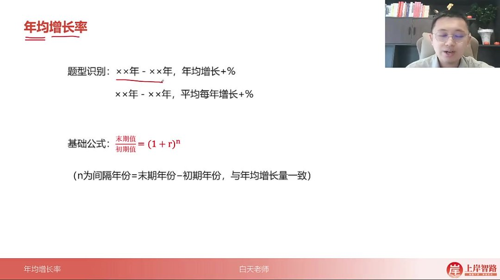

-   核心特征：题目中出现"×× 年-×× 年，年均增长+%"或"×× 年-×× 年，平均每年增长+%"的表述

-   常见变体

    ：

    -   "十三五"期间的年均增长率
    -   某时间段的月平均增长率
    -   时间段+平均增长百分号的组合表述

###### 2）年均增长率基础公式 01:16

-   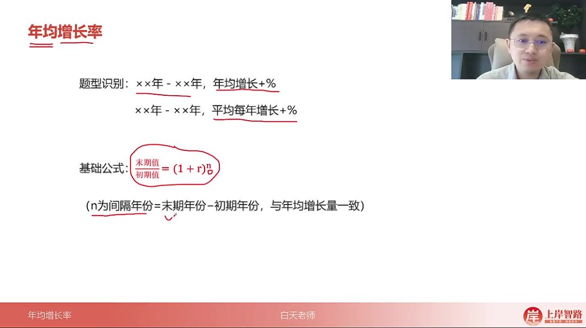

-   基本公式

    ：

    末期值初期值=(1+r)n\frac{末期值}{初期值} = (1 + r)^n 初期值末期值=(1+r)n

    ，其中：

    -   r 为年均增长率
    -   n 为间隔年份（末期年份-初期年份）

-   公式推导

    ：

    -   假设初期值为 B，经过 n 年增长后变为 A

    -   每年增长率为 r，则

        A=B(1+r)nA = B(1+r)^nA=B(1+r)n

    -   变形得到

        AB=(1+r)n\frac{A}{B} = (1+r)^nBA=(1+r)n

###### 3）年均增长率间隔年份 03:38

-   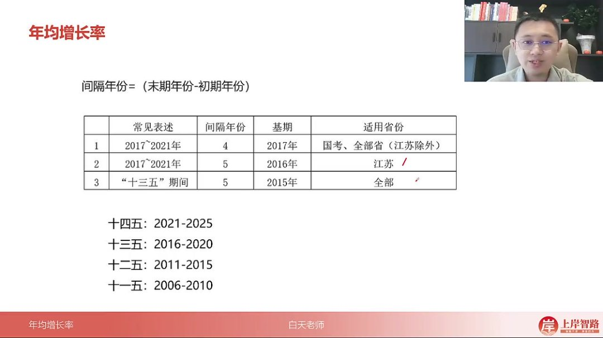

-   通用规则：n=末期年份-初期年份

-   特殊规则

    ：

    -   江苏省考：五年规划期间 n=5（基期前推一年）
    -   其他省份：五年规划期间 n=5（基期不调整）

-   规划年份对照

    ：

    -   十四五：2021-2025
    -   十三五：2016-2020
    -   十二五：2011-2015

###### 4）年均增长率大小比较 04:32

-   比较原理

    -   核心原理

        ：当 n 相同时，

        末期值初期值\frac{末期值}{初期值}初期值末期值

        越大，年均增长率 r 越大

    -   比较方法

        ：

        -   直接计算各选项的末期/初期比值
        -   比值大的对应年均增长率大

    -   适用条件：题目中所有比较对象的间隔年份 n 必须相同

-   例题解析

    05:44

    -   例题：快递业务量年均增速排序

        -   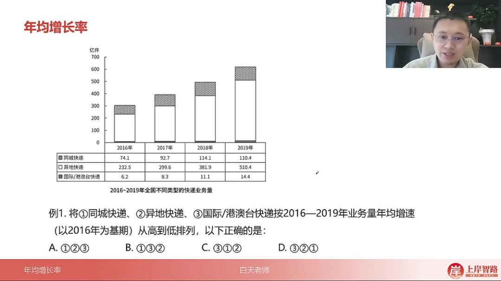
        -   题目解析：
            -   比较 2016-2019 年同城、异地、国际快递业务量增速
            -   计算比值：同城 110.4/74.1≈1.49，异地 510.4/232.5≈2.19，国际 14.4/6.2≈2.32
            -   排序结果：国际>异地>同城
            -   答案：D 选项（③②①）

    -   例题：集成电路产量年均增速排序

        06:53

        -   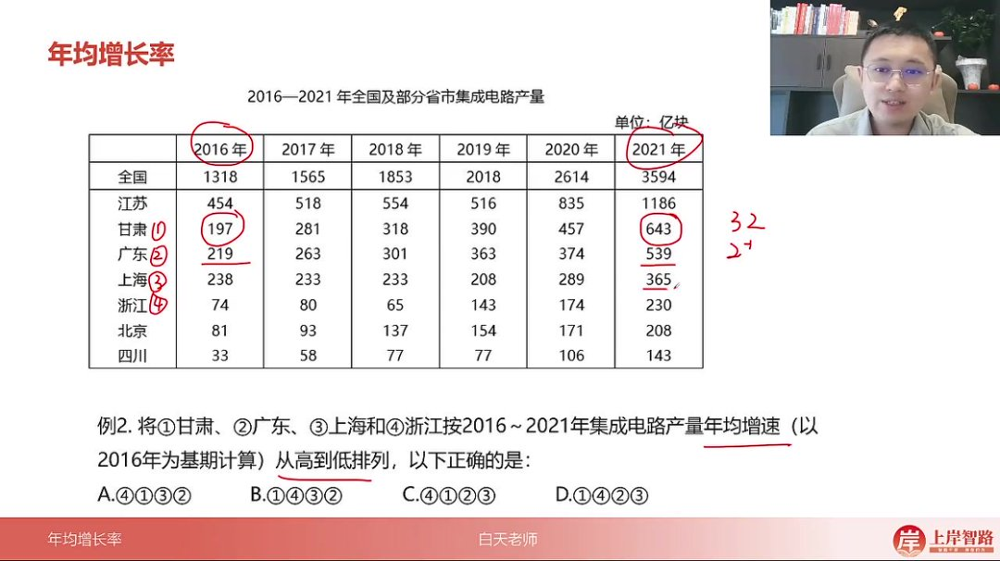
        -   题目解析：
            -   比较 2016-2021 年各省市集成电路产量增速
            -   计算比值：甘肃 643/197≈3.26，广东 539/219≈2.46，上海 365/238≈1.53，浙江 230/74≈3.11
            -   排序结果：甘肃>浙江>上海>广东
            -   答案：D 选项（①④②③）

    -   例题：耐磨材料消费量年均增速排序

        08:17

        -   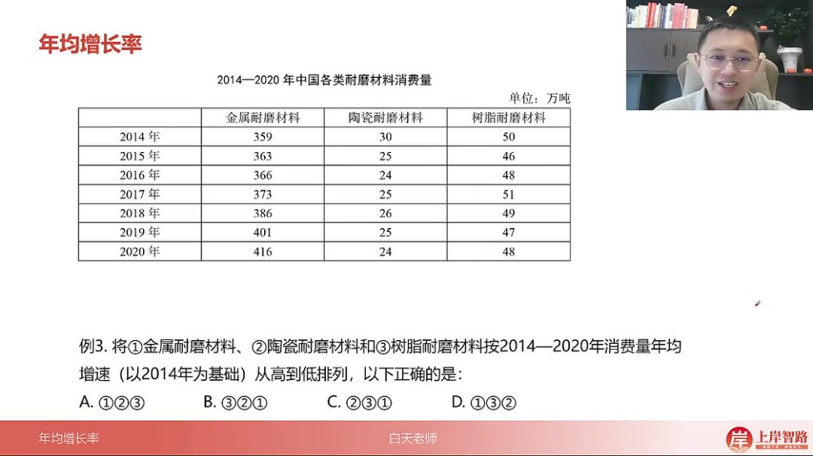
        -   题目解析：
            -   比较 2014-2020 年各类耐磨材料消费量增速
            -   计算比值：金属 416/359≈1.16，陶瓷 24/30=0.8，树脂 48/50=0.96
            -   排序结果：金属>树脂>陶瓷
            -   答案：D 选项（①③②）

###### 5）年均增长率计算技巧

-   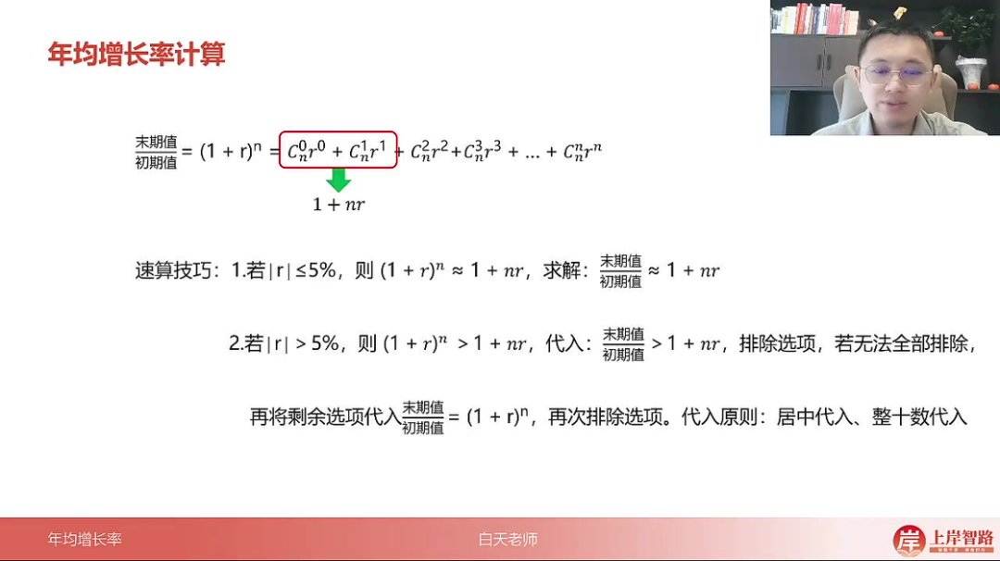

-   近似计算

    ：

    -   当

        ∣r∣≤5%|r|≤5\%∣r∣≤5%

        时，

        (1+r)n≈1+nr(1+r)^n≈1+nr(1+r)n≈1+nr

    -   当

        ∣r∣>5%|r|>5\%∣r∣>5%

        时，需精确计算或代入排除

-   代入原则

    ：

    -   居中代入：优先选择中间值验证
    -   整十数代入：优先验证整数百分比

-   排除技巧

    ：

    -   先比较

        (1+r)n(1+r)^n(1+r)n

        与

        1+nr1+nr1+nr

        的关系

    -   再通过选项范围逐步排除

###### 6）年均增长率计算 09:07

-   理论基础

    -   泰勒展开式

        ：

        (1+r)n=Cn0r0+Cn1r1+Cn2r2+...+Cnnrn(1+r)^n = C_n^0r^0 + C_n^1r^1 + C_n^2r^2 + ... + C_n^nr^n(1+r)n=Cn0r0+Cn1r1+Cn2r2+...+Cnnrn

        ，展开后第一项为 1，第二项为 nr

    -   近似原理

        ：当

        ∣r∣≤5%|r|≤5\%∣r∣≤5%

        时，

        r2r^2r2

        及以上项趋近于 0（如 2%的平方仅为 0.04%），可简化为

        (1+r)n≈1+nr(1+r)^n≈1+nr(1+r)n≈1+nr

    -   本质关系

        ：实际

        (1+r)n>1+nr(1+r)^n > 1+nr(1+r)n>1+nr

        ，因舍弃了展开式正项，但 r 越小近似度越高

-   速算技巧

    -   小增长率（|r|≤5%）

        ：

        -   方法

            ：直接使用

            末期值初期值 ≈1+nr\frac{末期值}{初期值}≈1+nr 初期值末期值 ≈1+nr

            求解

        -   示例：(1+2%)^5≈1+5×2%=1.10

    -   大增长率（|r|>5%）

        ：

        -   步骤 1

            ：用

            末期值初期值>1+nr\frac{末期值}{初期值}>1+nr 初期值末期值>1+nr

            排除明显错误选项

        -   步骤 2

            ：对剩余选项代入

            (1+r)n(1+r)^n(1+r)n

            验证，遵循居中代入（如先试 20%）、整十数代入原则

        -   判断标准：若代入值<实际值说明 r 偏小，反之则偏大

-   例题解析

    12:33

    -   小增长率例题

        -   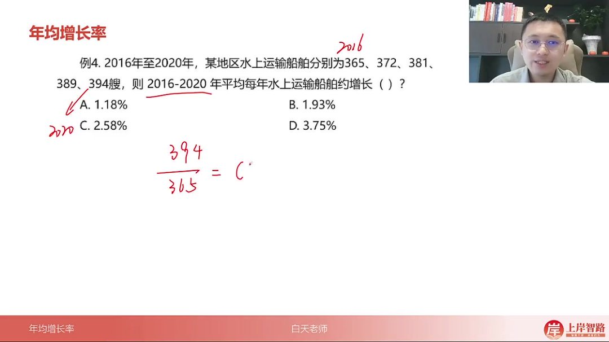

        -   解题过程

            ：

            -   计算

                394365≈1.08 $/\frac{394}{365}$ ≈1.08365394≈1.08

                ，因选项 r 均<5%采用近似

            -   建立方程

                1+4r≈1.081+4r≈1.081+4r≈1.08

                得

                r≈2%r≈2\%r≈2%

                ，选 B（1.93%）

            -   本质验证

                ：实际

                1.08>1+4r1.08>1+4r1.08>1+4r

                ，故

                r<2%r<2\%r<2%

                ，B 最接近

        -   易错点：近似计算时忽略本质不等式关系，可能误选 C

    -   大增长率例题

        -   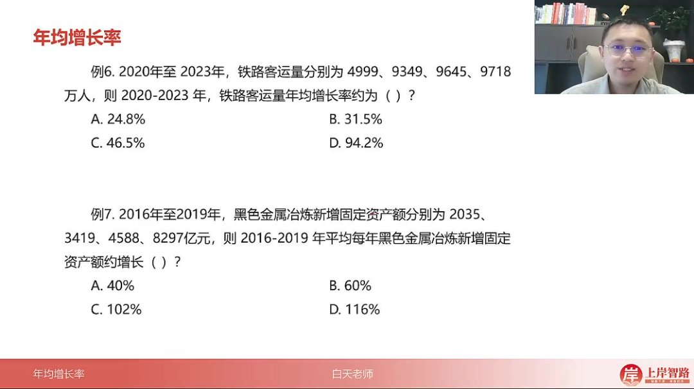

        -   解题过程

            ：

            -   计算

                97185000>1+3r $/\frac{9718}{5000}$ >1+3r50009718>1+3r

                得

                1.94>1+3r1.94>1+3r1.94>1+3r

                →

                r<31.33%r<31.33\%r<31.33%

            -   直接排除 C（46.5%）、D（94.2%），选 A（24.8%）

        -   关键技巧：当只有一个选项满足不等式时可直接确定答案

        -   解题过程

            ：

            -   先排除

                r>103%r>103\%r>103%

                的 C、D 选项

            -   代入 A 选项：(1.4)^3=1.96×1.4≈2.8<4.1 说明 r 偏小

            -   故选 B（60%）

        -   记忆点：常用平方数 11²=121 到 15²=225 需熟记

-   特殊情形处理

    26:06

    -   平方情形

        ：当年数 n=2 时，可直接用平方数估算

        -   示例

            ：

            35882054≈1.75 $/\frac{3588}{2054}$ ≈1.7520543588≈1.75

            ，介于 1.3^2=1.69 与 1.4^2=1.96 之间

        -   结论：r 应介于 30%-40%之间，选 C（32%）

    -   验证方法

        ：仍可用

        1.75>1+2r1.75>1+2r1.75>1+2r

        得

        r<37.5%r<37.5\%r<37.5%

        辅助判断

###### 7）年均增长与间隔增长率 28:43

-   核心概念与计算方法

    -   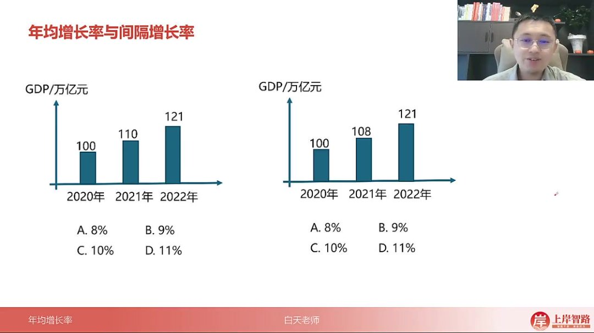

    -   间隔增长率公式

        ：

        R=r1+r2+r1×r2R = r_1 + r_2 + r_1 \times r_2R=r1+r2+r1×r2

        ，其中

        r1r_1r1

        和

        r2r_2r2

        为相邻两年的增长率

    -   年均增长率特性

        ：当

        r1=r2r_1 = r_2r1=r2

        时，该相同增长率即为年均增长率

    -   验证方法

        ：

        -   实例演示：100→110 增长 10%，110→121 增长 10%，整体增长率为 10%+10%+10%×10%=21%
        -   选项代入法：先计算真实整体增长率（如 21%），再通过选项反推验证（如 8%代入得 17%＜ 21%则排除）

-   计算步骤详解

    -   标准流程

        ：

        -   计算末期较初期的真实增长率（如 2022 年较 2020 年）
        -   将选项值作为年均增长率代入间隔公式计算
        -   比较计算结果与真实增长率是否匹配

    -   选项筛选技巧

        ：

        -   居中代入原则：优先测试中间值选项（如 9%、10%）
        -   整十数验证：11%代入得 23%＞ 21%则排除

-   多阶段增长处理

    -   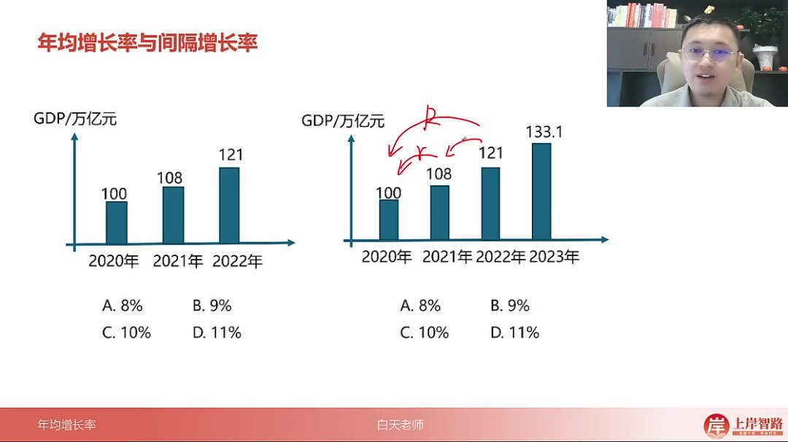

    -   三年期计算

        ：

        -   先计算前两年组合增长率（如 100→108→121，8%+12%+8%×12%≈21%）
        -   再与第三年进行二次间隔计算

    -   N 年期扩展：通过连续应用间隔增长率公式，将多年增长分解为多次两年间隔计算

-   实战例题解析

    36:50

    -   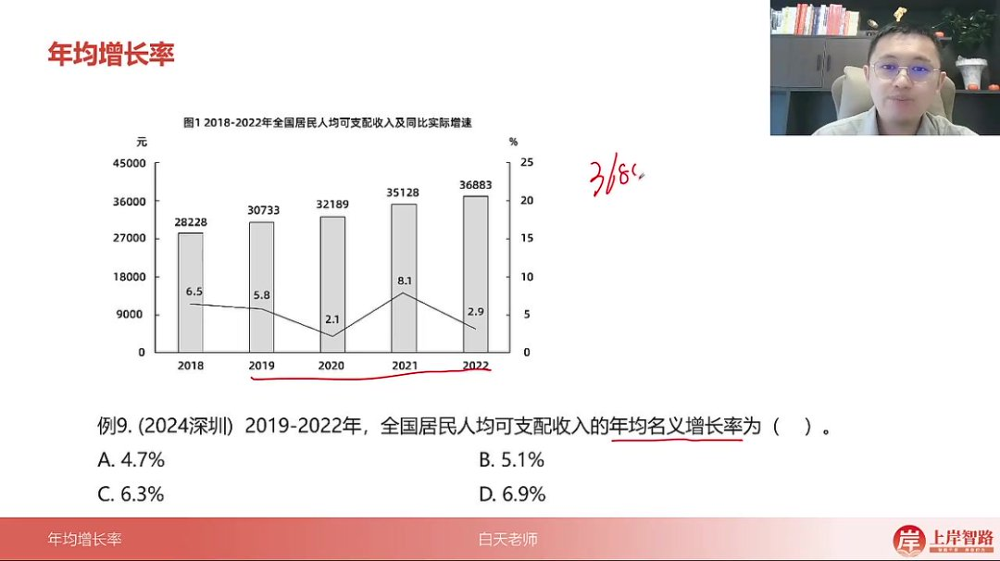

    -   题目特征：2019-2022 年全国居民收入年均增长率计算

    -   解法对比

        ：

        -   常规法

            ：

            (1+r)3=36883/30733≈1.2(1+r)^3=36883/30733≈1.2(1+r)3=36883/30733≈1.2

            ，得 r≈6.3%

        -   间隔验证法

            ：

            -   真实增长 20%（1.2-1）
            -   5.1%代入得 16%＜ 20%排除
            -   6.9%代入得 22%＞ 20%排除

    -   技巧选择

        ：

        -   选项差距大时用常规估算
        -   选项接近时用间隔验证提高精度

#### 二、知识小结

| 知识点           | 核心内容                                                                                | 考试重点/易混淆点                               | 难度系数 |
| ---------------- | --------------------------------------------------------------------------------------- | ----------------------------------------------- | -------- |
| 年均增长率定义   | 平均每年的增长率，即增长率的平均值                                                      | 题型识别：时间段+“年均增长”或“平均每年增长”表述 | ⭐⭐     |
| 基本公式         | 末期值 ÷ 初期值=(1+r)^n（n=间隔年份）                                                   | n 取值规则（与年均增长量相同，江苏特殊）        | ⭐⭐⭐   |
| 年均增长率比较   | 直接比较末期 ÷ 初期值（n 相同时）                                                       | 分数比较替代计算（95%题目适用）                 | ⭐⭐     |
| 计算技巧（r≤5%） | 末期 ÷ 初期 ≈1+nr（泰勒展开前两项）                                                     | 本质为大于关系（但误差可忽略）                  | ⭐⭐⭐⭐ |
| 计算技巧（r>5%） | 先排除（末期 ÷ 初期>1+nr），再代入验证                                                  | 居中代入原则（优先整十数）                      | ⭐⭐⭐⭐ |
| 间隔增长率联动法 | 通过真实增长率反推年均增长率                                                            | 多阶段需分层计算（例：三年期分两次间隔）        | ⭐⭐⭐⭐ |
| 真题高频陷阱     | 1. 江苏特殊 n 取值 2. 选项差距小时需精确计算 3. 平方数速记（11²=121 至 15²=225）        | 易错点：混淆年均增长量与增长率公式              | ⭐⭐⭐   |
| 典型例题解析     | 1. 排序题直接比较分数 2. 计算题优先判断 r 范围 3. 选项排除法（例：第 6 题排除>31%选项） | 关键技巧：拆分法估算分数（如 1.08≈108/100）     | ⭐⭐⭐⭐ |
