以下为 AI 生成的图文笔记的内容

#### 一、增长率大小比较 00:00

##### 1. 题型识别 00:05

###### 1）增长率与增长量区别 00:19

-   关键词识别：题目出现"增长率最大/小"或"增长最快/慢"时，属于增长率比较题型

-   易混淆点

    ：

    -   增长快慢：比较的是增长率（率）
    -   增长多少：比较的是增长量（量）

-   记忆口诀："快慢比率，多少比量"

##### 2. 基础公式 00:44

-   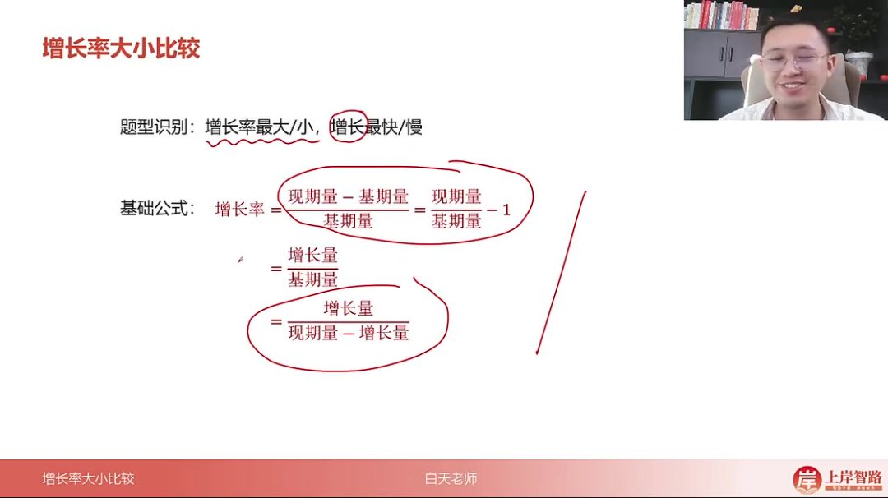

-   核心公式

    ：

    增长率=现期量 − 基期量基期量=增长量基期量增长率=\frac{现期量-基期量}{基期量}=\frac{增长量}{基期量}增长率=基期量现期量 − 基期量=基期量增长量

-   变形公式

    ：

    增长率=现期量基期量 −1 增长率=\frac{现期量}{基期量}-1 增长率=基期量现期量 −1

    （适用于现期量 ≥2 倍基期量时简化计算）

##### 3. 题目问法 00:56

###### 1）增长率增速增幅比较 01:07

-   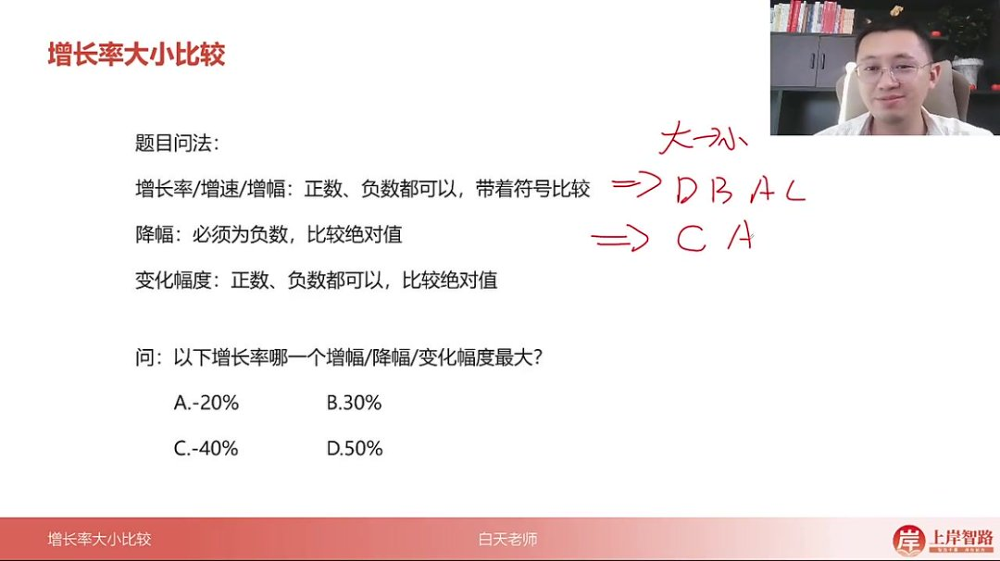
-   等价概念：增长率、增速、增幅三者完全等同
-   比较规则：可正可负，需带着符号比较（如：50% > -20%）
-   排序示例：D(50%) > B(30%) > A(-20%) > C(-40%)

###### 2）降幅比较 01:27

-   必要条件：必须为负数（正增长不叫降幅）
-   比较规则：比较绝对值大小（如：-40% > -20%）
-   排除原则：先排除正增长选项再比较
-   示例排序：C(-40%) > A(-20%)（排除 B、D）

###### 3）变化幅度比较 01:40

-   范围定义：包含正负变化（增长或减少）
-   比较规则：比较绝对值大小（如：|-40%| > |50%|）
-   示例排序：D(50%) > C(40%) > B(30%) > A(20%)

##### 4. 已知现期量和基期量 03:02

###### 1）现期量 ≥2 倍基期量 03:11

-   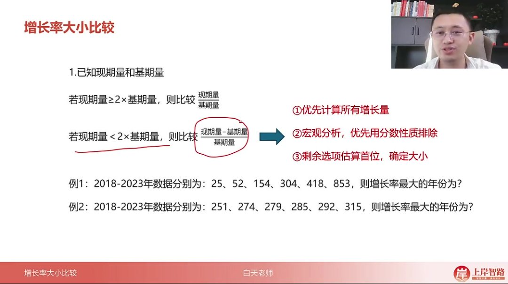

-   简化方法

    ：直接比较

    现期量基期量\frac{现期量}{基期量}基期量现期量

    的比值

-   原理说明：所有选项都不减 1，大小关系保持不变

-   适用特征：数据呈现明显倍数关系（如 25→52→154）

-   示例分析：154/52≈3 倍 > 52/25≈2 倍，故 154 对应年份增长率最大

###### 2）现期量<2 倍基期量 03:23

-   计算增长量

    03:38

    -   第一步：统一计算所有增长量（现期量-基期量）
    -   示例数据：251→274→279→285→292→315
    -   增量计算：23,5,6,7,23（对应各年份增长量）

-   分数性质排除

    04:06

    -   排除原则：分子大且分母小的分数值更大

    -   实战应用

        ：

        -   最大增量 23 对应最小基期量 251
        -   其他增量较小或基期量较大，可直接排除

-   估算首位确定

    04:23

    -   估算技巧：仅计算商的首位数字进行比较
    -   保留选项：当多个选项增量与基期量关系复杂时使用
    -   示例说明：23/251≈0.09，7/292≈0.02，通过首位即可判定

###### 3）柱折图分析技巧 07:19

-   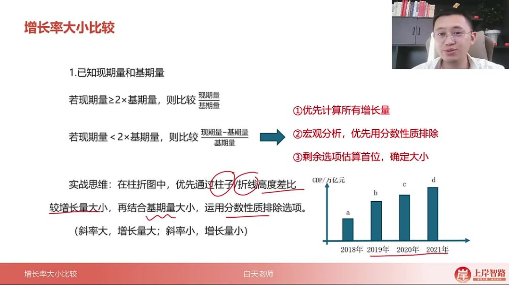

-   高度差分析：柱子/折线的高度差反映增长量大小

-   斜率误区：斜率仅反映增长量，不直接等于增长率

-   综合判断

    ：

    -   找出高度差最大（增长量最大）的区间
    -   确认对应基期量是否最小
    -   满足"分子大分母小"则增长率最大

-   示例图示：2019 年柱高差最大且基期最小，故增长率最大

##### 5. 已知增长量和现期量 09:09

###### 1）比较方法 09:20

-   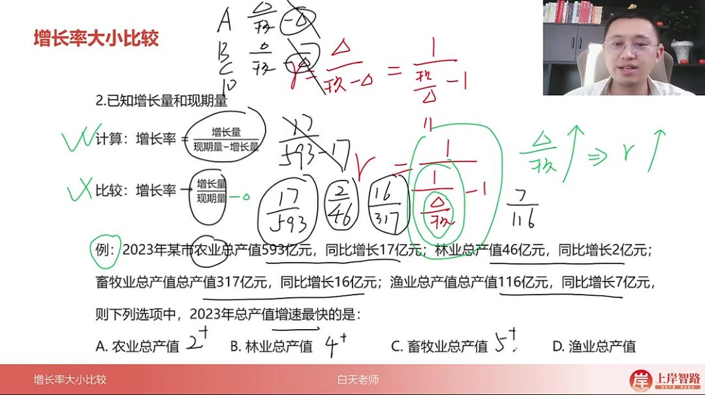

-   计算式

    ：增长率 =

    增长量现期量 − 增长量\frac{增长量}{现期量-增长量}现期量 − 增长量增长量

-   比较技巧

    ：当仅需比较增长率大小时，可直接用

    增长量现期量\frac{增长量}{现期量}现期量增长量

    代替完整计算式

-   推导原理

    ：通过分子分母同除增长量变形为

    1 现期量增长量 −1\frac{1}{\frac{现期量}{增长量}-1}增长量现期量 −11

    ，当

    增长量现期量\frac{增长量}{现期量}现期量增长量

    增大时，整个分式必然增大

-   注意事项：若选项中同时给出具体增长率（如 10%、15%），则必须用完整公式计算真实增长率进行比较

###### 2）例题：2023 年某市农业总产值增速比较

-   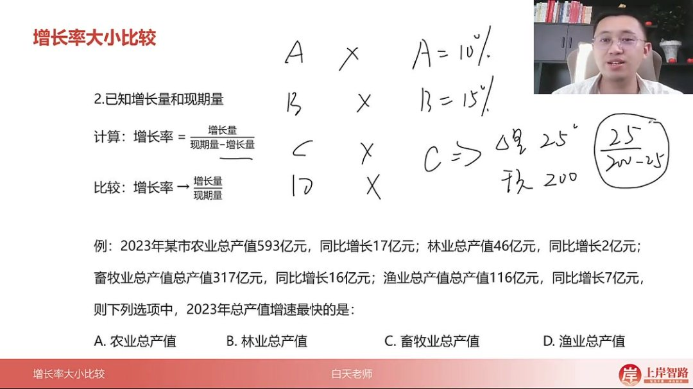

-   题目解析

    -   审题要点：比较农业、林业、畜牧业、渔业的增速，给出现期量和增长量

    -   解题步骤

        ：

        -   农业：

            17593 $/\frac{17}{593}$ 59317

            ≈2.86%

        -   林业：

            246 $/\frac{2}{46}$ 462

            ≈4.35%

        -   畜牧业：

            16317 $/\frac{16}{317}$ 31716

            ≈5.05%

        -   渔业：

            7116 $/\frac{7}{116}$ 1167

            ≈6.03%

    -   技巧应用

        ：直接比较

        增长量现期量\frac{增长量}{现期量}现期量增长量

        比值即可确定大小关系

    -   答案：D 选项（渔业）增速最快

##### 6. 增长率比较实战技巧

###### 1）倍数关系判断法

-   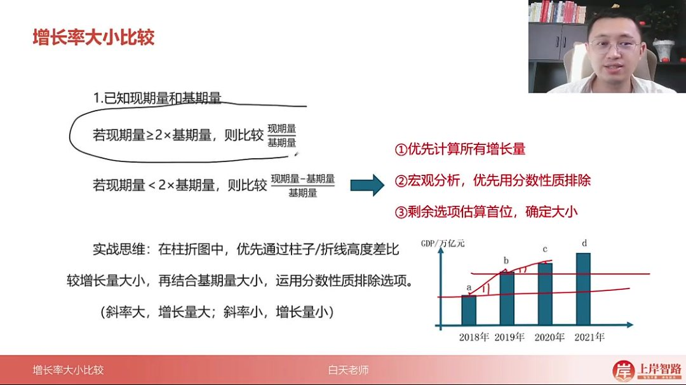

-   核心规则

    ：

    -   当现期量 ≥2× 基期量时，直接比较

        现期量基期量\frac{现期量}{基期量}基期量现期量

    -   当现期量<2× 基期量时，需比较

        现期量 − 基期量基期量\frac{现期量-基期量}{基期量}基期量现期量 − 基期量

-   操作步骤

    ：

    -   优先计算所有增长量
    -   宏观分析，用分数性质排除选项
    -   剩余选项估算首位确定大小

###### 2）例题：汕头 GDP 增速比较

-   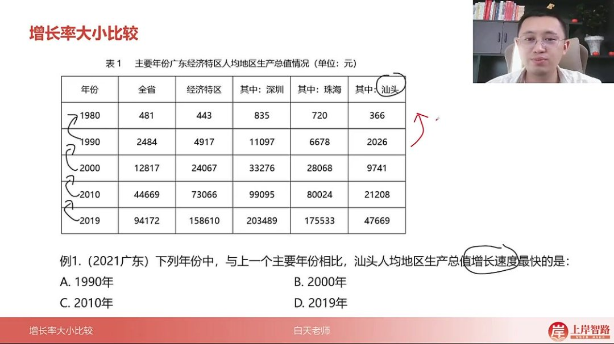

-   题目解析

    -   数据对比

        ：

        -   1990 年：

            2026366 $/\frac{2026}{366}$ 3662026

            ≈5.53 倍

        -   2000 年：

            97412026 $/\frac{9741}{2026}$ 20269741

            ≈4.81 倍

        -   2010 年：

            212089741 $/\frac{21208}{9741}$ 974121208

            ≈2.18 倍

        -   2019 年：

            4766921208 $/\frac{47669}{21208}$ 2120847669

            ≈2.25 倍

    -   技巧应用：1990 年基期量最小且增长倍数最大

    -   答案：A 选项（1990 年）增速最快

###### 3）例题：企业发明专利产业化率增速

-   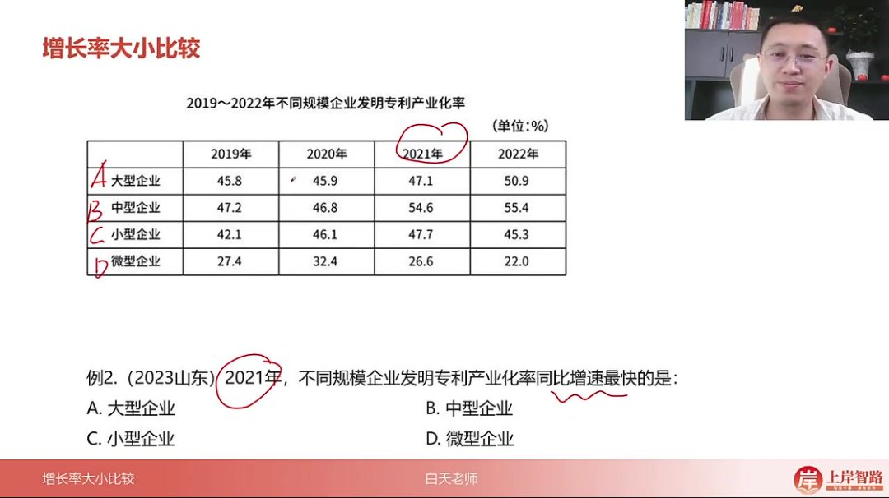

-   题目解析

    -   增量分析

        ：

        -   大型企业：47.1-45.9=1.2
        -   中型企业：54.6-46.8=7.8
        -   小型企业：47.7-46.1=1.6
        -   微型企业：26.6-32.4=-5.8（负增长直接排除）

    -   宏观判断：中型企业增量最大且基期量相当

    -   答案：B 选项（中型企业）增速最快

###### 4）例题：全球卫星产业收入增速

-   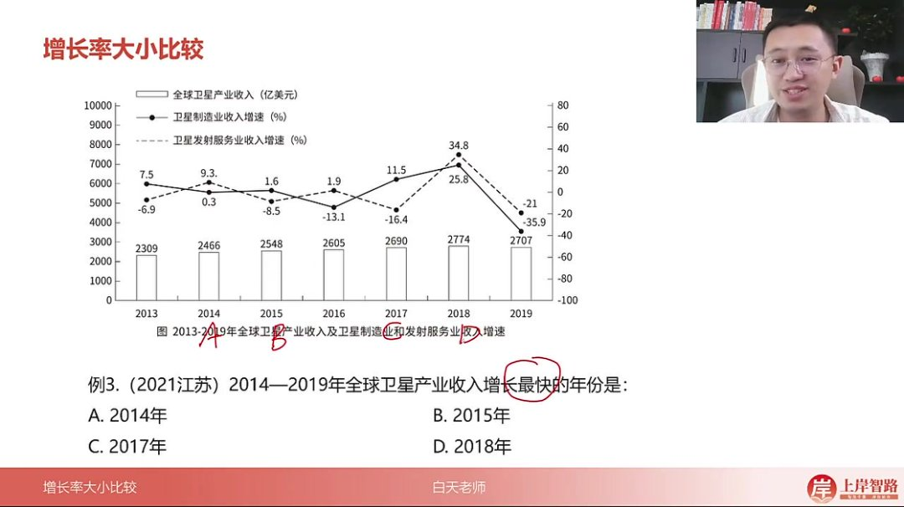

-   题目解析

    -   关键数据

        ：

        -   2014 年：增量 ≈2400-2300=100，基期=2309
        -   2015 年：增量 ≈2500-2400=100，基期=2400
        -   2017 年：增量 ≈2600-2548≈52，基期=2548
        -   2018 年：增量 ≈2690-2605≈85，基期=2605

    -   比较原则：2014 年增量最大且基期最小

    -   答案：A 选项（2014 年）增速最快

##### 7. 增长率比较技巧 16:15

###### 1）折线图斜率分析法 16:25

-   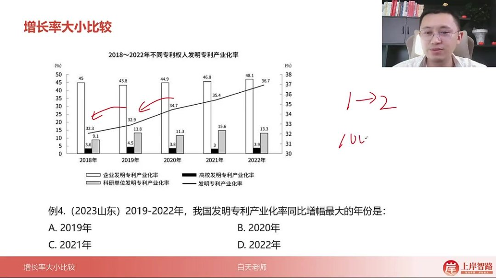
-   斜率与增长量关系：折线图中线段越陡峭，代表斜率越大，对应的增长量也越大。如 2020 年线段最陡，说明该年增长量最大。
-   基期数值影响：比较增长率时需同时考虑基期数值大小，2020 年基期值（32.9%）比 2021 年（34.7%）、2022 年（36.7%）都小，因此其增长率更大。
-   快速排除法：通过观察可直接排除斜率较小的 2021 年和 2022 年（CD 选项），节省计算时间。

###### 2）增长率计算技巧

-   简化计算：比较变化率时可忽略小数点，如 100 到 200 与 1 到 2 的变化率都是 100%。

-   具体计算示例

    ：

    -   2019→2020：

        34.7−32.932.9=1.832.9≈5.47%\frac{34.7-32.9}{32.9}=\frac{1.8}{32.9}≈5.47\%32.934.7−32.9=32.91.8≈5.47%

    -   2020→2021：

        36.7−34.734.7=2.034.7≈5.76%\frac{36.7-34.7}{34.7}=\frac{2.0}{34.7}≈5.76\%34.736.7−34.7=34.72.0≈5.76%

    -   实际计算验证 2020 年增幅最大

##### 8. 增长率排序问题 18:00

###### 1）例题：投诉举报咨询增长率排序

-   解题步骤

    ：

    -   确认给定数据：现期量和增长量

    -   直接计算比值：

        增长量现期量\frac{增长量}{现期量}现期量增长量

        比较

        -   投诉：

            1456 $/\frac{14}{56}$ 5614

            首位商 2

        -   举报：

            926 $/\frac{9}{26}$ 269

            首位商 3

        -   咨询：

            16139 $/\frac{16}{139}$ 13916

            首位商 1

    -   排序结果：举报（3）> 投诉（2）> 咨询（1）

-   技巧总结：比较增长率时可直接用增长量 ÷ 现期量估算首位，快速确定大小关系。

##### 9. 增长率比较技巧

###### 1）题型识别与基础公式

-   题型特征：当题目出现"增长率最大/小"、"增长最快/慢"等表述时，考查增长率比较问题

-   基础公式

    ：

    增长率=现期量 − 基期量基期量=增长量基期量=增长量现期量 − 增长量增长率 = \frac{现期量 - 基期量}{基期量} = \frac{增长量}{基期量} = \frac{增长量}{现期量 - 增长量}增长率=基期量现期量 − 基期量=基期量增长量=现期量 − 增长量增长量

###### 2）不同问法的比较规则

-   增长率/增速/增幅：正负数均可比较，需带符号比较
-   降幅比较：必须为负数，比较绝对值大小
-   变化幅度：正负数均可，但需比较绝对值

###### 3）已知现期量与基期量的比较方法

-   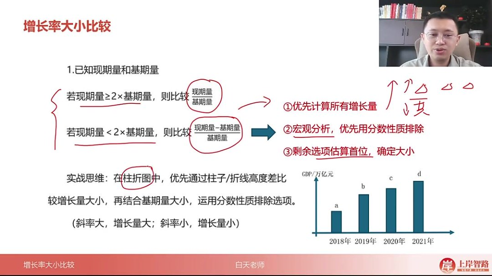

-   差距较大时

    ：当现期量 ≥2 倍基期量时，直接比较

    现期量基期量\frac{现期量}{基期量}基期量现期量

-   差距较小时

    ：当现期量<2 倍基期量时，比较

    现期量 − 基期量基期量\frac{现期量-基期量}{基期量}基期量现期量 − 基期量

-   实战三步走

    ：

    -   优先计算所有增长量
    -   宏观分析，运用分数性质排除选项（分子大分母小则分数值大）
    -   剩余选项估算首位确定大小

-   图表技巧：在柱状图/折线图中，可通过高度差或斜率判断增长量大小，再结合基期量运用分数性质排除

###### 4）已知增长量与现期量的比较方法

-   计算公式

    ：

    增长率=增长量现期量 − 增长量增长率 = \frac{增长量}{现期量 - 增长量}增长率=现期量 − 增长量增长量

-   比较技巧

    ：可直接比较

    增长量现期量\frac{增长量}{现期量}现期量增长量

    ，无需减去增长量（简化计算）

###### 5）与特定增长率比较的技巧

-   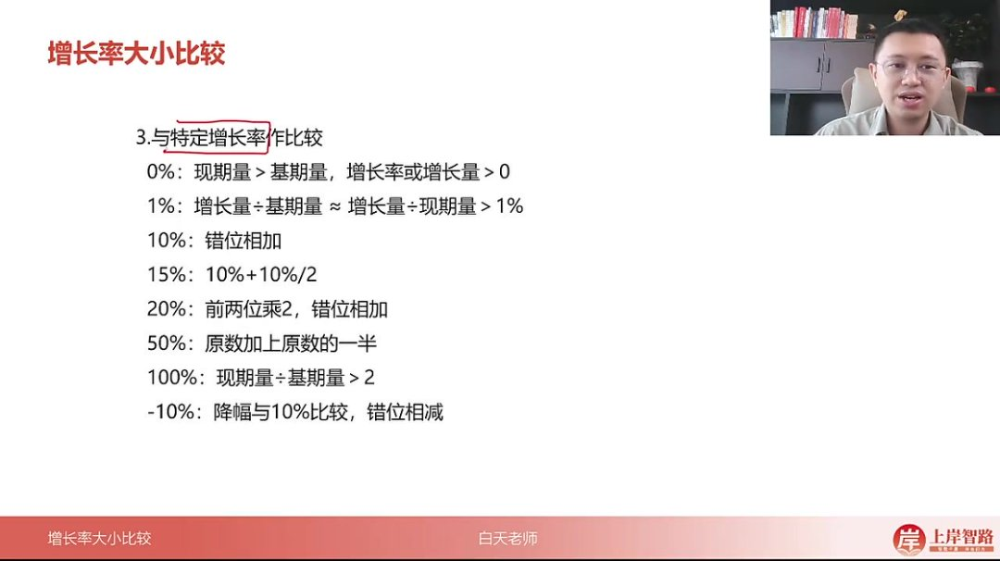

-   与 0%比较：现期量>基期量时，增长率>0

-   与 1%比较

    ：

    增长量基期量 ≈ 增长量现期量>1%\frac{增长量}{基期量} ≈ \frac{增长量}{现期量} > 1\%基期量增长量 ≈ 现期量增长量>1%

-   与 10%比较：使用错位相加法

-   与 15%比较：10% + 10%/2

-   与 20%比较：前两位乘 2 后错位相加

-   与 50%比较：原数加上原数的一半

-   与 100%比较：现期量 ÷ 基期量>2

-   与-10%比较：降幅与 10%比较，使用错位相减法

##### 10. 典型例题解析

###### 1）例题：投诉举报咨询增速排序 22:06

-   

-   题目解析

    -   数据提取：2022 年投诉 55.6 万件（增 14.0 万）、举报 26.3 万件（增 8.9 万）、咨询 138.5 万件（增 16 万）

    -   计算技巧

        ：直接比较

        增长量现期量\frac{增长量}{现期量}现期量增长量

        ，投诉 ≈

        1455.6\frac{14}{55.6}55.614

        ≈25%，举报 ≈

        8.926.3\frac{8.9}{26.3}26.38.9

        ≈34%，咨询 ≈

        16138.5\frac{16}{138.5}138.516

        ≈11.5%

    -   排序结果：举报量>投诉量>咨询量

    -   答案：D 选项

###### 2）例题：软件业增速比较 23:08

-   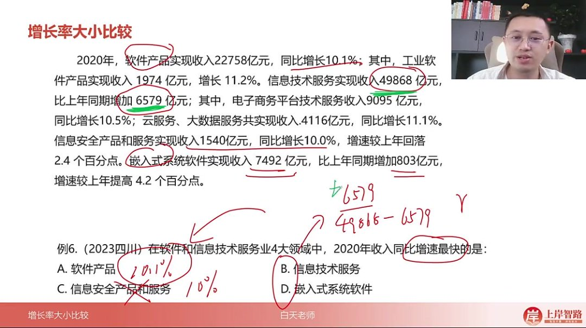

-   题目解析

    -   数据特点：A、C 选项直接给出增长率（10.1%、10%），B、D 选项给出增长量和现期量

    -   比较策略

        ：

        -   先排除明显较小的 A、C 选项

        -   对 B、D 选项估算：信息技术服务

            657949868−6579\frac{6579}{49868-6579}49868−65796579

            ≈

            65433 $/\frac{65}{433}$ 43365

            ≈15%，嵌入式系统

            8037492−803\frac{803}{7492-803}7492−803803

            ≈

            80669 $/\frac{80}{669}$ 66980

            ≈12%

        -   通过首位比较确定 B 选项更大

    -   答案：B 选项（信息技术服务）

###### 3）例题：贷款余额增速比较 24:05

-   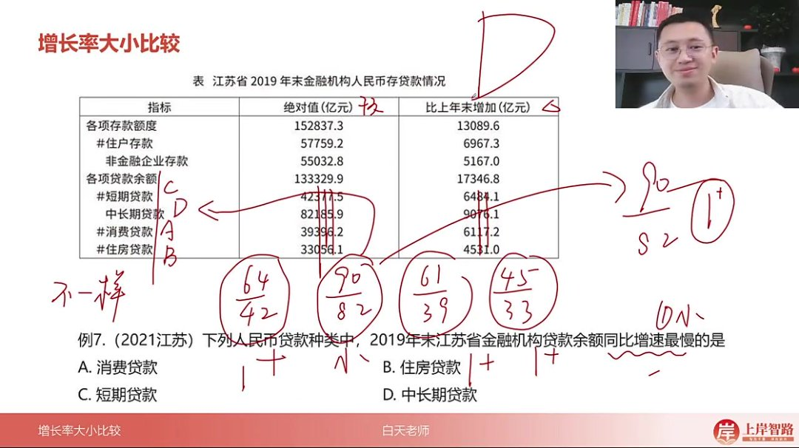

-   题目解析

    -   陷阱识别

        ：

        -   题目要求找"最慢"而非通常的"最快"

        -   材料顺序与选项顺序不一致

        -   给出现期量和增长量，可直接比较

            增长量现期量\frac{增长量}{现期量}现期量增长量

    -   简化计算

        ：

        -   消费贷款：

            6442 $/\frac{64}{42}$ 4264

            ≈1.5

        -   住房贷款：

            9082 $/\frac{90}{82}$ 8290

            ≈1.1

        -   短期贷款：

            6139 $/\frac{61}{39}$ 3961

            ≈1.56

        -   中长期贷款：

            4533 $/\frac{45}{33}$ 3345

            ≈1.36

    -   宏观比较：住房贷款比值最小，对应 D 选项

    -   答案：D 选项（中长期贷款）

##### 11. 增长率比较实战技巧

###### 1）图形题解题思维

-   正负优先原则：题干/选项含图表时，先判断增长率正负（正增长>负增长），结合选项排除
-   局部特征法：宏观分析时优先寻找极值点（最大/最小增长率），通过特征点高度对比排除错误选项

###### 2）特定增长率比较方法

-   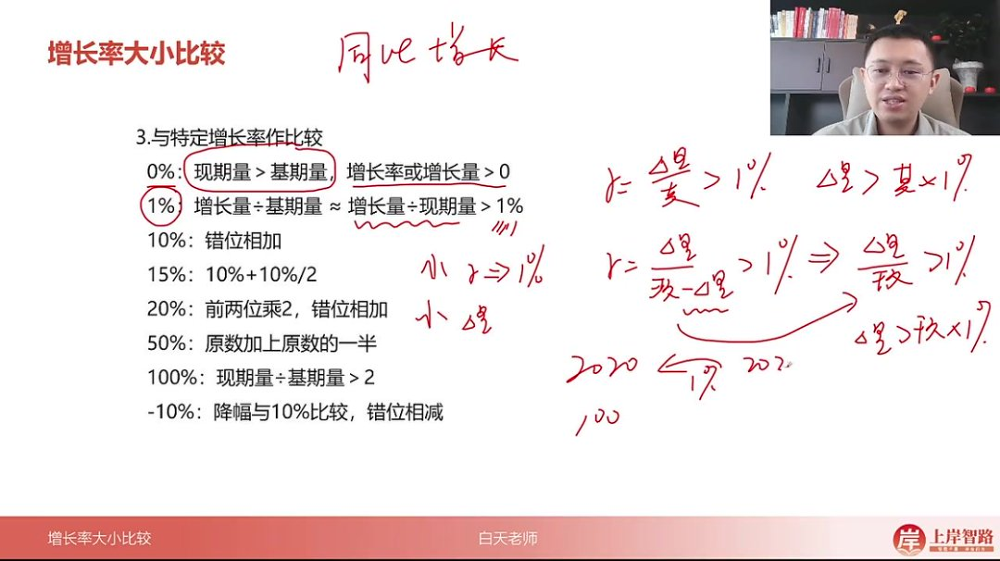

-   0%比较

    ：

    -   判定标准：现期量>基期量，即增长率或增长量>0
    -   应用场景：题干出现"同比增长"时直接使用

-   1%比较

    ：

    -   精确公式

        ：

        ΔR 基期量>1%\frac{\Delta R}{基期量}>1\%基期量 ΔR>1%

        →

        ΔR>基期量 ×1%\Delta R>基期量 ×1\%ΔR>基期量 ×1%

    -   简化技巧

        ：当增长率很小时，

        增长量基期量 ≈ 增长量现期量>1%\frac{增长量}{基期量}≈\frac{增长量}{现期量}>1\%基期量增长量 ≈ 现期量增长量>1%

        （忽略分母减量）

    -   实例验证

        ：基期 100 增长 1%时，

        1100 $/\frac{1}{100}$ 1001

        与

        1101 $/\frac{1}{101}$ 1011

        误差仅 0.01%

-   10%/15%/20%比较

    ：

    -   10%技巧：基期数错位相加（如 240×1.1=240+24=264）
    -   15%技巧：10%结果+其一半（240×1.15=264+12=276）
    -   20%技巧：前两位数 ×2 错位相加（240×1.2=240+48=288）

-   50%/100%比较

    ：

    -   50%计算：原数+原数一半（240×1.5=240+120=360）
    -   100%判定：现期量 ÷ 基期量>2

-   负增长比较

    ：

    -   降幅 10%：基期数错位相减（240×0.9=240-24=216）
    -   判定逻辑：实际下降值>理论降幅值即超过比较标准（如 240→200 降幅超 10%）

###### 3）例题：钓具进出口增长

-   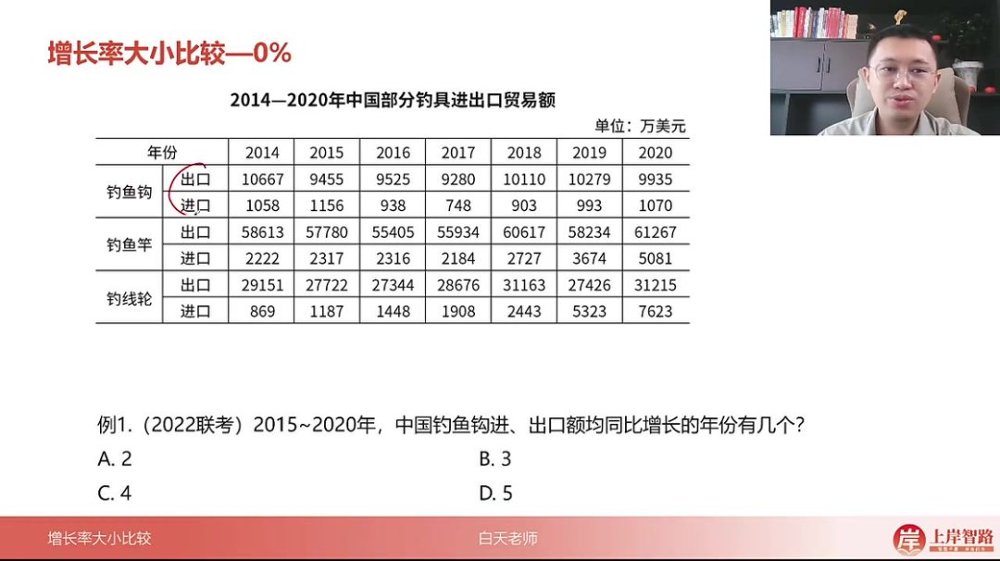

-   题目解析

    -   审题关键："均同比增长"即需同时满足进口额和出口额现期量>基期量

    -   数据对比

        ：

        -   2018 年：10110>9280（出口）且 903>748（进口）
        -   2019 年：10279>10110（出口）且 993>903（进口）
        -   其他年份至少一项不符合

    -   答案：B（共 2 个年份符合）

###### 4）例题：生产资料价格涨幅

-   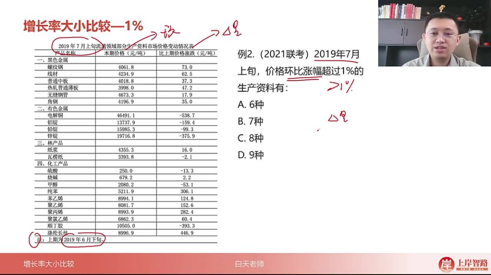

-   题目解析

    -   解题要点

        ：环比涨幅>1% →

        增长量现期量>1%\frac{增长量}{现期量}>1\%现期量增长量>1%

    -   快速判定：直接检查增长量>现期量 ×1%的品种

    -   计算示例

        ：

        -   螺纹钢：73>4061.8×1%≈40.6 → 符合
        -   线材：62.5>4234.9×1%≈42.3 → 符合
        -   普通中板：37.3<4018.8×1%≈40.2 → 排除

    -   注意事项：需排除价格下跌（增长量为负）的品种

###### 5）降幅比较特殊情形

-   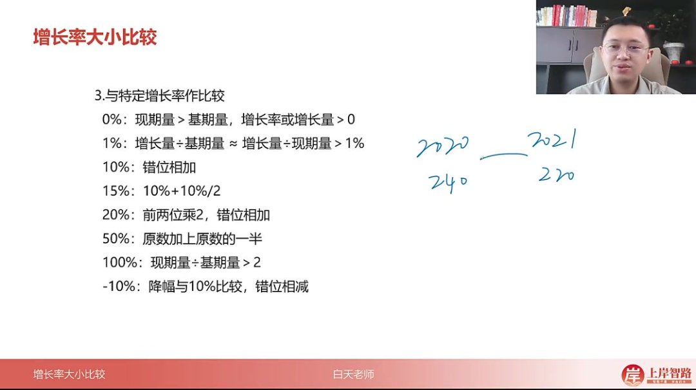

-   核心逻辑

    ：降幅比较是增长率比较的逆向应用

    -   基准建立：先计算标准降幅对应值（如 240 降 10%→216）

    -   实际对比

        ：

        -   实际值<基准值（如 200<216）→ 降幅超过比较标准
        -   实际值>基准值（如 220>216）→ 降幅未达比较标准

-   记忆口诀："降得多超标准，降得少未达标"

##### 12. 增长率比较技巧

-   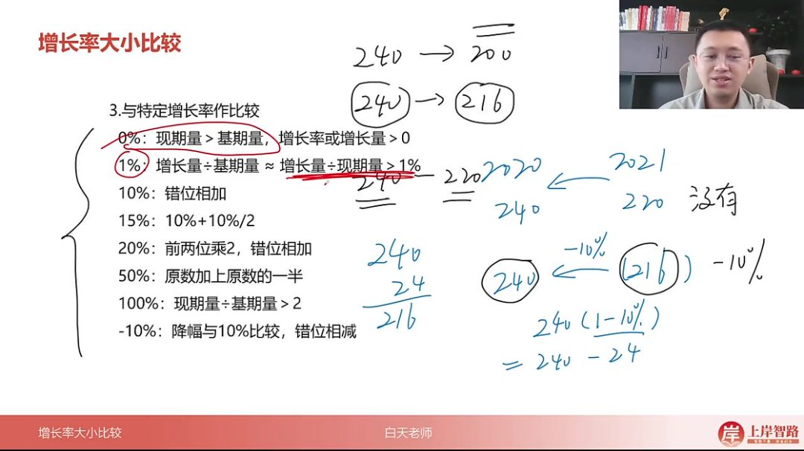

-   与特定增长率比较

    ：

    -   0%判断：现期量>基期量，则增长率或增长量>0
    -   1%快速判断：增长量 ÷ 基期量 ≈ 增长量 ÷ 现期量>1%（适用于增长率很小时近似计算）
    -   10%计算技巧：错位相加法（基期数+基期数前移一位）
    -   15%计算技巧：10%+10%/2（先算 10%再加其一半）
    -   20%计算技巧：前两位数 ×2 后错位相加
    -   50%计算技巧：原数加上原数的一半
    -   100%判断：现期量 ÷ 基期量>2
    -   -10%判断：降幅与 10%比较，采用错位相减法

###### 1）例题：生产资料价格涨幅

-   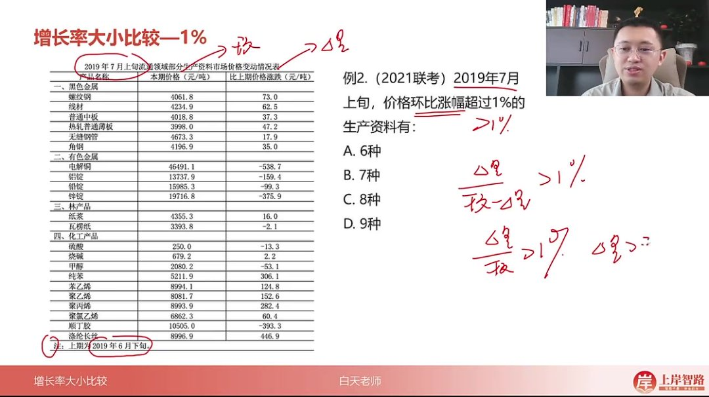

-   题目解析

    -   审题关键：环比涨幅超过 1%的生产资料种类数

    -   解题技巧

        ：利用 1%近似公式

        Δq 现期量>1%\frac{\Delta q}{现期量}>1\%现期量 Δq>1%

        ，即增长量>现期量小数点左移两位

    -   实操步骤

        ：

        -   排除负增长项（价格下跌的直接排除）
        -   快速对比：73>40（螺纹钢）、62>42（线材）、47>39（热轧薄板）等
        -   统计符合条件的共 8 种

    -   易错提醒：避免逐项精确计算，应使用近似比较法

    -   答案：C.8 种

###### 2）例题：LED 产业增速

-   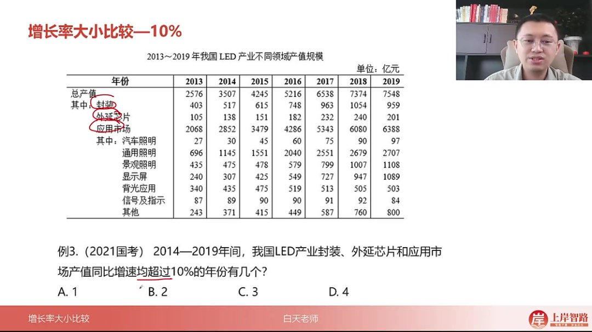

-   题目解析

    -   审题关键：封装、外延芯片、应用市场三领域增速均>10%的年份数

    -   解题技巧

        ：

        -   使用错位相加法判断 10%增长
        -   示例：2014 年封装 403→517，假设 10%增长应为 443（403+40），实际 517>443→ 达标
        -   快速验证：2015 年外延芯片 138→151（需达 151.8，未达标）

    -   重点步骤

        ：

        -   2016 年：封装 748>748×1.1≈823（实际 963>823）
        -   2017 年：应用 4286→5343（明显超 10%）

    -   易错点：需三个领域同时达标才算有效年份

    -   答案：C.3 个

###### 3）例题：软件业务收入增速

-   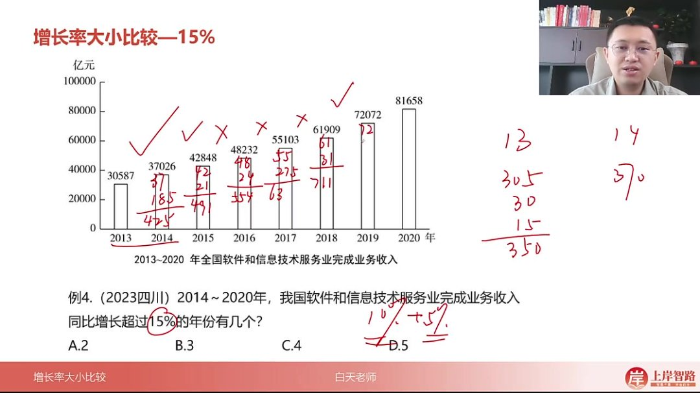

-   题目解析

    -   审题关键：同比增长超过 15%的年份数

    -   解题技巧

        ：

        -   15%=10%+5%（错位相加+半数）
        -   示例：2014 年 305→370，10%增长=335.5，15%增长=305+30.5+15.25≈350，实际 370>350→ 达标

    -   快速计算法

        ：

        -   2015 年：370→428，370+37+18.5=425.5<428→ 达标
        -   2016 年：468→491（需达 538，未达标）

    -   验证要点：2019 年 7216>7110（7200+360）→ 达标

    -   答案：B.3 个

###### 4）例题：地铁运营长度增速

-   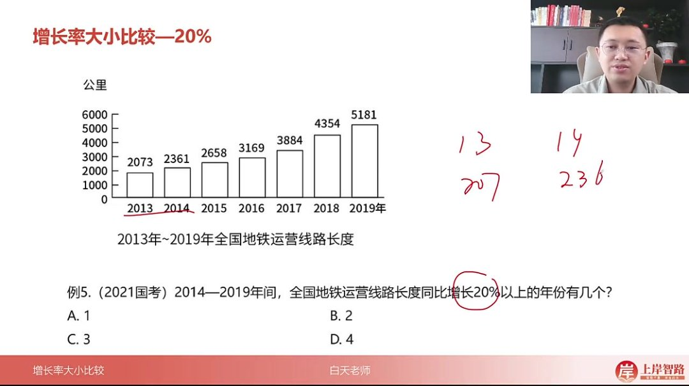

-   题目解析

    -   审题关键：同比增长 20%以上的年份数

    -   解题技巧

        ：

        -   前两位数 ×2 后错位相加
        -   示例：2013 年 207→236，20%增长=207+41.4≈248>236→ 未达标

    -   关键验证

        ：

        -   2017 年 316→378，20%增长=316+63.2≈379<380→ 达标
        -   其他年份均未达标

    -   记忆口诀："20%增速看前二，乘二错位快相加"

    -   答案：A.1 个

###### 5）例题：公共充电桩增速

-   

-   题目解析

    -   审题关键：未超过 50%增速的年份数

    -   解题技巧

        ：

        -   50%增长=基期量+基期量一半
        -   示例：2016 年 15→21，50%增长=15+7.5=22.5>21→ 未达标

    -   重点验证

        ：

        -   2017 年 21→30，50%增长=31.5>30→ 未达标
        -   2021 年 80→114.7，50%增长=120>114.7→ 未达标

    -   注意点：题目问"未超过"而非"超过"

    -   答案：C.3 个

###### 6）例题：电化学储能增速

-   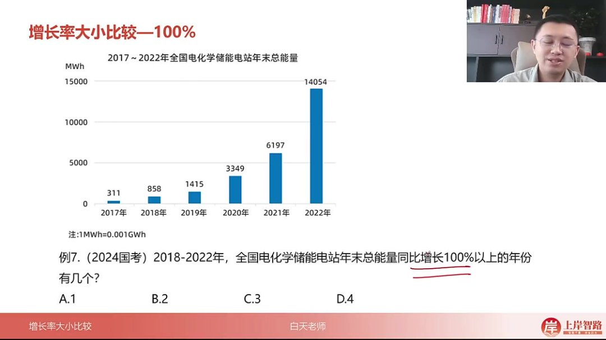

-   题目解析

    -   审题关键：同比增长 100%以上的年份数（即现期量>2× 基期量）

    -   快速判断

        ：

        -   2018 年：14→28（正好 2 倍，不包含）
        -   2020 年：66→141（超 2 倍）
        -   2022 年：262→581（超 2 倍）

    -   易错提示：注意"超过"不含等于情况

    -   答案：C.3 个

###### 7）例题：再生资源回收降幅

-   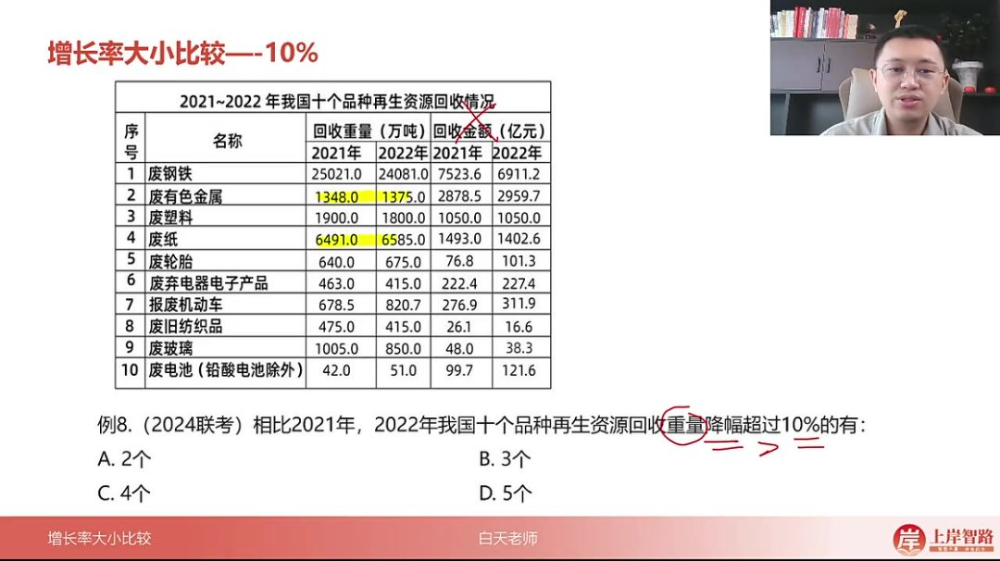

-   题目解析

    -   审题关键：回收重量降幅超过 10%的品种数

    -   解题技巧

        ：

        -   先排除正增长的品种（废有色金属、废纸、废轮胎、报废机动车）
        -   降幅验证：现期量<基期量 ×0.9
        -   示例：废塑料 1900→1800，需<1710（实际 1800>1710→ 未达标）
        -   达标项：废弃电器电子产品（463→415<416.7）、废旧纺织品（475→415<427.5）、废玻璃（1005→850<904.5）

    -   核心公式：降幅 10%对应现期量=基期量 ×0.9

    -   答案：B.3 个

###### 8）例题：生活用水量增速图

-   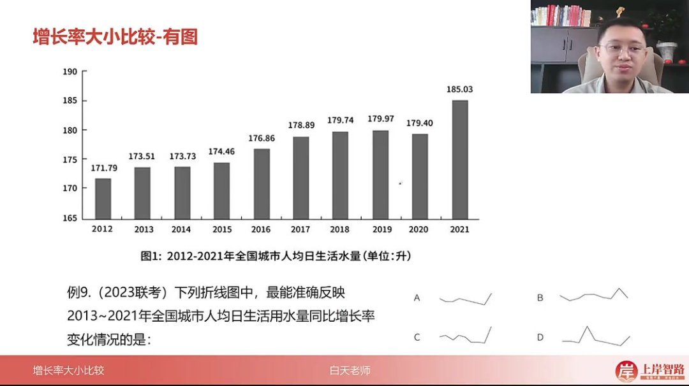

-   题目解析

    -   审题关键：选择正确反映增长率变化的折线图

    -   解题技巧

        ：

        -   找极值点：2021 年增长率应最高（对应选项 A、C）
        -   初期趋势：2013 年增长率>2014 年（下降趋势，排除 C）

    -   验证方法

        ：

        -   2013 年增长量较大且基期小 → 高增长率
        -   2014 年增长量减小且基期增大 → 增长率下降

    -   答案：A

###### 9）例题：母婴消费增速趋势

-   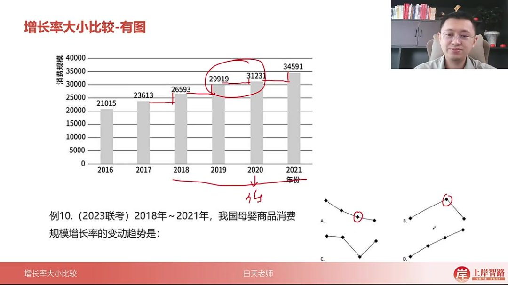

-   题目解析

    -   审题关键：2018-2021 年增长率变化趋势

    -   快速判断

        ：

        -   2020 年增长量最小且基期最大 → 增长率最低点（第三个点）
        -   排除 ABD（第三个点非最低）

    -   图形特征：选项 C 呈现"高-中-低-回升"趋势

    -   答案：C

#### 二、知识小结

| 知识点                     | 核心内容                                                                                       | 考试重点/易混淆点                           | 难度系数   |
| -------------------------- | ---------------------------------------------------------------------------------------------- | ------------------------------------------- | ---------- |
| 增长率比较题型识别         | 题型包括：增长率最大/最小、增长快慢（率）vs 增长多少（量）                                     | “增长快慢”比较增长率，“增长多少”比较增长量  | ⭐⭐       |
| 增长率公式应用             | 基本公式：(现期量-基期量)/基期量；已知增长量和现期量时：增长量/(现期量-增长量)                 | 比较时可简化：增长量/现期量（无需减增长量） | ⭐⭐⭐     |
| 不同问法比较逻辑           | - 增长率/增速/增幅：可正可负，直接比较- 降幅：必须为负，比较绝对值- 变化幅度：正负均比较绝对值 | 降幅必须为负，增幅可正可负                  | ⭐⭐⭐⭐   |
| 现期与基期差距大的比较技巧 | 现期/基期 ≥2 倍时，直接除现期/基期（不减 1）                                                   | 例：50/25=2 倍，直接比较比值                | ⭐⭐       |
| 现期与基期差距小的比较技巧 | 三步法：1.计算所有增长量；2.用分数性质排除（分子大分母小 → 分数大）；3.估算首位                | 优先排除增长量小且基期大的选项              | ⭐⭐⭐⭐   |
| 柱状图/折线图分析          | 通过高度差（斜率）判断增长量，结合基期量运用分数性质                                           | 斜率大 ≠ 增长率大，需结合基期量             | ⭐⭐⭐     |
| 与特定增长率比较技巧       | - 10%：错位相加- 15%：错位相加+一半- 20%：前两位 ×2 错位相加- 降幅 10%：基期 ×0.9 与现期对比   | 假设法转换加法运算                          | ⭐⭐⭐⭐⭐ |
| 易错点                     | - 混淆增长量与增长率- 忽略降幅的负号要求- 误用斜率直接判断增长率                               | “增长量大 ≠ 增长率大”需强化记忆             | ⭐⭐⭐⭐   |
| 实战案例                   | 例 1：直接除比较（现期/基期）；例 2：增量+基期宏观分析；例 6：增长量/现期量快速比较            | 选项含真实增长率时需单独计算                | ⭐⭐⭐     |
