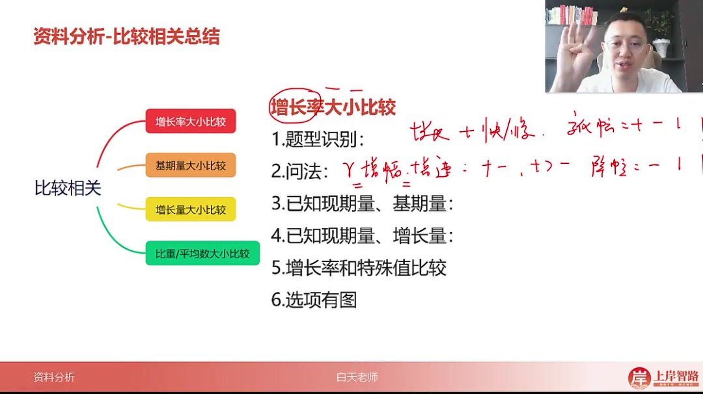
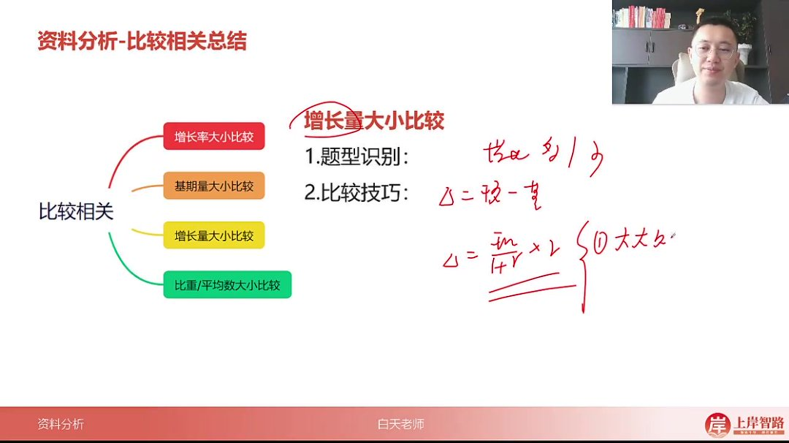
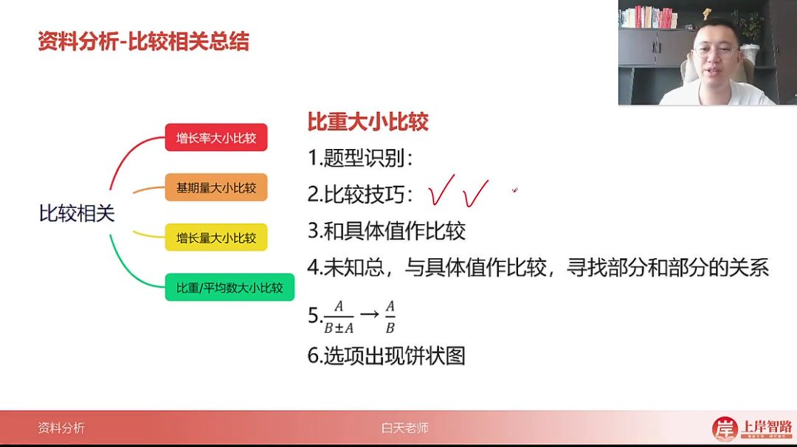
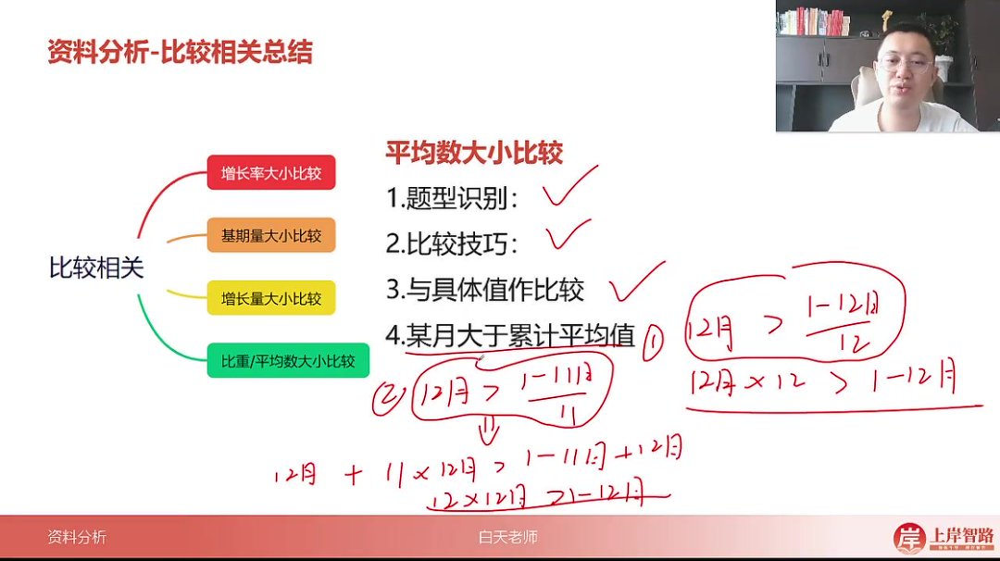

以下为 AI 生成的图文笔记的内容

#### 一、比较相关总结 00:03

##### 1. 增长率大小比较 00:45

###### 1）题型识别 00:49

-   
-   关键词识别：题目出现"增长率"时比较最大/最小；仅出现"增长"时用"快/慢"描述
-   等价表述："增长率"、"增幅"、"增速"三者完全等价，均需带正负号比较

###### 2）问法不同 01:03

-   降幅比较：必须为负值，比较绝对值大小
-   变化幅度：正负均可，比较绝对值大小
-   正负规则：正增长率永远大于负增长率

###### 3）已知条件 01:59

-   现期与基期差距大

    ：直接比较

    现期基期\frac{现期}{基期}基期现期

    比值

-   现期与基期差距小(<2 倍)

    ：

    -   计算所有选项增长量

        Δ=现期 − 基期\Delta=现期-基期 Δ=现期 − 基期

    -   运用分数性质比较

        Δ 基期\frac{\Delta}{基期}基期 Δ

    -   剩余选项估算首位

-   图表分析：柱状图高度差/折线图斜率仅代表增长量大小，与增长率无必然联系

###### 4）已知现期量和增长量 03:31

-   比较公式

    ：增长率大小等价于

    增长量现期量\frac{增长量}{现期量}现期量增长量

    比较

-   计算技巧：四个选项均不减增长量，直接比较比值关系

###### 5）和特殊值比较 03:50

-   0 比较：现期>基期即满足

-   1%比较

    ：

    增长量基期量 ≈ 增长量现期量\frac{增长量}{基期量}≈\frac{增长量}{现期量}基期量增长量 ≈ 现期量增长量

-   常见口诀

    ：

    -   10%：错位相加
    -   15%：错位相加+其半值
    -   20%：前两位 ×2 后错位相加
    -   50%：基期+基期半值
    -   100%：检查现期是否为基期 2 倍
    -   -10%：错位相减

###### 6）有图情况下的增长率大小比较 04:42

-   双重排除法

    ：

    -   通过正负关系排除（正>负）
    -   通过局部特征排除（如最高/最低点）

-   图形特征：优先识别极值点与选项对应关系

##### 2. 基期量大小比较 05:16

-   

-   题型特征：问"过去的量"大小比较，考评较低

-   实用技巧

    ：

    -   现期量大 → 基期量通常也大（生活常识）
    -   精确比较：分母修正为相同后比较分子

##### 3. 增长量大小比较 05:50

-   表述差异："增长量"对应最大/最小，"增长"对应最多/最少

-   比较口诀

    ：

    -   大大则大：现期量和增长率均大 → 增长量必大
    -   一大一小看乘积：近似比较现期量 × 增长率

-   特殊情况：当乘积接近且增长率差异大时，需用百化分精确计算

##### 4. 比重/平均数大小比较 07:07

###### 1）和具体值作比较 07:26

-   转化技巧

    ：占比>5%转化为

    a>b×5%a>b×5\%a>b×5%

    （除法转乘法）

-   

###### 2）未知总，与具体值作比较 07:39

-   比例关系：若男>80%总 → 女<20%总 → 男:女>4:1
-   模型应用：通过部分量比例反推总体占比

###### 3）公式应用 08:22

-   等价关系

    ：

    AB±A⇔AB\frac{A}{B±A}⇔\frac{A}{B}B±AA⇔BA

    比较

-   实例

    ：

    男生总人数\frac{男生}{总人数}总人数男生

    比较等价于

    男生女生\frac{男生}{女生}女生男生

    比较

###### 4）选项出现饼状图 08:38

-   角度比例：部分量比例=扇形角度比例

-   关键角度

    ：

    -   90°→25%
    -   180°→50%
    -   270°→75%

##### 5. 平均数大小比较 09:15

-   

-   常规比较：同比重比较（分数性质/首位估算）

-   特殊情形

    ：

    -   当月>累计平均

        ：

        12 月>1−12 月和 1212 月>\frac{1-12 月和}{12}12 月>121−12 月和

    -   转化技巧：12 月 ×12>1-12 月和

    -   扩展应用

        ：

        12 月>1−11 月和 1112 月>\frac{1-11 月和}{11}12 月>111−11 月和

        等价于 12 月 ×12>1-12 月和

#### 二、课程总结 10:41

-   
-   高频考点：增长量比较、增长率比较为超高频考点
-   题量分布：国省考可能单场出现 3-4 题增长量比较
-   备考重点：需熟练掌握比较口诀与特殊值比较技巧

#### 三、知识小结

| 知识点         | 核心内容                                                                           | 考试重点/易混淆点                                                                    | 难度系数 |
| -------------- | ---------------------------------------------------------------------------------- | ------------------------------------------------------------------------------------ | -------- |
| 增长率比较     | 增长率、增速、增幅三者等价，比较时带正负号；降幅比较绝对值；变化幅度正负均比绝对值 | 问法差异：增长率/增幅/增速（带正负）、降幅（负比绝对值）、变化幅度（正负均比绝对值） | ★★★      |
| 增长率计算技巧 | 现期与基期差距大时直接除；差距小时用（现期-基期）/基期，先算增量再用分数性质排除   | 高度差/斜率仅代表增长量，与增长率无直接关系                                          | ★★★★     |
| 特殊值比较     | 与 0/1%/10%/15%/20%/50%/100%/负 10%比较的口诀（如 10%错位相加、50%基期加半等）     | 1%比较：增长量 ÷ 基期 ≈ 增长量 ÷ 现期                                                | ★★★      |
| 增长量比较     | 口诀：大大则大（现期大+增长率大 → 增长量大）、一大一小看乘积（现期 × 增长率估算）  | 乘积接近时需精确计算（百划分法）                                                     | ★★★★     |
| 比重比较       | 分数性质/估首位；与具体值比较时转乘法（如 a>5%b→a>5%×b）                           | 饼状图逻辑：部分量比例=角度比例；比重与 90°/180°/270° 对比                           | ★★       |
| 平均数比较     | 当月>累计平均值（如 12 月>1-12 月均值 →12×12 月>1-12 月总和）                      | 变形考法：12 月>1-11 月均值等价于 12 月>1-12 月均值                                  | ★★★      |
| 基期量比较     | 通常用现期量近似代替；修正思维统一分母比分子                                       | 低频率考点，难度低                                                                   | ★        |
