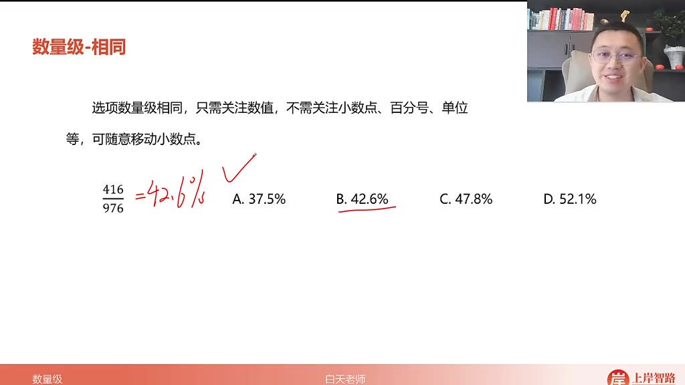
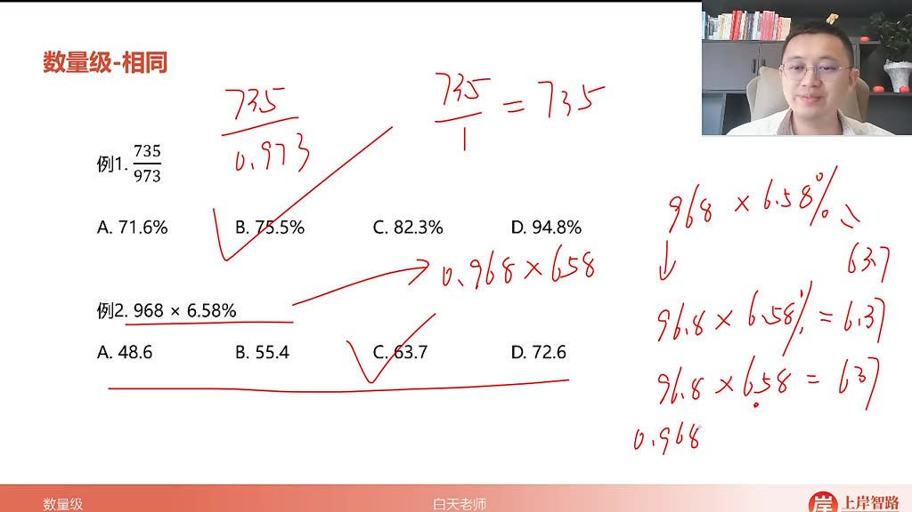
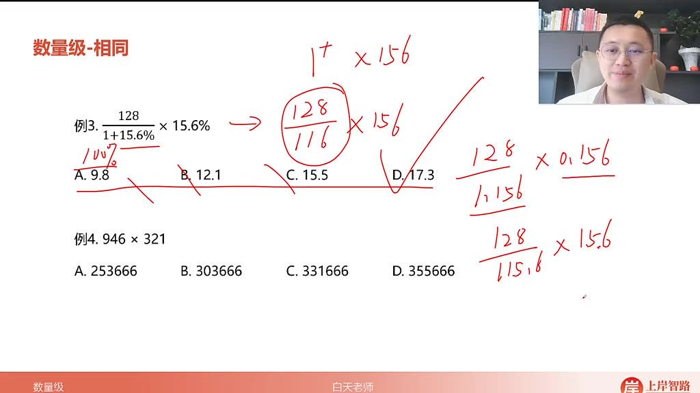
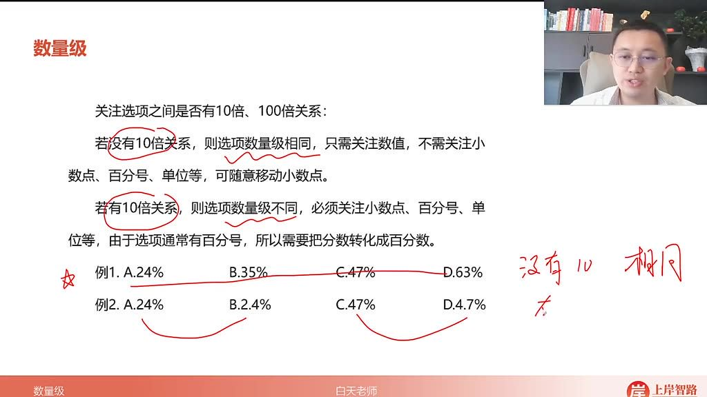
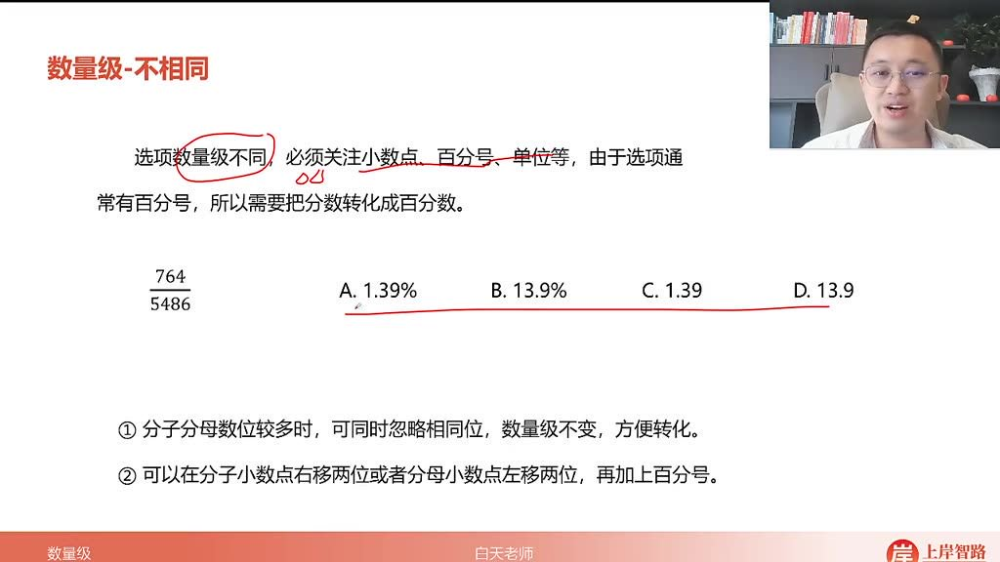
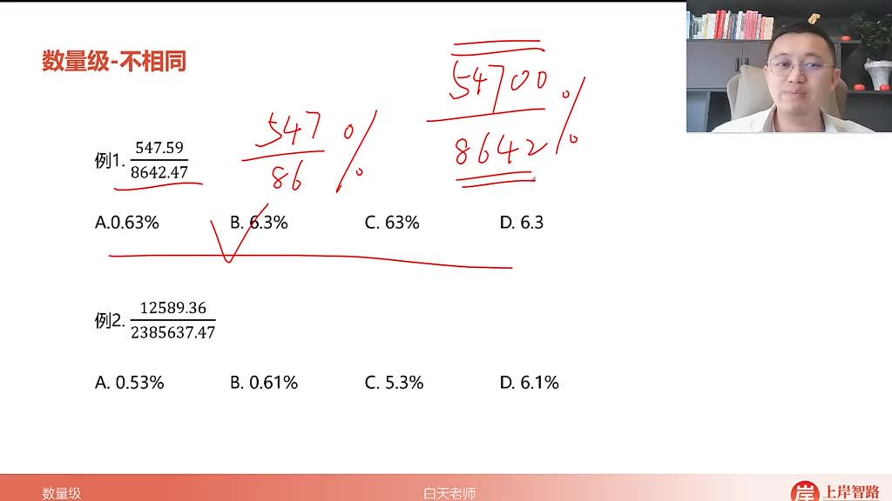
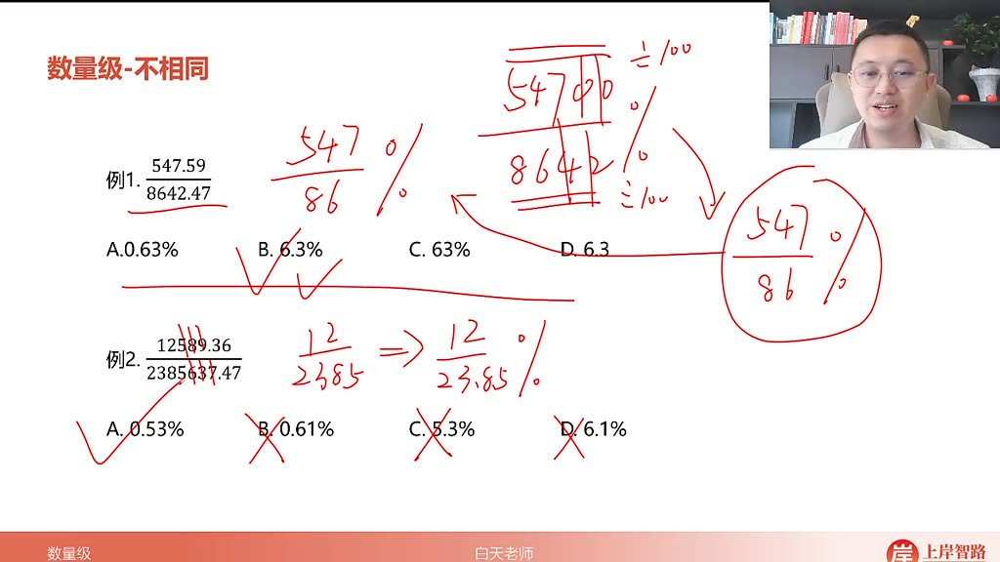
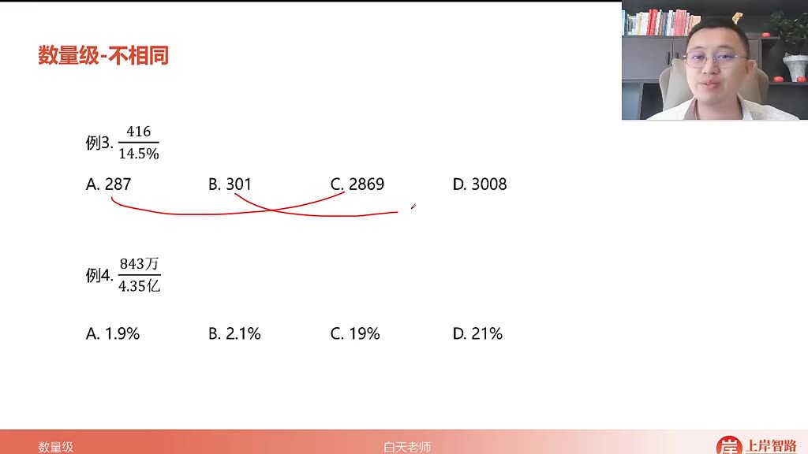
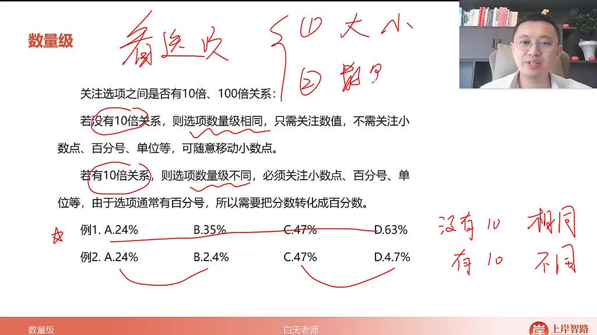

以下为 AI 生成的图文笔记的内容

#### 一、数量级分析 00:08

##### 1. 数量级 00:23

###### 1）数量级相同

-   判断标准：当选项之间没有 10 倍关系时，称为数量级相同。例如：A.24% B.35% C.47% D.63%这组选项数量级相同。

-   计算技巧

    ：

    -   只需关注数值，不需关注小数点、百分号、单位等
    -   可随意移动小数点位置而不影响最终数值判断
    -   分子分母同时乘以或除以相同倍数时，核心数值保持不变

-   例题:百分比计算

        01:32

        -   

        -   题目解析

            -   通过

                416976 $/\frac{416}{976}$ 976416

                ≈42.6%快速判断

            -   分子分母同时调整数量级时，核心数值"426"保持不变

            -   比较选项只需关注比 42.6 略大的数值

            -   答案：B.42.6%

-   例题:数量级相同计算

    03:45

    -   题目解析

        -   将

            735973 $/\frac{735}{973}$ 973735

            简化为 735÷0.973

        -   除以小于 1 的数结果略大于原数

        -   只需关注比 735 略大的选项

        -   答案：B.75.5%

-   例题:数量级相同计算

    06:46

    -   题目解析
        -   将 0.968×658%简化为 0.968×6.58
        -   比 1 小的数乘以 6.58 结果应小于 6.58
        -   只需关注前三位数字 637
        -   答案：C.63.7

-   例题:数量级相同计算

    08:30

    -   

    -   题目解析

        -   将

            1281+15.6%×15.6%\frac{128}{1+15.6\%}×15.6\%1+15.6%128×15.6%

            简化为

            128116×156 $/\frac{128}{116}$ ×156116128×156

        -   计算结果明显大于 156

        -   排除所有小于 156 的选项

        -   答案：D.17.3

###### 2）数量级不同 08:49

-   

-   判断标准：当选项之间存在 10 倍关系时，称为数量级不同。例如：A.24% B.2.4% C.47% D.4.7%

-   计算要求

    ：

    -   必须关注小数点、百分号、单位等
    -   需要将分数转化为百分数形式
    -   转化方法：
        -   分子小数点右移两位加百分号
        -   分母小数点左移两位加百分号

-   例题:百分数转化计算

    09:40

    -   

    -   题目解析

        -   将

            7645486 $/\frac{764}{5486}$ 5486764

            转化为百分数

        -   采用分母左移两位法：764÷54.86%

        -   首位商 1，判断为十几的百分数

        -   答案：B.13.9%

-   例题:百分数转化计算

    11:54

    -   

    -   题目解析

        -   将

            547.598642.47\frac{547.59}{8642.47}8642.47547.59

            简化为 547÷86%

        -   计算结果约等于 6

        -   判断数量级应为百分之几

        -   答案：B.6.3%

-   例题:百分数转化计算

    14:07

    -   

    -   题目解析

        -   将

            12589.362385637.47\frac{12589.36}{2385637.47}2385637.4712589.36

            简化为 12÷23.85%

        -   计算结果约 0.5

        -   判断数量级应为千分之几

        -   答案：A.0.53%

-   例题:百分数转化计算

    14:59

    -   
    -   题目解析
        -   将 843 万 ÷4.35 亿转化为 843÷43500
        -   再转化为 843÷435%
        -   计算结果明显小于 2%
        -   答案：A.1.9%

##### 2. 数量级的总结 16:12

-   

-   核心原则

    ：

    -   先判断选项间是否存在 10 倍关系
    -   数量级相同：可忽略小数点位置，专注数值比较
    -   数量级不同：必须严格处理小数点和单位转化

-   实用技巧

    ：

    -   乘以 900+的数可视为乘以 0.9（数值会变小）
    -   除以 900+的数可视为除以 0.9（数值会变大）
    -   大数字计算时可分子分母同时忽略相同位数

#### 二、知识小结

| 知识点               | 核心内容                                                                                                                                       | 考试重点/易混淆点                                                                         | 难度系数 |
| -------------------- | ---------------------------------------------------------------------------------------------------------------------------------------------- | ----------------------------------------------------------------------------------------- | -------- |
| 数量级分析           | 通过选项间的倍数关系（如十倍）判断数量级是否相同，决定计算时是否需关注小数点、百分号或单位。                                                   | 选项无十倍关系时：仅关注数值，可随意移动小数点；选项有十倍关系时：必须关注小数点/百分号。 | ⭐⭐     |
| 数值计算简化技巧     | 分子/分母同步移动小数点或增减零，保持数值核心部分（如前三位）不变。例：四幺六 ÷ 九七六 ≈ 四二六，移动小数点后仍保持四二六逻辑。                | 易混淆点：忽略数量级差异导致单位错误；重点：通过选项反推计算精度需求。                    | ⭐⭐⭐   |
| 百分号转化方法       | 方案一：分子小数点右移两位加百分号；方案二：分母小数点左移两位加百分号（更常用）。例：七六四 ÷ 五四八六 → 七六四 ÷ 五四.八六%。                | 关键操作：分子/分母同步忽略相同位数保持量级，如八六四二 → 八六.四二%。                    | ⭐⭐     |
| 乘除法的快速估算     | 乘法：×900 多 ≈×0.9，结果数值变小；除法：÷900 多 ≈÷0.9，结果数值变大。例：123×900 多 ≈123×0.9=110.7。                                          | 易错点：混淆乘除方向对数值的影响。                                                        | ⭐⭐     |
| 数量级不同的解题策略 | 必须严格处理单位，如 1.39 与 1.39%的差异。通过分子/分母同步缩放（如 ÷1000）简化大数计算。例：四幺六零零 ÷ 十四.五 → 四幺六 ÷ 〇.一四五 ≈3000。 | 核心技巧：利用选项差距快速排除（如商三不到排除 B/D）。                                    | ⭐⭐⭐   |
