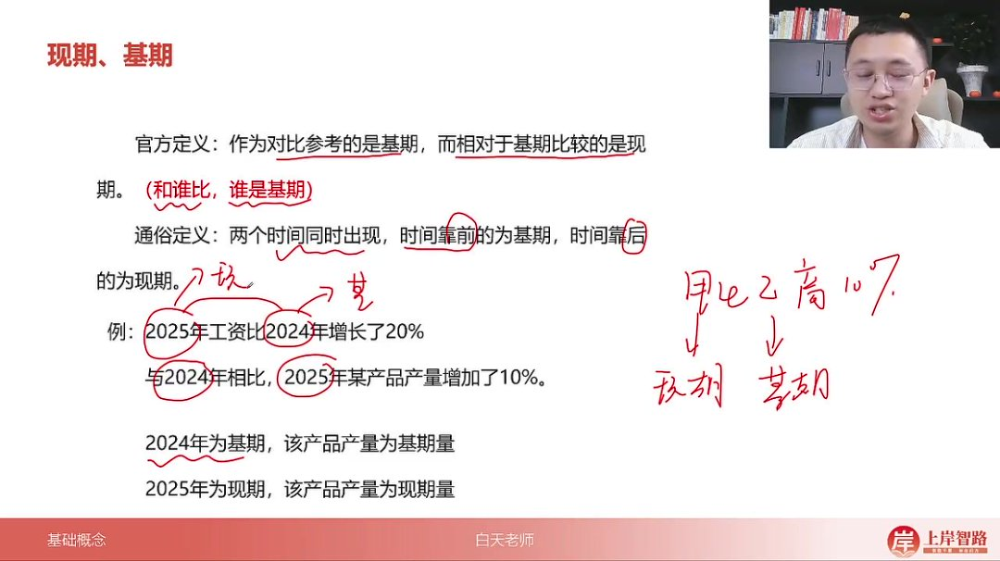
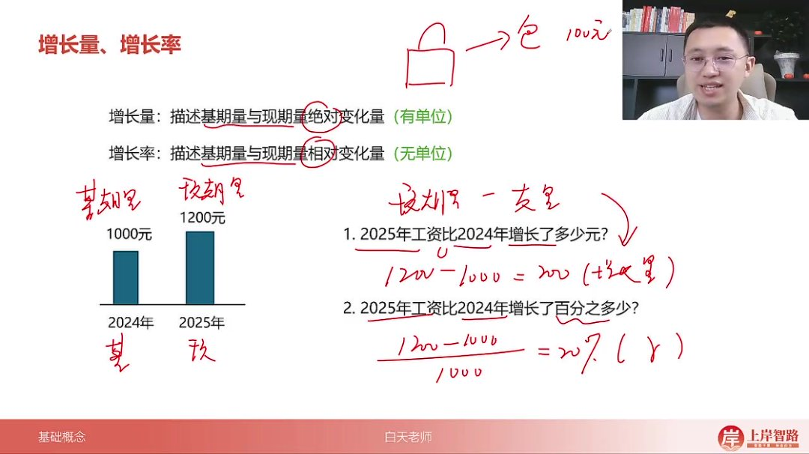
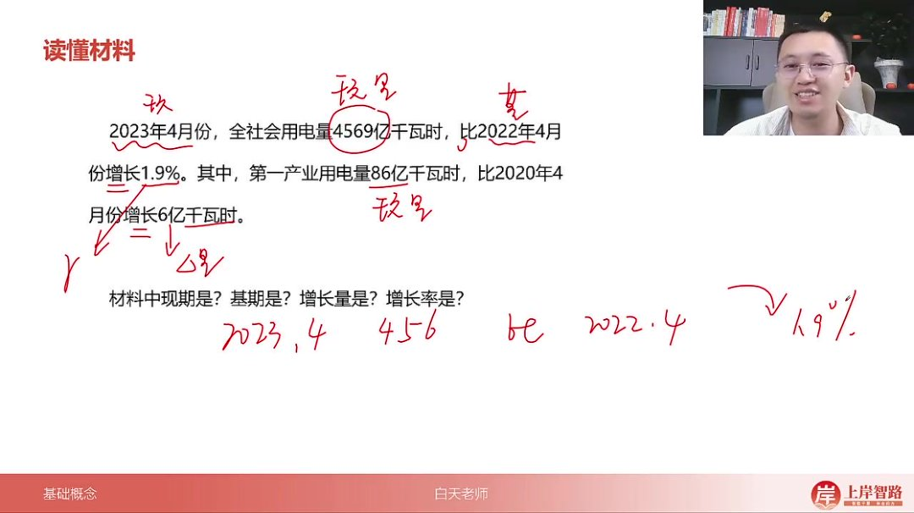
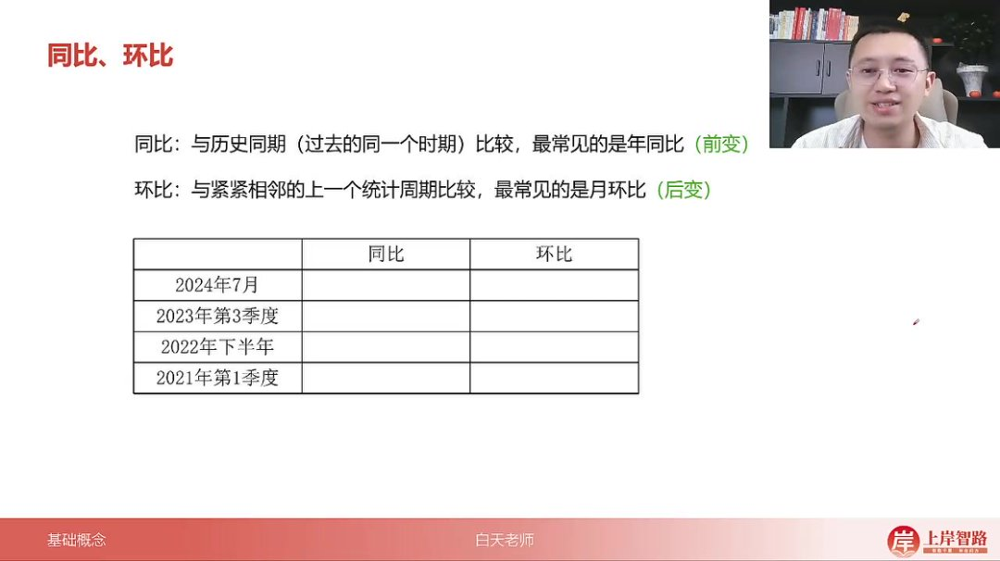
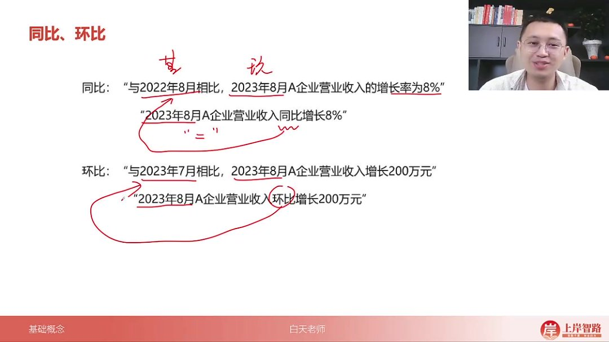
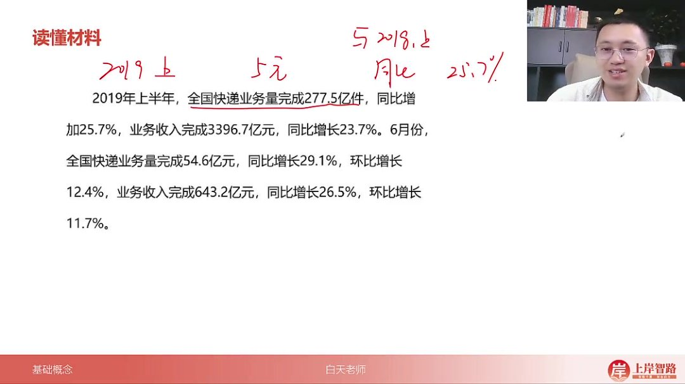

以下为 AI 生成的图文笔记的内容

#### 一、基础概念 00:05

##### 1. 现期、基期 00:28

-   

-   官方定义：作为对比参考的是基期，相对于基期比较的是现期。核心判断标准是"和谁比，谁是基期"。

-   通俗定义：两个时间同时出现时，时间靠前的为基期，时间靠后的为现期。

-   判断方法

    ：

    -   方法一：通过比较关系判断（如"2025 年比 2024 年增长"，2024 是基期）
    -   方法二：通过时间先后判断（如 2024 和 2025 年，2024 是基期）

-   实例说明

    ：

    -   例 1：2025 年工资比 2024 年增长 20% → 2024 基期，2025 现期
    -   例 2：甲比乙高 10% → 乙是基期，甲是现期

-   记忆要点：统计材料通常用现在与过去比较（如"今年比去年"），很少用过去与现在比较。

##### 2. 增长量、增长率 02:49

-   

-   基本关系式

    ：

    -   增长量 = 现期量 - 基期量（有单位）
    -   增长率 = (现期量 - 基期量)/基期量（无单位，用%表示）

-   实例说明

    ：

    -   例 1：2025 年工资 1200 元比 2024 年 1000 元 → 增长量 200 元
    -   例 2：同上情况 → 增长率 20%

-   生活化理解

    ：

    -   增长量：商品涨价 100 元（绝对变化）
    -   增长率：商品涨价 10%（相对变化）

-   表示符号：增长率常用 r 表示

##### 3. 读懂材料 05:18

-   

-   材料解析要点

    ：

    -   2023 年 4 月用电量 4569 亿千瓦时（现期量）
    -   比 2022 年 4 月增长 1.9%（增长率）
    -   第一产业用电量 86 亿千瓦时（现期量）
    -   比 2020 年 4 月增长 6 亿千瓦时（增长量）

-   对应关系

    ：

    -   时间靠后的是现期（2023）
    -   时间靠前的是基期（2022）
    -   增长量用 △ 表示

##### 4. 同比、环比 06:36

-   

-   定义对比

    ：

    -   同比：与历史同期比较（年同比最常见）
    -   环比：与相邻上一统计周期比较（月环比最常见）

-   记忆口诀

    ：

    -   同比是"前变"（年份变，月份不变）
    -   环比是"后变"（月份变，年份不变）

-   实例说明

    ：

    -   例 1：2023 年 8 月同比增长 8% → 与 2022 年 8 月比
    -   例 2：2023 年 8 月环比增长 200 万 → 与 2023 年 7 月比

-   特殊周期处理

    ：

    -   季度：2023 年 Q3 同比 →2022 年 Q3，环比 →2023 年 Q2
    -   下半年：2022 年下半年环比 →2022 年上半年
    -   

-   材料表述特点

    ：

    -   "同比增长"等价于"与上年同期相比"
    -   "环比增长"等价于"与上一相邻周期相比"

##### 5. 读懂材料 10:07

-   

-   材料解析示范

    ：

    -   2019 年上半年业务量 277.5 亿件（现期量）
        -   同比增 25.7% → 与 2018 年上半年比
    -   2019 年 6 月业务量 54.6 亿件（现期量）
        -   同比增 29.1% → 与 2018 年 6 月比
        -   环比增 12.4% → 与 2019 年 5 月比

-   对应关系练习

    ：

    -   现期量 → 当前统计值
    -   增长率 → 带%的变化量
    -   增长量 → 带单位的变化值

#### 二、知识小结

| 知识点     | 核心内容                                                                                                        | 考试重点/易混淆点                                  | 难度系数 |
| ---------- | --------------------------------------------------------------------------------------------------------------- | -------------------------------------------------- | -------- |
| 现期与基期 | 作为对比参考的是基期，相对基期比较的是现期。区分方法：1. 和谁比，谁是基期 2. 时间靠前的是基期，时间靠后的是现期 | - 基期量 vs 现期量- 时间顺序判断错误               | ⭐⭐     |
| 增长量     | 描述机器和现期的绝对变化量，公式：现期量 - 基期量 = 增长量                                                      | - 增长量为具体数值（如 200 元）- 易与增长率混淆    | ⭐⭐     |
| 增长率     | 描述相对变化量，公式：(现期量 - 基期量) / 基期量 × 100%                                                         | - 增长率为百分比（如 20%）- 需区分增长量与增长率   | ⭐⭐⭐   |
| 同比       | 与历史同期比较（如 2023 年 8 月 vs 2022 年 8 月），常见于年同比                                                 | - 同比：年份变化，月份不变- 易与环比混淆           | ⭐⭐     |
| 环比       | 与相邻上一统计周期比较（如 2023 年 8 月 vs 2023 年 7 月），常见于月环比                                         | - 环比：年份不变，月份变化- 季度环比需注意跨年情况 | ⭐⭐⭐   |
| 实例分析   | 材料解读示例：- 2023 年 4 月用电量 vs 2022 年 4 月 → 同比- 2023 年 6 月快递量 vs 2023 年 5 月 → 环比            | - 材料中隐含的时间对比关系- 百分号（%）判断增长率  | ⭐⭐⭐   |
