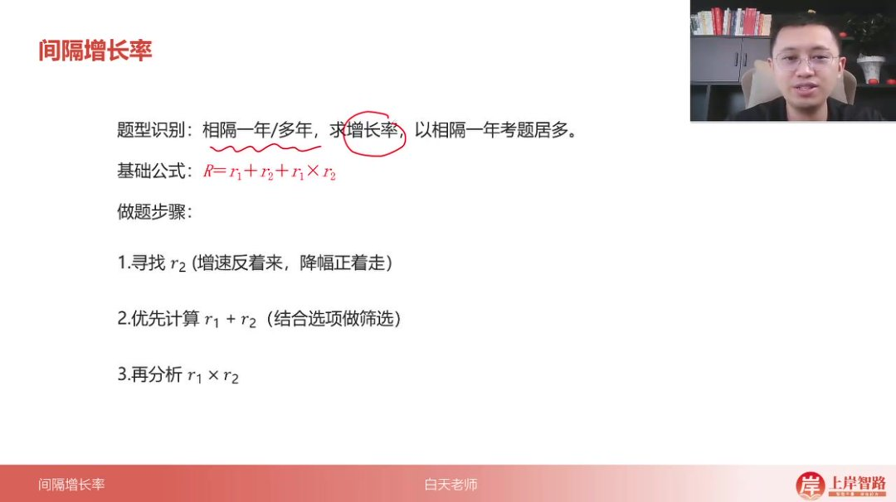
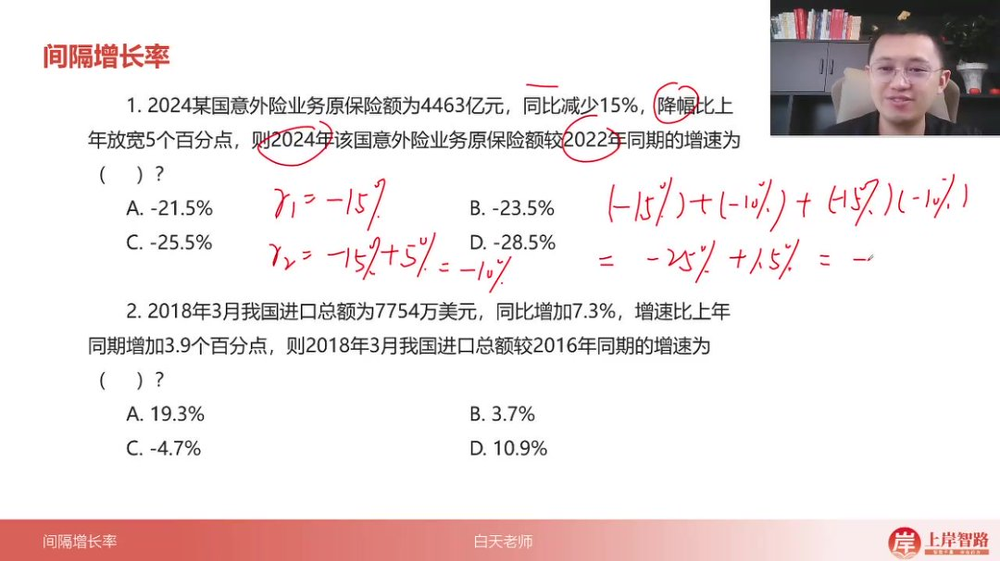
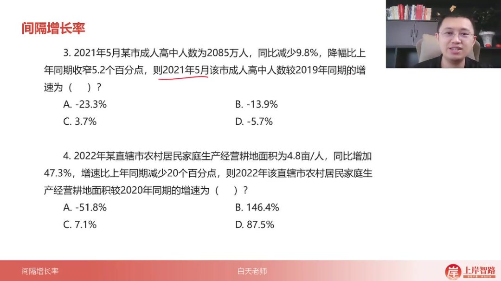
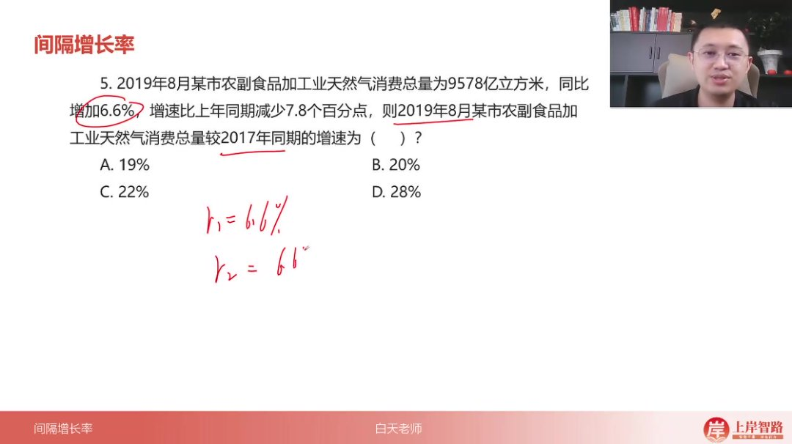
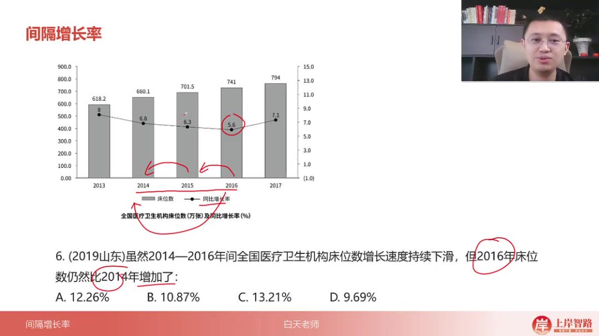
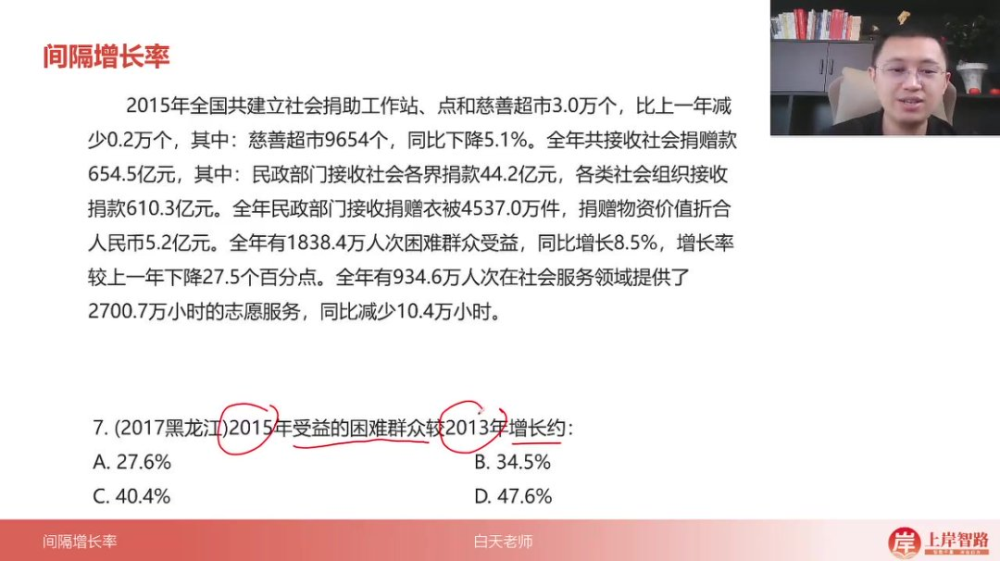
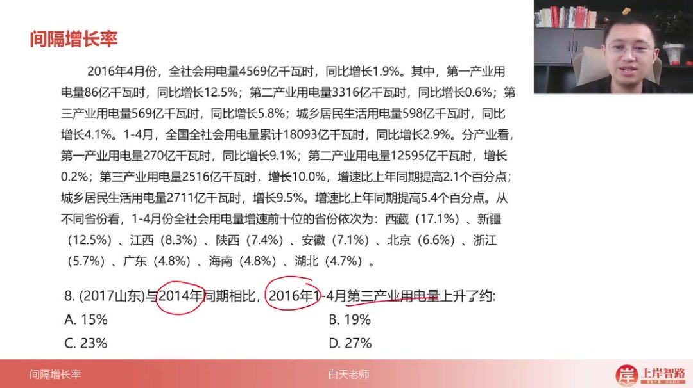
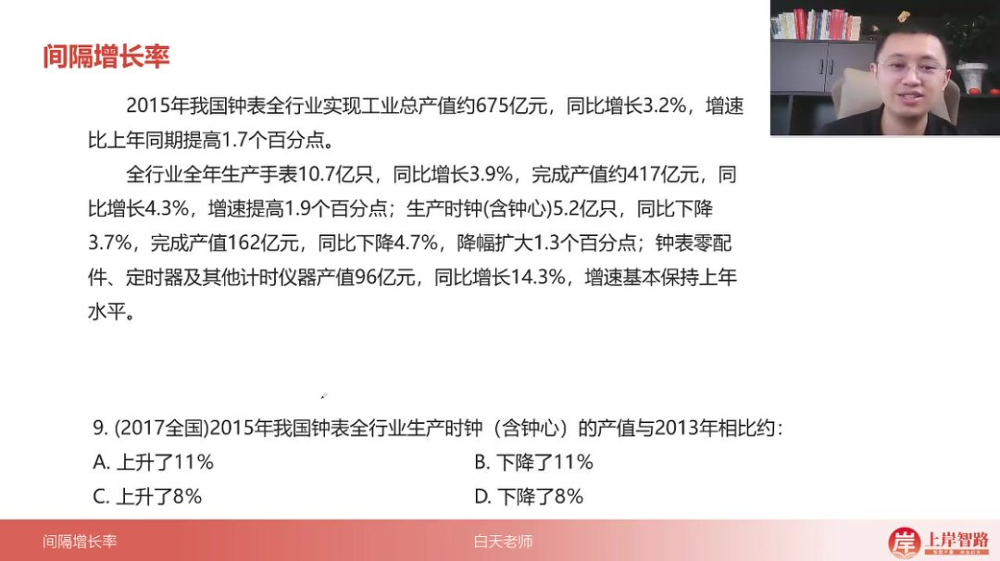
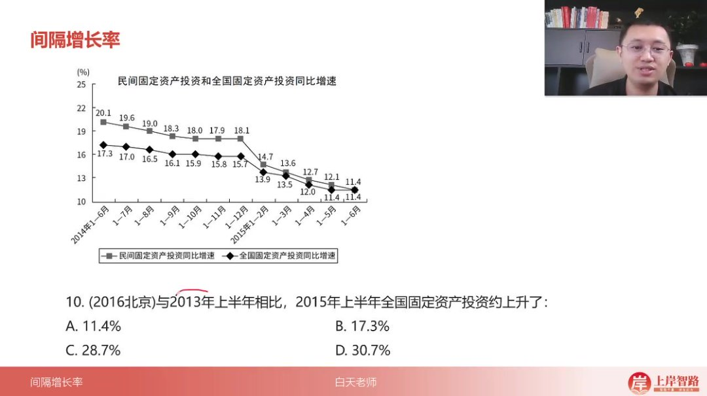

以下为AI生成的图文笔记的内容

#### 一、间隔增长率 00:02

##### 1. 间隔增长率 00:09

- 

- 题型识别：相隔一年/多年求增长率，以相隔一年考题居多

- 基础公式

  ：

  R=r1+r2+r1×r2R = r_{1} + r_{2} + r_{1} \times r_{2}R=r1+r2+r1×r2

- 计算技巧

  ：当

  r1r_1r1

  和

  r2r_2r2

  都小于10%时，乘积项可忽略不计（10%×10%=1%）

- 速算方法

  ：计算

  r1×r2r_1 \times r_2r1×r2

  时，去掉百分号直接相乘后加百分号（如20%×6%=1.2%）

###### 1）做题步骤 00:22

- 步骤1

  ：寻找

  r2r_2r2

  （使用口诀"增速反着来，降幅正着走"）

- 步骤2

  ：优先计算

  r1+r2r_1 + r_2r1+r2

  （结合选项做筛选）

- 步骤3

  ：分析

  r1×r2r_1 \times r_2r1×r2

  （根据数值大小决定是否计算）

- 正负号规则：公式中必须带正负号，注意负负得正的情况

##### 2. 应用案例 01:11

###### 1）例题:间隔年求增长率

- 题目解析

  - r1r_1r1

    =-15%（同比减少15%）

  - r2r_2r2

    计算：降幅放宽5个百分点→-15%+5%=-10%

  - 计算过程：(-15%)+(-10%)+(-15%)×(-10%)=-25%+1.5%=-23.5%

  - 易错点：注意负负得正导致最后一项变为加法

  - 答案：B.-23.5%

###### 2）例题:间隔两年求增长率 02:11

- 题目解析

  - r1r_1r1

    =7.3%（同比增加7.3%）

  - r2r_2r2

    计算：增速增加3.9个百分点→7.3%-3.9%=3.4%

  - 估算：7.3%+3.4%=10.7%，乘积项较小可忽略

  - 答案：D.10.9%

###### 3）例题:间隔年求增长率 02:40

- 题目解析

  - r1r_1r1

    =-9.8%（同比减少9.8%）

  - r2r_2r2

    计算：降幅收窄5.2个百分点→-9.8%-5.2%=-15%

  - 估算：(-9.8%)+(-15%)+乘积≈-25%（乘积为正但很小）

  - 答案：A.-23.3%

###### 4）例题:间隔两年求增长率 03:24

- 题目解析

  - r1r_1r1

    =47.3%（同比增加47.3%）

  - r2r_2r2

    计算：增速减少20个百分点→47.3%+20%=67.3%

  - 计算：47.3%+67.3%=114.6%，乘积约35%→总和≈150%

  - 答案：B.146.4%

###### 5）例题:间隔两年求增长率 04:11

- 

- 题目解析

  - r1r_1r1

    =6.6%（同比增加6.6%）

  - r2r_2r2

    计算：增速减少7.8个百分点→6.6%+7.8%=14.4%

  - 估算：6.6%+14.4%=21%，乘积约1%→总和≈22%

  - 答案：C.22%

###### 6）例题:间隔两年求增长率 04:49

- 

- 题目解析

  - 正确识别

    r1r_1r1

    =6.3%（2016年同比增速）

  - 正确识别

    r2r_2r2

    =5.6%（2015年同比增速）

  - 计算：6.3%+5.6%=11.9%，乘积约0.35%→总和≈12.26%

  - 注意：避免误用2014年增速（6.8%是2014vs2013）

  - 答案：A.12.26%

###### 7）例题:间隔两年求增长率 06:04

- 

- 题目解析

  - r1r_1r1

    =8.5%（同比增长8.5%）

  - r2r_2r2

    计算：增速下降27.5个百分点→8.5%+27.5%=36%

  - 估算：8.5%+36%=44.5%，乘积约3%→总和≈47.5%

  - 答案：D.47.6%

###### 8）例题:间隔一年求增长率 07:12

- 

- 题目解析

  - r1r_1r1

    =10.0%（第三产业用电量增速）

  - r2r_2r2

    计算：增速提高2.1个百分点→10.0%-2.1%=7.9%

  - 估算：10%+8%=18%，乘积约0.8%→总和≈18.8%

  - 答案：B.17.3%（选项最接近）

###### 9）例题:间隔两年求增长率 07:54

- 

- 题目解析

  - r1r_1r1

    =-4.7%（产值同比下降4.7%）

  - r2r_2r2

    计算：降幅扩大1.3个百分点→-4.7%+1.3%=-3.4%

  - 计算：(-4.7%)+(-3.4%)+乘积≈-8.1%（乘积可忽略）

  - 答案：D.-8%

###### 10）例题:间隔两年求增长率 08:55

- 

- 题目解析

  - r1r_1r1

    =11.4%（2015年上半年增速）

  - r2r_2r2

    =17.3%（2014年上半年增速）

  - 计算：11.4%+17.3%=28.7%，乘积约2%→总和≈30.7%

  - 答案：D.30.7%

#### 二、知识小结

| 知识点                | 核心内容                                                     | 考试重点/易混淆点                          | 难度系数 |
| --------------------- | ------------------------------------------------------------ | ------------------------------------------ | -------- |
| 间隔增长率定义        | 时间隔一年或多年求增长率，公式：大R = r₁ + r₂ + r₁×r₂        | 时间间隔识别（隔年计算）                   | ⭐⭐       |
| 解题步骤              | 1. 确定r₁和r₂（增速反着来，降幅跟着走）2. 代入公式计算3. 结合选项筛选（r₁×r₂可忽略条件：均<10%） | 正负号处理（负负得正）“增速反着来”口诀应用 | ⭐⭐⭐      |
| 典型例题1（负增长率） | r₁=-15%，r₂=-10% → R= -25% + 1.5% = -23.5%                   | 乘积项符号易错（负×负=正）                 | ⭐⭐⭐      |
| 典型例题2（高增长率） | r₁=47%，r₂=67% → R=114% + 31.5% ≈145%                        | 大数值乘积需精确计算                       | ⭐⭐       |
| 速算技巧              | 1. r₁×r₂估算：均<10%可忽略2. 小数乘法：20%×6% → 1.2%（去百分号直接乘） | 选项对比优先（如44.5%直接排除44%选项）     | ⭐⭐⭐      |
| 真题易错点            | 1. 同比增速定位错误（如第六题需用2015→2014增速，非2014→2013）2. 时间范围混淆（如第十题“上半年”数据限定） | 表格数据与增长率匹配                       | ⭐⭐⭐⭐     |