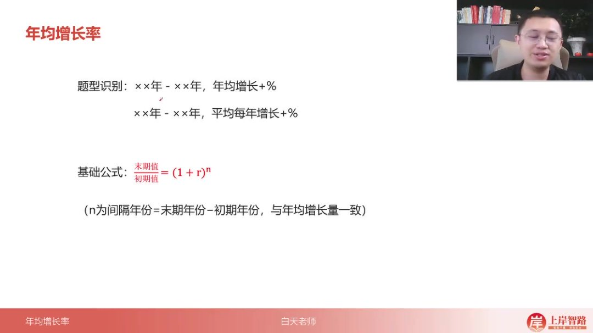
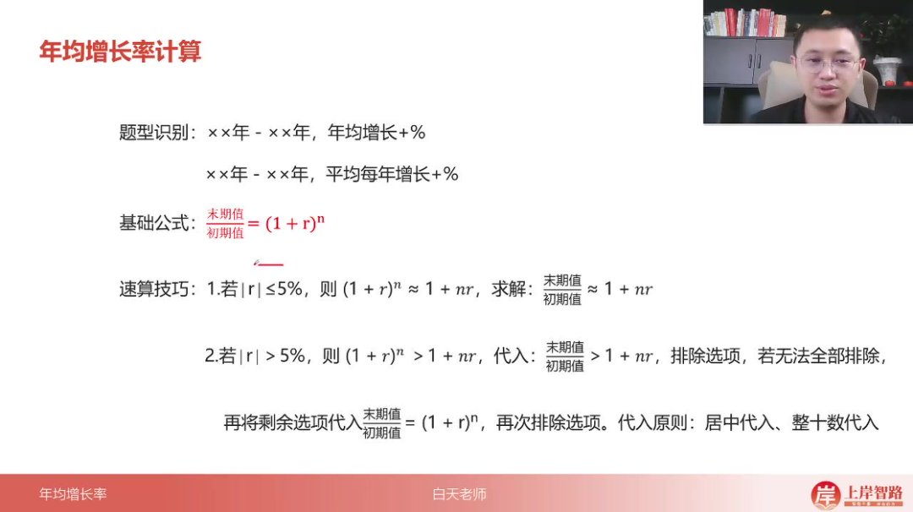
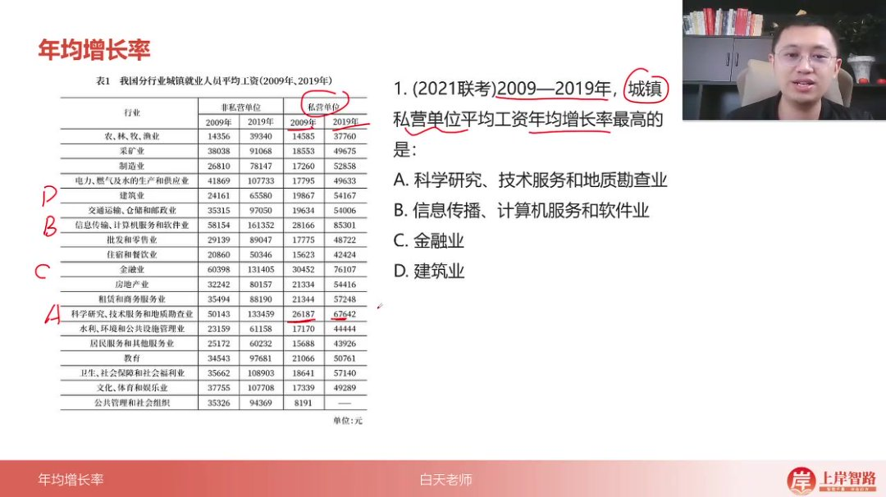
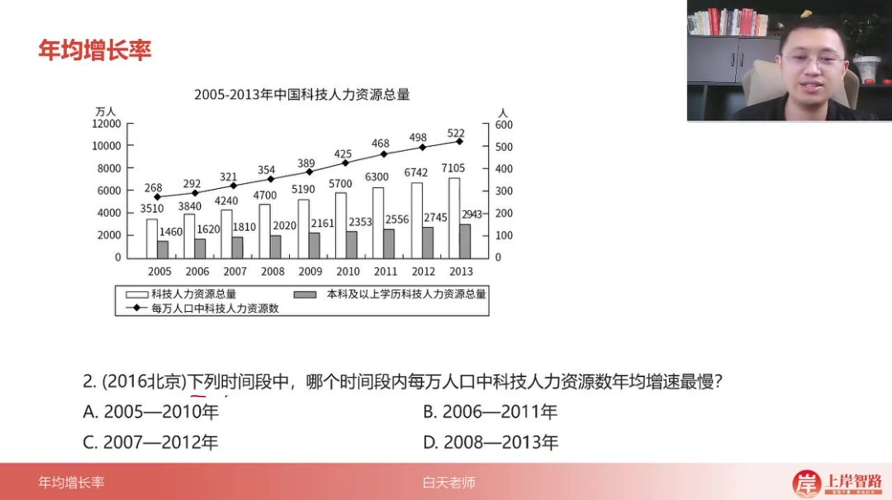
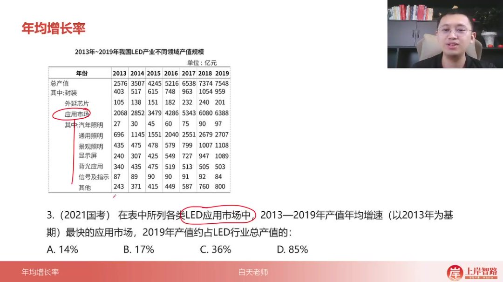
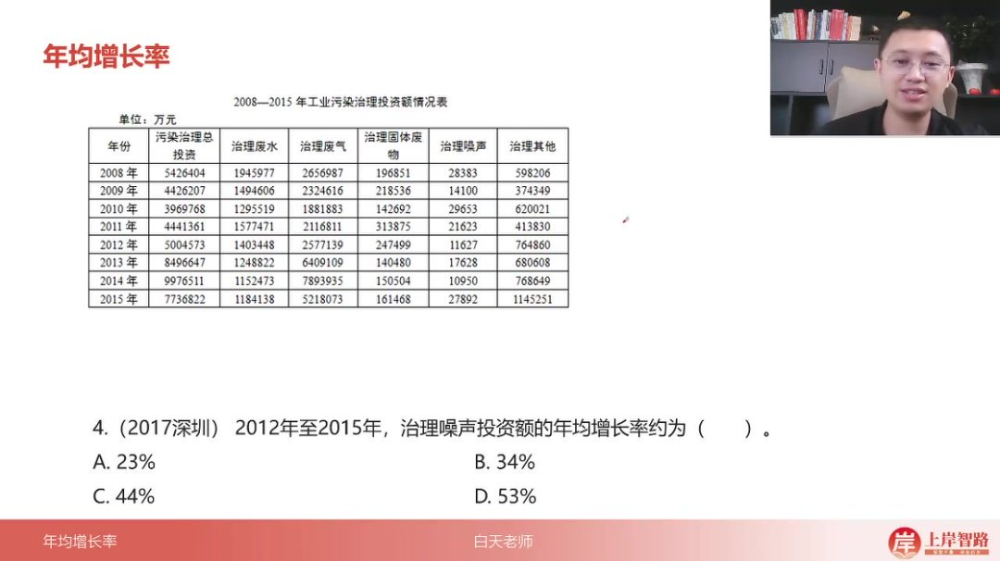
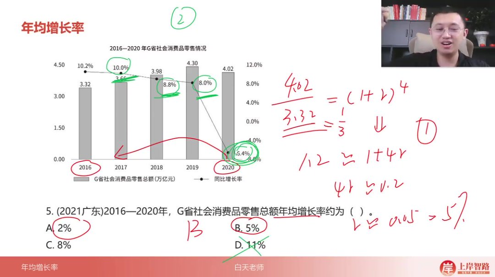

以下为AI生成的图文笔记的内容

#### 一、年均增长率 00:02

##### 1. 基本概念 00:05

- 

- 题型识别：当题目中出现"××年-××年，年均增长+%"或"××年-××年，平均每年增长+%"时，考查年均增长率计算

- 基础公式

  ：

  末期值/初期值=(1+r)n末期值/初期值=(1+r)^n末期值/初期值=(1+r)n

  ，其中：

  - n为间隔年份=末期年份-初期年份
  - 与年均增长量的年份计算方式一致

##### 2. 比较技巧

- 比较题型：当题目要求比较"××年-××年，年均/年平均增长最快"或进行"年均增速排序"时

- 核心方法

  ：

  - 当n相同时，直接比较末期值/初期值的比值
  - 比值越大，年均增长率越大；比值越小，年均增长率越小

##### 3. 速算技巧

- 

- 近似计算

  ：

  - 若

    ∣r∣≤5|r|≤5%∣r∣≤5

    ，则

    (1+r)n≈1+nr(1+r)^n≈1+nr(1+r)n≈1+nr

    ，可直接用

    末期值/初期值≈1+nr末期值/初期值≈1+nr末期值/初期值≈1+nr

    求解

  - 若

    ∣r∣>5|r|>5%∣r∣>5

    ，则

    (1+r)n>1+nr(1+r)^n>1+nr(1+r)n>1+nr

    ，需先排除不满足

    末期值/初期值>1+nr末期值/初期值>1+nr末期值/初期值>1+nr

    的选项

- 代入原则

  ：

  - 居中代入：优先选择中间值进行验证
  - 整十数代入：优先选择10%、20%等整十数进行计算

##### 4. 例题解析 00:59

###### 1）例题：年均增长率比较

- 

- 题目解析：

  - 审题要点：比较2009-2019年城镇私营单位平均工资年均增长率最高行业

  - 易错点

    ：

    - 材料顺序与选项顺序不一致需仔细对应
    - 必须使用私营单位数据而非非私营单位数据

  - 解题步骤

    ：

    - 计算各选项2019年值/2009年值的比值
    - 通过首位估算快速比较：A≈2+，B≈3+，C≈2+，D≈2+

  - 答案：B选项（信息传输、计算机服务和软件业）

###### 2）例题：年均增速最慢区间

- 

- 题目解析：

  - 审题要点：找出年均增速最慢的时间段（注意是找最小值）

  - 解题技巧

    ：

    - 各选项间隔年份均为5年，可直接比较末期值/初期值
    - 将比值统一表示为"1+分数"形式便于比较
    - 分子相同情况下，分母越大值越小

  - 答案：D时间段

###### 3）例题：年均增速最快市场

- 

- 题目解析：

  - 审题要点：找出2013-2019年LED应用市场中产值年均增速最快的子市场

  - 解题步骤

    ：

    - 通过首位估算快速比较各子市场2019年值/2013年值比值
    - 显示屏子市场比值最大（约4+倍）
    - 计算2019年显示屏产值占LED行业总产值比例（≈1/7≈14.3%）

  - 答案：A选项（14%）

###### 4）例题：治理噪声投资额年均增长率 06:12

- 

- 题目解析：

  - 审题要点：计算2012-2015年治理噪声投资额的年均增长率

  - 解题步骤

    ：

    - 建立方程：

      27892/11627=(1+r)3≈2.427892/11627=(1+r)^3≈2.427892/11627=(1+r)3≈2.4

    - 因选项均>5%，先用

      2.4>1+3r2.4>1+3r2.4>1+3r

      排除D选项（r<47%）

    - 居中代入验证：

      - 30%：(1.3)^3≈2.197<2.4→实际r>30%
      - 40%：(1.4)^3≈2.744>2.4→实际r<40%

  - 答案：B选项（34%）

###### 5）例题：社会消费品零售总额年均增长率 08:48

- 

- 题目解析：

  - 审题要点：计算2016-2020年G省社会消费品零售总额年均增长率

  - 方法一

    ：

    - 建立方程：

      4.02/3.32≈1.2=(1+r)44.02/3.32≈1.2=(1+r)^44.02/3.32≈1.2=(1+r)4

    - 当r较小时，近似

      1.2≈1+4r1.2≈1+4r1.2≈1+4r

      →

      r≈5r≈5%r≈5

  - 方法二

    ：

    - 观察各年增长率：10.2%、8.8%、8.0%、-6.4%
    - 排除法：
      - 11%：超过任何单年增速→不合理
      - 8%：受负增长影响实际应更低
      - 2%：受前期正增长影响实际应更高

  - 答案：B选项（5%）

#### 二、知识小结

| 知识点           | 核心内容                                              | 考试重点/易混淆点                                        | 难度系数 |
| ---------------- | ----------------------------------------------------- | -------------------------------------------------------- | -------- |
| 年均增长率公式   | 末期÷初期 = (1+r)^n（n=末期年份-初期年份）            | 易错点：n的取值（是否含初期年份）                        | ★★       |
| 年均增长率比较   | n相同时，直接比较（末期÷初期）的值                    | 易混淆：材料数据顺序与选项不一致（如私营 vs 非私营单位） | ★★★      |
| 计算技巧（r≤5%） | 近似公式：末期÷初期 ≈ 1+nr                            | 重点：选项均≤5%时适用，快速估算                          | ★★       |
| 计算技巧（r>5%） | 先排除法：末期÷初期 > 1+nr；再代入原始公式验证        | 难点：居中代入整十数（如30%、40%）                       | ★★★★     |
| 年均增速最慢判定 | 分子相同比较分母（分母越大值越小）                    | 易错：题目要求找最小值而非最大值                         | ★★★      |
| 估算法应用       | 首位商法快速比较（如“商3+”>“商2+”）                   | 案例：LED市场中显示屏增速最快（首位商4+）                | ★★★      |
| 实际题目解析     | 例：2012-2015年噪声治理投资额年均增长率（r≈35%）      | 关键步骤：1.4^3≈2.8 > 2.4（实际值） > 1.3^3≈2.2          | ★★★★     |
| 选项分析技巧     | 结合历年实际增长率排除极端选项（如年均8% vs 单年-6%） | 案例：2016-2020年增长率排除11%（无单年达11%）            | ★★★      |