以下为 AI 生成的图文笔记的内容

#### 一、增长率比较 00:01

##### 1. 增长率大小比较 00:05

###### 1）题目问法 00:16

-   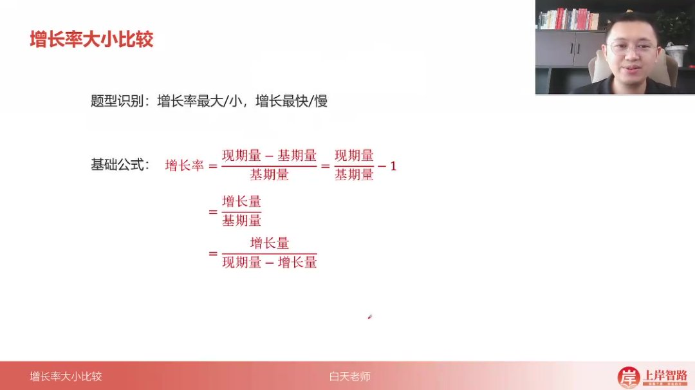

-   识别特征：当题目出现"增长率最大/最小"、"增长最快/最慢"等表述时，考查的是增长率比较问题

-   比较规则

    ：

    -   增长率/增速/增幅：可正可负，需带符号比较
    -   降幅：必须为负数，比较绝对值大小
    -   变化幅度：可正可负，比较绝对值大小

###### 2）已知现期量和基期量 00:35

-   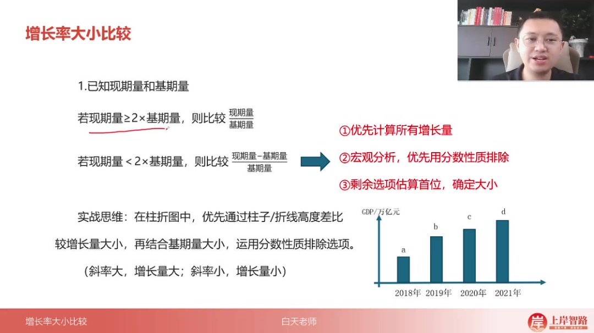

-   快速判断

    ：

    -   若现期量 ≥ 2× 基期量，直接比较

        现期量基期量\frac{现期量}{基期量}基期量现期量

    -   若现期量 < 2× 基期量，比较

        现期量 − 基期量基期量\frac{现期量-基期量}{基期量}基期量现期量 − 基期量

-   三步法

    ：

    -   优先计算所有增长量
    -   宏观分析，运用分数性质排除（分子大分母小的分数值大）
    -   剩余选项估算首位确定大小

-   图表技巧

    ：

    -   柱状图/折线图中，通过高度差比较增长量大小
    -   斜率大的增长量大，斜率小的增长量小

###### 3）已知增长量和现期量

-   计算公式

    ：增长率=

    增长量现期量 − 增长量\frac{增长量}{现期量-增长量}现期量 − 增长量增长量

-   比较技巧

    ：可直接用

    增长量现期量\frac{增长量}{现期量}现期量增长量

    代替比较，不影响大小关系

##### 2. 应用案例 01:35

###### 1）例题：增长率最高区域

-   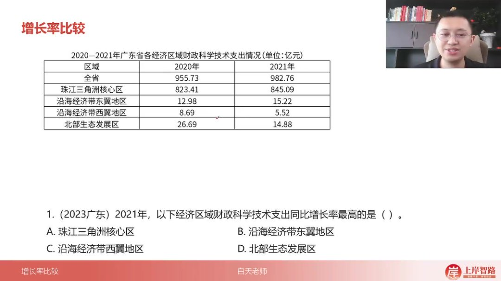

-   解题步骤

    ：

    -   排除负增长选项（C、D）

    -   比较 A、B 选项：

        22823 $/\frac{22}{823}$ 82322

        vs

        23129 $/\frac{23}{129}$ 12923

    -   运用分数性质：分子相近时，分母小的值大

-   速算技巧：现期基期同时乘以 10，变化率不变，可忽略小数点

###### 2）例题：公共充电桩增速最大年份 02:58

-   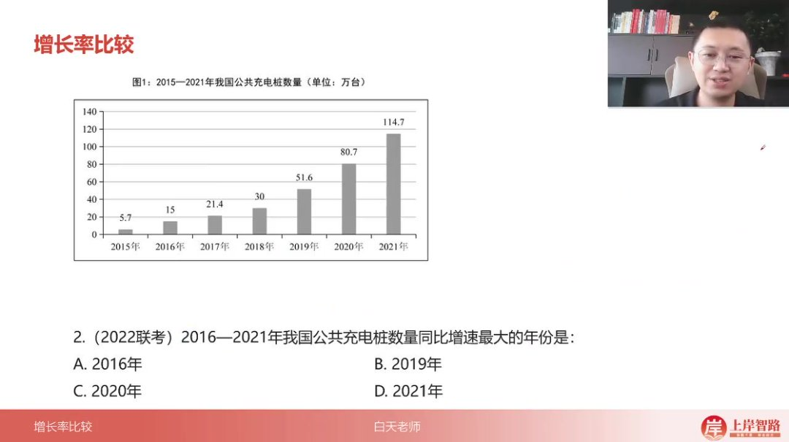
-   关键判断：2016 年现期接近基期 2 倍（5.7→15.2）
-   注意事项：选项年份多时，只需计算选项对应年份

###### 3）例题：大型底栖生物密度增幅最大区域 03:18

-   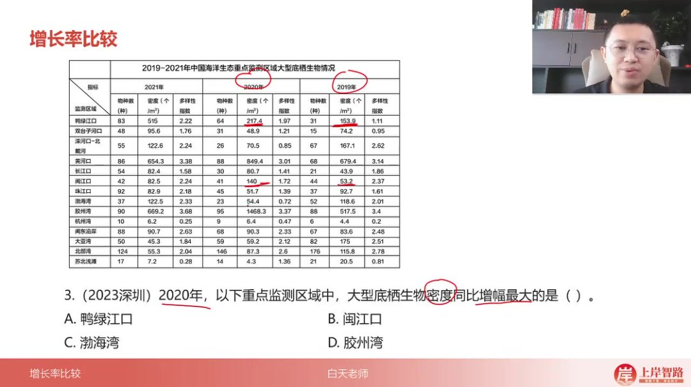

-   解题过程

    ：

    -   排除增幅不明显选项（C）

    -   比较 B、D：

        14053.2\frac{140}{53.2}53.2140

        vs

        1468517 $/\frac{1468}{517}$ 5171468

    -   化同比较：D 选项分子大分母小，值更大

###### 4）例题：职工医保参保人数增速排序 04:52

-   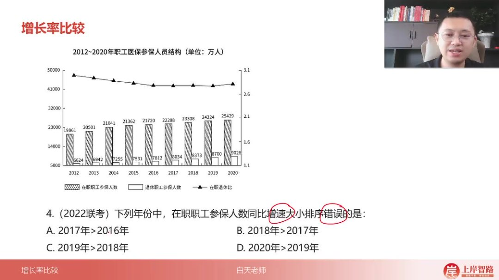
-   错误选项：C 选项 2019 年>2018 年实际应为 2018 年>2019 年
-   判断依据：2018 年增量更大且基期更小

###### 5）例题：农村人均收入增长最慢年份 05:52

-   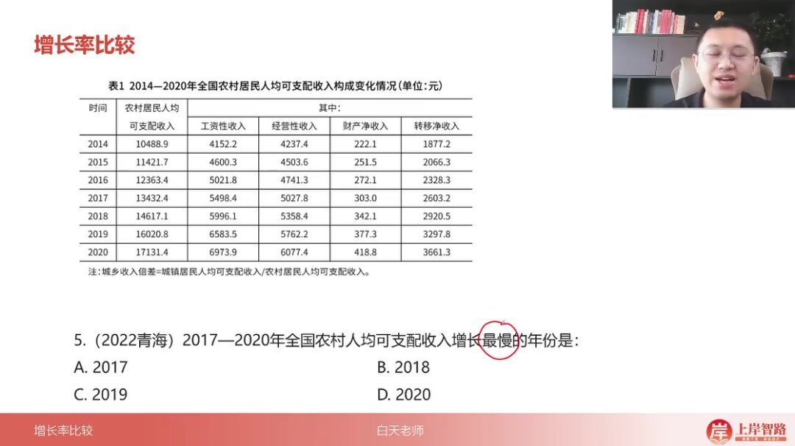
-   解题关键：2020 年增量最小（171-160=11）且基期最大
-   速算方法：仅需计算前三位差值

###### 6）例题：电信新兴业务收入增速最快年份 06:26

-   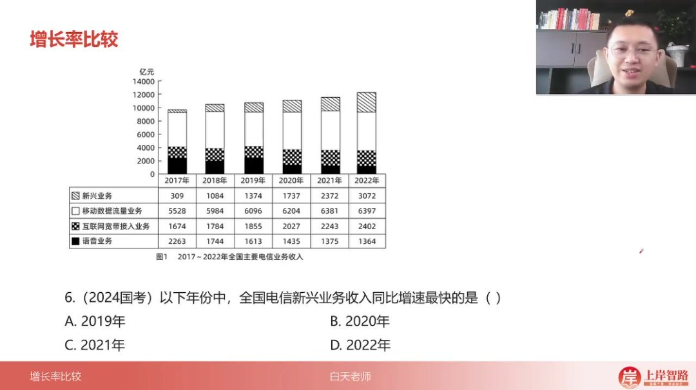

-   计算过程

    ：

    -   计算各年增长量：2019 年 290→2021 年 635→2022 年 700

    -   估算首位：2021 年

        6351700 $/\frac{635}{1700}$ 1700635

        ≈37%能上 3 开头

###### 7）例题：居委会选举数增幅最大年份 07:55

-   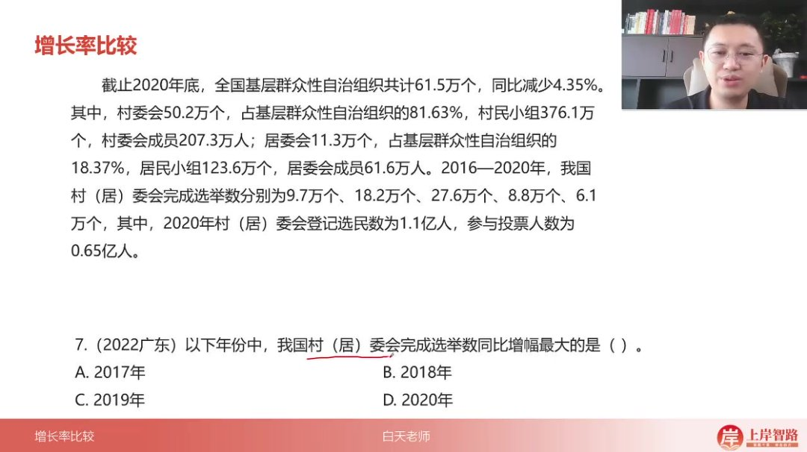
-   明显特征：2017 年现期接近基期 2 倍（9.7→18.2）
-   排除依据：其他年份增长率均低于 100%

###### 8）例题：国际航线增速最快年份 08:25

-   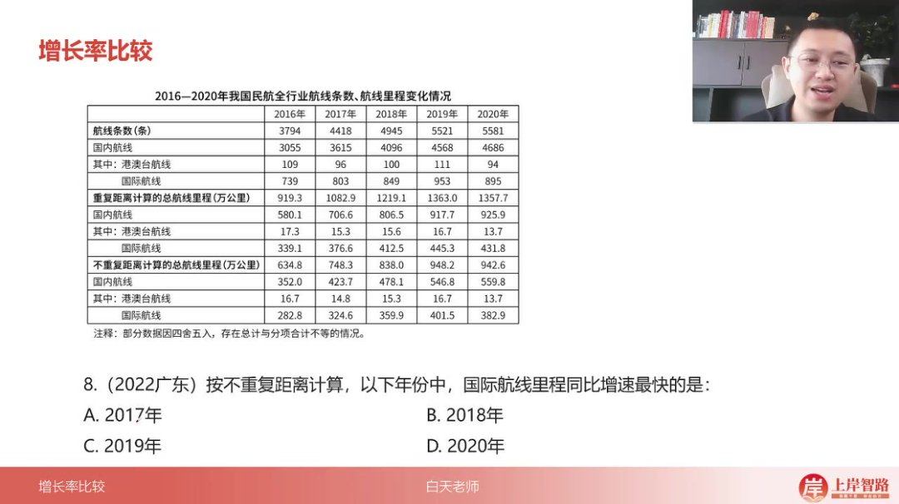

-   解题要点

    ：

    -   排除负增长的 2020 年

    -   比较 2017-2019 年：2017 年

        42282 $/\frac{42}{282}$ 28242

        分子最大分母最小

###### 9）例题：社会消费品零售总额增速最快年份 09:25

-   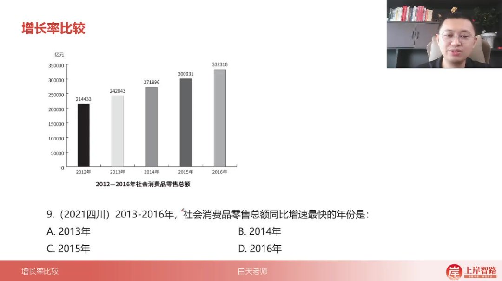

-   图形分析法：各年增长量相近时，基期最小的 2013 年增速最快

-   验证计算

    ：2013 年

    28214 $/\frac{28}{214}$ 21428

    ≈13% > 其他年份约 10%

###### 10）例题：服务业增加值增速最快年份 10:42

-   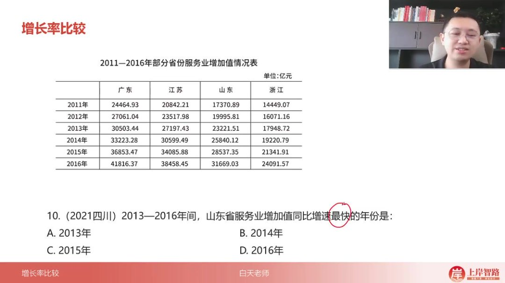
-   山东数据特征：2013 年增量最大（33）且基期最小（199）
-   结论：直接判定 2013 年增速最快

###### 11）例题：众创空间数量增长率最高地区 11:15

-   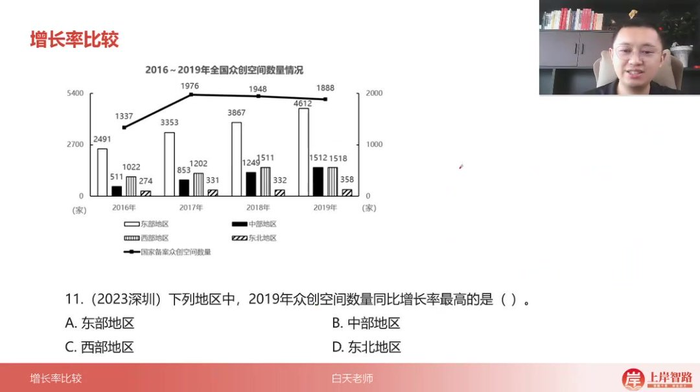

-   区域比较

    ：

    -   西部几乎无增长直接排除

    -   中部

        2631249 $/\frac{263}{1249}$ 1249263

        ≈21% > 东部

        75386 $/\frac{75}{386}$ 38675

        ≈19%

###### 12）例题：风力发电装机容量增速最快年份 12:58

-   华中地区特征：2013 年现期/基期 ≈2 倍（87.3→200.3）

-   后续计算

    ：2013 年华东增量是华南的

    23970 $/\frac{239}{70}$ 70239

    ≈3.4 倍

###### 13）例题：研发经费支出增速最高年份 14:09

-   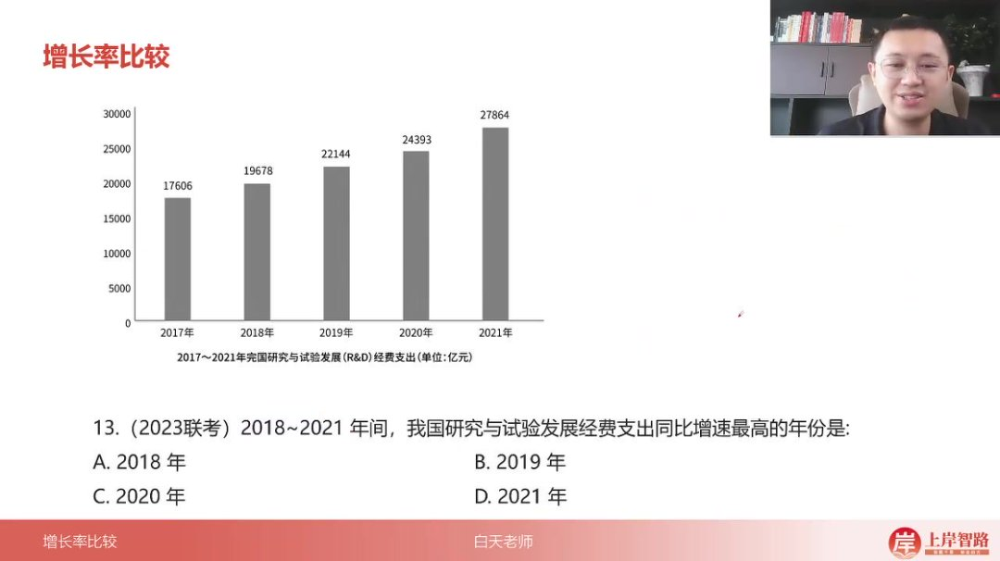

-   需精确计算

    ：

    -   排除 2020 年（22/221≈10%）

    -   比较其他年份首位：2021 年

        35243 $/\frac{35}{243}$ 24335

        ≈14.4%最大

###### 14）例题：煤炭价格降幅最大和最小的 15:54

-   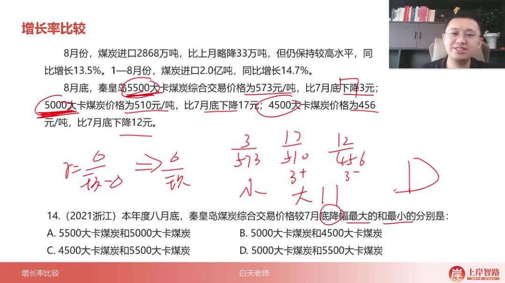

-   降幅比较

    ：

    -   最大：5000 大卡

        17510 $/\frac{17}{510}$ 51017

        ≈3.3%

    -   最小：5500 大卡

        3573 $/\frac{3}{573}$ 5733

        ≈0.5%

###### 15）例题：学校数量同比增加最快的 16:50

-   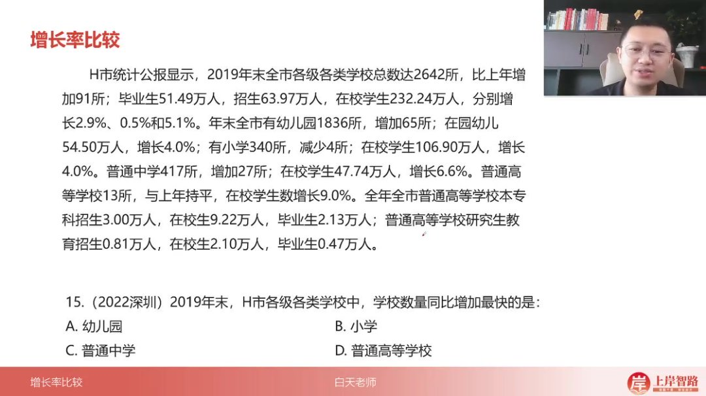

-   排除法

    ：

    -   小学减少、高校持平排除

    -   普通中学

        27417 $/\frac{27}{417}$ 41727

        ≈6.5% > 幼儿园

        651836 $/\frac{65}{1836}$ 183665

        ≈3.5%

#### 二、知识小结

| 知识点                          | 核心内容                                                                        | 考试重点/易混淆点                                               | 难度系数 |
| ------------------------------- | ------------------------------------------------------------------------------- | --------------------------------------------------------------- | -------- |
| 增长率比较基础                  | 识别题型关键词（最大/最小、最快/最慢），区分问法差异（增速/增幅/降幅/变化幅度） | 正负号处理规则：增速/增幅含正负，降幅需为负，变化幅度比较绝对值 | ⭐⭐     |
| 现期基期差距分析                | 差距大时直接除（不减 1），差距小时用“(现期-基期)/基期”三步法                    | 实战思维优先级：1.计算增量 2.宏观分析 3.分数性质排除            | ⭐⭐⭐   |
| 分数性质应用                    | 增量大且基期小 → 增长率大，通过高度差/斜率辅助判断（柱折图场景）                | 易错点：忽略基期规模对分数值的影响                              | ⭐⭐⭐⭐ |
| 真题案例 1（2021 年增长率最大） | 排除负增长选项，比较 A/B 项增量与基期比值（22/823 vs 23/129）                   | 技巧：同步缩放数值（如 12.9→129）不影响变化率                   | ⭐⭐     |
| 真题案例 4（在职职工增速排序）  | 通过增量与基期关系判定：2018 年增量>2019 年且基期更小 →2018 年增速更高          | 陷阱：选项直接比较相邻年份需验证分数性质                        | ⭐⭐⭐   |
| 真题案例 6（新兴业务最快增速）  | 增量与基期同步增长时估算首位（如 635/17≈37% vs 700/24≈29%）                     | 关键步骤：分数性质失效后快速切换首位估算                        | ⭐⭐⭐⭐ |
| 真题案例 14（降幅比较）         | 绝对值比较：直接增量/现期（如 3/55.7 最小，17/510 最大）                        | 特殊规则：降幅题干隐含负号，比较时取绝对值                      | ⭐⭐     |
| 图形数据技巧                    | 柱状图高度差 → 增量，斜率 → 增长率趋势，结合基期排除选项                        | 适用场景：时间有限时快速排除明显错误项                          | ⭐⭐⭐   |
