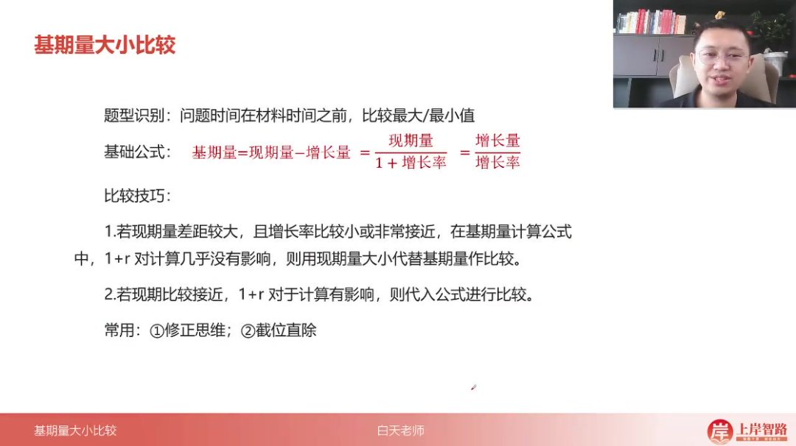
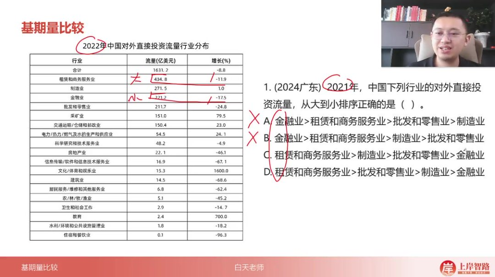
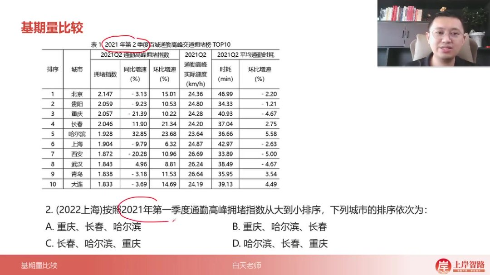
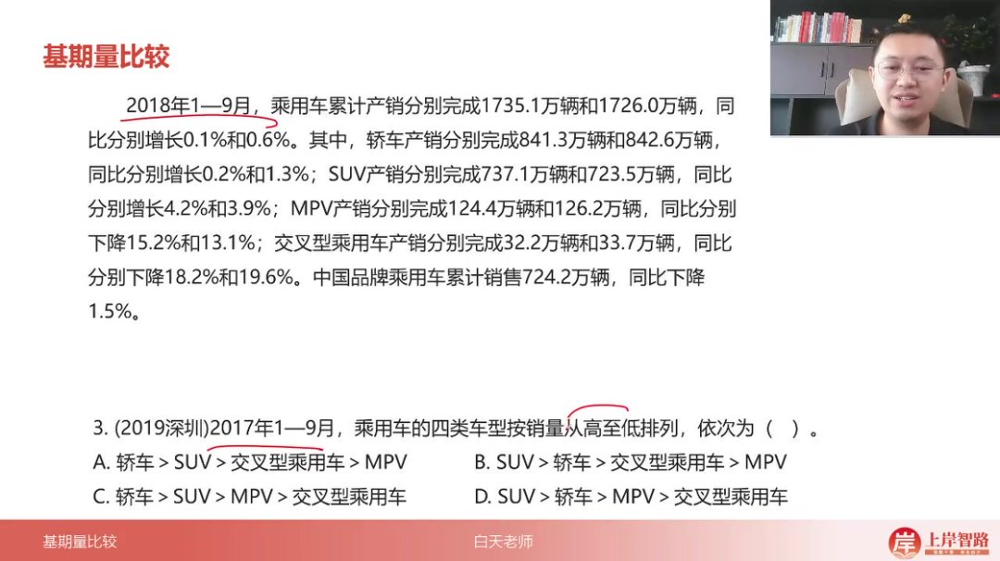
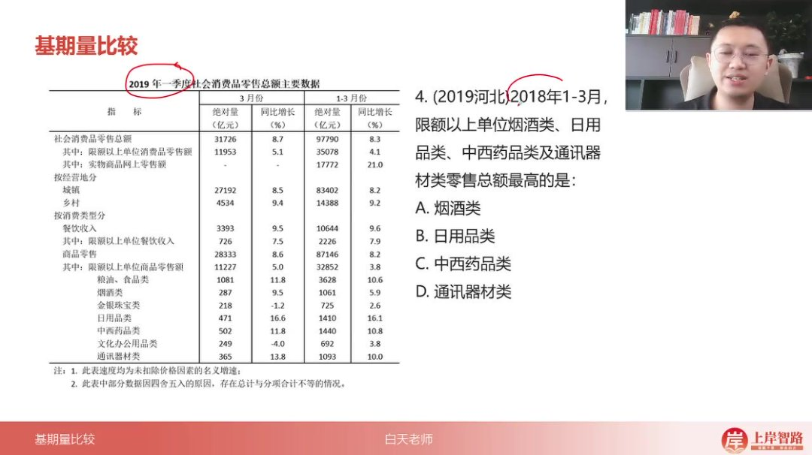
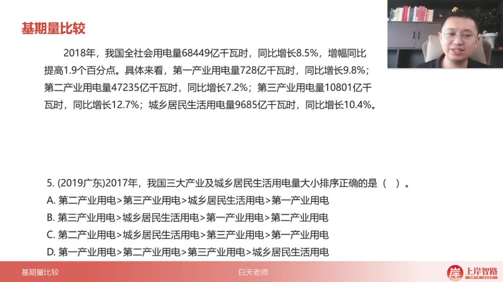

以下为AI生成的图文笔记的内容

#### 一、基期量大小比较 00:04

##### 1. 比较技巧 00:14

- 

- 题型识别：问题时间在材料时间之前，比较最大/最小值

- 基础公式

  ：基期量 =

  现期量1+r\frac{现期量}{1+r}1+r现期量

- 比较原则

  ：

  - 现期量差距大时

    ：若现期量差距较大，且增长率比较小或非常接近（

    1+r1+r1+r

    对计算几乎无影响），可直接用现期量大小代替基期量比较

  - 现期量接近时

    ：若现期量比较接近，

    1+r1+r1+r

    对计算有影响，需代入公式计算比较

- 常用方法

  ：

  - 修正思维：对分母进行近似处理
  - 截位直除：简化计算过程

##### 2. 应用案例 00:35

###### 1）例题:基期量比较排序

- 

- 题目解析

  - 审题关键：2021年各行业对外直接投资流量排序

  - 解题步骤

    ：

    - 先比较租赁和商务服务业（434.8亿）与金融业（221.2亿），现期量差距大，直接判定租赁>金融，排除AB选项

    - 比较制造业（271.5亿）和批发零售业（211.7亿）：

      - 制造业基期量≈

        271.51+1%\frac{271.5}{1+1\%}1+1%271.5

        ≈270亿

      - 批发零售业基期量=

        211.71−24.8%\frac{211.7}{1-24.8\%}1−24.8%211.7

        ≈

        211.70.75\frac{211.7}{0.75}0.75211.7

        ≈282亿

    - 最终排序：租赁>批发零售>制造>金融

  - 易错点：负增长率会使基期量大于现期量，需特别注意

  - 答案：D

###### 2）例题:通勤高峰拥堵指数排序 02:02

- 

- 题目解析

  - 审题关键：2021Q1环比基期量排序（重庆、长春、哈尔滨）

  - 解题技巧

    ：

    - 哈尔滨现期量最小（1.928）且分母最大（1+23.68%），必然最小，直接排除BCD
    - 重庆与长春现期量接近（2.057 vs 2.046）：
      - 重庆分母（1+10.22%）<长春分母（1+21.34%）
      - 故重庆基期量>长春

  - 速判方法：现期量相近时，增长率小的基期量大

  - 答案：A

###### 3）例题:乘用车销量排序 02:58

- 

- 题目解析

  - 数据定位：销量数据（非产量）且增长率均较小

  - 快速比较

    ：

    - 轿车（842.6亿）>>SUV（723.5亿），直接判定轿车最大
    - MPV（126.2亿）>>交叉型（33.7亿）

  - 技巧应用：现期量差距大+增长率接近，直接用现期量代替

  - 答案：C

###### 4）例题:限额以上单位零售额高低 03:44

- 

- 题目解析

  - 初步筛选

    ：

    - 中西药品（1440亿）和日用品（1410亿）现期量远大于通讯器材（1093亿）和烟酒（1061亿），排除AD

  - 精确比较

    ：

    - 中西药品：

      14401+10.8%\frac{1440}{1+10.8\%}1+10.8%1440

      ≈

      14401.108\frac{1440}{1.108}1.1081440

      ≈1300亿

    - 日用品：

      14101+16.1%\frac{1410}{1+16.1\%}1+16.1%1410

      ≈

      14101.161\frac{1410}{1.161}1.1611410

      ≈1214亿

  - 修正技巧：分子大且分母小，分数值必然大

  - 答案：C

###### 5）例题:用电量大小排序 05:10

- 

- 题目解析

  - 宏观判断

    ：

    - 第二产业现期量（47235亿）>>其他产业，直接确定其最大，排除BD

  - 细节比较

    ：

    - 第三产业：

      108011+12.7%\frac{10801}{1+12.7\%}1+12.7%10801

      ≈

      108011.127\frac{10801}{1.127}1.12710801

      ≈9580亿

    - 城乡居民：

      96851+10.4%\frac{9685}{1+10.4\%}1+10.4%9685

      ≈

      96851.104\frac{9685}{1.104}1.1049685

      ≈8773亿

  - 速算验证：分母接近时，直接比较分子大小

  - 答案：A

#### 二、知识小结

| 知识点                           | 核心内容                                                     | 考试重点/易混淆点                                            | 难度系数 |
| -------------------------------- | ------------------------------------------------------------ | ------------------------------------------------------------ | -------- |
| 基期量比较                       | 通过现期量与增长率比较过去量的最大/最小值，公式：基期量=现期量/(1+r)。现期量差异大且r接近时，可直接用现期近似代替基期；若现期量接近且r差异显著，需精确计算（修正法或直除法）。 | 增长率符号影响：负增长率会使基期量反向放大（如现期量小但负增长时，基期量可能反超）。 | ⭐⭐       |
| 金融 vs 租赁基期比较             | 租赁现期量（400+）远大于金融（200+），增长率接近，直接判定租赁基期更大。 | 忽略增长率差异的近似条件。                                   | ⭐        |
| 批发 vs 制造基期计算             | 批发现期量（211）<制造（270），但批发增长率为-25%，需精确计算：211÷0.75≈280>制造基期量（≈270）。 | 负增长导致基期量膨胀，易误判现期量大的选项。                 | ⭐⭐⭐      |
| 环比基期排序（重庆/长春/哈尔滨） | 哈尔滨现期量最小（1.928）且分母最大（1+23.68%），直接判定最小；重庆与长春现期量接近，但重庆分母（1+10%）<长春（1+21%），故重庆>长春。 | 分母大小对分数值的反向影响。                                 | ⭐⭐       |
| 轿车 vs SUV销量比较              | 轿车现期量（840）远大于SUV（720），增长率接近且小，直接判定轿车基期更大；MPV（126）>交叉型（33）。 | 现期量绝对优势时的简化处理。                                 | ⭐        |
| 中西药品 vs 日用品基期比较       | 中西药品现期量（1440）>日用品（1410），分母（1+10.8%）<日用品（1+16%），分子大且分母小，基期更大。 | 分子分母双重比较逻辑。                                       | ⭐⭐       |
| 第二产业 vs 第三产业基期         | 第二产业现期量（万亿级）绝对领先；第三产业（10801）>城乡居民（9685），因分母接近（12.7% vs 10.4%）且分子更大。 | 单位量级差异的优先判断。                                     | ⭐        |