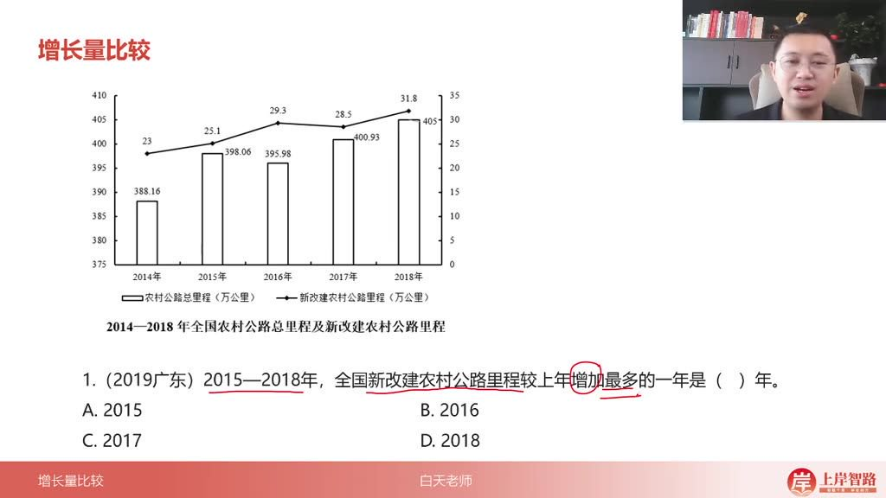
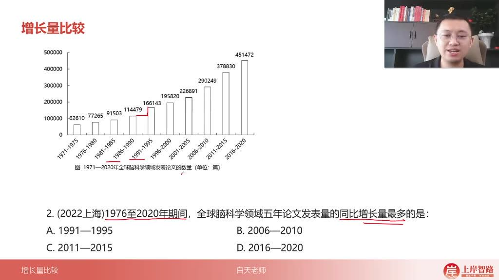
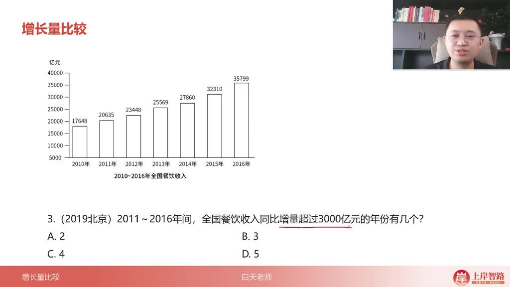
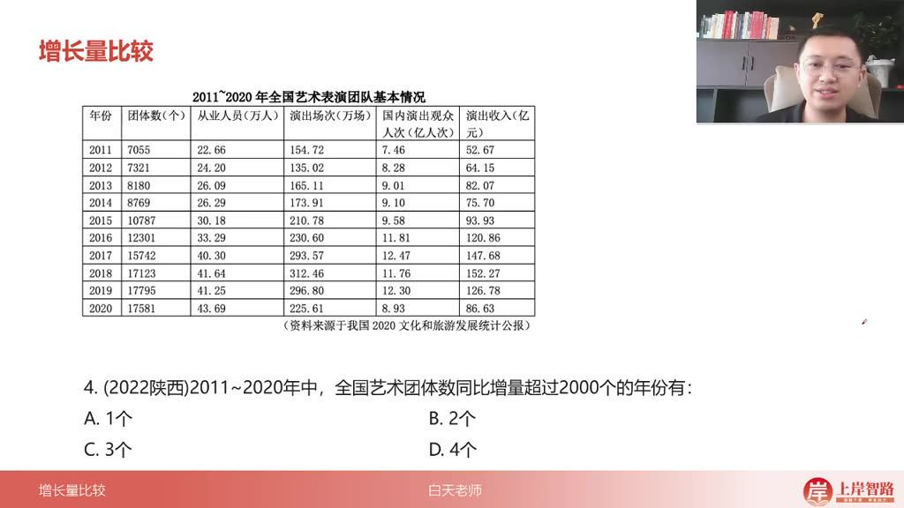
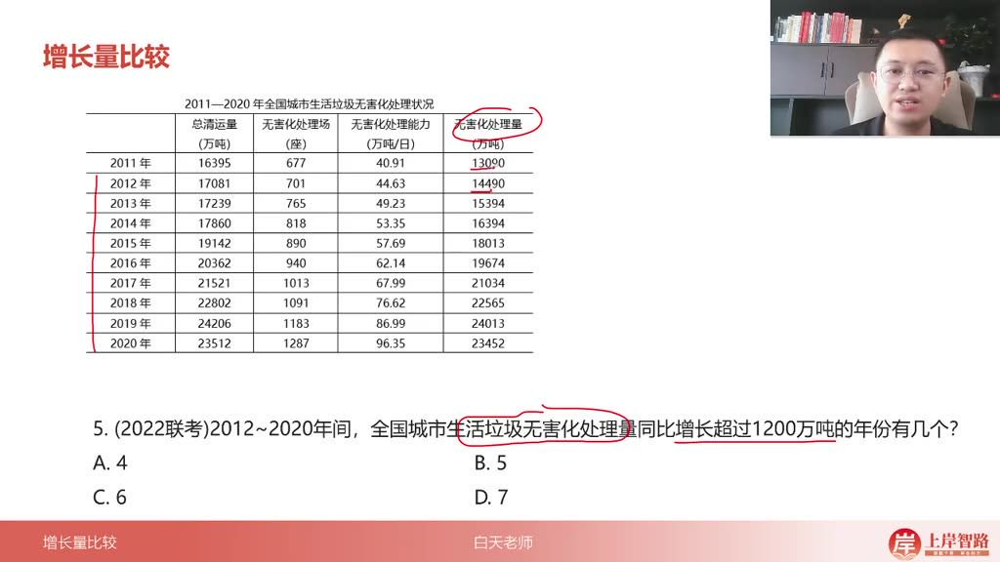
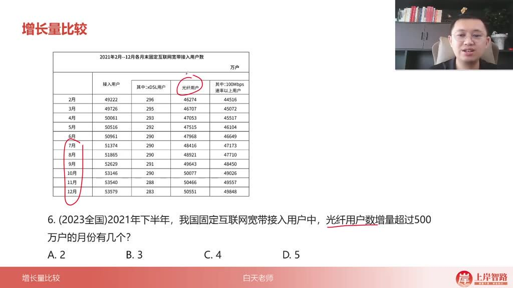
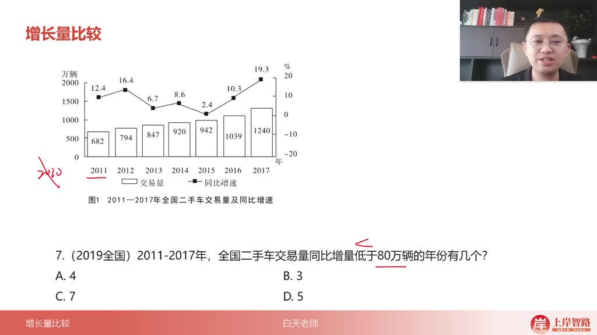
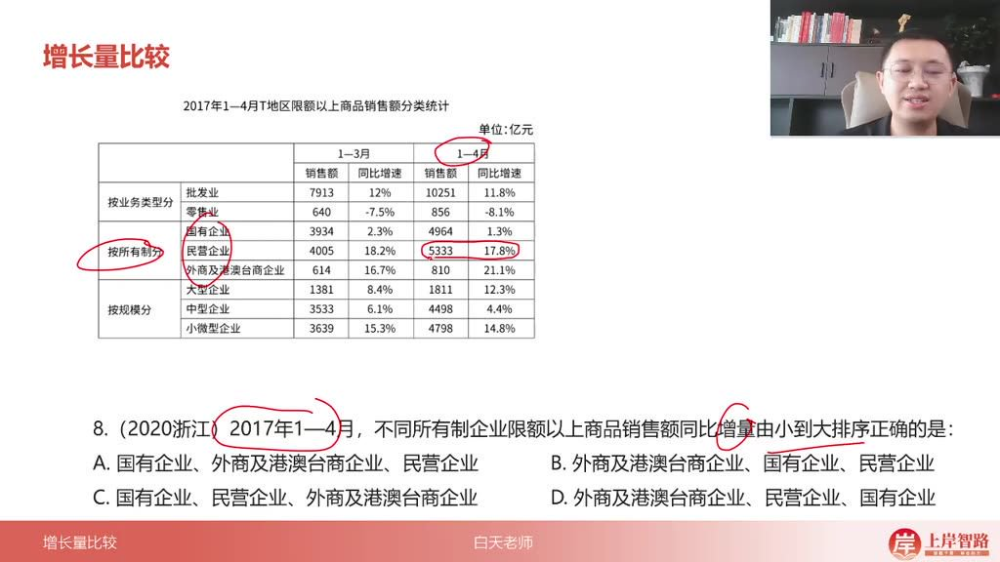
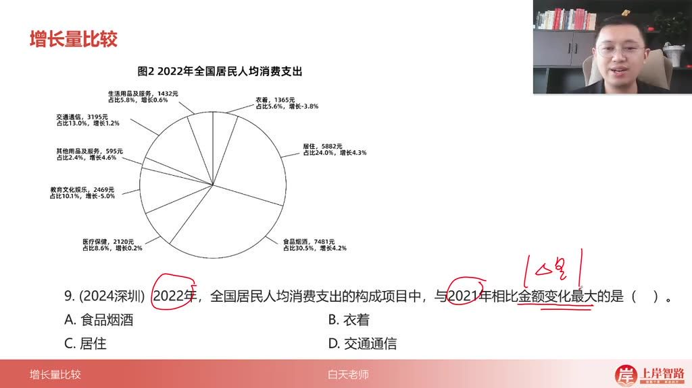
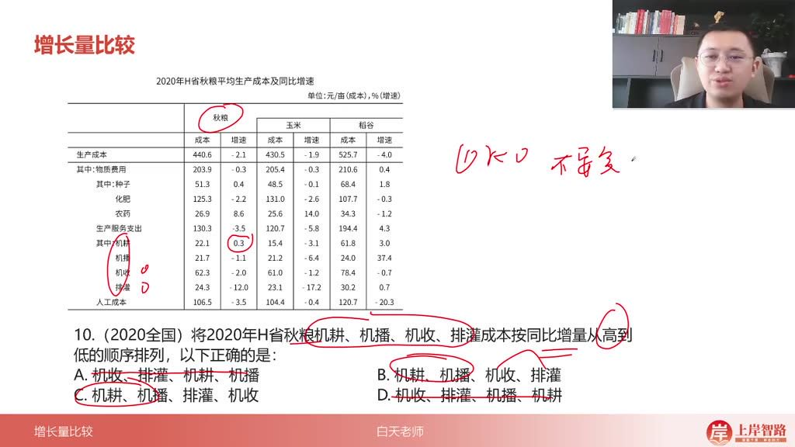

以下为 AI 生成的图文笔记的内容

#### 一、增长量比较 00:02

##### 1. 增长量大小比较 00:05

-   

-   题型识别：题目中出现"增长量最大/小"或"增长最多/少"等表述时，属于增长量比较问题

-   基础公式

    ：增长量=现期量-基期量，或增长量=

    现期量 × 增长率 1+增长率\frac{现期量 × 增长率}{1+增长率}1+增长率现期量 × 增长率

    =基期量 × 增长率

###### 1）已知现期量和增长率 00:17

-   

-   口诀应用

    ：

    -   大大则大：若现期量和增长率都大，则增长量一定大
    -   一大一小看乘积：若现期量和增长率一大一小时，比较两者乘积或倍数关系
    -   特殊情况处理：当乘积或倍数接近且增长率相差较大时，需分别进行百化分计算真实增长量再比较

##### 2. 应用案例 00:46

###### 1）例题:新改建农村公路里程增加量

-   
-   题目解析
    -   审题关键：比较 2015-2018 年新改建农村公路里程的年度增长量
    -   解题技巧：通过折线图斜率判断增长量大小，斜率最陡的 2016 年增长量最大
    -   验证计算：2016 年增长量=28.5-24.3=4.2 万公里，确实为四年中最大
    -   答案：B(2016 年)

###### 2）例题:全球脑科学论文增长量 02:06

-   
-   题目解析
    -   数据特点：五年期累计数据比较
    -   解题方法：通过柱状图高度差直观比较，2011-2015 年增长量最大
    -   验证计算：2011-1995 年增长量=378-290≈88 千篇，其他时期增长量明显更小
    -   答案：C(2011-2015 年)

###### 3）例题:全国餐饮收入增量年份 03:28

-   
-   题目解析
    -   比较标准：判断哪些年份增长量超过 3000 亿元
    -   计算方法：采用现期量-基期量直接做差法
    -   结果分析：仅 2015 年(32.31-27.86≈4.45)和 2016 年(35.79-32.31≈3.48)满足条件
    -   答案：B(3 个)

###### 4）例题:艺术团体数增量年份 05:32

-   
-   题目解析
    -   数据范围：2011-2020 年艺术团体数变化
    -   增量计算：2015 年(10787-8769≈2018 个)和 2017 年(15742-12301≈3441 个)增量超过 2000 个
    -   注意事项：2011 年因缺少 2010 年数据无法计算，题目表述存在不严谨
    -   答案：B(2 个)

###### 5）例题:城市生活垃圾无害化处理量增长量 06:30

-   
-   题目解析
    -   比较标准：判断 2012-2020 年哪些年份增长量超过 1200 万吨
    -   计算结果：2012、2015、2016、2017、2018、2019 年共 6 个年份满足条件
    -   题目对比：与上题相比，本题时间范围表述更严谨(从 2012 年开始)
    -   答案：C(6 个)

###### 6）例题:光纤用户增量 08:39

-   
-   题目解析
    -   时间范围：2021 年下半年(7-12 月)
    -   增量计算：仅 8 月(48921-48416=505 万)和 9 月(49643-48921=722 万)增量超过 500 万
    -   快速判断：通过数据尾数差可快速估算
    -   答案：A(2 个)

###### 7）例题:二手车交易量增长量 09:16

-   

-   题目解析

    -   特殊处理

        ：2011 年虽无 2010 年数据，但可通过增长率(

        18 $/\frac{1}{8}$ 81

        )计算增长量 ≈682÷9≈75.8 万

    -   比较结果：2011、2013、2014、2015 年增长量小于 80 万辆

    -   易错点：需包含 2011 年的计算结果

    -   答案：A(4 个)

###### 8）例题:销售限额增量排序 10:40

-   
-   题目解析
    -   比较对象：国有企业、民营企业、外商及港澳台商企业
    -   排序技巧：民营企业现期量和增长率均最大，增量最大；外商企业现期量小但增长率高，需计算乘积比较
    -   结果判断：国有企业<外商及港澳台商企业<民营企业
    -   答案：A

###### 9）例题:人均消费支出变化 11:45

-   
-   题目解析
    -   比较标准：比较各消费类别金额变化的绝对值
    -   快速判断：食品烟酒类基数(7000+)远大于其他类别(1000+)，即使增长率相近变化量也最大
    -   答案：食品烟酒

###### 10）例题:机耕机播机收排灌增量排序 12:50

-   
-   题目解析
    -   特殊处理：多数项目为负增长，需比较减少量的绝对值
    -   排序方法：机耕唯一正增长排第一；排灌减少量(12%对 2%)绝对值大于机收
    -   最终排序：机耕>机播>机收>排灌
    -   答案：B

#### 二、知识小结

| 知识点                | 核心内容                                                         | 考试重点/易混淆点                          | 难度系数 |
| --------------------- | ---------------------------------------------------------------- | ------------------------------------------ | -------- |
| 增长量比较题型识别    | 问增长量最大/最小或增长最多/最少                                 | 柱状图高度差和折线斜率可直观判断增长量     | ⭐⭐     |
| 已知基期和现期的计算  | 直接做差（现期量－基期量）                                       | 注意负增长情况需比较绝对值                 | ⭐⭐     |
| 现期量+增长率的口诀   | “大大则大”：现期量和增长率均大，增长量必大；一大一小看乘积或倍数 | 乘积接近时需精确计算增长量                 | ⭐⭐⭐   |
| 柱状图/折线图快速判断 | 斜率陡峭程度反映增长量大小                                       | 折线图夹角最大段对应增长量最大             | ⭐⭐     |
| 五年整体增长量比较    | 以五年为周期与前一周期做差                                       | 优先观察柱状图高度差，排除明显错误选项     | ⭐⭐⭐   |
| 增量与固定值比较      | 方法 1：直接做差；方法 2：基期+固定值＜现期                      | 加减法灵活运用（如与 3000 比较可简化位数） | ⭐⭐     |
| 负增长量的比较        | 先忽略负号比较绝对值，结果“大变小、小变大”                       | 如排灌（-12%）＞机收（-2%）实际减少量更大  | ⭐⭐⭐   |
| 包含首年的增量计算    | 若给出首年增长率，需用百化分计算（如 682÷9≈75.8）                | 易忽略首年数据可推导的情况                 | ⭐⭐⭐   |
| 变化量绝对值排序      | 比较增长或下降的绝对值（如食品烟酒-4.2%仍因基数大居首）          | 需区分正负方向但比较幅度                   | ⭐⭐     |
| 多主体增量排序技巧    | 先排除明显最大/最小项（如民营企业“大大则大”），再比较剩余项乘积  | 注意题目要求升序/降序排列                  | ⭐⭐⭐   |
