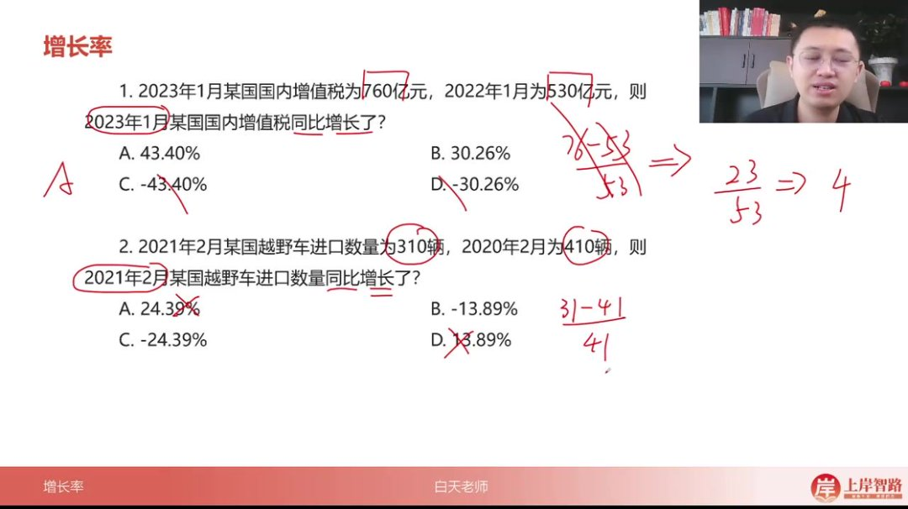
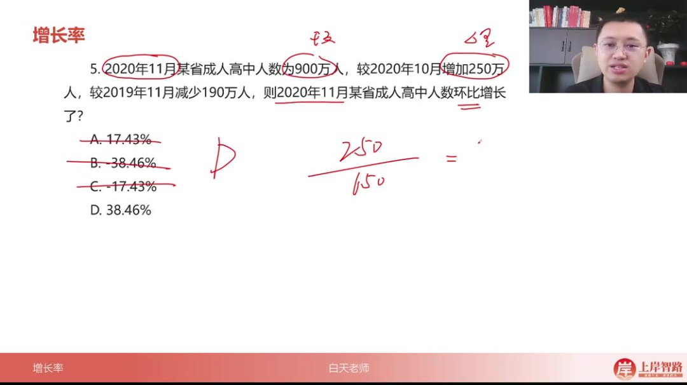
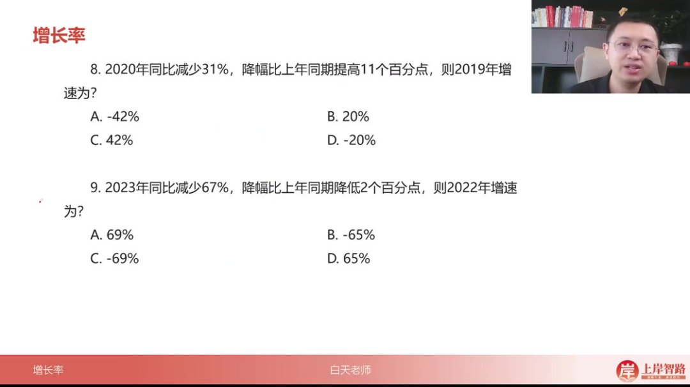
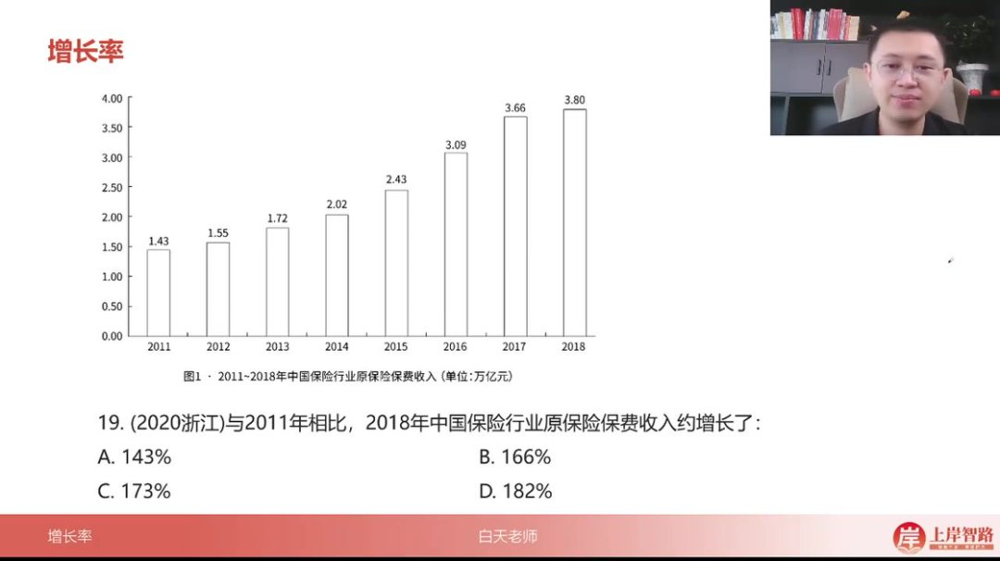
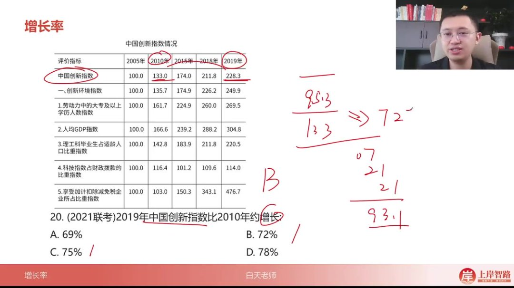
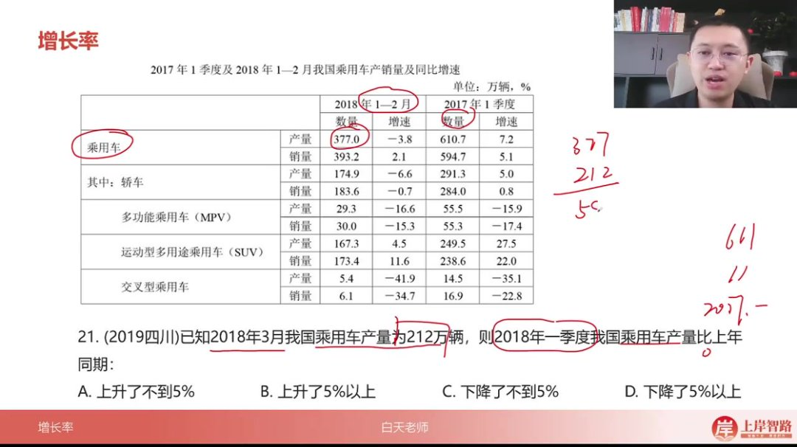
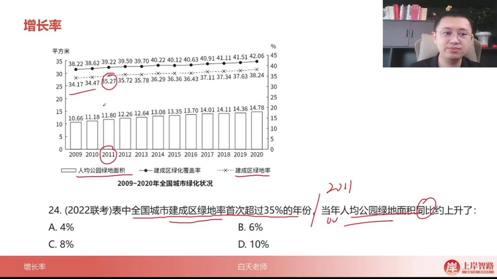
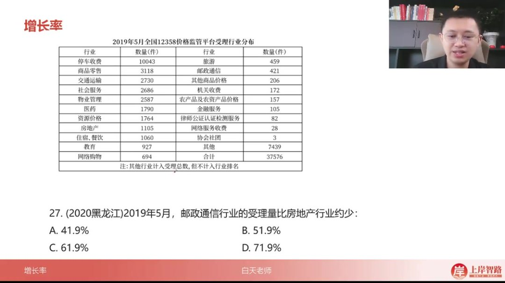
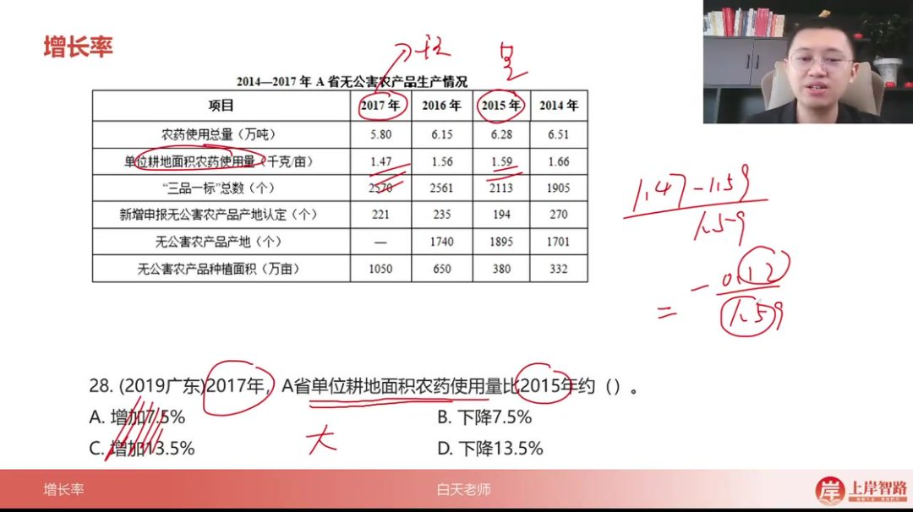
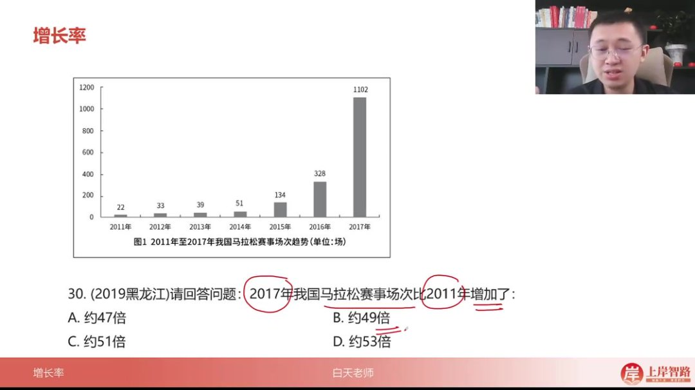

以下为 AI 生成的图文笔记的内容

#### 一、增长率 00:00

##### 1. 理论回顾 00:40

-   

###### 1）增长率题型识别

-   关键词识别：当题目中出现"增长/下降+（%、几成、几倍）"表述时，或出现"增速""增幅""降幅""变化幅度"等术语时，均为增长率题型
-   速算技巧：最常用截位直除法进行计算，需重点掌握

###### 2）增长率计算公式

-   基本公式

    ：增长率 =

    现期量 − 基期量基期量\frac{现期量 - 基期量}{基期量}基期量现期量 − 基期量

    =

    现期量基期量 −1\frac{现期量}{基期量} - 1 基期量现期量 −1

-   示例说明

    ：若 2024 年 1000 元增长至 2025 年 1200 元，则增长量=1200-1000=200 元，增长率=

    2001000 $/\frac{200}{1000}$ 1000200

    =20%

-   公式选择

    ：根据已知条件灵活选用公式：

    -   已知现期量和基期量时：使用

        现期量 − 基期量基期量\frac{现期量 - 基期量}{基期量}基期量现期量 − 基期量

    -   已知增长量和基期量时：使用

        增长量基期量\frac{增长量}{基期量}基期量增长量

    -   已知增长量和现期量时：使用

        增长量现期量 − 增长量\frac{增长量}{现期量 - 增长量}现期量 − 增长量增长量

###### 3）注意事项

-   公式熟练度：必须将各公式背诵熟练，这是后续解题的基础
-   条件识别：解题时需首先识别题目给出的已知条件类型，再选择对应公式
-   实战建议：通过大量刷题巩固理论公式的应用，建立条件反射式的解题思路

##### 2. 应用案例 01:20

###### 1）例题：同比增长率计算

-   核心公式：增长率=(现期-基期)/基期 ×100%

-   计算技巧

    ：

    -   先判断正负：现期>基期为增长，现期<基期为下降
    -   例题 1：(76-53)/53=23/53≈43.40%（选 A）
    -   口算技巧：76-53=23 可心算，23/53 首位商 4

-   易错提醒

    ：

    -   必须用现期减基期，不能大数减小数
    -   注意单位统一（均为亿元）

###### 2）例题：同比下降率计算 02:08

-   

-   特殊情况处理

    ：

    -   例题 2：(310-410)/410=-100/410≈-24.39%（选 C）
    -   现期<基期时结果必为负值

-   计算验证

    ：

    -   负号不可省略，首位商 2 验证

###### 3）例题：同比环比区分 02:58

-   概念辨析

    ：

    -   同比：与去年同期比较（2023 下半年 vs2022 下半年）
    -   环比：与上期比较（2019Q2vs2019Q1）

-   例题 3

    ：

    -   (150-130)/130=20/130≈15.38%（选 A）
    -   注意排除 2023 上半年数据干扰

###### 4）例题：环比增长量计算 03:36

-   

-   公式变形

    ：

    -   当已知增长量时：增长率=增长量/(现期-增长量)
    -   例题 4：190/(540-190)=190/350≈54.29%（选 B）

-   速算技巧

    ：

    -   正负排除法：先排除 A、D
    -   首位商 5 验证

###### 5）例题：环比计算应用 04:59

-   

-   同型题解法

    ：

    -   例题 5：250/(900-250)=250/650≈38.46%（选 D）
    -   与例题 4 公式完全相同

-   选项分析

    ：

    -   先排除负值选项 B、C
    -   首位商 3 验证

###### 6）增速变化计算口诀 05:42

-   

-   口诀应用

    ：

    -   "增速反着来"：题干说"提高"就减，"降低"就加
    -   例题 6：97%-2%=95%（选 A）
    -   例题 7：50%-39%=11%（选 B）

-   记忆要点

    ：

    -   仅适用于增速比较，前项照抄不变

###### 7）降幅变化计算口诀 06:16

-   

-   口诀应用

    ：

    -   "降幅正着走"：题干说"提高"就加，"降低"就减
    -   例题 8：-31%+11%=-20%（选 D）
    -   例题 9：-67%-2%=-69%（选 C）

-   符号处理

    ：

    -   降幅本身带负号，计算时保持符号一致

###### 8）综合应用例题 07:02

-   

-   混合题型

    ：

    -   例题 10：52%-18%=34%（选 A）
    -   例题 11：45%-32%=13%（选 C）
    -   例题 12：-76%-16%=-92%（选 A）
    -   例题 13：-60%+25%=-35%（选 A）

-   解题流程

    ：

    -   判断题型（增速/降幅）
    -   选择对应口诀
    -   保持符号一致
    -   简单加减计算

###### 9）例题：增速反着来计算 07:27

-   题目解析
    -   计算规则：当题目描述增速"高"时，采用减法计算，前项数据直接照抄
    -   计算过程：根据题目要求进行减法运算，得到结果 92
    -   答案：C 选项
    -   记忆口诀："增速反着来，高就减前边"

###### 10）例题：降幅正着走 07:36

-   题目解析
    -   计算规则：当题目描述"减少"时，采用减法计算，前项数据直接照抄，注意保持负号
    -   计算过程：根据题目要求进行减法运算，得到结果-58
    -   答案：D 选项
    -   记忆口诀："降幅正着走，减少就减前边"
    -   注意事项：计算结果需保持原始数据的负号形式

###### 11）例题:增速反着来计算 07:47

-   核心口诀
    -   增速反着来: 当题目给出"增速比上年同期提高/降低 X 个百分点"时，计算上年增速需要用当前增速减去/加上变化的百分点
    -   降幅正正走: 当题目出现"降幅"时，计算上年增速需要用当前降幅加上/减去变化的百分点（符号保持不变）
-   例题解析
    -   2014 年增速计算题
        -   题目解析
            -   已知条件: 2015 年同比增加 95%，增速比上年同期提高 3 个百分点
            -   解题思路: 根据"增速反着来"口诀，上年增速=当前增速-变化百分点
            -   计算过程:95% - 3% = 92%
            -   答案: C 选项（92%）
            -   易错点: 注意"提高"对应减法，"降低"对应加法
    -   2015 年增速计算题
        -   
        -   题目解析
            -   已知条件: 2016 年同比减少 54%，降幅比上年同期减少 4 个百分点
            -   解题思路: 根据"降幅正正走"口诀，上年降幅=当前降幅+变化百分点
            -   计算过程:54% + 4% = 58%，因是降幅故取负值
            -   答案: D 选项（-58%）
            -   关键区别: 降幅计算时符号保持不变，最后结果需加负号表示下降

###### 12）例题:增长率计算 08:05

-   

-   解题思路

    -   主体确认: 题目要求计算"参加职工医保人数"的同比增长率，核心数据为 2020 年参保人数 34455 万人，比上年增加 1530 万人。

    -   公式选择

        : 增长率计算使用基本公式

        增长率=增长量基期量增长率=\frac{增长量}{基期量}增长率=基期量增长量

        ，其中基期量=现期量-增长量=34455-1530=32925 万人。

    -   简化计算

        : 选项首位不同（4.6%/5.4%/6.2%/7.1%），允许保留两位计算。将分母 32925 简化为 3.3 万，分子 1530 简化为 0.15 万，得到

        0.153.3≈4.5%\frac{0.15}{3.3}≈4.5\%3.30.15≈4.5%

        ，最接近 A 选项 4.6%。

-   计算技巧

    -   选项分析: 当选项首位不同时，可采用"首位估算法"，仅需计算结果的第一个有效数字即可锁定答案。
    -   数据截取: 复杂除法中，分子分母同步截取相同位数（如本题均取前两位），可保持比例关系不变。
    -   验证方法: 通过反向验证，3.3×4.6%≈0.152 与实际增长量 0.153 接近，确认 A 选项正确。

-   易错警示

    -   基期量混淆: 注意区分"现期量"与"基期量"，常见错误是直接使用现期量 34455 作分母。
    -   单位统一: 确保分子分母单位一致（本题均为"万人"），避免出现数量级错误。
    -   时间对应: "比上年增长"指同比上年数据，不需考虑多年平均或其他时间维度。

###### 13）例题:增长率计算 09:14

-   天然气进口数据

    -   数据概况：8 月份进口天然气 777 万吨（1 吨 ≈1380 立方米），环比增加 39 万吨，同比增长 37.3%；1-8 月累计进口 5718 万吨，同比增长 34.8%
    -   单位换算：天然气体积与重量换算关系为 1 吨 ≈1380 立方米

-   例题：天然气进口环比增长率计算

    -   

    -   题目解析

        -   审题要点：计算 8 月份天然气进口量的环比增长率（选项 A.5.28% B.5.42% C.5.73% D.6.02%）

        -   数据提取：现期量 777 万吨，增长量 39 万吨

        -   公式应用

            ：增长率=增长量/(现期量-增长量)=

            39777−39\frac{39}{777-39}777−3939

        -   计算技巧

            ：

            -   选项差距较小（次位差<首位），需保留三位计算：39÷738
            -   首位商 5（与选项首位一致），精确计算得 5.28%
            -   验证：若保留两位计算（39÷74）结果仍接近 5.28%

        -   易错提醒：注意区分环比（上月比较）与同比（去年同期比较）

        -   答案：A.5.28%

###### 14）例题：增长率计算 11:28

-   金融机构存款增长率计算

    -   

    -   增长率公式应用

        ：当现期量与基期量差距不大时，使用

        增长量基期量\frac{增长量}{基期量}基期量增长量

        公式计算增长率。本题中基期量=现期量 152837.3 亿元-增长量 13089.6 亿元 ≈139747.7 亿元。

    -   简化计算技巧

        ：选项差距较小时保留三位有效数字，将 13089.6 简化为 131，152837.3 简化为 1528，计算

        1311528−131=1311397\frac{131}{1528-131}= $/\frac{131}{1397}$ 1528−131131=1397131

        。

    -   首位判断法

        ：分子 131 小于分母 1397 的前三位，说明首位商不到 1，排除 C、D 选项；通过

        1314≈0.93 $/\frac{13}{14}$ ≈0.931413≈0.93

        估算结果接近 9.3%，故选 B 选项 9.4%。

-   保险保费收入增长率计算

    13:20

    -   

    -   大跨度增长率公式

        ：当现期量与基期量差距超过 2 倍时，采用

        现期量基期量 −1\frac{现期量}{基期量}-1 基期量现期量 −1

        公式。2018 年保费 3.8 万亿元 vs 2011 年 1.43 万亿元。

    -   分数简化技巧

        ：识别 1.43≈

        10.7\frac{1}{0.7}0.71

        ，将除法转换为乘法：3.8÷

        17 $/\frac{1}{7}$ 71

        =3.8×7=26.6（注意数量级调整后为 2.66）。

    -   结果修正：2.66-1=1.66 即 166%，对应 B 选项。特别提示当基期量可转化为常见分数（如 1/7）时，优先考虑分数转换法。

    -   计算注意事项

        ：

        -   现期与基期差距程度决定公式选择标准
        -   选项差距较小时需保持 3 位有效数字精度
        -   数量级差异不影响选项判断时可忽略单位换算
        -   特殊数字（如 1.43≈1/0.7）可触发分数简化计算

###### 15）例题:增长率计算 14:32

-   例题：中国创新指数增长率计算

    -   

    -   计算步骤

        ：

        -   现期量（2019 年）228.3 减基期量（2010 年）133.0 得 95.3

        -   增长率公式：

            现期 − 基期基期\frac{现期-基期}{基期}基期现期 − 基期

            →

            95.3133\frac{95.3}{133}13395.3

    -   速算技巧

        ：

        -   首位商 7 得 93.1，余数 22/133≈0.16，合计 7.16%
        -   实际值 95.3/133≈71.6%，最接近 72%

    -   答案：B. 72%

    -   注意事项

        ：

        -   次位差小于首位时需精确计算
        -   选项差距较小时建议列竖式验证

###### 16）例题:复合增长率计算 16:11

-   例题：乘用车产量同比变化

    -   

    -   数据确认

        ：

        -   现期量=2018 年 1-2 月产量 377+3 月产量 212=589 万辆
        -   基期量=2017 年一季度产量 610.7 万辆

    -   计算过程

        ：

        -   差值 589-611=-22 万辆

        -   增长率=

            −22611\frac{-22}{611}611−22

            ≈-3.6%

    -   结论判断

        ：

        -   负值表示下降
        -   绝对值 3.6%＜ 5%，符合 C 选项

    -   易错点

        ：

        -   注意区分"产量"与"销量"数据
        -   季度数据需完整汇总（含 3 月份）

###### 17）例题:季度数据增长率 18:09

-   例题：货物周转量季度增长

    -   

    -   数据汇总

        ：

        -   二季度（4-6 月）周转量：51+52+55≈158（取前两位）
        -   一季度（1-3 月）周转量：36+37+41≈92

    -   增长率计算

        ：

        -   差值 158-92=66

        -   6692 $/\frac{66}{92}$ 9266

            ≈71.7%（实际值大于 66%）

    -   选项分析

        ：

        -   明显高于 62%（C 选项）
        -   最接近 73%（D 选项）

    -   速算技巧

        ：

        -   选项差距大时可估算前两位
        -   注意单位统一（亿吨公里）

###### 18）例题:多指标总额增长率 19:47

-   例题：钓具进出口总额增长率

    -   

    -   数据整合

        ：

        -   2020 年总额：高位叠加得 114（万位：6+3=9；千位：9+1+1+5=16→114）
        -   2019 年总额：高位叠加得 103（万位：1+5+2=8；千位：8+3+7+5=23→103）

    -   增长率计算

        ：

        -   114−103103\frac{114-103}{103}103114−103

            ≈10.7%

    -   结论判断

        ：

        -   正增长排除 CD
        -   10.7%＞ 5%，选 B

    -   方法要点

        ：

        -   多数据相加采用高位叠加法
        -   注意包含所有相关指标（钩、竿、轮的进出口）

###### 19）例题:增长率计算 21:36

-   例题：绿地率与增长率计算

    -   

    -   题目解析

        -   关键步骤：先确定建成区绿地率首次超过 35%的年份（2011 年），再计算当年人均公园绿地面积同比增长率

        -   数据定位：2011 年人均公园绿地面积 11.80 平方米，2010 年 11.18 平方米

        -   计算过程

            ：

            -   增长量：11.80-11.18=0.62 平方米

            -   增长率计算：

                0.6211.18≈5.55%\frac{0.62}{11.18}\approx5.55\%11.180.62≈5.55%

        -   计算技巧：当分子前两位被减没时，建议保留全部小数位计算

        -   选项匹配：最接近 6%，故选 B

        -   答案：B

###### 20）例题:增长率计算 23:02

-   例题：集成电路销售额增速计算

    -   

    -   题目解析

        -   关键步骤：先确定销售额增速最高年份（2017 年），再计算当年集成电路进口金额同比增长率

        -   数据定位：2017 年进口金额 2601.4 亿美元，2016 年 2270.7 亿美元

        -   计算过程

            ：

            -   增长量：2601.4-2270.7=330.7 亿美元

            -   增长率估算：

                330.72270.7≈14.56%\frac{330.7}{2270.7}\approx14.56\%2270.7330.7≈14.56%

        -   速算技巧：将 330.7÷2270.7 简化为 33÷22≈1.5（约 15%）

        -   选项匹配：最接近 15%，故选 C

        -   答案：C

-   增长率计算要点总结

    -   数据定位：明确需要比较的年份和对应指标值
    -   计算顺序：先做减法求增长量，再做除法求增长率
    -   精度控制：当选项差距较大时（如相差 5%），可适当估算；当选项接近时需精确计算
    -   常见错误：混淆基期与现期数据，或错误识别最高增速年份

###### 21）例题:增长率计算 24:15

-   例题：城镇职工基本养老保险增长率

    -   

    -   题目解析

        -   时间陷阱：材料给出 2015 年数据，但题目要求计算 2014 年比 2013 年的增长率

        -   基期确定：2013 年数据通过 2015 年比 2013 年增加 3133 万人推算得出

        -   计算过程

            ：

            -   2014 年人数 = 35361 万 - 1236 万 = 34125 万
            -   2013 年人数 = 35361 万 - 3133 万 = 32228 万
            -   增长率 =(34125-32228)/32228 ≈ 1900/32200 ≈ 5.9%

        -   答案：D. 5.9%

###### 22）例题:增长率计算 25:46

-   例题：邮政通信与房地产受理量比较

    -   

    -   题目解析

        -   基期确定：与房地产行业比较，房地产为基期

        -   负增长率：邮政通信(421 件)比房地产(1105 件)少，结果为负增长

        -   速算技巧

            ：

            -   (421-1105)/1105 = -684/1105
            -   首位商 6，直接选 C

        -   答案：C. 61.9%

###### 23）例题:增长率计算 26:51

-   例题：单位耕地农药使用量变化

    -   

    -   题目解析

        -   现期基期：2017 年(1.47)比 2015 年(1.59)

        -   负增长判断：直接排除增加选项 A、C

        -   速算排除法

            ：

            -   (1.47-1.59)/1.59 = -0.12/1.59
            -   首位商不到 1，排除 D

        -   答案：B. 下降 7.5%

###### 24）例题:增长率计算 27:56

-   例题：工厂总产值月增长率

    -   

    -   题目解析

        -   数据汇总

            ：

            -   1 月总和：1100+300+250+0=1650
            -   2 月总和：800+800+600+300=2500

        -   计算错误

            ：原解析数据汇总有误，正确应为：

            -   1 月总和：1000+600+500+400=2500
            -   2 月总和：800+800+600+300=2500

        -   增长率：(2500-2500)/2500=0，但选项无 0%，需重新核对数据

        -   易错点：柱状图数据读取需准确

###### 25）例题:增长率计算 29:13

-   例题：马拉松赛事场次增长倍数
    -   
    -   题目解析
        -   增长倍数计算：使用公式现期/基期-1
        -   数据读取：2017 年 1102 场，2011 年 22 场
        -   计算过程：1102/22-1≈50-1=49
        -   答案：B. 约 49 倍

#### 二、知识小结

| 知识点         | 核心内容                                                                               | 考试重点/易混淆点                                               | 难度系数 |
| -------------- | -------------------------------------------------------------------------------------- | --------------------------------------------------------------- | -------- |
| 增长率计算基础 | 现期量、基期量与增长量的公式应用（现减基除基）                                         | 正负判断（现期＞基期为正）单位陷阱（如“增加+单位”为增长量）     | ⭐⭐     |
| 环比与同比     | 环比：与上一周期比同比：与去年同期比                                                   | 时间陷阱（如材料给 2015 年，问题问 2014 年增速）                | ⭐⭐⭐   |
| 速算技巧       | 结尾直除（选项差距大留两位，小留三位）高位叠加（多数据求和）                           | 首位商法（如 76-53=23÷53≈4）数量级忽略（选项无十倍关系时）      | ⭐⭐     |
| 特殊增长率     | 现期/基期-1（现期与基期差距＞ 2 倍时）增长量 ÷（现期-增长量）                          | 公式选择依据（已知条件差异）                                    | ⭐⭐⭐   |
| 增速与降幅口诀 | 增速反着来（高 → 减，低 → 加）降幅正着走（提高 → 加，降低 → 减）                       | 符号处理（负号仅表下降，比较绝对值）                            | ⭐⭐⭐⭐ |
| 复合增长率     | 多周期数据加和求整体增速（如季度 → 年度）                                              | 同环比混淆（如“下半年同比”需对应上年下半年）                    | ⭐⭐⭐⭐ |
| 实战易错题     | 16 题：职工医保人数增速（增长量 ÷ 现期-增长量）22 题：货物周转量变化率（季度数据加和） | 单位统一（如“亿”与“万”转换）选项差距分析（首位/次位差判断精度） | ⭐⭐⭐⭐ |
| 特殊表述       | “增长几倍”=增长率（现期/基期-1）“是几倍”=现期/基期                                     | 30 题陷阱（选项未包含计算值 50 倍）                             | ⭐⭐⭐   |
