以下为 AI 生成的图文笔记的内容

#### 一、增长量 00:03

##### 1. 增长量的知识点回顾 00:06

-   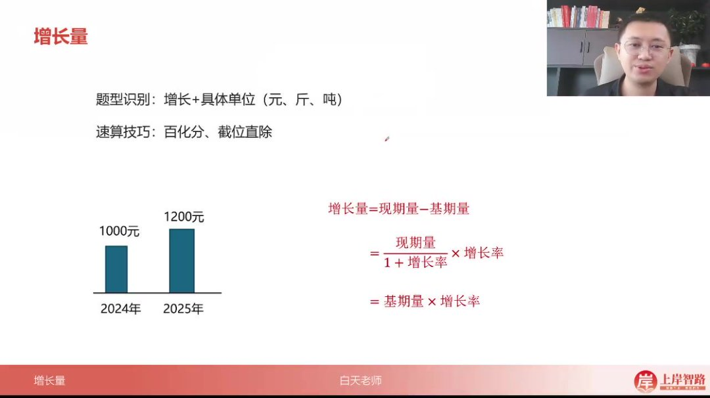

###### 1）速算技巧 00:15

-   百化分技巧

    ：当增长率 r 等于

    1n\frac{1}{n}n1

    时，增长量=

    现期量 n+1\frac{现期量}{n+1}n+1 现期量

    ；当

    r=−1nr=-\frac{1}{n}r=−n1

    时，减少量=

    现期量 n−1\frac{现期量}{n-1}n−1 现期量

    。口诀："正加一负减一"

-   截位直除应用

    ：当无法记住百分数与分数的转化关系时，可保留三位数直接计算。例如：

    3451+12.5%×12.5%\frac{345}{1+12.5\%}×12.5\%1+12.5%345×12.5%

    若忘记 12.5%是

    18 $/\frac{1}{8}$ 81

    ，可直接计算

    345113×125 $/\frac{345}{113}$ ×125113345×125

    ，首位商 3 后结合选项筛选

###### 2）公式 00:24

-   基础公式：增长量=现期量-基期量（如 1200 元-1000 元=200 元）

-   现期增长率公式

    ：已知现期量和增长率时，增长量=

    现期量 1+增长率 × 增长率\frac{现期量}{1+增长率}× 增长率 1+增长率现期量 × 增长率

-   基期增长率公式：已知基期量和增长率时，增长量=基期量 × 增长率（如 2024 年基期量 × 增长率=2025 年增长量）

-   计算优先级：已知现期基期时优先用减法；只有增长率时需区分现期/基期条件选择对应公式

##### 2. 应用案例 01:53

###### 1）例题：增长量计算

-   基础题型

    02:22

    -   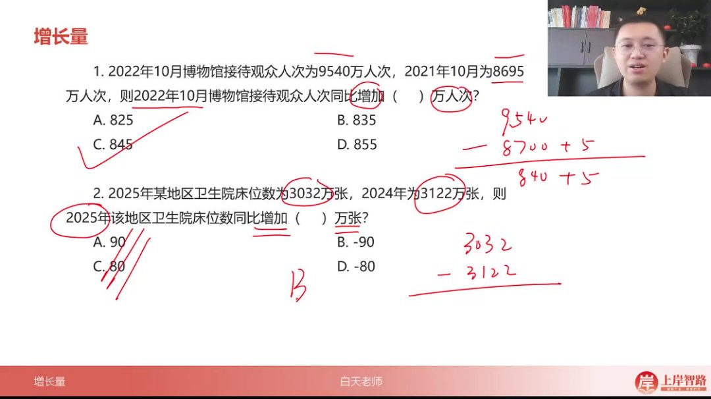
    -   直接做差法：当已知现期量和基期量时，直接用现期量减去基期量即可得到增长量。例如 9540-8695=845 万人次。
    -   简化计算技巧：可以先将基期量调整为整百数计算，再补回差值。如先减 8700 再加 5，使计算更简便。

-   负增长情况

    02:56

    -   负增长处理：当现期量小于基期量时，增长量为负值。计算时先用大数减小数，再加负号。例如 3122-3032=90，结果为-90 万张。

-   增长率计算法

    04:09

    -   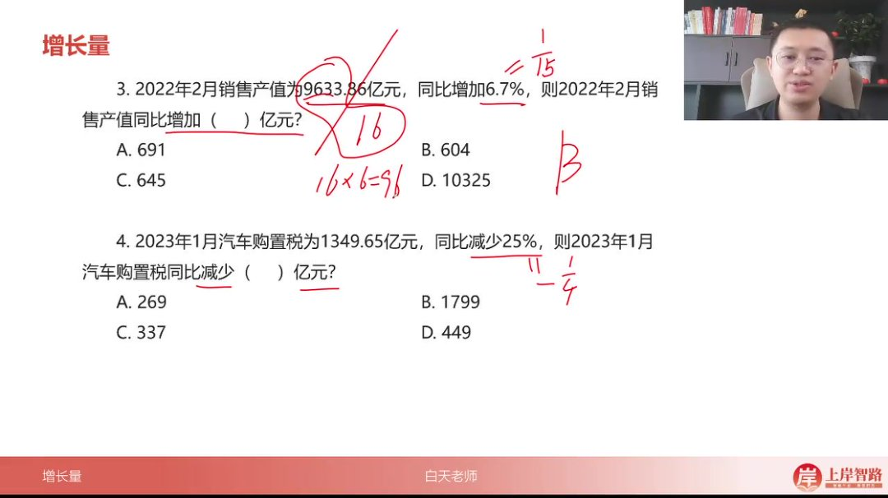
    -   百分数转化法：将增长率转化为分数形式计算更简便。如 6.7%≈1/15，增长量=现期量/(15+1)=9633.86/16≈604 亿元。
    -   负增长率处理：当增长率为负时，使用"正加一负减一"口诀。如-25%=-1/4，增长量=现期量/(4-1)=1349.65/3≈449 亿元。

-   百划分速算技巧

    04:44

    -   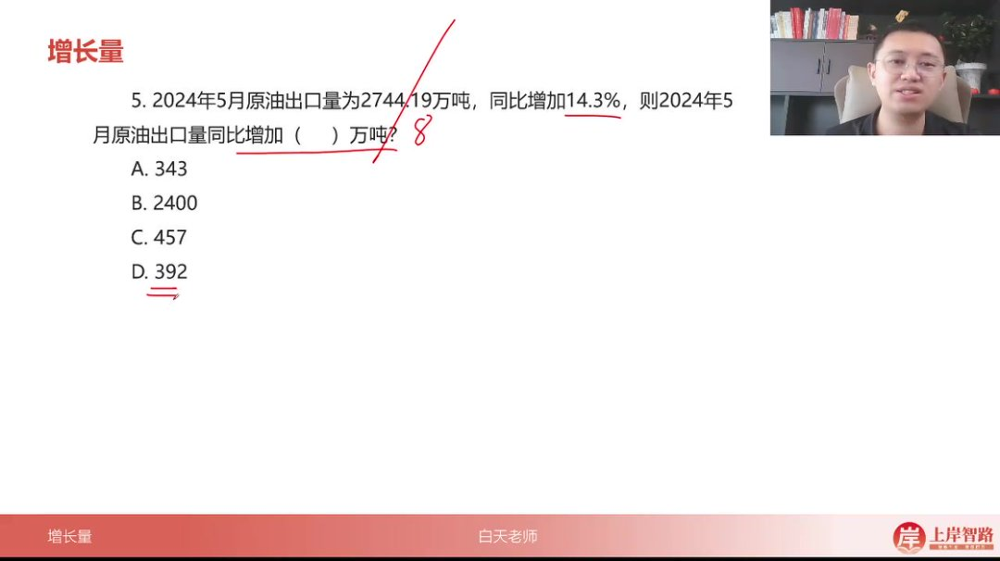
    -   分数近似法：将百分数转化为最接近的分数。如 14.3%≈1/7，增长量=现期量/(7+1)=2744.19/8≈343 万吨。
    -   首位估算法：只需计算商的首位数字即可快速判断选项范围，提高计算效率。

-   多数据求和增长量

    06:16

    -   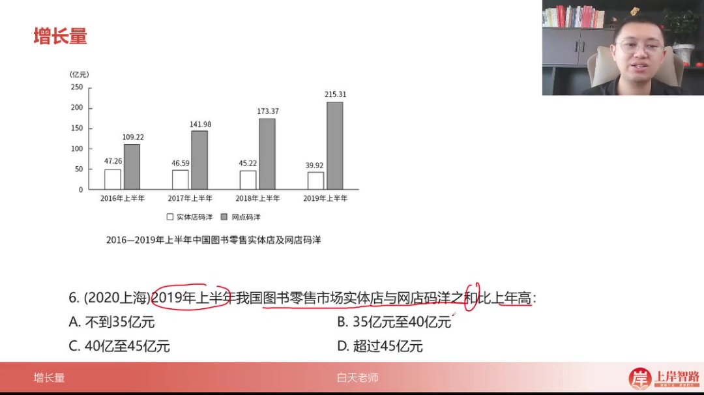
    -   分组计算法：当需要计算多个数据的和增长量时，先分别计算各组数据的差值，再将差值相加。如(39-45)+(215-173)=-5+42=37 亿元。
    -   抵消简化：正负差值相互抵消可以简化计算过程，减少计算量。

-   区域增长量比较

    07:38

    -   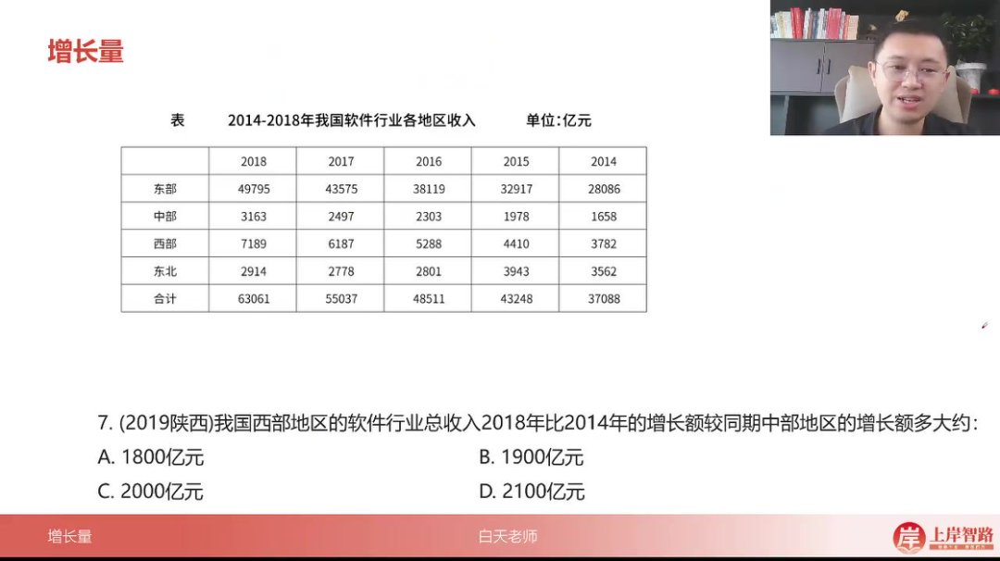
    -   分步计算法：先分别计算各区域的增长量，再比较差值。如西部增长量=7189-3782≈3400 亿元，中部增长量=3163-1658≈1500 亿元，差值=3400-1500=1900 亿元。
    -   尾数处理：大数相减时可先忽略相同尾数，简化计算后再补回。

-   百分数转换技巧

    -   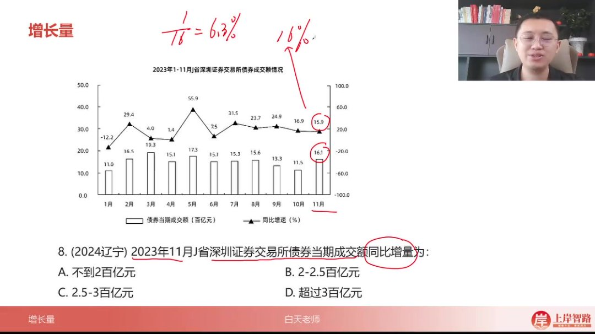
    -   分数互换法：当遇到不常见百分数时，可利用分数与百分数的互换关系。如 15.9%≈16%=6.3 分之一（因为 1/16≈6.3%），增长量=16.1/(6.3+1)≈2.2 百亿元。
    -   精确估算：通过首位商数和余数关系判断选项范围，如 16.1÷7.3≈2.2，应在 2-2.5 百亿元之间。

###### 2）例题：增长量计算 09:25

-   2017 年上海口岸进出口总额增长量计算

    -   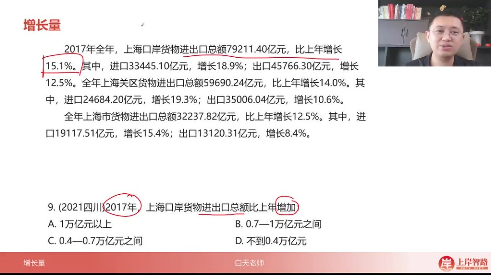

    -   增长率转化技巧

        ：15.1%可近似为 15%，对应分数为

        16.7\frac{1}{6.7}6.71

        （因

        115≈6.7% $/\frac{1}{15}$ ≈6.7\%151≈6.7%

        ）

    -   增长量计算公式：基期值 ÷（增长率倒数+1），即 79211.40÷(6.7+1)=79211.40÷7.7

    -   速算方法

        ：

        -   首位商 1（7.9 万亿 ÷7.7≈1 万亿）
        -   单位转换：亿 → 万亿需小数点左移四位

    -   结果验证：实际计算结果超过 1 万亿，对应选项 A

    -   关键数据

        ：

        -   基期值：79211.40 亿元
        -   增长率：15.1%
        -   增长量：1 万亿元以上

-   互联网企业收入增长量计算

    10:21

    -   分数转化法

        ：12.5%对应

        18 $/\frac{1}{8}$ 81

        （因 100÷8=12.5）

    -   计算步骤

        ：

        -   基期值 ÷（分母+1）即 128÷9
        -   首位商 1，次位商 4（余数 38，9×4=36）

    -   结果判定：得到 14 开头的数值，对应选项 C

    -   速算要点

        ：

        -   仅需估算首次位数字
        -   注意单位一致性（题干未明确需转换）

    -   记忆口诀："百分数转分数，分母加一除基数"

###### 3）例题：增长量计算 10:46

-   互联网企业收入增长计算

    -   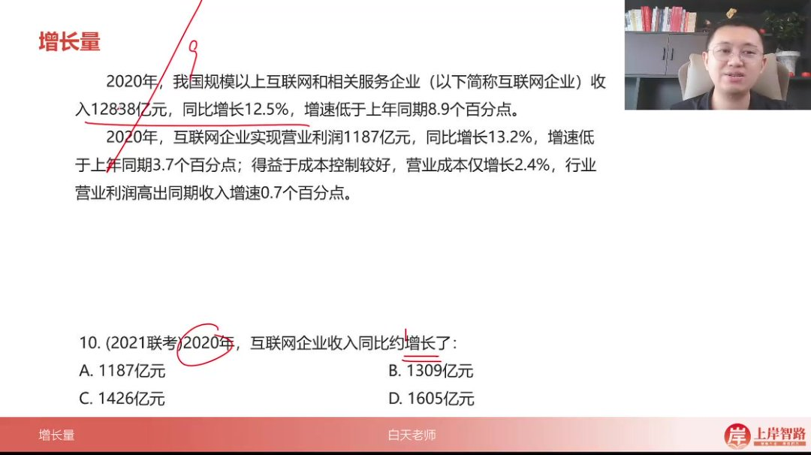
    -   增长率计算：2020 年我国规模以上互联网企业收入 12838 亿元，同比增长 12.5%，增速低于上年同期 8.9 个百分点。
    -   利润表现：营业利润 1187 亿元，同比增长 13.2%，增速低于上年同期 3.7 个百分点；营业成本仅增长 2.4%，行业营业利润高出同期收入增速 0.7 个百分点。

-   老年人护理补贴增长计算

    -   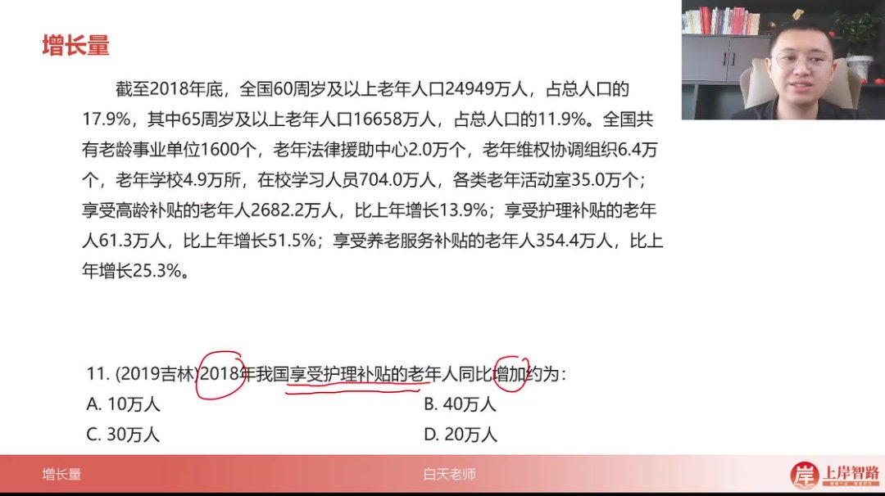

    -   增长量计算技巧

        ：当增长率差距大时，可采用分数近似法。如 51.5%增长率可近似为

        12 $/\frac{1}{2}$ 21

        ，计算增长量时用现期量除以 3（即分母加 1）。

    -   直除法演示：现期量 61.3 万除以 1.51（1+51.5%），再乘以 51.5%，估算过程为 61÷1.5≈40，40×0.5≈20，对应选项 D。

-   工业机器人收入增长计算

    -   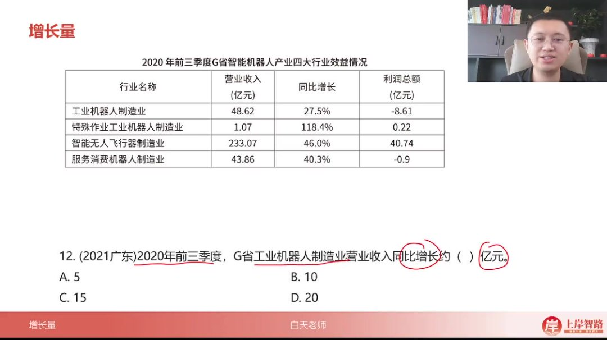

    -   快速估算方法

        ：27.5%增长率可近似为 25%（

        14 $/\frac{1}{4}$ 41

        ），增长量=现期量 48.62 亿 ÷5≈9.7 亿，最接近选项 B（10 亿）。

    -   选项差异利用：当选项差距较大时，可采用更粗略的估算方法。

-   地方政府债券增长计算

    -   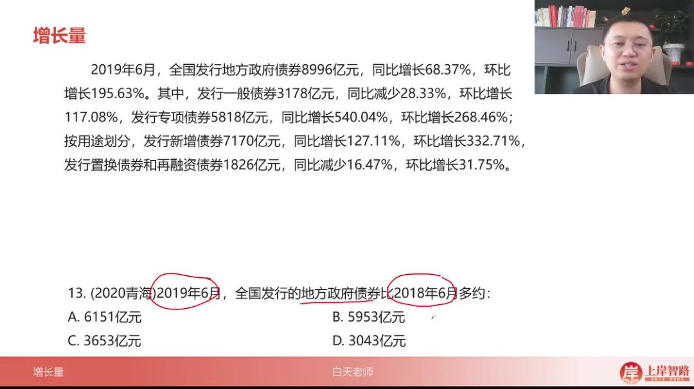

    -   分数近似应用

        ：68.37%增长率接近 66.6%（

        23 $/\frac{2}{3}$ 32

        ），可视为 1.5 分之一，增长量=8996 亿 ÷2.5≈3600 亿，最接近选项 C（3653 亿）。

    -   直除验证：8996÷1.68≈5350，5350×0.68≈3640，进一步确认选项 C 正确。

-   工业机器人销量增长计算

    -   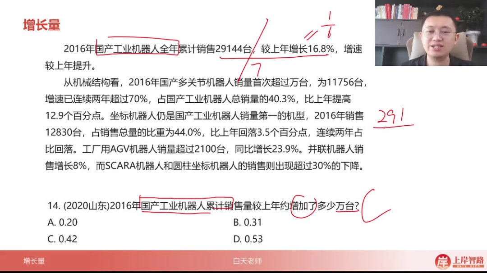

    -   常用分数对应

        ：16.8%增长率接近 16.7%（

        16 $/\frac{1}{6}$ 61

        ），增长量=29144 台 ÷7≈4163 台（0.42 万台），对应选项 C。

    -   直除验证：29144÷1.168≈24952，24952×0.168≈4192，验证选项 C 正确。

-   民航旅客吞吐量增长计算

    -   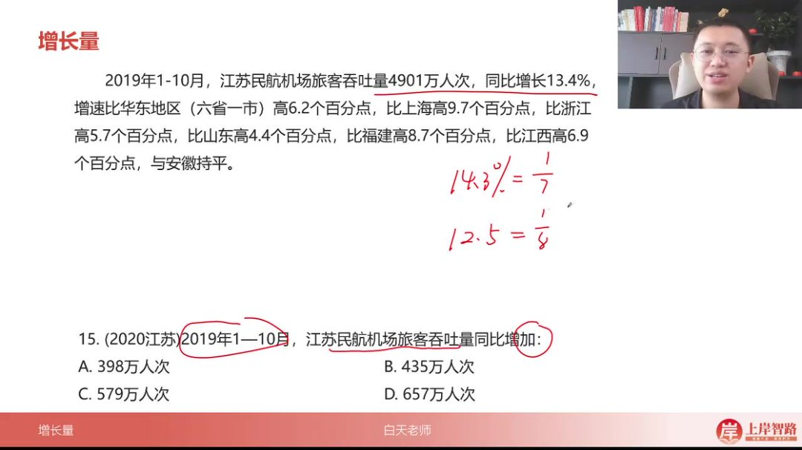

    -   中间值估算

        ：13.4%介于 14.3%（

        17 $/\frac{1}{7}$ 71

        ）和 12.5%（

        18 $/\frac{1}{8}$ 81

        ）之间，可近似为 7.5 分之一，增长量=4901 万 ÷8.5≈576 万，最接近选项 C（579 万）。

    -   比例关系验证：4901÷1.134≈4322，4322×0.134≈579，直接得出选项 C。

    -   核心公式

        ：增长量=

        现期量 1+增长率 × 增长率\frac{现期量}{1+增长率}× 增长率 1+增长率现期量 × 增长率

        ，当选项差距大时可使用分数近似法简化计算。

    -   常用百分数分数对应

        ：

        -   14.3%≈

            17 $/\frac{1}{7}$ 71

        -   12.5%=

            18 $/\frac{1}{8}$ 81

        -   11.1%≈

            19 $/\frac{1}{9}$ 91

        -   9.1%≈

            111 $/\frac{1}{11}$ 111

        -   16.7%≈

            16 $/\frac{1}{6}$ 61

        -   33.3%≈

            13 $/\frac{1}{3}$ 31

###### 4）例题：增长量计算 17:17

-   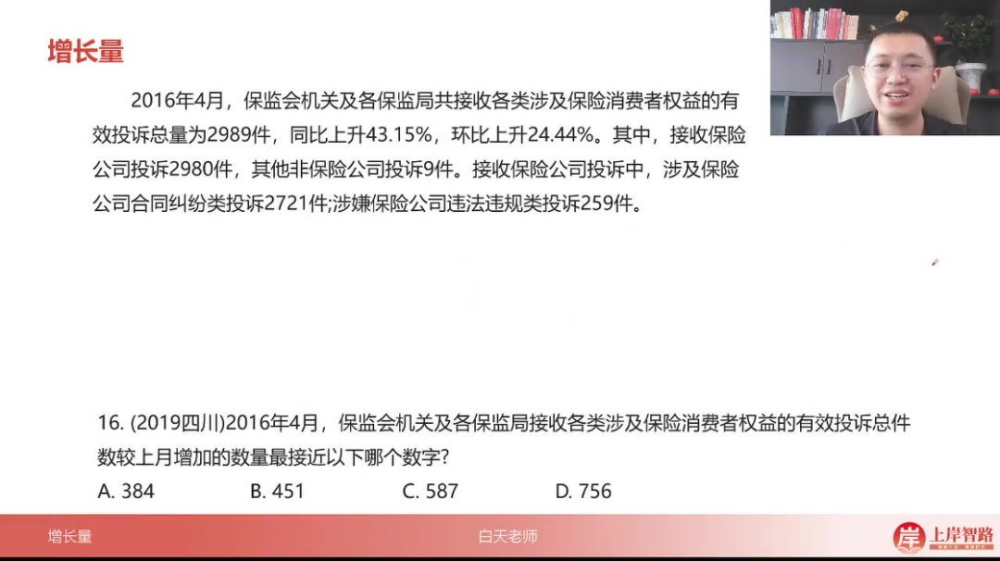

-   题目解析

    -   审题关键：明确"较上月增加"对应的是环比增长率（24.44%），而非同比增长率（43.15%）

    -   计算技巧

        ：将 24.44%近似为 25%（1/4），运用"正加一"口诀，即

        增长量=原值分母+1=29895≈597.8 增长量=\frac{原值}{分母+1}= $/\frac{2989}{5}$ \approx597.8 增长量=分母+1 原值=52989≈597.8

    -   误差处理：实际计算结果略小于 600，最接近选项 C（587）

    -   易错点：同环比概念混淆是常见陷阱，需特别注意题干时间描述

    -   答案：C

###### 5）例题：增长量计算 18:14

-   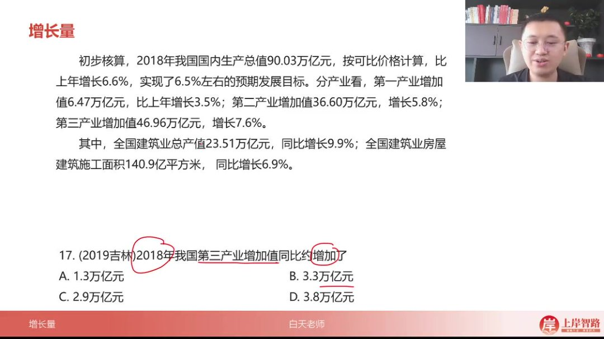

-   题目解析

    -   数据定位：第三产业增加值 46.96 万亿元，增长率 7.6%

    -   速算方法

        ：将 7.6%近似为 7.7%（1/13），采用

        增长量=现期值分母+1=46.9614≈3.35 增长量=\frac{现期值}{分母+1}=\frac{46.96}{14}\approx3.35 增长量=分母+1 现期值=1446.96≈3.35

        万亿元

    -   选项分析

        ：

        -   首位商 3 排除 A、C
        -   计算结果接近 3.3 而非 3.8

    -   精度控制：46.96÷14≈3.354，更接近 B 选项

    -   答案：B

-   补充知识点

    -   同环比区分：同比是与上年同期比较，环比是与上月/上季度比较

    -   增长量估算

        ：

        -   当增长率 ≈

            1n\frac{1}{n}n1

            时，可用

            增长量 ≈ 现期值 n+1 增长量 ≈\frac{现期值}{n+1}增长量 ≈n+1 现期值

        -   "正加一负减一"口诀适用于分数近似法

    -   选项差距判断：首位不同时可优先通过首位商排除选项

###### 6）例题：增长量计算 18:59

-   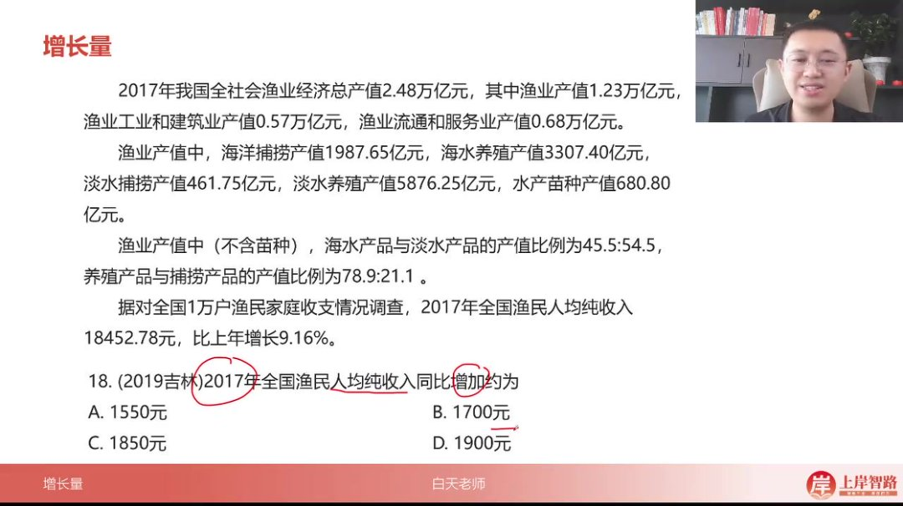

-   题目解析

    -   审题关键：题目要求计算 2017 年全国渔民人均纯收入的同比增长量，给出"增长多少元"的提示

    -   数据定位：现期量 18452.78 元，增长率 9.16%

    -   计算技巧

        ：

        -   将 9.16%近似为 9.1%，对应分数

            111 $/\frac{1}{11}$ 111

        -   增长量=现期量/(n+1)=18452.78/12

        -   计算过程：首位商 1 余 64，次位商 5（60）

    -   答案验证：计算结果约 1540 元，最接近选项 A(1550 元)

    -   易错提醒

        ：注意增长率与分数换算的精确度，9.16%更接近

        111 $/\frac{1}{11}$ 111

        而非

        110 $/\frac{1}{10}$ 101

###### 7）例题：增长量计算 19:48

-   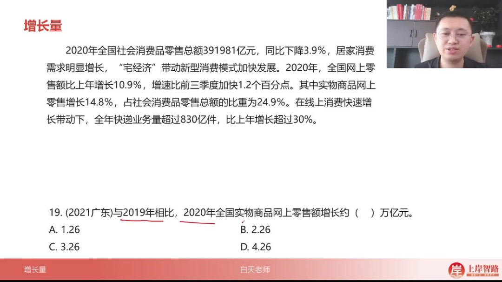

-   题目解析

    -   题型识别：求实物商品网上零售额同比增长量（单位：万亿元）

    -   数据关系

        ：

        -   已知社会消费品零售总额 39.1981 万亿元

        -   实物商品占比 24.9%（近似 25%）

        -   增长率 14.8%（近似

            17 $/\frac{1}{7}$ 71

            ）

    -   计算步骤

        ：

        -   现期量=39.1981×25%≈40×0.25=10 万亿元
        -   增长量=现期量/(n+1)=10/8=1.25 万亿元

    -   近似技巧

        ：

        -   将 39.1981 近似为 40 简化计算

        -   24.9%近似为 25%产生 0.1%误差

        -   14.8%对应

            17 $/\frac{1}{7}$ 71

            的增长率

    -   答案选择：计算结果 1.25 万亿最接近选项 A(1.26 万亿)

    -   考点提醒：当现期量需通过比重计算时，优先处理容易约分的数值关系

###### 8）例题:增长量计算 21:22

-   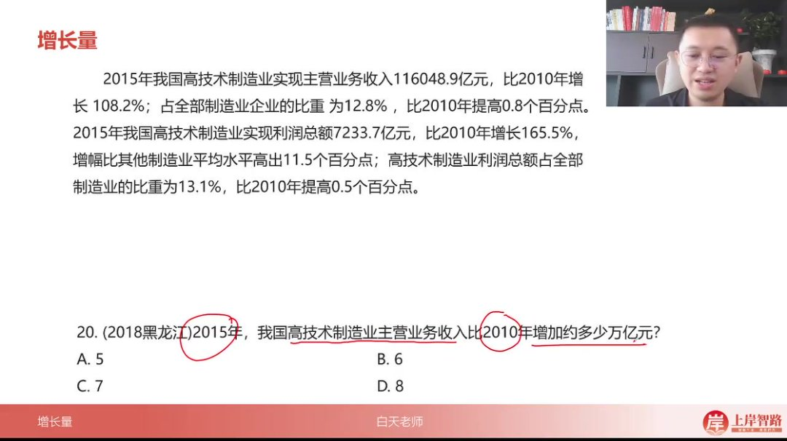

-   解题方法

    -   百花分法

        ：当增长率超过 100%时，可将增长率转化为分数形式计算。例如 110%可近似为

        10.91\frac{1}{0.91}0.911

        （因为 11%对应

        19.1\frac{1}{9.1}9.11

        ），则增长量公式为

        现期量 1+0.91\frac{现期量}{1+0.91}1+0.91 现期量

        ≈

        1161.91\frac{116}{1.91}1.91116

        ≈60.7，对应选项 B。

    -   直除法

        ：直接套用增长量公式

        现期量 × 增长率 1+增长率\frac{现期量 × 增长率}{1+增长率}1+增长率现期量 × 增长率

        ，即

        116×1.082.08\frac{116×1.08}{2.08}2.08116×1.08

        ≈

        116×1.12.1\frac{116×1.1}{2.1}2.1116×1.1

        ≈60.8，同样指向选项 B。

-   计算技巧

    -   倍数转化

        ：108%接近 110%，而 11%对应

        19.1\frac{1}{9.1}9.11

        ，因此 110%≈

        10.91\frac{1}{0.91}0.911

        ，简化计算过程。

    -   近似处理

        ：当选项无十倍关系时，可对数据进行三位截取（如 116048.9 亿元取 116），通过

        1161.91\frac{116}{1.91}1.91116

        ≈60.7 快速估算。

    -   误差控制

        ：实际计算

        1162.08\frac{116}{2.08}2.08116

        ≈55.8，再乘以 1.08≈60.3，始终指向选项 B 范围。

例题解析

-   -   审题关键：明确求"主营业务收入增长量"，时间跨度为 2010-2015 年

    -   数据提取

        ：

        -   现期量：116048.9 亿元（取 116）
        -   增长率：108.2%（取 108%）

    -   方法选择

        ：

        -   优先推荐百花分法，适用于高增长率场景

        -   直除法作为验证手段，需注意

            现期量 1+r\frac{现期量}{1+r}1+r 现期量

            的分母调整

    -   易错点

        ：

        -   误将 108%直接作为除数（正确应为 1+108%=2.08）
        -   忽略选项单位"万亿元"的换算（计算结果 6.07 对应选项 B 的 6 万亿元）

#### 二、结束 24:20

-   
-   方法选择建议: 优先使用摆划分法计算增长量，但当摆划分法出现问题时，不要固执使用
-   替代方案: 直除法也是一种快速有效的计算方法，在特定情况下可能更高效
-   计算技巧: 根据题目特点灵活选择计算方法，不要局限于单一方法

#### 三、知识小结

| 知识点           | 核心内容                                                                                                                                                                                                    | 考试重点/易混淆点                                                        | 难度系数 |
| ---------------- | ----------------------------------------------------------------------------------------------------------------------------------------------------------------------------------------------------------- | ------------------------------------------------------------------------ | -------- |
| 增长量计算       | 题型识别：出现“增长/减少+具体单位”时考查增长量。公式根据已知条件不同分为：- 已知现期和基期：增长量=现期-基期- 已知现期和增长率：增长量=现期量 ÷(1+增长率)× 增长率- 已知基期和增长率：增长量=基期量 × 增长率 | 公式选择条件（需根据题目给定数据匹配正确公式）正负号处理（减少量为负值） | ⭐⭐     |
| 速算技巧：百化分 | 将增长率转化为分数形式（如 r=1/n）：- 正增长率：增长量=现期量 ÷(n+1)- 负增长率：减少量=现期量 ÷(n-1)口诀：正加一，负减一                                                                                    | 百分数与分数转换（如 6.7%≈1/15）选项差距大时估算优先                     | ⭐⭐⭐   |
| 速算技巧：直除   | 当百化分不适用时，直接计算：现期量 ÷(1+增长率)× 增长率（保留三位数快速估算）                                                                                                                                | 首位商法（快速判断选项范围）单位换算（如亿 → 万亿需左移四位）            | ⭐⭐     |
| 多位数和差模型   | 多个现期和与基期和做差时，分项对应做差再求和（如(A₁-A₂)+(B₁-B₂)），减少计算量                                                                                                                               | 避免整体求和再减（易出错且耗时）                                         | ⭐⭐     |
| 同环比陷阱       | 注意题目要求是同比（与去年同期比）还是环比（与上月比），如第 16 题需用环比增长率                                                                                                                            | 关键词识别（“较上月”vs“较上年”）                                         | ⭐⭐⭐   |
| 高增长率处理     | 当增长率>100%时：- 百化分转化（如 110%≈1/0.91）- 直除简化（现期量 ÷(1+增长率)× 增长率 ≈ 现期量 ÷2）                                                                                                         | 近似估算（如 108%≈1.1 倍）选项验证（优先排除明显偏差项）                 | ⭐⭐⭐⭐ |
| 部分量计算       | 现期量未直接给出时，需通过占比反推（如第 19 题：社会消费品总额 ×25%=实物商品零售额）                                                                                                                        | 比重与总量联动单位一致性检查                                             | ⭐⭐⭐   |
