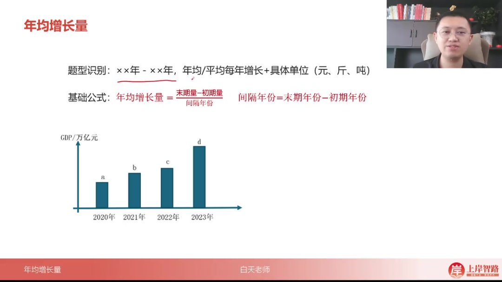
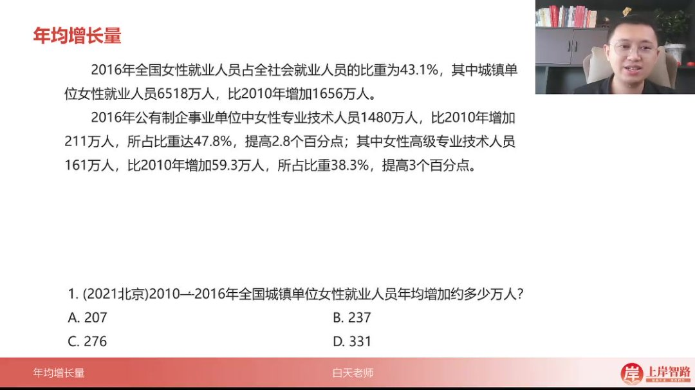
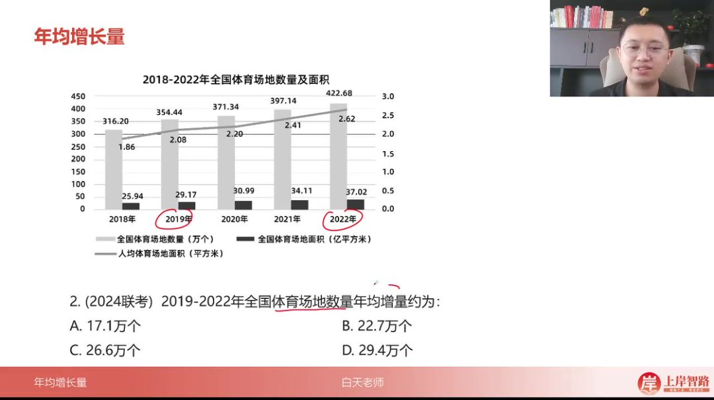
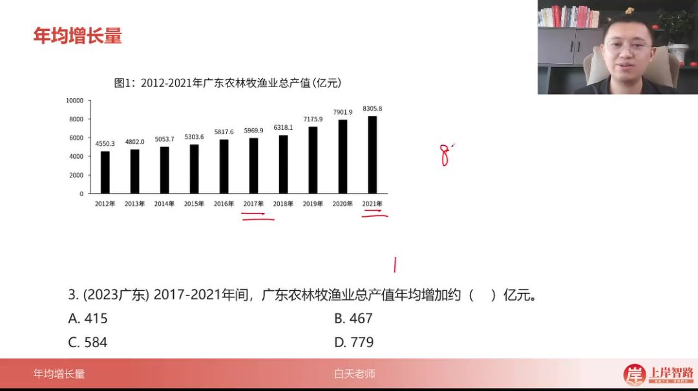
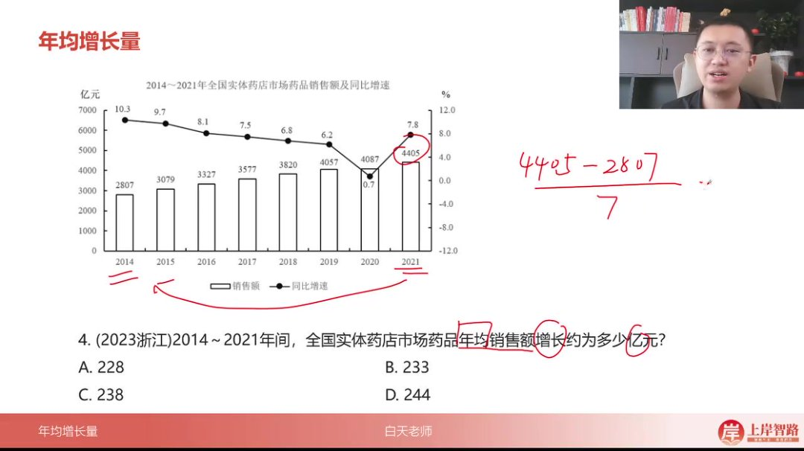
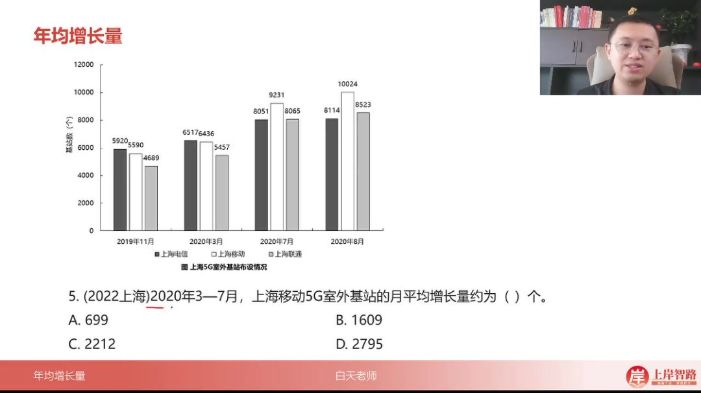

以下为 AI 生成的图文笔记的内容

#### 一、年均增长量 00:09

##### 1. 年均增长量定义

-   
-   题型特征：出现"×× 年-×× 年，年均/平均每年增长+具体单位（元、斤、吨）"的表述时适用
-   核心公式：年均增长量=(末期量-初期量)/间隔年份，其中间隔年份=末期年份-初期年份
-   计算要点：分子为末期与初期的绝对差值，分母为年份差（不需减 1）

##### 2. 计算技巧与注意事项 01:01

###### 1）例题:城镇单位女性就业人员年均增加万人 00:26

-   
-   题目解析
    -   已知 2016 年比 2010 年增加 1656 万人，直接作为分子
    -   间隔年份=2016-2010=6 年
    -   计算：1656/6=276 万人，对应选项 C
    -   技巧：当题目直接给出增长量时，可跳过末期减初期的计算步骤

###### 2）例题:体育场地数量年均增量

-   
-   题目解析
    -   正确解法：(422-354)/3≈22.7 万个（选 B）
    -   易错解法：(422-316)/4≈26.6 万个（误选 C）
    -   重要原则：在省考中（除江苏外）习惯不提前年份计算
    -   验证方法：同材料其他题目（如 00_03_57.jpg）无早期数据时必然不提前

###### 3）例题:广东农林牧渔业总产值年均增加额 04:26

-   
-   题目解析
    -   计算：(8300-6000)/4=575 亿元
    -   估算技巧：末两位"00"可简化计算，实际 8305.8-6017.5≈2288.3
    -   结果接近 584 亿元（选项 C）

###### 4）例题:实体药店市场药品年均销售额增长 04:52

-   
-   题目解析
    -   计算：(4405-2807)/7≈228 亿元
    -   速算方法：1600÷7≈228.57（选 A）
    -   注意：年份跨度 2014-2021 为 7 年（非 6 年）

###### 5）例题:上海移动 5G 室外基站月平均增长量 05:38

-   
-   题目解析
    -   计算：(9230-6400)/4≈707.5 个
    -   单位转换：月均增长量计算与年均原理相同
    -   最接近 699 个（选项 A）

##### 3. 核心记忆要点

-   公式本质：求增长量的算术平均数
-   年份处理：90%以上题目采用"末期减初期"直接作分母
-   特殊情形：仅当题干明确要求"五年规划"或江苏考题时考虑年份+1
-   数据选择：优先使用图表标注的最新数据和最早数据计算

#### 二、知识小结

| 知识点         | 核心内容                                                                                                                   | 考试重点/易混淆点                                                    | 难度系数 |
| -------------- | -------------------------------------------------------------------------------------------------------------------------- | -------------------------------------------------------------------- | -------- |
| 年均增长量公式 | 末期值减初期值除以间隔年份（间隔年份=末期年份-初期年份）                                                                   | 是否提前计算年份：非江苏考试习惯不提前，江苏需特殊处理               | ⭐⭐     |
| 第一题解析     | 2010-2016 年城镇女性就业人员年均增长量：直接给出增长量（末期-初期），间隔年份=6 年，计算得商 2 余 4，最终结果约 47（选 C） | 分子已直接给出，避免重复计算                                         | ⭐       |
| 第二题解析     | 2019-2022 年体育场地数量年均增量：公式=（422-354）/3≈22.7（选 B）                                                          | 争议点：是否用 2018 年数据提前计算（若提前则结果不同，但习惯不提前） | ⭐⭐     |
| 第三题解析     | 2017-2022 年某数据年均增量：（8300-6000）/4≈575（选 C）                                                                    | 注意间隔年份为 4 年（2022-2017-1）                                   | ⭐⭐     |
| 第四题解析     | 2014-2021 年销售额年均增量：（4405-2807）/7≈228（选 A）                                                                    | 大数值减法需精确计算（如 1600÷7≈228）                                | ⭐⭐     |
| 第五题解析     | 2020 年 3-7 月 5G 基站月均增量：（9230-6400）/4≈700（选 A）                                                                | 时间单位转换：年均与月均逻辑相同                                     | ⭐       |
| 核心总结       | 习惯优先于“严谨”：非江苏考试默认不提前年份，同一材料题目逻辑需一致                                                         | 结合题目数据缺失情况辅助判断（如无 2017 年数据则无法提前）           | ⭐⭐⭐   |
