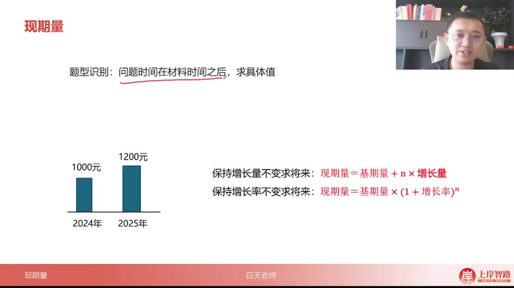
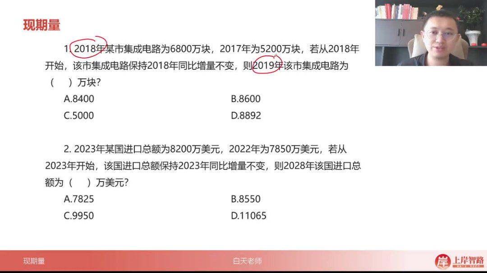
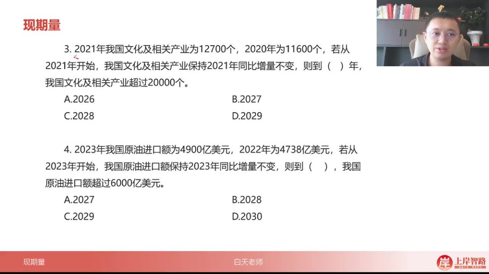
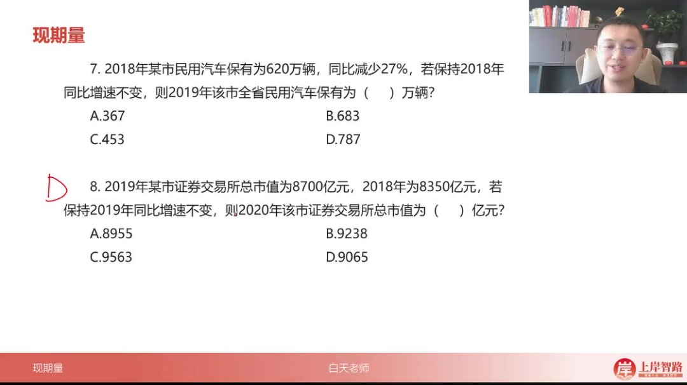
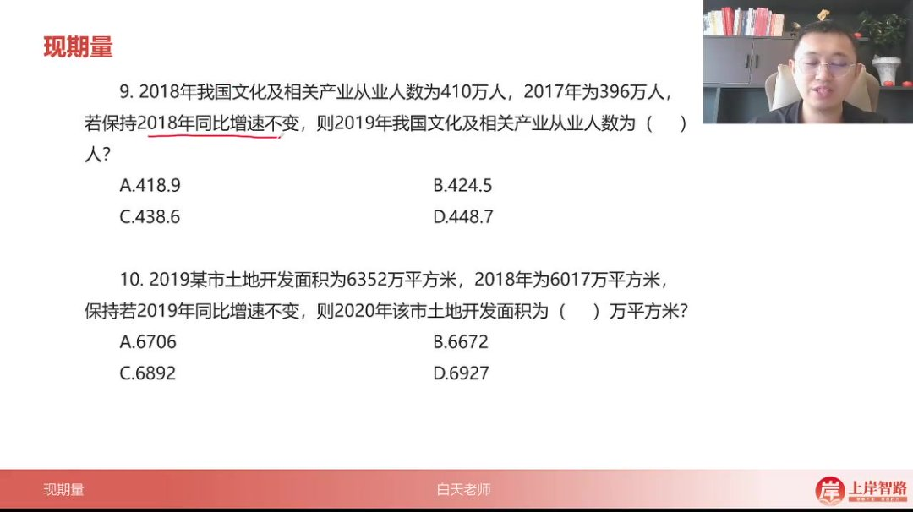
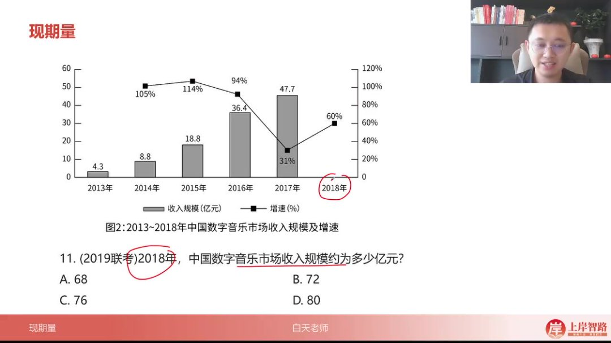
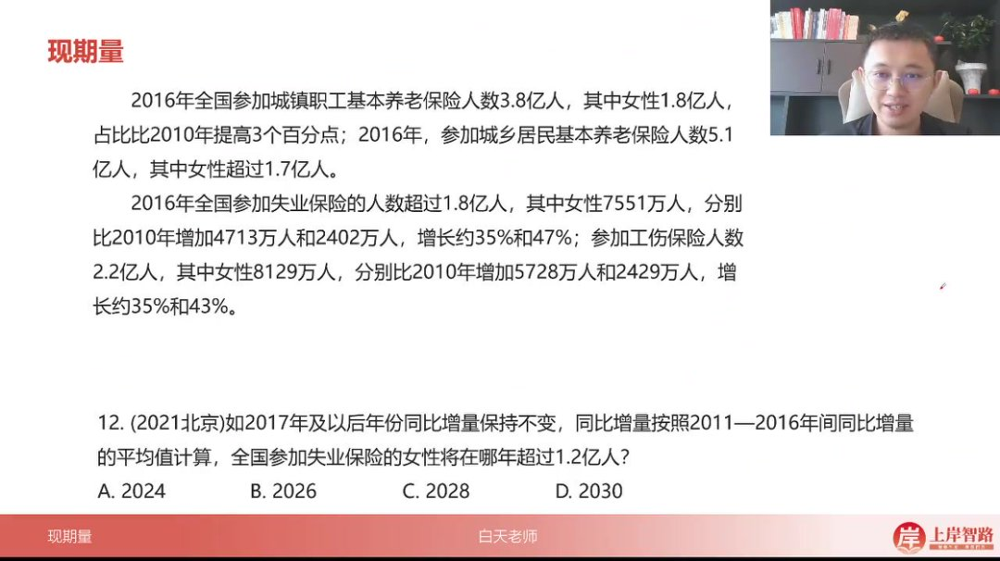
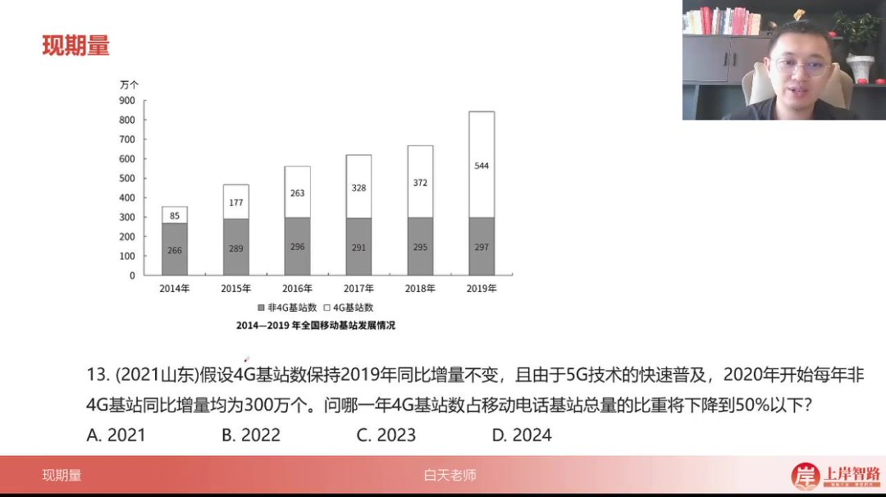
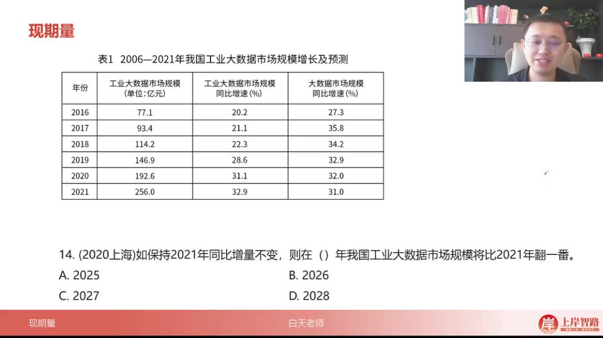
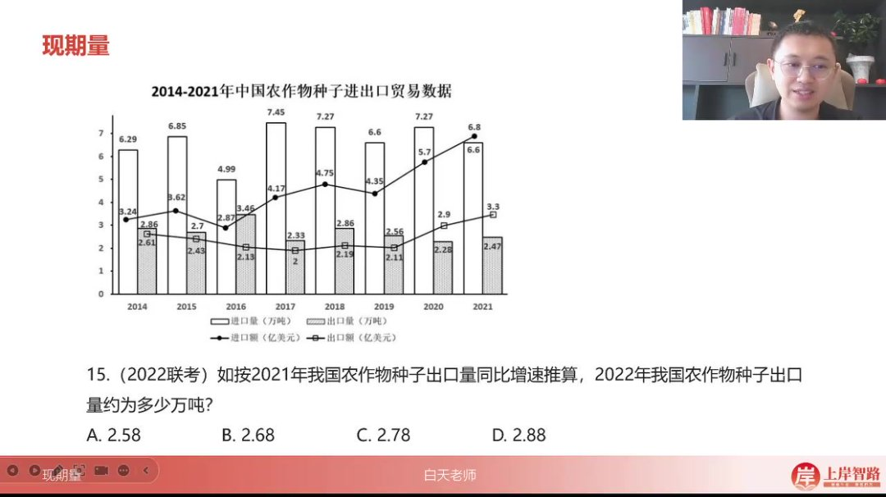

以下为 AI 生成的图文笔记的内容

#### 一、现期量 00:04

##### 1. 现期量知识点回顾 00:08

-   

###### 1）基本概念

-   问题特征：当问题时间在材料时间之后，需要求具体数值时，属于现期量计算问题

-   计算标准

    ：计算未来值需要明确增长标准，主要有两种：

    -   保持增长量（绝对增长）不变
    -   保持增长率（相对增长）不变

###### 2）计算公式

-   固定增长量公式

    ：现期量 = 基期量 + n × 增长量

    -   适用于保持绝对增长量不变的情况
    -   示例：若基期量为 1000 元，年增长量为 200 元，则 3 年后现期量 =1000 + 3×200 = 1600 元

-   固定增长率公式

    ：现期量 = 基期量 ×

    (1+增长率)n(1+增长率)^n(1+增长率)n

    -   适用于保持相对增长率不变的情况
    -   示例：若基期量为 1000 元，年增长率为 20%，则 2 年后现期量 =1000×(1+0.2)^2 = 1440 元

###### 3）应用要点

-   时间参数 n：表示从基期到现期的时间跨度
-   单位一致性：增长量与基期量的货币单位需保持一致（如示例中的"元"）
-   增长率表示：公式中的 r 需转换为小数形式（如 20%应写作 0.2）
-   典型场景：适用于 2024 年预测 2025 年等未来值计算场景

##### 2. 应用案例 00:32

###### 1）保持增量不变求现期

-   基础公式与应用

    -   

    -   核心公式

        ：现期值 = 基期值 + n× 增长量，即

        现期=基期+n× 增量现期 = 基期 + n \times 增量现期=基期+n× 增量

    -   增量计算：用相邻两年数据相减，如 2018 年增量 = 6800 - 5200 = 1600 万块

    -   时间参数 n：n 为目标年份与基期年份的差值，如 2018→2019 则 n=1

    -   计算技巧：保持增量不变时直接套用公式，如 6800 + 1×1600 = 8400（对应选项 A）

-   多步计算应用

    01:11

    -   五年期计算：2023→2028 时 n=5，增量=8200-7850=350 万美元
    -   分步运算：8200 + 5×350 = 8200 + 1750 = 9950（对应选项 C）
    -   快速验算：5×350 可拆解为 5×300+5×50=1500+250=1750

###### 2）保持增量不变求超越年份 01:58

-   不等式求解模型

    -   
    -   建立不等式：基期 + n× 增量 > 目标值，如 12700 + n×1100 > 20000
    -   简化计算：两边同除 100 得 11n > 73 → n > 6.63（取整 n=7）
    -   年份转换：2021 + 7 = 2028 年（对应选项 C）

-   近似计算技巧

    03:28

    -   增量估算：4900 - 4738 = 162 亿美元
    -   首位数估算法：1100÷162 ≈ 6.79（实际商 6+，取整 n=7）
    -   结果验证：2023 + 7 = 2030 年（对应选项 D）

###### 3）保持增速不变求现期 04:42

-   增长率公式应用

    -   

    -   核心公式

        ：现期 = 基期 ×

        (1+r)n(1 + r)^n(1+r)n

        ，当 n=1 时可简化为基期 × (1+r)

    -   百分数转换：42% → 1.42，2400 × 1.42 ≈ 2400 ÷ 7 ≈ 3428（接近选项 B 的 3408）

    -   计算验证：精确计算 2400 × 1.42 = 3408

-   负增长处理

    05:41

    -   公式调整：减少 11% → 1 - 0.11 = 0.89
    -   分步计算：6800 × 11% = 748 → 6800 - 748 = 6052（对应选项 A）
    -   快速估算：6800 - (680+68) = 6800 - 748 = 6052

###### 4）特殊情形处理 06:32

-   负增长率计算

    -   
    -   百分数拆分：27% → 0.73 = 0.7 + 0.03
    -   分配律应用：620×0.7 + 620×0.03 = 434 + 18.6 ≈ 453（对应选项 C）
    -   近似判断：600×0.7=420，实际值应略大于 420

-   增长率推导

    07:46

    -   增量计算：8700 - 8350 = 350 亿元
    -   增量递增规律：保持正增长率时，后续增量会略大于前一期
    -   结果估算：8700 + (略大于 350) ≈ 9065（对应选项 D）
    -   复利思维验证：8350 产生 350 利息，则 350 的利息约 16 → 总计增加 366

###### 5）例题:保持增速不变求现期 10:24

-   例题：文化及相关产业从业人数计算

    -   题目解析
        -   增量计算法：先计算 2017-2018 年的增量 410-396=14 万人，保持相同增量趋势，2019 年应为 410+14=424 万人
        -   选项匹配：424 万"大一点点"对应选项 B(424.5 万)
        -   答案：B

-   例题：土地开发面积计算

    10:55

    -   题目解析

        -   基础增量法

            ：

            -   计算 2018-2019 年增量 6352-6017=335 万 ㎡
            -   2020 年预测值 6352+335=6687 万 ㎡
            -   选项中最接近且略大的为 A(6706)

        -   复利思维法

            ：

            -   本金 6017 产生利息 335
            -   利息 335 产生的次级利息约 17（按 20 倍比例估算）
            -   总增量 335+17=352
            -   最终值 6352+352=6704，最接近 A 选项

        -   简化计算

            ：

            -   直接计算利息的利息 335/(6017/335)≈17
            -   总增量 335+17=352

        -   答案：A

    -   方法对比

        ：

        -   增量法适用于选项差距较大时快速解题
        -   复利法更精确但计算量稍大
        -   简化版在理解复利结构后可快速心算

###### 6）例题:保速增长求现期 13:26

-   

-   增长率公式推导

    ：增长率计算遵循

    增长率=现期 − 基期基期增长率=\frac{现期-基期}{基期}增长率=基期现期 − 基期

    ，可变形为现期=基期 ×(1+增长率)。如 2018 年收入=2017 年收入 47.7 亿 ×1.6（60%增长率）

-   速算技巧

    ：

    -   48×1.6 可拆解为 48×1.5+48×0.1
    -   乘 1.5 等于原数加其半：48+24=72
    -   再加 4.8（48×0.1）得 76.8 亿

-   选项匹配：计算结果 76.8 亿最接近 C 选项 76 亿，允许 ±4 亿误差范围

###### 7）例题:保持增量不变求现期 14:56

-   

-   解题模型

    ：基期量+n× 年均增量>目标值，即

    7551 万+n× 年均增量>1.2 亿 7551 万+n× 年均增量>1.2 亿 7551 万+n× 年均增量>1.2 亿

-   增量计算关键

    ：

    -   使用 2010-2016 年实际增长期（6 年）而非题目表述的 2011-2016
    -   年均增量=总增量 2402 万 ÷6≈400 万/年

-   不等式求解

    ：

    -   1.2 亿-7551 万=4449 万缺口
    -   n>4449÷400≈11.12
    -   取整 12 年，2016+12=2028 年

-   易错警示

    ：

    -   时间跨度易错算为 5 年（2011-2016）
    -   必须根据材料实际起止年份（2010-2016）计算
    -   单位统一（亿/万）避免计算错误

###### 8）例题:保持增量不变求现期 17:14

-   例题：4G 基站占比问题

    -   

    -   题目解析

        -   问题转化技巧：将"4G 基站占比小于 50%"转化为"4G 基站数小于非 4G 基站数"，类似"男生人数小于女生人数则男生占比小于 50%"

        -   数据提取

            ：

            -   2019 年 4G 基站数：544 万个
            -   2019 年非 4G 基站数：297 万个

        -   增量计算

            ：

            -   4G 基站年增量：544-372=172 万个（保持 2019 年增量不变）
            -   非 4G 基站年增量：固定 300 万个（题目给定）

        -   建立不等式

            ：

            544+172n<297+300n544 + 172n < 297 + 300n544+172n<297+300n

        -   求解过程

            ：

            -   移项得：

                128n>247128n > 247128n>247

            -   计算：

                n>1.93n > 1.93n>1.93

                ，取最小整数

                n=2n=2n=2

        -   结果验证：2019 年+2 年=2021 年

        -   易错点：注意区分"保持同比增量不变"与"固定增量"的区别

        -   答案：A. 2021

###### 9）例题:保持增量不变求现期 19:42

-   例题：工业大数据市场规模问题

    -   

    -   题目解析

        -   概念理解

            ：

            -   翻一番=变为 2 倍（类比赌博术语"翻番"）
            -   翻两番=变为 4 倍（2^2），翻三番=8 倍（2^3）

        -   数据提取

            ：

            -   2021 年基数：256 亿元
            -   2020 年基数：192.6 亿元

        -   增量计算

            ：

            -   年增量：256-192.6=63.4 亿元（精确计算避免估算误差）

        -   建立方程

            ：

            256+63.4n=256×2256 + 63.4n = 256 \times 2256+63.4n=256×2

        -   求解过程

            ：

            -   简化得：

                63.4n=25663.4n = 25663.4n=256

            -   计算：

                n≈4.04n \approx 4.04n≈4.04

                ，取

                n=5n=5n=5

                （需超过 4 年）

        -   结果验证：2021 年+5 年=2026 年

        -   易错点

            ：

            -   增量估算为 64 会导致错误选择 2025 年
            -   注意"n=4+"时实际需要 5 年完成

        -   答案：B. 2026

###### 10）例题:保持增速不变求现期 22:15

-   

-   解题方法

    -   口诀记忆："增量要率位变大"——当保持增长率不变时，下一期的增量会比当前期增量略大
    -   基础计算：已知 2020 年出口量 2.28 万吨，2021 年 2.47 万吨，则增量为 2.47-2.28=0.19 万吨
    -   速算技巧：2022 年出口量=2.47+0.19^+≈2.66 万吨（其中 0.19^+表示略大于 0.19 的增量）

-   详细推导

    -   复利思维

        ：

        -   将 2020 年 2.28 万吨视作本金，2021 年增值 0.19 万吨

        -   2022 年计算包含：

            -   本金 2.28 万继续产生 0.19 万利息

            -   前期利息 0.19 万自身产生

                0.1910≈0.02\frac{0.19}{10}\approx0.02100.19≈0.02

                万利息（因本金是增量的 12 倍）

        -   合计：2.47+0.19+0.02=2.68 万吨

例题解析

-   -   题目解析

        -   关键数据：2020 年出口量 2.28 万吨，2021 年 2.47 万吨

        -   计算步骤

            ：

            -   计算年度增量 0.19 万吨
            -   应用口诀得 2022 年出口量 2.47+0.19^+
            -   通过复利验证得精确值 2.68 万吨

        -   答案：B. 2.68

        -   技巧对比：速算法（2.66）与精确法（2.68）结果接近，考场上优先使用速算法

#### 二、知识小结

| 知识点                 | 核心内容                                                | 考试重点/易混淆点                                                | 难度系数 |
| ---------------------- | ------------------------------------------------------- | ---------------------------------------------------------------- | -------- |
| 现期量计算（增量不变） | 现期=基期+n× 增量，适用于保持增量不变的情况             | 增量计算准确性（如：n 的取值、时间间隔计算）                     | ⭐⭐     |
| 现期量计算（增率不变） | 现期=基期 ×(1+r)^n，适用于保持增长率不变的情况          | 复利公式应用（如：增长率正负处理、n 次方估算）                   | ⭐⭐⭐   |
| 翻一番概念             | 翻一番=2 倍，翻两番=4 倍（类比斗地主“翻倍”逻辑）        | 易混淆“翻番”与“增长”（如：翻一番 ≠ 增长 100%）                   | ⭐⭐     |
| 增量与增率关系         | 保持增率不变时，增量会略微变大（正增长前提下）          | 增量估算误差（如：第十题简化版与分叉结构对比）                   | ⭐⭐⭐   |
| 时间间隔计算           | n=目标年-基期年（如：2028-2021=7 年）                   | 易错点：材料时间与问题时间对应（如：第 12 题一零年与一六年间隔） | ⭐⭐     |
| 比重转化技巧           | 占比<50% → 部分<另一部分（如：第 13 题 4g<非 4g）       | 逻辑转化能力（需结合题目条件灵活应用）                           | ⭐⭐⭐   |
| 实战速算技巧           | 百划分（如：1.42≈1/7）、分步乘法（如：620×0.73=434+18） | 选项差距判断（如：第六题 6100 不到选 A）                         | ⭐⭐⭐⭐ |
| 复利思维详解           | 利息的利息计算（如：第 8 题 35÷20≈1.75 利息）           | 分叉结构理解（需掌握本金与利息的递推关系）                       | ⭐⭐⭐⭐ |
