以下为 AI 生成的图文笔记的内容

#### 一、基期比重 00:04

##### 1. 题型识别 00:06

-   时间特征: 问题时间在材料时间之前
-   关键词提示: 出现"在...中"或"...占...的比重"句式
-   核心概念: 计算过去某个时间点的占比即为基期比重

##### 2. 计算公式 00:30

###### 1）已知现期量和增长量

-   公式推导: 基期部分值=现期部分值-部分增长量，基期总体值=现期总体值-总体增长量

-   计算公式

    : 基期比重 =

    A−ΔAB−ΔB\frac{A - \Delta A}{B - \Delta B}B−ΔBA−ΔA

    （A 为现期部分值，B 为现期总体值）

###### 2）已知现期量和增长率

-   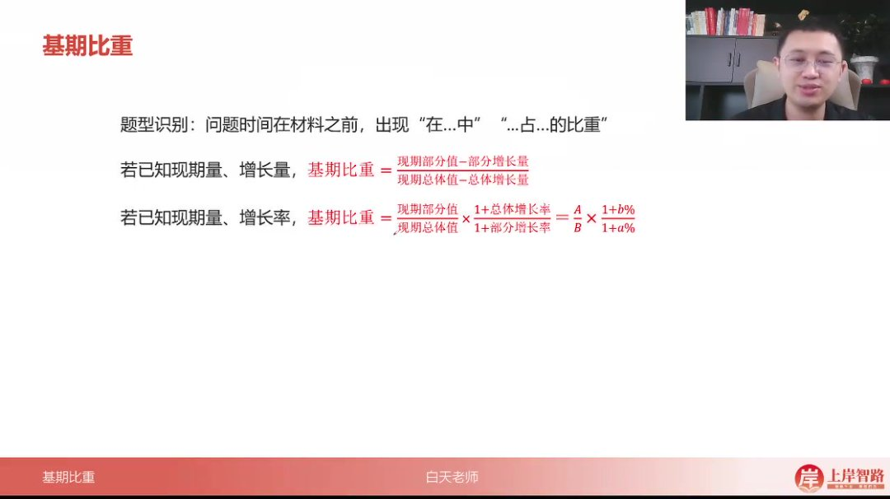

-   标准公式

    : 基期比重 =

    AB×1+b%1+a%\frac{A}{B} \times \frac{1 + b\%}{1 + a\%}BA×1+a%1+b%

-   记忆口诀: "大 A 除大 B 乘增长率反向比"

##### 3. 速算技巧

###### 1）截位直除法

-   适用条件: 选项差距较大时

-   操作步骤

    :

    -   分子分母各保留两位有效数字
    -   先约分再计算
    -   选项差距大时 B 保留 2 位，差距小时 B 保留 3 位

###### 2）大小关系判断法

-   核心原理

    : 比较

    1+b%1+a%\frac{1 + b\%}{1 + a\%}1+a%1+b%

    与 1 的关系

-   判断规则

    :

    -   当 b% > a%时，基期比重 > 现期比重
    -   当 b% < a%时，基期比重 < 现期比重

-   应用价值: 可快速排除部分选项

###### 3）近似计算法

-   精确公式变形

    : 基期比重 = 现期比重

    ×(1+b%−a%1+a%)\times \left(1 + \frac{b\% - a\%}{1 + a\%}\right)×(1+1+a%b%−a%)

-   简化条件

    : 当 a% ≤ 10%时，

    1+a%≈11 + a\% \approx 11+a%≈1

-   近似公式

    : 基期比重 ≈ 现期比重 + 现期比重

    ×(b%−a%)\times (b\% - a\%)×(b%−a%)

-   记忆口诀: "小 a 直接加减差，大 a 需要除一下"

##### 4. 应用案例 01:28

###### 1）例题:新能源汽车销量占比

-   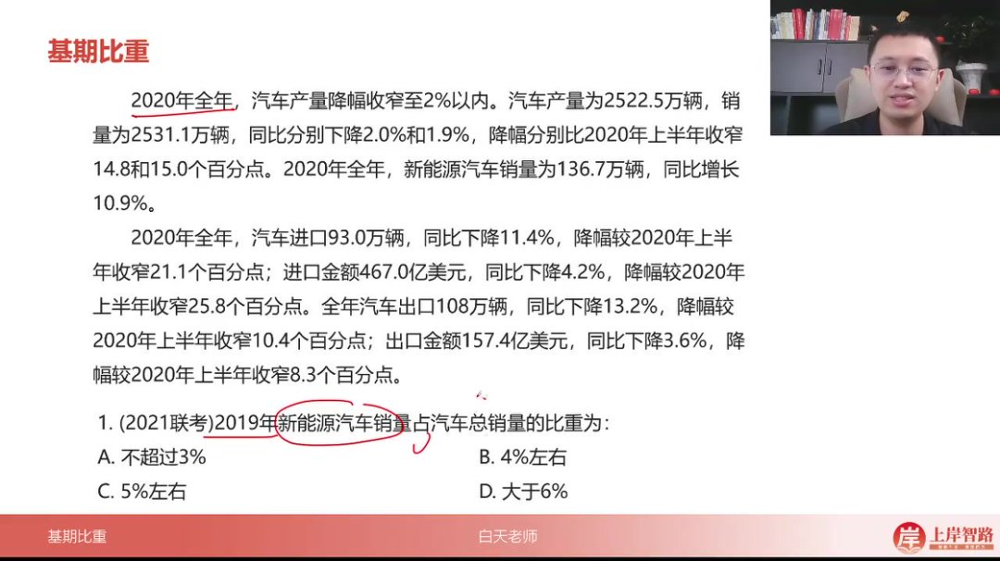

-   基期比重计算

    ：计算 2019 年新能源汽车销量占比时，使用公式

    AB×1+b1+a\frac{A}{B}×\frac{1+b}{1+a}BA×1+a1+b

    ，其中 A=136.7 万辆（2020 年新能源销量），B=2531.1 万辆（2020 年总销量），a=10.9%（新能源增速），b=-1.9%（总销量增速）

-   速算技巧

    ：

    -   选项差距较大时可保留两位计算：

        1425×98111 $/\frac{14}{25}$ × $/\frac{98}{111}$ 2514×11198

    -   约分方法灵活：25×4≈98，得到

        56111≈5% $/\frac{56}{111}$ ≈5\%11156≈5%

    -   敏感数据记忆：

        100110≈0.9 $/\frac{100}{110}$ ≈0.9110100≈0.9

        ，可快速估算分数部分

-   答案验证：通过两种不同约分路径均得到 5%左右结果，确认选 C

###### 2）例题:证券公司营业收入利润率 03:38

-   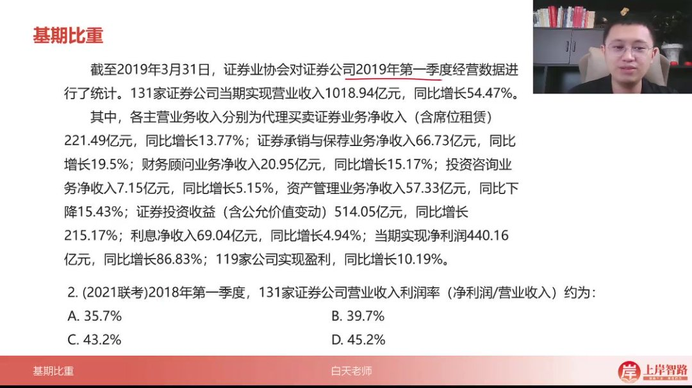

-   基期利润率公式

    ：

    净利润营业收入 ×1+收入增速 1+利润增速\frac{净利润}{营业收入}×\frac{1+收入增速}{1+利润增速}营业收入净利润 ×1+利润增速 1+收入增速

    ，代入 440.16 亿/1018.94 亿 ×

    1.54471.8683\frac{1.5447}{1.8683}1.86831.5447

-   解题技巧

    ：

    -   现期比重陷阱识别：现期值 440/1019≈43.2%直接对应选项 C

    -   增速关系判断：因收入增速(54.47%)<利润增速(86.83%)，基期值应小于现期值

    -   修正计算：

        1518=5/6 $/\frac{15}{18}$ =5/61815=5/6

        ，43.2%×5/6≈36%，考虑误差选 A

-   注意事项：当选项 CD 差距较小时，避免使用截位法造成误差

###### 3）例题:党员发展情况 06:18

-   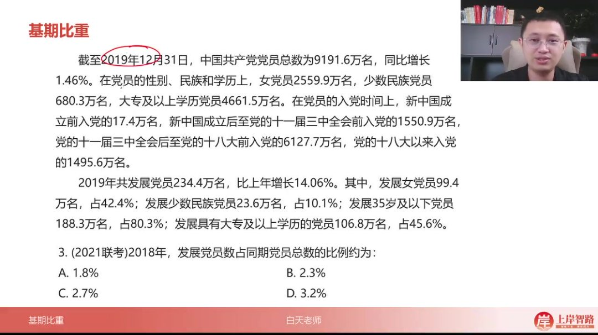

-   基期占比计算

    ：

    234.49191.6×1.01461.1406\frac{234.4}{9191.6}×\frac{1.0146}{1.1406}9191.6234.4×1.14061.0146

    ，其中发展党员增速 14.06%>党员总数增速 1.46%

-   速算方法

    ：

    -   敏感数据应用：

        100110≈0.9 $/\frac{100}{110}$ ≈0.9110100≈0.9

        ，整体简化为

        2392×0.9≈2.3% $/\frac{23}{92}$ ×0.9≈2.3\%9223×0.9≈2.3%

    -   截位法验证：23/92=0.25，0.25×0.9=2.25%

    -   分数转换：

        2399≈29=22.2% $/\frac{23}{99}$ ≈ $/\frac{2}{9}$ =22.2\%9923≈92=22.2%

        ，考虑数量级得 2.2%

-   选项分析：B(2.3%)与 C(2.7%)次位差>首位差，允许较大估算误差

-   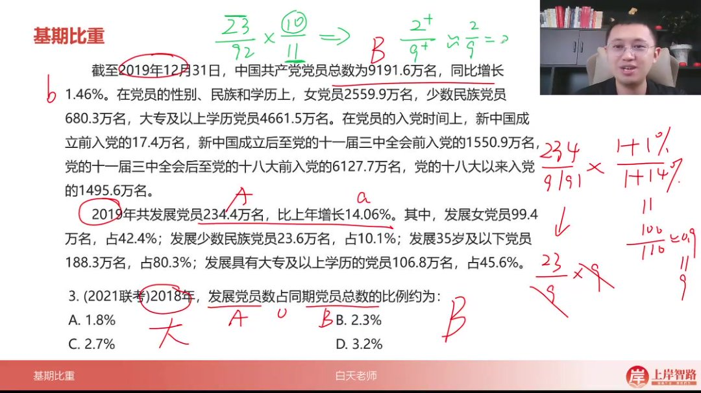

-   核心公式

    ：基期比重=

    AB×1+b1+a\frac{A}{B}×\frac{1+b}{1+a}BA×1+a1+b

    ，其中 a 为分子增速，b 为分母增速

-   易错点：注意区分分子分母的增速位置，避免公式倒置

###### 4）例题:农产品欧洲进口占比 08:18

-   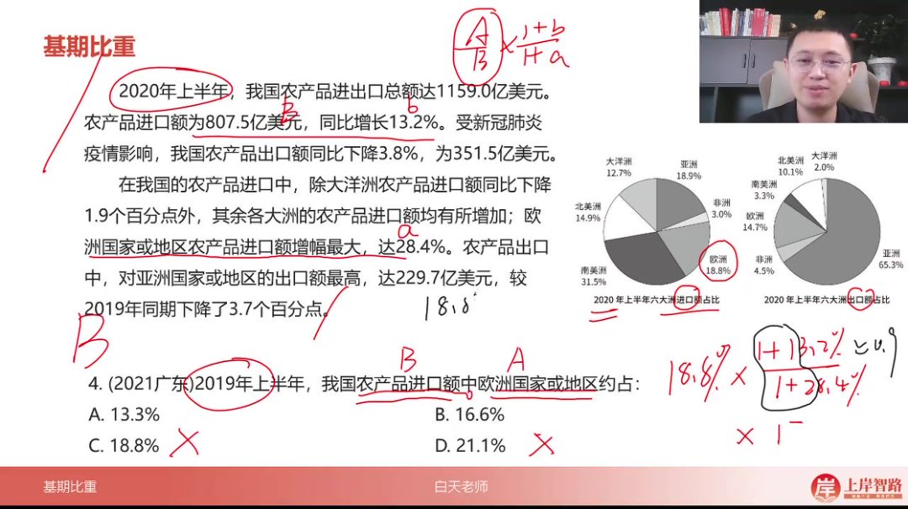

-   基期比重公式

    ：

    AB×1+b1+a\frac{A}{B} \times \frac{1+b}{1+a}BA×1+a1+b

    ，其中 A/B 为现期部分量占总体量的比值，a 为部分量增长率，b 为总体量增长率

-   数据提取技巧

    ：

    -   进口总额为总体量 B=807.5 亿美元（同比增长 13.2%）
    -   欧洲进口额占比现期值 A/B=18.8%
    -   欧洲进口增幅 a=28.4%

-   计算逻辑

    ：

    -   通过饼图直接获取现期占比 18.8%
    -   分子部分（1+b）=1+13.2%=1.132
    -   分母部分（1+a）=1+28.4%=1.284

-   快速判断技巧

    ：

    -   当（1+b）/（1+a）<1 时，结果必小于现期值
    -   1.132/1.284≈0.9，故结果约为 18.8%×0.9≈17%

-   误差分析

    ：

    -   实际计算值为 16.6%（选项 B）
    -   排除明显偏小的 13.3%和明显偏大的 21.1%

###### 5）例题:石油和天然气开采业利润占比 10:33

-   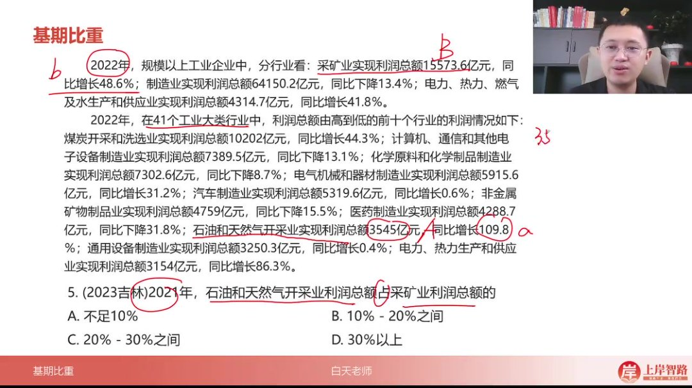

-   基期比重计算要点

    ：

    -   部分量：石油和天然气开采业利润 3545 亿元（a=109.8%）
    -   总体量：采矿业利润 15573.6 亿元（b=48.6%）

-   速算方法

    ：

    -   分子近似为 35，分母近似为 16
    -   增长率比值（1+b）/（1+a）=1.486/2.098≈0.7
    -   初步估算：35/16≈2.2，2.2×0.7≈15.4%

-   选项分析技巧

    ：

    -   范围题优先考虑中间值
    -   计算结果 15.4%落在 10%-20%区间（选项 B）

-   精确计算验证

    ：

    -   完整计算：3545/15573.6×1.486/2.098≈15.2%
    -   确认选项 B 正确

###### 6）例题:非住宅商品房销售面积占比 13:17

-   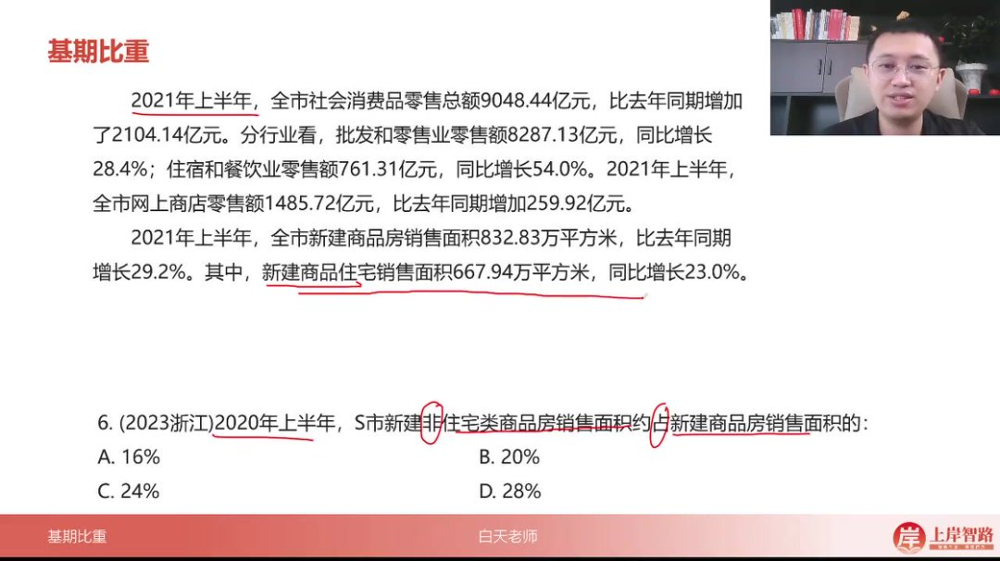

-   逆向占比计算

    ：

    -   总销售面积 832.83 万平方米（b=29.2%）
    -   住宅销售面积 667.94 万平方米（a=23.0%）
    -   非住宅占比=1-住宅占比

-   计算步骤

    ：

    -   现期住宅占比：667.94/832.83≈80%
    -   增长率调整系数：（1+29.2%）/（1+23%）≈1.05
    -   基期住宅占比 ≈80%×1.05≈84%
    -   非住宅占比 ≈1-84%=16%

-   误差控制

    ：

    -   实际计算值 16.3%最接近选项 A（16%）
    -   排除 20%及以上选项

-   注意事项

    ：

    -   注意"非住宅"的关键词识别
    -   增长率差异（29.2% vs 23%）导致调整系数>1
    -   大基数下小比例变化影响显著

###### 7）例题：东部地区住宅投资占比 16:23

-   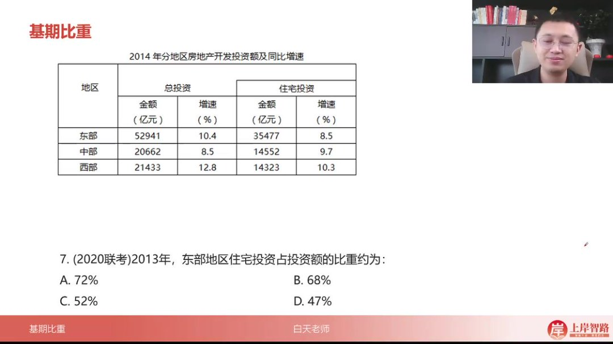

-   基期比重计算

    ：计算 2013 年东部地区住宅投资占比，公式为

    ab×1+b1+a\frac{a}{b}×\frac{1+b}{1+a}ba×1+a1+b

    ，其中

    a=8.5%a=8.5\%a=8.5%

    为住宅投资增速，

    b=10.4%b=10.4\%b=10.4%

    为总投资增速

-   速算技巧

    ：

    -   选项差距不大时（A/B 项接近 70%），需精确计算左边部分

    -   左边计算：

        3547752941≈67% $/\frac{35477}{52941}$ ≈67\%5294135477≈67%

        （精确计算得 67.03%）

    -   右边估算：

        1.1041.085≈1+2%\frac{1.104}{1.085}≈1+2\%1.0851.104≈1+2%

        （使用

        b−a=1.9%b-a=1.9\%b−a=1.9%

        近似）

-   结果修正：67%×(1+2%)≈67%+1.34%=68.34%，故选择 B 选项 68%

-   易错点：当选项差距较小时（如 A 项 72%与 B 项 68%），不能仅凭估算判断，需分步精确计算

###### 8）例题：直接经济价值年值占比 18:59

-   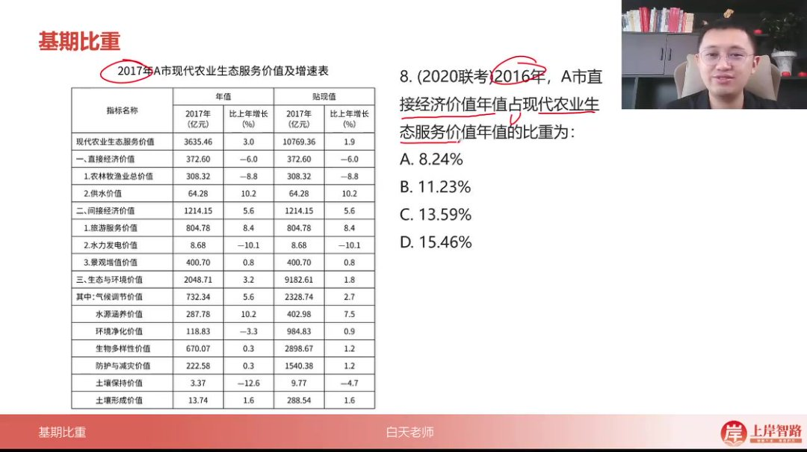

-   数据定位

    ：

    -   分子：直接经济价值 372.60 亿元（增速-6%）
    -   分母：现代农业生态服务价值 3635.46 亿元（增速 3%）

-   速算方法

    ：

    -   前两位比值：

        3736≈1.03 $/\frac{37}{36}$ ≈1.033637≈1.03

    -   增长率修正：

        1.030.94≈1.1\frac{1.03}{0.94}≈1.10.941.03≈1.1

        （因

        10394≈1+994 $/\frac{103}{94}$ ≈1+ $/\frac{9}{94}$ 94103≈1+949

        ）

    -   最终结果：1.03×1.1≈11.3%，对应 B 选项

-   技巧提示：当分子分母前两位数值接近时（37vs36），可优先观察选项是否包含 1 倍关系

###### 9）例题：省内就业农民工占比 20:09

-   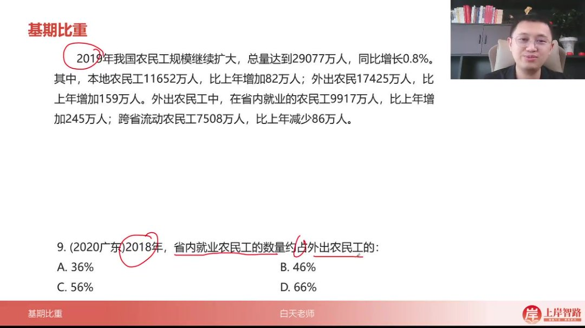

-   基期量计算

    ：

    -   分子：9917-245=9672 万人（省内就业）
    -   分母：17425-159=17266 万人（外出总量）

-   估算技巧

    ：

    -   首位计算：9672÷17266≈9600÷17000≈0.56
    -   验证：实际计算得 56.03%，对应 C 选项

-   数据特征：题目给出现期量和增长量时，基期量=现期量-增长量

###### 10）例题：城镇居民医保占比 21:16

-   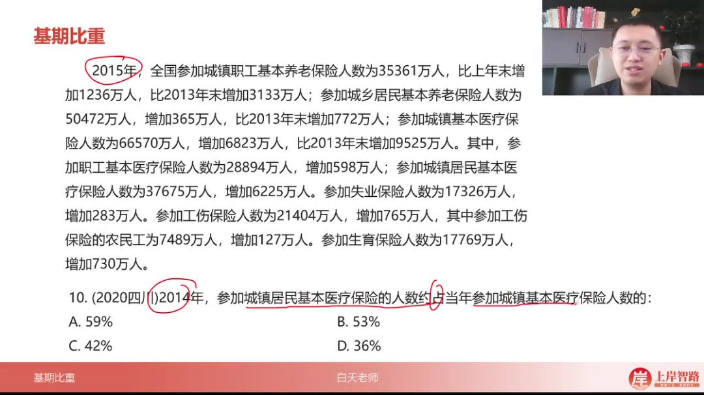

-   关键区分：注意"城镇居民基本医疗保险"（分子）与"城镇基本医疗保险"（分母）的主体区别

-   计算过程

    ：

    -   分子：37675-6225=31450 万人
    -   分母：66570-6823≈59747 万人
    -   比值：31450÷59747≈52.6%，最接近 B 选项 53%

-   速算验证

    ：

    -   简化计算：315÷600=52.5%
    -   选项分析：A 项 59%明显偏高，C/D 项低于 50%可排除

#### 二、知识小结

| 知识点                  | 核心内容                                                                                                                              | 考试重点/易混淆点                                                                    | 难度系数 |
| ----------------------- | ------------------------------------------------------------------------------------------------------------------------------------- | ------------------------------------------------------------------------------------ | -------- |
| 基期比重计算            | 问题时间在其他时间之前，出现“在...中占...比重”的题型识别；公式推导（现期量、增长量或增长率不同条件下的计算逻辑）                      | 公式选择陷阱：现期量+增长量（现减增量） vs. 现期量+增长率（大 A/大 B × (1+b)/(1+a)） | ⭐⭐⭐   |
| 速算技巧                | 1. 选项差距大时截位直除（保留两位约分）2. 先算现期比重（大 A/大 B），再分析(1+b)/(1+a)与 1 的大小关系 3. a≤10%时，(1+b)/(1+a)≈1+(b-a) | 易错点：忽略选项差距导致计算精度不足；未区分 a 的大小对近似公式的影响                | ⭐⭐     |
| 例题 1（新能源占比）    | 材料给 2020 年，问 2019 年新能源占汽车总销量比重；公式应用与截位约分（幺四/二五 × 九八/幺幺 ≈5%）                                     | 关键步骤：选项差距大时优先截位；敏感数字（如 100/110≈0.9）快速估算                   | ⭐⭐     |
| 例题 2（利润率）        | 2019 年一季度利润占收入比重反推 2018 年基期值；现期比重（44%）与基期关系（右边<1，结果比 44%小）                                      | 命题陷阱：选项混入现期比重（如 C 项 43.2%为现期干扰）                                | ⭐⭐⭐   |
| 例题 4（欧洲进口占比）  | 饼图直接给出 2020 年占比（18.8%），结合增长率推算基期；右边(1+b)/(1+a)≈0.9（幺幺/幺二）                                               | 数据关联：文字+图表综合提取信息（大 A 需从饼图获取）                                 | ⭐⭐     |
| 例题 6（非住宅占比）    | 1-住宅占比反向计算；现期比重 ≈80% × (1+5%)→ 基期非住宅 ≈16%                                                                           | 逻辑转换：部分=总体-另一部分；基准值大时小幅度变化影响显著                           | ⭐⭐⭐⭐ |
| 例题 8（经济价值占比）  | 前两位近似（三七/三六 ≈1）× (1.03/0.94≈1.1)→ 结果 ≈1.1                                                                                | 极端简化：选项差距极大时首位估算优先                                                 | ⭐       |
| 例题 10（医疗保险占比） | 通过增长量反推基期部分/总体（注意“居民”与“职工”主体差异）                                                                             | 审题关键：主体词细微差别（如“城镇居民”vs“城镇基本”）                                 | ⭐⭐⭐   |
