以下为 AI 生成的图文笔记的内容

#### 一、平均数相关 00:02

##### 1. 平均数

###### 1）现期平均数 00:08

-   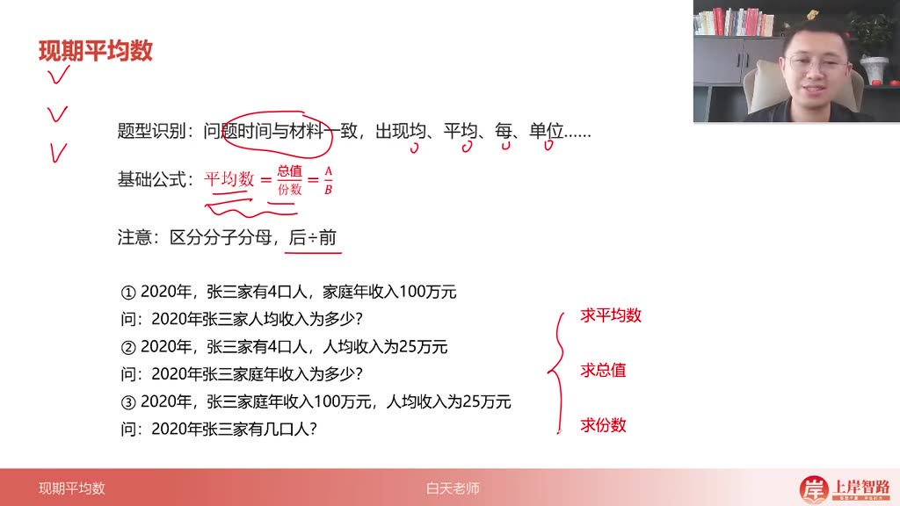

-   题型特征：问题时间与材料时间一致，出现"均"、"平均"、"每"、"单位"等关键词

-   核心公式

    ：平均数

    =总值份数= \frac { 总值 }{ 份数 }=份数总值

    （后 ÷ 前原则，用后出现的量除以前出现的量）

-   三量关系

    ：

    -   求平均数：总值 ÷ 份数（例：100 万 ÷4 人=25 万/人）
    -   求总值：平均数 × 份数（例：25 万/人 ×4 人=100 万）
    -   求份数：总值 ÷ 平均数（例：100 万 ÷25 万/人=4 人）

-   基期平均数

    00:09

    -   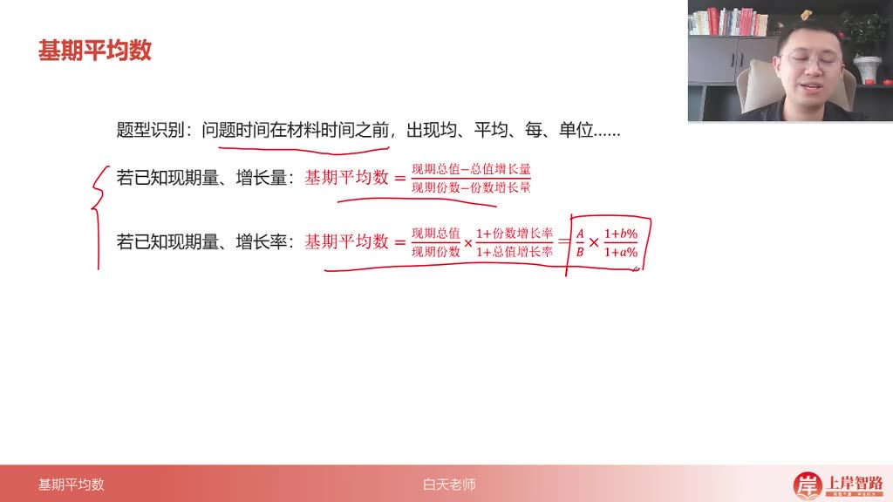

    -   题型特征：问题时间早于材料时间，出现平均相关表述

    -   两种计算方式

        ：

        -   已知现期量和增长量：

            现期总值 − 总值增长量现期份数 − 份数增长量\frac{现期总值-总值增长量}{现期份数-份数增长量}现期份数 − 份数增长量现期总值 − 总值增长量

        -   已知现期量和增长率：

            AB×1+b%1+a%\frac{A}{B} \times \frac{1+b\%}{1+a\%}BA×1+a%1+b%

            （A/B 为现期平均数，a 为总值增长率，b 为份数增长率）

    -   重点提示：与基期比重公式结构相同，考试中第二种形式更常见

-   两期平均数

    00:57

    -   比较题型

        -   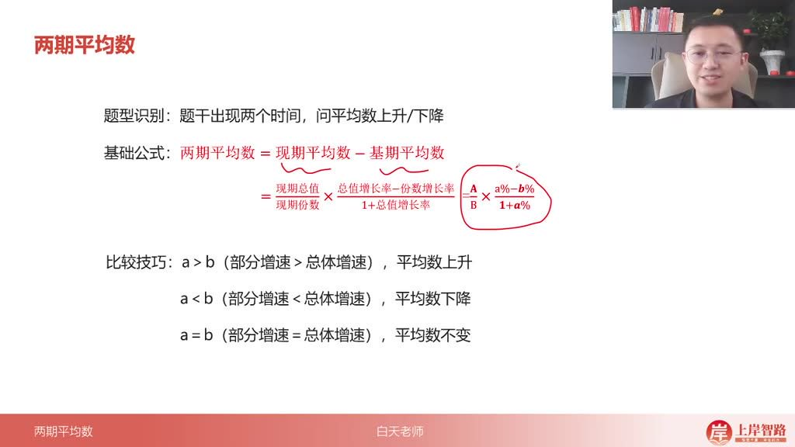

        -   题型特征：题干出现两个时间，仅判断平均数升降

        -   比较技巧

            ：

            -   部分增速(a)＞总体增速(b)→ 上升
            -   部分增速(a)＜总体增速(b)→ 下降
            -   两者相等则平均数不变

        -   核心原理

            ：

            AB×a%−b%1+a%\frac{A}{B} \times \frac{a\% - b\%}{1+a\%}BA×1+a%a%−b%

            中，a-b 决定正负

    -   计算题型

        -   新增特征：在比较题型基础上出现具体单位

        -   解题步骤

            ：

            -   先计算 a-b 判断升降趋势（结果需带单位）

            -   若需精确计算，代入完整公式：现期平均数 ×

                a%−b%1+a%\frac{a\% - b\%}{1+a\%}1+a%a%−b%

        -   注意事项：计算结果必须保留单位，与现期/基期平均数的单位一致

###### 2）应用案例 01:45

-   例题：羊肉年平均产量年份

    -   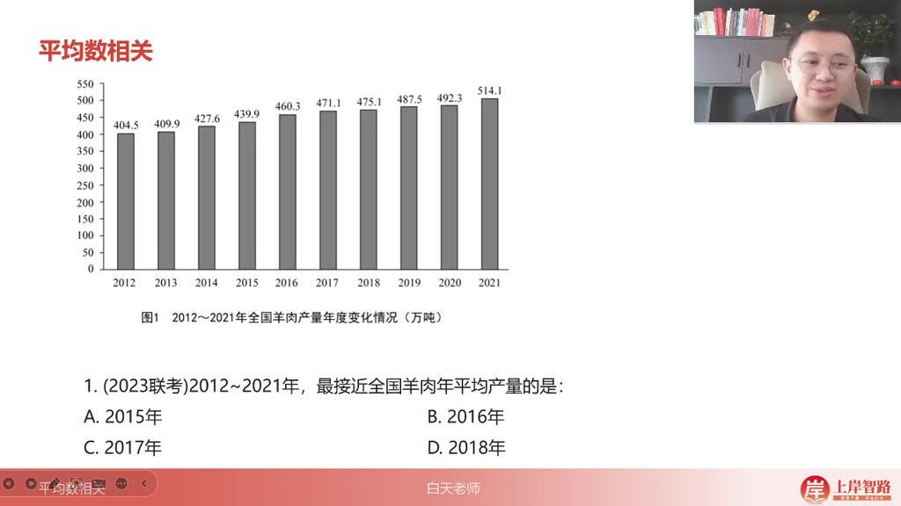

    -   画线法应用：通过观察数据曲线，画一条水平线作为平均产量参考线，比较各年份数据点与该线的偏离程度。

    -   判断标准：当高于参考线的数据总量与低于参考线的数据总量近似相等时，该线即为年平均产量线。

    -   解题步骤

        ：

        -   先假设 2015 年（A 选项）为平均值，画线后发现高于该线的数据量明显多于低于该线的数据量，说明实际平均值高于 2015 年产量。
        -   验证 2016 年（B 选项）时，高低数据量基本平衡，确定为最接近年平均产量的年份。
        -   验证 2017 年（C 选项）时发现低于该线的数据量过多，排除。

    -   技巧总结：对于连续多年数据比较题，优先采用画线法快速估算，避免繁琐计算。

-   例题：公共汽电车月平均客运量

    04:32

    -   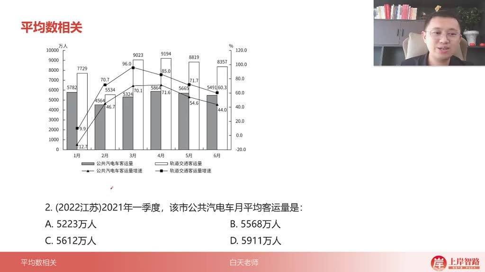

    -   常规计算法：将 1-3 月数据相加除以 3，（5782+4564+5324）/3≈5223 万人，对应选项 A。

    -   选项排除法

        ：

        -   D 选项 5911 远高于最高月份 5782，直接排除。
        -   C 选项 5612 接近最高值但低于它的月份差距过大（如 4564 比 5612 少 1048）。
        -   B 选项 5568 仍使低值月份产生过大差距（4564 比 5568 少 1004）。

    -   关键验证：当采用画线法时，发现只有 A 选项能使高低值偏差相对平衡。

-   例题：年均值年份个数

    06:37

    -   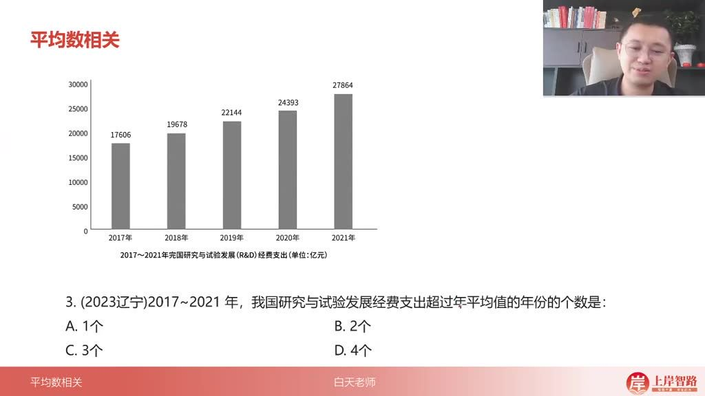

    -   基准假设法

        ：假设 2019 年 22144 亿元为平均数：

        -   2020 年多 24393-22144≈2249 亿
        -   2021 年多 27864-22144≈5720 亿
        -   合计多 7969 亿
        -   2017 年少 22144-17606≈4538 亿
        -   2018 年少 22144-19678≈2466 亿
        -   合计少 7004 亿

    -   结论推导：因多出量（7969）>缺少量（7004），实际平均数应高于 22144 亿，故仅 2020、2021 两年超均值，选 B。

    -   观察技巧：对于有明显增长趋势的数据，后期年份超平均值的概率更大。

-   例题：平均创新指数

    08:54

    -   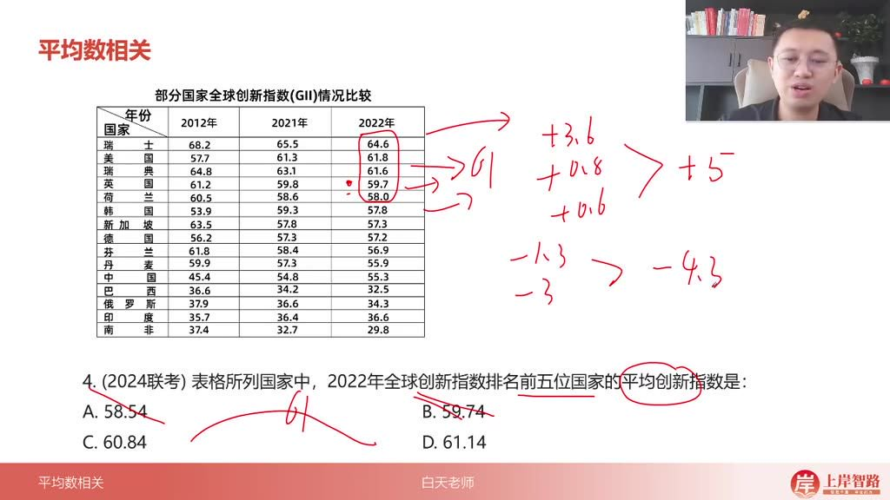

    -   前五国家数据：瑞士 64.6、美国 61.8、瑞典 61.6、英国 59.7、荷兰 58.0

    -   基准验证法

        ：假设平均数 61：

        -   瑞士+3.6，美国+0.8，瑞典+0.6（合计+5.0）
        -   英国-1.3，荷兰-3.0（合计-4.3）
        -   因+5.0>-4.3，实际平均数>61，排除 C 选 D

    -   速算技巧：观察最高值 64.6 与次高值 61.8 的拉动作用，直接判断平均数应靠近 61-62 区间。

-   例题：人均求总

    10:28

    -   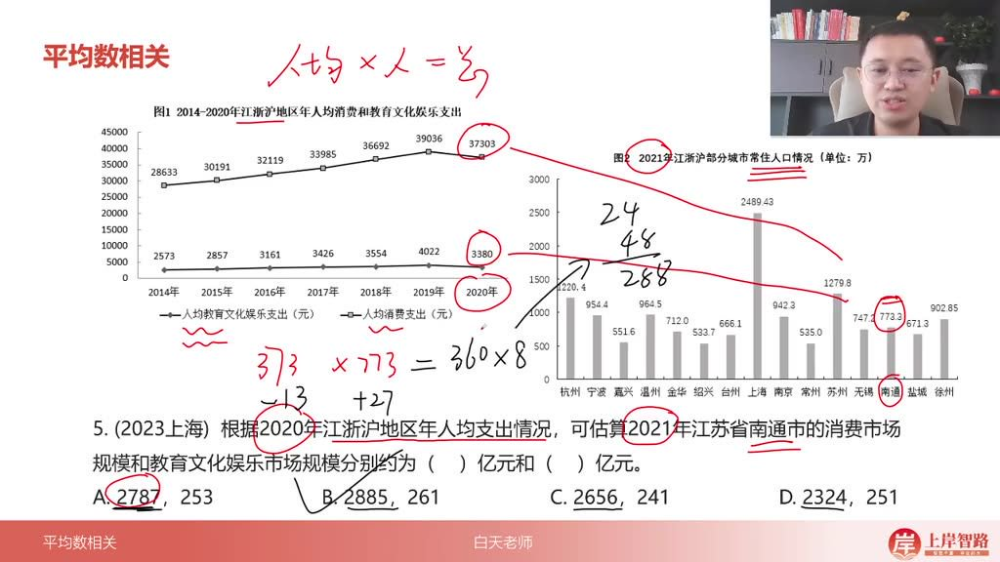

    -   核心公式：总=人均 × 人数，如教育文化总支出=人均教育支出 × 常住人口

    -   计算技巧

        ：

        -   三位数乘法采用修正思维：如 37303×773 可调整为(37303-13)×800≈28800
        -   定位修正原则：加数与被加数需保持比例关系（本例为 2 倍关系，故加 27 需减 13.5）

    -   选项判断：首位不同时可直接比较首位数字，无需完整计算

-   例题：债券平均交易额

    14:10

    -   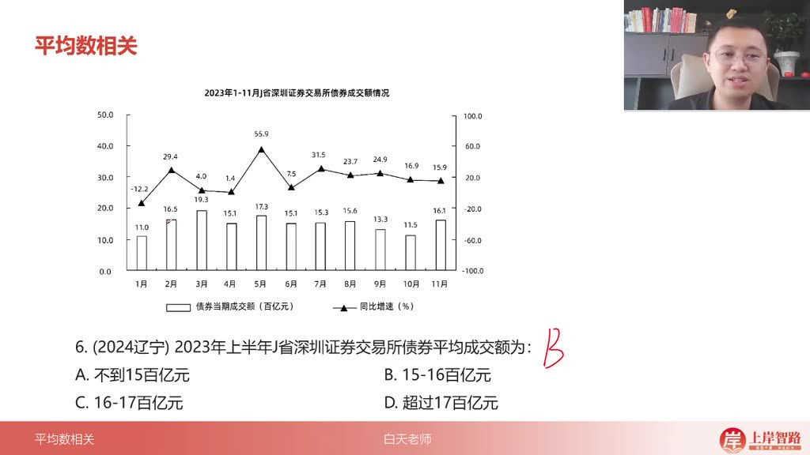

    -   常规解法

        ：

        -   上半年均值=1-6 月数据总和 ÷6
        -   快速求和技巧：配对凑整（29.4+31.5≈60，23.7+24.9≈48，15.9+30.0≈46）

    -   削峰填谷法

        ：

        -   排除法：先排除 A（仅 1 月<15）、D（仅 3 月>17）
        -   基准值测试：以 16 为基准，总体偏差=(-5)+(-1)+(-1)+3+1+1=-2→ 实际均值 ≈15.67

    -   关键提醒：图表中需注意区分"债券当期成交额（百亿元）"和"同比增速(%)"两列数据

-   例题：平均每个村委会下辖的村民小组数

    17:40

    -   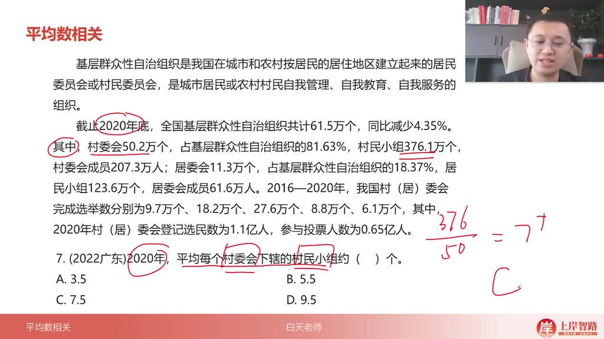

    -   计算要点

        ：

        -   分子：村民小组总数 376.1 万个
        -   分母：村委会数量 50.2 万个
        -   速算技巧：376÷50≈7.5（选项有明显差距时可估算）

    -   易错点：注意区分"村委会"与"居委会"数据，题干明确要求村委会相关计算

-   例题：实缴职工的人均实缴住房公积金

    19:18

    -   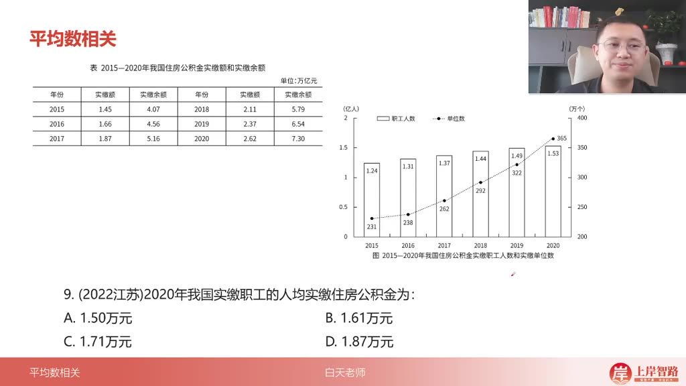

    -   概念辨析

        ：

        -   实缴额（2.62 万亿）：当期实际缴纳金额
        -   实缴余额（7.30 万亿）：累计结余金额（本题不使用）

    -   修正计算法

        ：

        -   原式：2.62÷1.53
        -   调整：(2.62-0.04)÷(1.53-0.03)=2.58÷1.5≈1.72

    -   单位注意：保持"万亿元"与"亿人"单位对应，最终结果转换为万元/人

-   例题：平均每公顷产值

    21:08

    -   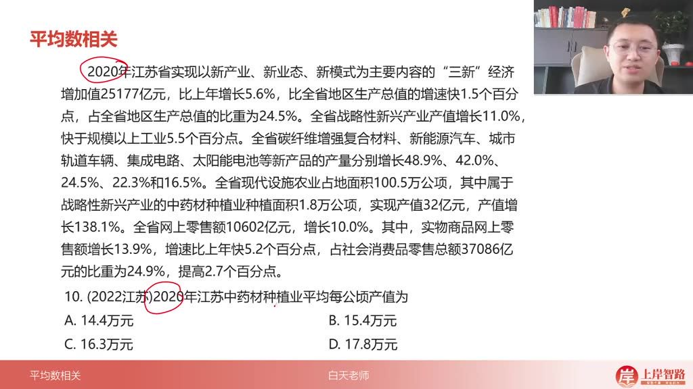

    -   题目解析

        -   审题关键：计算 2020 年江苏中药材种植业平均每公顷产值，需明确"产值/面积"的计算逻辑

        -   数据定位：根据字幕提示，在材料中找到"中药材种植业种植面积 1.8 万公顷，实现产值 32 亿元"

        -   计算技巧

            ：

            -   直接使用 32 亿元 ÷1.8 万公顷计算
            -   单位简化：选项无十倍关系时可忽略单位换算
            -   速算方法：32÷1.8≈17.8（通过试商法验证：1.8×9=16.2，余数 0.8×9=7.2）

        -   答案验证：计算结果接近 17.8 万元/公顷

        -   正确答案：D.17.8 万元

-   例题：平均打掉犯罪团伙数

    22:02

    -   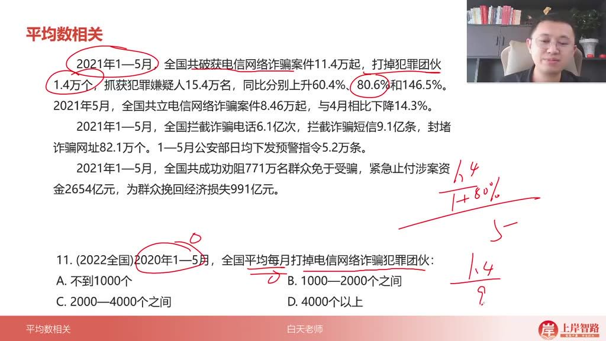

    -   题目解析

        -   时间范围：2020 年 1-5 月（基期）→ 需用 2021 年数据反推

        -   核心公式

            ：基期平均数=

            现期量 1+增长率 ÷ 月份数\frac{现期量}{1+增长率}÷ 月份数 1+增长率现期量 ÷ 月份数

        -   计算步骤

            ：

            -   基期总量：1.4 万个 ÷(1+80.6%)=1.4÷1.806≈0.775 万个
            -   月平均值：0.775 万 ÷5≈0.155 万=1550 个

        -   选项判断：1550 个落在 1000-2000 区间

        -   速算技巧

            ：

            -   近似处理：1.4÷1.8≈0.777...
            -   数量级转换：0.777 万 ÷5=1554 个

        -   易错提醒：注意"同比上升 80.6%"对应的是增长率而非倍数

        -   正确答案：B.1000-2000 个之间

-   例题:平均每家证券公司营业收入

    23:59

    -   解题思路

        -   速算原理

            : 当选项差距较大时，可采用近似计算法。原式为

            1018.941.5447×131\frac{1018.94}{1.5447 \times 131}1.5447×1311018.94

            ，简化为

            10001.5×1.4\frac{1000}{1.5 \times 1.4}1.5×1.41000

            进行估算

        -   近似技巧

            :

            -   分子取整：将 1018.94 亿元近似为 1000 亿元（数量级处理）

            -   分母分解：

                1.54×1.311.54 \times 1.311.54×1.31

                近似为

                1.5×1.41.5 \times 1.41.5×1.4

                （左边取小右边取大）

            -   快速计算：

                1.5×1.4=1.4+0.7=2.11.5 \times 1.4 = 1.4 + 0.7 = 2.11.5×1.4=1.4+0.7=2.1

                （利用 1.5 倍等于原数加半数的特性）

    -   计算过程

        -   核心步骤

            :

            -   11.5×1.4=12.1≈0.5\frac{1}{1.5 \times 1.4} = \frac{1}{2.1} \approx 0.51.5×1.41=2.11≈0.5

            -   原式

                ≈1000×0.5=500\approx 1000 \times 0.5 = 500≈1000×0.5=500

                （亿元）

            -   注意数量级调整：实际结果为

                500131≈5.0 $/\frac{500}{131}$ \approx 5.0131500≈5.0

                亿元

        -   验证方法

            : 通过反向验证

            5×131=6555 \times 131 = 6555×131=655

            亿元，与 2018 年营收

            1018.94÷1.5447≈6601018.94 \div 1.5447 \approx 6601018.94÷1.5447≈660

            亿元基本吻合

    -   例题解析

        -   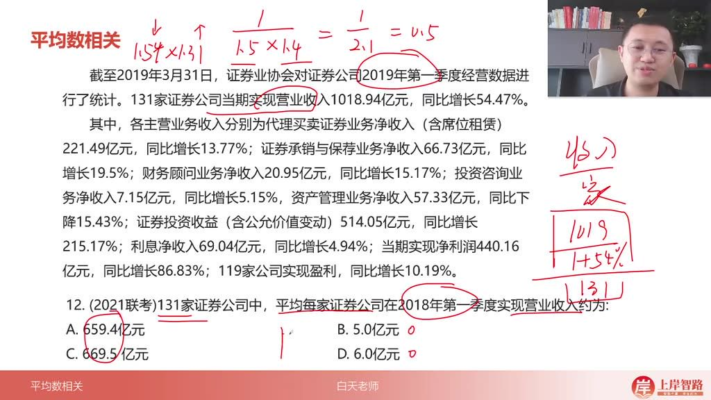

        -   选项分析

            :

            -   A 选项 659.4 亿元：误将总数作为平均值
            -   B 选项 5.0 亿元：正确计算结果
            -   C 选项 669.5 亿元：数量级和计算值双重错误
            -   D 选项 6.0 亿元：未考虑同比增长率影响

        -   答案确认: 通过速算验证应选 B 选项

        -   易错警示

            :

            -   注意区分"总额"与"平均值"的数量级差异
            -   增长率计算时需明确基期与报告期关系
            -   近似计算时保持变形的对称性（左小右大原则）

-   例题:平均每名从业人员人均收入

    25:33

    -   两期平均数比较方法

        -   判断标准

            ：当现期平均数高于基期平均数时，需满足

            a>ba > ba>b

            ，其中 a 为分子指标（收入）增长率，b 为分母指标（从业人员）增长率

        -   应用示例：新闻出版行业收入增速 6.8% > 从业人员增速-0.7%，符合条件；广播影视行业 9.5% > 2.3%，符合条件

        -   快速验证：直接对比表格中"同比增长(%)"两列数据，无需复杂计算

    -   例题解析

        -   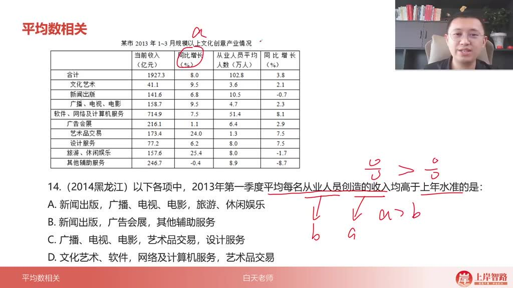

        -   题目解析

            -   审题要点

                ：需找出所有子行业均满足

                a>ba > ba>b

                的选项

            -   选项分析

                ：

                -   A 选项：新闻出版(6.8%>-0.7%)、广播影视(9.5%>2.3%)、旅游休闲(25.4%>-1.7%)全部符合
                -   B 选项：其他辅助服务(-0.4%>-8.7%)虽满足但广告会展(1.1%>2.9%)不满足
                -   C 选项：设计服务(6.2%>7.5%)不满足
                -   D 选项：软件服务(7.5%>8.1%)不满足

            -   答案：A

            -   技巧：发现一个选项全部符合即可直接选择，无需验证其他选项

-   例题:平均每场演出收入变化

    29:57

    -   两期平均数变化计算

        -   计算公式

            ：

            Δ=ab×a−b1+a\Delta = \frac{a}{b} \times \frac{a-b}{1+a}Δ=ba×1+aa−b

            ，其中 a 为收入增长率，b 为场次增长率

        -   单位转换：86.63 亿元需转换为 866300 万元，与 226 万场次单位"万"相抵消

        -   简化计算

            ：先估算

            866226≈4000 $/\frac{866}{226}$ ≈4000226866≈4000

            元/场，再计算

            −7.7%0.7≈−11%\frac{-7.7\%}{0.7}≈-11\%0.7−7.7%≈−11%

    -   例题解析

        -   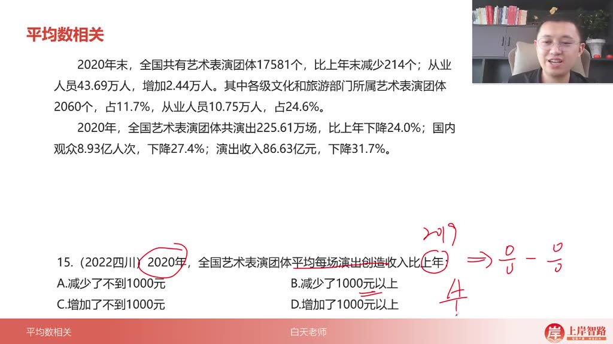

        -   题目解析

            -   计算过程

                ：

                -   确定

                    a=−31.7%a=-31.7\%a=−31.7%

                    ，

                    b=−24%b=-24\%b=−24%

                -   计算

                    a−b=−7.7%a-b=-7.7\%a−b=−7.7%

                    ，

                    1+a=68.3%1+a=68.3\%1+a=68.3%

                -   估算 4000×(-11%)=-440 元

            -   选项判断

                ：

                -   负值排除 C、D
                -   440 元<1000 元，选 A

            -   速算技巧：先观察数量级和正负，再估算具体数值范围

#### 二、知识小结

| 知识点               | 核心内容                                                   | 考试重点/易混淆点                                                  | 难度系数 |
| -------------------- | ---------------------------------------------------------- | ------------------------------------------------------------------ | -------- |
| 现期平均数           | 时间一致，用总值除以份数（后除前），如“均/平均每单位”      | 区分分子分母（后除前），求总值=平均数 × 份数，求份数=总值 ÷ 平均数 | ⭐⭐     |
| 基期平均数           | 过去时间的平均数，公式：大 A÷ 大 B×(1+b)÷(1+a)             | 与基期比重公式相同，注意时间对应关系                               | ⭐⭐⭐   |
| 两期平均数比较       | 现期平均数减基期平均数，结论：a>b 上升，a<b 下降，a=b 不变 | 单位需保留，先判断升降再计算，公式：a÷b×(a-b)÷(1+a)                | ⭐⭐⭐⭐ |
| 画线法（估算平均数） | 通过数据分布高度累加判断平均数位置（多量 ≈ 少量时为均值）  | 适用于图表题，快速排除选项（如第一题、第二题）                     | ⭐⭐     |
| 削峰填谷法           | 假设某值为平均数，比较多余和不足量（如第三题、第六题）     | 多量＞少量时，实际均值＞假设值                                     | ⭐⭐⭐   |
| 三位数乘法修正       | 如第五题：37303×773≈(37303+27)×(773-13.5)→360×800          | 适用于大数乘法，注意倍数关系调整                                   | ⭐⭐⭐⭐ |
| 单位与数量级处理     | 如第八题（公顷与立方米）、第十题（产值/公顷）              | 选项无倍数关系时可忽略单位转换                                     | ⭐⭐     |
| 两期平均数计算       | 如第十五题：先算现期与基期差值，注意负增长（a-b 为负）     | 公式中 a-b 符号决定升降，结果需带单位                              | ⭐⭐⭐⭐ |
